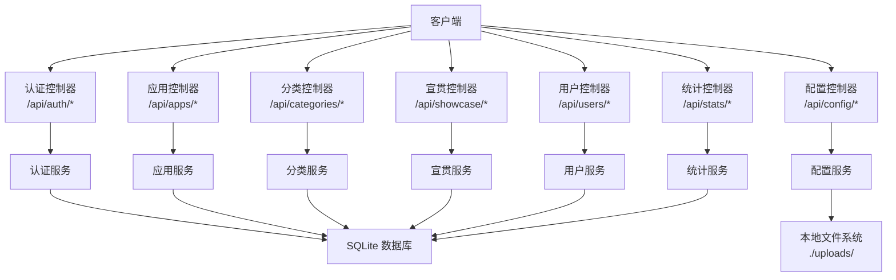
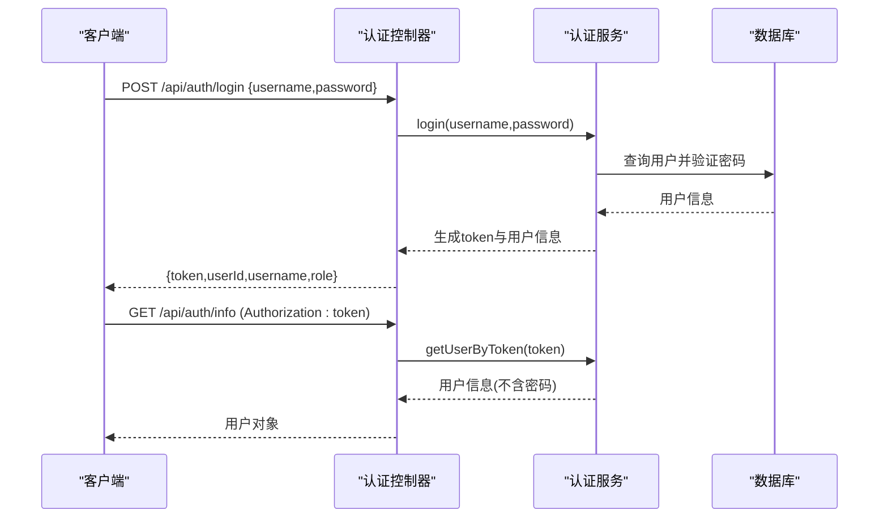
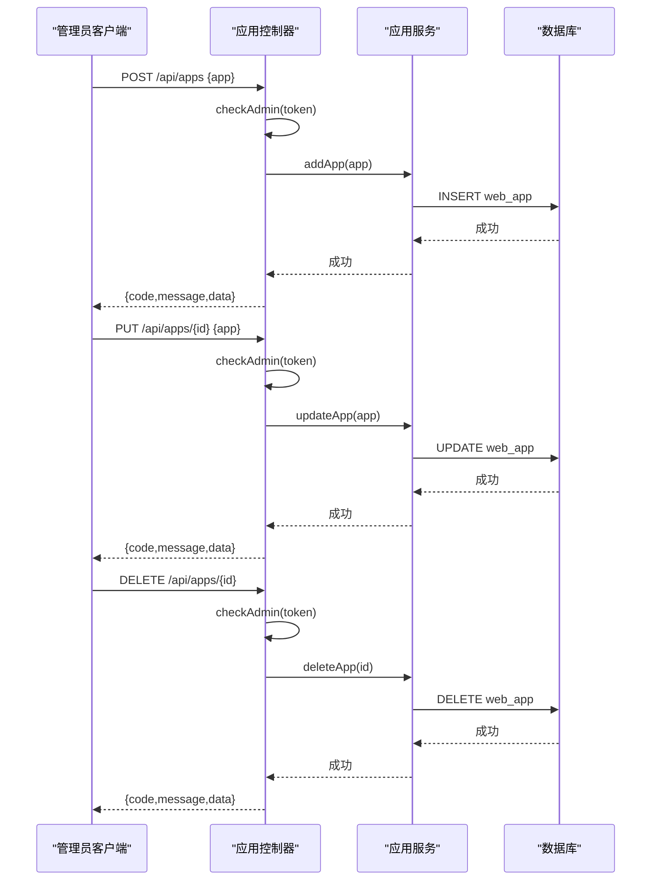
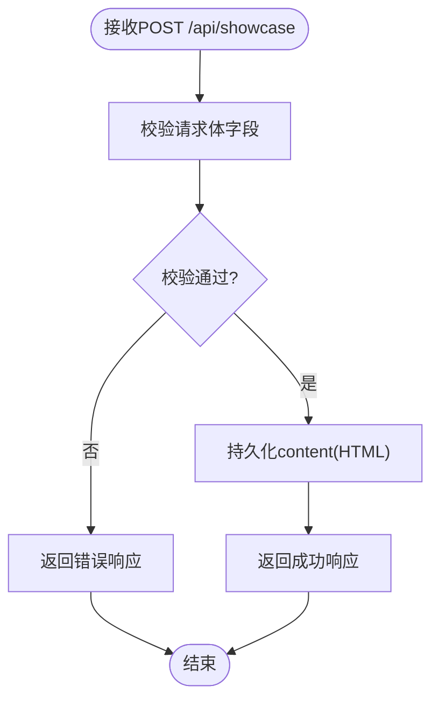
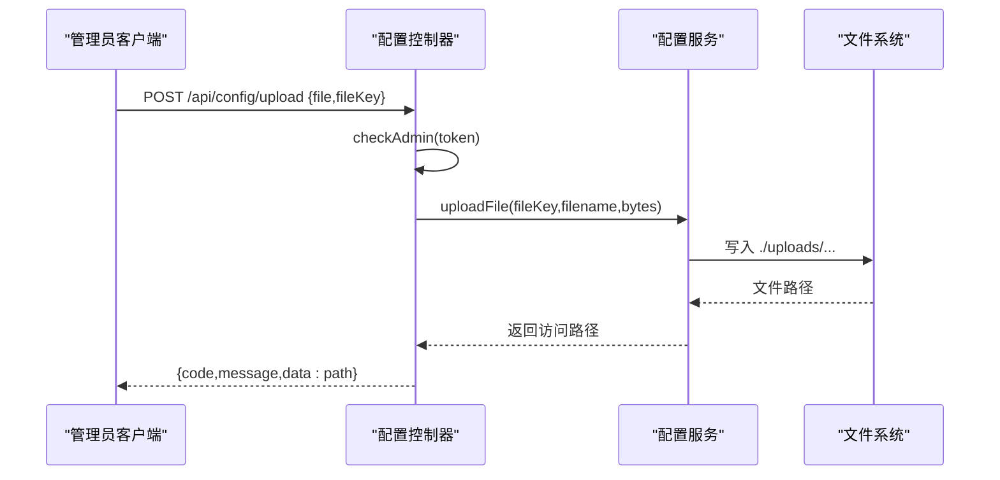
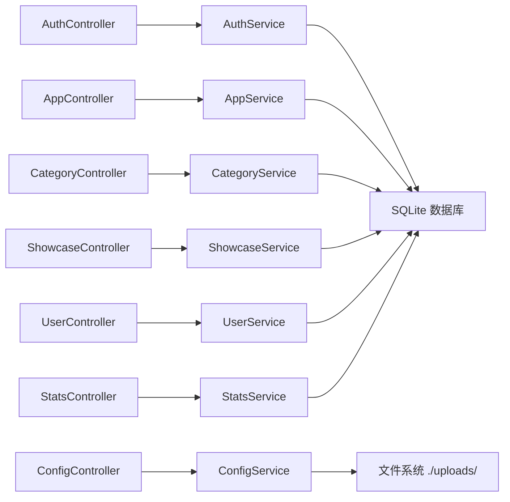

# API接口文档

<cite>
**本文引用的文件**   
- [API.md](file://API.md)
- [AuthController.java](file://backend/src/main/java/com/xx/platform/controller/AuthController.java)
- [AppController.java](file://backend/src/main/java/com/xx/platform/controller/AppController.java)
- [CategoryController.java](file://backend/src/main/java/com/xx/platform/controller/CategoryController.java)
- [ConfigController.java](file://backend/src/main/java/com/xx/platform/controller/ConfigController.java)
- [ShowcaseController.java](file://backend/src/main/java/com/xx/platform/controller/ShowcaseController.java)
- [UserController.java](file://backend/src/main/java/com/xx/platform/controller/UserController.java)
- [StatsController.java](file://backend/src/main/java/com/xx/platform/controller/StatsController.java)
- [Result.java](file://backend/src/main/java/com/xx/platform/common/Result.java)
- [GlobalExceptionHandler.java](file://backend/src/main/java/com/xx/platform/common/GlobalExceptionHandler.java)
- [application.yml](file://backend/src/main/resources/application.yml)
- [schema.sql](file://backend/src/main/resources/schema.sql)
</cite>

## 目录
1. [简介](#简介)
2. [项目结构](#项目结构)
3. [核心组件](#核心组件)
4. [架构总览](#架构总览)
5. [详细接口说明](#详细接口说明)
6. [依赖关系分析](#依赖关系分析)
7. [性能与速率限制](#性能与速率限制)
8. [错误处理策略](#错误处理策略)
9. [安全考虑](#安全考虑)
10. [版本信息](#版本信息)
11. [常见用例与客户端实现指南](#常见用例与客户端实现指南)
12. [故障排查](#故障排查)
13. [结论](#结论)

## 简介
本文件为JZPlatform门户系统的后端RESTful API完整接口文档。系统基于Spring Boot构建，提供认证、应用管理、分类管理、宣贯数据、平台配置、用户管理与统计等能力。统一基础路径为/api，所有响应采用统一的JSON封装格式。

- 基础URL: http://localhost:8080/api
- 认证方式: 请求头 Authorization: {token}
- 统一响应格式: { code, message, data }

## 项目结构
后端采用分层架构：Controller层暴露HTTP接口，Service层承载业务逻辑，Mapper层对接数据库，Entity定义数据模型，Common提供通用结果封装与全局异常处理。配置文件包含服务端口、数据库连接、上传大小限制及MyBatis-Plus设置。

图表来源
- [AuthController.java:15-67](file://backend/src/main/java/com/xx/platform/controller/AuthController.java#L15-L67)
- [AppController.java:17-110](file://backend/src/main/java/com/xx/platform/controller/AppController.java#L17-L110)
- [CategoryController.java:16-77](file://backend/src/main/java/com/xx/platform/controller/CategoryController.java#L16-L77)
- [ShowcaseController.java:16-86](file://backend/src/main/java/com/xx/platform/controller/ShowcaseController.java#L16-L86)
- [ConfigController.java:19-75](file://backend/src/main/java/com/xx/platform/controller/ConfigController.java#L19-L75)
- [UserController.java:15-87](file://backend/src/main/java/com/xx/platform/controller/UserController.java#L15-L87)
- [StatsController.java:16-31](file://backend/src/main/java/com/xx/platform/controller/StatsController.java#L16-L31)
- [application.yml:1-29](file://backend/src/main/resources/application.yml#L1-L29)

章节来源
- [application.yml:1-29](file://backend/src/main/resources/application.yml#L1-L29)
- [schema.sql:1-80](file://backend/src/main/resources/schema.sql#L1-L80)

## 核心组件
- 统一响应体 Result<T>：封装code、message、data字段，提供success/error静态方法。
- 全局异常处理器 GlobalExceptionHandler：捕获RuntimeException与Exception，返回友好提示。
- 配置 application.yml：服务端口、SQLite路径、上传大小限制、MyBatis-Plus映射与日志输出。
- 数据库 schema.sql：用户、分类、应用、宣贯项、平台配置表结构与初始数据。

章节来源
- [Result.java:1-53](file://backend/src/main/java/com/xx/platform/common/Result.java#L1-L53)
- [GlobalExceptionHandler.java:1-30](file://backend/src/main/java/com/xx/platform/common/GlobalExceptionHandler.java#L1-L30)
- [application.yml:1-29](file://backend/src/main/resources/application.yml#L1-L29)
- [schema.sql:1-80](file://backend/src/main/resources/schema.sql#L1-L80)

## 架构总览
下图展示各控制器的职责与调用关系，以及权限校验在控制器内的实现位置。

```mermaid
classDiagram
class AuthController {
+login(params) Result<Map>
+logout() Result<Void>
+getUserInfo(token) Result<SysUser>
}
class AppController {
+list(page,size,categoryId,keyword,sortField,sortOrder) Result<Page>
+detail(id) Result<WebApp>
+add(app, token) Result<Void>
+update(id, app, token) Result<Void>
+delete(id, token) Result<Void>
+click(id) Result<Void>
-checkAdmin(token) void
}
class CategoryController {
+list() Result<List<AppCategory>>
+add(category, token) Result<Void>
+update(id, category, token) Result<Void>
+delete(id, token) Result<Void>
-checkAdmin(token) void
}
class ShowcaseController {
+list(category) Result<List<ShowcaseItem>>
+detail(id) Result<ShowcaseItem>
+add(item, token) Result<Void>
+update(id, item, token) Result<Void>
+delete(id, token) Result<Void>
-checkAdmin(token) void
}
class ConfigController {
+getAll() Result<List<PlatformConfig>>
+update(configs, token) Result<Void>
+upload(file,fileKey,token) Result<String>
-checkAdmin(token) void
}
class UserController {
+list(page,size,token) Result<Page<SysUser>>
+add(user, token) Result<Void>
+update(id, user, token) Result<Void>
+delete(id, token) Result<Void>
-checkAdmin(token) void
}
class StatsController {
+overview() Result<Map>
}
```

图表来源
- [AuthController.java:15-67](file://backend/src/main/java/com/xx/platform/controller/AuthController.java#L15-L67)
- [AppController.java:17-110](file://backend/src/main/java/com/xx/platform/controller/AppController.java#L17-L110)
- [CategoryController.java:16-77](file://backend/src/main/java/com/xx/platform/controller/CategoryController.java#L16-L77)
- [ShowcaseController.java:16-86](file://backend/src/main/java/com/xx/platform/controller/ShowcaseController.java#L16-L86)
- [ConfigController.java:19-75](file://backend/src/main/java/com/xx/platform/controller/ConfigController.java#L19-L75)
- [UserController.java:15-87](file://backend/src/main/java/com/xx/platform/controller/UserController.java#L15-L87)
- [StatsController.java:16-31](file://backend/src/main/java/com/xx/platform/controller/StatsController.java#L16-L31)

## 详细接口说明

### 通用约定
- 基础URL: /api
- 认证方式: 请求头 Authorization: {token}
- 统一响应体: { code, message, data }
- 分页参数: page（默认1）、size（默认值见具体接口）
- 排序参数: sortField（如 clickCount/name）、sortOrder（asc/desc）

章节来源
- [API.md:1-6](file://API.md#L1-L6)
- [Result.java:1-53](file://backend/src/main/java/com/xx/platform/common/Result.java#L1-L53)

### 认证模块
- 登录
  - 方法: POST
  - URL: /api/auth/login
  - 请求体: { username, password }
  - 响应: { token, userId, username, role }
  - 说明: 成功后客户端保存token并在后续请求中携带Authorization头
- 登出
  - 方法: POST
  - URL: /api/auth/logout
  - 需要认证: 是
  - 说明: 服务端无状态，客户端清除本地token即可
- 获取当前用户信息
  - 方法: GET
  - URL: /api/auth/info
  - 需要认证: 是
  - 响应: 用户对象（不含密码）

章节来源
- [AuthController.java:22-66](file://backend/src/main/java/com/xx/platform/controller/AuthController.java#L22-L66)
- [API.md:9-24](file://API.md#L9-L24)

#### 认证流程时序图

图表来源
- [AuthController.java:22-66](file://backend/src/main/java/com/xx/platform/controller/AuthController.java#L22-L66)

### 用户管理（仅管理员）
- 用户列表
  - 方法: GET
  - URL: /api/users?page=1&size=10
  - 需要认证: ADMIN
- 新增用户
  - 方法: POST
  - URL: /api/users
  - 请求体: { username, password, role }
- 编辑用户
  - 方法: PUT
  - URL: /api/users/{id}
  - 请求体: { username, password, role }
- 删除用户
  - 方法: DELETE
  - URL: /api/users/{id}

章节来源
- [UserController.java:25-86](file://backend/src/main/java/com/xx/platform/controller/UserController.java#L25-L86)
- [API.md:27-44](file://API.md#L27-L44)

### Web应用管理
- 应用列表（公开）
  - 方法: GET
  - URL: /api/apps?page=1&size=12&categoryId=1&keyword=xxx&sortField=clickCount&sortOrder=desc
  - 参数: page、size、categoryId、keyword、sortField、sortOrder
- 应用详情（公开）
  - 方法: GET
  - URL: /api/apps/{id}
- 新增应用（管理员）
  - 方法: POST
  - URL: /api/apps
  - 请求体: { name, description, categoryId, coverImage, version, detail, url, sortOrder, status }
- 编辑应用（管理员）
  - 方法: PUT
  - URL: /api/apps/{id}
- 删除应用（管理员）
  - 方法: DELETE
  - URL: /api/apps/{id}
- 记录点击（公开）
  - 方法: POST
  - URL: /api/apps/{id}/click

章节来源
- [AppController.java:27-96](file://backend/src/main/java/com/xx/platform/controller/AppController.java#L27-L96)
- [API.md:46-87](file://API.md#L46-L87)

#### 应用CRUD序列图

图表来源
- [AppController.java:55-86](file://backend/src/main/java/com/xx/platform/controller/AppController.java#L55-L86)

### 应用分类
- 分类列表（公开）
  - 方法: GET
  - URL: /api/categories
- 新增分类（管理员）
  - 方法: POST
  - URL: /api/categories
  - 请求体: { name, sortOrder }
- 编辑分类（管理员）
  - 方法: PUT
  - URL: /api/categories/{id}
- 删除分类（管理员）
  - 方法: DELETE
  - URL: /api/categories/{id}

章节来源
- [CategoryController.java:26-76](file://backend/src/main/java/com/xx/platform/controller/CategoryController.java#L26-L76)
- [API.md:89-103](file://API.md#L89-L103)

### 宣贯数据（富文本支持）
- 宣贯项列表（公开）
  - 方法: GET
  - URL: /api/showcase?category=USER_ECOLOGY
  - category可选值: USER_ECOLOGY / PRODUCT_SYSTEM / MODEL_SYSTEM / DATA_SYSTEM / IP
- 宣贯项详情（公开）
  - 方法: GET
  - URL: /api/showcase/{id}
- 新增宣贯项（管理员）
  - 方法: POST
  - URL: /api/showcase
  - 请求体: { category, title, summary, content, sortOrder }
  - 说明: content字段可包含HTML富文本内容
- 编辑宣贯项（管理员）
  - 方法: PUT
  - URL: /api/showcase/{id}
- 删除宣贯项（管理员）
  - 方法: DELETE
  - URL: /api/showcase/{id}

章节来源
- [ShowcaseController.java:26-85](file://backend/src/main/java/com/xx/platform/controller/ShowcaseController.java#L26-L85)
- [API.md:106-133](file://API.md#L106-L133)
- [schema.sql:39-49](file://backend/src/main/resources/schema.sql#L39-L49)

#### 富文本处理流程图

图表来源
- [ShowcaseController.java:48-54](file://backend/src/main/java/com/xx/platform/controller/ShowcaseController.java#L48-L54)

### 平台配置（动态设置）
- 获取所有配置（公开）
  - 方法: GET
  - URL: /api/config
  - 响应: 配置项数组 [{ configKey, configValue, description }, ...]
- 批量更新配置（管理员）
  - 方法: PUT
  - URL: /api/config
  - 请求体: { platform_name: "新名称", company_name: "新公司名", ... }
- 上传文件（管理员）
  - 方法: POST
  - URL: /api/config/upload
  - Content-Type: multipart/form-data
  - 参数: file（文件）、fileKey（配置key: logo_path / bg_image）
  - 响应: 文件访问路径

章节来源
- [ConfigController.java:29-68](file://backend/src/main/java/com/xx/platform/controller/ConfigController.java#L29-L68)
- [API.md:136-152](file://API.md#L136-L152)
- [application.yml:9-13](file://backend/src/main/resources/application.yml#L9-L13)

#### 文件上传序列图

图表来源
- [ConfigController.java:57-68](file://backend/src/main/java/com/xx/platform/controller/ConfigController.java#L57-L68)

### 统计数据（聚合计算）
- 总览统计（公开）
  - 方法: GET
  - URL: /api/stats/overview
  - 响应示例: { appCount, totalClicks, userCount, categoryCount, categoryStats, topApps }

章节来源
- [StatsController.java:23-30](file://backend/src/main/java/com/xx/platform/controller/StatsController.java#L23-L30)
- [API.md:154-170](file://API.md#L154-L170)

## 依赖关系分析
- 控制器依赖各自的服务接口进行业务处理；管理类接口在控制器内通过AuthService校验管理员角色。
- 配置上传依赖本地文件系统路径（由application.yml的upload.path指定）。
- 数据库使用SQLite，表结构由schema.sql初始化。

图表来源
- [AuthController.java:15-67](file://backend/src/main/java/com/xx/platform/controller/AuthController.java#L15-L67)
- [AppController.java:17-110](file://backend/src/main/java/com/xx/platform/controller/AppController.java#L17-L110)
- [CategoryController.java:16-77](file://backend/src/main/java/com/xx/platform/controller/CategoryController.java#L16-L77)
- [ShowcaseController.java:16-86](file://backend/src/main/java/com/xx/platform/controller/ShowcaseController.java#L16-L86)
- [ConfigController.java:19-75](file://backend/src/main/java/com/xx/platform/controller/ConfigController.java#L19-L75)
- [UserController.java:15-87](file://backend/src/main/java/com/xx/platform/controller/UserController.java#L15-L87)
- [StatsController.java:16-31](file://backend/src/main/java/com/xx/platform/controller/StatsController.java#L16-L31)
- [application.yml:27-29](file://backend/src/main/resources/application.yml#L27-L29)

## 性能与速率限制
- 分页与筛选
  - 应用列表支持page、size、categoryId、keyword、sortField、sortOrder，建议合理设置size避免过大响应。
- 统计接口
  - overview聚合计算涉及多表统计，建议在后台定时任务或缓存层优化热点指标。
- 文件上传
  - 最大文件大小受application.yml的multipart.max-file-size与max-request-size限制（默认10MB），请根据业务调整。
- 速率限制
  - 当前未实现限流策略，生产环境建议引入网关或中间件进行限流与熔断。

章节来源
- [application.yml:9-13](file://backend/src/main/resources/application.yml#L9-L13)
- [AppController.java:31-40](file://backend/src/main/java/com/xx/platform/controller/AppController.java#L31-L40)
- [StatsController.java:27-30](file://backend/src/main/java/com/xx/platform/controller/StatsController.java#L27-L30)

## 错误处理策略
- 统一响应体
  - 成功: code=200, message="操作成功", data=...
  - 失败: code=500或自定义码, message=错误描述, data=null
- 全局异常
  - RuntimeException: 返回业务异常消息
  - Exception: 返回“服务器内部错误”并打印堆栈
- 认证相关
  - 未登录: 返回401与相应消息
  - 过期或未找到用户: 返回401与相应消息

章节来源
- [Result.java:23-51](file://backend/src/main/java/com/xx/platform/common/Result.java#L23-L51)
- [GlobalExceptionHandler.java:16-28](file://backend/src/main/java/com/xx/platform/common/GlobalExceptionHandler.java#L16-L28)
- [AuthController.java:55-66](file://backend/src/main/java/com/xx/platform/controller/AuthController.java#L55-L66)

## 安全考虑
- 认证与授权
  - 管理类接口均要求ADMIN角色，控制器内通过AuthService.getUserByToken校验。
- Token机制
  - 当前为简单令牌模式，服务端无状态，客户端负责存储与传递Authorization头。
- 输入校验
  - 登录接口对用户名与密码进行非空校验；其他接口建议增加更严格的参数校验与白名单过滤。
- 文件上传
  - 建议对文件类型、大小、命名进行严格校验，防止恶意文件注入。
- 传输安全
  - 生产环境建议使用HTTPS，避免明文传输token与敏感数据。

章节来源
- [AppController.java:98-109](file://backend/src/main/java/com/xx/platform/controller/AppController.java#L98-L109)
- [CategoryController.java:72-76](file://backend/src/main/java/com/xx/platform/controller/CategoryController.java#L72-L76)
- [ShowcaseController.java:81-85](file://backend/src/main/java/com/xx/platform/controller/ShowcaseController.java#L81-L85)
- [ConfigController.java:70-74](file://backend/src/main/java/com/xx/platform/controller/ConfigController.java#L70-L74)
- [UserController.java:78-86](file://backend/src/main/java/com/xx/platform/controller/UserController.java#L78-L86)
- [AuthController.java:28-37](file://backend/src/main/java/com/xx/platform/controller/AuthController.java#L28-L37)

## 版本信息
- 当前版本: v1.0
- 基础路径: /api
- 协议: HTTP/1.1
- 字符编码: UTF-8
- 前端代理: 开发环境下Vite将/api转发至后端8080端口

章节来源
- [API.md:1-6](file://API.md#L1-L6)
- [application.yml:1-2](file://backend/src/main/resources/application.yml#L1-L2)

## 常见用例与客户端实现指南
- 登录与鉴权
  - 登录后保存token，在后续请求头添加Authorization: {token}
  - 登出时清除本地token
- 应用管理
  - 列表查询支持分页、筛选与排序；详情用于渲染详情页
  - 点击计数接口可在用户跳转前异步调用
- 分类管理
  - 分类列表用于下拉选择；增删改需管理员权限
- 宣贯数据
  - 列表按category过滤；详情中的content可能包含HTML，需在客户端进行安全渲染
- 平台配置
  - 获取配置用于动态展示平台名称、Logo与底图
  - 上传文件后更新对应configKey的值
- 用户管理
  - 管理员对用户进行增删改查，注意密码字段的安全处理

章节来源
- [API.md:9-170](file://API.md#L9-L170)
- [AppController.java:31-96](file://backend/src/main/java/com/xx/platform/controller/AppController.java#L31-L96)
- [CategoryController.java:30-70](file://backend/src/main/java/com/xx/platform/controller/CategoryController.java#L30-L70)
- [ShowcaseController.java:30-79](file://backend/src/main/java/com/xx/platform/controller/ShowcaseController.java#L30-L79)
- [ConfigController.java:33-68](file://backend/src/main/java/com/xx/platform/controller/ConfigController.java#L33-L68)
- [UserController.java:29-73](file://backend/src/main/java/com/xx/platform/controller/UserController.java#L29-L73)

## 故障排查
- 无法登录
  - 检查用户名与密码是否正确；确认数据库已初始化且存在admin账户
- 401未登录或过期
  - 确认请求头是否携带正确的Authorization；检查token是否有效
- 上传失败
  - 检查文件大小是否超过限制；确认uploads目录存在且有写权限
- 统计接口慢
  - 评估数据量与索引情况；考虑缓存或预聚合

章节来源
- [AuthController.java:28-37](file://backend/src/main/java/com/xx/platform/controller/AuthController.java#L28-L37)
- [application.yml:9-13](file://backend/src/main/resources/application.yml#L9-L13)
- [schema.sql:59-66](file://backend/src/main/resources/schema.sql#L59-L66)

## 结论
本API文档覆盖了JZPlatform门户系统的核心接口与关键实现细节，包括认证、应用与分类管理、宣贯数据、平台配置、用户管理与统计。通过统一响应体与全局异常处理，提升了接口的稳定性与可维护性。生产部署建议补充HTTPS、限流、输入校验与文件安全策略，并对统计类接口进行性能优化。