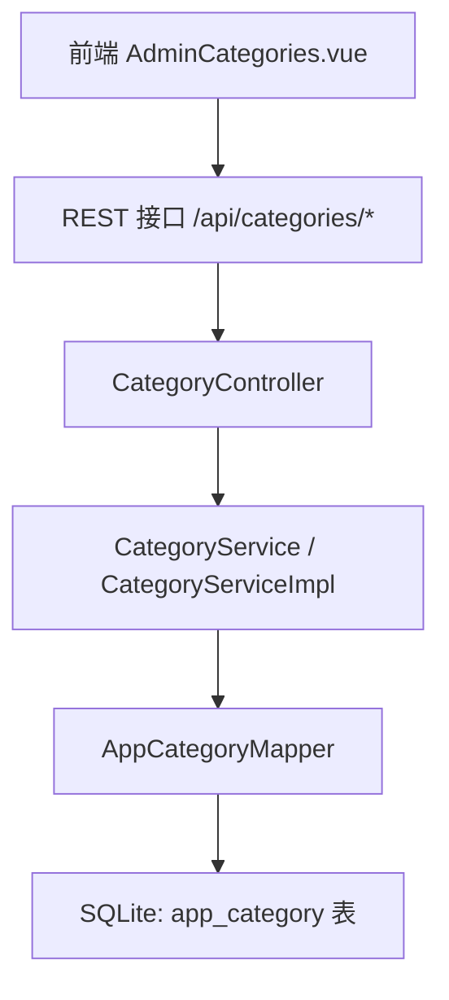
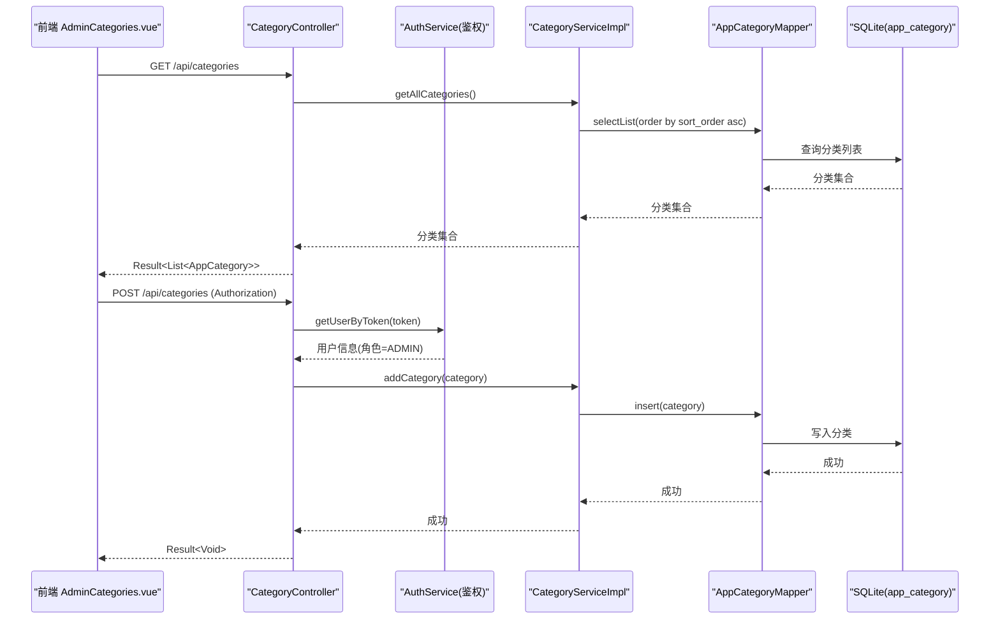
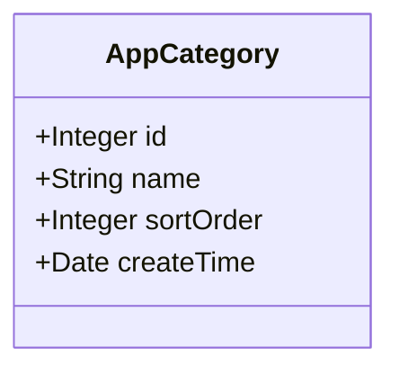
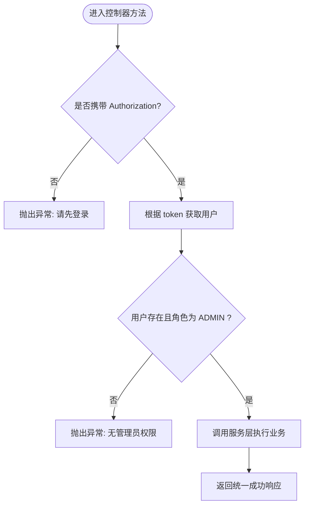
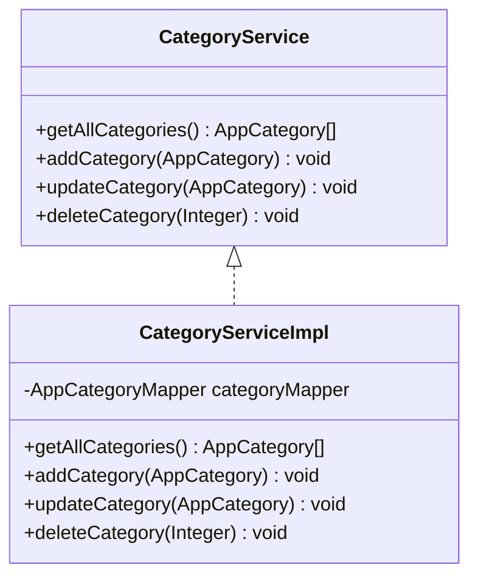
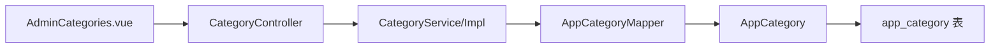
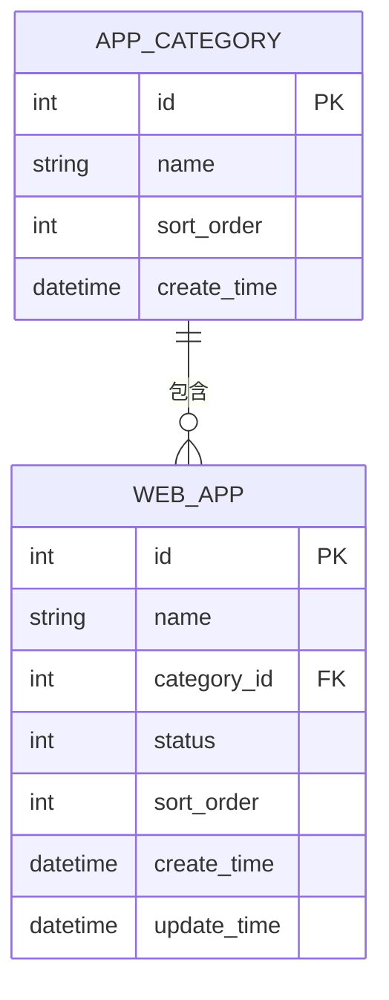

# 分类管理接口

<cite>
**本文引用的文件**
- [CategoryController.java](file://backend/src/main/java/com/xx/platform/controller/CategoryController.java)
- [CategoryService.java](file://backend/src/main/java/com/xx/platform/service/CategoryService.java)
- [CategoryServiceImpl.java](file://backend/src/main/java/com/xx/platform/service/impl/CategoryServiceImpl.java)
- [AppCategoryMapper.java](file://backend/src/main/java/com/xx/platform/mapper/AppCategoryMapper.java)
- [AppCategory.java](file://backend/src/main/java/com/xx/platform/entity/AppCategory.java)
- [WebApp.java](file://backend/src/main/java/com/xx/platform/entity/WebApp.java)
- [schema.sql](file://backend/src/main/resources/schema.sql)
- [AdminCategories.vue](file://frontend/src/views/admin/AdminCategories.vue)
- [API.md](file://API.md)
</cite>

## 目录
1. [简介](#简介)
2. [项目结构](#项目结构)
3. [核心组件](#核心组件)
4. [架构总览](#架构总览)
5. [详细组件分析](#详细组件分析)
6. [依赖关系分析](#依赖关系分析)
7. [性能与扩展性](#性能与扩展性)
8. [故障排查指南](#故障排查指南)
9. [结论](#结论)
10. [附录：接口定义与数据模型](#附录接口定义与数据模型)

## 简介
本文件为 JZPlatform 门户系统“应用分类管理”模块的 API 接口文档，覆盖分类列表获取、新增、编辑、删除等增删改查能力；说明分类数据模型 AppCategory 的字段定义与业务规则；记录分类与应用之间的关联关系和数据完整性约束；并提供分类层级管理的接口设计思路与扩展方案，以及排序、状态管理等业务逻辑的实现要点。

## 项目结构
后端采用 Spring Boot + MyBatis-Plus 分层架构：控制器负责路由与鉴权校验，服务层封装业务逻辑，数据访问层通过 Mapper 操作数据库。前端提供分类管理页面，调用统一 API 完成分类的维护。

图表来源
- [CategoryController.java](file://backend/src/main/java/com/xx/platform/controller/CategoryController.java)
- [CategoryService.java](file://backend/src/main/java/com/xx/platform/service/CategoryService.java)
- [CategoryServiceImpl.java](file://backend/src/main/java/com/xx/platform/service/impl/CategoryServiceImpl.java)
- [AppCategoryMapper.java](file://backend/src/main/java/com/xx/platform/mapper/AppCategoryMapper.java)
- [schema.sql](file://backend/src/main/resources/schema.sql)
- [AdminCategories.vue](file://frontend/src/views/admin/AdminCategories.vue)

章节来源
- [CategoryController.java](file://backend/src/main/java/com/xx/platform/controller/CategoryController.java)
- [CategoryService.java](file://backend/src/main/java/com/xx/platform/service/CategoryService.java)
- [CategoryServiceImpl.java](file://backend/src/main/java/com/xx/platform/service/impl/CategoryServiceImpl.java)
- [AppCategoryMapper.java](file://backend/src/main/java/com/xx/platform/mapper/AppCategoryMapper.java)
- [schema.sql](file://backend/src/main/resources/schema.sql)
- [AdminCategories.vue](file://frontend/src/views/admin/AdminCategories.vue)

## 核心组件
- 控制器：暴露分类相关 REST 接口，并执行管理员权限校验。
- 服务接口与实现：封装分类的查询、新增、更新、删除等业务逻辑。
- 数据访问层：基于 MyBatis-Plus 的 BaseMapper 提供基础 CRUD。
- 实体模型：AppCategory 映射到数据库表 app_category。
- 前端页面：AdminCategories.vue 提供分类的可视化维护界面。

章节来源
- [CategoryController.java](file://backend/src/main/java/com/xx/platform/controller/CategoryController.java)
- [CategoryService.java](file://backend/src/main/java/com/xx/platform/service/CategoryService.java)
- [CategoryServiceImpl.java](file://backend/src/main/java/com/xx/platform/service/impl/CategoryServiceImpl.java)
- [AppCategoryMapper.java](file://backend/src/main/java/com/xx/platform/mapper/AppCategoryMapper.java)
- [AppCategory.java](file://backend/src/main/java/com/xx/platform/entity/AppCategory.java)
- [AdminCategories.vue](file://frontend/src/views/admin/AdminCategories.vue)

## 架构总览
分类管理模块的请求链路如下：前端发起 HTTP 请求至控制器，控制器进行管理员鉴权后调用服务层，服务层通过 Mapper 访问数据库，返回结果经统一响应体包装后返回给前端。

图表来源
- [CategoryController.java](file://backend/src/main/java/com/xx/platform/controller/CategoryController.java)
- [CategoryServiceImpl.java](file://backend/src/main/java/com/xx/platform/service/impl/CategoryServiceImpl.java)
- [AppCategoryMapper.java](file://backend/src/main/java/com/xx/platform/mapper/AppCategoryMapper.java)
- [schema.sql](file://backend/src/main/resources/schema.sql)

## 详细组件分析

### 数据模型：AppCategory
- 字段定义
  - id：自增主键
  - name：分类名称（非空）
  - sortOrder：排序序号（默认 0）
  - createTime：创建时间（默认当前时间）
- 业务规则
  - 名称必填且唯一性由上层或数据库约束保障（当前 schema 未声明唯一）。
  - 排序序号用于列表展示顺序，越小越靠前。
  - 创建时间在新增时自动填充。

图表来源
- [AppCategory.java](file://backend/src/main/java/com/xx/platform/entity/AppCategory.java)
- [schema.sql](file://backend/src/main/resources/schema.sql)

章节来源
- [AppCategory.java](file://backend/src/main/java/com/xx/platform/entity/AppCategory.java)
- [schema.sql](file://backend/src/main/resources/schema.sql)

### 控制器：CategoryController
- 路由前缀：/api/categories
- 接口清单
  - 获取分类列表：GET /api/categories
  - 新增分类：POST /api/categories（需管理员）
  - 编辑分类：PUT /api/categories/{id}（需管理员）
  - 删除分类：DELETE /api/categories/{id}（需管理员）
- 鉴权逻辑
  - 从请求头 Authorization 读取 token
  - 通过 AuthService 解析用户，校验角色是否为 ADMIN
  - 无 token 或非管理员将抛出运行时异常（由全局异常处理器统一处理）

图表来源
- [CategoryController.java](file://backend/src/main/java/com/xx/platform/controller/CategoryController.java)

章节来源
- [CategoryController.java](file://backend/src/main/java/com/xx/platform/controller/CategoryController.java)

### 服务层：CategoryService 与 CategoryServiceImpl
- 能力
  - 获取所有分类：按 sortOrder 升序排列
  - 新增分类：设置创建时间并插入
  - 更新分类：按 ID 更新
  - 删除分类：按 ID 删除
- 复杂度
  - 列表查询 O(n)，排序在 SQL 层完成
  - 增删改均为 O(1) 单行操作

图表来源
- [CategoryService.java](file://backend/src/main/java/com/xx/platform/service/CategoryService.java)
- [CategoryServiceImpl.java](file://backend/src/main/java/com/xx/platform/service/impl/CategoryServiceImpl.java)

章节来源
- [CategoryService.java](file://backend/src/main/java/com/xx/platform/service/CategoryService.java)
- [CategoryServiceImpl.java](file://backend/src/main/java/com/xx/platform/service/impl/CategoryServiceImpl.java)

### 数据访问层：AppCategoryMapper
- 继承 MyBatis-Plus 的 BaseMapper，提供标准 CRUD 能力
- 查询使用 LambdaQueryWrapper 指定排序字段

章节来源
- [AppCategoryMapper.java](file://backend/src/main/java/com/xx/platform/mapper/AppCategoryMapper.java)
- [CategoryServiceImpl.java](file://backend/src/main/java/com/xx/platform/service/impl/CategoryServiceImpl.java)

### 前端：AdminCategories.vue
- 功能
  - 加载分类列表
  - 新增/编辑分类表单（名称、排序）
  - 删除确认与提示
- 交互
  - 调用 getCategories、addCategory、updateCategory、deleteCategory 等 API
  - 保存成功后刷新列表

章节来源
- [AdminCategories.vue](file://frontend/src/views/admin/AdminCategories.vue)

## 依赖关系分析
- 控制器依赖服务接口与鉴权服务
- 服务实现依赖 Mapper
- 实体与数据库表一一对应
- 前端依赖后端 REST 接口

图表来源
- [CategoryController.java](file://backend/src/main/java/com/xx/platform/controller/CategoryController.java)
- [CategoryService.java](file://backend/src/main/java/com/xx/platform/service/CategoryService.java)
- [CategoryServiceImpl.java](file://backend/src/main/java/com/xx/platform/service/impl/CategoryServiceImpl.java)
- [AppCategoryMapper.java](file://backend/src/main/java/com/xx/platform/mapper/AppCategoryMapper.java)
- [AppCategory.java](file://backend/src/main/java/com/xx/platform/entity/AppCategory.java)
- [schema.sql](file://backend/src/main/resources/schema.sql)

章节来源
- [CategoryController.java](file://backend/src/main/java/com/xx/platform/controller/CategoryController.java)
- [CategoryService.java](file://backend/src/main/java/com/xx/platform/service/CategoryService.java)
- [CategoryServiceImpl.java](file://backend/src/main/java/com/xx/platform/service/impl/CategoryServiceImpl.java)
- [AppCategoryMapper.java](file://backend/src/main/java/com/xx/platform/mapper/AppCategoryMapper.java)
- [AppCategory.java](file://backend/src/main/java/com/xx/platform/entity/AppCategory.java)
- [schema.sql](file://backend/src/main/resources/schema.sql)

## 性能与扩展性
- 性能
  - 列表查询使用数据库排序，适合中小规模数据
  - 建议对 sortOrder 建立索引以提升排序性能（若数据量增长）
- 扩展性
  - 可在服务层增加缓存（如本地缓存或 Redis）以减少热点读取压力
  - 可引入分页接口以支持大规模分类列表
  - 可增加软删除、审计字段（如 update_time、operator）增强可追溯性

[本节为通用建议，不直接分析具体文件]

## 故障排查指南
- 常见错误
  - 未携带 Authorization：抛出“请先登录”
  - 非管理员角色：抛出“无管理员权限”
  - 分类不存在：删除/更新可能失败（需在服务层补充存在性校验）
- 定位步骤
  - 检查请求头是否包含 Authorization
  - 确认 token 对应的用户角色是否为 ADMIN
  - 查看服务层日志与数据库记录是否存在对应分类

章节来源
- [CategoryController.java](file://backend/src/main/java/com/xx/platform/controller/CategoryController.java)

## 结论
分类管理模块提供了完整的增删改查能力，具备管理员鉴权、按排序展示等基础特性。当前实现简洁清晰，后续可按需扩展层级管理、状态管理、软删除与审计等功能，以满足更复杂的业务场景。

[本节为总结性内容，不直接分析具体文件]

## 附录：接口定义与数据模型

### 接口一览
- 获取分类列表（公开）
  - 方法：GET
  - 路径：/api/categories
  - 说明：返回按 sortOrder 升序的分类列表
- 新增分类（管理员）
  - 方法：POST
  - 路径：/api/categories
  - 请求体：{ "name": "分类名", "sortOrder": 0 }
  - 鉴权：需要 Authorization 头，角色为 ADMIN
- 编辑分类（管理员）
  - 方法：PUT
  - 路径：/api/categories/{id}
  - 请求体：同新增，包含 id 与待更新字段
  - 鉴权：需要 Authorization 头，角色为 ADMIN
- 删除分类（管理员）
  - 方法：DELETE
  - 路径：/api/categories/{id}
  - 鉴权：需要 Authorization 头，角色为 ADMIN

章节来源
- [CategoryController.java](file://backend/src/main/java/com/xx/platform/controller/CategoryController.java)
- [API.md](file://API.md)

### 数据模型：AppCategory
- 字段
  - id：整数，自增主键
  - name：字符串，非空
  - sortOrder：整数，默认 0
  - createTime：日期时间，默认当前时间

章节来源
- [AppCategory.java](file://backend/src/main/java/com/xx/platform/entity/AppCategory.java)
- [schema.sql](file://backend/src/main/resources/schema.sql)

### 分类与应用关联关系与完整性约束
- 关联关系
  - WebApp 表包含 categoryId 字段，表示该应用所属的分类
  - 分类与应用的关联为一对多：一个分类下可有多个应用
- 完整性约束
  - 当前 schema 中 web_app.category_id 未声明外键约束
  - 建议在应用删除或分类变更时，在服务层保证引用一致性（例如：禁止删除被引用的分类，或级联更新/清理）

图表来源
- [schema.sql](file://backend/src/main/resources/schema.sql)
- [WebApp.java](file://backend/src/main/java/com/xx/platform/entity/WebApp.java)

章节来源
- [schema.sql](file://backend/src/main/resources/schema.sql)
- [WebApp.java](file://backend/src/main/java/com/xx/platform/entity/WebApp.java)

### 分类层级管理与扩展方案
- 设计思路
  - 在 AppCategory 中增加 parentId 字段，形成树形结构
  - 新增接口：支持创建子分类（parentId 为空表示顶级）
  - 查询接口：支持按层级深度过滤、递归构建父子关系
  - 移动/重排：支持调整父节点与同级排序
- 数据完整性
  - 防止循环引用（子节点不能成为自身祖先）
  - 删除父节点时的策略：拒绝删除（有子节点）、级联删除（谨慎）、提升子节点为顶级
- 排序与状态
  - 同级内按 sortOrder 排序
  - 可扩展 status 字段控制启用/禁用，并在列表查询中过滤

[本节为概念性扩展方案，不直接分析具体文件]

### 排序与状态管理实现要点
- 排序
  - 列表查询按 sortOrder 升序
  - 更新排序时需考虑并发冲突，建议加锁或版本号控制（可选）
- 状态管理
  - 当前分类表未定义状态字段，如需可在服务层增加开关逻辑或在模型中扩展 status 字段
  - 若引入状态，应在列表与详情接口中体现过滤与展示差异

章节来源
- [CategoryServiceImpl.java](file://backend/src/main/java/com/xx/platform/service/impl/CategoryServiceImpl.java)