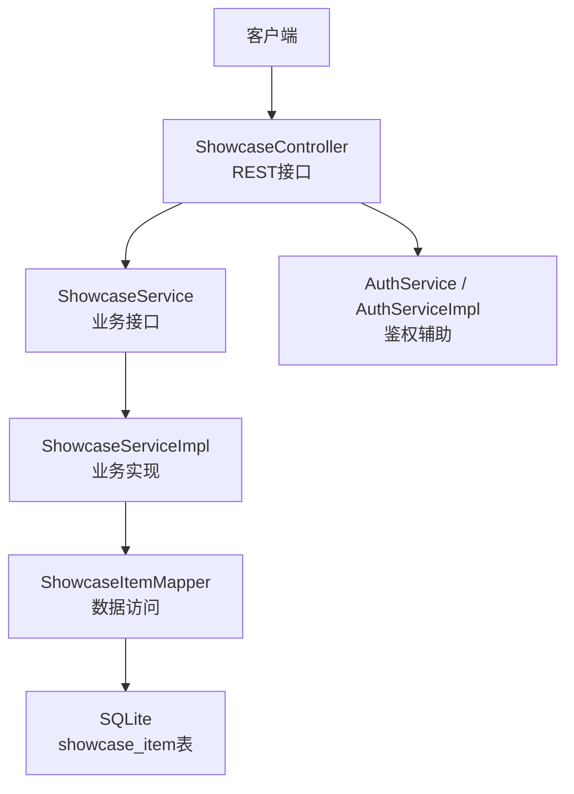
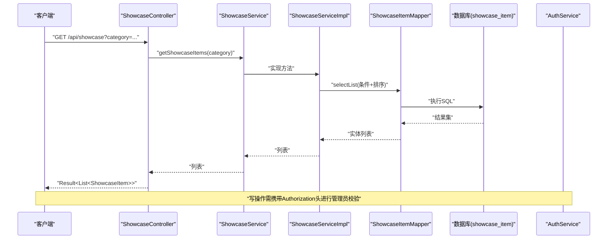
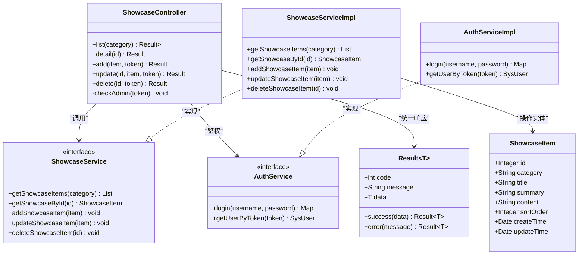

# 宣贯数据接口

<cite>
**本文引用的文件**   
- [ShowcaseController.java](file://backend/src/main/java/com/xx/platform/controller/ShowcaseController.java)
- [ShowcaseService.java](file://backend/src/main/java/com/xx/platform/service/ShowcaseService.java)
- [ShowcaseServiceImpl.java](file://backend/src/main/java/com/xx/platform/service/impl/ShowcaseServiceImpl.java)
- [ShowcaseItem.java](file://backend/src/main/java/com/xx/platform/entity/ShowcaseItem.java)
- [schema.sql](file://backend/src/main/resources/schema.sql)
- [Result.java](file://backend/src/main/java/com/xx/platform/common/Result.java)
- [AuthService.java](file://backend/src/main/java/com/xx/platform/service/AuthService.java)
- [AuthServiceImpl.java](file://backend/src/main/java/com/xx/platform/service/impl/AuthServiceImpl.java)
</cite>

## 目录
1. [简介](#简介)
2. [项目结构](#项目结构)
3. [核心组件](#核心组件)
4. [架构总览](#架构总览)
5. [详细接口说明](#详细接口说明)
6. [依赖关系分析](#依赖关系分析)
7. [性能与扩展建议](#性能与扩展建议)
8. [故障排查指南](#故障排查指南)
9. [结论](#结论)
10. [附录](#附录)

## 简介
本文件面向JZPlatform门户系统的“产品宣贯展示模块”，提供宣贯项的API接口文档。内容覆盖：
- 宣贯项的CRUD接口：按分类查询、详情获取、新增、编辑、删除
- 宣贯数据的分类体系：USER_ECOLOGY、PRODUCT_SYSTEM、MODEL_SYSTEM、DATA_SYSTEM、IP
- 富文本内容的处理机制与安全策略（基于当前实现）
- ShowcaseItem数据模型的字段说明与格式要求
- 版本管理与发布流程的接口设计建议（概念性方案，便于后续演进）

## 项目结构
后端采用Spring Boot + MyBatis-Plus分层架构，控制器层暴露REST API，服务层封装业务逻辑，实体类映射数据库表。

图表来源
- [ShowcaseController.java:1-87](file://backend/src/main/java/com/xx/platform/controller/ShowcaseController.java#L1-L87)
- [ShowcaseService.java:1-38](file://backend/src/main/java/com/xx/platform/service/ShowcaseService.java#L1-L38)
- [ShowcaseServiceImpl.java:1-60](file://backend/src/main/java/com/xx/platform/service/impl/ShowcaseServiceImpl.java#L1-L60)
- [schema.sql:39-49](file://backend/src/main/resources/schema.sql#L39-L49)
- [AuthService.java:1-27](file://backend/src/main/java/com/xx/platform/service/AuthService.java#L1-L27)
- [AuthServiceImpl.java:1-62](file://backend/src/main/java/com/xx/platform/service/impl/AuthServiceImpl.java#L1-L62)

章节来源
- [ShowcaseController.java:1-87](file://backend/src/main/java/com/xx/platform/controller/ShowcaseController.java#L1-L87)
- [ShowcaseService.java:1-38](file://backend/src/main/java/com/xx/platform/service/ShowcaseService.java#L1-L38)
- [ShowcaseServiceImpl.java:1-60](file://backend/src/main/java/com/xx/platform/service/impl/ShowcaseServiceImpl.java#L1-L60)
- [schema.sql:39-49](file://backend/src/main/resources/schema.sql#L39-L49)

## 核心组件
- 控制器层：统一路由前缀/api/showcase，提供列表、详情、新增、更新、删除接口；对写操作进行管理员权限校验。
- 服务层：封装查询条件、排序、时间戳维护、异常提示等。
- 实体层：定义宣贯项的数据模型及字段约束。
- 认证服务：提供基于内存Token的登录与会话解析能力，用于权限控制。
- 统一响应体：所有接口返回统一的Result包装结构。

章节来源
- [ShowcaseController.java:1-87](file://backend/src/main/java/com/xx/platform/controller/ShowcaseController.java#L1-L87)
- [ShowcaseService.java:1-38](file://backend/src/main/java/com/xx/platform/service/ShowcaseService.java#L1-L38)
- [ShowcaseServiceImpl.java:1-60](file://backend/src/main/java/com/xx/platform/service/impl/ShowcaseServiceImpl.java#L1-L60)
- [ShowcaseItem.java:1-40](file://backend/src/main/java/com/xx/platform/entity/ShowcaseItem.java#L1-L40)
- [Result.java:1-53](file://backend/src/main/java/com/xx/platform/common/Result.java#L1-L53)
- [AuthService.java:1-27](file://backend/src/main/java/com/xx/platform/service/AuthService.java#L1-L27)
- [AuthServiceImpl.java:1-62](file://backend/src/main/java/com/xx/platform/service/impl/AuthServiceImpl.java#L1-L62)

## 架构总览
从请求到响应的调用链如下：

图表来源
- [ShowcaseController.java:26-42](file://backend/src/main/java/com/xx/platform/controller/ShowcaseController.java#L26-L42)
- [ShowcaseServiceImpl.java:23-31](file://backend/src/main/java/com/xx/platform/service/impl/ShowcaseServiceImpl.java#L23-L31)
- [schema.sql:39-49](file://backend/src/main/resources/schema.sql#L39-L49)

## 详细接口说明

### 通用约定
- 基础路径：/api/showcase
- 统一响应体：Result<T>，包含code、message、data
- 分页：当前未实现分页，返回列表为全量或按分类过滤后的集合
- 排序：默认按sortOrder升序
- 鉴权：写接口需要管理员权限，通过请求头Authorization传递token

章节来源
- [Result.java:1-53](file://backend/src/main/java/com/xx/platform/common/Result.java#L1-L53)
- [ShowcaseController.java:16-18](file://backend/src/main/java/com/xx/platform/controller/ShowcaseController.java#L16-L18)
- [ShowcaseServiceImpl.java:23-31](file://backend/src/main/java/com/xx/platform/service/impl/ShowcaseServiceImpl.java#L23-L31)

### 1) 按分类查询宣贯项列表
- 方法与路径：GET /api/showcase
- 查询参数：
  - category：可选，枚举值包括 USER_ECOLOGY、PRODUCT_SYSTEM、MODEL_SYSTEM、DATA_SYSTEM、IP
- 成功响应：
  - code: 200
  - message: "操作成功"
  - data: List<ShowcaseItem>
- 失败响应：
  - code: 500
  - message: 错误信息
- 行为说明：
  - 当category为空时返回全部条目
  - 当category有效时仅返回该分类下的条目
  - 结果按sortOrder升序排列

章节来源
- [ShowcaseController.java:26-33](file://backend/src/main/java/com/xx/platform/controller/ShowcaseController.java#L26-L33)
- [ShowcaseServiceImpl.java:23-31](file://backend/src/main/java/com/xx/platform/service/impl/ShowcaseServiceImpl.java#L23-L31)
- [schema.sql:74-79](file://backend/src/main/resources/schema.sql#L74-L79)

### 2) 获取宣贯项详情
- 方法与路径：GET /api/showcase/{id}
- 路径参数：
  - id：整数，宣贯项主键
- 成功响应：
  - code: 200
  - message: "操作成功"
  - data: ShowcaseItem
- 失败响应：
  - code: 500
  - message: "数据不存在"（当id不存在时抛出运行时异常）

章节来源
- [ShowcaseController.java:35-42](file://backend/src/main/java/com/xx/platform/controller/ShowcaseController.java#L35-L42)
- [ShowcaseServiceImpl.java:33-40](file://backend/src/main/java/com/xx/platform/service/impl/ShowcaseServiceImpl.java#L33-L40)

### 3) 新增宣贯项（管理员）
- 方法与路径：POST /api/showcase
- 请求头：
  - Authorization：字符串，有效的管理员token
- 请求体：ShowcaseItem（必填字段见数据模型说明）
- 成功响应：
  - code: 200
  - message: "操作成功"
  - data: null
- 失败响应：
  - code: 500
  - message: "请先登录" 或 "无管理员权限"（鉴权失败）
- 行为说明：
  - 服务端自动填充createTime和updateTime
  - 若category不在预定义集合中，由上层校验或业务规则决定如何处理（当前实现未做显式白名单校验）

章节来源
- [ShowcaseController.java:44-54](file://backend/src/main/java/com/xx/platform/controller/ShowcaseController.java#L44-L54)
- [ShowcaseServiceImpl.java:42-47](file://backend/src/main/java/com/xx/platform/service/impl/ShowcaseServiceImpl.java#L42-L47)
- [AuthServiceImpl.java:28-51](file://backend/src/main/java/com/xx/platform/service/impl/AuthServiceImpl.java#L28-L51)

### 4) 编辑宣贯项（管理员）
- 方法与路径：PUT /api/showcase/{id}
- 路径参数：
  - id：整数，待更新的宣贯项主键
- 请求头：
  - Authorization：字符串，有效的管理员token
- 请求体：ShowcaseItem（至少包含id，其他字段按需更新）
- 成功响应：
  - code: 200
  - message: "操作成功"
  - data: null
- 失败响应：
  - code: 500
  - message: "请先登录" 或 "无管理员权限"
- 行为说明：
  - 服务端自动更新updateTime

章节来源
- [ShowcaseController.java:56-67](file://backend/src/main/java/com/xx/platform/controller/ShowcaseController.java#L56-L67)
- [ShowcaseServiceImpl.java:49-53](file://backend/src/main/java/com/xx/platform/service/impl/ShowcaseServiceImpl.java#L49-L53)

### 5) 删除宣贯项（管理员）
- 方法与路径：DELETE /api/showcase/{id}
- 路径参数：
  - id：整数，待删除的宣贯项主键
- 请求头：
  - Authorization：字符串，有效的管理员token
- 成功响应：
  - code: 200
  - message: "操作成功"
  - data: null
- 失败响应：
  - code: 500
  - message: "请先登录" 或 "无管理员权限"

章节来源
- [ShowcaseController.java:69-79](file://backend/src/main/java/com/xx/platform/controller/ShowcaseController.java#L69-L79)

### 数据模型：ShowcaseItem
- 字段说明
  - id：整数，自增主键
  - category：字符串，分类标识，取值范围：USER_ECOLOGY、PRODUCT_SYSTEM、MODEL_SYSTEM、DATA_SYSTEM、IP
  - title：字符串，标题，最大长度200
  - summary：字符串，概览摘要，最大长度500
  - content：文本，详细内容，支持富文本HTML
  - sortOrder：整数，排序序号，默认0
  - createTime：日期时间，创建时间
  - updateTime：日期时间，更新时间
- 字段约束与格式要求
  - category必须为上述五个枚举值之一
  - title必填且不超过200字符
  - summary可选，不超过500字符
  - content可选，可为空或富文本HTML
  - sortOrder非负整数，用于排序
  - createTime/updateTime由服务端维护

章节来源
- [ShowcaseItem.java:14-39](file://backend/src/main/java/com/xx/platform/entity/ShowcaseItem.java#L14-L39)
- [schema.sql:39-49](file://backend/src/main/resources/schema.sql#L39-L49)

### 分类体系
- 预定义分类
  - USER_ECOLOGY：用户生态
  - PRODUCT_SYSTEM：产品体系
  - MODEL_SYSTEM：模型体系
  - DATA_SYSTEM：数据体系
  - IP：知识产权
- 使用方式
  - 列表接口通过category参数筛选
  - 示例数据已内置对应分类条目

章节来源
- [ShowcaseItem.java:21-22](file://backend/src/main/java/com/xx/platform/entity/ShowcaseItem.java#L21-L22)
- [schema.sql:74-79](file://backend/src/main/resources/schema.sql#L74-L79)

### 富文本内容处理机制
- 存储策略
  - content字段类型为TEXT，直接持久化HTML内容
- 安全过滤
  - 当前实现未引入专门的HTML清洗库或过滤器
  - 建议在新增/更新前在服务端增加输入校验与HTML白名单过滤，避免XSS风险
- 渲染建议
  - 前端渲染富文本时建议使用安全的富文本渲染器，并启用沙箱模式

章节来源
- [schema.sql:45](file://backend/src/main/resources/schema.sql#L45)
- [ShowcaseServiceImpl.java:42-53](file://backend/src/main/java/com/xx/platform/service/impl/ShowcaseServiceImpl.java#L42-L53)

### 内容版本管理与发布流程（接口设计建议）
当前实现未包含版本管理相关字段与接口。以下为建议的演进方向（概念性方案）：
- 数据模型扩展
  - 在showcase_item表中增加version字段（版本号，如v1、v2）
  - 新增status字段（草稿、已发布、已下线），用于控制可见性
- 新增接口
  - POST /api/showcase/version：提交新版本，生成新version并保留历史
  - PUT /api/showcase/{id}/publish：将指定版本标记为已发布
  - DELETE /api/showcase/{id}/unpublish：取消发布
- 查询接口增强
  - GET /api/showcase?category=...&status=PUBLISHED：仅返回已发布版本
  - GET /api/showcase/{id}?version=v2：按版本获取详情
- 变更审计
  - 记录operator、operateTime、changeReason等审计字段

[本节为概念性设计，不直接分析具体代码文件]

## 依赖关系分析
- 控制器依赖服务接口，服务实现依赖MyBatis-Plus Mapper
- 写操作依赖AuthService进行管理员鉴权
- 统一响应体Result贯穿所有接口

图表来源
- [ShowcaseController.java:16-86](file://backend/src/main/java/com/xx/platform/controller/ShowcaseController.java#L16-L86)
- [ShowcaseService.java:10-37](file://backend/src/main/java/com/xx/platform/service/ShowcaseService.java#L10-L37)
- [ShowcaseServiceImpl.java:17-59](file://backend/src/main/java/com/xx/platform/service/impl/ShowcaseServiceImpl.java#L17-L59)
- [AuthService.java:10-26](file://backend/src/main/java/com/xx/platform/service/AuthService.java#L10-L26)
- [AuthServiceImpl.java:19-61](file://backend/src/main/java/com/xx/platform/service/impl/AuthServiceImpl.java#L19-L61)
- [ShowcaseItem.java:14-39](file://backend/src/main/java/com/xx/platform/entity/ShowcaseItem.java#L14-L39)
- [Result.java:9-52](file://backend/src/main/java/com/xx/platform/common/Result.java#L9-L52)

章节来源
- [ShowcaseController.java:16-86](file://backend/src/main/java/com/xx/platform/controller/ShowcaseController.java#L16-L86)
- [ShowcaseService.java:10-37](file://backend/src/main/java/com/xx/platform/service/ShowcaseService.java#L10-L37)
- [ShowcaseServiceImpl.java:17-59](file://backend/src/main/java/com/xx/platform/service/impl/ShowcaseServiceImpl.java#L17-L59)
- [AuthService.java:10-26](file://backend/src/main/java/com/xx/platform/service/AuthService.java#L10-L26)
- [AuthServiceImpl.java:19-61](file://backend/src/main/java/com/xx/platform/service/impl/AuthServiceImpl.java#L19-L61)
- [ShowcaseItem.java:14-39](file://backend/src/main/java/com/xx/platform/entity/ShowcaseItem.java#L14-L39)
- [Result.java:9-52](file://backend/src/main/java/com/xx/platform/common/Result.java#L9-L52)

## 性能与扩展建议
- 查询优化
  - 列表接口可按category建立索引，提升筛选性能
  - 未来可引入分页参数limit/offset或游标分页
- 缓存策略
  - 对热点分类列表可引入本地缓存或Redis缓存，降低数据库压力
- 并发与一致性
  - 写操作涉及updateTime更新，注意并发场景下的幂等性与乐观锁（可扩展version字段）
- 安全加固
  - 引入HTML白名单过滤与输入校验
  - 鉴权方案可从内存Token迁移至JWT或会话中心

[本节为通用建议，不直接分析具体代码文件]

## 故障排查指南
- 鉴权失败
  - 现象：新增/编辑/删除返回“请先登录”或“无管理员权限”
  - 排查：确认Authorization头是否携带有效token，且对应用户角色为ADMIN
- 数据不存在
  - 现象：详情接口返回“数据不存在”
  - 排查：确认传入的id是否存在于showcase_item表
- 富文本显示异常
  - 现象：content中的HTML在前端渲染异常或存在安全风险
  - 排查：检查服务端是否对HTML进行了白名单过滤，前端是否使用安全渲染器

章节来源
- [ShowcaseController.java:81-85](file://backend/src/main/java/com/xx/platform/controller/ShowcaseController.java#L81-L85)
- [ShowcaseServiceImpl.java:33-40](file://backend/src/main/java/com/xx/platform/service/impl/ShowcaseServiceImpl.java#L33-L40)

## 结论
当前宣贯数据模块提供了完整的CRUD能力，支持按分类查询与排序，具备基本的安全鉴权。为满足生产环境需求，建议补充HTML内容安全过滤、版本管理与发布流程、分页与缓存等能力，以提升安全性、可维护性与性能。

[本节为总结性内容，不直接分析具体代码文件]

## 附录

### 接口一览
- GET /api/showcase
  - 功能：按分类查询列表
  - 参数：category（可选）
- GET /api/showcase/{id}
  - 功能：获取详情
  - 参数：id（路径）
- POST /api/showcase
  - 功能：新增（管理员）
  - 请求头：Authorization
  - 请求体：ShowcaseItem
- PUT /api/showcase/{id}
  - 功能：编辑（管理员）
  - 请求头：Authorization
  - 请求体：ShowcaseItem
- DELETE /api/showcase/{id}
  - 功能：删除（管理员）
  - 请求头：Authorization

章节来源
- [ShowcaseController.java:26-79](file://backend/src/main/java/com/xx/platform/controller/ShowcaseController.java#L26-L79)