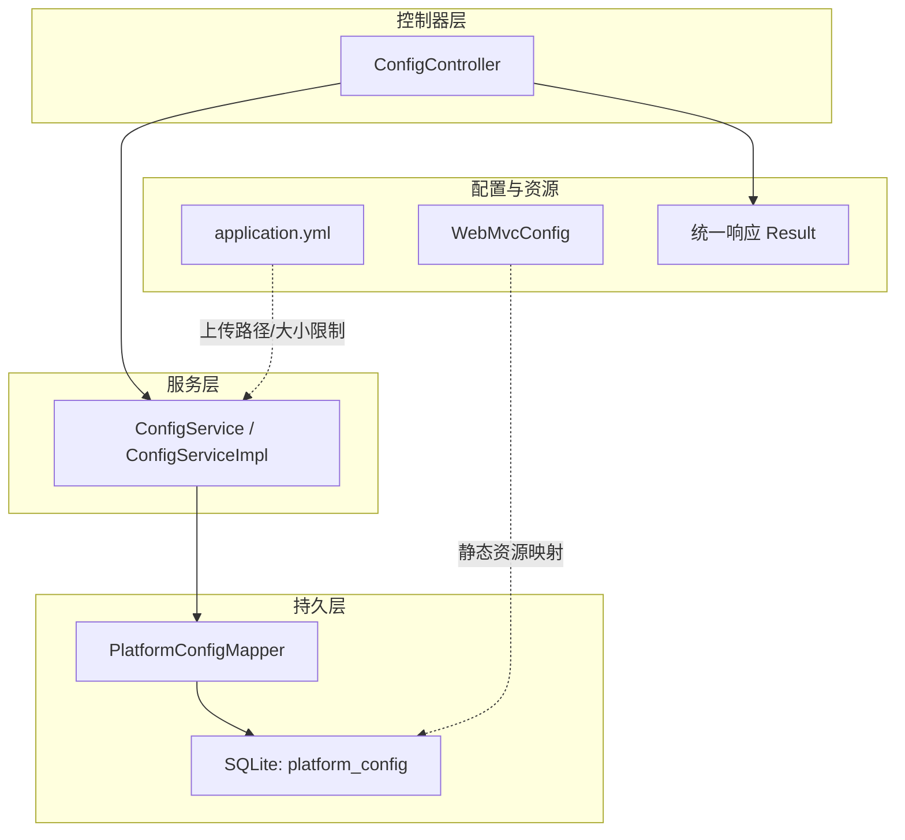
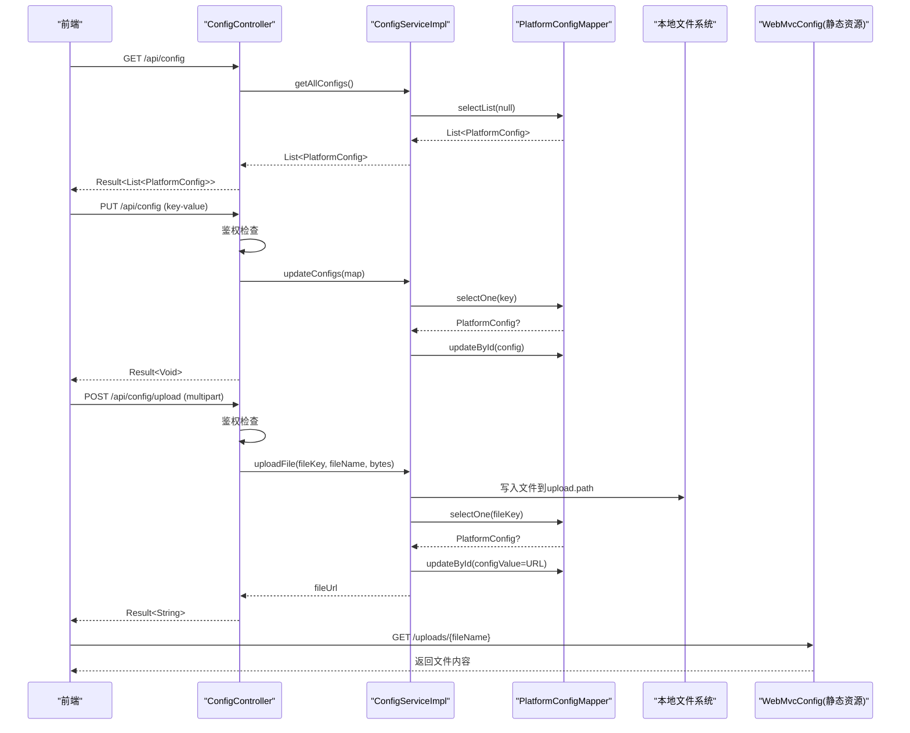
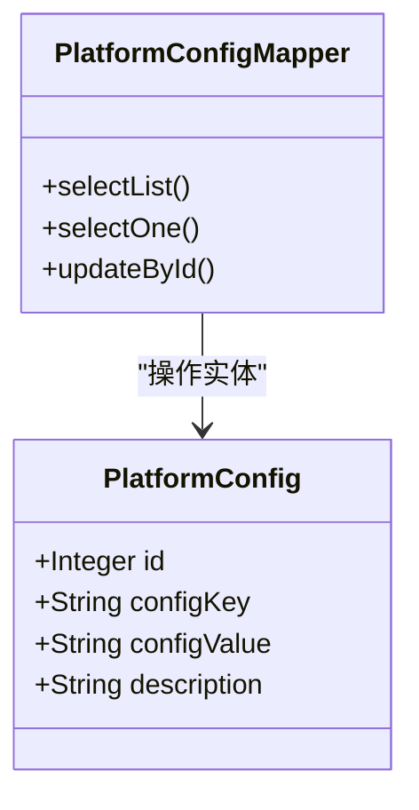
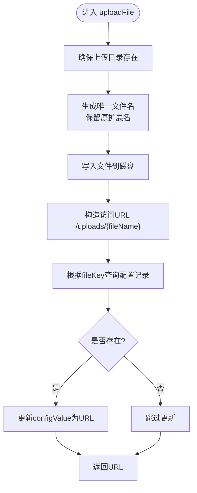
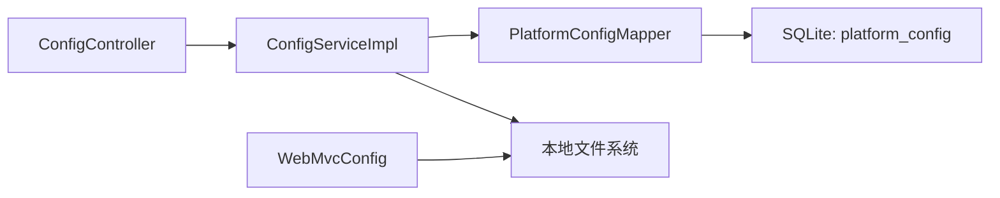

# 平台配置接口

<cite>
**本文引用的文件**   
- [ConfigController.java](file://backend/src/main/java/com/xx/platform/controller/ConfigController.java)
- [ConfigService.java](file://backend/src/main/java/com/xx/platform/service/ConfigService.java)
- [ConfigServiceImpl.java](file://backend/src/main/java/com/xx/platform/service/impl/ConfigServiceImpl.java)
- [PlatformConfig.java](file://backend/src/main/java/com/xx/platform/entity/PlatformConfig.java)
- [PlatformConfigMapper.java](file://backend/src/main/java/com/xx/platform/mapper/PlatformConfigMapper.java)
- [schema.sql](file://backend/src/main/resources/schema.sql)
- [application.yml](file://backend/src/main/resources/application.yml)
- [WebMvcConfig.java](file://backend/src/main/java/com/xx/platform/config/WebMvcConfig.java)
- [Result.java](file://backend/src/main/java/com/xx/platform/common/Result.java)
</cite>

## 目录
1. [简介](#简介)
2. [项目结构](#项目结构)
3. [核心组件](#核心组件)
4. [架构总览](#架构总览)
5. [详细组件分析](#详细组件分析)
6. [依赖关系分析](#依赖关系分析)
7. [性能与缓存](#性能与缓存)
8. [故障排查指南](#故障排查指南)
9. [结论](#结论)
10. [附录：API定义](#附录api定义)

## 简介
本文件为JZPlatform门户系统的“平台配置模块”提供API接口文档，覆盖以下能力：
- 获取所有平台配置项（键值对）
- 批量更新配置项的值
- 上传Logo和背景图片并自动替换对应配置路径
- 配置数据模型、类型与默认值说明
- 文件存储路径规范与访问权限控制
- 配置缓存策略与实时更新机制的扩展设计建议
- 配置版本控制与回滚机制的扩展设计建议

## 项目结构
后端采用Spring Boot + MyBatis-Plus + SQLite。平台配置相关代码位于controller、service、entity、mapper层，静态资源映射与跨域在Web MVC配置中完成。

图表来源
- [ConfigController.java:1-76](file://backend/src/main/java/com/xx/platform/controller/ConfigController.java#L1-L76)
- [ConfigService.java:1-38](file://backend/src/main/java/com/xx/platform/service/ConfigService.java#L1-L38)
- [ConfigServiceImpl.java:1-88](file://backend/src/main/java/com/xx/platform/service/impl/ConfigServiceImpl.java#L1-L88)
- [PlatformConfigMapper.java:1-13](file://backend/src/main/java/com/xx/platform/mapper/PlatformConfigMapper.java#L1-L13)
- [schema.sql:52-57](file://backend/src/main/resources/schema.sql#L52-L57)
- [application.yml:1-29](file://backend/src/main/resources/application.yml#L1-L29)
- [WebMvcConfig.java:1-37](file://backend/src/main/java/com/xx/platform/config/WebMvcConfig.java#L1-L37)
- [Result.java:1-53](file://backend/src/main/java/com/xx/platform/common/Result.java#L1-L53)

章节来源
- [ConfigController.java:1-76](file://backend/src/main/java/com/xx/platform/controller/ConfigController.java#L1-L76)
- [ConfigService.java:1-38](file://backend/src/main/java/com/xx/platform/service/ConfigService.java#L1-L38)
- [ConfigServiceImpl.java:1-88](file://backend/src/main/java/com/xx/platform/service/impl/ConfigServiceImpl.java#L1-L88)
- [PlatformConfig.java:1-28](file://backend/src/main/java/com/xx/platform/entity/PlatformConfig.java#L1-L28)
- [PlatformConfigMapper.java:1-13](file://backend/src/main/java/com/xx/platform/mapper/PlatformConfigMapper.java#L1-L13)
- [schema.sql:52-66](file://backend/src/main/resources/schema.sql#L52-L66)
- [application.yml:1-29](file://backend/src/main/resources/application.yml#L1-L29)
- [WebMvcConfig.java:1-37](file://backend/src/main/java/com/xx/platform/config/WebMvcConfig.java#L1-L37)
- [Result.java:1-53](file://backend/src/main/java/com/xx/platform/common/Result.java#L1-L53)

## 核心组件
- 控制器：对外暴露REST API，负责参数校验、鉴权与结果封装
- 服务：实现业务逻辑，包括查询、批量更新、文件上传与配置写入
- 实体与映射：平台配置表结构与MyBatis-Plus Mapper
- 配置与资源：应用配置（端口、数据库、上传大小、上传路径）、静态资源映射与跨域

章节来源
- [ConfigController.java:1-76](file://backend/src/main/java/com/xx/platform/controller/ConfigController.java#L1-L76)
- [ConfigService.java:1-38](file://backend/src/main/java/com/xx/platform/service/ConfigService.java#L1-L38)
- [ConfigServiceImpl.java:1-88](file://backend/src/main/java/com/xx/platform/service/impl/ConfigServiceImpl.java#L1-L88)
- [PlatformConfig.java:1-28](file://backend/src/main/java/com/xx/platform/entity/PlatformConfig.java#L1-L28)
- [PlatformConfigMapper.java:1-13](file://backend/src/main/java/com/xx/platform/mapper/PlatformConfigMapper.java#L1-L13)
- [application.yml:1-29](file://backend/src/main/resources/application.yml#L1-L29)
- [WebMvcConfig.java:1-37](file://backend/src/main/java/com/xx/platform/config/WebMvcConfig.java#L1-L37)

## 架构总览
平台配置模块遵循典型的三层架构：Controller -> Service -> Mapper -> Database。文件上传通过本地文件系统落盘，并通过静态资源映射对外暴露访问URL。

图表来源
- [ConfigController.java:33-68](file://backend/src/main/java/com/xx/platform/controller/ConfigController.java#L33-L68)
- [ConfigServiceImpl.java:31-86](file://backend/src/main/java/com/xx/platform/service/impl/ConfigServiceImpl.java#L31-L86)
- [PlatformConfigMapper.java:1-13](file://backend/src/main/java/com/xx/platform/mapper/PlatformConfigMapper.java#L1-L13)
- [WebMvcConfig.java:31-35](file://backend/src/main/java/com/xx/platform/config/WebMvcConfig.java#L31-L35)

## 详细组件分析

### 数据模型：PlatformConfig
- 字段
  - id：自增主键
  - configKey：配置键（唯一）
  - configValue：配置值（文本）
  - description：描述信息
- 约束与默认值
  - configKey唯一约束
  - 初始记录包含平台名称、公司名称、Logo路径、底图路径等键
- 复杂度
  - 单条记录读写O(1)，列表查询O(n)

图表来源
- [PlatformConfig.java:1-28](file://backend/src/main/java/com/xx/platform/entity/PlatformConfig.java#L1-L28)
- [PlatformConfigMapper.java:1-13](file://backend/src/main/java/com/xx/platform/mapper/PlatformConfigMapper.java#L1-L13)
- [schema.sql:52-57](file://backend/src/main/resources/schema.sql#L52-L57)

章节来源
- [PlatformConfig.java:1-28](file://backend/src/main/java/com/xx/platform/entity/PlatformConfig.java#L1-L28)
- [schema.sql:52-66](file://backend/src/main/resources/schema.sql#L52-L66)

### 控制器：ConfigController
- 路由前缀：/api/config
- 主要接口
  - GET /api/config：获取全部配置
  - PUT /api/config：批量更新配置（需管理员鉴权）
  - POST /api/config/upload：上传文件（Logo/底图），需管理员鉴权
- 鉴权方式
  - 通过请求头Authorization携带token，调用认证服务解析用户角色，仅ADMIN可写
- 错误处理
  - 未登录或无管理员权限抛出运行时异常
  - 上传失败返回错误消息

章节来源
- [ConfigController.java:1-76](file://backend/src/main/java/com/xx/platform/controller/ConfigController.java#L1-L76)

### 服务层：ConfigService / ConfigServiceImpl
- 能力
  - 获取全部配置
  - 按key获取单个配置值
  - 批量更新配置（遍历map，存在则更新）
  - 文件上传：生成唯一文件名、落盘、更新对应配置的值为访问URL
- 关键细节
  - 上传路径由配置项upload.path决定，默认./uploads/
  - 文件访问URL格式/uploads/{fileName}
  - 若目标key不存在，不会新增记录（仅更新已存在的key）

图表来源
- [ConfigServiceImpl.java:56-86](file://backend/src/main/java/com/xx/platform/service/impl/ConfigServiceImpl.java#L56-L86)
- [application.yml:27-28](file://backend/src/main/resources/application.yml#L27-L28)

章节来源
- [ConfigService.java:1-38](file://backend/src/main/java/com/xx/platform/service/ConfigService.java#L1-L38)
- [ConfigServiceImpl.java:1-88](file://backend/src/main/java/com/xx/platform/service/impl/ConfigServiceImpl.java#L1-L88)

### 静态资源与跨域
- 静态资源映射：/uploads/** 指向本地 ./uploads/ 目录
- CORS：允许/api/**跨域，支持常用方法与凭证

章节来源
- [WebMvcConfig.java:1-37](file://backend/src/main/java/com/xx/platform/config/WebMvcConfig.java#L1-L37)

### 统一响应体
- 成功：code=200，message="操作成功"，data为具体数据
- 失败：code=500，message为错误信息

章节来源
- [Result.java:1-53](file://backend/src/main/java/com/xx/platform/common/Result.java#L1-L53)

## 依赖关系分析
- 控制器依赖服务接口；服务实现依赖Mapper与文件系统；Mapper基于MyBatis-Plus操作SQLite
- 静态资源映射独立于业务逻辑，但受上传路径影响

图表来源
- [ConfigController.java:1-76](file://backend/src/main/java/com/xx/platform/controller/ConfigController.java#L1-L76)
- [ConfigServiceImpl.java:1-88](file://backend/src/main/java/com/xx/platform/service/impl/ConfigServiceImpl.java#L1-L88)
- [PlatformConfigMapper.java:1-13](file://backend/src/main/java/com/xx/platform/mapper/PlatformConfigMapper.java#L1-L13)
- [WebMvcConfig.java:1-37](file://backend/src/main/java/com/xx/platform/config/WebMvcConfig.java#L1-L37)

章节来源
- [ConfigController.java:1-76](file://backend/src/main/java/com/xx/platform/controller/ConfigController.java#L1-L76)
- [ConfigServiceImpl.java:1-88](file://backend/src/main/java/com/xx/platform/service/impl/ConfigServiceImpl.java#L1-L88)
- [PlatformConfigMapper.java:1-13](file://backend/src/main/java/com/xx/platform/mapper/PlatformConfigMapper.java#L1-L13)
- [WebMvcConfig.java:1-37](file://backend/src/main/java/com/xx/platform/config/WebMvcConfig.java#L1-L37)

## 性能与缓存
- 当前实现
  - 直接读取数据库，无内存缓存
  - 批量更新逐条查询并更新，时间复杂度O(k)（k为更新键数）
- 优化建议
  - 引入本地缓存（如Caffeine/Guava）或分布式缓存（Redis），设置合理TTL
  - 批量更新使用事务与批量SQL减少IO
  - 大文件上传增加并发控制与限流
  - 对频繁读的配置项建立热点键索引

[本节为通用性能建议，不直接分析具体文件]

## 故障排查指南
- 常见错误
  - 未登录或无管理员权限：检查Authorization头与用户角色
  - 上传失败：检查磁盘空间、目录权限、文件大小限制
  - 无法访问上传文件：确认静态资源映射路径与实际文件一致
- 定位方法
  - 查看服务端日志输出（已开启SQL日志）
  - 检查application.yml中的上传大小与路径配置
  - 验证/uploads/**是否被正确映射

章节来源
- [ConfigController.java:70-74](file://backend/src/main/java/com/xx/platform/controller/ConfigController.java#L70-L74)
- [ConfigServiceImpl.java:70-72](file://backend/src/main/java/com/xx/platform/service/impl/ConfigServiceImpl.java#L70-L72)
- [application.yml:10-13](file://backend/src/main/resources/application.yml#L10-L13)
- [WebMvcConfig.java:31-35](file://backend/src/main/java/com/xx/platform/config/WebMvcConfig.java#L31-L35)

## 结论
平台配置模块提供了基础的动态配置管理与文件上传能力，满足Logo与背景图等资源的动态替换需求。建议在后续迭代中补充缓存、版本控制、回滚与更严格的输入校验，以提升稳定性与可维护性。

[本节为总结性内容，不直接分析具体文件]

## 附录：API定义

### 通用约定
- 基础路径：/api/config
- 统一响应体：Result<T>
- 鉴权：修改类接口需在请求头携带Authorization令牌，且用户角色为ADMIN

章节来源
- [ConfigController.java:1-76](file://backend/src/main/java/com/xx/platform/controller/ConfigController.java#L1-L76)
- [Result.java:1-53](file://backend/src/main/java/com/xx/platform/common/Result.java#L1-L53)

### 接口清单

- 获取所有平台配置
  - 方法：GET
  - 路径：/api/config
  - 请求头：无特殊要求
  - 响应：Result<List<PlatformConfig>>
  - 说明：返回所有配置项，含id、configKey、configValue、description

- 批量更新配置
  - 方法：PUT
  - 路径：/api/config
  - 请求头：Authorization（必需）
  - 请求体：Map<String, String>，键为configKey，值为新配置值
  - 行为：仅更新已存在的key，不存在则忽略
  - 响应：Result<Void>

- 上传文件（Logo/底图）
  - 方法：POST
  - 路径：/api/config/upload
  - 请求头：Authorization（必需）
  - 表单字段：
    - file：二进制文件
    - fileKey：配置键，通常为logo_path或bg_image
  - 行为：
    - 将文件保存到upload.path目录，生成唯一文件名
    - 更新对应key的configValue为访问URL（/uploads/{fileName}）
  - 响应：Result<String>，返回文件访问URL

章节来源
- [ConfigController.java:33-68](file://backend/src/main/java/com/xx/platform/controller/ConfigController.java#L33-L68)
- [ConfigServiceImpl.java:56-86](file://backend/src/main/java/com/xx/platform/service/impl/ConfigServiceImpl.java#L56-L86)

### 配置项类型定义、验证规则与默认值
- 类型定义
  - configKey：字符串，唯一
  - configValue：字符串（文本），用于存储普通配置或文件访问URL
  - description：字符串，描述信息
- 验证规则
  - 批量更新时，仅更新已存在的key
  - 上传文件时，fileKey应为已知键（如logo_path、bg_image）
- 默认值
  - 初始化脚本中包含平台名称、公司名称、Logo路径、底图路径等默认记录

章节来源
- [PlatformConfig.java:1-28](file://backend/src/main/java/com/xx/platform/entity/PlatformConfig.java#L1-L28)
- [schema.sql:62-66](file://backend/src/main/resources/schema.sql#L62-L66)

### 文件存储路径规范与访问权限控制
- 存储路径
  - 本地路径：由upload.path配置，默认./uploads/
  - 访问URL：/uploads/{fileName}
- 访问权限
  - 静态资源映射允许匿名访问上传文件
  - 如需限制访问，可在WebMvcConfig中增加拦截器或鉴权逻辑
- 大小限制
  - 最大单文件与请求大小：10MB（由spring.servlet.multipart配置）

章节来源
- [application.yml:10-13](file://backend/src/main/resources/application.yml#L10-L13)
- [application.yml:27-28](file://backend/src/main/resources/application.yml#L27-L28)
- [WebMvcConfig.java:31-35](file://backend/src/main/java/com/xx/platform/config/WebMvcConfig.java#L31-L35)

### 配置缓存策略与实时更新机制（扩展设计）
- 缓存策略建议
  - 启动时加载全量配置至内存缓存
  - 更新后失效对应键或重建缓存
  - 可选：引入事件总线或监听器触发缓存刷新
- 实时更新机制建议
  - 基于WebSocket推送配置变更通知
  - 前端轮询短连接或长轮询作为降级方案

[本节为扩展设计建议，不直接分析具体文件]

### 配置版本控制与回滚机制（扩展设计）
- 版本化建议
  - 新增platform_config_version表或为现有表增加version字段
  - 每次提交变更生成新版本快照，记录变更人、时间与差异
- 回滚机制建议
  - 提供按版本号回滚接口，恢复指定版本的配置集合
  - 支持灰度发布与快速回退

[本节为扩展设计建议，不直接分析具体文件]