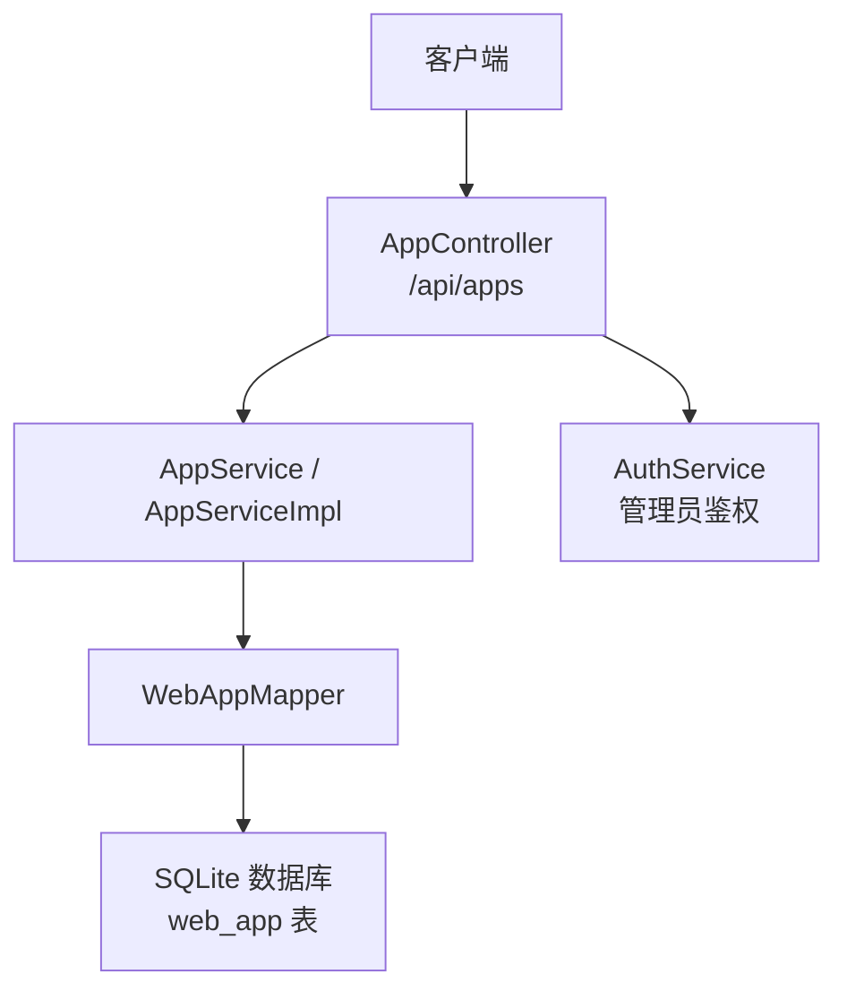
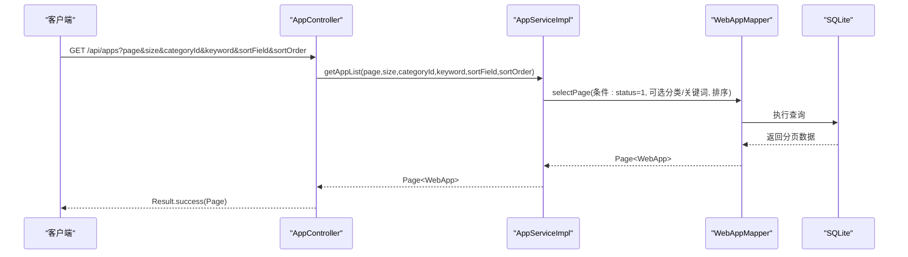
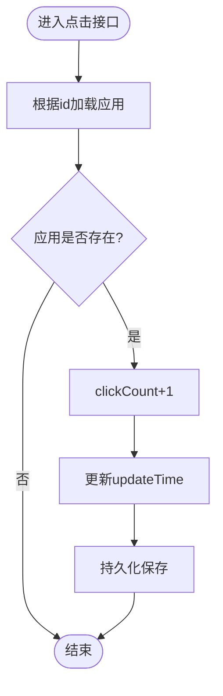
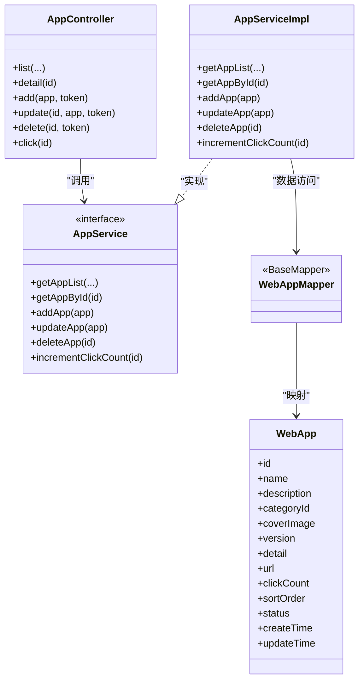

# 应用管理接口

<cite>
**本文引用的文件**   
- [AppController.java](file://backend/src/main/java/com/xx/platform/controller/AppController.java)
- [AppService.java](file://backend/src/main/java/com/xx/platform/service/AppService.java)
- [AppServiceImpl.java](file://backend/src/main/java/com/xx/platform/service/impl/AppServiceImpl.java)
- [WebAppMapper.java](file://backend/src/main/java/com/xx/platform/mapper/WebAppMapper.java)
- [WebApp.java](file://backend/src/main/java/com/xx/platform/entity/WebApp.java)
- [ConfigController.java](file://backend/src/main/java/com/xx/platform/controller/ConfigController.java)
- [application.yml](file://backend/src/main/resources/application.yml)
- [schema.sql](file://backend/src/main/resources/schema.sql)
- [API.md](file://API.md)
</cite>

## 目录
1. [简介](#简介)
2. [项目结构](#项目结构)
3. [核心组件](#核心组件)
4. [架构总览](#架构总览)
5. [详细接口说明](#详细接口说明)
6. [依赖关系分析](#依赖关系分析)
7. [性能与扩展建议](#性能与扩展建议)
8. [故障排查指南](#故障排查指南)
9. [结论](#结论)

## 简介
本文件为 JZPlatform 门户系统“应用管理模块”的完整 API 文档，覆盖 Web 应用的 CRUD、复杂查询（分页、筛选、排序）、点击统计记录、以及与应用相关的文件上传与安全过滤等高级能力。读者可据此快速对接前端或第三方系统。

## 项目结构
后端采用 Spring Boot + MyBatis-Plus 分层架构：
- Controller 层：对外暴露 REST 接口，负责参数校验与权限控制
- Service 层：业务逻辑封装，实现筛选、排序、计数等规则
- Mapper 层：数据访问，基于 MyBatis-Plus 的 BaseMapper
- Entity 层：数据库表映射实体
- 配置与脚本：application.yml 提供运行期配置；schema.sql 提供 SQLite 初始化脚本

图表来源
- [AppController.java:1-111](file://backend/src/main/java/com/xx/platform/controller/AppController.java#L1-L111)
- [AppService.java:1-47](file://backend/src/main/java/com/xx/platform/service/AppService.java#L1-L47)
- [AppServiceImpl.java:1-105](file://backend/src/main/java/com/xx/platform/service/impl/AppServiceImpl.java#L1-L105)
- [WebAppMapper.java:1-13](file://backend/src/main/java/com/xx/platform/mapper/WebAppMapper.java#L1-L13)
- [schema.sql:23-37](file://backend/src/main/resources/schema.sql#L23-L37)

章节来源
- [AppController.java:1-111](file://backend/src/main/java/com/xx/platform/controller/AppController.java#L1-L111)
- [AppService.java:1-47](file://backend/src/main/java/com/xx/platform/service/AppService.java#L1-L47)
- [AppServiceImpl.java:1-105](file://backend/src/main/java/com/xx/platform/service/impl/AppServiceImpl.java#L1-L105)
- [WebAppMapper.java:1-13](file://backend/src/main/java/com/xx/platform/mapper/WebAppMapper.java#L1-L13)
- [schema.sql:23-37](file://backend/src/main/resources/schema.sql#L23-L37)

## 核心组件
- 控制器：AppController 提供应用列表、详情、新增、编辑、删除、点击统计等接口
- 服务：AppService 定义能力边界；AppServiceImpl 实现分页、筛选、排序、计数等逻辑
- 数据访问：WebAppMapper 继承 BaseMapper，提供基础 CRUD
- 实体：WebApp 对应 web_app 表字段
- 统一响应：Result 作为统一返回包装（由控制器使用）

章节来源
- [AppController.java:1-111](file://backend/src/main/java/com/xx/platform/controller/AppController.java#L1-L111)
- [AppService.java:1-47](file://backend/src/main/java/com/xx/platform/service/AppService.java#L1-L47)
- [AppServiceImpl.java:1-105](file://backend/src/main/java/com/xx/platform/service/impl/AppServiceImpl.java#L1-L105)
- [WebAppMapper.java:1-13](file://backend/src/main/java/com/xx/platform/mapper/WebAppMapper.java#L1-L13)
- [WebApp.java:1-54](file://backend/src/main/java/com/xx/platform/entity/WebApp.java#L1-L54)

## 架构总览
应用管理模块的请求链路如下：
- 客户端发起 HTTP 请求到 /api/apps
- AppController 解析参数并调用 AppService
- AppServiceImpl 构建查询条件（状态=启用、分类、关键词、排序），通过 WebAppMapper 执行 SQL
- 结果以 Result 统一格式返回

图表来源
- [AppController.java:31-40](file://backend/src/main/java/com/xx/platform/controller/AppController.java#L31-L40)
- [AppServiceImpl.java:24-62](file://backend/src/main/java/com/xx/platform/service/impl/AppServiceImpl.java#L24-L62)
- [WebAppMapper.java:1-13](file://backend/src/main/java/com/xx/platform/mapper/WebAppMapper.java#L1-L13)

## 详细接口说明

### 通用约定
- 基础路径：/api
- 认证方式：管理员接口需在请求头携带 Authorization: {token}
- 统一响应体：{ code, message, data }

章节来源
- [API.md:1-6](file://API.md#L1-L6)

### 应用列表（公开）
- 方法：GET
- 路径：/api/apps
- 查询参数：
  - page：页码，默认 1
  - size：每页数量，默认 12
  - categoryId：分类ID（可选）
  - keyword：关键词（可选，匹配名称和简介）
  - sortField：排序字段（可选，支持 clickCount/name）
  - sortOrder：排序方向 asc/desc
- 行为：
  - 仅返回启用状态的应用
  - 支持按分类过滤、关键词模糊搜索
  - 支持按 clickCount 或 name 排序；未指定时默认按 sortOrder 升序、创建时间降序
- 响应：分页对象（包含 records、total、pages、current、size 等）

章节来源
- [AppController.java:31-40](file://backend/src/main/java/com/xx/platform/controller/AppController.java#L31-L40)
- [AppServiceImpl.java:24-62](file://backend/src/main/java/com/xx/platform/service/impl/AppServiceImpl.java#L24-L62)
- [API.md:48-56](file://API.md#L48-L56)

### 应用详情（公开）
- 方法：GET
- 路径：/api/apps/{id}
- 行为：根据 id 获取应用信息，不存在则抛出异常
- 响应：WebApp 实体

章节来源
- [AppController.java:46-49](file://backend/src/main/java/com/xx/platform/controller/AppController.java#L46-L49)
- [AppServiceImpl.java:65-71](file://backend/src/main/java/com/xx/platform/service/impl/AppServiceImpl.java#L65-L71)

### 新增应用（管理员）
- 方法：POST
- 路径：/api/apps
- 请求体：WebApp 实体（JSON）
- 必填字段：name、url
- 可选字段：description、categoryId、coverImage、version、detail、sortOrder、status（默认启用）
- 行为：
  - 自动设置 clickCount=0、createTime/updateTime
  - 若未传 status，默认启用
- 响应：成功空数据

章节来源
- [AppController.java:55-61](file://backend/src/main/java/com/xx/platform/controller/AppController.java#L55-L61)
- [AppServiceImpl.java:74-82](file://backend/src/main/java/com/xx/platform/service/impl/AppServiceImpl.java#L74-L82)
- [WebApp.java:15-54](file://backend/src/main/java/com/xx/platform/entity/WebApp.java#L15-L54)

### 编辑应用（管理员）
- 方法：PUT
- 路径：/api/apps/{id}
- 请求体：WebApp 实体（JSON）
- 行为：
  - 更新 updateTime
  - 仅更新传入字段
- 响应：成功空数据

章节来源
- [AppController.java:67-74](file://backend/src/main/java/com/xx/platform/controller/AppController.java#L67-L74)
- [AppServiceImpl.java:85-88](file://backend/src/main/java/com/xx/platform/service/impl/AppServiceImpl.java#L85-L88)

### 删除应用（管理员）
- 方法：DELETE
- 路径：/api/apps/{id}
- 行为：物理删除
- 响应：成功空数据

章节来源
- [AppController.java:80-86](file://backend/src/main/java/com/xx/platform/controller/AppController.java#L80-L86)
- [AppServiceImpl.java:91-93](file://backend/src/main/java/com/xx/platform/service/impl/AppServiceImpl.java#L91-L93)

### 记录点击（公开）
- 方法：POST
- 路径：/api/apps/{id}/click
- 行为：
  - 若应用存在，clickCount+1，并更新时间
- 响应：成功空数据

章节来源
- [AppController.java:92-96](file://backend/src/main/java/com/xx/platform/controller/AppController.java#L92-L96)
- [AppServiceImpl.java:96-103](file://backend/src/main/java/com/xx/platform/service/impl/AppServiceImpl.java#L96-L103)

### 管理员鉴权机制
- 所有写操作（新增、编辑、删除）需携带 Authorization 请求头
- 服务端校验 token 对应的用户角色是否为 ADMIN，否则拒绝

章节来源
- [AppController.java:98-109](file://backend/src/main/java/com/xx/platform/controller/AppController.java#L98-L109)

### 数据模型：WebApp 实体
- id：自增主键
- name：应用名称（必填）
- description：功能简介
- categoryId：分类ID
- coverImage：封面图片路径
- version：版本号
- detail：详细介绍（HTML）
- url：应用链接（必填）
- clickCount：点击次数
- sortOrder：排序序号
- status：状态（1启用，0禁用）
- createTime：创建时间
- updateTime：更新时间

章节来源
- [WebApp.java:15-54](file://backend/src/main/java/com/xx/platform/entity/WebApp.java#L15-L54)
- [schema.sql:23-37](file://backend/src/main/resources/schema.sql#L23-L37)

### 复杂查询参数说明
- categoryId：精确匹配分类ID
- keyword：对 name 与 description 进行模糊匹配
- sortField：当前支持 clickCount、name；未指定时走默认排序
- sortOrder：asc 或 desc（不区分大小写）

章节来源
- [AppServiceImpl.java:32-59](file://backend/src/main/java/com/xx/platform/service/impl/AppServiceImpl.java#L32-L59)

### 点击统计接口实现机制
- 入口：POST /api/apps/{id}/click
- 流程：
  - 根据 id 查询应用
  - 若存在，clickCount+1，更新时间戳后落库
- 注意：该接口为公开接口，无鉴权

图表来源
- [AppServiceImpl.java:96-103](file://backend/src/main/java/com/xx/platform/service/impl/AppServiceImpl.java#L96-L103)

### 文件上传处理（与配置相关）
- 接口：POST /api/config/upload
- 表单字段：
  - file：文件
  - fileKey：配置key（logo_path 或 bg_image）
- 行为：
  - 将文件写入服务器本地目录（由 upload.path 配置）
  - 返回可访问的文件路径
- 限制：
  - 单文件大小与请求大小上限在 application.yml 中配置（默认 10MB）

章节来源
- [ConfigController.java:57-68](file://backend/src/main/java/com/xx/platform/controller/ConfigController.java#L57-L68)
- [application.yml:9-13](file://backend/src/main/resources/application.yml#L9-L13)
- [application.yml:27-28](file://backend/src/main/resources/application.yml#L27-L28)

### HTML 内容安全过滤（规范与建议）
- 现状：
  - WebApp.detail 字段用于存储详细介绍（HTML）
  - 当前代码未实现显式的 HTML 清洗或白名单过滤
- 建议：
  - 在新增/编辑应用前，对 detail 内容进行安全过滤（如去除危险标签/事件属性）
  - 可在 AppServiceImpl.addApp/updateApp 中接入过滤逻辑
  - 输出侧渲染时建议使用安全的富文本渲染方案

章节来源
- [WebApp.java:35-36](file://backend/src/main/java/com/xx/platform/entity/WebApp.java#L35-36)
- [AppServiceImpl.java:74-88](file://backend/src/main/java/com/xx/platform/service/impl/AppServiceImpl.java#L74-L88)

## 依赖关系分析
- 控制器与服务解耦：AppController 仅做路由与鉴权，业务集中在 AppServiceImpl
- 数据访问抽象：WebAppMapper 继承 BaseMapper，减少样板 SQL
- 外部依赖：
  - MyBatis-Plus：分页、条件构造器
  - SQLite：轻量级数据库
  - Spring Multipart：文件上传

图表来源
- [AppController.java:1-111](file://backend/src/main/java/com/xx/platform/controller/AppController.java#L1-L111)
- [AppService.java:1-47](file://backend/src/main/java/com/xx/platform/service/AppService.java#L1-L47)
- [AppServiceImpl.java:1-105](file://backend/src/main/java/com/xx/platform/service/impl/AppServiceImpl.java#L1-L105)
- [WebAppMapper.java:1-13](file://backend/src/main/java/com/xx/platform/mapper/WebAppMapper.java#L1-L13)
- [WebApp.java:1-54](file://backend/src/main/java/com/xx/platform/entity/WebApp.java#L1-L54)

章节来源
- [AppController.java:1-111](file://backend/src/main/java/com/xx/platform/controller/AppController.java#L1-L111)
- [AppService.java:1-47](file://backend/src/main/java/com/xx/platform/service/AppService.java#L1-L47)
- [AppServiceImpl.java:1-105](file://backend/src/main/java/com/xx/platform/service/impl/AppServiceImpl.java#L1-L105)
- [WebAppMapper.java:1-13](file://backend/src/main/java/com/xx/platform/mapper/WebAppMapper.java#L1-L13)
- [WebApp.java:1-54](file://backend/src/main/java/com/xx/platform/entity/WebApp.java#L1-L54)

## 性能与扩展建议
- 点击统计热点优化：
  - 当前实现每次点击都触发一次读写，高并发下可能成为瓶颈
  - 建议引入异步队列或内存计数器定时批量落库
- 查询性能：
  - 建议在常用筛选字段（category_id、status）建立索引
  - 关键词搜索可考虑全文检索或搜索引擎
- 分页与排序：
  - 大偏移量分页建议采用游标分页
  - 动态排序需严格白名单校验，防止注入风险

[本节为通用建议，无需源码引用]

## 故障排查指南
- 权限错误：
  - 现象：新增/编辑/删除返回“请先登录”或“无管理员权限”
  - 排查：确认 Authorization 请求头是否正确传递且 token 有效
- 应用不存在：
  - 现象：获取详情时报错
  - 排查：确认 id 是否存在于数据库
- 上传失败：
  - 现象：上传接口返回错误
  - 排查：检查文件大小是否超过限制、目标目录是否有写入权限
- 数据库连接：
  - 现象：启动后无法访问数据
  - 排查：确认 platform.db 路径与权限，确保 schema.sql 已执行

章节来源
- [AppController.java:98-109](file://backend/src/main/java/com/xx/platform/controller/AppController.java#L98-L109)
- [AppServiceImpl.java:65-71](file://backend/src/main/java/com/xx/platform/service/impl/AppServiceImpl.java#L65-L71)
- [ConfigController.java:57-68](file://backend/src/main/java/com/xx/platform/controller/ConfigController.java#L57-L68)
- [application.yml:9-13](file://backend/src/main/resources/application.yml#L9-L13)

## 结论
应用管理模块提供了完整的 Web 应用生命周期管理能力，包括公开的分页查询与详情、管理员的增删改、以及点击统计记录。结合统一的响应格式与清晰的鉴权机制，便于前后端协作与后续扩展。建议在高频点击场景引入异步与缓存策略，并对 HTML 内容增加安全过滤以提升整体安全性。