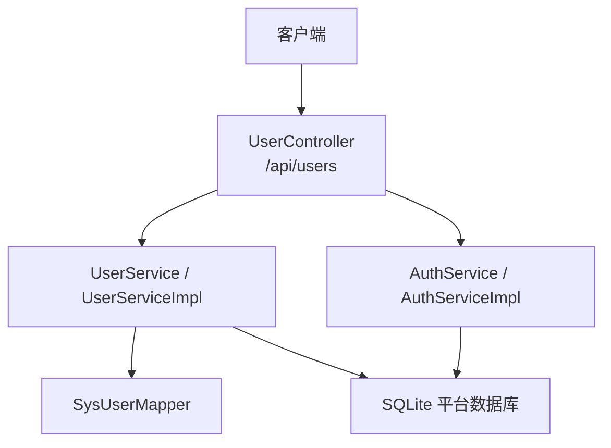
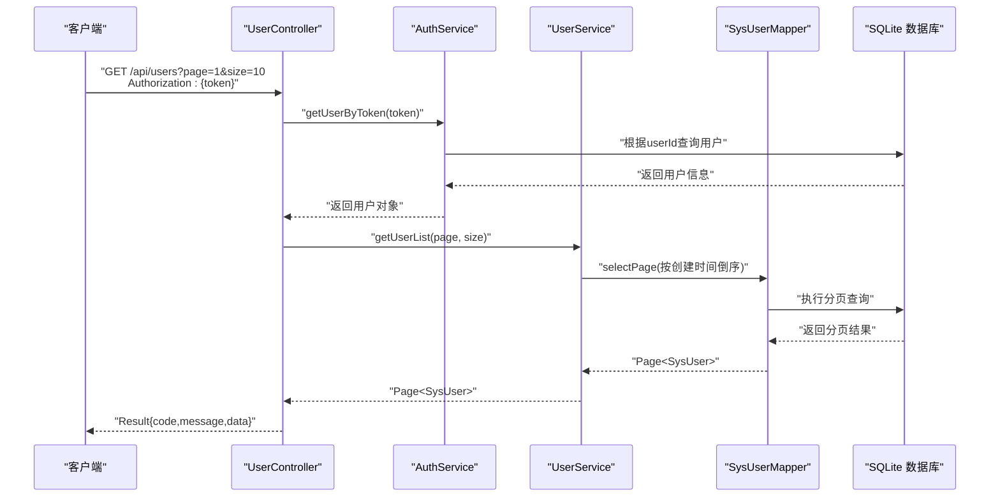
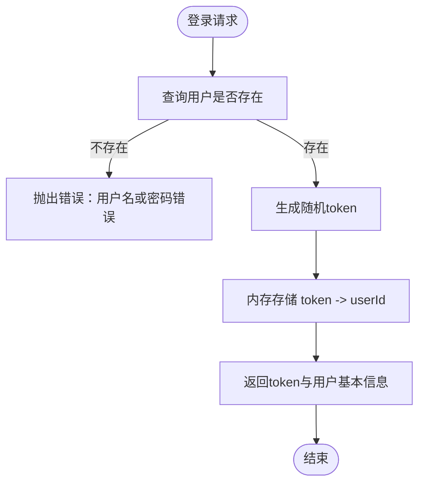
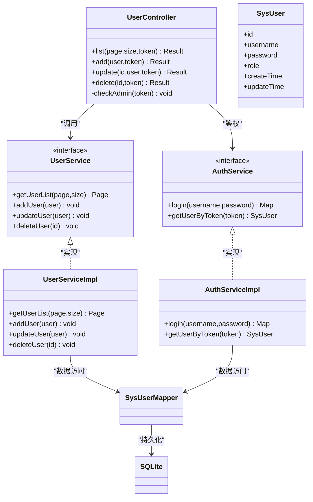

# 用户管理接口

<cite>
**本文引用的文件**   
- [UserController.java](file://backend/src/main/java/com/xx/platform/controller/UserController.java)
- [SysUser.java](file://backend/src/main/java/com/xx/platform/entity/SysUser.java)
- [UserService.java](file://backend/src/main/java/com/xx/platform/service/UserService.java)
- [UserServiceImpl.java](file://backend/src/main/java/com/xx/platform/service/impl/UserServiceImpl.java)
- [AuthService.java](file://backend/src/main/java/com/xx/platform/service/AuthService.java)
- [AuthServiceImpl.java](file://backend/src/main/java/com/xx/platform/service/impl/AuthServiceImpl.java)
- [application.yml](file://backend/src/main/resources/application.yml)
- [schema.sql](file://backend/src/main/resources/schema.sql)
- [API.md](file://API.md)
</cite>

## 目录
1. [简介](#简介)
2. [项目结构](#项目结构)
3. [核心组件](#核心组件)
4. [架构总览](#架构总览)
5. [详细组件分析](#详细组件分析)
6. [依赖关系分析](#依赖关系分析)
7. [性能考虑](#性能考虑)
8. [故障排查指南](#故障排查指南)
9. [结论](#结论)
10. [附录](#附录)

## 简介
本文件为JZPlatform门户系统的“用户管理模块”提供面向管理员的API接口文档，覆盖用户账户的CRUD操作（列表分页、新增、编辑、删除），并详细说明用户数据模型字段与权限控制。同时给出基于角色的访问控制（RBAC）机制说明、会话管理实现细节与安全建议，以及状态管理与批量操作的扩展设计。

## 项目结构
后端采用Spring Boot + MyBatis-Plus的分层架构：
- Controller层：暴露REST API，负责参数校验与权限拦截
- Service层：业务逻辑封装
- Mapper层：数据访问
- Entity层：数据库实体映射
- 配置与脚本：应用配置与数据库初始化脚本

图表来源
- [UserController.java:1-88](file://backend/src/main/java/com/xx/platform/controller/UserController.java#L1-L88)
- [UserService.java:1-31](file://backend/src/main/java/com/xx/platform/service/UserService.java#L1-L31)
- [UserServiceImpl.java:1-53](file://backend/src/main/java/com/xx/platform/service/impl/UserServiceImpl.java#L1-L53)
- [AuthService.java:1-27](file://backend/src/main/java/com/xx/platform/service/AuthService.java#L1-L27)
- [AuthServiceImpl.java:1-62](file://backend/src/main/java/com/xx/platform/service/impl/AuthServiceImpl.java#L1-L62)
- [application.yml:1-29](file://backend/src/main/resources/application.yml#L1-L29)
- [schema.sql:1-80](file://backend/src/main/resources/schema.sql#L1-L80)

章节来源
- [application.yml:1-29](file://backend/src/main/resources/application.yml#L1-L29)
- [schema.sql:1-80](file://backend/src/main/resources/schema.sql#L1-L80)

## 核心组件
- 控制器：用户管理API入口，统一鉴权与路由
- 服务：用户业务逻辑与认证逻辑
- 实体：系统用户数据模型
- 配置：数据库连接与MyBatis-Plus行为
- 脚本：数据库表结构与初始数据

章节来源
- [UserController.java:1-88](file://backend/src/main/java/com/xx/platform/controller/UserController.java#L1-L88)
- [UserService.java:1-31](file://backend/src/main/java/com/xx/platform/service/UserService.java#L1-L31)
- [UserServiceImpl.java:1-53](file://backend/src/main/java/com/xx/platform/service/impl/UserServiceImpl.java#L1-L53)
- [AuthService.java:1-27](file://backend/src/main/java/com/xx/platform/service/AuthService.java#L1-L27)
- [AuthServiceImpl.java:1-62](file://backend/src/main/java/com/xx/platform/service/impl/AuthServiceImpl.java#L1-L62)
- [SysUser.java:1-33](file://backend/src/main/java/com/xx/platform/entity/SysUser.java#L1-L33)
- [application.yml:1-29](file://backend/src/main/resources/application.yml#L1-L29)
- [schema.sql:1-80](file://backend/src/main/resources/schema.sql#L1-L80)

## 架构总览
下图展示了用户管理相关请求在系统中的调用链路与数据流向。

图表来源
- [UserController.java:25-36](file://backend/src/main/java/com/xx/platform/controller/UserController.java#L25-L36)
- [AuthService.java:20-26](file://backend/src/main/java/com/xx/platform/service/AuthService.java#L20-L26)
- [AuthServiceImpl.java:53-60](file://backend/src/main/java/com/xx/platform/service/impl/AuthServiceImpl.java#L53-L60)
- [UserService.java:11-14](file://backend/src/main/java/com/xx/platform/service/UserService.java#L11-L14)
- [UserServiceImpl.java:22-27](file://backend/src/main/java/com/xx/platform/service/impl/UserServiceImpl.java#L22-L27)
- [application.yml:4-8](file://backend/src/main/resources/application.yml#L4-L8)

## 详细组件分析

### 数据模型：SysUser
- 字段定义
  - id：自增主键
  - username：用户名，唯一
  - password：密码
  - role：角色，取值包含ADMIN与USER
  - createTime：创建时间
  - updateTime：更新时间
- 安全注意
  - 当前实现未对password进行加密存储或脱敏输出，存在安全风险
  - 建议在新增/更新时进行强哈希处理；对外响应时应过滤敏感字段

章节来源
- [SysUser.java:10-32](file://backend/src/main/java/com/xx/platform/entity/SysUser.java#L10-L32)
- [schema.sql:5-12](file://backend/src/main/resources/schema.sql#L5-L12)

### 认证与会话管理（RBAC基础）
- 登录流程
  - 输入用户名与明文密码
  - 校验通过后生成随机token，内存中维护token到userId的映射
  - 返回token及基本信息（不含密码）
- 鉴权流程
  - 通过请求头Authorization携带token
  - 解析token获取用户，再校验角色是否为ADMIN
- 会话存储
  - 使用ConcurrentHashMap在进程内缓存token映射
  - 生产环境建议使用Redis等外部存储以支持多实例与持久化

图表来源
- [AuthServiceImpl.java:28-51](file://backend/src/main/java/com/xx/platform/service/impl/AuthServiceImpl.java#L28-L51)

章节来源
- [AuthService.java:10-26](file://backend/src/main/java/com/xx/platform/service/AuthService.java#L10-L26)
- [AuthServiceImpl.java:1-62](file://backend/src/main/java/com/xx/platform/service/impl/AuthServiceImpl.java#L1-L62)

### RBAC权限控制
- 角色定义
  - ADMIN：具备用户管理等管理功能权限
  - USER：普通用户角色
- 权限校验
  - 用户管理接口强制要求ADMIN角色
  - 若token无效或角色非ADMIN，则拒绝访问

章节来源
- [UserController.java:75-86](file://backend/src/main/java/com/xx/platform/controller/UserController.java#L75-L86)
- [SysUser.java:26-27](file://backend/src/main/java/com/xx/platform/entity/SysUser.java#L26-L27)

### 用户管理API清单
- 通用约定
  - 基础URL：http://localhost:8080/api
  - 认证方式：请求头 Authorization: {token}
  - 统一响应格式：{ code, message, data }
- 接口列表
  - 用户列表（分页）
    - 方法：GET
    - 路径：/api/users
    - 参数：page（默认1）、size（默认10）
    - 权限：ADMIN
    - 排序：按创建时间倒序
  - 新增用户
    - 方法：POST
    - 路径：/api/users
    - 请求体：包含username、password、role等字段
    - 权限：ADMIN
  - 编辑用户
    - 方法：PUT
    - 路径：/api/users/{id}
    - 请求体：包含待更新的字段
    - 权限：ADMIN
  - 删除用户
    - 方法：DELETE
    - 路径：/api/users/{id}
    - 权限：ADMIN

章节来源
- [API.md:27-44](file://API.md#L27-L44)
- [UserController.java:25-73](file://backend/src/main/java/com/xx/platform/controller/UserController.java#L25-L73)

### 用户列表查询（分页）
- 行为说明
  - 使用MyBatis-Plus分页插件
  - 默认排序：按创建时间降序
- 注意事项
  - 需携带有效token且角色为ADMIN
  - 返回数据中包含分页元信息与用户集合

章节来源
- [UserController.java:25-36](file://backend/src/main/java/com/xx/platform/controller/UserController.java#L25-L36)
- [UserServiceImpl.java:22-27](file://backend/src/main/java/com/xx/platform/service/impl/UserServiceImpl.java#L22-L27)

### 新增用户
- 行为说明
  - 检查用户名是否已存在，重复则抛出异常
  - 设置创建与更新时间
  - 插入用户记录
- 安全建议
  - 当前未对密码进行加密，建议引入哈希算法并在Service层处理

章节来源
- [UserServiceImpl.java:29-40](file://backend/src/main/java/com/xx/platform/service/impl/UserServiceImpl.java#L29-L40)

### 编辑用户
- 行为说明
  - 根据ID更新用户信息
  - 自动更新时间戳
- 安全建议
  - 若请求体包含password，应在Service层进行加密后再持久化

章节来源
- [UserServiceImpl.java:42-46](file://backend/src/main/java/com/xx/platform/service/impl/UserServiceImpl.java#L42-L46)

### 删除用户
- 行为说明
  - 根据ID删除用户记录
- 风险提醒
  - 删除不可逆，建议增加二次确认与审计日志

章节来源
- [UserServiceImpl.java:48-51](file://backend/src/main/java/com/xx/platform/service/impl/UserServiceImpl.java#L48-L51)

### 安全与敏感信息处理
- 现状
  - 登录验证使用明文密码比对
  - 用户实体包含password字段
  - 对外响应可能包含敏感字段
- 改进建议
  - 密码存储：采用安全的哈希算法（如BCrypt）
  - 传输安全：启用HTTPS
  - 响应脱敏：对用户列表与详情接口过滤password等敏感字段
  - 会话安全：token加入过期时间与刷新机制，存储迁移至Redis

章节来源
- [AuthServiceImpl.java:28-51](file://backend/src/main/java/com/xx/platform/service/impl/AuthServiceImpl.java#L28-L51)
- [SysUser.java:23-24](file://backend/src/main/java/com/xx/platform/entity/SysUser.java#L23-L24)

### 状态管理与批量操作扩展设计
- 用户状态管理（扩展）
  - 可在SysUser中增加status字段（如启用/禁用），并在查询与更新时进行状态校验
- 批量操作（扩展）
  - 批量删除：/api/users/batch-delete，请求体为id数组
  - 批量启用/禁用：/api/users/batch-status，请求体为{id,status}数组
  - 权限控制：均需ADMIN角色
  - 事务保障：批量操作应置于事务中，保证一致性

[本节为概念性扩展设计，不直接分析具体代码文件]

## 依赖关系分析

图表来源
- [UserController.java:1-88](file://backend/src/main/java/com/xx/platform/controller/UserController.java#L1-L88)
- [UserService.java:1-31](file://backend/src/main/java/com/xx/platform/service/UserService.java#L1-L31)
- [UserServiceImpl.java:1-53](file://backend/src/main/java/com/xx/platform/service/impl/UserServiceImpl.java#L1-L53)
- [AuthService.java:1-27](file://backend/src/main/java/com/xx/platform/service/AuthService.java#L1-L27)
- [AuthServiceImpl.java:1-62](file://backend/src/main/java/com/xx/platform/service/impl/AuthServiceImpl.java#L1-L62)
- [SysUser.java:1-33](file://backend/src/main/java/com/xx/platform/entity/SysUser.java#L1-L33)
- [application.yml:4-8](file://backend/src/main/resources/application.yml#L4-L8)

章节来源
- [UserController.java:1-88](file://backend/src/main/java/com/xx/platform/controller/UserController.java#L1-L88)
- [UserServiceImpl.java:1-53](file://backend/src/main/java/com/xx/platform/service/impl/UserServiceImpl.java#L1-L53)
- [AuthServiceImpl.java:1-62](file://backend/src/main/java/com/xx/platform/service/impl/AuthServiceImpl.java#L1-L62)

## 性能考虑
- 分页查询
  - 使用MyBatis-Plus分页插件，避免全表扫描
  - 建议为常用查询条件建立索引（如username、role、create_time）
- 会话存储
  - 当前使用内存Map，单实例可用；多实例部署需迁移至Redis
- 数据库
  - SQLite适合轻量场景；高并发场景建议切换至MySQL/PostgreSQL

[本节为通用性能建议，不直接分析具体代码文件]

## 故障排查指南
- 常见错误
  - 未登录或token无效：请检查Authorization头是否正确传递
  - 无管理员权限：请确认当前用户角色为ADMIN
  - 用户名已存在：新增用户前需确保用户名唯一
- 定位方法
  - 查看控制台日志（已开启SQL日志输出）
  - 检查数据库表结构与初始数据是否正确加载

章节来源
- [UserController.java:75-86](file://backend/src/main/java/com/xx/platform/controller/UserController.java#L75-L86)
- [UserServiceImpl.java:31-36](file://backend/src/main/java/com/xx/platform/service/impl/UserServiceImpl.java#L31-L36)
- [application.yml:16-20](file://backend/src/main/resources/application.yml#L16-L20)

## 结论
用户管理模块提供了完整的管理员CRUD能力，并通过基于角色的访问控制限制敏感操作。当前实现简洁易用，但在密码安全与会话持久化方面仍有提升空间。建议尽快引入密码哈希、响应脱敏、token过期与外部会话存储，以提升系统安全性与可扩展性。

## 附录

### 接口规范与示例
- 基础URL：http://localhost:8080/api
- 认证方式：请求头 Authorization: {token}
- 统一响应格式：{ code, message, data }

章节来源
- [API.md:1-6](file://API.md#L1-L6)

### 数据库表结构（用户表）
- 表名：sys_user
- 字段：id、username、password、role、create_time、update_time
- 约束：username唯一，role默认USER

章节来源
- [schema.sql:5-12](file://backend/src/main/resources/schema.sql#L5-L12)