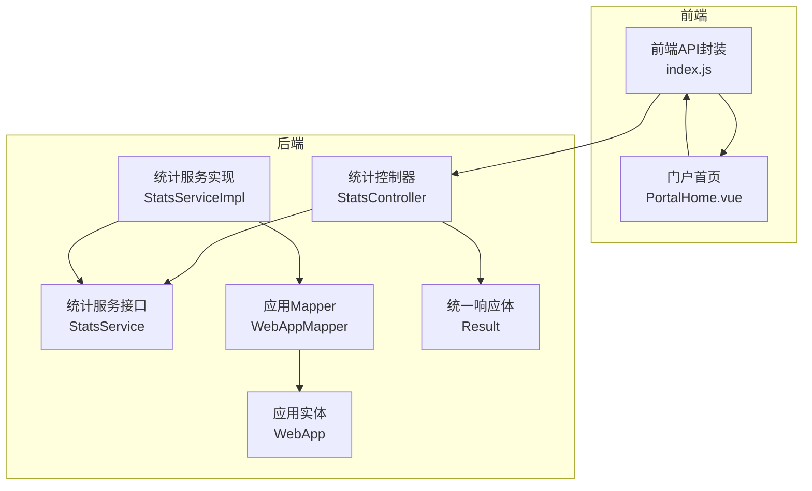
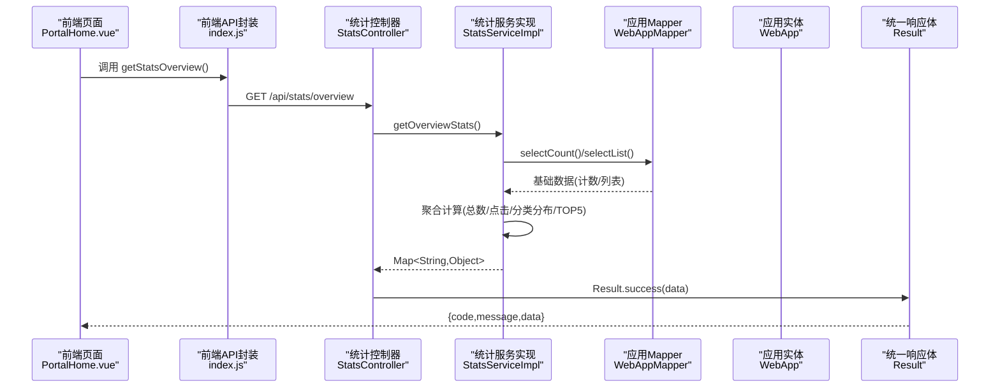
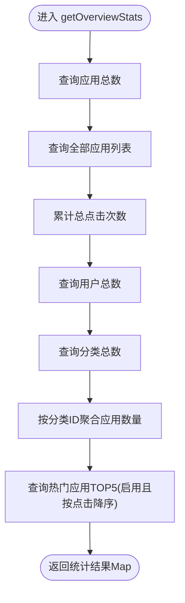
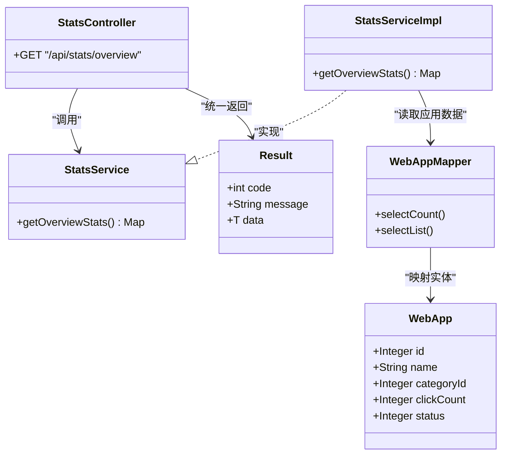

# 统计分析接口

<cite>
**本文引用的文件**
- [StatsController.java](file://backend/src/main/java/com/xx/platform/controller/StatsController.java)
- [StatsService.java](file://backend/src/main/java/com/xx/platform/service/StatsService.java)
- [StatsServiceImpl.java](file://backend/src/main/java/com/xx/platform/service/impl/StatsServiceImpl.java)
- [WebApp.java](file://backend/src/main/java/com/xx/platform/entity/WebApp.java)
- [WebAppMapper.java](file://backend/src/main/java/com/xx/platform/mapper/WebAppMapper.java)
- [Result.java](file://backend/src/main/java/com/xx/platform/common/Result.java)
- [API.md](file://API.md)
- [index.js](file://frontend/src/api/index.js)
- [PortalHome.vue](file://frontend/src/views/PortalHome.vue)
</cite>

## 目录
1. [简介](#简介)
2. [项目结构](#项目结构)
3. [核心组件](#核心组件)
4. [架构总览](#架构总览)
5. [详细组件分析](#详细组件分析)
6. [依赖关系分析](#依赖关系分析)
7. [性能与实时性](#性能与实时性)
8. [指标定义与计算规则](#指标定义与计算规则)
9. [ECharts数据格式规范](#echarts数据格式规范)
10. [扩展设计：自定义报表与导出](#扩展设计自定义报表与导出)
11. [大数据量查询优化与分页策略](#大数据量查询优化与分页策略)
12. [故障排查指南](#故障排查指南)
13. [结论](#结论)

## 简介
本文件为JZPlatform门户系统的“统计分析模块”的API接口文档，聚焦于统计数据聚合与查询能力。当前已实现“平台总览统计”接口，涵盖应用总数、总点击数、用户数、分类数、分类分布以及热门应用TOP5等指标。文档同时说明StatsService层的统计计算逻辑、数据聚合算法、前端ECharts图表数据格式标准化输出建议、实时性与缓存策略、性能优化考虑，并提供后续扩展（自定义报表与导出）的设计方案及大数据量下的查询优化与分页策略。

## 项目结构
统计分析相关代码位于后端Java工程，采用Spring MVC + MyBatis-Plus分层架构；前端通过统一API封装调用统计接口并在门户首页展示概览数字。

图示来源
- [StatsController.java:1-32](file://backend/src/main/java/com/xx/platform/controller/StatsController.java#L1-L32)
- [StatsService.java:1-16](file://backend/src/main/java/com/xx/platform/service/StatsService.java#L1-L16)
- [StatsServiceImpl.java:1-73](file://backend/src/main/java/com/xx/platform/service/impl/StatsServiceImpl.java#L1-L73)
- [WebAppMapper.java:1-13](file://backend/src/main/java/com/xx/platform/mapper/WebAppMapper.java#L1-L13)
- [WebApp.java:1-54](file://backend/src/main/java/com/xx/platform/entity/WebApp.java#L1-L54)
- [Result.java:1-53](file://backend/src/main/java/com/xx/platform/common/Result.java#L1-L53)
- [index.js:133-136](file://frontend/src/api/index.js#L133-L136)
- [PortalHome.vue:93-122](file://frontend/src/views/PortalHome.vue#L93-L122)

章节来源
- [StatsController.java:1-32](file://backend/src/main/java/com/xx/platform/controller/StatsController.java#L1-L32)
- [StatsService.java:1-16](file://backend/src/main/java/com/xx/platform/service/StatsService.java#L1-L16)
- [StatsServiceImpl.java:1-73](file://backend/src/main/java/com/xx/platform/service/impl/StatsServiceImpl.java#L1-L73)
- [WebAppMapper.java:1-13](file://backend/src/main/java/com/xx/platform/mapper/WebAppMapper.java#L1-L13)
- [WebApp.java:1-54](file://backend/src/main/java/com/xx/platform/entity/WebApp.java#L1-L54)
- [Result.java:1-53](file://backend/src/main/java/com/xx/platform/common/Result.java#L1-L53)
- [API.md:154-169](file://API.md#L154-L169)
- [index.js:133-136](file://frontend/src/api/index.js#L133-L136)
- [PortalHome.vue:93-122](file://frontend/src/views/PortalHome.vue#L93-L122)

## 核心组件
- 统计控制器：对外暴露REST接口，负责接收请求并返回统一响应体。
- 统计服务接口：定义统计能力契约。
- 统计服务实现：聚合多表数据，计算各项指标，组装返回结构。
- 应用实体与Mapper：提供应用维度数据的持久化访问。
- 统一响应体：前后端一致的包装结构。

章节来源
- [StatsController.java:1-32](file://backend/src/main/java/com/xx/platform/controller/StatsController.java#L1-L32)
- [StatsService.java:1-16](file://backend/src/main/java/com/xx/platform/service/StatsService.java#L1-L16)
- [StatsServiceImpl.java:1-73](file://backend/src/main/java/com/xx/platform/service/impl/StatsServiceImpl.java#L1-L73)
- [WebApp.java:1-54](file://backend/src/main/java/com/xx/platform/entity/WebApp.java#L1-L54)
- [WebAppMapper.java:1-13](file://backend/src/main/java/com/xx/platform/mapper/WebAppMapper.java#L1-L13)
- [Result.java:1-53](file://backend/src/main/java/com/xx/platform/common/Result.java#L1-L53)

## 架构总览
从请求到响应的完整链路如下：

图示来源
- [StatsController.java:23-31](file://backend/src/main/java/com/xx/platform/controller/StatsController.java#L23-L31)
- [StatsServiceImpl.java:31-71](file://backend/src/main/java/com/xx/platform/service/impl/StatsServiceImpl.java#L31-L71)
- [WebAppMapper.java:1-13](file://backend/src/main/java/com/xx/platform/mapper/WebAppMapper.java#L1-L13)
- [WebApp.java:1-54](file://backend/src/main/java/com/xx/platform/entity/WebApp.java#L1-L54)
- [Result.java:23-30](file://backend/src/main/java/com/xx/platform/common/Result.java#L23-L30)
- [index.js:133-136](file://frontend/src/api/index.js#L133-L136)
- [PortalHome.vue:115-122](file://frontend/src/views/PortalHome.vue#L115-L122)

## 详细组件分析

### 统计控制器 StatsController
- 职责：暴露统计接口，统一使用Result包装返回。
- 关键方法：
  - GET /api/stats/overview：获取平台总览统计。

章节来源
- [StatsController.java:16-31](file://backend/src/main/java/com/xx/platform/controller/StatsController.java#L16-L31)
- [Result.java:23-30](file://backend/src/main/java/com/xx/platform/common/Result.java#L23-L30)

### 统计服务接口 StatsService
- 职责：定义统计能力契约，便于替换实现或扩展新统计项。
- 关键方法：
  - getOverviewStats：返回包含多个统计维度的Map。

章节来源
- [StatsService.java:8-15](file://backend/src/main/java/com/xx/platform/service/StatsService.java#L8-L15)

### 统计服务实现 StatsServiceImpl
- 职责：实现具体统计计算与数据聚合。
- 主要逻辑：
  - 应用总数：直接计数。
  - 总点击次数：遍历所有应用累加clickCount。
  - 用户总数：直接计数。
  - 分类总数：直接计数。
  - 分类分布：按categoryId分组计数，未分类归入“未分类”。
  - 热门应用TOP5：筛选启用状态并按点击量降序取前5。
- 复杂度：
  - 时间复杂度：O(N)（N为应用数量），其中一次全表扫描用于累计点击和分类分布，另一次排序查询用于TOP5。
  - 空间复杂度：O(K)，K为不同分类的数量（用于categoryStats）。

图示来源
- [StatsServiceImpl.java:31-71](file://backend/src/main/java/com/xx/platform/service/impl/StatsServiceImpl.java#L31-L71)

章节来源
- [StatsServiceImpl.java:1-73](file://backend/src/main/java/com/xx/platform/service/impl/StatsServiceImpl.java#L1-L73)

### 数据模型 WebApp
- 关键字段：id、name、description、categoryId、coverImage、version、detail、url、clickCount、sortOrder、status、createTime、updateTime。
- 在统计中的用途：
  - clickCount：参与总点击次数与热门应用排序。
  - status：参与热门应用过滤（仅启用）。
  - categoryId：参与分类分布统计。

章节来源
- [WebApp.java:1-54](file://backend/src/main/java/com/xx/platform/entity/WebApp.java#L1-L54)

### 统一响应体 Result
- 字段：code、message、data。
- 统计接口返回结构：外层Result包裹，data为统计Map。

章节来源
- [Result.java:1-53](file://backend/src/main/java/com/xx/platform/common/Result.java#L1-L53)

## 依赖关系分析
- 控制器依赖服务接口，服务实现依赖各Mapper。
- Mapper基于MyBatis-Plus BaseMapper，无需额外XML即可执行基础CRUD与条件查询。
- 前端通过API封装发起HTTP请求，解析统一响应体后渲染UI。

图示来源
- [StatsController.java:16-31](file://backend/src/main/java/com/xx/platform/controller/StatsController.java#L16-L31)
- [StatsService.java:8-15](file://backend/src/main/java/com/xx/platform/service/StatsService.java#L8-L15)
- [StatsServiceImpl.java:19-71](file://backend/src/main/java/com/xx/platform/service/impl/StatsServiceImpl.java#L19-L71)
- [WebAppMapper.java:1-13](file://backend/src/main/java/com/xx/platform/mapper/WebAppMapper.java#L1-L13)
- [WebApp.java:1-54](file://backend/src/main/java/com/xx/platform/entity/WebApp.java#L1-L54)
- [Result.java:1-53](file://backend/src/main/java/com/xx/platform/common/Result.java#L1-L53)

## 性能与实时性
- 实时性：当前实现为直读数据库，无内置缓存层，数据反映最新写入。
- 性能特征：
  - 全表扫描用于累计点击与分类分布，存在O(N)开销。
  - TOP5使用排序+LIMIT，适合小样本TopN场景。
- 建议优化方向（见“大数据量查询优化与分页策略”）：
  - 引入Redis缓存热点统计结果，设置合理过期时间。
  - 将累计点击改为增量更新（记录点击时原子自增），避免全表扫描。
  - 对常用查询字段建立索引（如status、clickCount、categoryId）。

章节来源
- [StatsServiceImpl.java:31-71](file://backend/src/main/java/com/xx/platform/service/impl/StatsServiceImpl.java#L31-L71)

## 指标定义与计算规则
- 收录应用数(appCount)：web_app表记录总数。
- 总访问量(totalClicks)：所有应用的clickCount之和。
- 系统用户(userCount)：sys_user表记录总数。
- 应用分类(categoryCount)：app_category表记录总数。
- 分类分布(categoryStats)：按categoryId分组计数，未关联分类记为“未分类”。
- 热门应用TOP5(topApps)：status=1的应用按clickCount降序取前5条。

章节来源
- [StatsServiceImpl.java:31-71](file://backend/src/main/java/com/xx/platform/service/impl/StatsServiceImpl.java#L31-L71)
- [WebApp.java:41-48](file://backend/src/main/java/com/xx/platform/entity/WebApp.java#L41-L48)

## ECharts数据格式规范
为保证前端可视化兼容性，建议对返回数据进行标准化处理：
- 分类分布饼图/柱状图：
  - 输入：stats.categoryStats（键为分类ID字符串，值为数量）。
  - 转换：转为[{name, value}]数组，name可为分类名称或ID，value为数量。
- 热门应用排行：
  - 输入：stats.topApps（应用对象列表）。
  - 转换：取前N项，生成[{name, value}]，name为应用名，value为clickCount。
- 概览卡片：
  - 直接使用stats.appCount、totalClicks、userCount、categoryCount数值。

前端示例调用路径：
- 获取统计：[index.js:133-136](file://frontend/src/api/index.js#L133-L136)
- 渲染概览：[PortalHome.vue:115-122](file://frontend/src/views/PortalHome.vue#L115-L122)

章节来源
- [index.js:133-136](file://frontend/src/api/index.js#L133-L136)
- [PortalHome.vue:115-122](file://frontend/src/views/PortalHome.vue#L115-L122)

## 扩展设计：自定义报表与导出
建议在现有接口基础上扩展以下能力：
- 新增接口
  - GET /api/stats/custom：支持按时间范围、分类、关键词等维度组合查询，返回聚合后的数据集。
  - POST /api/stats/export：提交查询条件，异步生成报表并返回下载链接或流式下载。
- 参数约定
  - timeRange：start/end时间戳或日期区间。
  - categoryIds：分类ID集合。
  - keyword：模糊匹配应用名/简介。
  - topN：TopN数量限制。
- 返回结构
  - 列表型：{ items: [...], total: number, page: number, size: number }
  - 聚合型：{ series: [{ name, values }], categories: [...] }
- 导出格式
  - CSV/Excel，包含列头与数据行，大文件采用分片或流式传输。

注意：以上为扩展设计建议，尚未在当前代码中实现。

## 大数据量查询优化与分页策略
- 查询优化
  - 将“总点击次数”的计算由全表扫描改为点击事件触发时的原子自增（例如在点击接口中递增clickCount），统计接口直接读取聚合值或缓存值。
  - 为status、clickCount、categoryId建立合适索引，提升过滤与排序效率。
  - 使用数据库侧聚合（如GROUP BY）替代内存聚合，减少网络与内存开销。
- 分页策略
  - 针对topApps等列表类指标，增加page/size参数，服务端进行分页查询，避免一次性返回大量数据。
  - 对于需要跨页的复杂统计，建议使用游标或基于主键的分页方式，保证稳定性。
- 缓存策略
  - 引入Redis缓存统计结果，设置合理的过期时间（如5分钟），降低数据库压力。
  - 对高频只读指标（如分类分布）可延长缓存时间，对实时性要求高的指标缩短缓存时间。

## 故障排查指南
- 接口不通或返回非200
  - 检查后端端口与路由配置是否正确。
  - 确认前端代理是否将/api转发至后端8080端口。
- 数据为空或异常
  - 检查数据库连接与初始化脚本是否执行成功。
  - 核对实体字段与数据库列映射是否一致。
- 性能问题
  - 观察慢查询日志，评估是否需要索引或改写SQL。
  - 评估是否引入缓存以降低重复计算成本。

章节来源
- [API.md:180-197](file://API.md#L180-L197)
- [application.yml](file://backend/src/main/resources/application.yml)

## 结论
当前统计分析模块提供了平台总览统计的核心能力，接口简洁清晰，数据结构易于前端消费。为满足更高并发与更大规模数据场景，建议逐步引入缓存、增量更新与数据库索引优化，并在此基础上扩展自定义报表与导出能力，以支撑更丰富的运营分析与决策需求。