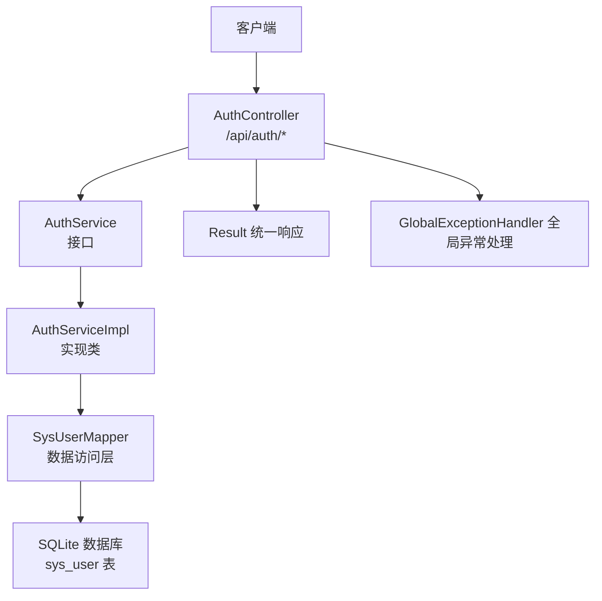
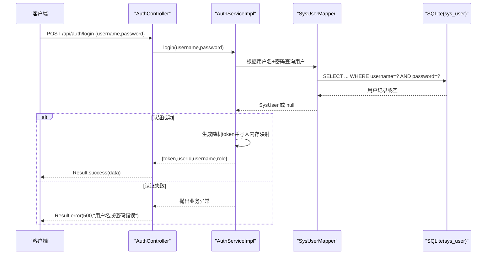
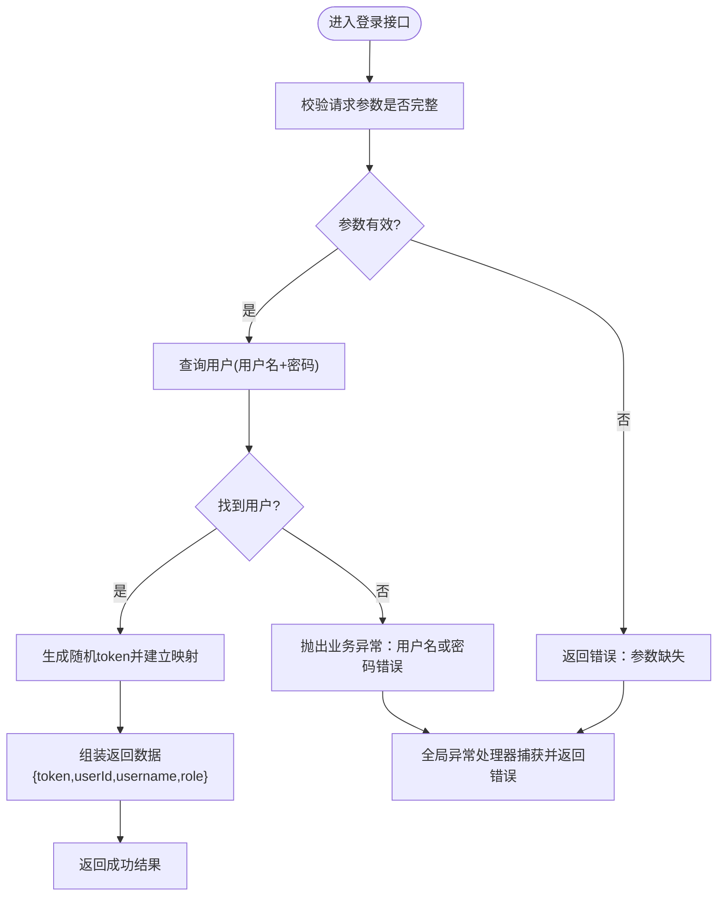
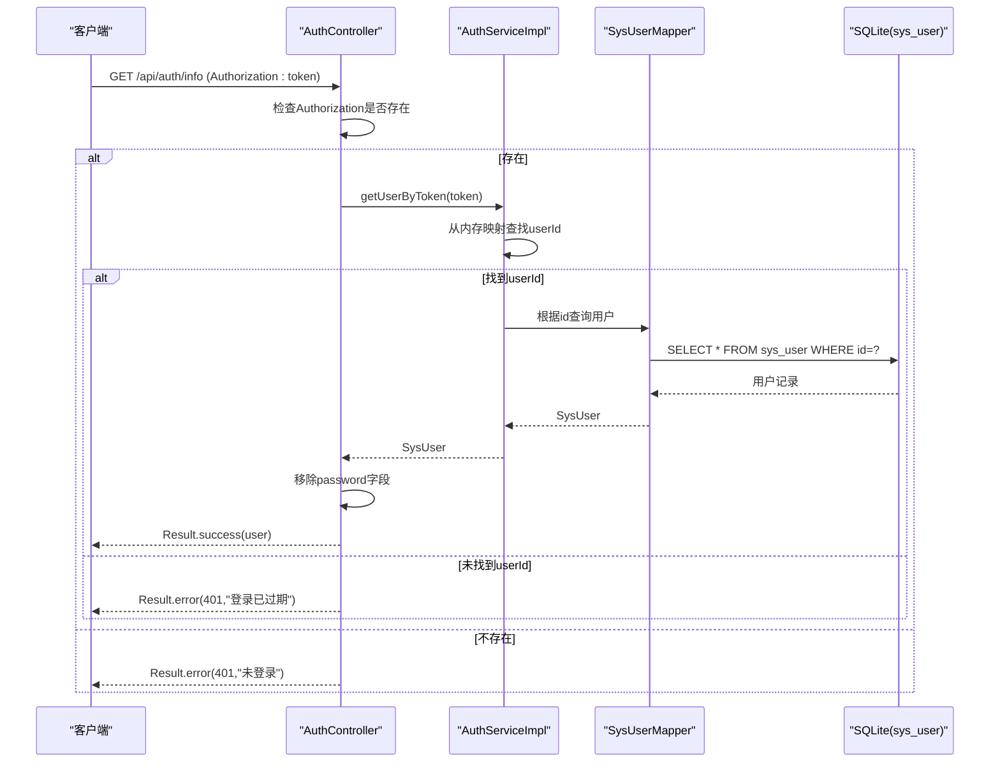
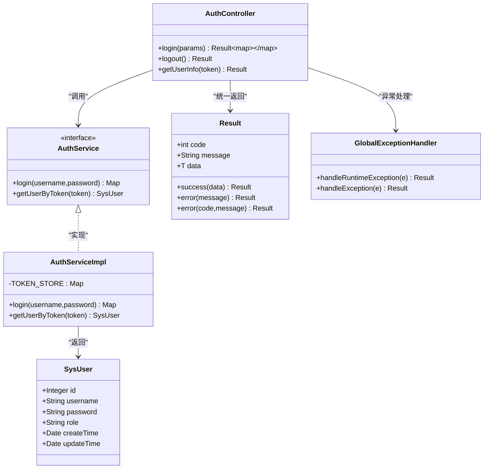

# 认证接口

<cite>
**本文引用的文件**   
- [AuthController.java](file://backend/src/main/java/com/xx/platform/controller/AuthController.java)
- [AuthService.java](file://backend/src/main/java/com/xx/platform/service/AuthService.java)
- [AuthServiceImpl.java](file://backend/src/main/java/com/xx/platform/service/impl/AuthServiceImpl.java)
- [SysUser.java](file://backend/src/main/java/com/xx/platform/entity/SysUser.java)
- [Result.java](file://backend/src/main/java/com/xx/platform/common/Result.java)
- [GlobalExceptionHandler.java](file://backend/src/main/java/com/xx/platform/common/GlobalExceptionHandler.java)
- [application.yml](file://backend/src/main/resources/application.yml)
- [schema.sql](file://backend/src/main/resources/schema.sql)
- [API.md](file://API.md)
</cite>

## 目录
1. [简介](#简介)
2. [项目结构](#项目结构)
3. [核心组件](#核心组件)
4. [架构总览](#架构总览)
5. [详细组件分析](#详细组件分析)
6. [依赖关系分析](#依赖关系分析)
7. [性能与安全考虑](#性能与安全考虑)
8. [故障排查指南](#故障排查指南)
9. [结论](#结论)
10. [附录：接口规范与示例](#附录接口规范与示例)

## 简介
本文件为 JZPlatform 门户系统“认证模块”的 API 接口文档，覆盖用户登录、登出、获取当前用户信息三个 RESTful 接口。文档包含 HTTP 方法、URL 模式、请求体格式、响应结构、认证机制说明，以及 Token 管理机制的实现细节（当前实现为内存令牌映射，非 JWT）。同时给出成功与错误场景的请求/响应示例，并总结权限控制策略与安全注意事项。

## 项目结构
认证相关后端代码位于 backend 模块中，采用 Controller-Service-Mapper 分层结构；统一响应封装 Result 与全局异常处理 GlobalExceptionHandler 提供一致的返回格式与错误提示。数据库使用 SQLite，初始脚本 schema.sql 中包含默认管理员账户。

图表来源
- [AuthController.java:15-67](file://backend/src/main/java/com/xx/platform/controller/AuthController.java#L15-L67)
- [AuthService.java:10-26](file://backend/src/main/java/com/xx/platform/service/AuthService.java#L10-L26)
- [AuthServiceImpl.java:19-61](file://backend/src/main/java/com/xx/platform/service/impl/AuthServiceImpl.java#L19-L61)
- [SysUser.java:13-32](file://backend/src/main/java/com/xx/platform/entity/SysUser.java#L13-L32)
- [Result.java:9-52](file://backend/src/main/java/com/xx/platform/common/Result.java#L9-L52)
- [GlobalExceptionHandler.java:10-29](file://backend/src/main/java/com/xx/platform/common/GlobalExceptionHandler.java#L10-L29)
- [schema.sql:5-12](file://backend/src/main/resources/schema.sql#L5-L12)

章节来源
- [AuthController.java:15-67](file://backend/src/main/java/com/xx/platform/controller/AuthController.java#L15-L67)
- [AuthService.java:10-26](file://backend/src/main/java/com/xx/platform/service/AuthService.java#L10-L26)
- [AuthServiceImpl.java:19-61](file://backend/src/main/java/com/xx/platform/service/impl/AuthServiceImpl.java#L19-L61)
- [SysUser.java:13-32](file://backend/src/main/java/com/xx/platform/entity/SysUser.java#L13-L32)
- [Result.java:9-52](file://backend/src/main/java/com/xx/platform/common/Result.java#L9-L52)
- [GlobalExceptionHandler.java:10-29](file://backend/src/main/java/com/xx/platform/common/GlobalExceptionHandler.java#L10-L29)
- [schema.sql:5-12](file://backend/src/main/resources/schema.sql#L5-L12)

## 核心组件
- 控制器层：AuthController 暴露 /api/auth/login、/api/auth/logout、/api/auth/info 三个端点。
- 服务层：AuthService 定义认证能力接口；AuthServiceImpl 实现登录校验、Token 生成与查询、按 Token 获取用户信息。
- 实体层：SysUser 表示系统用户，含 id、username、password、role 等字段。
- 通用层：Result 统一响应封装；GlobalExceptionHandler 统一捕获异常并返回友好消息。
- 配置与数据：application.yml 指定端口与数据库连接；schema.sql 初始化 sys_user 表及默认管理员账号。

章节来源
- [AuthController.java:15-67](file://backend/src/main/java/com/xx/platform/controller/AuthController.java#L15-L67)
- [AuthService.java:10-26](file://backend/src/main/java/com/xx/platform/service/AuthService.java#L10-L26)
- [AuthServiceImpl.java:19-61](file://backend/src/main/java/com/xx/platform/service/impl/AuthServiceImpl.java#L19-L61)
- [SysUser.java:13-32](file://backend/src/main/java/com/xx/platform/entity/SysUser.java#L13-L32)
- [Result.java:9-52](file://backend/src/main/java/com/xx/platform/common/Result.java#L9-L52)
- [GlobalExceptionHandler.java:10-29](file://backend/src/main/java/com/xx/platform/common/GlobalExceptionHandler.java#L10-L29)
- [application.yml:1-29](file://backend/src/main/resources/application.yml#L1-L29)
- [schema.sql:5-12](file://backend/src/main/resources/schema.sql#L5-L12)

## 架构总览
认证流程采用无状态 Token 方案（当前为内存映射），客户端在登录后保存服务端返回的 token，并在后续受保护接口调用时通过 Authorization 请求头携带。

图表来源
- [AuthController.java:28-37](file://backend/src/main/java/com/xx/platform/controller/AuthController.java#L28-L37)
- [AuthServiceImpl.java:29-51](file://backend/src/main/java/com/xx/platform/service/impl/AuthServiceImpl.java#L29-L51)
- [SysUser.java:13-32](file://backend/src/main/java/com/xx/platform/entity/SysUser.java#L13-L32)
- [schema.sql:5-12](file://backend/src/main/resources/schema.sql#L5-L12)

## 详细组件分析

### 登录接口
- 方法：POST
- URL：/api/auth/login
- 请求头：Content-Type: application/json
- 请求体：包含 username、password 两个字符串字段
- 成功响应：code=200，data 包含 token、userId、username、role
- 失败响应：code=500，message 为错误描述（如用户名或密码错误）

图表来源
- [AuthController.java:28-37](file://backend/src/main/java/com/xx/platform/controller/AuthController.java#L28-L37)
- [AuthServiceImpl.java:29-51](file://backend/src/main/java/com/xx/platform/service/impl/AuthServiceImpl.java#L29-L51)
- [GlobalExceptionHandler.java:16-19](file://backend/src/main/java/com/xx/platform/common/GlobalExceptionHandler.java#L16-L19)

章节来源
- [AuthController.java:28-37](file://backend/src/main/java/com/xx/platform/controller/AuthController.java#L28-L37)
- [AuthServiceImpl.java:29-51](file://backend/src/main/java/com/xx/platform/service/impl/AuthServiceImpl.java#L29-L51)
- [GlobalExceptionHandler.java:16-19](file://backend/src/main/java/com/xx/platform/common/GlobalExceptionHandler.java#L16-L19)

### 登出接口
- 方法：POST
- URL：/api/auth/logout
- 需要认证：否（当前实现无需校验）
- 行为：服务端不维护会话，客户端自行清除本地 token 即可
- 响应：code=200，data=null

章节来源
- [AuthController.java:43-47](file://backend/src/main/java/com/xx/platform/controller/AuthController.java#L43-L47)

### 获取当前用户信息接口
- 方法：GET
- URL：/api/auth/info
- 认证方式：Authorization 请求头携带 token
- 成功响应：code=200，data 为用户对象（不含 password）
- 失败响应：
  - 未携带 token：code=401，message="未登录"
  - token 无效或过期：code=401，message="登录已过期"

图表来源
- [AuthController.java:55-66](file://backend/src/main/java/com/xx/platform/controller/AuthController.java#L55-L66)
- [AuthServiceImpl.java:54-60](file://backend/src/main/java/com/xx/platform/service/impl/AuthServiceImpl.java#L54-L60)
- [SysUser.java:13-32](file://backend/src/main/java/com/xx/platform/entity/SysUser.java#L13-L32)
- [schema.sql:5-12](file://backend/src/main/resources/schema.sql#L5-L12)

章节来源
- [AuthController.java:55-66](file://backend/src/main/java/com/xx/platform/controller/AuthController.java#L55-L66)
- [AuthServiceImpl.java:54-60](file://backend/src/main/java/com/xx/platform/service/impl/AuthServiceImpl.java#L54-L60)

## 依赖关系分析
- AuthController 依赖 AuthService 接口，实际由 AuthServiceImpl 实现。
- AuthServiceImpl 依赖 SysUserMapper 进行数据访问，底层为 SQLite 数据库。
- 所有控制器均通过 Result 统一返回结构，异常由 GlobalExceptionHandler 统一处理。
- 其他管理接口（如 ShowcaseController、UserController）复用同一认证与鉴权逻辑，通过 Authorization 头校验 token 并判断角色。

图表来源
- [AuthController.java:15-67](file://backend/src/main/java/com/xx/platform/controller/AuthController.java#L15-L67)
- [AuthService.java:10-26](file://backend/src/main/java/com/xx/platform/service/AuthService.java#L10-L26)
- [AuthServiceImpl.java:19-61](file://backend/src/main/java/com/xx/platform/service/impl/AuthServiceImpl.java#L19-L61)
- [SysUser.java:13-32](file://backend/src/main/java/com/xx/platform/entity/SysUser.java#L13-L32)
- [Result.java:9-52](file://backend/src/main/java/com/xx/platform/common/Result.java#L9-L52)
- [GlobalExceptionHandler.java:10-29](file://backend/src/main/java/com/xx/platform/common/GlobalExceptionHandler.java#L10-L29)

章节来源
- [AuthController.java:15-67](file://backend/src/main/java/com/xx/platform/controller/AuthController.java#L15-L67)
- [AuthService.java:10-26](file://backend/src/main/java/com/xx/platform/service/AuthService.java#L10-L26)
- [AuthServiceImpl.java:19-61](file://backend/src/main/java/com/xx/platform/service/impl/AuthServiceImpl.java#L19-L61)
- [SysUser.java:13-32](file://backend/src/main/java/com/xx/platform/entity/SysUser.java#L13-L32)
- [Result.java:9-52](file://backend/src/main/java/com/xx/platform/common/Result.java#L9-L52)
- [GlobalExceptionHandler.java:10-29](file://backend/src/main/java/com/xx/platform/common/GlobalExceptionHandler.java#L10-L29)

## 性能与安全考虑
- Token 存储：当前使用进程内 ConcurrentHashMap 存储 token→userId 映射，适合单机内部系统；生产环境建议迁移至 Redis 以支持多实例共享与过期清理。
- 密码安全：当前实现直接比较明文密码，存在安全风险。建议引入 BCrypt 等强哈希算法对密码进行加密存储与验证。
- 令牌生命周期：当前未实现过期时间，建议为 token 增加 TTL 并配合定时任务或缓存过期机制清理失效令牌。
- 传输安全：建议在网关或反向代理层启用 HTTPS，避免 token 明文传输。
- 防重放与限流：可结合签名、时间戳、nonce 与速率限制增强安全性。
- 权限控制：当前基于角色字符串（ADMIN/USER）进行简单鉴权，可扩展为基于资源的细粒度授权模型。

[本节为通用指导，不直接分析具体文件]

## 故障排查指南
- 登录失败（用户名或密码错误）：
  - 现象：返回 code=500，message 为“用户名或密码错误”。
  - 原因：数据库未找到匹配的用户记录或密码不一致。
  - 排查：确认 sys_user 表中是否存在该用户且密码正确；注意当前为明文比对。
- 获取用户信息失败（未登录/登录已过期）：
  - 现象：返回 code=401，message 为“未登录”或“登录已过期”。
  - 原因：Authorization 头缺失或 token 不在内存映射中。
  - 排查：确认客户端是否正确携带 Authorization 头；检查服务端进程重启后内存映射丢失导致 token 失效。
- 服务器内部错误：
  - 现象：返回 code=500，message 为“服务器内部错误：...”。
  - 原因：未捕获异常被全局异常处理器捕获。
  - 排查：查看服务端日志定位异常堆栈。

章节来源
- [AuthServiceImpl.java:36-38](file://backend/src/main/java/com/xx/platform/service/impl/AuthServiceImpl.java#L36-L38)
- [AuthController.java:57-63](file://backend/src/main/java/com/xx/platform/controller/AuthController.java#L57-L63)
- [GlobalExceptionHandler.java:16-28](file://backend/src/main/java/com/xx/platform/common/GlobalExceptionHandler.java#L16-L28)

## 结论
认证模块提供了基础的登录、登出与获取当前用户信息能力，采用统一的 Result 响应结构与全局异常处理，便于前端集成。当前实现为轻量级内存令牌方案，适合内部演示与小型部署；在生产环境中应引入密码加密、令牌过期与分布式存储等安全与可靠性措施。

[本节为总结性内容，不直接分析具体文件]

## 附录：接口规范与示例

### 基础约定
- 基础路径：/api
- 认证方式：Authorization 请求头携带 token
- 统一响应格式：{ code, message, data }

章节来源
- [API.md:1-5](file://API.md#L1-L5)

### 登录
- 方法：POST
- URL：/api/auth/login
- 请求体：
  - username：字符串
  - password：字符串
- 成功响应示例：
  - code: 200
  - message: "操作成功"
  - data: { token, userId, username, role }
- 失败响应示例：
  - code: 500
  - message: "用户名或密码错误"

章节来源
- [AuthController.java:28-37](file://backend/src/main/java/com/xx/platform/controller/AuthController.java#L28-L37)
- [AuthServiceImpl.java:29-51](file://backend/src/main/java/com/xx/platform/service/impl/AuthServiceImpl.java#L29-L51)
- [API.md:9-14](file://API.md#L9-L14)

### 登出
- 方法：POST
- URL：/api/auth/logout
- 需要认证：否
- 成功响应示例：
  - code: 200
  - message: "操作成功"
  - data: null

章节来源
- [AuthController.java:43-47](file://backend/src/main/java/com/xx/platform/controller/AuthController.java#L43-L47)
- [API.md:16-18](file://API.md#L16-L18)

### 获取当前用户信息
- 方法：GET
- URL：/api/auth/info
- 请求头：Authorization: {token}
- 成功响应示例：
  - code: 200
  - message: "操作成功"
  - data: { id, username, role, createTime, updateTime }（不含 password）
- 失败响应示例：
  - code: 401
  - message: "未登录" 或 "登录已过期"

章节来源
- [AuthController.java:55-66](file://backend/src/main/java/com/xx/platform/controller/AuthController.java#L55-L66)
- [API.md:20-23](file://API.md#L20-L23)

### 权限控制策略
- 角色字段：SysUser.role 支持 ADMIN/USER。
- 鉴权方式：其他受保护接口通过 Authorization 头解析 token，再根据用户角色进行权限判断。
- 参考实现：其他控制器中的 checkAdmin 方法用于校验管理员权限。

章节来源
- [SysUser.java:26-27](file://backend/src/main/java/com/xx/platform/entity/SysUser.java#L26-L27)
- [ShowcaseController.java:81-85](file://backend/src/main/java/com/xx/platform/controller/ShowcaseController.java#L81-L85)
- [UserController.java:78-86](file://backend/src/main/java/com/xx/platform/controller/UserController.java#L78-L86)

### 常见错误码与处理
- 200：操作成功
- 401：未登录或登录已过期
- 500：业务错误或服务器内部错误（由全局异常处理器统一返回）

章节来源
- [Result.java:24-51](file://backend/src/main/java/com/xx/platform/common/Result.java#L24-L51)
- [GlobalExceptionHandler.java:16-28](file://backend/src/main/java/com/xx/platform/common/GlobalExceptionHandler.java#L16-L28)

### 数据库与默认账户
- 用户表：sys_user（id、username、password、role、create_time、update_time）
- 默认管理员账户：admin/admin123（仅用于演示，生产环境需修改并加密存储）

章节来源
- [schema.sql:5-12](file://backend/src/main/resources/schema.sql#L5-L12)
- [schema.sql:59-60](file://backend/src/main/resources/schema.sql#L59-L60)

### 服务端口与运行环境
- 服务端口：8080
- 数据库：SQLite（platform.db）

章节来源
- [application.yml:1-8](file://backend/src/main/resources/application.yml#L1-L8)