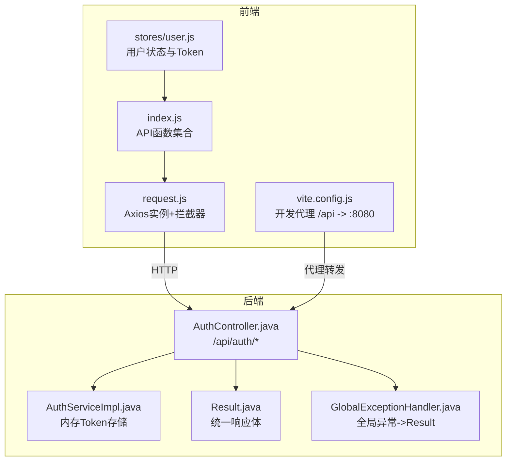
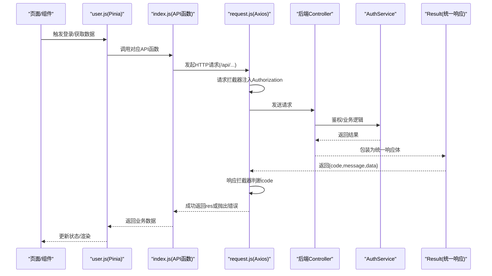
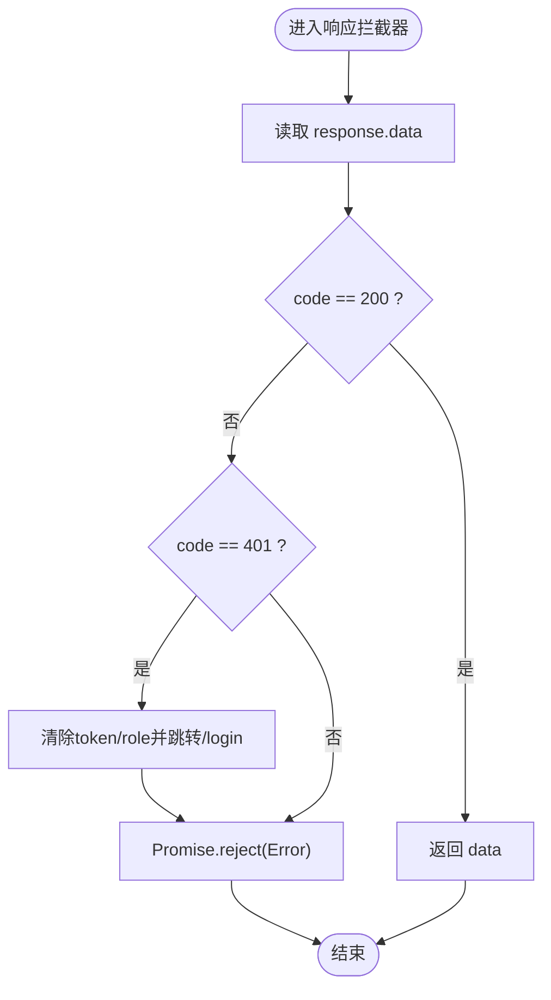
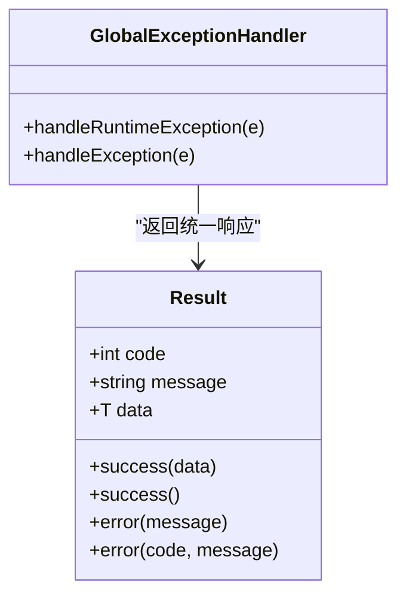
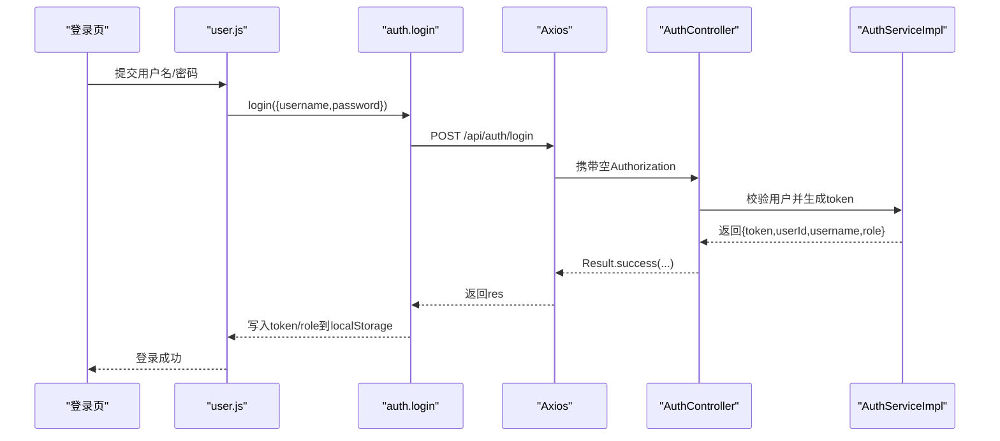
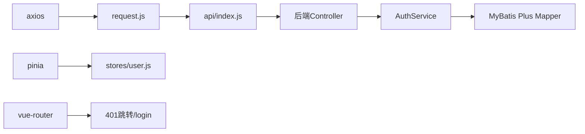

# API集成层

<cite>
**本文引用的文件**
- [frontend/src/api/request.js](file://frontend/src/api/request.js)
- [frontend/src/api/index.js](file://frontend/src/api/index.js)
- [frontend/src/stores/user.js](file://frontend/src/stores/user.js)
- [frontend/vite.config.js](file://frontend/vite.config.js)
- [API.md](file://API.md)
- [backend/src/main/java/com/xx/platform/common/Result.java](file://backend/src/main/java/com/xx/platform/common/Result.java)
- [backend/src/main/java/com/xx/platform/common/GlobalExceptionHandler.java](file://backend/src/main/java/com/xx/platform/common/GlobalExceptionHandler.java)
- [backend/src/main/java/com/xx/platform/controller/AuthController.java](file://backend/src/main/java/com/xx/platform/controller/AuthController.java)
- [backend/src/main/java/com/xx/platform/service/impl/AuthServiceImpl.java](file://backend/src/main/java/com/xx/platform/service/impl/AuthServiceImpl.java)
</cite>

## 目录
1. [简介](#简介)
2. [项目结构](#项目结构)
3. [核心组件](#核心组件)
4. [架构总览](#架构总览)
5. [详细组件分析](#详细组件分析)
6. [依赖关系分析](#依赖关系分析)
7. [性能与优化建议](#性能与优化建议)
8. [故障排查指南](#故障排查指南)
9. [结论](#结论)
10. [附录：API调用示例与配置](#附录api调用示例与配置)

## 简介
本文件面向JZPlatform门户系统的前端API集成层，系统性说明Axios请求封装、HTTP拦截器实现、请求响应处理机制；并阐述API接口组织方式、错误处理策略、Token管理与认证流程。文档同时给出具体API调用示例、请求配置选项与响应数据处理方法，并提供API版本管理、缓存策略与性能优化建议，帮助读者快速理解与扩展该集成层。

## 项目结构
前端API集成层主要位于以下位置：
- Axios实例与拦截器：frontend/src/api/request.js
- 业务API函数集合：frontend/src/api/index.js
- 用户状态与Token持久化：frontend/src/stores/user.js
- 开发代理配置（Vite）：frontend/vite.config.js
- 后端统一响应体定义：backend/src/main/java/com/xx/platform/common/Result.java
- 全局异常处理：backend/src/main/java/com/xx/platform/common/GlobalExceptionHandler.java
- 认证控制器与服务：backend/src/main/java/com/xx/platform/controller/AuthController.java、backend/src/main/java/com/xx/platform/service/impl/AuthServiceImpl.java
- 完整API契约文档：API.md

图表来源
- [frontend/src/api/request.js:1-45](file://frontend/src/api/request.js#L1-L45)
- [frontend/src/api/index.js:1-137](file://frontend/src/api/index.js#L1-L137)
- [frontend/src/stores/user.js:1-57](file://frontend/src/stores/user.js#L1-L57)
- [frontend/vite.config.js:1-20](file://frontend/vite.config.js#L1-L20)
- [backend/src/main/java/com/xx/platform/controller/AuthController.java:1-45](file://backend/src/main/java/com/xx/platform/controller/AuthController.java#L1-L45)
- [backend/src/main/java/com/xx/platform/service/impl/AuthServiceImpl.java:1-40](file://backend/src/main/java/com/xx/platform/service/impl/AuthServiceImpl.java#L1-L40)
- [backend/src/main/java/com/xx/platform/common/Result.java:1-53](file://backend/src/main/java/com/xx/platform/common/Result.java#L1-L53)
- [backend/src/main/java/com/xx/platform/common/GlobalExceptionHandler.java:1-29](file://backend/src/main/java/com/xx/platform/common/GlobalExceptionHandler.java#L1-L29)

章节来源
- [frontend/src/api/request.js:1-45](file://frontend/src/api/request.js#L1-L45)
- [frontend/src/api/index.js:1-137](file://frontend/src/api/index.js#L1-L137)
- [frontend/src/stores/user.js:1-57](file://frontend/src/stores/user.js#L1-L57)
- [frontend/vite.config.js:1-20](file://frontend/vite.config.js#L1-L20)
- [API.md:1-197](file://API.md#L1-L197)
- [backend/src/main/java/com/xx/platform/common/Result.java:1-53](file://backend/src/main/java/com/xx/platform/common/Result.java#L1-L53)
- [backend/src/main/java/com/xx/platform/common/GlobalExceptionHandler.java:1-29](file://backend/src/main/java/com/xx/platform/common/GlobalExceptionHandler.java#L1-L29)
- [backend/src/main/java/com/xx/platform/controller/AuthController.java:1-45](file://backend/src/main/java/com/xx/platform/controller/AuthController.java#L1-L45)
- [backend/src/main/java/com/xx/platform/service/impl/AuthServiceImpl.java:1-40](file://backend/src/main/java/com/xx/platform/service/impl/AuthServiceImpl.java#L1-L40)

## 核心组件
- Axios实例与拦截器
  - 基础URL与超时：通过axios.create设置baseURL为/api，超时10秒。
  - 请求拦截器：自动从本地存储读取token并注入Authorization头。
  - 响应拦截器：统一解析后端返回的code字段，非200时拒绝Promise；当code为401时清理本地token与角色并跳转登录页。
- API函数集合
  - 按领域划分：认证、用户、应用、分类、宣贯、配置、统计等模块，每个模块提供CRUD或查询函数。
  - 上传接口使用FormData并显式设置multipart/form-data。
- 用户状态与Token管理
  - Pinia store负责登录成功后写入token与role到localStorage，并在需要时拉取当前用户信息。
  - 登出时清空store与本地存储。
- 开发代理
  - Vite server将/api与/uploads路径代理至后端http://localhost:8080，便于本地联调。

章节来源
- [frontend/src/api/request.js:1-45](file://frontend/src/api/request.js#L1-L45)
- [frontend/src/api/index.js:1-137](file://frontend/src/api/index.js#L1-L137)
- [frontend/src/stores/user.js:1-57](file://frontend/src/stores/user.js#L1-L57)
- [frontend/vite.config.js:1-20](file://frontend/vite.config.js#L1-L20)

## 架构总览
下图展示了从页面发起API调用到后端返回的统一响应体的端到端流程，包括拦截器、Token注入、权限校验与错误处理。

图表来源
- [frontend/src/api/request.js:1-45](file://frontend/src/api/request.js#L1-L45)
- [frontend/src/api/index.js:1-137](file://frontend/src/api/index.js#L1-L137)
- [frontend/src/stores/user.js:1-57](file://frontend/src/stores/user.js#L1-L57)
- [backend/src/main/java/com/xx/platform/controller/AuthController.java:1-45](file://backend/src/main/java/com/xx/platform/controller/AuthController.java#L1-L45)
- [backend/src/main/java/com/xx/platform/service/impl/AuthServiceImpl.java:1-40](file://backend/src/main/java/com/xx/platform/service/impl/AuthServiceImpl.java#L1-L40)
- [backend/src/main/java/com/xx/platform/common/Result.java:1-53](file://backend/src/main/java/com/xx/platform/common/Result.java#L1-L53)

## 详细组件分析

### Axios请求封装与拦截器
- 实例配置
  - baseURL设为/api，配合Vite代理在开发环境转发到后端8080端口。
  - timeout设置为10秒，避免长时间阻塞。
- 请求拦截器
  - 从localStorage读取token，若存在则注入Authorization请求头。
- 响应拦截器
  - 对response.data进行code判断：
    - code=200：直接返回data。
    - code≠200：构造Error并reject；当code=401时清理本地token与role并跳转/login。
- 适用场景
  - 所有通过request实例发起的请求均受此拦截器保护，无需在各业务处重复处理。

图表来源
- [frontend/src/api/request.js:24-42](file://frontend/src/api/request.js#L24-L42)

章节来源
- [frontend/src/api/request.js:1-45](file://frontend/src/api/request.js#L1-L45)

### API接口组织方式
- 模块化导出
  - 以功能域为单位导出函数，如认证、用户、应用、分类、宣贯、配置、统计等。
- 命名约定
  - 动词+名词形式，例如login、logout、getUserInfo、getUsers、addUser、updateApp、deleteCategory等。
- 参数传递
  - GET请求使用params对象传递查询参数；POST/PUT/DELETE使用body或路径参数。
- 文件上传
  - 使用FormData构建表单数据，并显式设置Content-Type为multipart/form-data。

章节来源
- [frontend/src/api/index.js:1-137](file://frontend/src/api/index.js#L1-L137)
- [API.md:1-197](file://API.md#L1-L197)

### 错误处理策略
- 后端统一响应体
  - Result包含code、message、data三字段，success默认code=200，error默认code=500。
- 全局异常处理
  - GlobalExceptionHandler捕获运行时异常与未捕获异常，统一返回Result格式。
- 前端统一处理
  - 响应拦截器根据code判断是否成功；401时清理本地状态并跳转登录；其他错误以Error形式向上抛出，由调用方按需处理。

图表来源
- [backend/src/main/java/com/xx/platform/common/Result.java:1-53](file://backend/src/main/java/com/xx/platform/common/Result.java#L1-L53)
- [backend/src/main/java/com/xx/platform/common/GlobalExceptionHandler.java:1-29](file://backend/src/main/java/com/xx/platform/common/GlobalExceptionHandler.java#L1-L29)

章节来源
- [backend/src/main/java/com/xx/platform/common/Result.java:1-53](file://backend/src/main/java/com/xx/platform/common/Result.java#L1-L53)
- [backend/src/main/java/com/xx/platform/common/GlobalExceptionHandler.java:1-29](file://backend/src/main/java/com/xx/platform/common/GlobalExceptionHandler.java#L1-L29)
- [frontend/src/api/request.js:24-42](file://frontend/src/api/request.js#L24-L42)

### Token管理与认证机制
- 登录流程
  - 调用认证接口后，store保存token与role到localStorage，并返回用户信息。
- 请求携带Token
  - 请求拦截器自动读取localStorage中的token并注入Authorization头。
- 未授权处理
  - 当后端返回code=401时，前端清理本地token与role并跳转到登录页。
- 服务端Token存储
  - 采用内存Map存储Token与用户映射（适合内部系统），生产环境建议使用Redis等分布式存储。

图表来源
- [frontend/src/stores/user.js:20-31](file://frontend/src/stores/user.js#L20-L31)
- [frontend/src/api/index.js:3-11](file://frontend/src/api/index.js#L3-L11)
- [frontend/src/api/request.js:12-22](file://frontend/src/api/request.js#L12-L22)
- [backend/src/main/java/com/xx/platform/controller/AuthController.java:22-37](file://backend/src/main/java/com/xx/platform/controller/AuthController.java#L22-L37)
- [backend/src/main/java/com/xx/platform/service/impl/AuthServiceImpl.java:28-40](file://backend/src/main/java/com/xx/platform/service/impl/AuthServiceImpl.java#L28-L40)

章节来源
- [frontend/src/stores/user.js:1-57](file://frontend/src/stores/user.js#L1-L57)
- [frontend/src/api/index.js:1-11](file://frontend/src/api/index.js#L1-L11)
- [frontend/src/api/request.js:12-22](file://frontend/src/api/request.js#L12-L22)
- [backend/src/main/java/com/xx/platform/controller/AuthController.java:1-45](file://backend/src/main/java/com/xx/platform/controller/AuthController.java#L1-L45)
- [backend/src/main/java/com/xx/platform/service/impl/AuthServiceImpl.java:1-40](file://backend/src/main/java/com/xx/platform/service/impl/AuthServiceImpl.java#L1-L40)

### 请求配置选项与响应数据处理
- 请求配置
  - baseURL：/api（开发环境由Vite代理转发）。
  - timeout：10秒。
  - headers：Authorization由拦截器自动注入；上传接口需手动设置multipart/form-data。
  - params：GET请求查询参数通过params对象传递。
- 响应处理
  - 成功：拦截器返回res，调用方可直接使用res.data等业务字段。
  - 失败：拦截器抛出Error，调用方可在catch中统一提示或重试。

章节来源
- [frontend/src/api/request.js:7-10](file://frontend/src/api/request.js#L7-L10)
- [frontend/src/api/request.js:12-22](file://frontend/src/api/request.js#L12-L22)
- [frontend/src/api/request.js:24-42](file://frontend/src/api/request.js#L24-L42)
- [frontend/src/api/index.js:123-131](file://frontend/src/api/index.js#L123-L131)

## 依赖关系分析
- 前端依赖
  - axios：HTTP客户端。
  - pinia：状态管理（用于Token与用户信息）。
  - vue-router：路由跳转（401时跳转/login）。
- 后端依赖
  - Spring Boot Controller/Service/Mapper分层。
  - MyBatis Plus：数据访问。
  - Lombok：简化代码。
- 关键耦合点
  - 前后端通过统一的Result结构与code语义约定耦合。
  - 认证流程通过Authorization头与内存Token存储耦合。

图表来源
- [frontend/package.json:11-18](file://frontend/package.json#L11-L18)
- [frontend/src/api/request.js:1-10](file://frontend/src/api/request.js#L1-L10)
- [frontend/src/stores/user.js:1-10](file://frontend/src/stores/user.js#L1-L10)
- [backend/src/main/java/com/xx/platform/controller/AuthController.java:1-20](file://backend/src/main/java/com/xx/platform/controller/AuthController.java#L1-L20)

章节来源
- [frontend/package.json:1-24](file://frontend/package.json#L1-L24)
- [frontend/src/api/request.js:1-10](file://frontend/src/api/request.js#L1-L10)
- [frontend/src/stores/user.js:1-10](file://frontend/src/stores/user.js#L1-L10)
- [backend/src/main/java/com/xx/platform/controller/AuthController.java:1-20](file://backend/src/main/java/com/xx/platform/controller/AuthController.java#L1-L20)

## 性能与优化建议
- 请求级优化
  - 合理设置timeout，避免长连接阻塞；必要时针对大列表接口单独调整。
  - 对高频只读接口（如分类列表、平台配置）增加前端缓存（内存或IndexedDB），减少重复请求。
- 并发与去重
  - 对相同参数的并发请求进行去重，避免多次网络往返。
- 分页与懒加载
  - 列表接口使用分页参数page/size，结合虚拟滚动提升大数据量渲染性能。
- 资源与传输
  - 图片等资源走静态资源服务器或CDN；启用Gzip/Brotli压缩。
- 版本管理
  - 建议在URL前缀引入版本号，如/api/v1，便于向后兼容与灰度发布。
- 监控与可观测性
  - 记录关键接口的耗时与错误率，接入APM或日志系统。

[本节为通用建议，不直接分析具体文件]

## 故障排查指南
- 401未授权
  - 现象：登录后仍被要求重新登录或页面跳转至/login。
  - 排查：检查localStorage是否存在token；确认请求拦截器是否正确注入Authorization；核对后端Token有效性。
- 跨域问题
  - 现象：开发环境报CORS错误。
  - 排查：确认Vite代理配置/api与/uploads已正确指向后端地址。
- 上传失败
  - 现象：文件上传接口报错。
  - 排查：确认Content-Type是否为multipart/form-data；检查formData字段名是否与后端一致。
- 后端异常
  - 现象：统一返回code=500且message为“服务器内部错误”。
  - 排查：查看后端日志；确认GlobalExceptionHandler是否正确捕获异常并返回Result。

章节来源
- [frontend/src/api/request.js:24-42](file://frontend/src/api/request.js#L24-L42)
- [frontend/vite.config.js:6-18](file://frontend/vite.config.js#L6-L18)
- [backend/src/main/java/com/xx/platform/common/GlobalExceptionHandler.java:10-29](file://backend/src/main/java/com/xx/platform/common/GlobalExceptionHandler.java#L10-L29)

## 结论
本API集成层通过Axios实例与拦截器实现了统一的请求/响应处理、Token自动注入与401无感刷新；以模块化API函数组织接口，结合Pinia完成Token与用户状态管理；后端通过Result与全局异常处理器保证响应一致性。在此基础上，建议引入API版本化、前端缓存与请求去重等优化手段，进一步提升稳定性与性能。

[本节为总结性内容，不直接分析具体文件]

## 附录：API调用示例与配置
- 登录
  - 调用：调用认证模块登录函数，传入用户名与密码。
  - 结果：成功后将token与role写入localStorage，并可在后续请求中自动携带。
  - 参考路径：[frontend/src/stores/user.js:20-31](file://frontend/src/stores/user.js#L20-L31)、[frontend/src/api/index.js:3-11](file://frontend/src/api/index.js#L3-L11)
- 获取用户信息
  - 调用：调用获取当前用户信息函数。
  - 结果：更新store中的用户信息；若返回401则清理状态并跳转登录。
  - 参考路径：[frontend/src/stores/user.js:44-54](file://frontend/src/stores/user.js#L44-L54)、[frontend/src/api/index.js:13-16](file://frontend/src/api/index.js#L13-L16)
- 应用列表
  - 调用：传入分页与筛选参数（page、size、categoryId、keyword、sortField、sortOrder）。
  - 结果：返回应用列表数据。
  - 参考路径：[frontend/src/api/index.js:38-41](file://frontend/src/api/index.js#L38-L41)、[API.md:48-56](file://API.md#L48-L56)
- 上传文件
  - 调用：构造FormData并调用上传接口，设置Content-Type为multipart/form-data。
  - 结果：返回文件访问路径。
  - 参考路径：[frontend/src/api/index.js:123-131](file://frontend/src/api/index.js#L123-L131)、[API.md:146-150](file://API.md#L146-L150)
- 请求配置选项
  - baseURL：/api（开发环境由Vite代理转发）。
  - timeout：10秒。
  - headers：Authorization由拦截器自动注入；上传接口需手动设置multipart/form-data。
  - params：GET请求查询参数通过params对象传递。
  - 参考路径：[frontend/src/api/request.js:7-10](file://frontend/src/api/request.js#L7-L10)、[frontend/src/api/request.js:12-22](file://frontend/src/api/request.js#L12-L22)、[frontend/src/api/request.js:24-42](file://frontend/src/api/request.js#L24-L42)

章节来源
- [frontend/src/stores/user.js:20-31](file://frontend/src/stores/user.js#L20-L31)
- [frontend/src/stores/user.js:44-54](file://frontend/src/stores/user.js#L44-L54)
- [frontend/src/api/index.js:3-11](file://frontend/src/api/index.js#L3-L11)
- [frontend/src/api/index.js:13-16](file://frontend/src/api/index.js#L13-L16)
- [frontend/src/api/index.js:38-41](file://frontend/src/api/index.js#L38-L41)
- [frontend/src/api/index.js:123-131](file://frontend/src/api/index.js#L123-L131)
- [frontend/src/api/request.js:7-10](file://frontend/src/api/request.js#L7-L10)
- [frontend/src/api/request.js:12-22](file://frontend/src/api/request.js#L12-L22)
- [frontend/src/api/request.js:24-42](file://frontend/src/api/request.js#L24-L42)
- [API.md:48-56](file://API.md#L48-L56)
- [API.md:146-150](file://API.md#L146-L150)