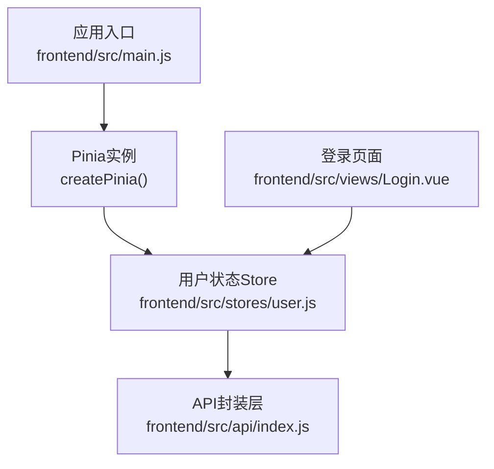
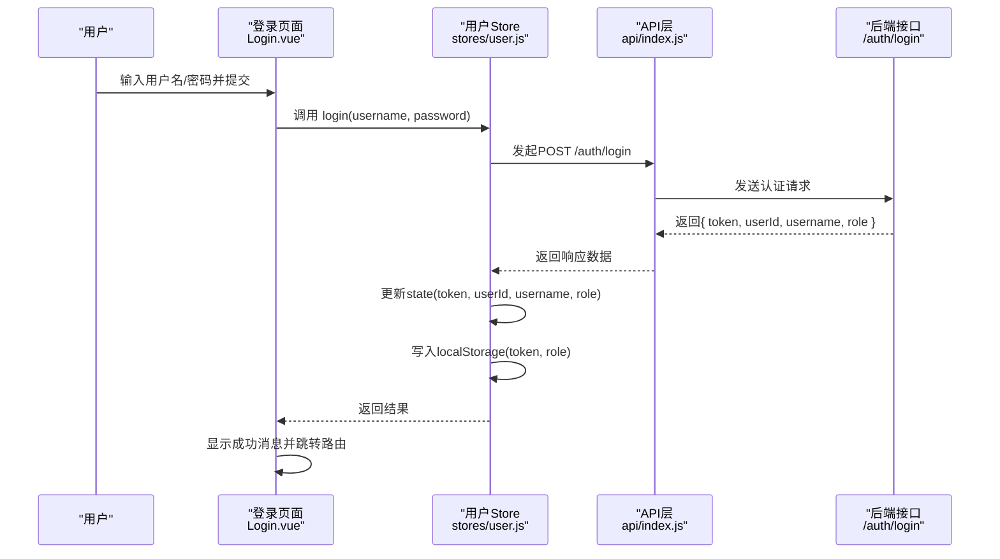
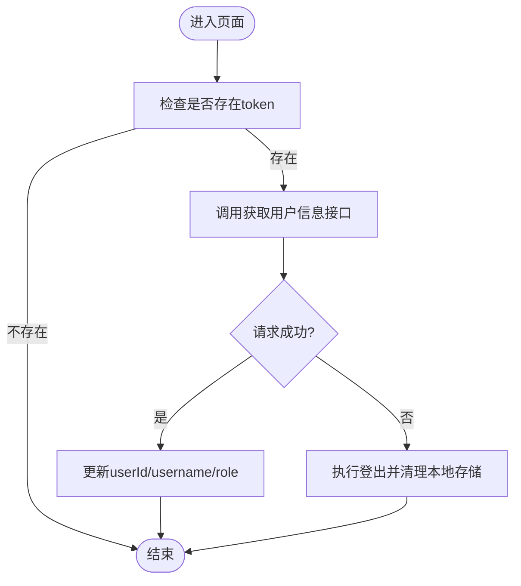
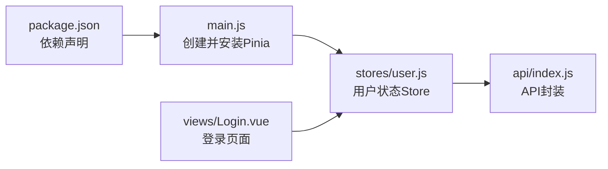

# Pinia状态管理

<cite>
**本文引用的文件**
- [frontend/src/stores/user.js](file://frontend/src/stores/user.js)
- [frontend/src/main.js](file://frontend/src/main.js)
- [frontend/package.json](file://frontend/package.json)
- [frontend/src/views/Login.vue](file://frontend/src/views/Login.vue)
- [frontend/src/api/index.js](file://frontend/src/api/index.js)
</cite>

## 目录
1. [简介](#简介)
2. [项目结构](#项目结构)
3. [核心组件](#核心组件)
4. [架构总览](#架构总览)
5. [详细组件分析](#详细组件分析)
6. [依赖关系分析](#依赖关系分析)
7. [性能考虑](#性能考虑)
8. [故障排查指南](#故障排查指南)
9. [结论](#结论)
10. [附录](#附录)

## 简介
本文件面向JZPlatform门户系统的前端Pinia状态管理，聚焦用户状态管理的实现与最佳实践。文档将说明：
- Store的设计模式与组织结构
- 用户状态的响应式数据绑定机制
- 状态持久化策略（基于localStorage）
- 异步操作处理与错误处理
- Store定义示例、状态更新模式与组件集成方式
- 性能优化建议与常见问题排查

## 项目结构
前端采用Vue 3 + Vite + Pinia + Element Plus技术栈。Pinia在应用启动时注册，用户相关状态集中在单一Store中，登录页面通过调用Store完成认证流程。



图表来源
- [frontend/src/main.js:1-22](file://frontend/src/main.js#L1-L22)
- [frontend/src/stores/user.js:1-57](file://frontend/src/stores/user.js#L1-L57)
- [frontend/src/views/Login.vue:1-103](file://frontend/src/views/Login.vue#L1-L103)
- [frontend/src/api/index.js:1-137](file://frontend/src/api/index.js#L1-L137)

章节来源
- [frontend/src/main.js:1-22](file://frontend/src/main.js#L1-L22)
- [frontend/package.json:1-25](file://frontend/package.json#L1-L25)

## 核心组件
- 用户状态Store（user.js）
  - 使用defineStore声明式定义
  - state包含token、userId、username、role等字段
  - getters提供isLoggedIn、isAdmin等派生状态
  - actions封装登录、登出、获取用户信息等业务逻辑
- 应用入口（main.js）
  - 创建并安装Pinia插件，使useUserStore可在任意组件中使用
- 登录页面（Login.vue）
  - 引入并使用useUserStore，触发login动作，结合路由跳转与消息提示
- API层（api/index.js）
  - 统一封装HTTP请求，供Store的actions调用

章节来源
- [frontend/src/stores/user.js:1-57](file://frontend/src/stores/user.js#L1-L57)
- [frontend/src/main.js:1-22](file://frontend/src/main.js#L1-L22)
- [frontend/src/views/Login.vue:1-103](file://frontend/src/views/Login.vue#L1-L103)
- [frontend/src/api/index.js:1-137](file://frontend/src/api/index.js#L1-L137)

## 架构总览
下图展示了从登录页面到后端认证的完整调用链，以及状态在Pinia中的更新与持久化过程。



图表来源
- [frontend/src/views/Login.vue:28-67](file://frontend/src/views/Login.vue#L28-L67)
- [frontend/src/stores/user.js:20-31](file://frontend/src/stores/user.js#L20-L31)
- [frontend/src/api/index.js:3-6](file://frontend/src/api/index.js#L3-L6)

## 详细组件分析

### 用户状态Store设计
- 设计模式
  - 使用defineStore函数式API，以“模块”为单位组织状态
  - 单一职责：仅负责用户认证与基本信息
- 数据结构
  - state：token、userId、username、role
  - getters：isLoggedIn、isAdmin
  - actions：login、logout、fetchUserInfo
- 复杂度与性能
  - 状态字段数量少，getter计算开销极低
  - 同步更新state，避免不必要的重渲染
- 错误处理
  - fetchUserInfo捕获异常后执行logout，保证状态一致性
- 可维护性
  - 命名清晰，职责明确；后续可按需扩展更多用户相关能力

```mermaid
classDiagram
class UserStore {
+state : { token, userId, username, role }
+getters : { isLoggedIn, isAdmin }
+actions : { login(), logout(), fetchUserInfo() }
}
class API {
+login(data)
+getUserInfo()
}
UserStore --> API : "调用认证与信息接口"
```

图表来源
- [frontend/src/stores/user.js:7-56](file://frontend/src/stores/user.js#L7-L56)
- [frontend/src/api/index.js:3-16](file://frontend/src/api/index.js#L3-L16)

章节来源
- [frontend/src/stores/user.js:1-57](file://frontend/src/stores/user.js#L1-L57)

### 响应式数据绑定机制
- 在组件中通过useUserStore获取store实例，直接读取state或getters即可实现响应式绑定
- 修改state通过调用actions完成，确保变更集中可控
- 典型用法路径参考：
  - 组件中引入与使用：[frontend/src/views/Login.vue:33-37](file://frontend/src/views/Login.vue#L33-L37)
  - Store暴露方法：[frontend/src/stores/user.js:20-55](file://frontend/src/stores/user.js#L20-L55)

章节来源
- [frontend/src/views/Login.vue:28-67](file://frontend/src/views/Login.vue#L28-L67)
- [frontend/src/stores/user.js:15-55](file://frontend/src/stores/user.js#L15-L55)

### 状态持久化策略
- 初始化时从localStorage恢复token与role，保障刷新后保持登录态
- 登录成功后将token与role写入localStorage
- 登出时清除对应键值
- 关键实现位置：
  - 初始化恢复：[frontend/src/stores/user.js:8-13](file://frontend/src/stores/user.js#L8-L13)
  - 登录持久化：[frontend/src/stores/user.js:22-31](file://frontend/src/stores/user.js#L22-L31)
  - 登出清理：[frontend/src/stores/user.js:33-41](file://frontend/src/stores/user.js#L33-L41)

章节来源
- [frontend/src/stores/user.js:8-13](file://frontend/src/stores/user.js#L8-L13)
- [frontend/src/stores/user.js:22-31](file://frontend/src/stores/user.js#L22-L31)
- [frontend/src/stores/user.js:33-41](file://frontend/src/stores/user.js#L33-L41)

### 异步操作处理与错误处理
- 登录流程
  - 组件侧进行表单校验与loading控制
  - Store侧发起网络请求并更新状态
  - 组件侧根据结果进行导航与提示
- 获取用户信息
  - 若当前无token则直接返回
  - 请求失败时执行logout，保证状态一致
- 关键流程位置：
  - 登录调用与UI反馈：[frontend/src/views/Login.vue:51-66](file://frontend/src/views/Login.vue#L51-L66)
  - 登录action与持久化：[frontend/src/stores/user.js:22-31](file://frontend/src/stores/user.js#L22-L31)
  - 获取用户信息与异常处理：[frontend/src/stores/user.js:44-54](file://frontend/src/stores/user.js#L44-L54)



图表来源
- [frontend/src/stores/user.js:44-54](file://frontend/src/stores/user.js#L44-L54)

章节来源
- [frontend/src/views/Login.vue:51-66](file://frontend/src/views/Login.vue#L51-L66)
- [frontend/src/stores/user.js:44-54](file://frontend/src/stores/user.js#L44-L54)

### 组件集成方式
- 在需要访问用户状态的组件中引入useUserStore
- 通过store实例调用login/logout/fetchUserInfo等方法
- 典型集成位置：
  - 引入与实例化：[frontend/src/views/Login.vue:33-37](file://frontend/src/views/Login.vue#L33-L37)
  - 调用登录：[frontend/src/views/Login.vue:57](file://frontend/src/views/Login.vue#L57)

章节来源
- [frontend/src/views/Login.vue:33-37](file://frontend/src/views/Login.vue#L33-L37)
- [frontend/src/views/Login.vue:51-66](file://frontend/src/views/Login.vue#L51-L66)

## 依赖关系分析
- 运行时依赖
  - Vue 3、Pinia、Element Plus、Axios等由package.json声明
- 模块依赖
  - main.js创建并安装Pinia
  - Login.vue依赖stores/user.js
  - stores/user.js依赖api/index.js
  - api/index.js依赖request封装（位于同目录）



图表来源
- [frontend/package.json:11-19](file://frontend/package.json#L11-L19)
- [frontend/src/main.js:1-22](file://frontend/src/main.js#L1-L22)
- [frontend/src/stores/user.js:1-57](file://frontend/src/stores/user.js#L1-L57)
- [frontend/src/views/Login.vue:1-103](file://frontend/src/views/Login.vue#L1-L103)
- [frontend/src/api/index.js:1-137](file://frontend/src/api/index.js#L1-L137)

章节来源
- [frontend/package.json:11-19](file://frontend/package.json#L11-L19)
- [frontend/src/main.js:1-22](file://frontend/src/main.js#L1-L22)
- [frontend/src/stores/user.js:1-57](file://frontend/src/stores/user.js#L1-L57)
- [frontend/src/views/Login.vue:1-103](file://frontend/src/views/Login.vue#L1-L103)
- [frontend/src/api/index.js:1-137](file://frontend/src/api/index.js#L1-L137)

## 性能考虑
- 最小化状态体积
  - 仅保留必要的用户标识与权限信息，避免冗余字段
- 合理使用getters
  - 将派生状态放入getters，减少重复计算与模板表达式复杂度
- 避免频繁持久化
  - 仅在登录成功与登出时读写localStorage，避免在高频操作中同步IO
- 按需加载与懒初始化
  - 对于非首屏所需的状态，可在路由守卫或页面挂载后再初始化
- 批量更新
  - 多个状态字段同时变更时，尽量在一次action内完成，减少多次响应式更新

## 故障排查指南
- 登录后仍被判定为未登录
  - 检查是否成功写入localStorage及token是否正确回写至state
  - 参考：[frontend/src/stores/user.js:22-31](file://frontend/src/stores/user.js#L22-L31)
- 刷新后丢失登录态
  - 确认初始化时是否从localStorage恢复token与role
  - 参考：[frontend/src/stores/user.js:8-13](file://frontend/src/stores/user.js#L8-L13)
- 获取用户信息失败导致意外退出
  - 检查fetchUserInfo的异常分支是否触发了logout
  - 参考：[frontend/src/stores/user.js:44-54](file://frontend/src/stores/user.js#L44-L54)
- 组件无法访问store
  - 确认main.js中已正确安装Pinia
  - 参考：[frontend/src/main.js:18](file://frontend/src/main.js#L18)

章节来源
- [frontend/src/stores/user.js:8-13](file://frontend/src/stores/user.js#L8-L13)
- [frontend/src/stores/user.js:22-31](file://frontend/src/stores/user.js#L22-L31)
- [frontend/src/stores/user.js:44-54](file://frontend/src/stores/user.js#L44-L54)
- [frontend/src/main.js:18](file://frontend/src/main.js#L18)

## 结论
本项目采用Pinia对用户状态进行集中管理，结构清晰、职责单一。通过state/getters/actions的组合，实现了良好的响应式绑定与可维护性。配合localStorage完成了基础的持久化策略，并在获取用户信息失败时自动清理状态，保证了用户体验与安全性。建议在后续迭代中继续遵循最小状态、集中更新、合理持久化的原则，并结合路由守卫与全局拦截器进一步完善认证流程与错误处理。

## 附录
- 版本与依赖
  - Vue 3、Pinia、Element Plus、Axios等依赖版本见package.json
  - 参考：[frontend/package.json:11-19](file://frontend/package.json#L11-L19)
- 相关文件索引
  - 用户状态Store：[frontend/src/stores/user.js](file://frontend/src/stores/user.js)
  - 应用入口与Pinia安装：[frontend/src/main.js](file://frontend/src/main.js)
  - 登录页面集成示例：[frontend/src/views/Login.vue](file://frontend/src/views/Login.vue)
  - API封装层：[frontend/src/api/index.js](file://frontend/src/api/index.js)