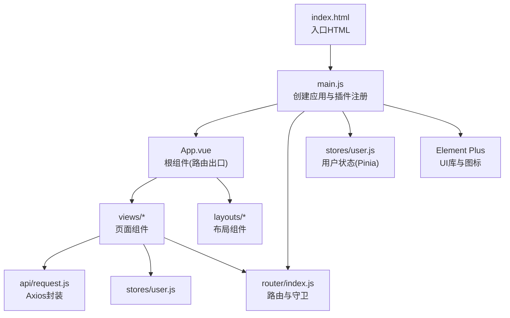
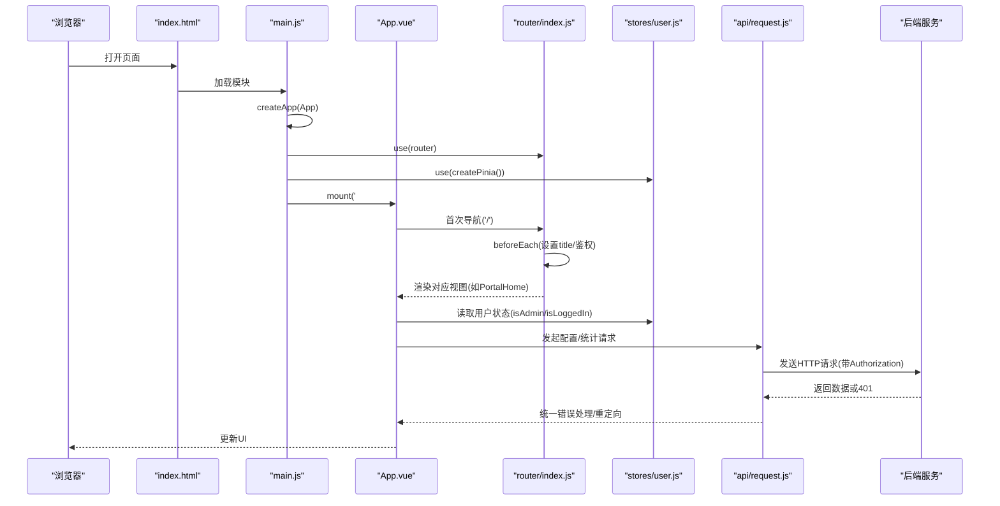
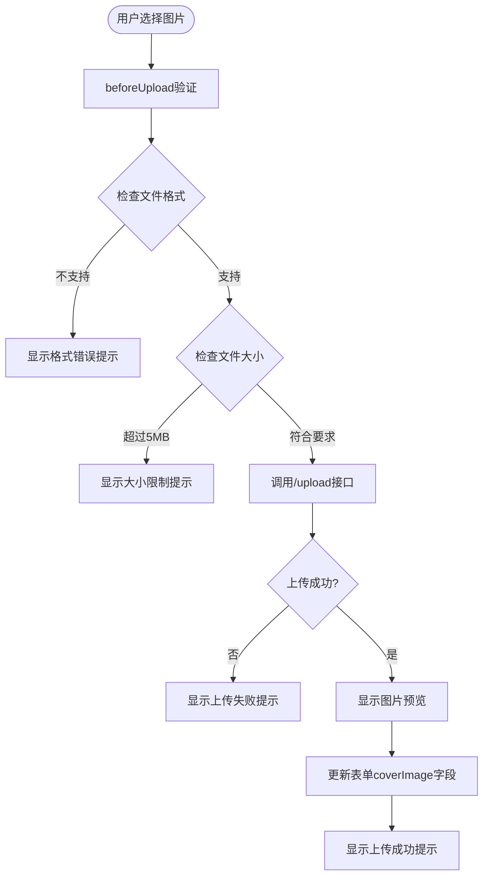
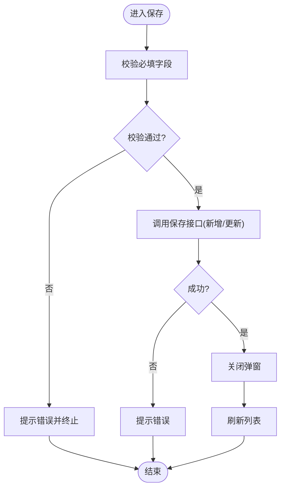
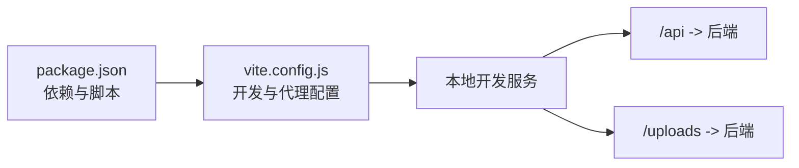

# Vue3应用架构

<cite>
**本文引用的文件**   
- [frontend/src/main.js](file://frontend/src/main.js)
- [frontend/src/App.vue](file://frontend/src/App.vue)
- [frontend/index.html](file://frontend/index.html)
- [frontend/vite.config.js](file://frontend/vite.config.js)
- [frontend/package.json](file://frontend/package.json)
- [frontend/src/router/index.js](file://frontend/src/router/index.js)
- [frontend/src/stores/user.js](file://frontend/src/stores/user.js)
- [frontend/src/api/request.js](file://frontend/src/api/request.js)
- [frontend/src/views/PortalHome.vue](file://frontend/src/views/PortalHome.vue)
- [frontend/src/layouts/AdminLayout.vue](file://frontend/src/layouts/AdminLayout.vue)
- [frontend/src/views/admin/AdminApps.vue](file://frontend/src/views/admin/AdminApps.vue)
- [frontend/src/views/admin/AdminCategories.vue](file://frontend/src/views/admin/AdminCategories.vue)
- [frontend/src/views/admin/AdminShowcase.vue](file://frontend/src/views/admin/AdminShowcase.vue)
- [frontend/src/views/admin/AdminUsers.vue](file://frontend/src/views/admin/AdminUsers.vue)
- [backend/src/main/java/com/xx/platform/controller/ConfigController.java](file://backend/src/main/java/com/xx/platform/controller/ConfigController.java)
- [backend/src/main/java/com/xx/platform/service/impl/ConfigServiceImpl.java](file://backend/src/main/java/com/xx/platform/service/impl/ConfigServiceImpl.java)
- [backend/src/main/java/com/xx/platform/config/WebMvcConfig.java](file://backend/src/main/java/com/xx/platform/config/WebMvcConfig.java)
</cite>

## 更新摘要
**变更内容**   
- 增强了AdminApps.vue组件的封面图片上传功能，从简单的文本URL输入升级为专业的文件上传界面
- 新增拖拽上传、实时预览、格式验证和大小限制等高级功能
- 完善了前后端文件上传的完整流程实现

## 目录
1. [简介](#简介)
2. [项目结构](#项目结构)
3. [核心组件](#核心组件)
4. [架构总览](#架构总览)
5. [详细组件分析](#详细组件分析)
6. [依赖关系分析](#依赖关系分析)
7. [性能考量](#性能考量)
8. [故障排查指南](#故障排查指南)
9. [结论](#结论)
10. [附录](#附录)

## 简介
本文件面向JZPlatform门户系统的Vue3前端，系统化阐述应用的初始化流程、根组件设计、Composition API使用模式、生命周期管理、插件注册机制（Element Plus、Pinia、Router）、全局配置与依赖注入方式。同时提供扩展应用功能、新增插件与配置项的实践路径，并给出性能优化建议与最佳实践。

## 项目结构
前端采用Vite + Vue3工程化方案，入口为index.html加载main.js，main.js创建应用实例并挂载插件，App.vue作为根容器仅渲染路由视图。路由集中定义在router/index.js，状态由Pinia的user store管理，HTTP请求通过封装的axios实例统一处理。

图表来源
- [frontend/index.html:1-14](file://frontend/index.html#L1-L14)
- [frontend/src/main.js:1-22](file://frontend/src/main.js#L1-L22)
- [frontend/src/App.vue:1-7](file://frontend/src/App.vue#L1-L7)
- [frontend/src/router/index.js:1-99](file://frontend/src/router/index.js#L1-L99)
- [frontend/src/stores/user.js:1-57](file://frontend/src/stores/user.js#L1-L57)
- [frontend/src/api/request.js:1-45](file://frontend/src/api/request.js#L1-L45)

章节来源
- [frontend/index.html:1-14](file://frontend/index.html#L1-L14)
- [frontend/src/main.js:1-22](file://frontend/src/main.js#L1-L22)
- [frontend/src/App.vue:1-7](file://frontend/src/App.vue#L1-L7)
- [frontend/package.json:1-25](file://frontend/package.json#L1-L25)
- [frontend/vite.config.js:1-20](file://frontend/vite.config.js#L1-L20)

## 核心组件
- 应用初始化与插件注册：在main.js中完成createApp、注册Element Plus图标、安装Pinia、Router、Element Plus并挂载到DOM。
- 根组件：App.vue仅包含路由出口，保持职责单一。
- 路由系统：集中式路由表，懒加载页面组件，beforeEach设置标题与鉴权守卫。
- 状态管理：Pinia user store负责登录态、角色与用户信息持久化与刷新。
- HTTP层：基于axios的统一请求/响应拦截器，自动携带token并对401进行跳转。

章节来源
- [frontend/src/main.js:1-22](file://frontend/src/main.js#L1-L22)
- [frontend/src/App.vue:1-7](file://frontend/src/App.vue#L1-L7)
- [frontend/src/router/index.js:1-99](file://frontend/src/router/index.js#L1-L99)
- [frontend/src/stores/user.js:1-57](file://frontend/src/stores/user.js#L1-L57)
- [frontend/src/api/request.js:1-45](file://frontend/src/api/request.js#L1-L45)

## 架构总览
下图展示从浏览器加载到页面渲染的关键调用链与数据流向，包括路由守卫、用户状态与API交互。

图表来源
- [frontend/index.html:1-14](file://frontend/index.html#L1-L14)
- [frontend/src/main.js:1-22](file://frontend/src/main.js#L1-L22)
- [frontend/src/App.vue:1-7](file://frontend/src/App.vue#L1-L7)
- [frontend/src/router/index.js:1-99](file://frontend/src/router/index.js#L1-L99)
- [frontend/src/stores/user.js:1-57](file://frontend/src/stores/user.js#L1-L57)
- [frontend/src/api/request.js:1-45](file://frontend/src/api/request.js#L1-L45)

## 详细组件分析

### 应用初始化与插件注册(main.js)
- 创建应用实例并挂载根组件。
- 全局注册Element Plus所有图标，便于模板内直接使用。
- 安装Pinia与Router，启用Element Plus并传入中文语言包。
- 挂载到#app节点，完成启动。

扩展建议
- 如需新增全局插件，可在app.use(...)处追加。
- 如需全局属性注入，可使用app.config.globalProperties或在setup中通过provide/inject实现依赖注入。

章节来源
- [frontend/src/main.js:1-22](file://frontend/src/main.js#L1-L22)

### 根组件(App.vue)
- 仅包含路由出口，确保各页面独立渲染。
- 适合在此处添加全局过渡、主题切换等顶层逻辑。

章节来源
- [frontend/src/App.vue:1-7](file://frontend/src/App.vue#L1-L7)

### 路由与守卫(router/index.js)
- 使用createWebHistory，按功能域划分路由，子路由用于后台管理。
- 懒加载页面组件，降低首屏体积。
- beforeEach中：
  - 根据meta.title动态设置document.title。
  - 对requiresAuth的路径校验localStorage中的token与role，未通过则重定向至登录页并携带redirect参数。

扩展建议
- 可引入Pinia的userStore替代localStorage判断，增强一致性。
- 可按角色细粒度控制菜单与路由访问权限。

章节来源
- [frontend/src/router/index.js:1-99](file://frontend/src/router/index.js#L1-L99)

### 用户状态管理(stores/user.js)
- state包含token、userId、username、role，并从localStorage初始化。
- getters提供isLoggedIn与isAdmin派生状态。
- actions：
  - login：调用登录接口，落盘token与role。
  - logout：清空状态与本地存储。
  - fetchUserInfo：根据token拉取用户信息，失败时执行登出。

扩展建议
- 可将token过期时间纳入state，结合定时任务或响应拦截器做无感刷新。
- 将敏感信息尽量保存在内存，必要时再落盘。

章节来源
- [frontend/src/stores/user.js:1-57](file://frontend/src/stores/user.js#L1-L57)

### HTTP请求封装(api/request.js)
- 基础URL指向/api，超时10s。
- 请求拦截器：自动附加Authorization头。
- 响应拦截器：
  - code非200时抛出错误；
  - 401时清除本地凭证并重定向至登录页。

扩展建议
- 可加入重试、取消重复请求、请求日志等能力。
- 针对业务code统一映射为更友好的错误提示。

章节来源
- [frontend/src/api/request.js:1-45](file://frontend/src/api/request.js#L1-L45)

### 首页与平台配置(PortalHome.vue)
- 使用onMounted加载平台配置与统计数据，并将配置键值映射为对象供模板渲染。
- 根据用户角色显示"管理后台"入口。
- 通过$router.push进行页面跳转。

章节来源
- [frontend/src/views/PortalHome.vue:1-287](file://frontend/src/views/PortalHome.vue#L1-L287)

### 管理后台布局(layouts/AdminLayout.vue)
- 左侧菜单与顶部栏组合，当前路由高亮。
- 退出按钮调用userStore.logout后跳转登录页。
- 主区域通过router-view渲染具体管理页面。

章节来源
- [frontend/src/layouts/AdminLayout.vue:1-136](file://frontend/src/layouts/AdminLayout.vue#L1-L136)

### 应用管理(admin/AdminApps.vue)

**已更新** AdminApps.vue组件现已集成专业的封面图片上传功能，从简单的文本URL输入升级为支持拖拽、预览、格式验证的文件上传界面。

#### 专业文件上传功能特性
- **拖拽上传支持**：用户可以直接拖拽图片文件到上传区域
- **实时预览**：上传成功后立即显示图片预览效果
- **格式验证**：支持PNG、JPEG、GIF、WebP等多种图片格式
- **大小限制**：严格限制文件大小不超过5MB
- **认证集成**：自动携带Authorization头部进行身份验证
- **用户体验**：提供清晰的上传提示和移除图片功能

#### 上传组件实现细节

**图表来源**
- [frontend/src/views/admin/AdminApps.vue:75-96](file://frontend/src/views/admin/AdminApps.vue#L75-L96)
- [frontend/src/views/admin/AdminApps.vue:156-175](file://frontend/src/views/admin/AdminApps.vue#L156-L175)

#### 前端上传逻辑
- **beforeUpload钩子**：在上传前进行文件格式和大小验证
- **handleUploadSuccess回调**：处理上传成功响应，更新表单数据
- **uploadHeaders计算属性**：动态生成包含认证token的请求头
- **样式定制**：自定义上传区域的边框、悬停效果和预览样式

#### 后端上传接口
后端提供了统一的文件上传接口 `/api/config/upload`，支持多种文件类型上传：

- **接口地址**：POST /api/config/upload
- **参数**：
  - `file`: 上传的文件对象
  - `fileKey`: 文件标识键（如 app_cover）
- **认证**：需要有效的管理员token
- **返回**：文件的访问URL路径

**章节来源**
- [frontend/src/views/admin/AdminApps.vue:75-96](file://frontend/src/views/admin/AdminApps.vue#L75-L96)
- [frontend/src/views/admin/AdminApps.vue:151-175](file://frontend/src/views/admin/AdminApps.vue#L151-L175)
- [frontend/src/views/admin/AdminApps.vue:253-292](file://frontend/src/views/admin/AdminApps.vue#L253-L292)
- [backend/src/main/java/com/xx/platform/controller/ConfigController.java:57-68](file://backend/src/main/java/com/xx/platform/controller/ConfigController.java#L57-L68)

### 分类管理(admin/AdminCategories.vue)
- 分类CRUD，表单最小字段，保存后刷新列表。

章节来源
- [frontend/src/views/admin/AdminCategories.vue:1-95](file://frontend/src/views/admin/AdminCategories.vue#L1-L95)

### 宣贯管理(admin/AdminShowcase.vue)
- 按类别筛选，维护标题、摘要、内容与排序。
- 保存与删除后刷新列表。

章节来源
- [frontend/src/views/admin/AdminShowcase.vue:1-123](file://frontend/src/views/admin/AdminShowcase.vue#L1-L123)

### 用户管理(admin/AdminUsers.vue)
- 分页列表，新增/编辑用户，编辑时用户名不可改，密码留空不修改。
- 删除前二次确认。

章节来源
- [frontend/src/views/admin/AdminUsers.vue:1-128](file://frontend/src/views/admin/AdminUsers.vue#L1-L128)

### 关键流程图示例：应用管理保存流程

**图表来源**
- [frontend/src/views/admin/AdminApps.vue:222-240](file://frontend/src/views/admin/AdminApps.vue#L222-L240)

## 依赖关系分析
- 构建与脚本：package.json定义dev/build/preview命令，依赖Vue3、Vue Router、Pinia、Element Plus、ECharts、Axios等。
- 开发服务器：vite.config.js配置端口与代理，将/api与/uploads转发至后端。

**图表来源**
- [frontend/package.json:1-25](file://frontend/package.json#L1-25)
- [frontend/vite.config.js:1-20](file://frontend/vite.config.js#L1-20)

章节来源
- [frontend/package.json:1-25](file://frontend/package.json#L1-25)
- [frontend/vite.config.js:1-20](file://frontend/vite.config.js#L1-20)

## 性能考量
- 路由懒加载：已采用按需import，减少首屏体积。
- 组件级样式隔离：使用scoped样式，避免全局污染。
- 列表与搜索：
  - 搜索防抖：AdminApps中使用定时器节流输入事件，避免频繁请求。
  - 分页：合理分页大小，避免一次性渲染过多DOM。
- 网络层：
  - 统一超时与错误处理，避免悬挂请求。
  - 可考虑请求去重与缓存策略（如相同参数短时间内合并）。
- 资源优化：
  - 图片与静态资源走CDN或压缩。
  - 按需引入第三方库（如ECharts按需加载）。
- 构建优化：
  - 开启Vite生产优化（默认已启用），合理使用分包与预加载。
  - 对大组件进行代码分割与延迟加载。
- **文件上传优化**：
  - 前端客户端验证减少无效上传请求
  - 图片格式和大小限制提升上传成功率
  - 预览功能提升用户体验，减少等待焦虑

[本节为通用指导，无需源码引用]

## 故障排查指南
- 401未授权：
  - 现象：请求返回401后自动跳转登录页。
  - 定位：检查api/request.js响应拦截器与路由守卫的鉴权逻辑。
- 路由无法进入后台：
  - 现象：访问/admin下路由被重定向到/login。
  - 定位：检查localStorage中的token与role是否符合requiresAuth条件。
- 页面标题不生效：
  - 现象：路由切换后标题未更新。
  - 定位：检查router.beforeEach中对document.title的设置。
- Element Plus图标不显示：
  - 现象：模板中使用图标无效果。
  - 定位：确认main.js是否全局注册了@element-plus/icons-vue的所有图标。
- **文件上传问题**：
  - 现象：图片上传失败或无法预览。
  - 定位：检查文件格式验证逻辑、文件大小限制、后端上传接口和静态资源映射配置。
  - 常见原因：文件格式不支持、超过5MB限制、token缺失、uploads目录权限问题。

**章节来源**
- [frontend/src/api/request.js:24-42](file://frontend/src/api/request.js#L24-L42)
- [frontend/src/router/index.js:82-96](file://frontend/src/router/index.js#L82-L96)
- [frontend/src/main.js:13-16](file://frontend/src/main.js#L13-L16)
- [backend/src/main/java/com/xx/platform/config/WebMvcConfig.java:31-35](file://backend/src/main/java/com/xx/platform/config/WebMvcConfig.java#L31-L35)

## 结论
该Vue3应用以清晰的初始化流程与模块化组织为基础，借助Pinia与Router实现了状态与路由的统一管理，Element Plus提供了丰富的UI能力。通过统一的HTTP封装与路由守卫，保证了鉴权与错误处理的一致性。**最新的封面图片上传功能增强进一步提升了用户体验，提供了专业的文件管理界面**。建议在后续迭代中进一步完善错误上报、请求缓存、权限模型与性能监控，以提升用户体验与可维护性。

[本节为总结，无需源码引用]

## 附录

### 如何扩展应用功能
- 新增页面
  - 在views目录下新建组件，并在router/index.js中添加路由与懒加载。
  - 若需要登录态，可在组件内通过useUserStore获取状态。
- 新增插件
  - 在main.js中引入插件并通过app.use(...)注册，必要时传入配置。
- 新增全局配置
  - 可通过app.config.globalProperties注入全局方法或常量，或在setup中通过provide/inject实现依赖注入。
- 新增API模块
  - 在api目录下新增接口函数，复用request.js实例，遵循统一错误处理约定。
- **新增文件上传功能**
  - 参考AdminApps.vue的实现，使用el-upload组件配置上传行为。
  - 实现beforeUpload钩子进行文件验证。
  - 配置uploadHeaders确保认证token正确传递。
  - 在后端实现对应的上传接口，注意文件存储路径和访问URL映射。

**章节来源**
- [frontend/src/main.js:1-22](file://frontend/src/main.js#L1-22)
- [frontend/src/router/index.js:1-99](file://frontend/src/router/index.js#L1-99)
- [frontend/src/stores/user.js:1-57](file://frontend/src/stores/user.js#L1-57)
- [frontend/src/api/request.js:1-45](file://frontend/src/api/request.js#L1-45)
- [frontend/src/views/admin/AdminApps.vue:75-96](file://frontend/src/views/admin/AdminApps.vue#L75-L96)
- [backend/src/main/java/com/xx/platform/controller/ConfigController.java:57-68](file://backend/src/main/java/com/xx/platform/controller/ConfigController.java#L57-L68)