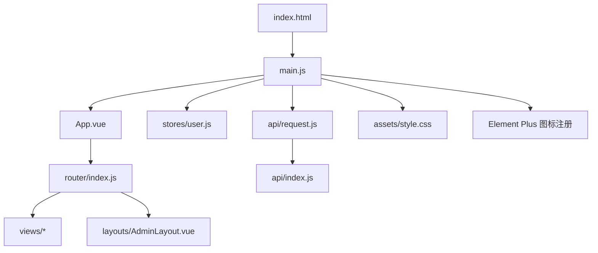
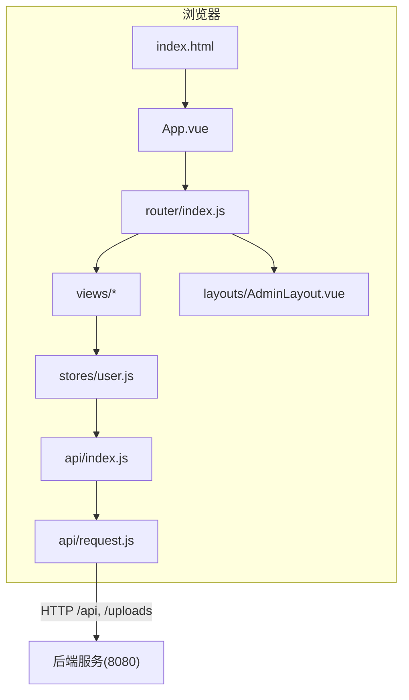
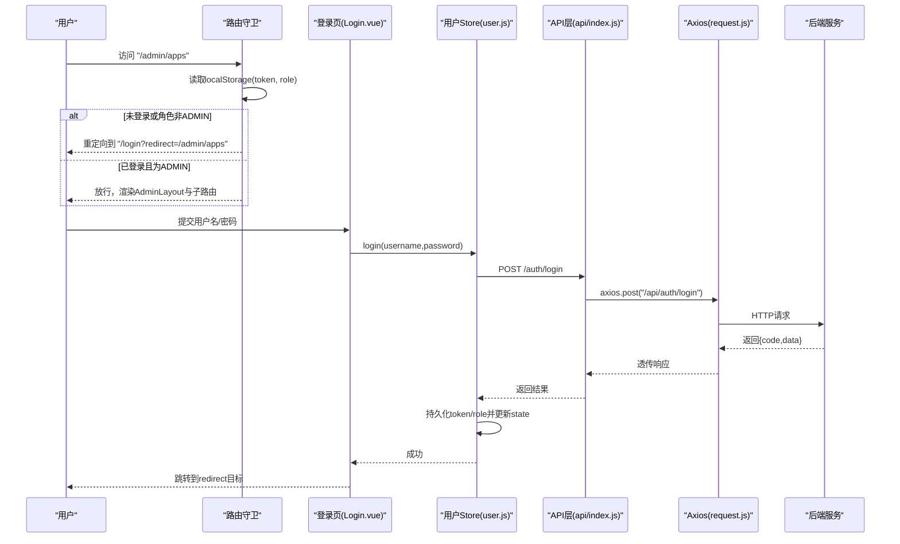
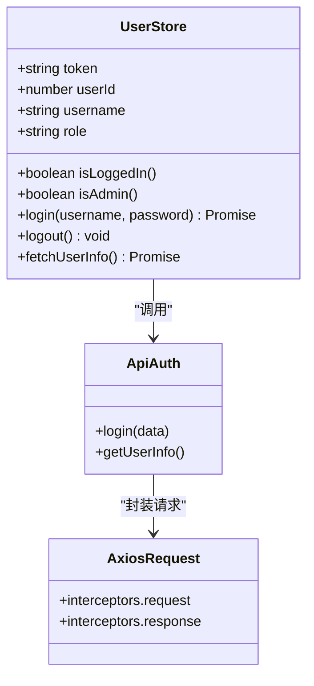
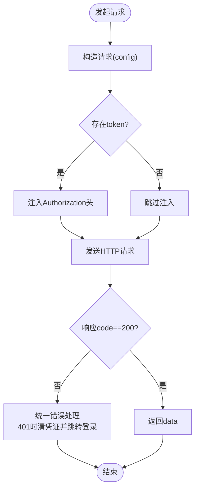
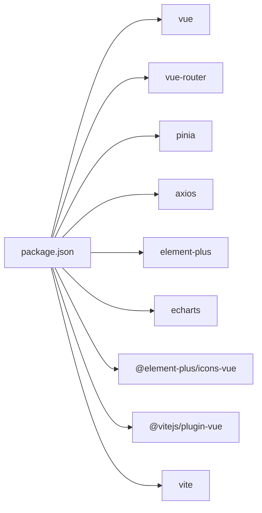

# 前端架构

<cite>
**本文引用的文件**   
- [frontend/package.json](file://frontend/package.json)
- [frontend/vite.config.js](file://frontend/vite.config.js)
- [frontend/index.html](file://frontend/index.html)
- [frontend/src/main.js](file://frontend/src/main.js)
- [frontend/src/App.vue](file://frontend/src/App.vue)
- [frontend/src/router/index.js](file://frontend/src/router/index.js)
- [frontend/src/stores/user.js](file://frontend/src/stores/user.js)
- [frontend/src/api/request.js](file://frontend/src/api/request.js)
- [frontend/src/api/index.js](file://frontend/src/api/index.js)
- [frontend/src/assets/style.css](file://frontend/src/assets/style.css)
- [frontend/src/layouts/AdminLayout.vue](file://frontend/src/layouts/AdminLayout.vue)
- [frontend/src/views/PortalHome.vue](file://frontend/src/views/PortalHome.vue)
- [frontend/src/views/Login.vue](file://frontend/src/views/Login.vue)
- [frontend/src/views/AppNav.vue](file://frontend/src/views/AppNav.vue)
</cite>

## 目录
1. [简介](#简介)
2. [项目结构](#项目结构)
3. [核心组件](#核心组件)
4. [架构总览](#架构总览)
5. [详细组件分析](#详细组件分析)
6. [依赖分析](#依赖分析)
7. [性能考虑](#性能考虑)
8. [故障排查指南](#故障排查指南)
9. [结论](#结论)
10. [附录](#附录)

## 简介
本文件面向JZPlatform门户系统的前端部分，基于Vue3 + Vite + Element Plus构建。文档从系统架构、组件设计、路由与导航、Pinia状态管理、API集成层、样式与主题等维度进行系统化说明，并结合Composition API的使用模式、组件间通信机制与响应式数据绑定原理，给出可操作的实践建议与优化策略。

## 项目结构
前端采用按功能域组织的方式：入口与全局配置位于根目录；视图页面集中于views；布局模板在layouts；路由、状态、API与工具分别独立目录；样式通过全局CSS与组件级scoped样式结合。

图表来源
- [frontend/index.html:1-14](file://frontend/index.html#L1-L14)
- [frontend/src/main.js:1-22](file://frontend/src/main.js#L1-L22)
- [frontend/src/App.vue:1-7](file://frontend/src/App.vue#L1-L7)
- [frontend/src/router/index.js:1-99](file://frontend/src/router/index.js#L1-L99)
- [frontend/src/stores/user.js:1-57](file://frontend/src/stores/user.js#L1-L57)
- [frontend/src/api/request.js:1-45](file://frontend/src/api/request.js#L1-L45)
- [frontend/src/api/index.js:1-137](file://frontend/src/api/index.js#L1-L137)
- [frontend/src/assets/style.css:1-110](file://frontend/src/assets/style.css#L1-L110)
- [frontend/src/layouts/AdminLayout.vue:1-136](file://frontend/src/layouts/AdminLayout.vue#L1-L136)

章节来源
- [frontend/package.json:1-25](file://frontend/package.json#L1-L25)
- [frontend/vite.config.js:1-20](file://frontend/vite.config.js#L1-L20)
- [frontend/index.html:1-14](file://frontend/index.html#L1-L14)
- [frontend/src/main.js:1-22](file://frontend/src/main.js#L1-L22)
- [frontend/src/App.vue:1-7](file://frontend/src/App.vue#L1-L7)

## 核心组件
- 应用入口与插件装配
  - 创建Vue应用实例，挂载Pinia、Router与Element Plus（含中文语言包），并全局注册所有Element Plus图标。
  - 引入全局样式与根组件。
- 根组件
  - 仅包含路由出口，作为页面容器。
- 开发服务器与代理
  - 使用Vite开发服务器，端口5173，将/api与/uploads路径代理至后端服务，解决跨域问题。

章节来源
- [frontend/src/main.js:1-22](file://frontend/src/main.js#L1-L22)
- [frontend/src/App.vue:1-7](file://frontend/src/App.vue#L1-L7)
- [frontend/vite.config.js:1-20](file://frontend/vite.config.js#L1-L20)

## 架构总览
整体采用“单页应用”架构：入口初始化后加载路由，根据URL渲染对应视图；受保护路由由守卫校验登录态与角色；业务逻辑通过Pinia Store集中管理；网络请求统一经Axios封装的request模块处理，自动附加鉴权头与统一错误处理。

图表来源
- [frontend/index.html:1-14](file://frontend/index.html#L1-L14)
- [frontend/src/App.vue:1-7](file://frontend/src/App.vue#L1-L7)
- [frontend/src/router/index.js:1-99](file://frontend/src/router/index.js#L1-L99)
- [frontend/src/layouts/AdminLayout.vue:1-136](file://frontend/src/layouts/AdminLayout.vue#L1-L136)
- [frontend/src/stores/user.js:1-57](file://frontend/src/stores/user.js#L1-L57)
- [frontend/src/api/index.js:1-137](file://frontend/src/api/index.js#L1-L137)
- [frontend/src/api/request.js:1-45](file://frontend/src/api/request.js#L1-L45)
- [frontend/vite.config.js:1-20](file://frontend/vite.config.js#L1-L20)

## 详细组件分析

### 路由与导航机制
- 路由定义
  - 首页、应用导航、产品宣贯、宣贯详情、登录以及后台管理子路由均通过懒加载方式按需引入，减少首屏体积。
  - 每个路由携带meta.title用于动态设置页面标题。
- 路由守卫
  - 进入需要认证的路由时，检查本地存储中的token与role，未登录或角色非管理员则重定向到登录页并附带redirect参数。
- 导航交互
  - 前台页面通过$router.push进行跳转；管理后台侧边栏使用el-menu的router模式实现高亮与跳转。

图表来源
- [frontend/src/router/index.js:1-99](file://frontend/src/router/index.js#L1-L99)
- [frontend/src/views/Login.vue:1-103](file://frontend/src/views/Login.vue#L1-L103)
- [frontend/src/stores/user.js:1-57](file://frontend/src/stores/user.js#L1-L57)
- [frontend/src/api/index.js:1-137](file://frontend/src/api/index.js#L1-L137)
- [frontend/src/api/request.js:1-45](file://frontend/src/api/request.js#L1-L45)

章节来源
- [frontend/src/router/index.js:1-99](file://frontend/src/router/index.js#L1-L99)
- [frontend/src/layouts/AdminLayout.vue:1-136](file://frontend/src/layouts/AdminLayout.vue#L1-L136)

### Pinia状态管理模式
- 用户状态
  - state包含token、userId、username、role，并提供isLoggedIn、isAdmin两个getter。
  - actions提供登录、登出、获取用户信息；登录成功后同步写入localStorage，登出时清理。
- 与路由联动
  - 路由守卫依据localStorage中的token与role判断权限；Store中logout会清空这些值，配合拦截器在401时强制跳转登录。

图表来源
- [frontend/src/stores/user.js:1-57](file://frontend/src/stores/user.js#L1-L57)
- [frontend/src/api/index.js:1-137](file://frontend/src/api/index.js#L1-L137)
- [frontend/src/api/request.js:1-45](file://frontend/src/api/request.js#L1-L45)

章节来源
- [frontend/src/stores/user.js:1-57](file://frontend/src/stores/user.js#L1-L57)
- [frontend/src/router/index.js:1-99](file://frontend/src/router/index.js#L1-L99)

### API集成层实现
- Axios实例
  - baseURL指向/api，超时时间10秒。
  - 请求拦截器：自动从localStorage读取token并注入Authorization头。
  - 响应拦截器：统一处理业务码，当code=401时清除本地凭证并重定向到登录页；其他错误抛出异常供上层捕获。
- 接口封装
  - 将各业务域接口按模块导出，如用户、应用、分类、宣贯、配置、统计与上传等，便于复用与维护。
- 文件上传
  - 使用FormData构造multipart/form-data请求，显式设置Content-Type。

图表来源
- [frontend/src/api/request.js:1-45](file://frontend/src/api/request.js#L1-L45)
- [frontend/src/api/index.js:1-137](file://frontend/src/api/index.js#L1-L137)

章节来源
- [frontend/src/api/request.js:1-45](file://frontend/src/api/request.js#L1-L45)
- [frontend/src/api/index.js:1-137](file://frontend/src/api/index.js#L1-L137)

### 样式与主题系统
- 全局变量
  - 通过CSS自定义属性定义主色、渐变、背景、文字与边框等，形成统一的视觉规范。
- 主题覆盖
  - 针对Element Plus按钮等组件，通过覆盖其CSS变量实现品牌色定制。
- 风格增强
  - 提供科技风背景、毛玻璃卡片、渐变文字、装饰线条与淡入动画等通用样式类，提升整体质感。
- 滚动条美化
  - 对webkit滚动条进行主题化定制。

章节来源
- [frontend/src/assets/style.css:1-110](file://frontend/src/assets/style.css#L1-L110)

### 关键视图与布局

#### 管理后台布局
- 左侧菜单
  - 使用el-menu并开启router模式，当前路由path作为activeMenu，点击项自动跳转。
- 顶部栏
  - 显示当前页面标题、用户名与退出按钮；退出时调用Store的logout并跳转登录页。
- 内容区
  - 通过router-view渲染具体管理页面。

章节来源
- [frontend/src/layouts/AdminLayout.vue:1-136](file://frontend/src/layouts/AdminLayout.vue#L1-L136)

#### 门户首页
- 动态展示
  - 加载平台配置（名称、Logo、公司名）与统计数据（应用数、访问量、分类数、用户数）。
- 导航入口
  - 提供应用导航与产品宣贯入口，管理员可见管理后台入口。
- 响应式与动效
  - 使用全局样式类实现毛玻璃卡片与淡入动画。

章节来源
- [frontend/src/views/PortalHome.vue:1-287](file://frontend/src/views/PortalHome.vue#L1-L287)

#### 登录页
- 表单校验
  - 使用Element Plus Form进行必填校验。
- 登录流程
  - 调用Store.login，成功后提示并跳转到redirect或默认后台首页。
- 错误处理
  - 捕获异常并提示失败原因。

章节来源
- [frontend/src/views/Login.vue:1-103](file://frontend/src/views/Login.vue#L1-L103)

#### 应用导航页
- 筛选与排序
  - 支持关键词搜索、分类筛选与多种排序字段，搜索输入带防抖。
- 列表展示
  - 支持卡片与列表两种视图模式，空状态友好提示。
- 点击统计
  - 点击应用时异步上报点击量，随后在新窗口打开目标链接。

章节来源
- [frontend/src/views/AppNav.vue:1-200](file://frontend/src/views/AppNav.vue#L1-L200)

### Composition API使用模式
- setup语法糖
  - 所有视图与布局均采用<script setup>，简化响应式声明与生命周期使用。
- 响应式数据
  - 使用ref与reactive管理局部状态；组合函数与Store提供跨组件共享状态。
- 生命周期
  - onMounted中发起数据加载，避免阻塞渲染。
- 事件与导航
  - 通过$router.push与useRouter/useRoute进行编程式导航与参数读取。

章节来源
- [frontend/src/views/PortalHome.vue:1-287](file://frontend/src/views/PortalHome.vue#L1-L287)
- [frontend/src/views/Login.vue:1-103](file://frontend/src/views/Login.vue#L1-L103)
- [frontend/src/views/AppNav.vue:1-200](file://frontend/src/views/AppNav.vue#L1-L200)
- [frontend/src/layouts/AdminLayout.vue:1-136](file://frontend/src/layouts/AdminLayout.vue#L1-L136)

### 组件间通信机制
- 父子通信
  - 通过props与emits在父子组件间传递数据与事件（适用于未来抽取的子组件）。
- 跨层级通信
  - 使用Pinia Store集中管理用户信息与认证状态，多个视图直接消费store。
- 路由级通信
  - 通过query与params在页面间传递上下文（如登录后redirect）。

章节来源
- [frontend/src/stores/user.js:1-57](file://frontend/src/stores/user.js#L1-L57)
- [frontend/src/router/index.js:1-99](file://frontend/src/router/index.js#L1-L99)

### 响应式数据绑定原理
- Vue3响应式
  - 基于Proxy实现细粒度追踪，ref与reactive对象变化自动触发视图更新。
- 计算与侦听
  - computed用于派生状态（如activeMenu），watch/watchEffect可用于副作用（如监听路由变化）。
- 模板绑定
  - v-model双向绑定表单数据，v-if/v-show控制条件渲染，v-for高效渲染列表。

章节来源
- [frontend/src/layouts/AdminLayout.vue:1-136](file://frontend/src/layouts/AdminLayout.vue#L1-L136)
- [frontend/src/views/AppNav.vue:1-200](file://frontend/src/views/AppNav.vue#L1-L200)

## 依赖分析
- 运行时依赖
  - vue、vue-router、pinia、axios、element-plus、echarts、@element-plus/icons-vue。
- 开发依赖
  - @vitejs/plugin-vue、vite。
- 脚本命令
  - dev/build/preview，分别启动开发服务器、构建产物与预览。

图表来源
- [frontend/package.json:1-25](file://frontend/package.json#L1-L25)

章节来源
- [frontend/package.json:1-25](file://frontend/package.json#L1-L25)

## 性能考虑
- 路由懒加载
  - 所有页面组件采用动态import，降低首屏体积与解析时间。
- 开发代理
  - 使用Vite代理避免跨域开销，提高调试效率。
- 请求优化
  - 统一拦截器减少重复代码；必要时可在request层增加重试与取消逻辑。
- 列表渲染
  - 合理使用key、分页与虚拟列表（大数据场景）；搜索输入防抖减少频繁请求。
- 资源优化
  - 图片压缩与CDN加速；按需引入Element Plus组件与图标；生产环境启用Gzip/Brotli。
- 缓存策略
  - 静态资源利用浏览器缓存；接口层可结合ETag/Last-Modified或前端缓存策略。
- 监控与埋点
  - 接入性能监控与错误上报，定位慢接口与卡顿页面。

[本节为通用指导，不直接分析具体文件]

## 故障排查指南
- 401未授权
  - 现象：请求被拦截器识别为未授权，自动清除本地凭证并跳转登录页。
  - 排查：确认后端是否返回code=401；检查请求是否携带Authorization头；确认本地token是否过期或被清理。
- 跨域问题
  - 现象：开发环境下出现CORS错误。
  - 排查：确认Vite代理配置是否正确；确保后端允许相关Origin与Header。
- 路由守卫死循环
  - 现象：进入受保护路由后反复重定向。
  - 排查：检查登录成功后是否正确写入token与role；确认守卫条件与跳转目标。
- 表单验证失败
  - 现象：登录无法提交。
  - 排查：确认rules配置与表单字段一致；检查formRef引用是否正确。
- 接口报错
  - 现象：业务码非200导致Promise.reject。
  - 排查：查看后端返回message；在调用处添加catch打印堆栈。

章节来源
- [frontend/src/api/request.js:1-45](file://frontend/src/api/request.js#L1-L45)
- [frontend/src/router/index.js:1-99](file://frontend/src/router/index.js#L1-L99)
- [frontend/src/views/Login.vue:1-103](file://frontend/src/views/Login.vue#L1-L103)

## 结论
本项目以Vue3 + Vite + Element Plus为核心，采用Pinia进行状态管理、Axios封装统一网络层、路由懒加载与守卫保障安全与性能。通过全局样式与主题变量实现一致的视觉体验。建议在后续迭代中持续完善错误边界、性能监控与组件库按需引入，进一步提升可维护性与用户体验。

## 附录
- 环境变量与脚本
  - 开发端口与代理规则见Vite配置；构建与预览命令见package.json脚本。
- 图标与UI
  - 全局注册Element Plus图标，按需使用；可通过CSS变量快速调整主题。

章节来源
- [frontend/vite.config.js:1-20](file://frontend/vite.config.js#L1-L20)
- [frontend/package.json:1-25](file://frontend/package.json#L1-L25)
- [frontend/src/main.js:1-22](file://frontend/src/main.js#L1-L22)
- [frontend/src/assets/style.css:1-110](file://frontend/src/assets/style.css#L1-L110)