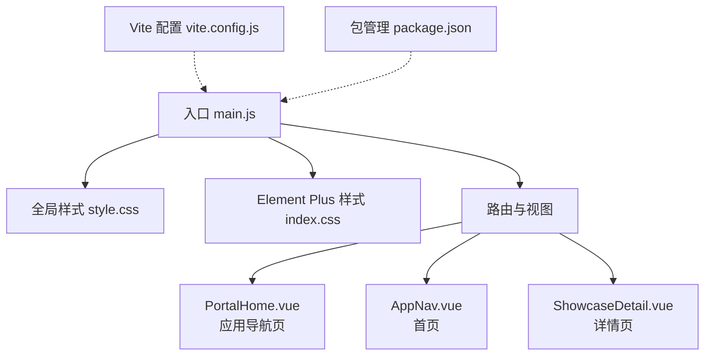
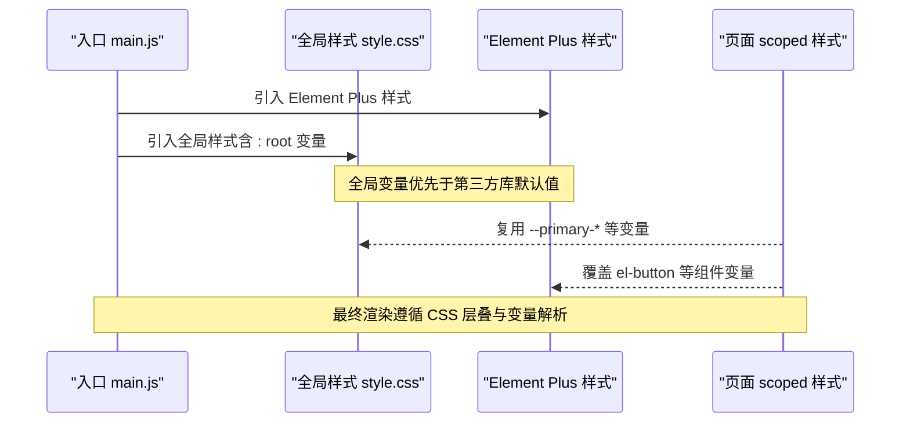
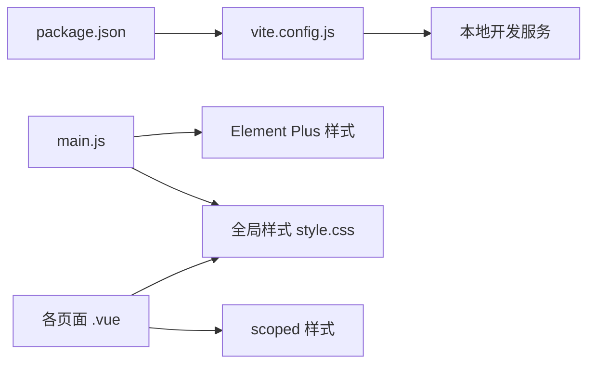

# 样式与主题系统

<cite>
**本文引用的文件**   
- [frontend/src/assets/style.css](file://frontend/src/assets/style.css)
- [frontend/src/main.js](file://frontend/src/main.js)
- [frontend/package.json](file://frontend/package.json)
- [frontend/vite.config.js](file://frontend/vite.config.js)
- [frontend/src/views/PortalHome.vue](file://frontend/src/views/PortalHome.vue)
- [frontend/src/views/AppNav.vue](file://frontend/src/views/AppNav.vue)
- [frontend/src/views/ShowcaseDetail.vue](file://frontend/src/views/ShowcaseDetail.vue)
- [frontend/node_modules/element-plus/theme-chalk/base.css](file://frontend/node_modules/element-plus/theme-chalk/base.css)
</cite>

## 目录
1. [简介](#简介)
2. [项目结构](#项目结构)
3. [核心组件](#核心组件)
4. [架构总览](#架构总览)
5. [详细组件分析](#详细组件分析)
6. [依赖关系分析](#依赖关系分析)
7. [性能考虑](#性能考虑)
8. [故障排查指南](#故障排查指南)
9. [结论](#结论)
10. [附录](#附录)

## 简介
本文件面向JZPlatform门户系统的样式与主题系统，系统性说明CSS组织结构、样式变量定义、Element Plus主题定制与覆盖策略、自定义样式组织方式、响应式实现思路、跨浏览器兼容处理以及样式调试方法。文档同时给出可操作的编写规范与模块化策略，帮助团队在统一视觉风格的前提下高效协作与维护。

## 项目结构
前端采用Vue 3 + Vite构建，样式以全局CSS变量为核心，结合Element Plus的CSS变量体系进行主题定制；页面级样式通过单文件组件的scoped样式局部化，避免样式污染。

图表来源
- [frontend/src/main.js:1-21](file://frontend/src/main.js#L1-L21)
- [frontend/src/assets/style.css:1-110](file://frontend/src/assets/style.css#L1-L110)
- [frontend/vite.config.js:1-20](file://frontend/vite.config.js#L1-L20)
- [frontend/package.json:1-25](file://frontend/package.json#L1-L25)
- [frontend/src/views/PortalHome.vue:1-287](file://frontend/src/views/PortalHome.vue#L1-L287)
- [frontend/src/views/AppNav.vue:1-356](file://frontend/src/views/AppNav.vue#L1-L356)
- [frontend/src/views/ShowcaseDetail.vue:1-50](file://frontend/src/views/ShowcaseDetail.vue#L1-L50)

章节来源
- [frontend/src/main.js:1-21](file://frontend/src/main.js#L1-L21)
- [frontend/src/assets/style.css:1-110](file://frontend/src/assets/style.css#L1-L110)
- [frontend/vite.config.js:1-20](file://frontend/vite.config.js#L1-L20)
- [frontend/package.json:1-25](file://frontend/package.json#L1-L25)

## 核心组件
- 全局样式与变量
  - 在根节点定义平台级CSS变量（主色、背景、文字、边框、阴影、渐变等），为全应用提供统一的视觉语义。
  - 提供基础重置、body默认字体与背景、滚动条样式、通用卡片与装饰类（如玻璃态卡片、渐变文字、科技线条、入场动画）。
- Element Plus集成
  - 在应用入口引入Element Plus样式与中文语言包，并全局注册图标组件。
  - 通过覆盖Element Plus按钮等组件的CSS变量，将品牌主色注入到组件内部，实现“无侵入”的主题定制。
- 页面级样式
  - 各页面使用scoped样式，仅作用于当前组件，避免全局污染。
  - 复用全局变量与通用类名，保证视觉一致性。

章节来源
- [frontend/src/assets/style.css:1-110](file://frontend/src/assets/style.css#L1-L110)
- [frontend/src/main.js:1-21](file://frontend/src/main.js#L1-L21)
- [frontend/src/views/PortalHome.vue:125-287](file://frontend/src/views/PortalHome.vue#L125-L287)
- [frontend/src/views/AppNav.vue:182-356](file://frontend/src/views/AppNav.vue#L182-L356)
- [frontend/src/views/ShowcaseDetail.vue:1-50](file://frontend/src/views/ShowcaseDetail.vue#L1-L50)

## 架构总览
样式加载与主题生效顺序如下：

图表来源
- [frontend/src/main.js:1-21](file://frontend/src/main.js#L1-L21)
- [frontend/src/assets/style.css:1-110](file://frontend/src/assets/style.css#L1-L110)
- [frontend/node_modules/element-plus/theme-chalk/base.css:1-200](file://frontend/node_modules/element-plus/theme-chalk/base.css#L1-L200)

## 详细组件分析

### 全局样式与变量（style.css）
- 变量体系
  - 主色系：主色、浅紫、深紫与渐变，用于强调、按钮、标题等。
  - 背景与卡片：深色背景、半透明卡片背景、边框与阴影，营造科技感。
  - 文本色阶：主文、次文、浅色文本，确保可读性与层次。
  - 点缀色：金色点缀，用于高亮或特殊状态。
- 通用样式
  - 基础重置与body默认样式。
  - 玻璃态卡片、渐变文字、科技线条、入场动画、滚动条美化。
- 与Element Plus的衔接
  - 通过覆盖按钮组件的CSS变量，使按钮颜色与品牌主色一致。

章节来源
- [frontend/src/assets/style.css:1-110](file://frontend/src/assets/style.css#L1-L110)

### Element Plus 主题定制
- 集成方式
  - 在入口引入Element Plus样式与中文语言包，并全局注册图标。
- 变量覆盖
  - 针对按钮等常用组件，设置其内部CSS变量（背景、边框、悬停、激活态），使其与品牌主色保持一致。
- 扩展建议
  - 如需进一步定制，可在全局样式中继续覆盖其他组件的CSS变量（如输入框、对话框、消息提示等），保持变量命名与层级清晰。

章节来源
- [frontend/src/main.js:1-21](file://frontend/src/main.js#L1-L21)
- [frontend/src/assets/style.css:33-41](file://frontend/src/assets/style.css#L33-L41)
- [frontend/node_modules/element-plus/theme-chalk/base.css:1-200](file://frontend/node_modules/element-plus/theme-chalk/base.css#L1-L200)

### 页面级样式组织（PortalHome / AppNav / ShowcaseDetail）
- PortalHome
  - 使用全局变量与通用类（如玻璃态卡片、渐变文字、科技线条、入场动画），配合scoped样式限定作用域。
- AppNav
  - 列表与网格布局均基于CSS Grid/Flex，使用全局变量控制边框与背景，保持整体风格一致。
- ShowcaseDetail
  - 复用全局背景与卡片样式，突出内容层级与信息密度。

章节来源
- [frontend/src/views/PortalHome.vue:125-287](file://frontend/src/views/PortalHome.vue#L125-L287)
- [frontend/src/views/AppNav.vue:182-356](file://frontend/src/views/AppNav.vue#L182-L356)
- [frontend/src/views/ShowcaseDetail.vue:1-50](file://frontend/src/views/ShowcaseDetail.vue#L1-L50)

### 主题切换机制（设计与落地建议）
- 现状
  - 当前未实现运行时主题切换逻辑，但已具备完善的变量体系，便于后续扩展。
- 推荐方案
  - 在根节点按主题切换不同的CSS变量集合（例如data-theme属性驱动），或在不同主题下挂载不同的样式块。
  - 对Element Plus组件的变量覆盖也需随主题切换而更新。
  - 可将主题变量集中到一个独立文件，按需加载，减少首屏体积。

[本节为概念性设计，不直接分析具体代码文件]

## 依赖关系分析
- 构建与运行
  - Vite作为开发服务器与打包工具，提供热更新与代理能力。
  - Vue 3 + Vue Router + Pinia + Axios + Element Plus + ECharts 构成前端技术栈。
- 样式依赖
  - 全局样式位于assets目录，被入口引入。
  - Element Plus样式由包管理引入，并通过入口启用。

图表来源
- [frontend/package.json:1-25](file://frontend/package.json#L1-L25)
- [frontend/vite.config.js:1-20](file://frontend/vite.config.js#L1-L20)
- [frontend/src/main.js:1-21](file://frontend/src/main.js#L1-L21)
- [frontend/src/assets/style.css:1-110](file://frontend/src/assets/style.css#L1-L110)

章节来源
- [frontend/package.json:1-25](file://frontend/package.json#L1-L25)
- [frontend/vite.config.js:1-20](file://frontend/vite.config.js#L1-L20)
- [frontend/src/main.js:1-21](file://frontend/src/main.js#L1-L21)

## 性能考虑
- 样式体积
  - 使用scoped样式限制作用域，避免不必要的重排重绘。
  - 尽量复用全局变量与通用类，减少重复规则。
- 渲染优化
  - 合理使用backdrop-filter与复杂渐变，注意移动端性能。
  - 动画使用transform与opacity，避免触发布局。
- 构建优化
  - 利用Vite的按需引入与Tree Shaking，减少无用样式。
  - 生产环境开启压缩与资源缓存。

[本节提供通用指导，不直接分析具体代码文件]

## 故障排查指南
- 样式未生效
  - 检查全局样式是否在入口正确引入。
  - 确认scoped样式是否被更高优先级规则覆盖。
- 主题变量无效
  - 确认变量定义在:root且未被覆盖。
  - 检查Element Plus组件变量覆盖的类名与作用域。
- 浏览器兼容
  - 回退不支持的特性（如backdrop-filter、渐变文字）并提供降级样式。
  - 使用厂商前缀或polyfill解决差异。
- 调试技巧
  - 使用浏览器开发者工具查看计算后的CSS变量值与层叠顺序。
  - 临时移除scoped或降低选择器优先级定位冲突。

章节来源
- [frontend/src/main.js:1-21](file://frontend/src/main.js#L1-L21)
- [frontend/src/assets/style.css:1-110](file://frontend/src/assets/style.css#L1-L110)

## 结论
本项目通过“全局CSS变量 + Element Plus变量覆盖 + 页面scoped样式”的组合，构建了可扩展、易维护的样式与主题体系。在此基础上，可快速实现多主题切换与组件级定制，同时保持良好的性能与兼容性。建议后续完善主题切换逻辑与变量分层，进一步提升团队协作效率与产品体验。

[本节为总结性内容，不直接分析具体代码文件]

## 附录

### 样式编写规范
- 变量命名
  - 使用语义化前缀（如--primary-*、--bg-*、--text-*），避免硬编码颜色。
- 作用域
  - 页面级样式使用scoped，公共样式放入全局文件。
- 组件定制
  - 优先覆盖Element Plus的CSS变量，避免直接写死样式。
- 响应式
  - 使用Flex/Grid与媒体查询，保证多端适配。
- 动画与交互
  - 使用transform/opacity，避免布局抖动。

[本节为通用规范，不直接分析具体代码文件]

### 关键路径参考
- 入口与样式引入
  - [frontend/src/main.js:1-21](file://frontend/src/main.js#L1-L21)
- 全局变量与通用样式
  - [frontend/src/assets/style.css:1-110](file://frontend/src/assets/style.css#L1-L110)
- 页面示例（首页/导航/详情）
  - [frontend/src/views/PortalHome.vue:125-287](file://frontend/src/views/PortalHome.vue#L125-L287)
  - [frontend/src/views/AppNav.vue:182-356](file://frontend/src/views/AppNav.vue#L182-L356)
  - [frontend/src/views/ShowcaseDetail.vue:1-50](file://frontend/src/views/ShowcaseDetail.vue#L1-L50)
- Element Plus 变量基线
  - [frontend/node_modules/element-plus/theme-chalk/base.css:1-200](file://frontend/node_modules/element-plus/theme-chalk/base.css#L1-L200)