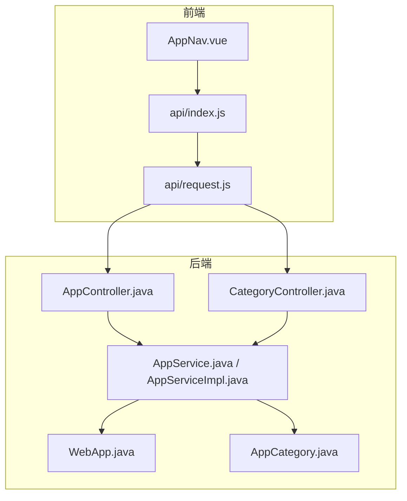
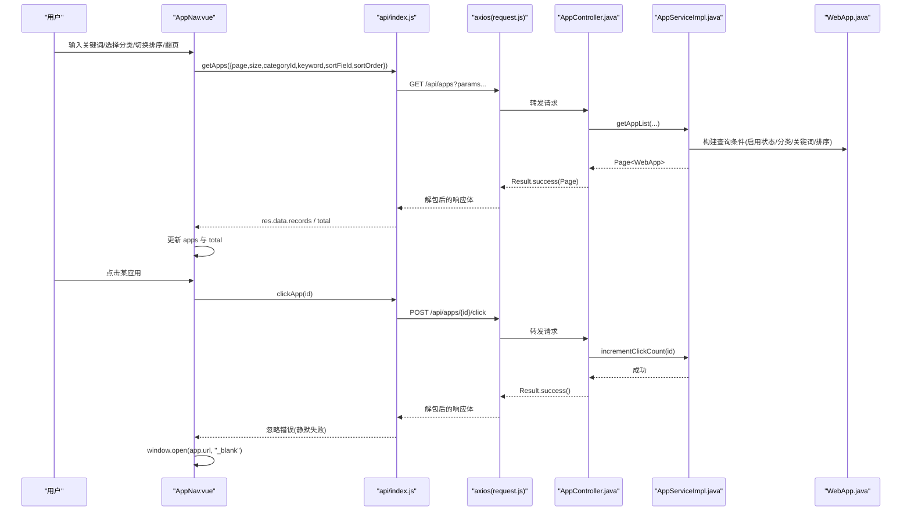
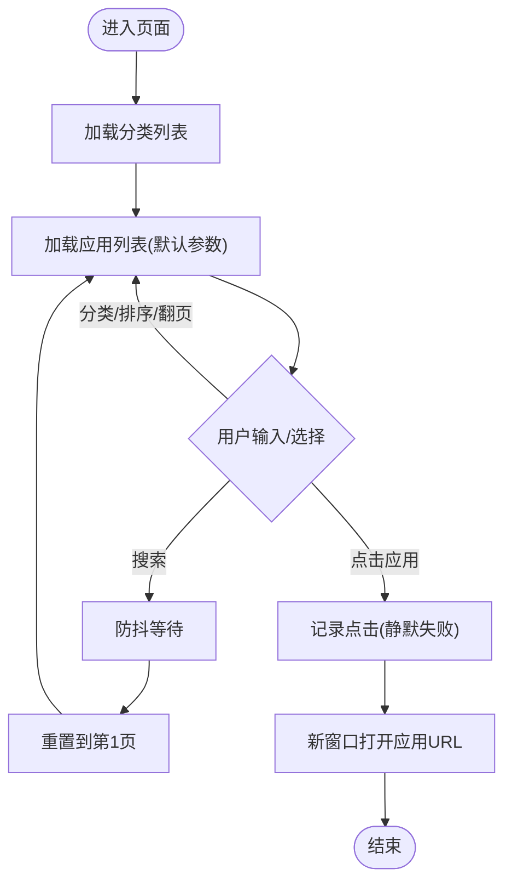
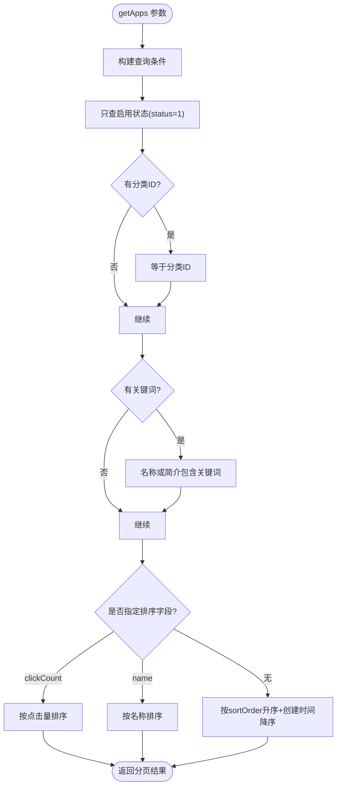
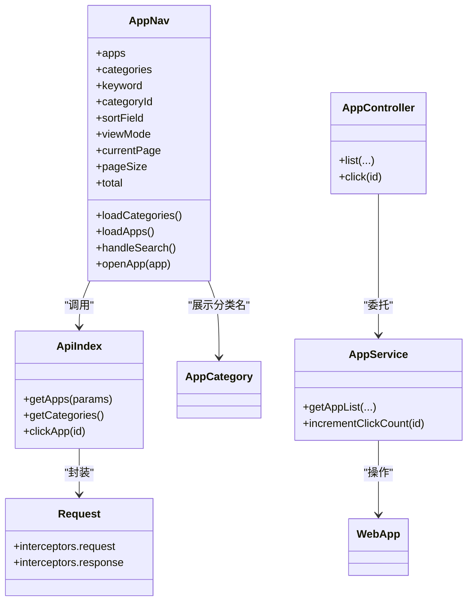

# 导航组件设计

<cite>
**本文引用的文件**
- [AppNav.vue](file://frontend/src/views/AppNav.vue)
- [index.js](file://frontend/src/api/index.js)
- [request.js](file://frontend/src/api/request.js)
- [AppController.java](file://backend/src/main/java/com/xx/platform/controller/AppController.java)
- [CategoryController.java](file://backend/src/main/java/com/xx/platform/controller/CategoryController.java)
- [AppService.java](file://backend/src/main/java/com/xx/platform/service/AppService.java)
- [AppServiceImpl.java](file://backend/src/main/java/com/xx/platform/service/impl/AppServiceImpl.java)
- [WebApp.java](file://backend/src/main/java/com/xx/platform/entity/WebApp.java)
- [AppCategory.java](file://backend/src/main/java/com/xx/platform/entity/AppCategory.java)
</cite>

## 目录
1. [简介](#简介)
2. [项目结构](#项目结构)
3. [核心组件](#核心组件)
4. [架构总览](#架构总览)
5. [详细组件分析](#详细组件分析)
6. [依赖关系分析](#依赖关系分析)
7. [性能与体验优化](#性能与体验优化)
8. [故障排查指南](#故障排查指南)
9. [结论](#结论)
10. [附录：API契约与扩展指南](#附录api契约与扩展指南)

## 简介
本文件围绕 JZPlatform 门户系统的“应用导航”页面，对前端导航组件 AppNav.vue 的实现进行系统化文档化。内容涵盖应用列表展示、分类筛选、搜索、分页、排序、视图模式切换、点击统计、错误处理与加载状态管理，以及与后端 API 的集成方式。同时提供自定义配置项说明与二次开发扩展建议，帮助读者快速理解并基于现有实现进行功能增强。

## 项目结构
导航相关的前端代码位于 views 与 api 目录，后端对应控制器与服务层在 controller 与 service 包中。整体采用前后端分离架构，前端通过 Axios 发起 HTTP 请求，后端以 RESTful 接口提供服务。

图表来源
- [AppNav.vue:1-180](file://frontend/src/views/AppNav.vue#L1-L180)
- [index.js:38-71](file://frontend/src/api/index.js#L38-L71)
- [request.js:1-45](file://frontend/src/api/request.js#L1-L45)
- [AppController.java:17-96](file://backend/src/main/java/com/xx/platform/controller/AppController.java#L17-L96)
- [CategoryController.java:16-33](file://backend/src/main/java/com/xx/platform/controller/CategoryController.java#L16-L33)
- [AppService.java:9-46](file://backend/src/main/java/com/xx/platform/service/AppService.java#L9-L46)
- [AppServiceImpl.java:23-62](file://backend/src/main/java/com/xx/platform/service/impl/AppServiceImpl.java#L23-L62)
- [WebApp.java:14-53](file://backend/src/main/java/com/xx/platform/entity/WebApp.java#L14-L53)
- [AppCategory.java:14-27](file://backend/src/main/java/com/xx/platform/entity/AppCategory.java#L14-L27)

章节来源
- [AppNav.vue:1-180](file://frontend/src/views/AppNav.vue#L1-L180)
- [index.js:38-71](file://frontend/src/api/index.js#L38-L71)
- [request.js:1-45](file://frontend/src/api/request.js#L1-L45)
- [AppController.java:17-96](file://backend/src/main/java/com/xx/platform/controller/AppController.java#L17-L96)
- [CategoryController.java:16-33](file://backend/src/main/java/com/xx/platform/controller/CategoryController.java#L16-L33)
- [AppService.java:9-46](file://backend/src/main/java/com/xx/platform/service/AppService.java#L9-L46)
- [AppServiceImpl.java:23-62](file://backend/src/main/java/com/xx/platform/service/impl/AppServiceImpl.java#L23-L62)
- [WebApp.java:14-53](file://backend/src/main/java/com/xx/platform/entity/WebApp.java#L14-L53)
- [AppCategory.java:14-27](file://backend/src/main/java/com/xx/platform/entity/AppCategory.java#L14-L27)

## 核心组件
- 应用导航页面组件 AppNav.vue
  - 负责渲染顶部导航栏（返回按钮、标题）、搜索框、分类筛选、排序下拉、视图模式切换（卡片/列表）、应用数据展示、空状态提示、分页控件以及点击跳转逻辑。
  - 使用 Vue 3 Composition API 管理响应式状态，结合 Element Plus 组件完成交互。
  - 通过 api/index.js 暴露的函数调用后端接口，统一由 request.js 的 Axios 实例处理基础 URL、超时、拦截器与错误。

章节来源
- [AppNav.vue:1-180](file://frontend/src/views/AppNav.vue#L1-L180)
- [index.js:38-71](file://frontend/src/api/index.js#L38-L71)
- [request.js:1-45](file://frontend/src/api/request.js#L1-L45)

## 架构总览
导航组件的数据流与调用链如下：用户操作触发事件 -> 更新本地状态 -> 调用 getApps/getCategories/clickApp -> Axios 发送请求 -> 后端 Controller 接收参数 -> Service 构建查询条件并执行分页/筛选/排序 -> 返回结果 -> 前端更新视图。

图表来源
- [AppNav.vue:142-179](file://frontend/src/views/AppNav.vue#L142-L179)
- [index.js:38-66](file://frontend/src/api/index.js#L38-L66)
- [request.js:1-45](file://frontend/src/api/request.js#L1-L45)
- [AppController.java:31-96](file://backend/src/main/java/com/xx/platform/controller/AppController.java#L31-L96)
- [AppServiceImpl.java:23-103](file://backend/src/main/java/com/xx/platform/service/impl/AppServiceImpl.java#L23-L103)
- [WebApp.java:14-53](file://backend/src/main/java/com/xx/platform/entity/WebApp.java#L14-L53)

## 详细组件分析

### 数据模型与绑定机制
- 前端状态
  - 应用列表 apps、分类 categories、搜索关键词 keyword、分类ID categoryId、排序字段 sortField、视图模式 viewMode、当前页 currentPage、每页大小 pageSize、总数 total。
  - 通过 ref 声明为响应式变量，模板中使用 v-model 双向绑定输入与选择控件，@input/@change 事件驱动数据刷新。
- 后端实体
  - WebApp：包含 id、name、description、categoryId、coverImage、version、detail、url、clickCount、sortOrder、status、createTime、updateTime。
  - AppCategory：包含 id、name、sortOrder、createTime。
- 数据映射
  - 列表接口返回分页对象，前端从 res.data.records 获取记录数组，res.data.total 用于分页控件显示。
  - 分类名称通过 getCategoryName 方法根据 categoryId 在 categories 中查找匹配项。

章节来源
- [AppNav.vue:116-170](file://frontend/src/views/AppNav.vue#L116-L170)
- [WebApp.java:14-53](file://backend/src/main/java/com/xx/platform/entity/WebApp.java#L14-L53)
- [AppCategory.java:14-27](file://backend/src/main/java/com/xx/platform/entity/AppCategory.java#L14-L27)

### 事件处理与用户交互流程
- 搜索
  - 监听输入事件，使用定时器防抖，延迟后重置到第一页并重新加载应用列表。
- 分类筛选与排序
  - 选择分类或排序变化时直接触发 loadApps，携带相应参数。
- 分页
  - 当前页变更时触发 loadApps，向后端传递 page 与 size。
- 视图模式切换
  - 切换卡片/列表布局，仅影响渲染，不改变数据源。
- 打开应用
  - 点击应用卡片或列表项时，先异步记录点击次数（失败静默），再在新窗口打开 app.url。

图表来源
- [AppNav.vue:128-179](file://frontend/src/views/AppNav.vue#L128-L179)

章节来源
- [AppNav.vue:128-179](file://frontend/src/views/AppNav.vue#L128-L179)

### 与后端 API 的集成方式
- 应用列表
  - 前端调用 getApps(params)，后端 AppController.list 接收分页、筛选、排序参数，委托 AppService.getAppList 构建查询条件并返回分页结果。
- 分类列表
  - 前端调用 getCategories()，后端 CategoryController.list 返回所有分类。
- 点击统计
  - 前端调用 clickApp(id)，后端 AppController.click 调用 AppService.incrementClickCount 增加点击数。
- 统一请求封装
  - request.js 设置 baseURL=/api、超时时间，并在请求拦截器自动附加 Authorization 头；响应拦截器统一处理 code !== 200 的情况，包括未授权跳转到登录页。

章节来源
- [index.js:38-71](file://frontend/src/api/index.js#L38-L71)
- [AppController.java:31-96](file://backend/src/main/java/com/xx/platform/controller/AppController.java#L31-L96)
- [CategoryController.java:30-33](file://backend/src/main/java/com/xx/platform/controller/CategoryController.java#L30-L33)
- [AppServiceImpl.java:23-62](file://backend/src/main/java/com/xx/platform/service/impl/AppServiceImpl.java#L23-L62)
- [request.js:1-45](file://frontend/src/api/request.js#L1-L45)

### 错误处理与加载状态管理
- 错误处理
  - 全局响应拦截器统一处理业务码非 200 的情况，401 时清除本地 token 并跳转登录页。
  - 点击统计失败被 catch 忽略，避免影响主流程。
- 加载状态
  - 当前组件未显式维护 loading 状态，如需提升用户体验可在 loadApps/loadCategories 中添加 loading 标志位，并在模板中展示骨架屏或禁用交互。

章节来源
- [request.js:24-42](file://frontend/src/api/request.js#L24-L42)
- [AppNav.vue:133-157](file://frontend/src/views/AppNav.vue#L133-L157)
- [AppNav.vue:172-179](file://frontend/src/views/AppNav.vue#L172-L179)

### 分页与排序逻辑
- 分页
  - 前端维护 currentPage 与 pageSize，传递给后端；后端 MyBatis-Plus Page 插件返回 records 与 total。
- 排序
  - 支持按点击量与名称排序，若未指定则按 sortOrder 升序与 createTime 降序默认排序。
- 筛选与搜索
  - 分类筛选通过 categoryId 精确匹配；关键词搜索对 name 与 description 做模糊匹配。

图表来源
- [AppServiceImpl.java:23-62](file://backend/src/main/java/com/xx/platform/service/impl/AppServiceImpl.java#L23-L62)

章节来源
- [AppServiceImpl.java:23-62](file://backend/src/main/java/com/xx/platform/service/impl/AppServiceImpl.java#L23-L62)

### 视图模式与渲染策略
- 卡片视图
  - 网格布局展示封面图、名称、分类标签、描述、版本与点击量。
- 列表视图
  - 行内布局展示封面缩略图、名称、描述与元信息。
- 空状态
  - 当 apps 为空时显示空状态提示。

章节来源
- [AppNav.vue:44-107](file://frontend/src/views/AppNav.vue#L44-L107)

## 依赖关系分析
- 前端依赖
  - AppNav.vue 依赖 api/index.js 中的 getApps、getCategories、clickApp。
  - api/index.js 依赖 axios 实例 request.js。
- 后端依赖
  - AppController 依赖 AppService 与 AuthService（管理员权限校验）。
  - AppServiceImpl 依赖 WebAppMapper 与 MyBatis-Plus 分页插件。
  - CategoryController 依赖 CategoryService 与 AuthService。

图表来源
- [AppNav.vue:111-179](file://frontend/src/views/AppNav.vue#L111-L179)
- [index.js:38-71](file://frontend/src/api/index.js#L38-L71)
- [request.js:1-45](file://frontend/src/api/request.js#L1-L45)
- [AppController.java:17-96](file://backend/src/main/java/com/xx/platform/controller/AppController.java#L17-L96)
- [AppService.java:9-46](file://backend/src/main/java/com/xx/platform/service/AppService.java#L9-L46)
- [WebApp.java:14-53](file://backend/src/main/java/com/xx/platform/entity/WebApp.java#L14-L53)
- [AppCategory.java:14-27](file://backend/src/main/java/com/xx/platform/entity/AppCategory.java#L14-L27)

章节来源
- [AppNav.vue:111-179](file://frontend/src/views/AppNav.vue#L111-L179)
- [index.js:38-71](file://frontend/src/api/index.js#L38-L71)
- [request.js:1-45](file://frontend/src/api/request.js#L1-L45)
- [AppController.java:17-96](file://backend/src/main/java/com/xx/platform/controller/AppController.java#L17-L96)
- [AppService.java:9-46](file://backend/src/main/java/com/xx/platform/service/AppService.java#L9-L46)
- [WebApp.java:14-53](file://backend/src/main/java/com/xx/platform/entity/WebApp.java#L14-L53)
- [AppCategory.java:14-27](file://backend/src/main/java/com/xx/platform/entity/AppCategory.java#L14-L27)

## 性能与体验优化
- 搜索防抖
  - 已实现 300ms 防抖，减少频繁请求。可考虑将防抖时长作为配置项以便在不同网络环境下调整。
- 分页与排序
  - 后端使用 MyBatis-Plus 分页，建议在大数据量场景下确保数据库索引覆盖常用筛选与排序字段（如 status、categoryId、clickCount、name、createTime）。
- 图片加载
  - 封面图建议使用懒加载与占位图，避免首屏阻塞。
- 加载状态
  - 建议在关键操作（加载分类、加载应用）中加入 loading 状态，配合骨架屏提升感知性能。
- 缓存策略
  - 分类列表变化频率低，可考虑在前端短期缓存分类数据，减少重复请求。

[本节为通用优化建议，无需特定文件引用]

## 故障排查指南
- 无法加载分类或应用列表
  - 检查浏览器控制台是否有 401 未授权错误，确认 localStorage 中是否存在有效 token。
  - 检查后端接口路径是否正确，确认前端 baseURL 与代理配置。
- 搜索无效
  - 确认关键词是否为空字符串，后端会跳过空关键词。
  - 检查防抖是否导致请求延迟，适当调整延时。
- 点击统计不生效
  - 点击统计失败被静默处理，不影响打开链接。可通过后端日志或数据库验证 clickCount 是否递增。
- 分页异常
  - 确认前端传入的 page 与 size 是否符合后端期望，后端默认 page=1、size=12。

章节来源
- [request.js:24-42](file://frontend/src/api/request.js#L24-L42)
- [AppNav.vue:159-165](file://frontend/src/views/AppNav.vue#L159-L165)
- [AppNav.vue:172-179](file://frontend/src/views/AppNav.vue#L172-L179)

## 结论
AppNav.vue 实现了门户系统应用导航的核心能力：多视图展示、分类筛选、关键词搜索、分页与排序、点击统计与外链跳转。其前后端协作清晰，错误处理集中，具备良好的可扩展性。通过引入加载状态、图片懒加载与分类缓存等优化，可进一步提升用户体验与系统性能。

[本节为总结性内容，无需特定文件引用]

## 附录：API契约与扩展指南

### 接口契约（节选）
- 应用列表
  - 方法：GET
  - 路径：/api/apps
  - 查询参数：page、size、categoryId、keyword、sortField、sortOrder
  - 返回：Result.success(Page<WebApp>)
- 应用详情
  - 方法：GET
  - 路径：/api/apps/{id}
  - 返回：Result.success(WebApp)
- 记录点击
  - 方法：POST
  - 路径：/api/apps/{id}/click
  - 返回：Result.success()
- 分类列表
  - 方法：GET
  - 路径：/api/categories
  - 返回：Result.success(List<AppCategory>)

章节来源
- [AppController.java:31-96](file://backend/src/main/java/com/xx/platform/controller/AppController.java#L31-L96)
- [CategoryController.java:30-33](file://backend/src/main/java/com/xx/platform/controller/CategoryController.java#L30-L33)
- [index.js:38-71](file://frontend/src/api/index.js#L38-L71)

### 自定义配置选项
- 每页大小 pageSize
  - 当前固定为 12，可在组件中改为响应式配置，便于不同屏幕适配。
- 排序选项
  - 当前支持点击量与名称排序，可按需扩展更多排序维度（如更新时间、版本号）。
- 视图模式
  - 当前支持卡片与列表两种模式，可新增“紧凑模式”或“大图模式”。
- 搜索防抖时长
  - 当前为 300ms，可作为配置项暴露给上层容器或主题配置。

章节来源
- [AppNav.vue:122-124](file://frontend/src/views/AppNav.vue#L122-L124)
- [AppNav.vue:25-29](file://frontend/src/views/AppNav.vue#L25-L29)
- [AppNav.vue:159-165](file://frontend/src/views/AppNav.vue#L159-L165)

### 扩展开发指南
- 新增排序字段
  - 前端：在排序下拉中新增选项，并在 loadApps 中传递新的 sortField。
  - 后端：在 AppServiceImpl.getAppList 中新增对应排序分支。
- 新增筛选维度
  - 前端：新增筛选控件与状态，并在 getApps 参数中传递。
  - 后端：在查询条件中追加对应过滤逻辑。
- 添加加载状态
  - 在 loadCategories 与 loadApps 中设置 loading 标志，在模板中展示骨架屏或禁用交互。
- 分类缓存
  - 在 getCategories 成功后将结果缓存至 sessionStorage/localStorage，并在组件卸载前清理。

章节来源
- [AppNav.vue:133-157](file://frontend/src/views/AppNav.vue#L133-L157)
- [AppServiceImpl.java:23-62](file://backend/src/main/java/com/xx/platform/service/impl/AppServiceImpl.java#L23-L62)