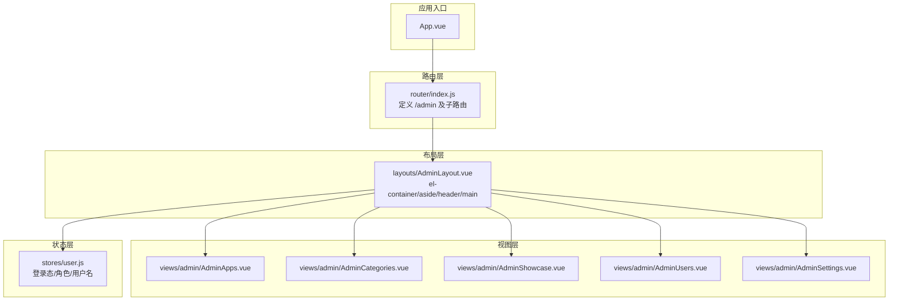
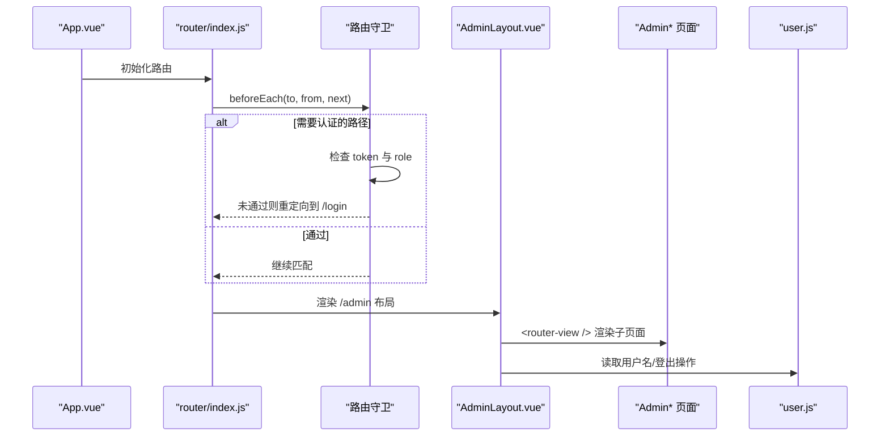
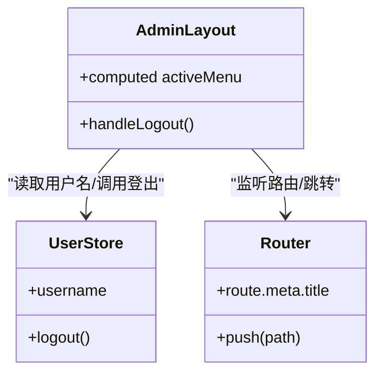
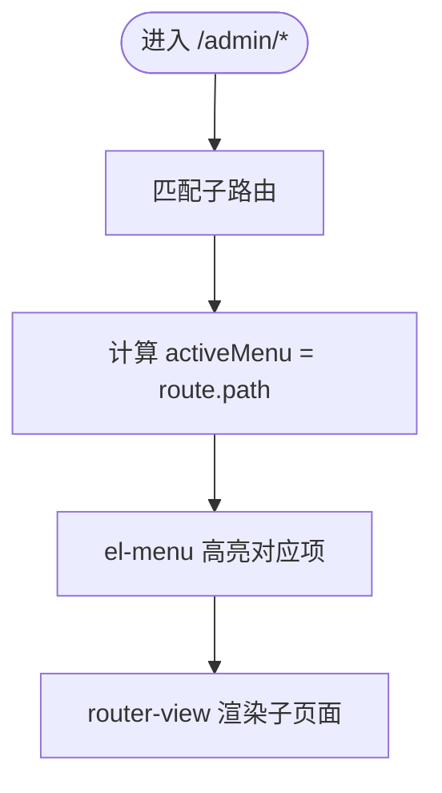
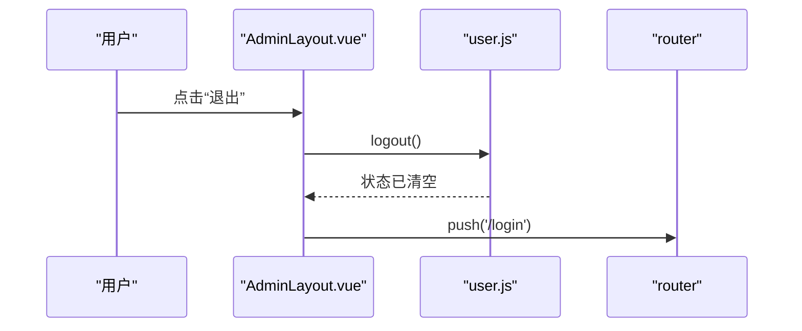
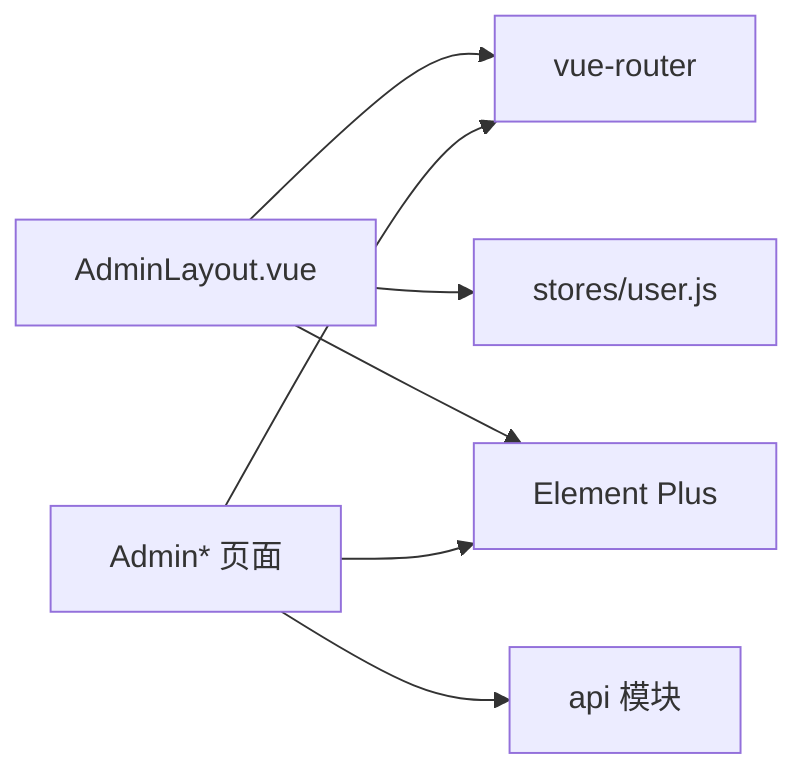

# 布局组件设计

<cite>
**本文引用的文件**
- [AdminLayout.vue](file://frontend/src/layouts/AdminLayout.vue)
- [index.js](file://frontend/src/router/index.js)
- [user.js](file://frontend/src/stores/user.js)
- [App.vue](file://frontend/src/App.vue)
- [AdminApps.vue](file://frontend/src/views/admin/AdminApps.vue)
- [AdminCategories.vue](file://frontend/src/views/admin/AdminCategories.vue)
- [AdminShowcase.vue](file://frontend/src/views/admin/AdminShowcase.vue)
- [AdminUsers.vue](file://frontend/src/views/admin/AdminUsers.vue)
- [AdminSettings.vue](file://frontend/src/views/admin/AdminSettings.vue)
</cite>

## 目录
1. [简介](#简介)
2. [项目结构](#项目结构)
3. [核心组件](#核心组件)
4. [架构总览](#架构总览)
5. [详细组件分析](#详细组件分析)
6. [依赖关系分析](#依赖关系分析)
7. [性能与可访问性](#性能与可访问性)
8. [故障排查指南](#故障排查指南)
9. [结论](#结论)
10. [附录：扩展与自定义示例](#附录扩展与自定义示例)

## 简介
本文件围绕 JZPlatform 门户系统的管理端布局组件 AdminLayout.vue，系统性解析其基于 Element Plus 的容器布局、侧边栏导航、头部区域与主内容区的结构设计；深入说明路由集成机制与菜单高亮逻辑；并给出响应式布局实现思路、主题样式定制方法、用户状态集成方式，以及扩展与自定义开发的实践指南。文档面向不同技术背景的读者，提供从高层到代码级的分层解读与可视化图示。

## 项目结构
前端采用 Vue 3 + Vue Router + Pinia + Element Plus 的组合。管理端布局位于 layouts 目录，子页面位于 views/admin 下，路由在 router/index.js 中集中配置，用户状态由 stores/user.js 管理。

图表来源
- [App.vue:1-7](file://frontend/src/App.vue#L1-L7)
- [index.js:38-73](file://frontend/src/router/index.js#L38-L73)
- [AdminLayout.vue:1-56](file://frontend/src/layouts/AdminLayout.vue#L1-L56)
- [user.js:1-57](file://frontend/src/stores/user.js#L1-L57)

章节来源
- [App.vue:1-7](file://frontend/src/App.vue#L1-L7)
- [index.js:1-99](file://frontend/src/router/index.js#L1-L99)
- [AdminLayout.vue:1-136](file://frontend/src/layouts/AdminLayout.vue#L1-L136)

## 核心组件
本节聚焦 AdminLayout.vue 的实现模式与关键能力。

- 容器结构与职责划分
  - 外层 el-container 作为全屏布局容器，内部左侧为 el-aside（固定宽度），右侧嵌套一个 el-container 承载 el-header 和 el-main。
  - 侧边栏包含 Logo 区、菜单区与返回前台按钮；头部显示当前页面标题与用户信息；主内容区通过 router-view 渲染具体业务页面。

- 路由集成与菜单高亮
  - 菜单使用 router 模式，并通过 :default-active 绑定当前路由路径，从而实现自动高亮。
  - 子路由以 /admin/apps、/admin/categories 等路径挂载，菜单项 index 与路由 path 一一对应。

- 用户状态集成
  - 通过 Pinia 的 useUserStore 获取当前用户名，并在退出时调用 userStore.logout() 清理本地存储与状态，随后跳转至登录页。

- 主题与样式
  - 通过 el-menu 的 background-color、text-color、active-text-color 控制侧边栏主题色。
  - 使用 scoped 样式对 aside、header、main 进行背景、阴影、间距等视觉定制。

章节来源
- [AdminLayout.vue:1-74](file://frontend/src/layouts/AdminLayout.vue#L1-L74)
- [AdminLayout.vue:76-136](file://frontend/src/layouts/AdminLayout.vue#L76-L136)
- [user.js:1-57](file://frontend/src/stores/user.js#L1-L57)

## 架构总览
下图展示从 App.vue 到 AdminLayout 再到各管理页面的整体渲染流程，以及路由守卫对用户权限的控制。

图表来源
- [index.js:82-96](file://frontend/src/router/index.js#L82-L96)
- [AdminLayout.vue:60-74](file://frontend/src/layouts/AdminLayout.vue#L60-L74)

## 详细组件分析

### AdminLayout.vue 组件分析
- 模板结构
  - 顶层 el-container 设置高度占满视口，确保左右分栏布局稳定。
  - el-aside 固定宽度，内部自上而下分为 Logo、菜单、返回前台按钮三部分。
  - 右侧内层 el-container 包含 el-header 与 el-main，分别承载页面标题、用户信息与业务内容。

- 脚本逻辑
  - 使用 computed 将 activeMenu 绑定到当前 route.path，配合菜单 router 模式实现高亮联动。
  - 退出逻辑：调用 userStore.logout() 清除本地 token 与角色，再跳转到登录页。

- 样式与主题
  - 侧边栏深色背景与浅色文字，激活项使用强调色。
  - 头部白色背景加轻微阴影，主内容区浅灰背景提升层次。

图表来源
- [AdminLayout.vue:60-74](file://frontend/src/layouts/AdminLayout.vue#L60-L74)
- [user.js:33-41](file://frontend/src/stores/user.js#L33-L41)

章节来源
- [AdminLayout.vue:1-136](file://frontend/src/layouts/AdminLayout.vue#L1-L136)

### 路由集成与菜单高亮机制
- 路由层级
  - /admin 为布局级路由，挂载 AdminLayout.vue。
  - 子路由 apps、categories、showcase、users、settings 对应五个管理页面。
- 高亮策略
  - 菜单启用 router 模式，index 与子路由 path 一致。
  - default-active 绑定当前路由路径，切换路由时自动更新高亮项。

图表来源
- [index.js:38-73](file://frontend/src/router/index.js#L38-L73)
- [AdminLayout.vue:8-35](file://frontend/src/layouts/AdminLayout.vue#L8-L35)
- [AdminLayout.vue:68](file://frontend/src/layouts/AdminLayout.vue#L68)

章节来源
- [index.js:38-73](file://frontend/src/router/index.js#L38-L73)
- [AdminLayout.vue:8-35](file://frontend/src/layouts/AdminLayout.vue#L8-L35)
- [AdminLayout.vue:68](file://frontend/src/layouts/AdminLayout.vue#L68)

### 用户状态集成与退出流程
- 状态来源
  - userStore 维护 token、userId、username、role，并提供 isLoggedIn、isAdmin 等派生属性。
- 退出流程
  - 点击“退出”触发 handleLogout，先清空 store 与 localStorage，再跳转至登录页。

图表来源
- [AdminLayout.vue:70-73](file://frontend/src/layouts/AdminLayout.vue#L70-L73)
- [user.js:33-41](file://frontend/src/stores/user.js#L33-L41)

章节来源
- [AdminLayout.vue:70-73](file://frontend/src/layouts/AdminLayout.vue#L70-L73)
- [user.js:1-57](file://frontend/src/stores/user.js#L1-L57)

### 子页面与布局协作
- 页面职责
  - AdminApps.vue：应用列表、分页、搜索、弹窗新增/编辑、删除确认。
  - AdminCategories.vue：分类列表与基础 CRUD。
  - AdminShowcase.vue：宣贯项列表、按类别筛选、CRUD。
  - AdminUsers.vue：用户列表、分页、角色标签、CRUD。
  - AdminSettings.vue：平台名称/公司名保存、Logo 与底图上传预览。
- 与布局协作
  - 所有子页面均通过 <router-view /> 注入到 AdminLayout 的主内容区，无需关心侧边栏与头部。
  - 页面标题由路由 meta.title 驱动，在路由守卫中统一设置 document.title。

章节来源
- [AdminApps.vue:1-188](file://frontend/src/views/admin/AdminApps.vue#L1-L188)
- [AdminCategories.vue:1-95](file://frontend/src/views/admin/AdminCategories.vue#L1-L95)
- [AdminShowcase.vue:1-123](file://frontend/src/views/admin/AdminShowcase.vue#L1-L123)
- [AdminUsers.vue:1-128](file://frontend/src/views/admin/AdminUsers.vue#L1-L128)
- [AdminSettings.vue:1-126](file://frontend/src/views/admin/AdminSettings.vue#L1-L126)
- [index.js:82-85](file://frontend/src/router/index.js#L82-L85)

## 依赖关系分析
- 组件耦合
  - AdminLayout 仅依赖路由与用户状态，不直接依赖具体业务页面，符合单一职责原则。
  - 子页面之间相互独立，通过 API 模块与后端交互，避免跨页面耦合。
- 外部依赖
  - Element Plus 提供容器与 UI 组件。
  - Vue Router 负责页面切换与元信息处理。
  - Pinia 管理用户状态与持久化。

图表来源
- [AdminLayout.vue:60-74](file://frontend/src/layouts/AdminLayout.vue#L60-L74)
- [index.js:1-2](file://frontend/src/router/index.js#L1-L2)
- [user.js:1-2](file://frontend/src/stores/user.js#L1-L2)

章节来源
- [AdminLayout.vue:1-136](file://frontend/src/layouts/AdminLayout.vue#L1-L136)
- [index.js:1-99](file://frontend/src/router/index.js#L1-L99)
- [user.js:1-57](file://frontend/src/stores/user.js#L1-L57)

## 性能与可访问性
- 性能建议
  - 菜单项数量增长时，考虑懒加载或虚拟滚动以提升渲染性能。
  - 列表类页面已使用 v-loading 与分页，建议在大数据量场景结合服务端分页与缓存策略。
- 可访问性建议
  - 为图标按钮补充 aria-label，键盘导航友好。
  - 表单控件增加必要的 label 与错误提示，提升无障碍体验。

[本节为通用指导，不涉及具体文件分析]

## 故障排查指南
- 菜单高亮异常
  - 检查菜单 index 是否与路由 path 完全一致。
  - 确认 default-active 是否绑定到当前 route.path。
- 路由守卫拦截导致无法进入
  - 检查本地 token 与 role 是否正确写入。
  - 确认 requiresAuth 路由是否需要 ADMIN 角色。
- 用户信息显示为空
  - 确认 userStore.username 是否在登录后正确赋值。
  - 检查 fetchUserInfo 是否成功执行或在异常分支被清理。

章节来源
- [index.js:82-96](file://frontend/src/router/index.js#L82-L96)
- [AdminLayout.vue:68](file://frontend/src/layouts/AdminLayout.vue#L68)
- [user.js:22-31](file://frontend/src/stores/user.js#L22-L31)
- [user.js:44-54](file://frontend/src/stores/user.js#L44-L54)

## 结论
AdminLayout.vue 以简洁清晰的容器布局实现了管理端的侧边栏导航、头部信息与主内容区渲染；通过路由模式与 computed 实现菜单高亮；借助 Pinia 完成用户状态集成与退出流程。该方案具备良好的可扩展性与可维护性，适合在多页面管理后台中复用与演进。

[本节为总结性内容，不涉及具体文件分析]

## 附录：扩展与自定义示例

### 响应式布局实现思路
- 移动端折叠侧边栏
  - 使用媒体查询在小屏隐藏 el-aside，并提供顶部汉堡菜单按钮用于展开/收起。
  - 通过变量控制 aside 的 display 或 transform 切换，保持主内容区自适应宽度。
- 动态宽度与弹性布局
  - 将 aside 宽度改为可配置变量，支持拖拽调整或根据内容自适应。
  - 使用 flex 布局确保 header 与 main 在不同屏幕尺寸下的对齐与换行行为。

[本节为概念性指导，不涉及具体文件分析]

### 主题样式定制
- 全局主题覆盖
  - 通过 Element Plus 提供的 CSS 变量或主题工具覆盖默认颜色，如 --el-color-primary、--el-bg-color 等。
- 局部主题
  - 在 AdminLayout 的 scoped 样式中调整 aside、header、main 的背景与文本颜色，形成管理端专属风格。
- 动态主题切换
  - 在 userStore 或配置中心维护主题键值，运行时切换根节点 class 或 CSS 变量，实现明暗主题或品牌色切换。

[本节为概念性指导，不涉及具体文件分析]

### 用户状态集成增强
- 首次加载刷新用户信息
  - 在应用启动时调用 userStore.fetchUserInfo()，若失败则强制登出并重定向到登录页。
- 多角色权限控制
  - 在路由守卫中根据 to.meta.roles 校验当前用户角色，未授权则拒绝访问或降级展示。
- 会话过期处理
  - 在请求拦截器中捕获 401 响应，自动清理状态并跳转登录页，同时记录 redirect 以便登录后回跳。

章节来源
- [user.js:44-54](file://frontend/src/stores/user.js#L44-L54)
- [index.js:82-96](file://frontend/src/router/index.js#L82-L96)

### 菜单与路由扩展
- 动态菜单生成
  - 从后端接口拉取菜单树，映射为 el-menu-item 列表，支持多级嵌套与图标动态绑定。
- 面包屑导航
  - 在 el-header 中引入 el-breadcrumb，根据路由元信息自动生成面包屑路径。
- 标签页（Tabs）工作区
  - 在主内容区上方添加 el-tabs，打开新路由时新增标签，关闭时销毁对应组件实例，提升多任务效率。

章节来源
- [AdminLayout.vue:8-35](file://frontend/src/layouts/AdminLayout.vue#L8-L35)
- [index.js:38-73](file://frontend/src/router/index.js#L38-L73)