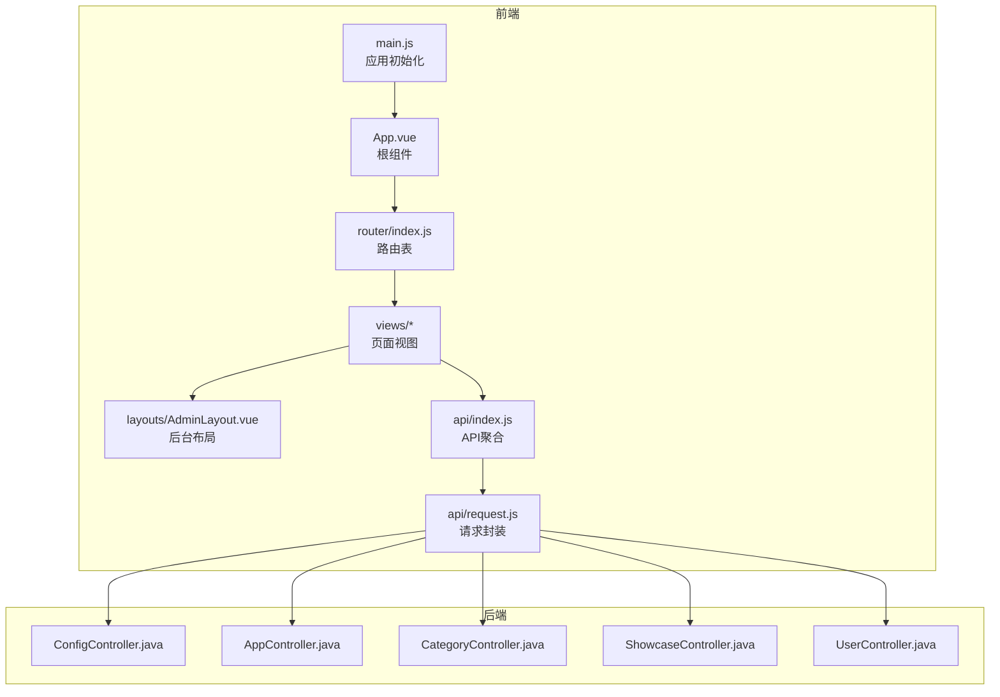
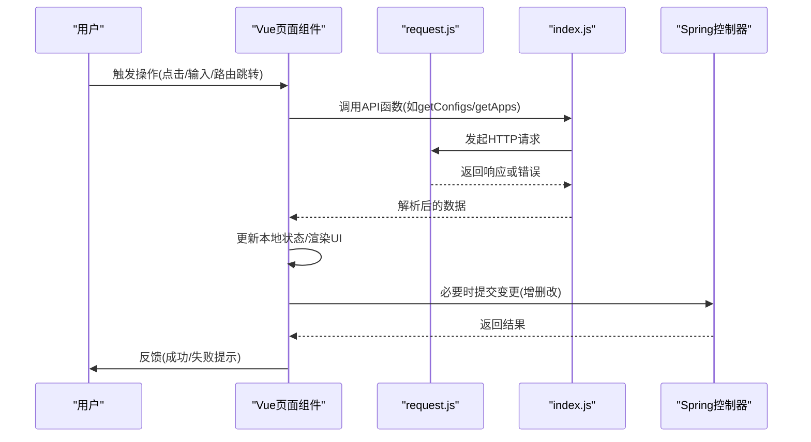
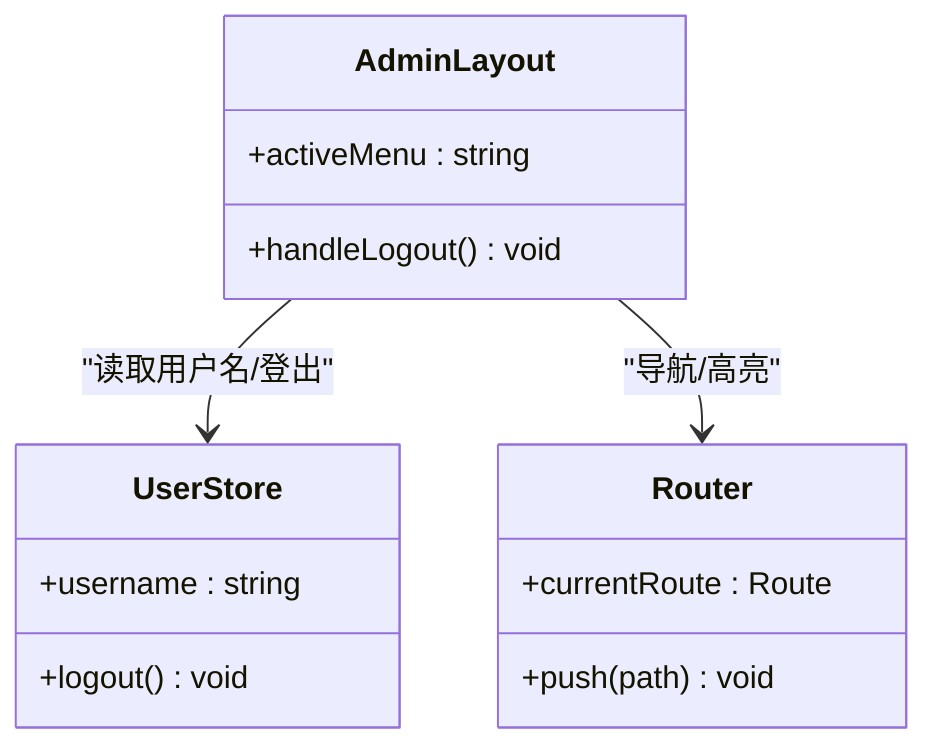
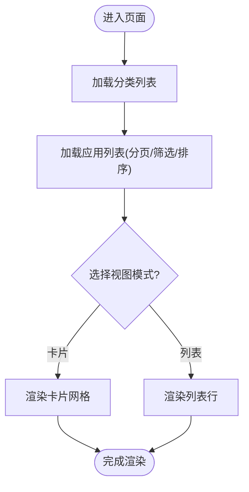
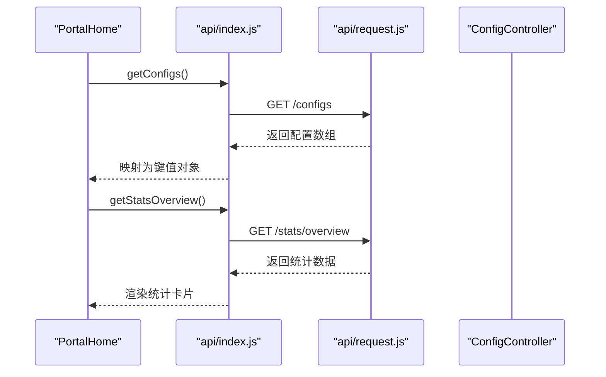
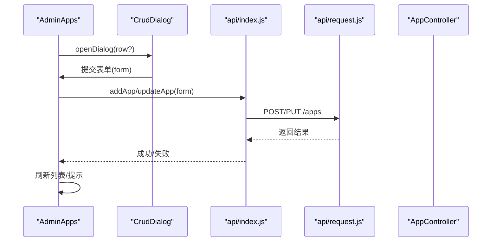
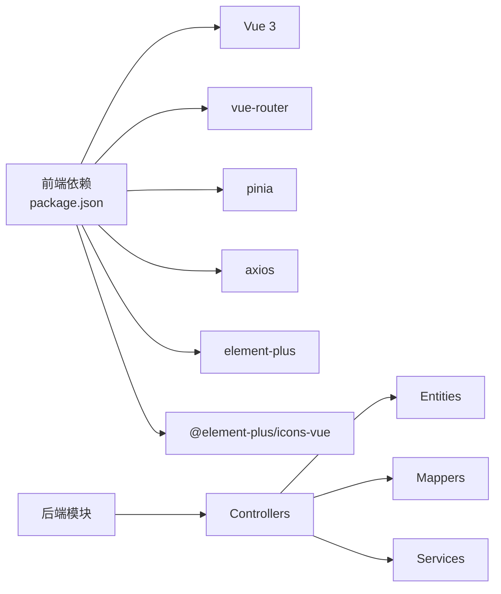

# 组件复用策略

<cite>
**本文引用的文件**
- [frontend/src/main.js](file://frontend/src/main.js)
- [frontend/src/App.vue](file://frontend/src/App.vue)
- [frontend/src/router/index.js](file://frontend/src/router/index.js)
- [frontend/src/stores/user.js](file://frontend/src/stores/user.js)
- [frontend/src/api/index.js](file://frontend/src/api/index.js)
- [frontend/src/api/request.js](file://frontend/src/api/request.js)
- [frontend/src/views/PortalHome.vue](file://frontend/src/views/PortalHome.vue)
- [frontend/src/views/AppNav.vue](file://frontend/src/views/AppNav.vue)
- [frontend/src/layouts/AdminLayout.vue](file://frontend/src/layouts/AdminLayout.vue)
- [frontend/src/views/admin/AdminApps.vue](file://frontend/src/views/admin/AdminApps.vue)
- [frontend/src/views/admin/AdminCategories.vue](file://frontend/src/views/admin/AdminCategories.vue)
- [frontend/src/views/admin/AdminShowcase.vue](file://frontend/src/views/admin/AdminShowcase.vue)
- [frontend/src/views/admin/AdminUsers.vue](file://frontend/src/views/admin/AdminUsers.vue)
- [backend/src/main/java/com/xx/platform/controller/ConfigController.java](file://backend/src/main/java/com/xx/platform/controller/ConfigController.java)
- [backend/src/main/java/com/xx/platform/controller/AppController.java](file://backend/src/main/java/com/xx/platform/controller/AppController.java)
- [backend/src/main/java/com/xx/platform/controller/CategoryController.java](file://backend/src/main/java/com/xx/platform/controller/CategoryController.java)
- [backend/src/main/java/com/xx/platform/controller/ShowcaseController.java](file://backend/src/main/java/com/xx/platform/controller/ShowcaseController.java)
- [backend/src/main/java/com/xx/platform/controller/UserController.java](file://backend/src/main/java/com/xx/platform/controller/UserController.java)
- [backend/src/main/java/com/xx/platform/entity/PlatformConfig.java](file://backend/src/main/java/com/xx/platform/entity/PlatformConfig.java)
- [backend/src/main/java/com/xx/platform/entity/WebApp.java](file://backend/src/main/java/com/xx/platform/entity/WebApp.java)
- [backend/src/main/java/com/xx/platform/entity/AppCategory.java](file://backend/src/main/java/com/xx/platform/entity/AppCategory.java)
- [backend/src/main/java/com/xx/platform/entity/ShowcaseItem.java](file://backend/src/main/java/com/xx/platform/entity/ShowcaseItem.java)
- [backend/src/main/java/com/xx/platform/entity/SysUser.java](file://backend/src/main/java/com/xx/platform/entity/SysUser.java)
</cite>

## 目录
1. [引言](#引言)
2. [项目结构](#项目结构)
3. [核心组件](#核心组件)
4. [架构总览](#架构总览)
5. [详细组件分析](#详细组件分析)
6. [依赖分析](#依赖分析)
7. [性能考虑](#性能考虑)
8. [故障排查指南](#故障排查指南)
9. [结论](#结论)
10. [附录](#附录)

## 引言
本文件面向JZPlatform门户系统的“组件复用策略”，围绕以下目标展开：
- 可复用性设计原则与通用组件抽象方法
- 插槽的高级用法与配置化设计模式
- 动态组件加载机制与版本管理策略
- 组件库组织结构规范、命名约定与文档生成方案
- 结合现有代码的复用示例与最佳实践

说明：当前前端仓库尚未建立独立的 components 目录，页面级视图承担了较多业务逻辑。本文在给出通用策略的同时，会基于现有页面（如应用导航、后台布局等）提炼可复用的模式，并给出迁移到通用组件的建议路径。

## 项目结构
前端采用 Vue 3 + Vite + Element Plus 技术栈，路由与状态管理由 vue-router 与 pinia 提供；后端为 Spring Boot，提供平台配置、应用、分类、宣贯、用户等数据接口。

图表来源
- [frontend/src/main.js:1-22](file://frontend/src/main.js#L1-L22)
- [frontend/src/App.vue:1-7](file://frontend/src/App.vue#L1-L7)
- [frontend/src/router/index.js](file://frontend/src/router/index.js)
- [frontend/src/views/PortalHome.vue:1-287](file://frontend/src/views/PortalHome.vue#L1-L287)
- [frontend/src/views/AppNav.vue:1-356](file://frontend/src/views/AppNav.vue#L1-L356)
- [frontend/src/layouts/AdminLayout.vue:1-136](file://frontend/src/layouts/AdminLayout.vue#L1-L136)
- [frontend/src/api/index.js](file://frontend/src/api/index.js)
- [frontend/src/api/request.js](file://frontend/src/api/request.js)
- [backend/src/main/java/com/xx/platform/controller/ConfigController.java](file://backend/src/main/java/com/xx/platform/controller/ConfigController.java)
- [backend/src/main/java/com/xx/platform/controller/AppController.java](file://backend/src/main/java/com/xx/platform/controller/AppController.java)
- [backend/src/main/java/com/xx/platform/controller/CategoryController.java](file://backend/src/main/java/com/xx/platform/controller/CategoryController.java)
- [backend/src/main/java/com/xx/platform/controller/ShowcaseController.java](file://backend/src/main/java/com/xx/platform/controller/ShowcaseController.java)
- [backend/src/main/java/com/xx/platform/controller/UserController.java](file://backend/src/main/java/com/xx/platform/controller/UserController.java)

章节来源
- [frontend/src/main.js:1-22](file://frontend/src/main.js#L1-L22)
- [frontend/src/App.vue:1-7](file://frontend/src/App.vue#L1-L7)
- [frontend/src/views/PortalHome.vue:1-287](file://frontend/src/views/PortalHome.vue#L1-L287)
- [frontend/src/views/AppNav.vue:1-356](file://frontend/src/views/AppNav.vue#L1-L356)
- [frontend/src/layouts/AdminLayout.vue:1-136](file://frontend/src/layouts/AdminLayout.vue#L1-L136)
- [frontend/src/api/index.js](file://frontend/src/api/index.js)
- [frontend/src/api/request.js](file://frontend/src/api/request.js)

## 核心组件
从现有代码中识别出的可复用点与抽象方向：
- 全局初始化与插件注册：统一入口 main.js 负责注册 Pinia、Router、Element Plus 及图标集，适合作为“平台级组件能力”的统一装配点。
- 后台布局容器：AdminLayout 提供侧边栏菜单、顶部信息区与主内容区，是典型的可复用布局组件。
- 列表与表单模式：多个 admin 页面呈现一致的“工具栏+表格+分页+弹窗表单”模式，适合抽象为通用 CRUD 组件。
- 搜索与筛选：AppNav 中的关键词搜索、分类筛选、排序与视图切换，可抽象为通用查询面板。
- 统计概览卡片：PortalHome 的统计卡片样式一致，可抽象为通用 StatCard 组合。

建议的通用组件清单（规划）
- Layouts
  - AdminLayout（已有）
  - PortalHeader / PortalFooter（可从 PortalHome 拆分）
- Data Display
  - StatCard（统计卡片）
  - AppCard / AppListItem（应用卡片/列表项）
  - EmptyState（空状态占位）
- Data Input
  - SearchFilterBar（搜索与筛选条）
  - CrudDialog（新增/编辑弹窗表单）
  - PaginationBar（分页条）
- Feedback
  - MessageToast（消息提示封装）
  - ConfirmDialog（确认对话框）

章节来源
- [frontend/src/main.js:1-22](file://frontend/src/main.js#L1-L22)
- [frontend/src/layouts/AdminLayout.vue:1-136](file://frontend/src/layouts/AdminLayout.vue#L1-L136)
- [frontend/src/views/PortalHome.vue:1-287](file://frontend/src/views/PortalHome.vue#L1-L287)
- [frontend/src/views/AppNav.vue:1-356](file://frontend/src/views/AppNav.vue#L1-L356)
- [frontend/src/views/admin/AdminApps.vue:1-188](file://frontend/src/views/admin/AdminApps.vue#L1-L188)
- [frontend/src/views/admin/AdminCategories.vue:1-95](file://frontend/src/views/admin/AdminCategories.vue#L1-L95)
- [frontend/src/views/admin/AdminShowcase.vue:1-123](file://frontend/src/views/admin/AdminShowcase.vue#L1-L123)
- [frontend/src/views/admin/AdminUsers.vue:1-128](file://frontend/src/views/admin/AdminUsers.vue#L1-L128)

## 架构总览
前后端交互通过 API 层进行，页面组件消费 API 返回的数据并进行展示与操作。

图表来源
- [frontend/src/api/request.js](file://frontend/src/api/request.js)
- [frontend/src/api/index.js](file://frontend/src/api/index.js)
- [frontend/src/views/PortalHome.vue:93-123](file://frontend/src/views/PortalHome.vue#L93-L123)
- [frontend/src/views/AppNav.vue:111-180](file://frontend/src/views/AppNav.vue#L111-L180)
- [backend/src/main/java/com/xx/platform/controller/ConfigController.java](file://backend/src/main/java/com/xx/platform/controller/ConfigController.java)
- [backend/src/main/java/com/xx/platform/controller/AppController.java](file://backend/src/main/java/com/xx/platform/controller/AppController.java)

## 详细组件分析

### 组件A：后台布局组件（AdminLayout）
职责
- 提供统一的后台框架：侧边栏菜单、顶部信息区、主内容区
- 与路由联动高亮当前菜单项
- 提供退出登录与返回前台入口

可复用点
- 作为所有后台页面的父容器
- 可通过 props 注入菜单项，实现动态菜单
- 通过具名插槽扩展头部右侧区域

图表来源
- [frontend/src/layouts/AdminLayout.vue:1-136](file://frontend/src/layouts/AdminLayout.vue#L1-L136)
- [frontend/src/stores/user.js](file://frontend/src/stores/user.js)
- [frontend/src/router/index.js](file://frontend/src/router/index.js)

章节来源
- [frontend/src/layouts/AdminLayout.vue:1-136](file://frontend/src/layouts/AdminLayout.vue#L1-L136)

### 组件B：应用导航页（AppNav）
职责
- 展示应用列表，支持搜索、分类筛选、排序、卡片/列表视图切换、分页
- 记录点击并在新窗口打开应用链接

可复用点
- 将“搜索+筛选+排序+视图切换”抽象为 SearchFilterBar
- 将“卡片/列表”两种展示抽象为 AppList 组件，内部根据 viewMode 渲染不同子项
- 将分页逻辑抽离为 PaginationBar

图表来源
- [frontend/src/views/AppNav.vue:111-180](file://frontend/src/views/AppNav.vue#L111-L180)
- [frontend/src/views/AppNav.vue:1-109](file://frontend/src/views/AppNav.vue#L1-L109)

章节来源
- [frontend/src/views/AppNav.vue:1-356](file://frontend/src/views/AppNav.vue#L1-L356)

### 组件C：首页统计与入口（PortalHome）
职责
- 展示平台名称、Logo、统计概览、入口卡片
- 拉取平台配置与统计数据

可复用点
- 将统计卡片抽象为 StatCard 组合
- 将入口卡片抽象为 EntryCard 组合
- 将平台配置加载逻辑下沉至服务层，供多页面复用

图表来源
- [frontend/src/views/PortalHome.vue:93-123](file://frontend/src/views/PortalHome.vue#L93-L123)
- [frontend/src/api/index.js](file://frontend/src/api/index.js)
- [frontend/src/api/request.js](file://frontend/src/api/request.js)
- [backend/src/main/java/com/xx/platform/controller/ConfigController.java](file://backend/src/main/java/com/xx/platform/controller/ConfigController.java)

章节来源
- [frontend/src/views/PortalHome.vue:1-287](file://frontend/src/views/PortalHome.vue#L1-L287)

### 组件D：后台CRUD页面（以AdminApps为例）
职责
- 列表展示、分页、搜索、新增/编辑弹窗、删除确认

可复用点
- 将“工具栏+表格+分页+弹窗表单”抽象为 CrudPage 模板
- 将“新增/编辑弹窗”抽象为 CrudDialog，支持字段映射与校验
- 将“删除确认”抽象为 ConfirmDialog

图表来源
- [frontend/src/views/admin/AdminApps.vue:90-179](file://frontend/src/views/admin/AdminApps.vue#L90-L179)
- [frontend/src/api/index.js](file://frontend/src/api/index.js)
- [frontend/src/api/request.js](file://frontend/src/api/request.js)
- [backend/src/main/java/com/xx/platform/controller/AppController.java](file://backend/src/main/java/com/xx/platform/controller/AppController.java)

章节来源
- [frontend/src/views/admin/AdminApps.vue:1-188](file://frontend/src/views/admin/AdminApps.vue#L1-L188)

### 组件E：其他后台页面（AdminCategories / AdminShowcase / AdminUsers）
职责
- 分类管理、宣贯项管理、用户管理，均遵循一致的CRUD模式

可复用点
- 复用 CrudPage/CrudDialog/ConfirmDialog/PaginationBar
- 将枚举维度（如宣贯类别）抽取为字典配置，便于维护与国际化

章节来源
- [frontend/src/views/admin/AdminCategories.vue:1-95](file://frontend/src/views/admin/AdminCategories.vue#L1-L95)
- [frontend/src/views/admin/AdminShowcase.vue:1-123](file://frontend/src/views/admin/AdminShowcase.vue#L1-L123)
- [frontend/src/views/admin/AdminUsers.vue:1-128](file://frontend/src/views/admin/AdminUsers.vue#L1-L128)

## 依赖分析
- 前端依赖
  - Vue 3、vue-router、pinia、axios、element-plus、echarts、@element-plus/icons-vue
- 后端依赖
  - Spring Boot 生态（控制器、实体、Mapper、Service 分层）

图表来源
- [frontend/package.json:1-25](file://frontend/package.json#L1-L25)
- [backend/src/main/java/com/xx/platform/controller/ConfigController.java](file://backend/src/main/java/com/xx/platform/controller/ConfigController.java)
- [backend/src/main/java/com/xx/platform/controller/AppController.java](file://backend/src/main/java/com/xx/platform/controller/AppController.java)
- [backend/src/main/java/com/xx/platform/controller/CategoryController.java](file://backend/src/main/java/com/xx/platform/controller/CategoryController.java)
- [backend/src/main/java/com/xx/platform/controller/ShowcaseController.java](file://backend/src/main/java/com/xx/platform/controller/ShowcaseController.java)
- [backend/src/main/java/com/xx/platform/controller/UserController.java](file://backend/src/main/java/com/xx/platform/controller/UserController.java)

章节来源
- [frontend/package.json:1-25](file://frontend/package.json#L1-L25)

## 性能考虑
- 列表与搜索
  - 使用防抖减少频繁请求（已在多处使用 setTimeout 防抖）
  - 分页加载避免一次性渲染大量数据
- 图片与资源
  - 封面图懒加载与占位图优化首屏体验
- 网络请求
  - 统一拦截器处理错误与重试
  - 合理缓存静态资源与接口数据（对不常变配置做短期缓存）
- 组件粒度
  - 将大页面拆分为小组件，按需加载，降低单文件体积

[本节为通用指导，无需源码引用]

## 故障排查指南
常见问题与建议
- 接口报错
  - 检查 request.js 的错误拦截与提示
  - 核对后端控制器是否返回预期数据结构
- 路由跳转异常
  - 检查 router/index.js 的路由定义与权限守卫
- 状态同步问题
  - 检查 Pinia store 的状态更新时机与副作用
- 表单校验失败
  - 确保必填字段校验与用户提示一致

章节来源
- [frontend/src/api/request.js](file://frontend/src/api/request.js)
- [frontend/src/router/index.js](file://frontend/src/router/index.js)
- [frontend/src/stores/user.js](file://frontend/src/stores/user.js)
- [frontend/src/views/admin/AdminApps.vue:150-178](file://frontend/src/views/admin/AdminApps.vue#L150-L178)
- [frontend/src/views/admin/AdminUsers.vue:102-122](file://frontend/src/views/admin/AdminUsers.vue#L102-L122)

## 结论
通过将页面级重复模式抽象为通用组件，并结合配置化与插槽机制，可以显著提升JZPlatform门户系统的可维护性与可扩展性。建议在后续迭代中逐步落地通用组件库，完善文档与测试，形成稳定的复用体系。

[本节为总结，无需源码引用]

## 附录

### 一、可复用性设计原则
- 单一职责：每个组件只关注一个领域（展示/交互/数据）
- 低耦合高内聚：通过 props/events 通信，避免隐式依赖
- 可配置化：通过 props 暴露行为开关与样式变量
- 可扩展性：通过插槽与事件钩子允许外部定制
- 可测试性：纯函数式数据处理与明确边界

### 二、通用组件抽象方法
- 识别重复模式：如 CRUD、搜索筛选、分页、空态、统计卡片
- 提取公共状态：将分页、筛选、排序等状态上提
- 定义清晰接口：props 最小必要集合，events 明确语义
- 提供默认实现：保证开箱即用，同时允许覆盖

### 三、插槽高级用法
- 默认插槽：用于主体内容替换
- 具名插槽：用于局部定制（如表格列、表单字段）
- 作用域插槽：传递行数据或计算结果给父级自定义渲染
- 动态插槽名：根据配置动态渲染不同插槽内容

### 四、配置化设计模式
- 将易变文案、主题、功能开关放入配置中心或配置文件
- 页面通过配置驱动渲染，减少硬编码
- 示例参考：PortalHome 拉取平台配置并渲染 Logo、标题、公司名称等

章节来源
- [frontend/src/views/PortalHome.vue:93-123](file://frontend/src/views/PortalHome.vue#L93-L123)
- [backend/src/main/java/com/xx/platform/entity/PlatformConfig.java](file://backend/src/main/java/com/xx/platform/entity/PlatformConfig.java)

### 五、动态组件加载机制
- 路由级懒加载：按页面拆分，按需引入
- 组件级动态加载：使用 defineAsyncComponent 或 import() 动态导入
- 条件渲染：根据权限或配置动态显示/隐藏组件
- 注意：保持组件命名与路径稳定，便于缓存与调试

### 六、组件版本管理策略
- 语义化版本：major.minor.patch，破坏性变更升级 major
- 向后兼容：优先通过 props 扩展而非修改既有行为
- 弃用流程：保留旧属性一段时间并提供迁移提示
- 发布与回滚：配合 CI/CD 与制品库管理

### 七、组件库组织结构规范
- 目录划分
  - components/base：基础原子组件（按钮、输入、标签等）
  - components/business：业务组件（应用卡片、统计卡片等）
  - components/layout：布局组件（后台布局、门户头尾等）
  - components/mixins：组合式逻辑（hooks）
  - components/utils：工具函数与常量
- 命名约定
  - 文件名：PascalCase，如 AppCard.vue
  - 组件名：与文件名一致，对外导出时保持一致
  - Props：camelCase，事件：kebab-case
- 文档生成
  - 使用 Storybook 或 VitePress 生成组件文档
  - 为每个组件提供 README：用途、Props、Events、Slots、示例

### 八、具体复用示例与最佳实践
- 示例1：将 AdminApps 的表格+分页+弹窗抽象为 CrudPage
  - 步骤：抽取表格列配置、分页参数、表单字段映射、保存/删除回调
  - 收益：减少重复代码，统一交互体验
- 示例2：将 AppNav 的搜索筛选与视图切换抽象为 SearchFilterBar + AppList
  - 步骤：将搜索词、分类、排序、视图模式作为 props，事件回调通知父组件
  - 收益：提升复用度，便于在其他列表场景复用
- 示例3：将 PortalHome 的统计卡片抽象为 StatCard
  - 步骤：抽取数值、标签、图标、样式变量为 props
  - 收益：统一视觉风格，便于扩展更多指标

章节来源
- [frontend/src/views/admin/AdminApps.vue:1-188](file://frontend/src/views/admin/AdminApps.vue#L1-L188)
- [frontend/src/views/AppNav.vue:1-356](file://frontend/src/views/AppNav.vue#L1-L356)
- [frontend/src/views/PortalHome.vue:1-287](file://frontend/src/views/PortalHome.vue#L1-L287)