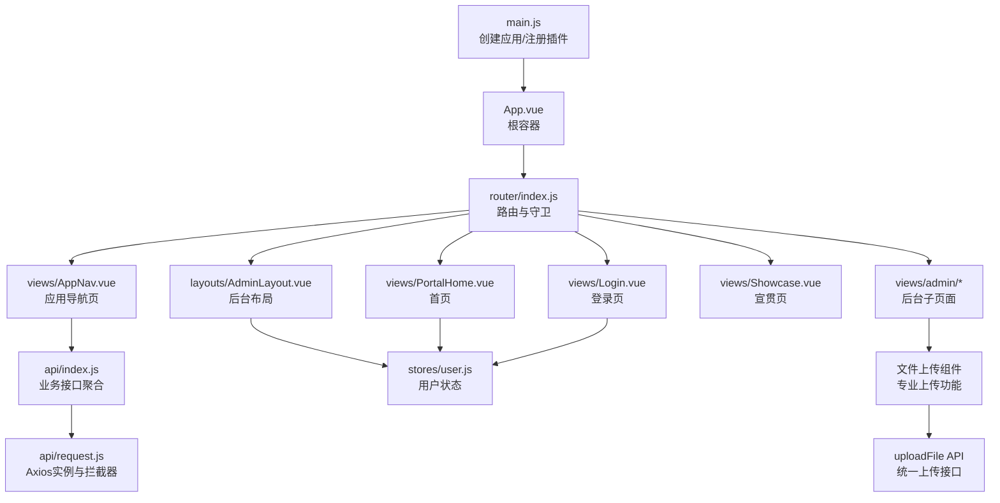
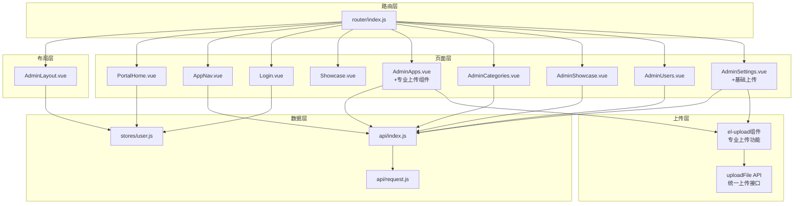
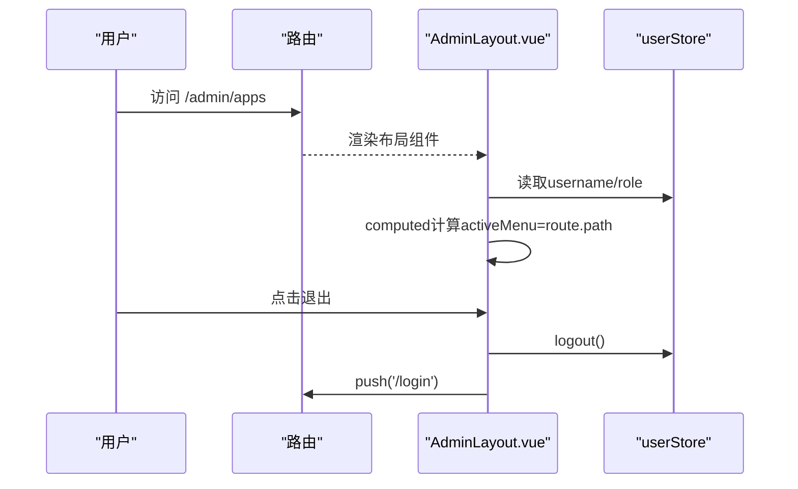
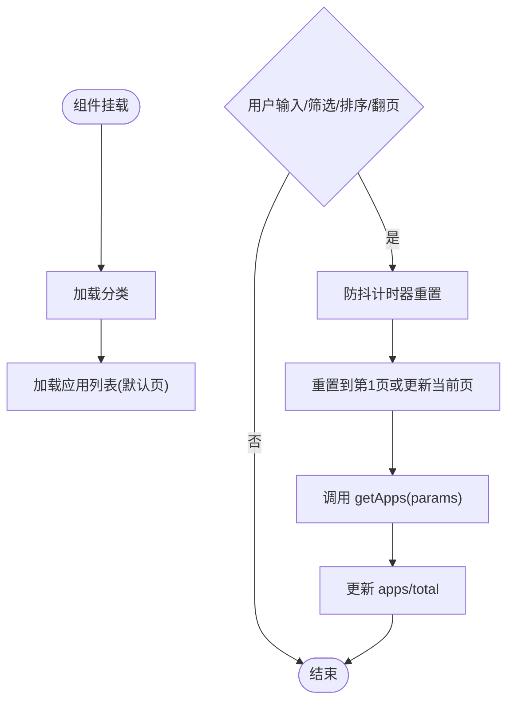
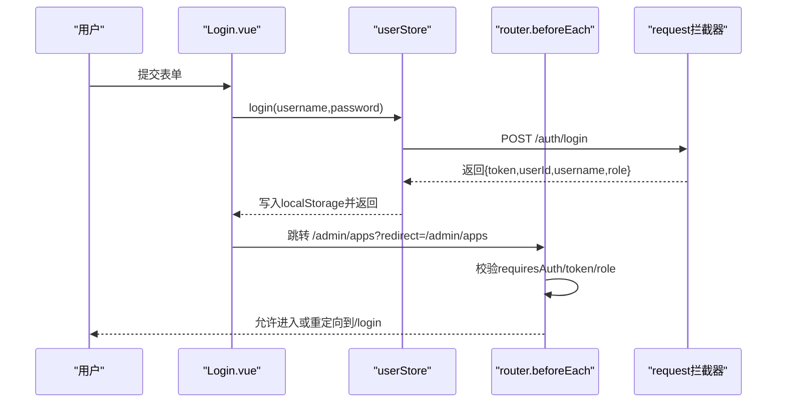
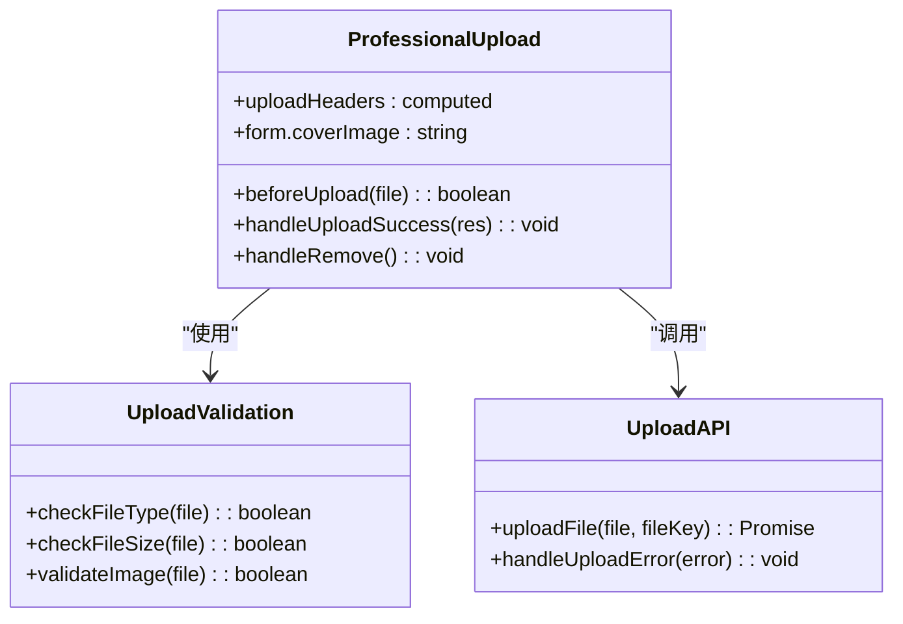
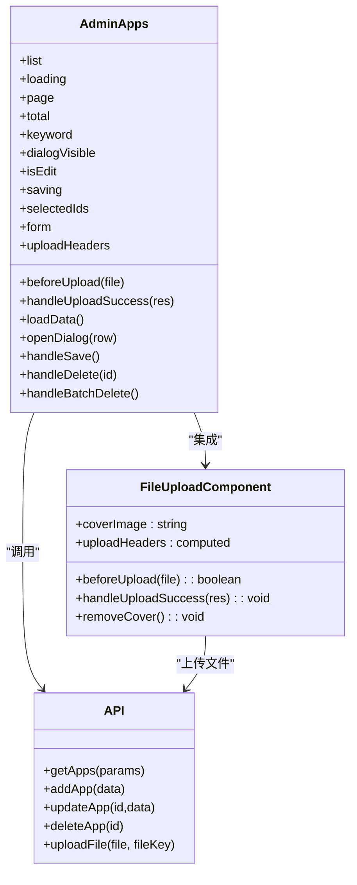
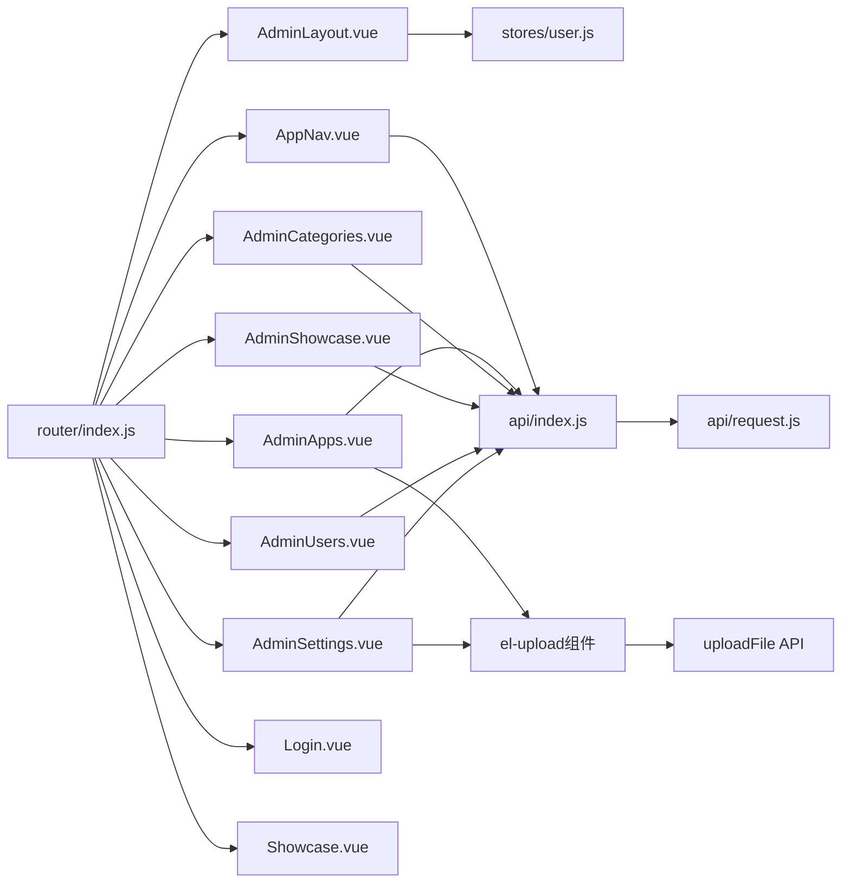

# 组件设计与模式

<cite>
**本文引用的文件**   
- [frontend/src/main.js](file://frontend/src/main.js)
- [frontend/src/App.vue](file://frontend/src/App.vue)
- [frontend/src/router/index.js](file://frontend/src/router/index.js)
- [frontend/src/layouts/AdminLayout.vue](file://frontend/src/layouts/AdminLayout.vue)
- [frontend/src/views/AppNav.vue](file://frontend/src/views/AppNav.vue)
- [frontend/src/views/PortalHome.vue](file://frontend/src/views/PortalHome.vue)
- [frontend/src/views/Login.vue](file://frontend/src/views/Login.vue)
- [frontend/src/views/Showcase.vue](file://frontend/src/views/Showcase.vue)
- [frontend/src/views/admin/AdminApps.vue](file://frontend/src/views/admin/AdminApps.vue)
- [frontend/src/views/admin/AdminCategories.vue](file://frontend/src/views/admin/AdminCategories.vue)
- [frontend/src/views/admin/AdminShowcase.vue](file://frontend/src/views/admin/AdminShowcase.vue)
- [frontend/src/views/admin/AdminUsers.vue](file://frontend/src/views/admin/AdminUsers.vue)
- [frontend/src/views/admin/AdminSettings.vue](file://frontend/src/views/admin/AdminSettings.vue)
- [frontend/src/stores/user.js](file://frontend/src/stores/user.js)
- [frontend/src/api/index.js](file://frontend/src/api/index.js)
- [frontend/src/api/request.js](file://frontend/src/api/request.js)
</cite>

## 更新摘要
**所做更改**   
- 更新了AdminApps.vue表单设计模式的详细分析，重点介绍新增的专业文件上传组件
- 新增了文件上传组件的实现模式和最佳实践章节
- 更新了后台CRUD页面模式的说明，包含图片上传功能
- 完善了组件复用策略，增加了上传组件的抽象建议
- 增强了性能考虑部分，涵盖文件上传优化策略

## 目录
1. [简介](#简介)
2. [项目结构](#项目结构)
3. [核心组件](#核心组件)
4. [架构总览](#架构总览)
5. [详细组件分析](#详细组件分析)
6. [依赖关系分析](#依赖关系分析)
7. [性能考虑](#性能考虑)
8. [故障排查指南](#故障排查指南)
9. [结论](#结论)
10. [附录](#附录)

## 简介
本文件面向JZPlatform门户系统的前端组件设计，聚焦以下目标：
- 梳理组件层次结构与布局模式（AdminLayout）
- 解析导航与列表类组件（AppNav）的实现模式
- 说明组件间通信机制（props、事件、provide/inject、路由与状态管理）
- 总结组件复用策略与插槽使用模式
- 给出开发示例、命名规范与代码组织方式
- 提供测试策略与性能优化建议
- **新增**：详细介绍专业文件上传组件的设计模式与实现

## 项目结构
前端采用Vue 3 + Vue Router + Pinia + Element Plus的模块化组织方式。入口挂载应用、注册插件与全局图标；路由集中配置页面与嵌套布局；视图按功能域划分；API层统一封装请求与拦截器；状态集中在Pinia中管理。

图表来源
- [frontend/src/main.js:1-22](file://frontend/src/main.js#L1-L22)
- [frontend/src/App.vue:1-7](file://frontend/src/App.vue#L1-L7)
- [frontend/src/router/index.js:1-99](file://frontend/src/router/index.js#L1-L99)
- [frontend/src/layouts/AdminLayout.vue:1-136](file://frontend/src/layouts/AdminLayout.vue#L1-L136)
- [frontend/src/views/AppNav.vue:1-356](file://frontend/src/views/AppNav.vue#L1-L356)
- [frontend/src/views/PortalHome.vue:1-287](file://frontend/src/views/PortalHome.vue#L1-L287)
- [frontend/src/views/Login.vue:1-103](file://frontend/src/views/Login.vue#L1-L103)
- [frontend/src/views/Showcase.vue:1-190](file://frontend/src/views/Showcase.vue#L1-L190)
- [frontend/src/views/admin/AdminApps.vue:1-293](file://frontend/src/views/admin/AdminApps.vue#L1-L293)
- [frontend/src/views/admin/AdminSettings.vue:1-126](file://frontend/src/views/admin/AdminSettings.vue#L1-L126)
- [frontend/src/api/index.js:1-137](file://frontend/src/api/index.js#L1-L137)
- [frontend/src/api/request.js:1-45](file://frontend/src/api/request.js#L1-L45)
- [frontend/src/stores/user.js:1-57](file://frontend/src/stores/user.js#L1-L57)

章节来源
- [frontend/src/main.js:1-22](file://frontend/src/main.js#L1-L22)
- [frontend/src/App.vue:1-7](file://frontend/src/App.vue#L1-L7)
- [frontend/src/router/index.js:1-99](file://frontend/src/router/index.js#L1-L99)

## 核心组件
- AdminLayout：后台布局容器，负责侧边栏菜单、顶部信息区与主内容区渲染，结合路由元信息与用户状态实现高亮与退出逻辑。
- AppNav：前台应用导航页，支持搜索、分类筛选、排序、卡片/列表双视图、分页与点击计数上报。
- PortalHome：门户首页，展示平台名称、统计概览与入口卡片，动态加载平台配置与统计数据。
- Login：管理员登录页，表单校验、调用用户状态登录动作并跳转。
- Showcase：产品宣贯页，维度切换与ECharts饼图概览。
- **AdminApps**：应用管理页面，**已升级**支持专业文件上传组件，提供封面图上传、实时预览和格式验证功能。
- 后台子页面：AdminCategories、AdminShowcase、AdminUsers、AdminSettings，遵循统一的CRUD交互范式。

章节来源
- [frontend/src/layouts/AdminLayout.vue:1-136](file://frontend/src/layouts/AdminLayout.vue#L1-L136)
- [frontend/src/views/AppNav.vue:1-356](file://frontend/src/views/AppNav.vue#L1-L356)
- [frontend/src/views/PortalHome.vue:1-287](file://frontend/src/views/PortalHome.vue#L1-L287)
- [frontend/src/views/Login.vue:1-103](file://frontend/src/views/Login.vue#L1-L103)
- [frontend/src/views/Showcase.vue:1-190](file://frontend/src/views/Showcase.vue#L1-L190)
- [frontend/src/views/admin/AdminApps.vue:1-293](file://frontend/src/views/admin/AdminApps.vue#L1-L293)
- [frontend/src/views/admin/AdminCategories.vue:1-139](file://frontend/src/views/admin/AdminCategories.vue#L1-L139)
- [frontend/src/views/admin/AdminShowcase.vue:1-166](file://frontend/src/views/admin/AdminShowcase.vue#L1-L166)
- [frontend/src/views/admin/AdminUsers.vue:1-156](file://frontend/src/views/admin/AdminUsers.vue#L1-L156)
- [frontend/src/views/admin/AdminSettings.vue:1-126](file://frontend/src/views/admin/AdminSettings.vue#L1-L126)

## 架构总览
整体采用"布局-页面-数据"分层：
- 布局层：AdminLayout承载后台框架
- 页面层：各视图组件负责具体业务UI与交互
- 数据层：Pinia管理用户态，API层统一网络请求与错误处理
- 路由层：集中式路由与前置守卫控制访问权限与标题
- **上传层**：专业的文件上传组件提供统一的上传体验

图表来源
- [frontend/src/router/index.js:1-99](file://frontend/src/router/index.js#L1-L99)
- [frontend/src/layouts/AdminLayout.vue:1-136](file://frontend/src/layouts/AdminLayout.vue#L1-L136)
- [frontend/src/views/PortalHome.vue:1-287](file://frontend/src/views/PortalHome.vue#L1-L287)
- [frontend/src/views/AppNav.vue:1-356](file://frontend/src/views/AppNav.vue#L1-L356)
- [frontend/src/views/Login.vue:1-103](file://frontend/src/views/Login.vue#L1-L103)
- [frontend/src/views/Showcase.vue:1-190](file://frontend/src/views/Showcase.vue#L1-L190)
- [frontend/src/views/admin/AdminApps.vue:1-293](file://frontend/src/views/admin/AdminApps.vue#L1-L293)
- [frontend/src/views/admin/AdminCategories.vue:1-139](file://frontend/src/views/admin/AdminCategories.vue#L1-L139)
- [frontend/src/views/admin/AdminShowcase.vue:1-166](file://frontend/src/views/admin/AdminShowcase.vue#L1-L166)
- [frontend/src/views/admin/AdminUsers.vue:1-156](file://frontend/src/views/admin/AdminUsers.vue#L1-L156)
- [frontend/src/views/admin/AdminSettings.vue:1-126](file://frontend/src/views/admin/AdminSettings.vue#L1-L126)
- [frontend/src/stores/user.js:1-57](file://frontend/src/stores/user.js#L1-L57)
- [frontend/src/api/index.js:1-137](file://frontend/src/api/index.js#L1-L137)
- [frontend/src/api/request.js:1-45](file://frontend/src/api/request.js#L1-L45)

## 详细组件分析

### AdminLayout 布局组件
- 职责：后台框架容器，包含侧边栏菜单、头部信息、主内容区；根据当前路由高亮菜单项；提供返回前台与退出登录能力。
- 关键实现要点：
  - 使用el-container/el-aside/el-header/el-main组合构建标准后台布局
  - 通过computed将当前路由path映射为菜单active状态
  - 从Pinia获取用户名并显示在头部
  - 退出时调用store.logout并跳转到登录页
- 插槽与复用：
  - 通过<router-view />作为内容插槽，复用性强
  - 可进一步抽象为通用布局组件，支持可折叠侧边栏、面包屑等扩展点
- 样式与主题：
  - 深色侧边栏+浅色主内容区，符合后台视觉习惯

图表来源
- [frontend/src/layouts/AdminLayout.vue:1-136](file://frontend/src/layouts/AdminLayout.vue#L1-L136)
- [frontend/src/stores/user.js:1-57](file://frontend/src/stores/user.js#L1-L57)
- [frontend/src/router/index.js:1-99](file://frontend/src/router/index.js#L1-L99)

章节来源
- [frontend/src/layouts/AdminLayout.vue:1-136](file://frontend/src/layouts/AdminLayout.vue#L1-L136)
- [frontend/src/stores/user.js:1-57](file://frontend/src/stores/user.js#L1-L57)
- [frontend/src/router/index.js:1-99](file://frontend/src/router/index.js#L1-L99)

### AppNav 导航组件
- 职责：应用导航页，提供搜索、分类筛选、排序、卡片/列表视图切换、分页与点击计数上报。
- 关键实现要点：
  - 使用ref维护本地状态（apps、categories、keyword、categoryId、sortField、viewMode、currentPage、pageSize、total）
  - 防抖搜索：输入变化后延迟触发loadApps
  - 分类下拉与排序选择联动loadApps
  - 点击应用记录点击数并在新窗口打开链接
- 数据流：
  - 初始化onMounted加载分类与应用列表
  - loadApps聚合分页参数与筛选条件调用getApps
  - getCategoryName用于本地分类名映射
- 可扩展点：
  - 可将搜索/筛选/分页抽离为独立子组件，通过props与事件通信
  - 视图切换可抽象为通用Grid/List容器组件

图表来源
- [frontend/src/views/AppNav.vue:1-356](file://frontend/src/views/AppNav.vue#L1-L356)
- [frontend/src/api/index.js:1-137](file://frontend/src/api/index.js#L1-L137)

章节来源
- [frontend/src/views/AppNav.vue:1-356](file://frontend/src/views/AppNav.vue#L1-L356)
- [frontend/src/api/index.js:1-137](file://frontend/src/api/index.js#L1-L137)

### 登录流程（与路由守卫协作）
- 登录页完成表单校验后调用userStore.login，成功后根据redirect参数跳转至受保护路由
- 路由守卫检查requiresAuth路由的token与角色，未授权则重定向到登录页并携带redirect
- 响应拦截器对401进行统一处理，清除本地凭证并跳转登录

图表来源
- [frontend/src/views/Login.vue:1-103](file://frontend/src/views/Login.vue#L1-L103)
- [frontend/src/stores/user.js:1-57](file://frontend/src/stores/user.js#L1-L57)
- [frontend/src/api/request.js:1-45](file://frontend/src/api/request.js#L1-L45)
- [frontend/src/router/index.js:1-99](file://frontend/src/router/index.js#L1-L99)

章节来源
- [frontend/src/views/Login.vue:1-103](file://frontend/src/views/Login.vue#L1-L103)
- [frontend/src/stores/user.js:1-57](file://frontend/src/stores/user.js#L1-L57)
- [frontend/src/api/request.js:1-45](file://frontend/src/api/request.js#L1-L45)
- [frontend/src/router/index.js:1-99](file://frontend/src/router/index.js#L1-L99)

### 专业文件上传组件设计模式

**更新** AdminApps.vue已集成专业的文件上传组件，替代了原有的简单文本输入，提供更好的用户体验和实时预览功能。

#### 上传组件核心特性
- **格式验证**：支持PNG/JPG/GIF/WebP格式，文件大小限制5MB
- **实时预览**：上传后立即显示图片预览效果
- **认证集成**：自动携带Authorization头进行身份验证
- **错误处理**：详细的错误提示和用户反馈
- **移除功能**：支持已上传图片的删除操作

#### 实现架构

图表来源
- [frontend/src/views/admin/AdminApps.vue:75-96](file://frontend/src/views/admin/AdminApps.vue#L75-L96)
- [frontend/src/views/admin/AdminApps.vue:151-175](file://frontend/src/views/admin/AdminApps.vue#L151-L175)
- [frontend/src/api/index.js:123-131](file://frontend/src/api/index.js#L123-L131)

#### 技术实现要点
- **上传前校验**：`beforeUpload`钩子函数实现文件格式和大小验证
- **成功回调处理**：`handleUploadSuccess`接收后端返回的图片路径并更新表单
- **认证头设置**：通过computed属性动态生成带token的请求头
- **样式定制**：自定义上传区域样式，支持拖拽和悬停效果
- **响应式设计**：适配不同屏幕尺寸的预览显示

章节来源
- [frontend/src/views/admin/AdminApps.vue:75-96](file://frontend/src/views/admin/AdminApps.vue#L75-L96)
- [frontend/src/views/admin/AdminApps.vue:151-175](file://frontend/src/views/admin/AdminApps.vue#L151-L175)
- [frontend/src/views/admin/AdminApps.vue:253-293](file://frontend/src/views/admin/AdminApps.vue#L253-L293)
- [frontend/src/api/index.js:123-131](file://frontend/src/api/index.js#L123-L131)

### 后台CRUD页面模式（以AdminApps为例）
- 统一结构：工具栏（新增/搜索）、表格展示、分页、弹窗表单（新增/编辑）
- 交互模式：
  - 打开弹窗时根据是否编辑填充表单
  - 保存时区分新增/更新API调用
  - 删除使用确认对话框
  - **新增**：集成专业文件上传组件，支持封面图上传和实时预览
- 复用策略：
  - 可将"表格+分页+弹窗表单"抽象为通用TableForm组件，通过props传入列定义、表单字段、API方法
  - 分类映射、状态标签等可通过插槽或格式化函数注入
  - **新增**：文件上传功能可抽象为独立的UploadCard组件，支持多种上传场景

图表来源
- [frontend/src/views/admin/AdminApps.vue:115-251](file://frontend/src/views/admin/AdminApps.vue#L115-L251)
- [frontend/src/api/index.js:38-66](file://frontend/src/api/index.js#L38-L66)
- [frontend/src/api/index.js:123-131](file://frontend/src/api/index.js#L123-L131)

章节来源
- [frontend/src/views/admin/AdminApps.vue:115-251](file://frontend/src/views/admin/AdminApps.vue#L115-L251)
- [frontend/src/api/index.js:38-66](file://frontend/src/api/index.js#L38-L66)

### 组件间通信机制
- props：适用于父子组件传递静态配置与数据（如表格列定义、表单字段、分页参数）
- events：子组件通过emit向上通知父组件（如表单提交、分页变更、筛选条件变化）
- provide/inject：适合跨层级共享非频繁变化的上下文（如主题、语言、全局开关），当前仓库未显式使用，可在需要时引入
- 路由传参：query与params用于页面间传递轻量参数（如详情页id、筛选条件）
- 状态管理（Pinia）：用户态、全局配置等跨组件共享状态集中管理
- **上传状态管理**：通过表单对象统一管理上传状态，避免复杂的状态同步问题

章节来源
- [frontend/src/stores/user.js:1-57](file://frontend/src/stores/user.js#L1-L57)
- [frontend/src/router/index.js:1-99](file://frontend/src/router/index.js#L1-L99)

### 组件复用策略与插槽使用模式
- 布局复用：AdminLayout通过<router-view />作为内容插槽，所有后台页面无需重复布局代码
- 表格复用：后台页面普遍采用"表格+分页+弹窗表单"，可抽取为通用组件，通过插槽自定义列渲染与操作按钮
- 视图切换：AppNav的卡片/列表视图可抽象为容器组件，内部通过插槽渲染不同行模板
- **上传组件复用**：
  - AdminApps中的专业上传组件可抽象为通用的UploadCard组件
  - AdminSettings中的基础上传功能可复用同一组件的不同配置
  - 支持多种上传场景：单图上传、多图上传、文件上传等
- 表单复用：复杂的表单逻辑可抽离为composable函数，提高代码复用性

章节来源
- [frontend/src/layouts/AdminLayout.vue:1-136](file://frontend/src/layouts/AdminLayout.vue#L1-L136)
- [frontend/src/views/AppNav.vue:1-356](file://frontend/src/views/AppNav.vue#L1-L356)
- [frontend/src/views/admin/AdminApps.vue:75-96](file://frontend/src/views/admin/AdminApps.vue#L75-L96)
- [frontend/src/views/admin/AdminSettings.vue:24-47](file://frontend/src/views/admin/AdminSettings.vue#L24-L47)

### 组件开发示例与规范
- 命名规范
  - 组件文件：PascalCase（如 AdminLayout.vue、AppNav.vue）
  - 变量与方法：camelCase（如 loadData、handleSave）
  - 常量与枚举：UPPER_SNAKE_CASE（如 USER_ECOLOGY）
  - CSS类名：kebab-case（如 admin-layout、app-grid）
- 代码组织
  - 布局放layouts，页面放views，公共组件放components，状态放stores，网络请求放api
  - 每个页面尽量单一职责，复杂逻辑下沉到composable或子组件
  - **上传逻辑**：文件上传相关的方法应集中管理，便于维护和测试
- 示例参考路径
  - 布局容器：[AdminLayout.vue:1-136](file://frontend/src/layouts/AdminLayout.vue#L1-L136)
  - 导航列表：[AppNav.vue:1-356](file://frontend/src/views/AppNav.vue#L1-L356)
  - 后台CRUD：[AdminApps.vue:1-293](file://frontend/src/views/admin/AdminApps.vue#L1-L293)
  - 专业上传组件：[AdminApps.vue:75-96](file://frontend/src/views/admin/AdminApps.vue#L75-L96)
  - 用户态管理：[user.js:1-57](file://frontend/src/stores/user.js#L1-L57)
  - 接口聚合：[index.js:1-137](file://frontend/src/api/index.js#L1-L137)

章节来源
- [frontend/src/layouts/AdminLayout.vue:1-136](file://frontend/src/layouts/AdminLayout.vue#L1-L136)
- [frontend/src/views/AppNav.vue:1-356](file://frontend/src/views/AppNav.vue#L1-L356)
- [frontend/src/views/admin/AdminApps.vue:1-293](file://frontend/src/views/admin/AdminApps.vue#L1-L293)
- [frontend/src/views/admin/AdminApps.vue:75-96](file://frontend/src/views/admin/AdminApps.vue#L75-L96)
- [frontend/src/stores/user.js:1-57](file://frontend/src/stores/user.js#L1-L57)
- [frontend/src/api/index.js:1-137](file://frontend/src/api/index.js#L1-L137)

## 依赖关系分析
- 组件耦合
  - AdminLayout与userStore存在弱耦合（仅读取用户名与执行logout）
  - AppNav与api/index.js强耦合（直接调用业务接口）
  - 后台页面与api/index.js同样强耦合
  - **AdminApps与上传组件**：通过表单对象松耦合，便于替换和测试
- 外部依赖
  - axios：HTTP客户端，统一拦截器处理鉴权与错误
  - vue-router：路由与守卫
  - pinia：用户态管理
  - element-plus：UI组件库，特别是el-upload组件
  - echarts：图表可视化（Showcase）

图表来源
- [frontend/src/layouts/AdminLayout.vue:1-136](file://frontend/src/layouts/AdminLayout.vue#L1-L136)
- [frontend/src/views/AppNav.vue:1-356](file://frontend/src/views/AppNav.vue#L1-L356)
- [frontend/src/views/admin/AdminApps.vue:1-293](file://frontend/src/views/admin/AdminApps.vue#L1-L293)
- [frontend/src/views/admin/AdminCategories.vue:1-139](file://frontend/src/views/admin/AdminCategories.vue#L1-L139)
- [frontend/src/views/admin/AdminShowcase.vue:1-166](file://frontend/src/views/admin/AdminShowcase.vue#L1-L166)
- [frontend/src/views/admin/AdminUsers.vue:1-156](file://frontend/src/views/admin/AdminUsers.vue#L1-L156)
- [frontend/src/views/admin/AdminSettings.vue:1-126](file://frontend/src/views/admin/AdminSettings.vue#L1-L126)
- [frontend/src/stores/user.js:1-57](file://frontend/src/stores/user.js#L1-L57)
- [frontend/src/api/index.js:1-137](file://frontend/src/api/index.js#L1-L137)
- [frontend/src/api/request.js:1-45](file://frontend/src/api/request.js#L1-L45)
- [frontend/src/router/index.js:1-99](file://frontend/src/router/index.js#L1-L99)

章节来源
- [frontend/src/api/request.js:1-45](file://frontend/src/api/request.js#L1-L45)
- [frontend/src/router/index.js:1-99](file://frontend/src/router/index.js#L1-L99)

## 性能考虑
- 列表与表格
  - 大数据量场景启用虚拟滚动（如vue-virtual-scroller）
  - 分页加载，避免一次性拉取全量数据
  - 表格列按需渲染，减少不必要的计算与DOM节点
- 网络请求
  - 防抖与节流：搜索输入防抖（已在AppNav与AdminApps中使用）
  - 请求去重与缓存：相同参数短时间内合并请求或使用缓存策略
  - 图片懒加载与占位图：降低首屏压力
- **文件上传优化**
  - 前端压缩：大图片上传前进行压缩处理
  - 分片上传：超大文件采用分片上传提升稳定性
  - 断点续传：支持上传中断后的继续上传
  - 进度反馈：实时显示上传进度和剩余时间
  - 并发控制：限制同时上传的文件数量
- 渲染优化
  - 合理使用v-memo/v-once提升静态内容渲染性能
  - 大图表按需初始化与销毁（Showcase中已注意nextTick后再初始化）
  - 图片预览优化：使用ObjectURL和本地缓存避免重复加载
- 打包与资源
  - 路由懒加载（已使用动态import）
  - 第三方库按需引入，减小包体积
  - 图片资源压缩和优化

## 故障排查指南
- 401未授权自动跳转
  - 现象：无token或token过期时，页面被强制跳转到登录页
  - 定位：检查axios响应拦截器中对code=401的处理逻辑
  - 修复：确保登录成功正确写入token与role，必要时刷新用户信息
- 路由守卫拦截
  - 现象：访问/admin/*被重定向到/login
  - 定位：检查路由meta.requiresAuth与localStorage中的token/role
  - 修复：先完成登录，再尝试访问受保护路由
- 接口报错
  - 现象：请求失败抛出错误消息
  - 定位：查看api/request.js的统一错误处理与后端返回码
  - 修复：核对请求参数与后端接口契约，必要时增加重试与降级
- 图表不显示
  - 现象：Showcase页面饼图空白
  - 定位：确认DOM已渲染后再初始化echarts（已使用nextTick）
  - 修复：确保容器尺寸有效，必要时监听resize并重新setOption
- **文件上传问题**
  - 现象：上传失败或预览不显示
  - 定位：检查文件格式验证、文件大小限制、网络请求状态
  - 修复：确认后端上传接口正常，检查浏览器控制台错误信息
  - 常见问题：CORS跨域、文件大小超限、格式不支持、token缺失

章节来源
- [frontend/src/api/request.js:1-45](file://frontend/src/api/request.js#L1-L45)
- [frontend/src/router/index.js:1-99](file://frontend/src/router/index.js#L1-L99)
- [frontend/src/views/Showcase.vue:1-190](file://frontend/src/views/Showcase.vue#L1-L190)
- [frontend/src/views/admin/AdminApps.vue:151-175](file://frontend/src/views/admin/AdminApps.vue#L151-L175)

## 结论
本项目在前端组件设计上体现了清晰的层次与职责分离：布局组件承担框架职责，页面组件专注业务交互，API层统一网络与错误处理，Pinia管理用户态。通过路由懒加载、防抖搜索、分页加载等手段保证了良好的性能体验。**AdminApps.vue的专业文件上传组件升级**显著提升了用户体验，提供了更好的图片管理和预览功能。后续可进一步抽象通用组件（表格表单、上传卡片、视图容器），完善provide/inject与事件总线的使用，提升复用性与可维护性。

## 附录
- 入口与插件注册参考路径
  - [main.js:1-22](file://frontend/src/main.js#L1-L22)
  - [App.vue:1-7](file://frontend/src/App.vue#L1-L7)
- 路由与守卫参考路径
  - [router/index.js:1-99](file://frontend/src/router/index.js#L1-L99)
- 用户态管理参考路径
  - [stores/user.js:1-57](file://frontend/src/stores/user.js#L1-L57)
- 接口聚合与请求封装参考路径
  - [api/index.js:1-137](file://frontend/src/api/index.js#L1-L137)
  - [api/request.js:1-45](file://frontend/src/api/request.js#L1-L45)
- **专业上传组件参考路径**
  - [AdminApps.vue上传实现:75-96](file://frontend/src/views/admin/AdminApps.vue#L75-L96)
  - [AdminApps.vue上传逻辑:151-175](file://frontend/src/views/admin/AdminApps.vue#L151-L175)
  - [AdminApps.vue上传样式:253-293](file://frontend/src/views/admin/AdminApps.vue#L253-L293)
  - [uploadFile API:123-131](file://frontend/src/api/index.js#L123-L131)