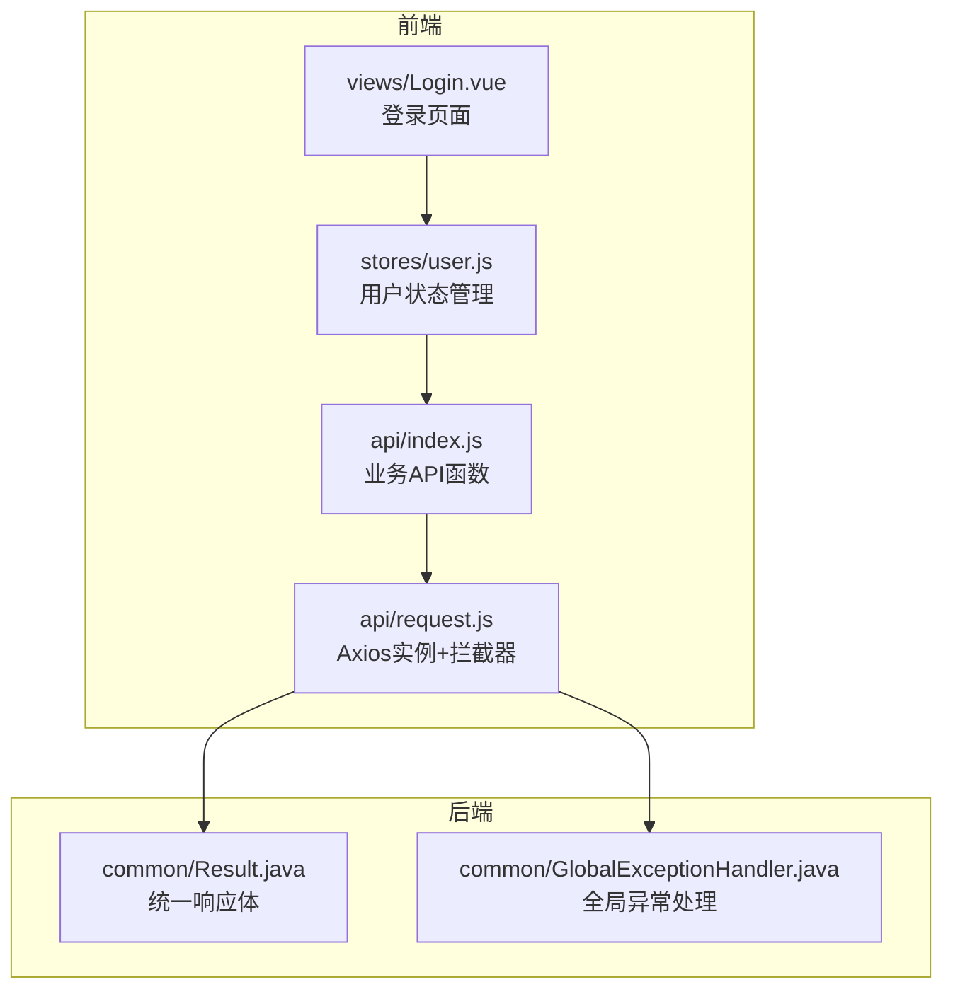
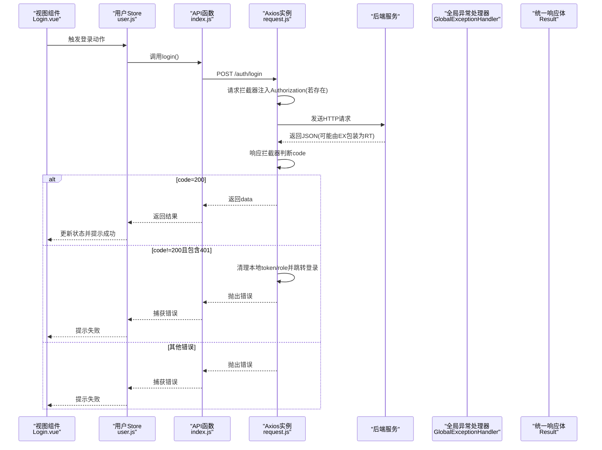
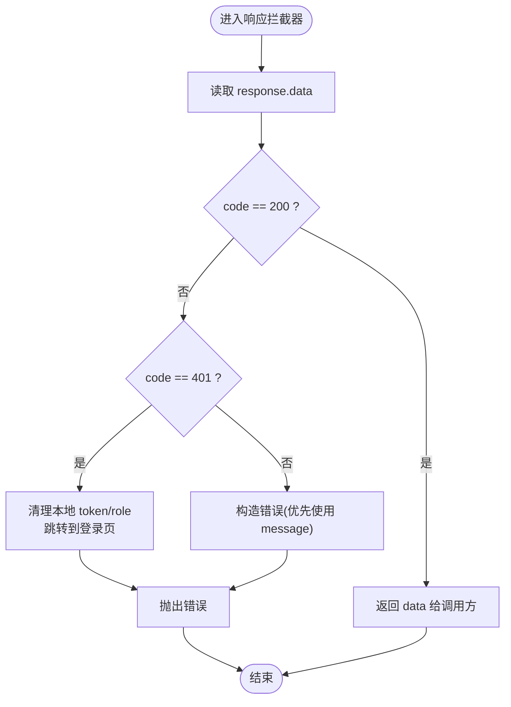
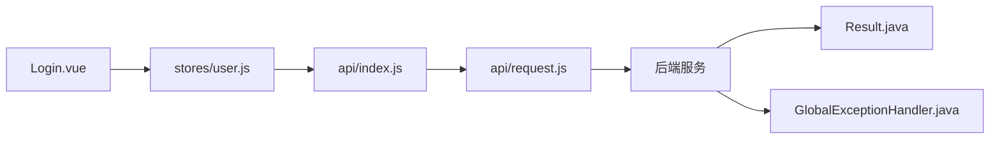

# API请求层封装

<cite>
**本文引用的文件**
- [frontend/src/api/request.js](file://frontend/src/api/request.js)
- [frontend/src/api/index.js](file://frontend/src/api/index.js)
- [API.md](file://API.md)
- [backend/src/main/java/com/xx/platform/common/Result.java](file://backend/src/main/java/com/xx/platform/common/Result.java)
- [backend/src/main/java/com/xx/platform/common/GlobalExceptionHandler.java](file://backend/src/main/java/com/xx/platform/common/GlobalExceptionHandler.java)
- [frontend/src/stores/user.js](file://frontend/src/stores/user.js)
- [frontend/src/views/Login.vue](file://frontend/src/views/Login.vue)
</cite>

## 目录
1. [简介](#简介)
2. [项目结构](#项目结构)
3. [核心组件](#核心组件)
4. [架构总览](#架构总览)
5. [详细组件分析](#详细组件分析)
6. [依赖关系分析](#依赖关系分析)
7. [性能与高级特性](#性能与高级特性)
8. [最佳实践](#最佳实践)
9. [故障排查指南](#故障排查指南)
10. [结论](#结论)

## 简介
本文件聚焦于JZPlatform门户系统的前端API请求层封装，围绕Axios实例配置、拦截器机制（Token注入、统一响应格式转换、错误处理）、接口模块化组织、URL路径管理、参数封装策略展开。同时补充后端统一响应体约定与全局异常处理对前端的联动影响，并给出重试、超时、缓存、监控等高级特性的落地建议与调试排障方法。

## 项目结构
前端API相关代码位于src/api目录：
- request.js：创建Axios实例，集中配置基础地址、超时，以及请求/响应拦截器
- index.js：按业务域导出具体API函数，统一调用request实例发起HTTP请求

图表来源
- [frontend/src/api/request.js:1-45](file://frontend/src/api/request.js#L1-L45)
- [frontend/src/api/index.js:1-137](file://frontend/src/api/index.js#L1-L137)
- [backend/src/main/java/com/xx/platform/common/Result.java:1-52](file://backend/src/main/java/com/xx/platform/common/Result.java#L1-L52)
- [backend/src/main/java/com/xx/platform/common/GlobalExceptionHandler.java:1-29](file://backend/src/main/java/com/xx/platform/common/GlobalExceptionHandler.java#L1-L29)

章节来源
- [frontend/src/api/request.js:1-45](file://frontend/src/api/request.js#L1-L45)
- [frontend/src/api/index.js:1-137](file://frontend/src/api/index.js#L1-L137)

## 核心组件
- Axios实例与拦截器
  - 基础地址与超时：通过axios.create设置baseURL与timeout，所有请求自动继承
  - 请求拦截器：从本地存储读取token并注入Authorization头；无token则不附加
  - 响应拦截器：根据后端统一code进行分支处理；非成功码时抛出错误；401时清理本地状态并重定向到登录页
- 业务API模块
  - 以index.js为入口，按认证、用户、应用、分类、宣贯、配置、统计等域组织函数
  - 每个函数对应一个RESTful接口，使用统一的request实例发起请求
- 后端统一响应体
  - Result类定义code/message/data三字段，前端据此做统一解析与错误分发

章节来源
- [frontend/src/api/request.js:1-45](file://frontend/src/api/request.js#L1-L45)
- [frontend/src/api/index.js:1-137](file://frontend/src/api/index.js#L1-L137)
- [backend/src/main/java/com/xx/platform/common/Result.java:1-52](file://backend/src/main/java/com/xx/platform/common/Result.java#L1-L52)

## 架构总览
下图展示了从页面到后端的全链路流程，包括Token注入、统一响应转换与401跳转逻辑。

图表来源
- [frontend/src/views/Login.vue:51-66](file://frontend/src/views/Login.vue#L51-L66)
- [frontend/src/stores/user.js:22-31](file://frontend/src/stores/user.js#L22-L31)
- [frontend/src/api/index.js:4-6](file://frontend/src/api/index.js#L4-L6)
- [frontend/src/api/request.js:13-42](file://frontend/src/api/request.js#L13-L42)
- [backend/src/main/java/com/xx/platform/common/GlobalExceptionHandler.java:16-28](file://backend/src/main/java/com/xx/platform/common/GlobalExceptionHandler.java#L16-L28)
- [backend/src/main/java/com/xx/platform/common/Result.java:24-51](file://backend/src/main/java/com/xx/platform/common/Result.java#L24-L51)

## 详细组件分析

### Axios实例与拦截器机制
- 实例化与默认配置
  - baseURL指向/api，配合开发环境代理转发至后端
  - timeout用于控制整体请求超时时间
- 请求拦截器
  - 从本地存储读取token，若有则写入Authorization头
  - 未携带token的请求不会附带认证信息
- 响应拦截器
  - 读取response.data，依据code分支：
    - 成功：直接返回data供上层消费
    - 业务失败：构造Error并拒绝Promise，message优先取后端返回
    - 未授权(code=401)：清除本地token与角色，重定向到登录页
  - 网络或框架级错误：透传错误对象给调用方

图表来源
- [frontend/src/api/request.js:25-42](file://frontend/src/api/request.js#L25-L42)

章节来源
- [frontend/src/api/request.js:1-45](file://frontend/src/api/request.js#L1-L45)

### 接口模块化与URL路径管理
- 模块划分
  - 认证：login/logout/getUserInfo
  - 用户：getUsers/addUser/updateUser/deleteUser
  - 应用：getApps/getAppDetail/addApp/updateApp/deleteApp/clickApp
  - 分类：getCategories/addCategory/updateCategory/deleteCategory
  - 宣贯：getShowcaseItems/getShowcaseDetail/addShowcaseItem/updateShowcaseItem/deleteShowcaseItem
  - 配置：getConfigs/updateConfigs/uploadFile
  - 统计：getStatsOverview
- URL组织原则
  - 资源型命名：/users、/apps、/categories、/showcase、/config、/stats
  - 子资源与动作：/apps/{id}/click
  - 查询参数：列表接口通过params传递分页、筛选、排序等条件
- 上传接口
  - 使用FormData并显式设置Content-Type为multipart/form-data

章节来源
- [frontend/src/api/index.js:1-137](file://frontend/src/api/index.js#L1-L137)
- [API.md:1-197](file://API.md#L1-L197)

### 请求参数封装与数据契约
- 列表查询
  - 通过{ params }传入分页与过滤条件，如page、size、categoryId、keyword、sortField、sortOrder
- 表单提交
  - JSON提交：普通对象作为data
  - 文件上传：使用FormData，并指定Content-Type
- 统一响应体
  - 后端Result约定code/message/data，前端据此在响应拦截器中完成统一处理

章节来源
- [frontend/src/api/index.js:18-21](file://frontend/src/api/index.js#L18-L21)
- [frontend/src/api/index.js:124-131](file://frontend/src/api/index.js#L124-L131)
- [backend/src/main/java/com/xx/platform/common/Result.java:10-51](file://backend/src/main/java/com/xx/platform/common/Result.java#L10-L51)

### 错误处理策略
- 业务错误
  - 当后端返回code≠200时，响应拦截器将构造错误并拒绝Promise，调用方可在业务层捕获并展示message
- 未授权
  - code=401时，自动清理本地认证信息并跳转登录页，避免后续无效请求
- 全局异常
  - 后端GlobalExceptionHandler将未捕获异常包装为Result.error，确保前端能收到一致的错误结构

章节来源
- [frontend/src/api/request.js:25-42](file://frontend/src/api/request.js#L25-L42)
- [backend/src/main/java/com/xx/platform/common/GlobalExceptionHandler.java:16-28](file://backend/src/main/java/com/xx/platform/common/GlobalExceptionHandler.java#L16-L28)

### 重试机制与幂等性建议
- 现状
  - 当前未实现自动重试
- 建议方案
  - 针对GET等幂等接口，可在响应拦截器中对特定错误码（如网络错误、5xx）进行有限次重试，并加入退避策略
  - 非幂等接口（POST/PUT/DELETE）不建议自动重试，应在业务层提供“重新提交”能力
  - 可结合请求去重与队列，避免重复请求造成副作用

[本节为通用建议，不涉及具体源码]

### 超时配置与取消
- 现状
  - 已设置全局timeout，防止长时间挂起
- 建议方案
  - 对长耗时操作（如大文件上传）单独配置更长超时
  - 结合AbortController实现路由切换或组件卸载时的请求取消，减少无用开销

[本节为通用建议，不涉及具体源码]

## 依赖关系分析
- 前端内部依赖
  - stores/user.js依赖api/index.js中的认证接口
  - views/Login.vue依赖stores/user.js的登录动作
  - api/index.js依赖api/request.js提供的Axios实例
- 前后端契约
  - 前端基于后端Result的统一结构进行解析与错误分发
  - 全局异常处理器保证异常场景下的响应一致性

图表来源
- [frontend/src/views/Login.vue:51-66](file://frontend/src/views/Login.vue#L51-L66)
- [frontend/src/stores/user.js:22-31](file://frontend/src/stores/user.js#L22-L31)
- [frontend/src/api/index.js:1-6](file://frontend/src/api/index.js#L1-L6)
- [frontend/src/api/request.js:1-10](file://frontend/src/api/request.js#L1-L10)
- [backend/src/main/java/com/xx/platform/common/Result.java:10-51](file://backend/src/main/java/com/xx/platform/common/Result.java#L10-L51)
- [backend/src/main/java/com/xx/platform/common/GlobalExceptionHandler.java:16-28](file://backend/src/main/java/com/xx/platform/common/GlobalExceptionHandler.java#L16-L28)

章节来源
- [frontend/src/stores/user.js:1-57](file://frontend/src/stores/user.js#L1-L57)
- [frontend/src/views/Login.vue:1-103](file://frontend/src/views/Login.vue#L1-L103)
- [frontend/src/api/index.js:1-137](file://frontend/src/api/index.js#L1-L137)
- [frontend/src/api/request.js:1-45](file://frontend/src/api/request.js#L1-L45)
- [backend/src/main/java/com/xx/platform/common/Result.java:1-52](file://backend/src/main/java/com/xx/platform/common/Result.java#L1-L52)
- [backend/src/main/java/com/xx/platform/common/GlobalExceptionHandler.java:1-29](file://backend/src/main/java/com/xx/platform/common/GlobalExceptionHandler.java#L1-L29)

## 性能与高级特性
- 缓存策略
  - 对静态或低频变更的数据（如分类列表、平台配置）采用内存缓存或轻量持久化，减少重复请求
  - 结合版本号或Etag进行失效控制
- 请求合并与防抖
  - 高频触发的搜索/筛选可使用防抖；相同请求在短时间内合并，降低服务器压力
- 并发控制
  - 对批量操作限制并发数，避免瞬时峰值导致雪崩
- 监控与埋点
  - 在请求拦截器中记录开始/结束时间、URL、方法、状态码、耗时，便于性能分析与问题定位
- 版本管理
  - 建议在URL中引入版本前缀（如/v1），便于平滑升级与兼容

[本节为通用建议，不涉及具体源码]

## 最佳实践
- Token管理
  - 登录后将token与角色存入本地存储，并在请求拦截器中自动注入
  - 401时清理本地状态并跳转登录页，避免脏状态残留
- 接口设计
  - 遵循REST风格，资源名词复数形式，动词用HTTP方法表达
  - 列表接口统一分页参数，详情接口使用路径参数
- 错误处理
  - 业务错误通过message提示用户；网络错误统一兜底提示
  - 关键操作失败提供重试入口
- 上传与下载
  - 上传使用FormData并正确设置Content-Type；下载大文件考虑分片与断点续传
- 安全
  - 敏感信息不落盘；跨域与CORS按需配置；对输入输出进行校验与转义

[本节为通用建议，不涉及具体源码]

## 故障排查指南
- 常见问题
  - 401未授权：检查是否已登录、token是否正确注入、后端鉴权是否放行
  - 跨域错误：确认开发代理配置与后端CORS策略
  - 上传失败：确认Content-Type是否为multipart/form-data，字段名是否与后端一致
  - 超时：增大timeout或优化后端响应；必要时拆分请求
- 调试技巧
  - 浏览器Network面板查看请求头、响应体与耗时
  - 在请求/响应拦截器中打印日志，快速定位问题
  - 使用Mock或本地代理模拟异常场景，验证错误处理分支
- 定位步骤
  - 先确认前端拦截器是否执行（是否注入token、是否统一转换响应）
  - 再核对后端Result结构与异常处理器是否生效
  - 最后检查路由、权限与数据库状态

章节来源
- [frontend/src/api/request.js:13-42](file://frontend/src/api/request.js#L13-L42)
- [backend/src/main/java/com/xx/platform/common/GlobalExceptionHandler.java:16-28](file://backend/src/main/java/com/xx/platform/common/GlobalExceptionHandler.java#L16-L28)

## 结论
该API请求层封装通过Axios实例与拦截器实现了Token自动注入、统一响应体解析与401自动登出等核心能力；业务API按领域模块化组织，URL与参数规范清晰。结合后端的统一响应体与全局异常处理，形成了稳定可靠的前后端协作契约。在此基础上，可按需扩展重试、缓存、监控与版本管理等高级特性，进一步提升系统的健壮性与可维护性。