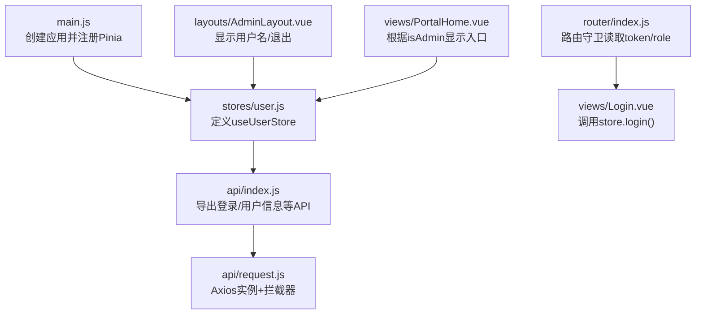
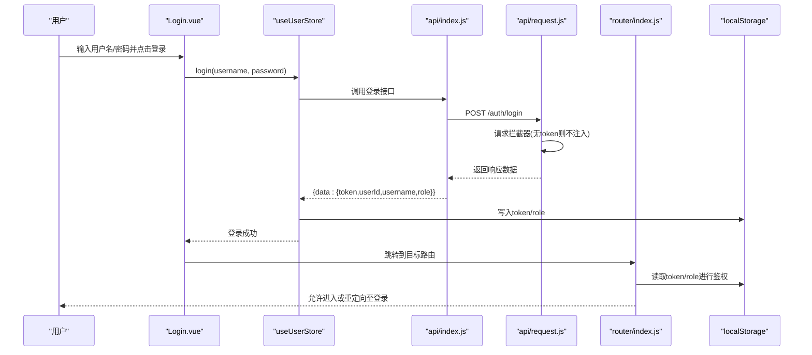
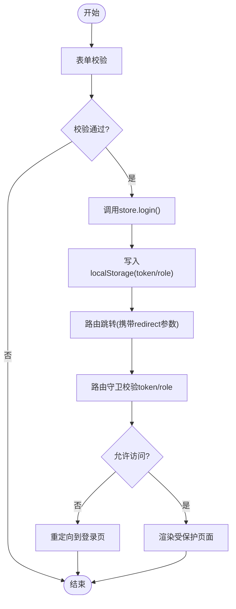
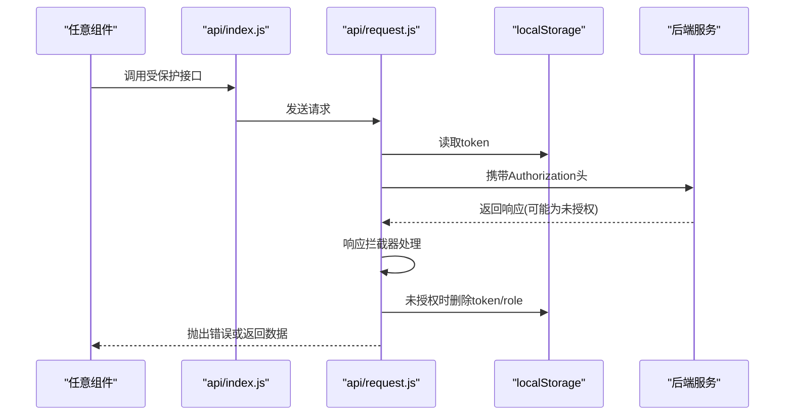
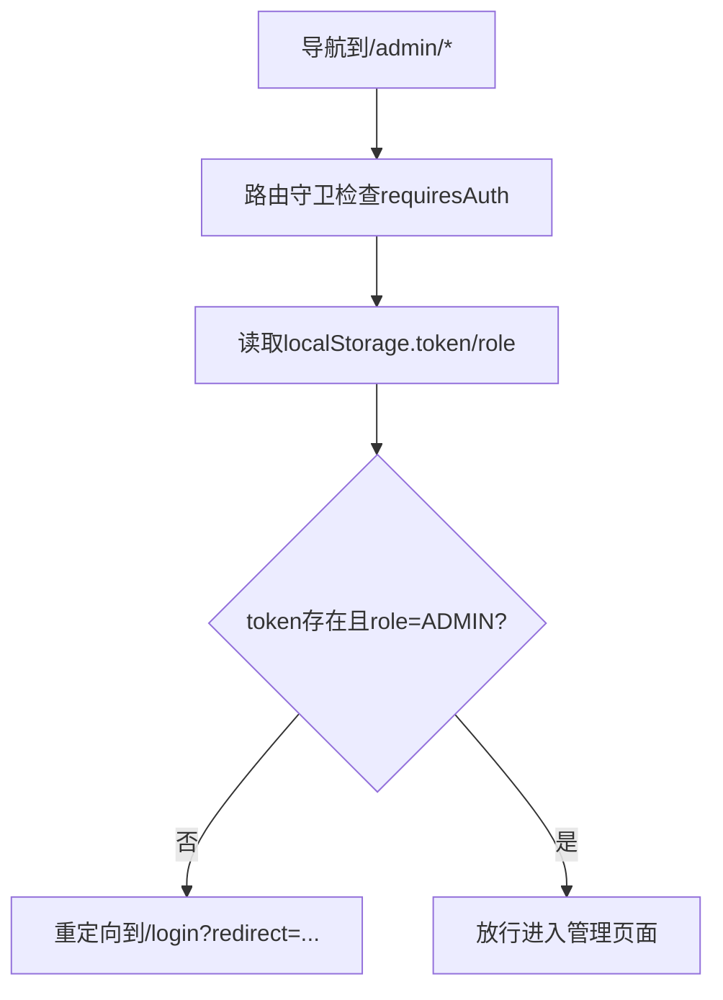
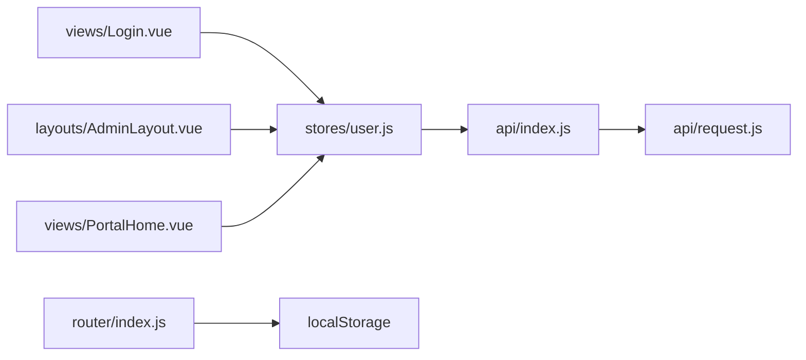

# Pinia状态管理

<cite>
**本文引用的文件**   
- [frontend/src/stores/user.js](file://frontend/src/stores/user.js)
- [frontend/src/api/index.js](file://frontend/src/api/index.js)
- [frontend/src/api/request.js](file://frontend/src/api/request.js)
- [frontend/src/router/index.js](file://frontend/src/router/index.js)
- [frontend/src/views/Login.vue](file://frontend/src/views/Login.vue)
- [frontend/src/layouts/AdminLayout.vue](file://frontend/src/layouts/AdminLayout.vue)
- [frontend/src/views/PortalHome.vue](file://frontend/src/views/PortalHome.vue)
- [frontend/src/main.js](file://frontend/src/main.js)
</cite>

## 目录
1. [简介](#简介)
2. [项目结构](#项目结构)
3. [核心组件](#核心组件)
4. [架构总览](#架构总览)
5. [详细组件分析](#详细组件分析)
6. [依赖关系分析](#依赖关系分析)
7. [性能考虑](#性能考虑)
8. [故障排查指南](#故障排查指南)
9. [结论](#结论)
10. [附录](#附录)

## 简介
本文件聚焦于JZPlatform门户系统的前端Pinia状态管理机制，围绕用户状态管理的实现进行深入说明。内容涵盖user store的state结构设计、getters计算属性、actions异步操作；登录状态管理、用户信息获取、权限控制等核心功能；localStorage持久化策略与Token管理机制；用户角色判断逻辑；以及与路由守卫、页面组件的集成方式。同时提供状态共享的最佳实践（模块化组织、命名规范、错误处理策略）和性能优化建议。

## 项目结构
前端采用Vue 3 + Pinia + Vue Router + Element Plus技术栈。用户状态相关代码主要分布在以下位置：
- 状态定义与业务动作：stores/user.js
- API封装与请求拦截：api/index.js、api/request.js
- 路由与全局鉴权：router/index.js
- 登录页与管理布局：views/Login.vue、layouts/AdminLayout.vue
- 首页展示与权限按钮：views/PortalHome.vue
- 应用初始化与Pinia注册：main.js



图表来源
- [frontend/src/main.js:1-22](file://frontend/src/main.js#L1-L22)
- [frontend/src/stores/user.js:1-57](file://frontend/src/stores/user.js#L1-L57)
- [frontend/src/api/index.js:1-137](file://frontend/src/api/index.js#L1-L137)
- [frontend/src/api/request.js:1-45](file://frontend/src/api/request.js#L1-L45)
- [frontend/src/router/index.js:1-99](file://frontend/src/router/index.js#L1-L99)
- [frontend/src/views/Login.vue:1-103](file://frontend/src/views/Login.vue#L1-L103)
- [frontend/src/layouts/AdminLayout.vue:1-136](file://frontend/src/layouts/AdminLayout.vue#L1-L136)
- [frontend/src/views/PortalHome.vue:1-287](file://frontend/src/views/PortalHome.vue#L1-L287)

章节来源
- [frontend/src/main.js:1-22](file://frontend/src/main.js#L1-L22)
- [frontend/src/stores/user.js:1-57](file://frontend/src/stores/user.js#L1-L57)
- [frontend/src/api/index.js:1-137](file://frontend/src/api/index.js#L1-L137)
- [frontend/src/api/request.js:1-45](file://frontend/src/api/request.js#L1-L45)
- [frontend/src/router/index.js:1-99](file://frontend/src/router/index.js#L1-L99)
- [frontend/src/views/Login.vue:1-103](file://frontend/src/views/Login.vue#L1-L103)
- [frontend/src/layouts/AdminLayout.vue:1-136](file://frontend/src/layouts/AdminLayout.vue#L1-L136)
- [frontend/src/views/PortalHome.vue:1-287](file://frontend/src/views/PortalHome.vue#L1-L287)

## 核心组件
- user store（Pinia）：集中管理用户认证态与基本信息，提供登录、登出、拉取用户信息等方法，并通过getters暴露派生状态。
- API层：统一封装HTTP请求，包含请求头自动注入Token、响应码统一处理与未授权跳转。
- 路由守卫：在访问需要认证的页面时校验本地存储中的token与角色，必要时重定向到登录页。
- 视图组件：登录页触发登录流程；管理布局展示当前用户名并提供退出；首页根据管理员身份动态渲染管理入口。

章节来源
- [frontend/src/stores/user.js:1-57](file://frontend/src/stores/user.js#L1-L57)
- [frontend/src/api/index.js:1-137](file://frontend/src/api/index.js#L1-L137)
- [frontend/src/api/request.js:1-45](file://frontend/src/api/request.js#L1-L45)
- [frontend/src/router/index.js:1-99](file://frontend/src/router/index.js#L1-L99)
- [frontend/src/views/Login.vue:1-103](file://frontend/src/views/Login.vue#L1-L103)
- [frontend/src/layouts/AdminLayout.vue:1-136](file://frontend/src/layouts/AdminLayout.vue#L1-L136)
- [frontend/src/views/PortalHome.vue:1-287](file://frontend/src/views/PortalHome.vue#L1-L287)

## 架构总览
下图展示了从用户交互到后端鉴权的完整链路，包括Pinia状态更新、Axios拦截器注入Token、路由守卫校验以及页面渲染。



图表来源
- [frontend/src/views/Login.vue:1-103](file://frontend/src/views/Login.vue#L1-L103)
- [frontend/src/stores/user.js:1-57](file://frontend/src/stores/user.js#L1-L57)
- [frontend/src/api/index.js:1-137](file://frontend/src/api/index.js#L1-L137)
- [frontend/src/api/request.js:1-45](file://frontend/src/api/request.js#L1-L45)
- [frontend/src/router/index.js:1-99](file://frontend/src/router/index.js#L1-L99)

## 详细组件分析

### user store（Pinia）
- state设计
  - token：字符串，初始值来源于localStorage，用于标识登录态。
  - userId、username、role：用户基础信息与角色，用于界面展示与权限判断。
- getters
  - isLoggedIn：基于token存在性判断是否已登录。
  - isAdmin：基于role是否为ADMIN进行管理员判定。
- actions
  - login：调用登录API，成功后将token与用户信息写入state与localStorage，并返回响应。
  - logout：清空state与localStorage中的认证相关字段。
  - fetchUserInfo：若存在token则拉取最新用户信息，失败时执行logout以清理状态。

```mermaid
classDiagram
class useUserStore {
+state : { token, userId, username, role }
+getters : { isLoggedIn, isAdmin }
+actions : { login(), logout(), fetchUserInfo() }
}
class ApiIndex {
+login(data)
+getUserInfo()
}
class AxiosRequest {
+interceptors.request
+interceptors.response
}
useUserStore --> ApiIndex : "调用"
ApiIndex --> AxiosRequest : "封装请求"
```

图表来源
- [frontend/src/stores/user.js:1-57](file://frontend/src/stores/user.js#L1-L57)
- [frontend/src/api/index.js:1-137](file://frontend/src/api/index.js#L1-L137)
- [frontend/src/api/request.js:1-45](file://frontend/src/api/request.js#L1-L45)

章节来源
- [frontend/src/stores/user.js:1-57](file://frontend/src/stores/user.js#L1-L57)

### 登录流程与状态同步
- 登录页触发store.login后，store将token与用户信息持久化到localStorage。
- 路由守卫在导航前检查localStorage中的token与role，决定放行或重定向。
- 管理布局中通过store.username展示当前用户，并提供退出按钮调用store.logout。



图表来源
- [frontend/src/views/Login.vue:1-103](file://frontend/src/views/Login.vue#L1-L103)
- [frontend/src/stores/user.js:1-57](file://frontend/src/stores/user.js#L1-L57)
- [frontend/src/router/index.js:1-99](file://frontend/src/router/index.js#L1-L99)

章节来源
- [frontend/src/views/Login.vue:1-103](file://frontend/src/views/Login.vue#L1-L103)
- [frontend/src/stores/user.js:1-57](file://frontend/src/stores/user.js#L1-L57)
- [frontend/src/router/index.js:1-99](file://frontend/src/router/index.js#L1-L99)

### Token机制与请求拦截
- 请求拦截器：每次发起请求前从localStorage读取token并注入Authorization请求头。
- 响应拦截器：当服务端返回未授权码时，清除本地token与role并重定向至登录页。
- 该机制确保所有受保护的API调用均携带有效凭证，并在失效时统一处理。



图表来源
- [frontend/src/api/request.js:1-45](file://frontend/src/api/request.js#L1-L45)
- [frontend/src/api/index.js:1-137](file://frontend/src/api/index.js#L1-L137)

章节来源
- [frontend/src/api/request.js:1-45](file://frontend/src/api/request.js#L1-L45)
- [frontend/src/api/index.js:1-137](file://frontend/src/api/index.js#L1-L137)

### 权限控制与角色判断
- 路由级权限：对需要登录的路由，守卫会检查localStorage中的token与role，仅允许ADMIN角色进入管理后台。
- 视图级权限：首页根据store.isAdmin决定是否显示“管理后台”入口。
- 布局级权限：管理布局顶部展示当前用户名，并提供退出操作。



图表来源
- [frontend/src/router/index.js:1-99](file://frontend/src/router/index.js#L1-L99)
- [frontend/src/views/PortalHome.vue:1-287](file://frontend/src/views/PortalHome.vue#L1-287)
- [frontend/src/layouts/AdminLayout.vue:1-136](file://frontend/src/layouts/AdminLayout.vue#L1-L136)

章节来源
- [frontend/src/router/index.js:1-99](file://frontend/src/router/index.js#L1-L99)
- [frontend/src/views/PortalHome.vue:1-287](file://frontend/src/views/PortalHome.vue#L1-287)
- [frontend/src/layouts/AdminLayout.vue:1-136](file://frontend/src/layouts/AdminLayout.vue#L1-L136)

### 用户信息获取与刷新
- store.fetchUserInfo会在有token的情况下主动拉取用户信息，并将结果同步到state。
- 当拉取失败（例如token过期），store内部会执行logout清理状态，避免脏数据残留。
- 建议在应用启动或进入受保护页面时调用fetchUserInfo以确保状态最新。

章节来源
- [frontend/src/stores/user.js:1-57](file://frontend/src/stores/user.js#L1-L57)

## 依赖关系分析
- stores/user.js依赖api/index.js提供的登录与用户信息接口。
- api/index.js依赖api/request.js的Axios实例与拦截器。
- router/index.js在导航守卫中直接读取localStorage进行鉴权，与store的持久化策略保持一致。
- 视图组件通过useUserStore访问状态与方法，形成松耦合的状态共享。



图表来源
- [frontend/src/stores/user.js:1-57](file://frontend/src/stores/user.js#L1-L57)
- [frontend/src/api/index.js:1-137](file://frontend/src/api/index.js#L1-L137)
- [frontend/src/api/request.js:1-45](file://frontend/src/api/request.js#L1-L45)
- [frontend/src/router/index.js:1-99](file://frontend/src/router/index.js#L1-L99)
- [frontend/src/views/Login.vue:1-103](file://frontend/src/views/Login.vue#L1-L103)
- [frontend/src/layouts/AdminLayout.vue:1-136](file://frontend/src/layouts/AdminLayout.vue#L1-L136)
- [frontend/src/views/PortalHome.vue:1-287](file://frontend/src/views/PortalHome.vue#L1-287)

章节来源
- [frontend/src/stores/user.js:1-57](file://frontend/src/stores/user.js#L1-L57)
- [frontend/src/api/index.js:1-137](file://frontend/src/api/index.js#L1-L137)
- [frontend/src/api/request.js:1-45](file://frontend/src/api/request.js#L1-L45)
- [frontend/src/router/index.js:1-99](file://frontend/src/router/index.js#L1-L99)
- [frontend/src/views/Login.vue:1-103](file://frontend/src/views/Login.vue#L1-L103)
- [frontend/src/layouts/AdminLayout.vue:1-136](file://frontend/src/layouts/AdminLayout.vue#L1-L136)
- [frontend/src/views/PortalHome.vue:1-287](file://frontend/src/views/PortalHome.vue#L1-287)

## 性能考虑
- 减少不必要的重复请求：在应用启动或进入受保护页面时调用fetchUserInfo一次即可，避免频繁刷新用户信息。
- 利用getters进行派生状态计算：isLoggedIn与isAdmin均为轻量计算，适合在模板中直接使用，无需额外缓存。
- 合理设置请求超时与重试：在request.js中配置合理的timeout，并对网络异常进行友好提示与重试策略（可按需扩展）。
- 路由懒加载：当前路由已使用动态导入，有助于减小首屏体积。
- 避免在高频渲染路径中调用复杂逻辑：如需更复杂的权限判断，可抽象为独立的工具函数或组合式函数，保持store简洁。

[本节为通用性能建议，不直接分析具体文件]

## 故障排查指南
- 登录后仍被重定向到登录页
  - 检查store.login是否正确写入localStorage的token与role。
  - 确认路由守卫读取的键名与store写入一致。
- 页面刷新后丢失登录态
  - 确认store.state初始化时从localStorage读取token与role。
  - 检查是否有其他地方清除了localStorage。
- 接口返回未授权导致循环跳转
  - 检查响应拦截器在未授权时的处理逻辑，确保只清理认证相关字段并跳转一次。
- 管理入口未显示
  - 检查store.isAdmin的计算是否与后端返回的role一致。
  - 确认首页模板中条件渲染逻辑正确。

章节来源
- [frontend/src/stores/user.js:1-57](file://frontend/src/stores/user.js#L1-L57)
- [frontend/src/api/request.js:1-45](file://frontend/src/api/request.js#L1-L45)
- [frontend/src/router/index.js:1-99](file://frontend/src/router/index.js#L1-L99)
- [frontend/src/views/PortalHome.vue:1-287](file://frontend/src/views/PortalHome.vue#L1-287)

## 结论
本项目通过Pinia集中管理用户状态，结合Axios拦截器与路由守卫实现了完整的认证与权限控制闭环。store的state设计清晰，getters提供便捷派生状态，actions覆盖登录、登出与信息刷新等关键流程。配合localStorage持久化策略，系统在用户体验与安全性之间取得良好平衡。后续可在错误处理、Token刷新与多角色扩展方面进一步优化。

[本节为总结性内容，不直接分析具体文件]

## 附录

### 最佳实践清单
- 模块化组织
  - 按领域拆分store（如用户、权限、主题等），每个store职责单一。
  - API层与状态层解耦，store仅负责状态变更与业务流程编排。
- 命名规范
  - store名称使用名词短语（如user、permission）。
  - action使用动词短语（如login、logout、fetchUserInfo）。
  - getter使用形容词或布尔描述（如isLoggedIn、isAdmin）。
- 错误处理策略
  - 在action中捕获异常并进行用户提示或降级处理。
  - 在响应拦截器中统一处理未授权与网络错误，避免在各组件重复处理。
- 状态共享
  - 通过useXxxStore在任意组件中获取同一实例，保证状态一致性。
  - 避免在多个地方直接读写localStorage，统一由store维护。
- 与其他组件集成
  - 路由守卫与store持久化策略保持一致，避免状态不一致。
  - 在布局或顶层组件中初始化必要状态（如拉取用户信息），减少子组件负担。

[本节为通用指导，不直接分析具体文件]