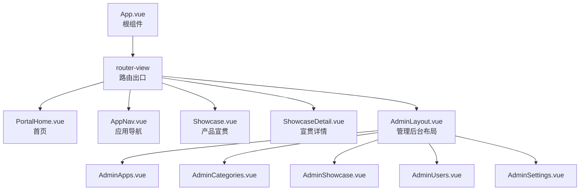
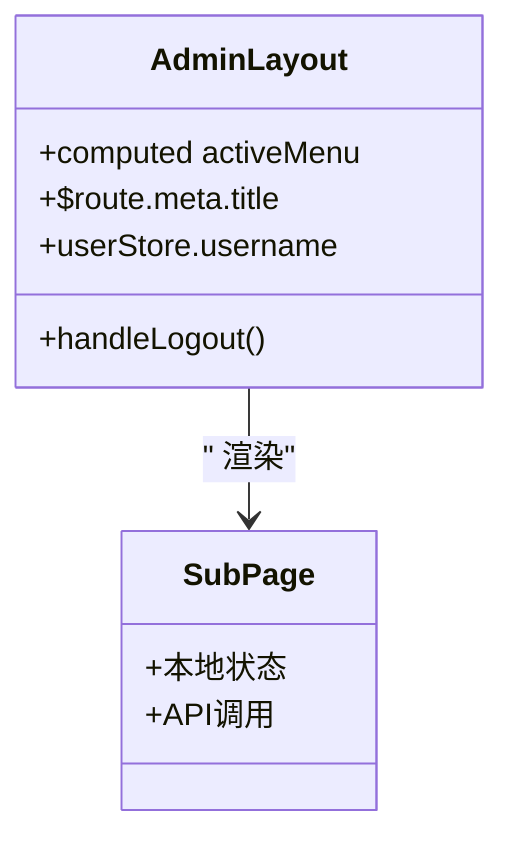
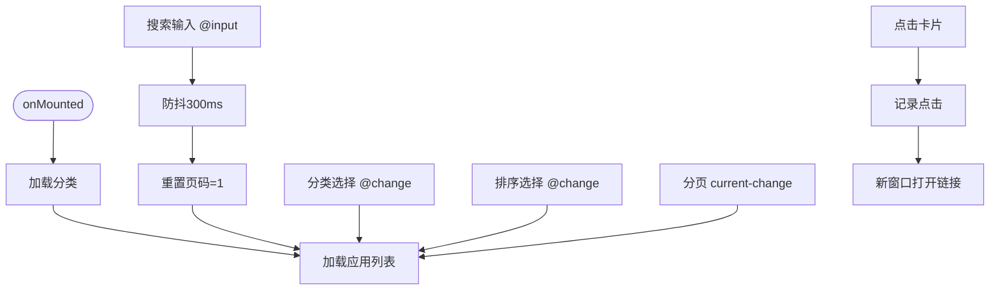
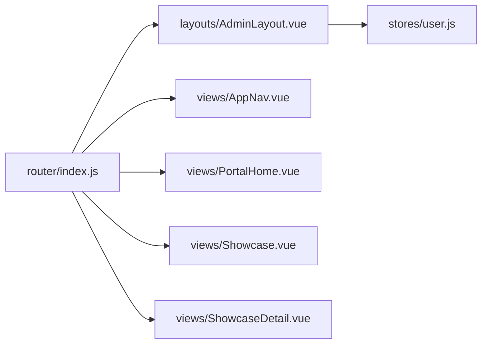

# 父子组件通信（Props和Events）

<cite>
**本文引用的文件**   
- [App.vue](file://frontend/src/App.vue)
- [AdminLayout.vue](file://frontend/src/layouts/AdminLayout.vue)
- [AppNav.vue](file://frontend/src/views/AppNav.vue)
- [PortalHome.vue](file://frontend/src/views/PortalHome.vue)
- [Showcase.vue](file://frontend/src/views/Showcase.vue)
- [ShowcaseDetail.vue](file://frontend/src/views/ShowcaseDetail.vue)
- [index.js](file://frontend/src/router/index.js)
- [user.js](file://frontend/src/stores/user.js)
</cite>

## 目录
1. [引言](#引言)
2. [项目结构](#项目结构)
3. [核心组件与通信概览](#核心组件与通信概览)
4. [架构总览](#架构总览)
5. [详细组件分析](#详细组件分析)
6. [依赖关系分析](#依赖关系分析)
7. [性能考虑](#性能考虑)
8. [故障排查指南](#故障排查指南)
9. [结论](#结论)
10. [附录：常见父子通信模式与最佳实践](#附录常见父子通信模式与最佳实践)

## 引言
本文件聚焦于 JZPlatform 门户系统前端在 Vue3 中的父子组件通信机制，围绕“props 向下传递数据”和“events 向上传递数据”两大模式展开。结合布局组件 AdminLayout 与页面级组件 AppNav、PortalHome、Showcase 等实际代码，说明类型定义、默认值、验证规则、事件触发与处理流程，并给出表单数据传递、状态同步、回调函数调用等典型场景的实践建议与优化策略。

## 项目结构
当前前端采用 Vue3 + Vue Router + Pinia + Element Plus 的组合。路由将根组件 App.vue 作为外壳，通过 router-view 渲染具体视图；管理后台使用 AdminLayout 作为父容器，承载多个子页面。

图表来源
- [App.vue:1-7](file://frontend/src/App.vue#L1-L7)
- [index.js:1-55](file://frontend/src/router/index.js#L1-L55)
- [AdminLayout.vue:1-56](file://frontend/src/layouts/AdminLayout.vue#L1-L56)

章节来源
- [App.vue:1-7](file://frontend/src/App.vue#L1-L7)
- [index.js:1-55](file://frontend/src/router/index.js#L1-L55)

## 核心组件与通信概览
- 根组件 App.vue 仅包含一个路由出口，不直接参与父子通信逻辑。
- 管理后台布局 AdminLayout.vue 作为父容器，通过路由元信息 meta.title 驱动头部标题显示，并通过 Pinia userStore 获取用户信息，实现“父读全局状态”的展示。
- 页面级组件如 AppNav.vue、PortalHome.vue、Showcase.vue 主要承担自身业务数据加载与交互，未在当前仓库中显式声明 props 或自定义 events，更多体现为“自包含页面”。
- 子页面（如 AdminApps.vue 等）由 AdminLayout 通过 <router-view /> 注入，属于“路由级父子关系”，而非模板内嵌父子关系。

章节来源
- [App.vue:1-7](file://frontend/src/App.vue#L1-L7)
- [AdminLayout.vue:1-56](file://frontend/src/layouts/AdminLayout.vue#L1-L56)
- [AppNav.vue:1-109](file://frontend/src/views/AppNav.vue#L1-L109)
- [PortalHome.vue:1-91](file://frontend/src/views/PortalHome.vue#L1-L91)
- [Showcase.vue:1-43](file://frontend/src/views/Showcase.vue#L1-L43)

## 架构总览
下图展示了路由与布局之间的父子关系，以及关键数据流向。

```mermaid
sequenceDiagram
participant Root as "App.vue"
participant Router as "vue-router"
participant Layout as "AdminLayout.vue"
participant Child as "子页面(路由children)"
participant Store as "Pinia userStore"
Root->>Router : 渲染 router-view
Router->>Layout : 匹配 /admin/* 路由
Layout->>Layout : computed 读取 route.path 计算 activeMenu
Layout->>Store : 读取 userStore.username
Layout-->>Child : <router-view /> 渲染子页面
```

图表来源
- [index.js:38-55](file://frontend/src/router/index.js#L38-L55)
- [AdminLayout.vue:60-74](file://frontend/src/layouts/AdminLayout.vue#L60-L74)
- [user.js](file://frontend/src/stores/user.js)

## 详细组件分析

### 布局组件 AdminLayout 与子页面的“路由级父子”通信
- 父组件职责
  - 侧边栏菜单高亮：基于 computed(activeMenu) 绑定到 el-menu 的 default-active，数据来源为 route.path。
  - 顶部标题：直接使用 $route.meta.title 展示。
  - 用户信息：从 Pinia store 中读取 userStore.username。
  - 退出登录：调用 userStore.logout() 后跳转登录页。
- 子页面职责
  - 通过 <router-view /> 自动挂载，无需显式 props/events。
  - 各自维护本地状态（列表、分页、弹窗等），并在需要时调用 API。

图表来源
- [AdminLayout.vue:1-56](file://frontend/src/layouts/AdminLayout.vue#L1-L56)
- [AdminLayout.vue:60-74](file://frontend/src/layouts/AdminLayout.vue#L60-L74)

章节来源
- [AdminLayout.vue:1-56](file://frontend/src/layouts/AdminLayout.vue#L1-L56)
- [AdminLayout.vue:60-74](file://frontend/src/layouts/AdminLayout.vue#L60-L74)

### 页面组件 AppNav 的数据流与交互
- 数据加载
  - 初始化时加载分类与应用列表，支持关键词搜索、分类筛选、排序、分页。
  - 搜索输入使用防抖定时器，避免频繁请求。
- 交互行为
  - 点击应用卡片记录点击量并在新窗口打开目标链接。
- 父子通信现状
  - 该组件为独立页面，未声明 props 或自定义 events，内部状态完全自管。

图表来源
- [AppNav.vue:111-180](file://frontend/src/views/AppNav.vue#L111-L180)

章节来源
- [AppNav.vue:1-109](file://frontend/src/views/AppNav.vue#L1-109)
- [AppNav.vue:111-180](file://frontend/src/views/AppNav.vue#L111-L180)

### 首页 PortalHome 的配置与统计展示
- 配置项
  - 通过 getConfigs 接口拉取平台名称、公司名、Logo 路径等，映射为对象供模板展示。
- 统计数据
  - 通过 getStatsOverview 获取应用数、总访问量、分类数、用户数等指标。
- 父子通信现状
  - 作为独立页面，未使用 props/events，数据来源于 API。

章节来源
- [PortalHome.vue:1-91](file://frontend/src/views/PortalHome.vue#L1-L91)
- [PortalHome.vue:93-123](file://frontend/src/views/PortalHome.vue#L93-L123)

### 产品宣贯 Showcase 与详情页 ShowcaseDetail
- 列表页 Showcase
  - 维度切换通过 radio-group v-model 控制 activeCategory，变化时重新加载对应维度的条目。
  - 使用 ECharts 绘制各维度数量分布饼图。
- 详情页 ShowcaseDetail
  - 根据路由参数 id 拉取详情内容，并计算维度标签。
- 父子通信现状
  - 两个页面均为独立路由视图，未使用 props/events。

章节来源
- [Showcase.vue:1-118](file://frontend/src/views/Showcase.vue#L1-L118)
- [ShowcaseDetail.vue:1-50](file://frontend/src/views/ShowcaseDetail.vue#L1-L50)

## 依赖关系分析
- 路由层
  - index.js 定义了前台与后台的路由树，其中 /admin 下嵌套了多个子路由，形成“布局-子页面”的父子关系。
- 状态层
  - AdminLayout 通过 useUserStore 访问用户信息，用于展示用户名与判断管理员权限。
- 组件层
  - 页面级组件多为自包含，未显式暴露 props/events，主要通过路由与全局状态进行协作。

图表来源
- [index.js:1-55](file://frontend/src/router/index.js#L1-L55)
- [AdminLayout.vue:60-74](file://frontend/src/layouts/AdminLayout.vue#L60-L74)
- [user.js](file://frontend/src/stores/user.js)

章节来源
- [index.js:1-55](file://frontend/src/router/index.js#L1-L55)
- [AdminLayout.vue:60-74](file://frontend/src/layouts/AdminLayout.vue#L60-L74)

## 性能考虑
- 搜索防抖
  - AppNav 对搜索输入做了 300ms 防抖，减少不必要的请求。建议在高频输入场景统一封装防抖工具函数，便于复用与维护。
- 按需加载
  - 路由已采用动态 import，有助于首屏体积优化。可进一步对大型第三方库（如 echarts）做懒加载或分片引入。
- 列表渲染
  - 长列表建议使用虚拟滚动或分页加载，避免一次性渲染过多 DOM。
- 图片与资源
  - 封面图与背景图应启用浏览器缓存与 CDN，必要时提供占位图与懒加载。
- 状态共享
  - 对于跨页面共享的小状态（如用户信息），优先使用 Pinia；避免通过 props 层层透传导致耦合加深。

[本节为通用性能建议，不涉及具体文件分析]

## 故障排查指南
- 路由高亮异常
  - 检查 computed(activeMenu) 是否返回正确的 route.path，确保 el-menu 的 default-active 绑定一致。
- 用户信息显示为空
  - 确认 Pinia store 是否正确初始化与持久化，退出登录后是否清空必要字段。
- 搜索无响应或重复请求
  - 检查防抖定时器是否在每次输入前正确清除，避免多次并发请求。
- 详情页无法加载
  - 核对路由参数 id 是否存在，接口是否返回有效数据，错误日志是否被吞掉。

章节来源
- [AdminLayout.vue:60-74](file://frontend/src/layouts/AdminLayout.vue#L60-L74)
- [AppNav.vue:159-165](file://frontend/src/views/AppNav.vue#L159-L165)
- [ShowcaseDetail.vue:40-47](file://frontend/src/views/ShowcaseDetail.vue#L40-L47)

## 结论
当前仓库中，父子通信主要体现在“路由级父子”（AdminLayout 与其子页面）以及“全局状态共享”（Pinia）。页面级组件多为自包含，未显式使用 props/events。若未来需要增强组件复用性与解耦，可在合适的粒度引入 props 与自定义事件，遵循单向数据流与最小暴露原则，并结合 TypeScript 或运行时校验提升健壮性。

[本节为总结性内容，不涉及具体文件分析]

## 附录：常见父子通信模式与最佳实践

- Props 向下传递数据
  - 类型定义与默认值
    - 在 Composition API 中可通过 defineProps 配合运行时校验器（type、required、default、validator）明确契约。
  - 验证规则
    - 对枚举型字段使用 validator 限制取值范围；对复杂对象使用自定义校验函数。
  - 示例参考路径
    - 参考 AdminLayout 中对 computed(activeMenu) 的使用方式，理解“父读子状态”的反向思路，再迁移为“父传子 props”的正向模式。
    - 参考路径：[AdminLayout.vue:60-74](file://frontend/src/layouts/AdminLayout.vue#L60-L74)

- Events 向上传递数据
  - 触发与处理
    - 子组件通过 emit('event-name', payload) 触发事件，父组件在模板中以 @event-name="handler" 监听。
  - 命名规范
    - 事件名使用短横线分隔（如 update-value），payload 保持简洁且不可变。
  - 示例参考路径
    - 参考 AppNav 中 @input/@change 的事件处理模式，将其抽象为可复用的子组件对外暴露的自定义事件。
    - 参考路径：[AppNav.vue:14-30](file://frontend/src/views/AppNav.vue#L14-L30)

- 表单数据传递
  - 父组件持有表单模型，通过 props 下发给子表单组件；子组件变更时通过事件回传最新值，父组件负责最终提交。
  - 参考路径：[AdminLayout.vue:1-56](file://frontend/src/layouts/AdminLayout.vue#L1-L56)

- 状态同步
  - 小范围状态使用 props+events；跨页面或全局状态使用 Pinia。
  - 参考路径：[AdminLayout.vue:60-74](file://frontend/src/layouts/AdminLayout.vue#L60-L74), [user.js](file://frontend/src/stores/user.js)

- 回调函数调用
  - 父组件传入回调函数作为 prop，子组件在合适时机调用，避免在子组件中直接操作父组件状态。
  - 参考路径：[AppNav.vue:172-179](file://frontend/src/views/AppNav.vue#L172-L179)

- 性能优化建议
  - 使用 v-memo 或 key 稳定列表项，减少重渲染。
  - 大对象使用 shallowRef/shallowReactive 降低深度响应开销。
  - 事件节流/防抖，避免高频触发。
  - 按需引入图标与组件，减小包体。

[本节为通用实践指导，不涉及具体文件分析]