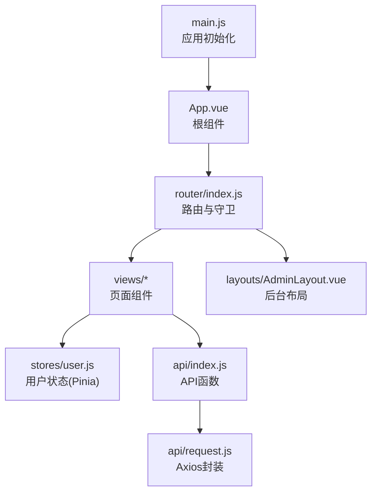
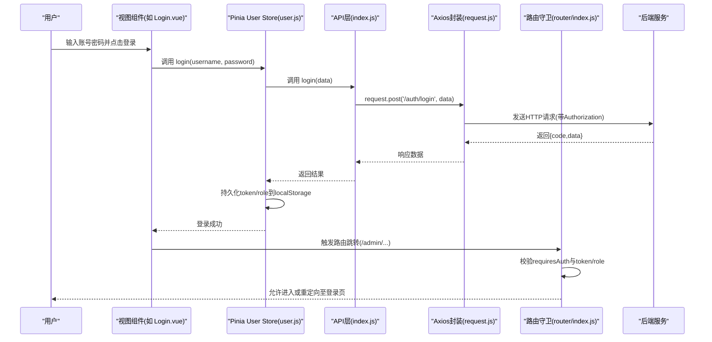
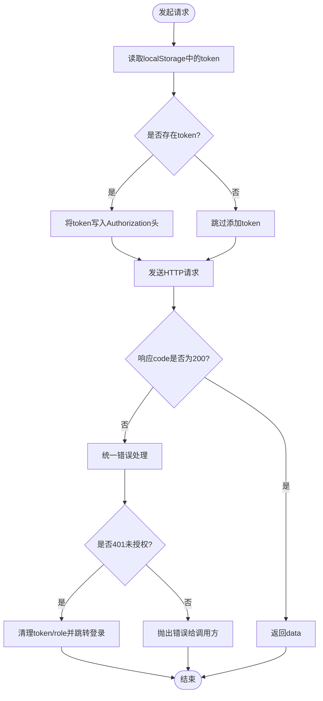
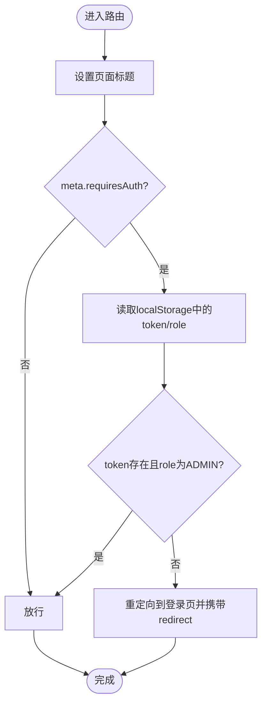
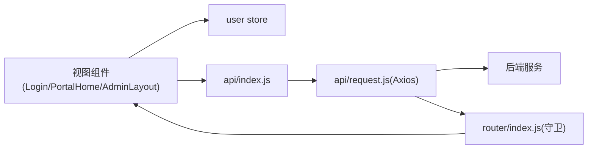

# 组件通信机制

<cite>
**本文引用的文件**
- [main.js](file://frontend/src/main.js)
- [App.vue](file://frontend/src/App.vue)
- [index.js（路由）](file://frontend/src/router/index.js)
- [user.js（用户状态管理）](file://frontend/src/stores/user.js)
- [request.js（请求封装）](file://frontend/src/api/request.js)
- [index.js（API接口）](file://frontend/src/api/index.js)
- [Login.vue](file://frontend/src/views/Login.vue)
- [PortalHome.vue](file://frontend/src/views/PortalHome.vue)
- [AdminLayout.vue](file://frontend/src/layouts/AdminLayout.vue)
</cite>

## 目录
1. [简介](#简介)
2. [项目结构](#项目结构)
3. [核心组件与通信模式总览](#核心组件与通信模式总览)
4. [架构总览](#架构总览)
5. [详细组件分析](#详细组件分析)
6. [依赖关系分析](#依赖关系分析)
7. [性能考虑与优化建议](#性能考虑与优化建议)
8. [故障排查指南](#故障排查指南)
9. [结论](#结论)

## 简介
本文件聚焦于JZPlatform门户系统的前端组件通信机制，围绕以下目标展开：
- 父子组件通过 props 与事件通信的模式与最佳实践
- 兄弟组件通过 Pinia 状态管理共享数据
- 跨层级组件使用 provide/inject 模式的适用场景
- 深入分析 user store 的状态管理模式
- API层的统一请求封装与错误处理
- 路由守卫的权限控制机制
- 提供常见通信场景的实践建议与性能优化策略

## 项目结构
前端采用 Vue3 + Vite + Element Plus + Pinia + Vue Router 的技术栈。关键目录与职责如下：
- src/main.js：应用初始化、插件注册（Pinia、Router、Element Plus）
- src/App.vue：根组件，仅包含路由出口
- src/router/index.js：路由定义与全局前置守卫
- src/stores/user.js：用户相关的全局状态（登录态、角色等）
- src/api/request.js：基于 Axios 的统一请求封装（拦截器、错误处理）
- src/api/index.js：按业务域聚合的 API 函数
- src/views/*：页面级视图组件
- src/layouts/AdminLayout.vue：后台布局容器，承载子路由



图表来源
- [main.js:1-22](file://frontend/src/main.js#L1-L22)
- [App.vue:1-7](file://frontend/src/App.vue#L1-L7)
- [index.js（路由）:1-99](file://frontend/src/router/index.js#L1-L99)
- [AdminLayout.vue:1-136](file://frontend/src/layouts/AdminLayout.vue#L1-L136)
- [user.js（用户状态管理）:1-57](file://frontend/src/stores/user.js#L1-L57)
- [index.js（API接口）:1-137](file://frontend/src/api/index.js#L1-L137)
- [request.js（请求封装）:1-45](file://frontend/src/api/request.js#L1-L45)

章节来源
- [main.js:1-22](file://frontend/src/main.js#L1-L22)
- [App.vue:1-7](file://frontend/src/App.vue#L1-L7)
- [index.js（路由）:1-99](file://frontend/src/router/index.js#L1-L99)

## 核心组件与通信模式总览
- 父子组件通信
  - 父向子传递数据：props
  - 子向父通知变化：emit 事件
  - 适用场景：表单输入、列表项点击、局部UI状态同步
- 兄弟组件通信
  - 通过 Pinia 的 user store 共享登录态、用户信息、角色等
  - 适用场景：导航栏显示“登录/管理后台”按钮、多页面展示用户名
- 跨层级组件通信
  - 使用 provide/inject 在深层嵌套中注入配置或主题等
  - 适用场景：主题切换、国际化语言包、全局工具方法
- 全局副作用与权限
  - 路由守卫负责鉴权与跳转
  - Axios 拦截器负责自动携带 token、统一错误处理与未授权跳转

章节来源
- [user.js（用户状态管理）:1-57](file://frontend/src/stores/user.js#L1-L57)
- [index.js（路由）:81-96](file://frontend/src/router/index.js#L81-L96)
- [request.js（请求封装）:12-42](file://frontend/src/api/request.js#L12-L42)

## 架构总览
下图展示了从页面到状态、网络层与后端的核心交互路径，以及权限控制的关键节点。



图表来源
- [Login.vue:51-66](file://frontend/src/views/Login.vue#L51-L66)
- [user.js（用户状态管理）:20-31](file://frontend/src/stores/user.js#L20-L31)
- [index.js（API接口）:3-6](file://frontend/src/api/index.js#L3-L6)
- [request.js（请求封装）:12-22](file://frontend/src/api/request.js#L12-L22)
- [index.js（路由）:81-96](file://frontend/src/router/index.js#L81-L96)

## 详细组件分析

### 用户状态管理（Pinia user store）
- 设计要点
  - state：token、userId、username、role；初始值优先读取 localStorage
  - getters：isLoggedIn、isAdmin 用于模板条件渲染
  - actions：login、logout、fetchUserInfo 封装了登录、登出与刷新用户信息的流程
- 与其他模块的关系
  - 被视图组件（如 AdminLayout.vue、PortalHome.vue）直接消费以驱动界面
  - 被路由守卫间接依赖（通过检查 localStorage 中的 token/role）
  - 被 API 层间接影响（当后端返回 401 时，axios 拦截器会清理本地存储并跳转登录）

```mermaid
classDiagram
class UserStore {
+state : { token, userId, username, role }
+getters : { isLoggedIn, isAdmin }
+actions : { login(), logout(), fetchUserInfo() }
}
class LoginView {
+handleLogin()
}
class AdminLayout {
+handleLogout()
}
class RouterGuard {
+beforeEach()
}
class AxiosInterceptor {
+request.use()
+response.use()
}
LoginView --> UserStore : "调用login()"
AdminLayout --> UserStore : "调用logout()"
RouterGuard --> UserStore : "读取localStorage(token/role)"
AxiosInterceptor --> UserStore : "清理localStorage后跳转"
```

图表来源
- [user.js（用户状态管理）:1-57](file://frontend/src/stores/user.js#L1-L57)
- [Login.vue:51-66](file://frontend/src/views/Login.vue#L51-L66)
- [AdminLayout.vue:70-73](file://frontend/src/layouts/AdminLayout.vue#L70-L73)
- [index.js（路由）:81-96](file://frontend/src/router/index.js#L81-L96)
- [request.js（请求封装）:24-42](file://frontend/src/api/request.js#L24-L42)

章节来源
- [user.js（用户状态管理）:1-57](file://frontend/src/stores/user.js#L1-L57)
- [Login.vue:51-66](file://frontend/src/views/Login.vue#L51-L66)
- [AdminLayout.vue:70-73](file://frontend/src/layouts/AdminLayout.vue#L70-L73)

### API层统一请求封装
- 基础配置
  - baseURL 指向 /api，由开发服务器代理转发到后端
  - 超时时间统一设置
- 请求拦截器
  - 自动从 localStorage 读取 token 并写入 Authorization 头
- 响应拦截器
  - 对 code !== 200 的情况进行统一处理
  - 针对 401 未授权：清除本地 token/role，并跳转到登录页
  - 其他错误抛出 Error 供上层捕获



图表来源
- [request.js（请求封装）:7-10](file://frontend/src/api/request.js#L7-L10)
- [request.js（请求封装）:12-22](file://frontend/src/api/request.js#L12-L22)
- [request.js（请求封装）:24-42](file://frontend/src/api/request.js#L24-L42)

章节来源
- [request.js（请求封装）:1-45](file://frontend/src/api/request.js#L1-45)
- [index.js（API接口）:1-137](file://frontend/src/api/index.js#L1-L137)

### 路由守卫与权限控制
- 路由元信息
  - 需要登录的路由在 meta.requiresAuth 标记
- 前置守卫逻辑
  - 根据 to.meta.title 动态设置文档标题
  - 若 requiresAuth 为真，则检查 localStorage 中的 token 与 role
  - 不满足条件时重定向到登录页，并附带 redirect 参数以便登录后回跳
- 典型受保护路由
  - /admin/* 下的所有子路由均要求管理员角色



图表来源
- [index.js（路由）:81-96](file://frontend/src/router/index.js#L81-L96)

章节来源
- [index.js（路由）:1-99](file://frontend/src/router/index.js#L1-L99)

### 视图组件与状态/路由的协作
- 登录页（Login.vue）
  - 使用表单校验与 loading 状态
  - 调用 userStore.login 成功后，根据 query.redirect 或默认路径跳转
- 首页（PortalHome.vue）
  - 使用 userStore.isAdmin 控制“管理后台”入口的可见性
  - 加载平台配置与统计概览数据
- 后台布局（AdminLayout.vue）
  - 顶部显示当前用户名，并提供退出操作
  - 退出时调用 userStore.logout 并跳转登录页

章节来源
- [Login.vue:51-66](file://frontend/src/views/Login.vue#L51-L66)
- [PortalHome.vue:23-28](file://frontend/src/views/PortalHome.vue#L23-L28)
- [AdminLayout.vue:48-50](file://frontend/src/layouts/AdminLayout.vue#L48-L50)
- [AdminLayout.vue:70-73](file://frontend/src/layouts/AdminLayout.vue#L70-L73)

### 父子组件通信的最佳实践（通用指导）
- 单向数据流
  - 父组件通过 props 向下传递只读数据，避免子组件直接修改
- 事件驱动更新
  - 子组件通过 emit 向上汇报变更，父组件集中处理副作用（如保存、跳转）
- 组合式函数复用
  - 将复杂表单校验、分页、搜索等逻辑抽离为可复用的组合式函数，降低组件耦合
- 大型表单与表格
  - 使用 v-model 双向绑定简化输入，结合 computed 派生过滤/排序结果
- 性能优化
  - 对大数据列表使用虚拟滚动或分页
  - 使用 computed 缓存计算结果，避免重复计算

[本节为通用实践说明，不直接分析具体文件]

### 兄弟组件通信的最佳实践（Pinia）
- 何时使用
  - 多个页面或组件需要同步登录态、用户信息、主题、语言等
- 设计建议
  - 将易变且跨组件共享的数据放入 store
  - 使用 getters 暴露派生状态，减少模板中的复杂表达式
  - 将副作用（如网络请求、持久化）集中在 actions 中
- 示例参考
  - user store 的 login/logout/fetchUserInfo 动作体现了“状态+副作用”的清晰边界

章节来源
- [user.js（用户状态管理）:1-57](file://frontend/src/stores/user.js#L1-L57)

### 跨层级组件通信的最佳实践（provide/inject）
- 何时使用
  - 深层嵌套组件需要共享配置（如主题、语言、全局工具）
- 设计建议
  - 在顶层组件 provide 一个对象，包含稳定的引用
  - 子组件 inject 对应键名，保持最小依赖面
  - 对于频繁变化的值，建议使用 ref/reactive 包裹，确保响应式更新
- 注意事项
  - 谨慎使用，避免隐式依赖导致难以维护
  - 与 Pinia 对比：全局状态优先用 store，provide/inject 更适合“上下文型”配置

[本节为通用实践说明，不直接分析具体文件]

## 依赖关系分析
- 组件与状态
  - 视图组件通过 useUserStore 获取用户状态，驱动 UI 分支与行为
- 组件与网络
  - 视图组件调用 api/index.js 暴露的函数，最终由 axios 实例发起请求
- 网络与权限
  - axios 拦截器在请求前注入 token，在响应侧处理 401 并跳转
  - 路由守卫在导航前再次校验 token/role，形成双重保障



图表来源
- [Login.vue:51-66](file://frontend/src/views/Login.vue#L51-L66)
- [PortalHome.vue:23-28](file://frontend/src/views/PortalHome.vue#L23-L28)
- [AdminLayout.vue:70-73](file://frontend/src/layouts/AdminLayout.vue#L70-L73)
- [user.js（用户状态管理）:1-57](file://frontend/src/stores/user.js#L1-L57)
- [index.js（API接口）:1-137](file://frontend/src/api/index.js#L1-L137)
- [request.js（请求封装）:12-42](file://frontend/src/api/request.js#L12-L42)
- [index.js（路由）:81-96](file://frontend/src/router/index.js#L81-L96)

章节来源
- [index.js（路由）:81-96](file://frontend/src/router/index.js#L81-L96)
- [request.js（请求封装）:12-42](file://frontend/src/api/request.js#L12-L42)
- [user.js（用户状态管理）:1-57](file://frontend/src/stores/user.js#L1-L57)

## 性能考虑与优化建议
- 状态管理
  - 将大对象拆分为小粒度 store，按需订阅，减少不必要的重渲染
  - 使用 getters 缓存派生数据，避免模板中复杂计算
- 网络请求
  - 合理设置超时与重试策略；对幂等 GET 请求增加缓存层（如内存缓存或浏览器缓存）
  - 对高频请求做防抖/节流（例如搜索框）
- 路由与组件
  - 使用懒加载路由与异步组件，减小首屏体积
  - 列表数据分页加载，必要时引入虚拟滚动
- 用户体验
  - 统一的 loading 与错误提示，避免阻塞主线程
  - 对 401 等错误进行友好引导，避免白屏

[本节为通用优化建议，不直接分析具体文件]

## 故障排查指南
- 登录后仍被重定向到登录页
  - 检查 user store 是否正确持久化 token/role
  - 确认路由守卫读取的 localStorage 键名一致
  - 确认 axios 拦截器是否在请求头正确附加 Authorization
- 页面出现未授权跳转
  - 查看 axios 响应拦截器对 401 的处理逻辑
  - 核对后端返回的 code 字段是否符合预期
- 管理后台菜单不显示或无法访问
  - 检查 userStore.isAdmin 的计算结果
  - 确认路由 meta.requiresAuth 与角色判断逻辑

章节来源
- [user.js（用户状态管理）:20-41](file://frontend/src/stores/user.js#L20-L41)
- [index.js（路由）:81-96](file://frontend/src/router/index.js#L81-L96)
- [request.js（请求封装）:24-42](file://frontend/src/api/request.js#L24-L42)

## 结论
本项目在前端侧形成了清晰的组件通信与权限控制体系：
- 父子组件通过 props/emit 实现明确的数据流
- 兄弟组件通过 Pinia user store 共享登录态与用户信息
- 跨层级组件可通过 provide/inject 注入上下文配置
- API 层通过 Axios 拦截器实现统一的鉴权与错误处理
- 路由守卫在导航阶段进行二次鉴权，保障受保护资源的安全访问

上述机制共同支撑了门户系统的稳定运行与良好扩展性。后续可在状态拆分、请求缓存、组件懒加载等方面持续优化，进一步提升性能与可维护性。