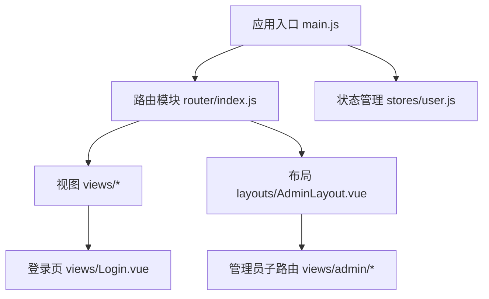
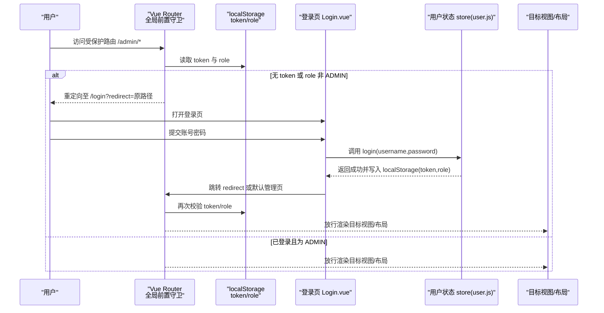
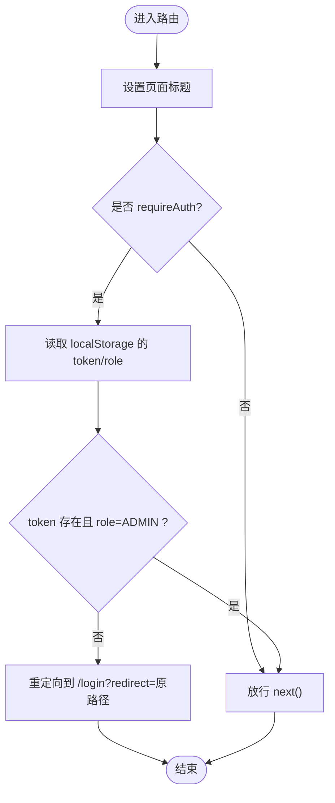
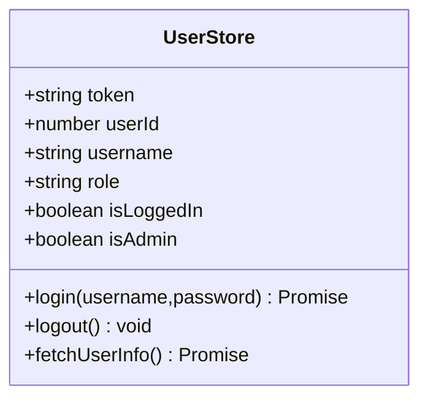
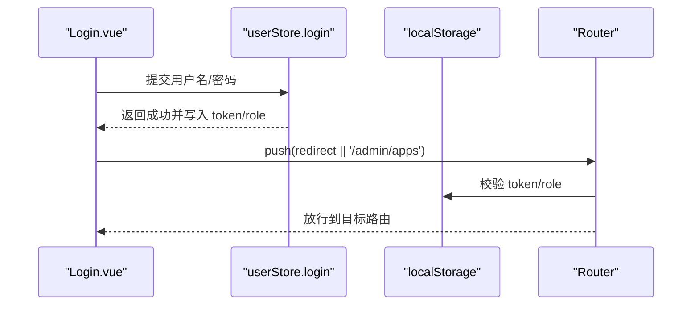
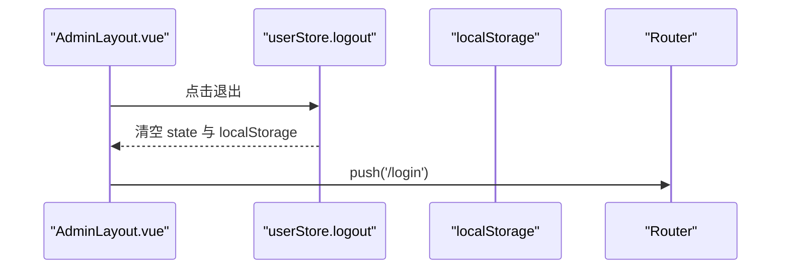
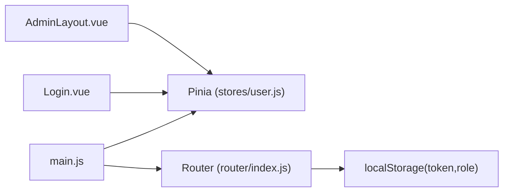

# 路由导航守卫

<cite>
**本文引用的文件**   
- [前端路由配置与全局前置守卫](file://frontend/src/router/index.js)
- [用户状态管理（Pinia）](file://frontend/src/stores/user.js)
- [登录页面](file://frontend/src/views/Login.vue)
- [应用入口（注册 Pinia、Router）](file://frontend/src/main.js)
- [管理员布局（退出逻辑）](file://frontend/src/layouts/AdminLayout.vue)
</cite>

## 目录
1. [简介](#简介)
2. [项目结构](#项目结构)
3. [核心组件](#核心组件)
4. [架构总览](#架构总览)
5. [详细组件分析](#详细组件分析)
6. [依赖关系分析](#依赖关系分析)
7. [性能考虑](#性能考虑)
8. [故障排查指南](#故障排查指南)
9. [结论](#结论)
10. [附录](#附录)

## 简介
本文件聚焦于 JZPlatform 门户系统的前端路由导航守卫机制，系统性说明 Vue Router 的全局前置守卫实现、用户认证检查、权限验证、路由元信息配置；并深入解析管理员权限控制、未登录重定向、动态路由加载等安全机制。同时阐述路由守卫与 Pinia 状态管理的集成方式，包括用户状态同步、Token 校验与会话管理，并提供权限控制的最佳实践与优化建议（如 404 处理、面包屑导航、懒加载）。

## 项目结构
本项目采用前后端分离的 SPA 架构，前端基于 Vue 3 + Vue Router + Pinia + Element Plus。与“路由导航守卫”直接相关的代码集中在以下位置：
- 路由定义与全局前置守卫：router/index.js
- 用户状态与 Token/角色持久化：stores/user.js
- 登录流程与跳转：views/Login.vue
- 应用初始化与插件注册：main.js
- 管理员布局与退出：layouts/AdminLayout.vue

图表来源
- [应用入口（注册 Pinia、Router）:1-22](file://frontend/src/main.js#L1-L22)
- [前端路由配置与全局前置守卫:1-99](file://frontend/src/router/index.js#L1-L99)
- [用户状态管理（Pinia）:1-57](file://frontend/src/stores/user.js#L1-L57)
- [登录页面:1-103](file://frontend/src/views/Login.vue#L1-L103)
- [管理员布局（退出逻辑）:38-100](file://frontend/src/layouts/AdminLayout.vue#L38-L100)

章节来源
- [应用入口（注册 Pinia、Router）:1-22](file://frontend/src/main.js#L1-L22)
- [前端路由配置与全局前置守卫:1-99](file://frontend/src/router/index.js#L1-L99)

## 核心组件
- 路由模块：集中声明所有静态路由，使用 meta 字段描述页面标题与访问要求；通过 beforeEach 实现全局前置守卫，完成标题设置、鉴权判断与重定向。
- 用户状态（Pinia）：维护 token、userId、username、role 等状态，提供登录、登出、获取用户信息等 action，并在本地存储中持久化 token 与 role。
- 登录页：调用 userStore.login 完成认证，成功后根据路由参数 redirect 或默认路径进行跳转。
- 管理员布局：展示当前用户名并提供退出按钮，退出时清空状态并跳转到登录页。

章节来源
- [前端路由配置与全局前置守卫:1-99](file://frontend/src/router/index.js#L1-L99)
- [用户状态管理（Pinia）:1-57](file://frontend/src/stores/user.js#L1-L57)
- [登录页面:1-103](file://frontend/src/views/Login.vue#L1-L103)
- [管理员布局（退出逻辑）:38-100](file://frontend/src/layouts/AdminLayout.vue#L38-L100)

## 架构总览
下图展示了从浏览器访问到路由守卫拦截、再到登录态校验与重定向的整体流程。

图表来源
- [前端路由配置与全局前置守卫:81-96](file://frontend/src/router/index.js#L81-L96)
- [用户状态管理（Pinia）:20-41](file://frontend/src/stores/user.js#L20-L41)
- [登录页面:51-66](file://frontend/src/views/Login.vue#L51-L66)

## 详细组件分析

### 全局前置守卫与路由元信息
- 路由元信息 meta：用于承载页面标题与访问控制标记（例如 requiresAuth）。
- 全局前置守卫 beforeEach：
  - 统一设置 document.title。
  - 当 to.meta.requiresAuth 为真时，校验 localStorage 中的 token 与 role，不满足则重定向到登录页并携带 redirect 参数。
  - 否则放行 next()。

图表来源
- [前端路由配置与全局前置守卫:81-96](file://frontend/src/router/index.js#L81-L96)

章节来源
- [前端路由配置与全局前置守卫:1-99](file://frontend/src/router/index.js#L1-L99)

### 用户状态管理与会话管理（Pinia 集成）
- 状态字段：token、userId、username、role，其中 token 与 role 在初始化时从 localStorage 恢复。
- 计算属性：isLoggedIn、isAdmin，便于模板与守卫快速判断。
- Actions：
  - login：调用后端接口，成功后将 token、userId、username、role 写入 state 与 localStorage。
  - logout：清空 state 与 localStorage。
  - fetchUserInfo：若存在 token，拉取最新用户信息并更新 state；失败则自动登出。

图表来源
- [用户状态管理（Pinia）:1-57](file://frontend/src/stores/user.js#L1-L57)

章节来源
- [用户状态管理（Pinia）:1-57](file://frontend/src/stores/user.js#L1-L57)

### 登录流程与重定向
- 登录页表单校验通过后调用 userStore.login。
- 登录成功后，优先使用 route.query.redirect 作为跳转目标，否则默认进入管理首页。
- 由于登录后 token/role 已写入 localStorage，后续路由守卫可正常放行。

图表来源
- [登录页面:51-66](file://frontend/src/views/Login.vue#L51-L66)
- [用户状态管理（Pinia）:20-41](file://frontend/src/stores/user.js#L20-L41)
- [前端路由配置与全局前置守卫:81-96](file://frontend/src/router/index.js#L81-L96)

章节来源
- [登录页面:1-103](file://frontend/src/views/Login.vue#L1-L103)
- [用户状态管理（Pinia）:1-57](file://frontend/src/stores/user.js#L1-L57)
- [前端路由配置与全局前置守卫:1-99](file://frontend/src/router/index.js#L1-L99)

### 管理员权限控制与退出
- 管理员布局显示当前用户名并提供退出按钮。
- 退出时调用 userStore.logout 清理状态与本地缓存，随后跳转到登录页。

图表来源
- [管理员布局（退出逻辑）:70-73](file://frontend/src/layouts/AdminLayout.vue#L70-L73)
- [用户状态管理（Pinia）:33-41](file://frontend/src/stores/user.js#L33-L41)

章节来源
- [管理员布局（退出逻辑）:38-100](file://frontend/src/layouts/AdminLayout.vue#L38-L100)
- [用户状态管理（Pinia）:1-57](file://frontend/src/stores/user.js#L1-L57)

### 路由懒加载与动态路由
- 懒加载：所有路由组件均采用函数式 import 实现按需加载，减少首屏体积。
- 动态路由：当前仓库未实现服务端下发菜单后动态注册路由的模式。如需扩展，可在登录后调用 router.addRoute 动态注入子路由，并结合路由守卫进行权限校验。

章节来源
- [前端路由配置与全局前置守卫:6-74](file://frontend/src/router/index.js#L6-L74)

## 依赖关系分析
- 入口 main.js 依次注册 Pinia 与 Router，确保全局前置守卫在应用启动后即可生效。
- 路由模块依赖 localStorage 中的 token/role 进行鉴权。
- 登录页与管理布局均依赖 userStore 提供的状态与方法，形成“UI -> Store -> Storage”的闭环。

图表来源
- [应用入口（注册 Pinia、Router）:11-21](file://frontend/src/main.js#L11-L21)
- [前端路由配置与全局前置守卫:1-99](file://frontend/src/router/index.js#L1-L99)
- [用户状态管理（Pinia）:1-57](file://frontend/src/stores/user.js#L1-L57)
- [登录页面:1-103](file://frontend/src/views/Login.vue#L1-L103)
- [管理员布局（退出逻辑）:38-100](file://frontend/src/layouts/AdminLayout.vue#L38-L100)

章节来源
- [应用入口（注册 Pinia、Router）:1-22](file://frontend/src/main.js#L1-L22)
- [前端路由配置与全局前置守卫:1-99](file://frontend/src/router/index.js#L1-L99)
- [用户状态管理（Pinia）:1-57](file://frontend/src/stores/user.js#L1-L57)

## 性能考虑
- 路由懒加载：所有页面组件使用异步 import，有效降低首屏资源体积。
- 守卫开销：全局前置守卫仅做轻量判断（读取 localStorage、条件跳转），对性能影响极小。
- 建议：
  - 对于大型后台系统，可将路由按模块拆分并延迟加载，结合 addRoute 动态注册。
  - 避免在守卫中进行耗时操作（如网络请求），必要时可引入内存缓存或预取策略。

[本节为通用指导，无需源码引用]

## 故障排查指南
- 无法进入管理页
  - 检查 localStorage 是否存在 token 且 role 是否为 ADMIN。
  - 确认路由 meta.requiresAuth 是否正确配置。
- 登录后仍被重定向到登录页
  - 确认登录成功后是否写入了 token 与 role。
  - 检查路由跳转是否使用了正确的 redirect 参数。
- 退出后仍可访问管理页
  - 确认退出逻辑是否清除了 localStorage 与 Pinia 状态。
  - 刷新页面后，全局前置守卫会重新读取 localStorage，应能正确拦截。

章节来源
- [前端路由配置与全局前置守卫:81-96](file://frontend/src/router/index.js#L81-L96)
- [用户状态管理（Pinia）:20-41](file://frontend/src/stores/user.js#L20-L41)
- [登录页面:51-66](file://frontend/src/views/Login.vue#L51-L66)
- [管理员布局（退出逻辑）:70-73](file://frontend/src/layouts/AdminLayout.vue#L70-L73)

## 结论
JZPlatform 门户系统的前端路由守卫以“meta 标记 + 全局前置守卫 + localStorage 持久化”为核心，实现了简洁有效的管理员权限控制。配合 Pinia 的用户状态管理，形成了清晰的认证与会话生命周期。当前实现未包含 404 页面与面包屑导航，但已具备良好的扩展基础，可按需补充动态路由、权限细化与用户体验增强功能。

[本节为总结性内容，无需源码引用]

## 附录

### 最佳实践清单
- 权限模型
  - 使用 meta.requiresAuth 标识需要登录的路由。
  - 在守卫中统一校验 token 与角色，避免在各页面重复判断。
- 会话管理
  - 登录成功后立即持久化 token 与 role。
  - 登出时同步清理 Pinia 状态与本地存储。
- 动态路由
  - 登录后根据后端返回的菜单动态 addRoute，并在守卫中校验权限。
- 404 处理
  - 在路由末尾添加通配符路由指向 404 页面，提升用户体验。
- 面包屑导航
  - 基于路由层级与 meta.title 自动生成面包屑，保持导航一致性。
- 懒加载优化
  - 继续使用函数式 import 按需加载页面组件。
  - 对大组件进一步拆分子路由或分块加载。

[本节为通用指导，无需源码引用]