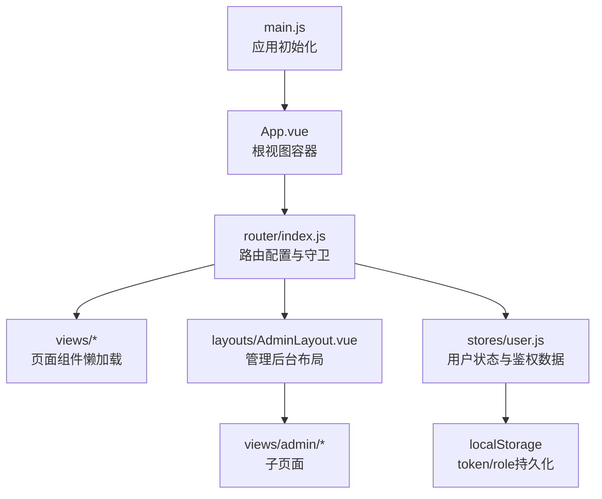
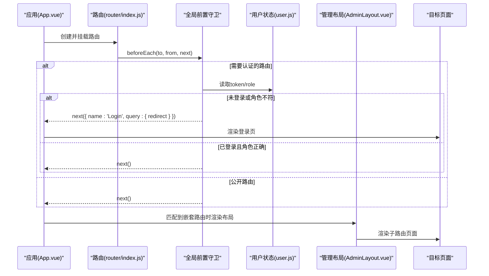
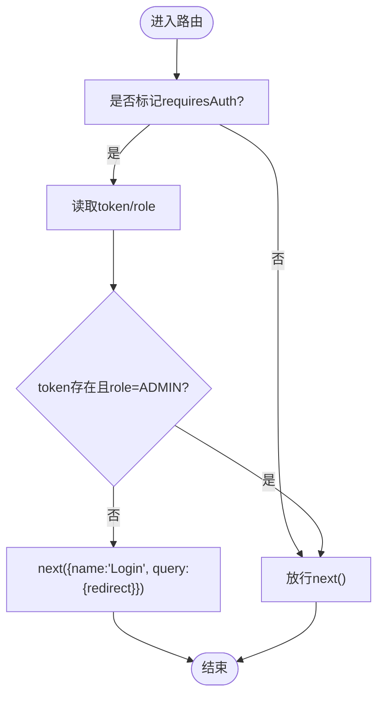
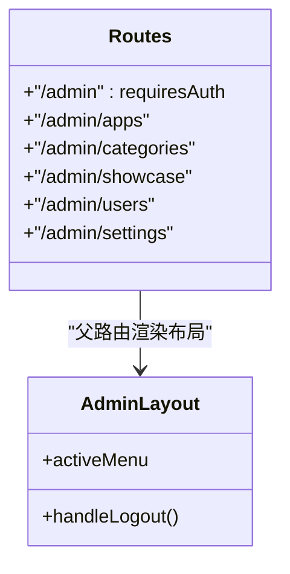
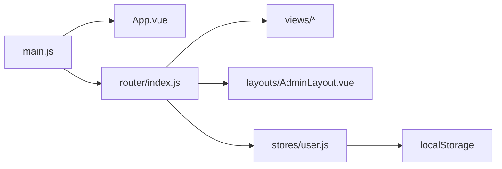

# 路由与导航系统

<cite>
**本文引用的文件**   
- [frontend/src/router/index.js](file://frontend/src/router/index.js)
- [frontend/src/main.js](file://frontend/src/main.js)
- [frontend/src/App.vue](file://frontend/src/App.vue)
- [frontend/src/stores/user.js](file://frontend/src/stores/user.js)
- [frontend/src/views/Login.vue](file://frontend/src/views/Login.vue)
- [frontend/src/layouts/AdminLayout.vue](file://frontend/src/layouts/AdminLayout.vue)
</cite>

## 目录
1. [简介](#简介)
2. [项目结构](#项目结构)
3. [核心组件](#核心组件)
4. [架构总览](#架构总览)
5. [详细组件分析](#详细组件分析)
6. [依赖关系分析](#依赖关系分析)
7. [性能考虑](#性能考虑)
8. [故障排查指南](#故障排查指南)
9. [结论](#结论)
10. [附录](#附录)

## 简介
本章节面向JZPlatform门户系统的前端路由与导航体系，聚焦以下主题：
- Vue Router 的配置与使用方式
- 路由守卫（全局前置）的实现与权限控制
- 动态路由加载机制（懒加载）
- 嵌套路由结构与布局组合
- 路由参数传递与查询字符串处理
- 错误处理与异常跳转策略
- 路由性能优化与懒加载最佳实践

## 项目结构
前端采用Vue 3 + Vue Router 4 + Pinia的组合。路由定义集中在单一文件中，通过懒加载按需引入页面组件；登录态与角色信息保存在本地存储并由Pinia管理；管理员后台以嵌套路由+布局组件组织。

图示来源
- [frontend/src/main.js:1-22](file://frontend/src/main.js#L1-L22)
- [frontend/src/App.vue:1-7](file://frontend/src/App.vue#L1-L7)
- [frontend/src/router/index.js:1-99](file://frontend/src/router/index.js#L1-L99)
- [frontend/src/layouts/AdminLayout.vue:1-136](file://frontend/src/layouts/AdminLayout.vue#L1-L136)
- [frontend/src/stores/user.js:1-57](file://frontend/src/stores/user.js#L1-L57)

章节来源
- [frontend/src/main.js:1-22](file://frontend/src/main.js#L1-L22)
- [frontend/src/App.vue:1-7](file://frontend/src/App.vue#L1-L7)
- [frontend/src/router/index.js:1-99](file://frontend/src/router/index.js#L1-L99)

## 核心组件
- 路由入口与挂载
  - 在应用启动时创建并注册路由实例，启用HTML5 History模式。
- 路由表与懒加载
  - 所有页面组件均使用函数式导入实现按需加载，减少首屏体积。
- 全局前置守卫
  - 统一设置文档标题、校验登录态与角色、未授权跳转登录页并携带重定向目标。
- 嵌套路由与布局
  - 管理后台以父路由承载布局，子路由渲染具体业务页面。
- 用户状态与鉴权
  - 登录成功后将token与角色写入本地存储，并在后续路由守卫中读取判断。

章节来源
- [frontend/src/router/index.js:1-99](file://frontend/src/router/index.js#L1-L99)
- [frontend/src/stores/user.js:1-57](file://frontend/src/stores/user.js#L1-L57)

## 架构总览
下图展示了从应用启动到路由解析、守卫拦截、布局渲染的完整流程。

图示来源
- [frontend/src/router/index.js:76-96](file://frontend/src/router/index.js#L76-L96)
- [frontend/src/stores/user.js:8-18](file://frontend/src/stores/user.js#L8-L18)
- [frontend/src/layouts/AdminLayout.vue:52-54](file://frontend/src/layouts/AdminLayout.vue#L52-L54)

## 详细组件分析

### 路由配置与懒加载
- 历史模式
  - 使用HTML5 History模式，便于SEO与直接访问深层链接。
- 懒加载
  - 所有页面组件均以函数形式导入，触发路由时才加载对应模块，降低首屏资源体积。
- 元信息与标题
  - 每个路由通过meta字段声明title，在守卫中统一注入document.title。
- 示例路径
  - 首页、应用导航、产品宣贯、宣贯详情、登录、管理后台及子菜单等。

章节来源
- [frontend/src/router/index.js:6-79](file://frontend/src/router/index.js#L6-L79)

### 路由守卫与权限控制
- 全局前置守卫职责
  - 设置页面标题
  - 校验requiresAuth标记
  - 检查本地存储中的token与role
  - 未通过则跳转到登录页并附带redirect参数
- 权限模型
  - 当前仅支持ADMIN角色的后台访问控制，未区分更细粒度权限。
- 典型流程
  - 进入受保护路由 -> 守卫读取token/role -> 不满足条件 -> 跳转登录并携带原路径 -> 登录后按redirect返回。

图示来源
- [frontend/src/router/index.js:82-96](file://frontend/src/router/index.js#L82-L96)

章节来源
- [frontend/src/router/index.js:81-96](file://frontend/src/router/index.js#L81-L96)

### 嵌套路由与布局
- 父路由
  - /admin 作为管理后台入口，绑定AdminLayout布局组件，并标记requiresAuth。
- 子路由
  - 应用管理、分类管理、宣贯管理、用户管理、平台设置等子路由在布局内渲染。
- 布局职责
  - 侧边栏菜单高亮与导航、顶部显示当前页面标题、退出登录逻辑。

图示来源
- [frontend/src/router/index.js:38-73](file://frontend/src/router/index.js#L38-L73)
- [frontend/src/layouts/AdminLayout.vue:1-56](file://frontend/src/layouts/AdminLayout.vue#L1-L56)

章节来源
- [frontend/src/router/index.js:38-73](file://frontend/src/router/index.js#L38-L73)
- [frontend/src/layouts/AdminLayout.vue:1-74](file://frontend/src/layouts/AdminLayout.vue#L1-L74)

### 路由参数与查询字符串
- 动态路由参数
  - 宣贯详情页使用路径参数id进行内容定位。
- 查询字符串
  - 登录页从query.redirect读取重定向目标，若不存在则默认跳转到后台首页。
- 使用建议
  - 对敏感参数避免放在URL中；分页、筛选等查询参数建议使用query。

章节来源
- [frontend/src/router/index.js:25-30](file://frontend/src/router/index.js#L25-L30)
- [frontend/src/views/Login.vue:51-66](file://frontend/src/views/Login.vue#L51-L66)

### 登录与登出联动
- 登录成功
  - 调用接口获取token与角色，写入本地存储，随后根据redirect或默认路径跳转。
- 退出登录
  - 清空本地存储与状态，跳转至登录页。
- 与路由守卫配合
  - 退出后再次访问受保护路由会被守卫拦截并跳转登录。

章节来源
- [frontend/src/stores/user.js:20-41](file://frontend/src/stores/user.js#L20-L41)
- [frontend/src/views/Login.vue:51-66](file://frontend/src/views/Login.vue#L51-L66)
- [frontend/src/layouts/AdminLayout.vue:70-73](file://frontend/src/layouts/AdminLayout.vue#L70-L73)

### 错误处理与异常跳转
- 登录失败
  - 捕获异常并提示错误信息，保持当前页面以便重试。
- 网络或会话失效
  - 可在请求层统一拦截401并清理状态后跳转登录；当前实现依赖本地存储与守卫二次校验。
- 未匹配路由
  - 可补充通配符路由与404页面，提升用户体验。

章节来源
- [frontend/src/views/Login.vue:51-66](file://frontend/src/views/Login.vue#L51-L66)

## 依赖关系分析
- 应用初始化
  - main.js创建应用、安装Pinia与Element Plus、注册路由。
- 路由与视图
  - App.vue提供router-view占位；路由表映射到各页面与布局。
- 状态与持久化
  - user store负责登录态与角色，读写localStorage，供守卫与页面使用。

图示来源
- [frontend/src/main.js:11-21](file://frontend/src/main.js#L11-L21)
- [frontend/src/App.vue:1-7](file://frontend/src/App.vue#L1-L7)
- [frontend/src/router/index.js:76-79](file://frontend/src/router/index.js#L76-L79)
- [frontend/src/stores/user.js:8-13](file://frontend/src/stores/user.js#L8-L13)

章节来源
- [frontend/src/main.js:11-21](file://frontend/src/main.js#L11-L21)
- [frontend/src/App.vue:1-7](file://frontend/src/App.vue#L1-L7)
- [frontend/src/router/index.js:76-79](file://frontend/src/router/index.js#L76-L79)
- [frontend/src/stores/user.js:8-13](file://frontend/src/stores/user.js#L8-L13)

## 性能考虑
- 懒加载
  - 所有页面组件均采用函数式import，仅在路由激活时加载，显著降低首屏包体。
- 路由级代码分割
  - 结合构建工具可实现更细粒度的chunk拆分，避免大组件阻塞。
- 预取与预加载
  - 对高频访问页面可使用预取策略，在空闲时提前拉取资源。
- 路由缓存
  - 对于复杂表单或多Tab场景，可结合keep-alive缓存活跃页面，减少重复渲染。
- 历史模式与服务器配置
  - HTML5 History需服务端回退到index.html，避免刷新404。

[本节为通用性能建议，无需源码引用]

## 故障排查指南
- 无法进入后台页面
  - 检查本地是否存在token且role是否为ADMIN；确认路由是否标记requiresAuth。
- 登录后仍被跳转回登录页
  - 确认登录成功后是否正确写入token与role；检查守卫读取逻辑。
- 页面标题未更新
  - 确认路由meta.title是否存在；检查守卫是否在每次导航前执行。
- 404或未匹配路由
  - 建议添加通配符路由与404页面，提升容错体验。
- 刷新后丢失登录态
  - 确保store初始化时从localStorage恢复token与role。

章节来源
- [frontend/src/router/index.js:82-96](file://frontend/src/router/index.js#L82-L96)
- [frontend/src/stores/user.js:8-13](file://frontend/src/stores/user.js#L8-L13)
- [frontend/src/views/Login.vue:51-66](file://frontend/src/views/Login.vue#L51-L66)

## 结论
本项目基于Vue Router实现了清晰的路由分层与权限控制：通过全局前置守卫完成统一的鉴权与标题注入，借助懒加载优化首屏性能，并以嵌套路由组织管理后台。当前权限模型较为简单，未来可扩展为基于角色/资源的细粒度控制，并结合请求层拦截与404兜底完善整体健壮性。

[本节为总结性内容，无需源码引用]

## 附录

### 关键API与用法速查
- 创建路由与History模式
  - 参考：[frontend/src/router/index.js:76-79](file://frontend/src/router/index.js#L76-L79)
- 全局前置守卫
  - 参考：[frontend/src/router/index.js:82-96](file://frontend/src/router/index.js#L82-L96)
- 嵌套路由与布局
  - 参考：[frontend/src/router/index.js:38-73](file://frontend/src/router/index.js#L38-L73)
  - 参考：[frontend/src/layouts/AdminLayout.vue:1-56](file://frontend/src/layouts/AdminLayout.vue#L1-L56)
- 登录与重定向
  - 参考：[frontend/src/views/Login.vue:51-66](file://frontend/src/views/Login.vue#L51-L66)
- 用户状态与持久化
  - 参考：[frontend/src/stores/user.js:8-13](file://frontend/src/stores/user.js#L8-L13)
  - 参考：[frontend/src/stores/user.js:20-41](file://frontend/src/stores/user.js#L20-L41)