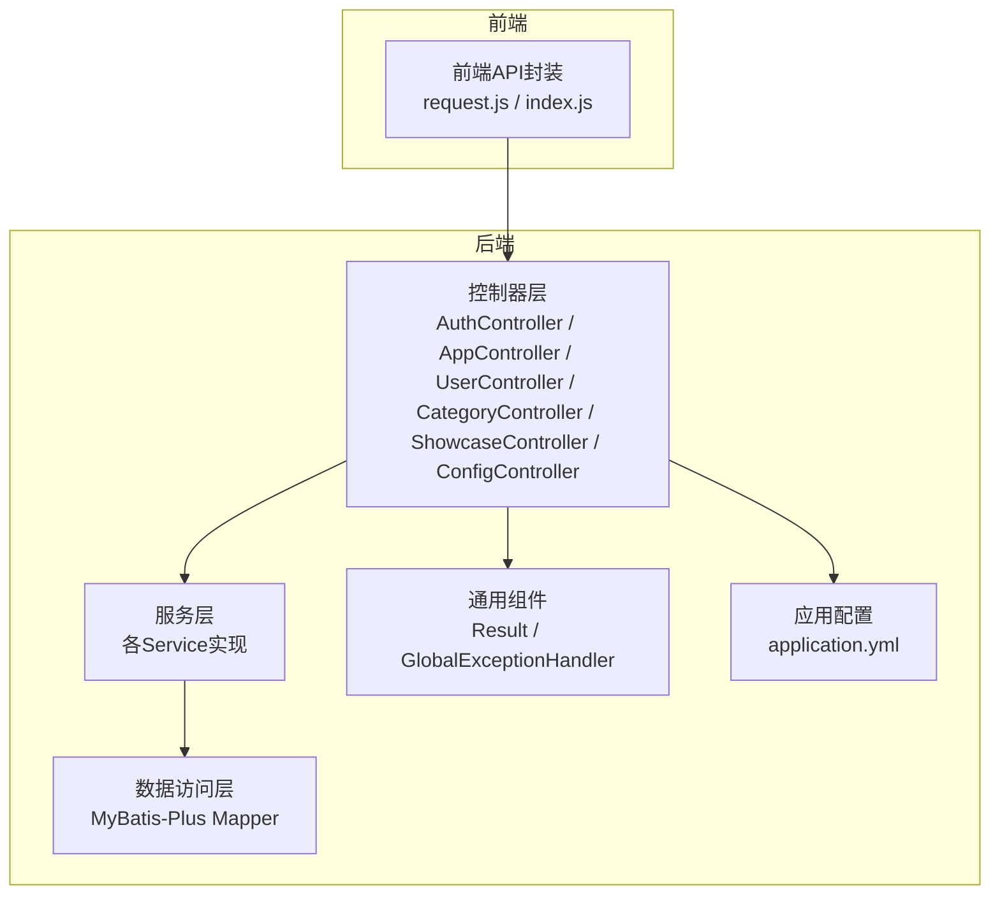
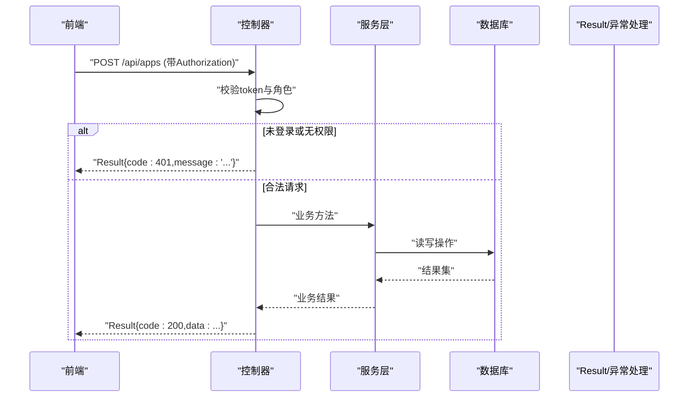
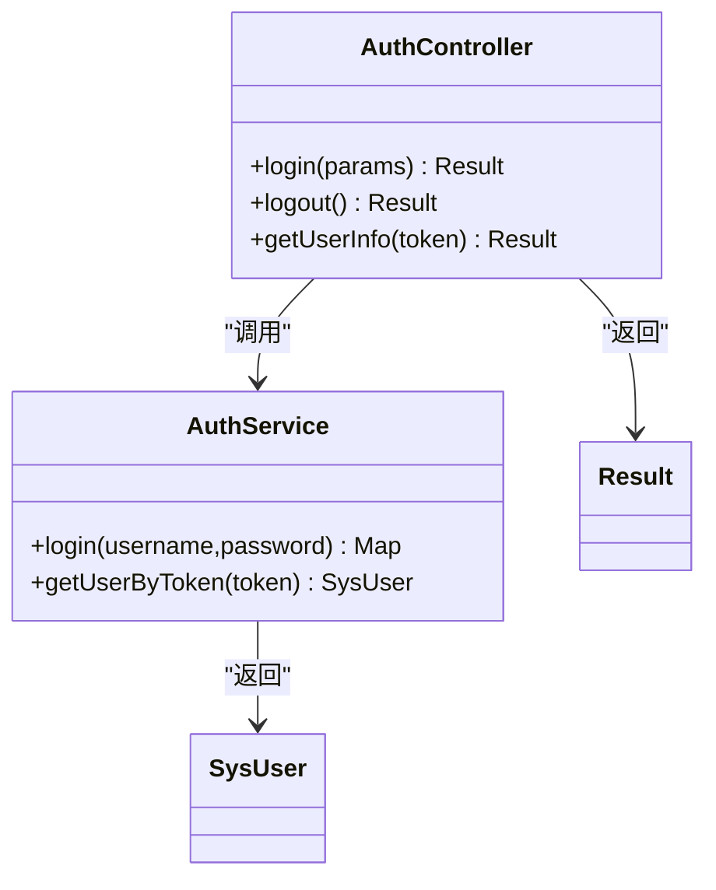
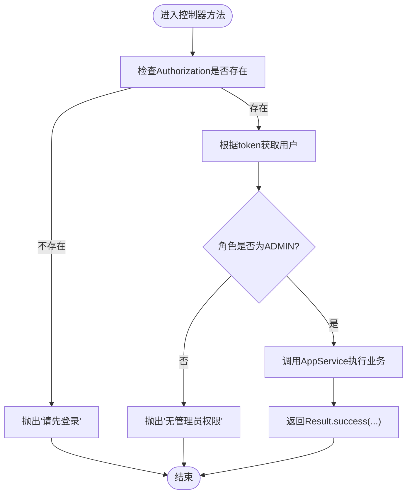
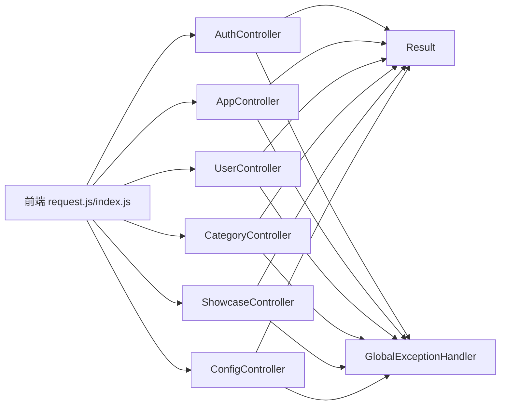

# RESTful API设计规范

<cite>
**本文引用的文件**   
- [Result.java](file://backend/src/main/java/com/xx/platform/common/Result.java)
- [GlobalExceptionHandler.java](file://backend/src/main/java/com/xx/platform/common/GlobalExceptionHandler.java)
- [AuthController.java](file://backend/src/main/java/com/xx/platform/controller/AuthController.java)
- [AppController.java](file://backend/src/main/java/com/xx/platform/controller/AppController.java)
- [UserController.java](file://backend/src/main/java/com/xx/platform/controller/UserController.java)
- [CategoryController.java](file://backend/src/main/java/com/xx/platform/controller/CategoryController.java)
- [ShowcaseController.java](file://backend/src/main/java/com/xx/platform/controller/ShowcaseController.java)
- [ConfigController.java](file://backend/src/main/java/com/xx/platform/controller/ConfigController.java)
- [application.yml](file://backend/src/main/resources/application.yml)
- [API.md](file://API.md)
- [request.js](file://frontend/src/api/request.js)
- [index.js](file://frontend/src/api/index.js)
</cite>

## 目录
1. [引言](#引言)
2. [项目结构](#项目结构)
3. [核心组件](#核心组件)
4. [架构总览](#架构总览)
5. [详细组件分析](#详细组件分析)
6. [依赖关系分析](#依赖关系分析)
7. [性能与可扩展性](#性能与可扩展性)
8. [故障排查指南](#故障排查指南)
9. [结论](#结论)
10. [附录：接口规范与示例](#附录接口规范与示例)

## 引言
本规范面向JZPlatform门户系统的RESTful API设计，统一约定URL命名、HTTP方法语义、状态码与错误处理机制，明确统一响应体Result的结构与使用方式。文档同时覆盖认证、应用管理、用户管理、分类、宣贯数据、平台配置与统计等模块的完整接口规范与调用示例，并给出版本控制策略、参数校验规则、安全性考虑以及文档生成与测试建议。

## 项目结构
后端采用Spring Boot分层架构：controller负责路由与入参出参映射，service承载业务逻辑，mapper对接数据库；common提供统一响应与全局异常处理；resources包含应用配置与初始化脚本。前端通过Axios封装请求拦截器，自动注入Authorization头并统一处理业务错误码。

图表来源
- [AuthController.java:1-68](file://backend/src/main/java/com/xx/platform/controller/AuthController.java#L1-L68)
- [AppController.java:1-111](file://backend/src/main/java/com/xx/platform/controller/AppController.java#L1-L111)
- [UserController.java:1-88](file://backend/src/main/java/com/xx/platform/controller/UserController.java#L1-L88)
- [CategoryController.java:1-78](file://backend/src/main/java/com/xx/platform/controller/CategoryController.java#L1-L78)
- [ShowcaseController.java:1-87](file://backend/src/main/java/com/xx/platform/controller/ShowcaseController.java#L1-L87)
- [ConfigController.java:1-76](file://backend/src/main/java/com/xx/platform/controller/ConfigController.java#L1-L76)
- [Result.java:1-53](file://backend/src/main/java/com/xx/platform/common/Result.java#L1-L53)
- [GlobalExceptionHandler.java:1-30](file://backend/src/main/java/com/xx/platform/common/GlobalExceptionHandler.java#L1-L30)
- [application.yml:1-29](file://backend/src/main/resources/application.yml#L1-L29)
- [request.js:1-45](file://frontend/src/api/request.js#L1-L45)
- [index.js:1-137](file://frontend/src/api/index.js#L1-L137)

章节来源
- [application.yml:1-29](file://backend/src/main/resources/application.yml#L1-L29)
- [API.md:1-197](file://API.md#L1-L197)

## 核心组件
- 统一响应体Result：所有接口返回统一的JSON结构，包含code、message、data三个字段，并提供success/error静态工厂方法。
- 全局异常处理器：捕获运行时异常和未处理异常，统一包装为Result返回，避免将堆栈信息暴露给客户端。
- 认证与鉴权：通过请求头Authorization传递token，控制器内对管理员接口进行角色校验，未登录或无权限抛出业务异常由全局处理器统一返回。

章节来源
- [Result.java:1-53](file://backend/src/main/java/com/xx/platform/common/Result.java#L1-L53)
- [GlobalExceptionHandler.java:1-30](file://backend/src/main/java/com/xx/platform/common/GlobalExceptionHandler.java#L1-L30)
- [AuthController.java:1-68](file://backend/src/main/java/com/xx/platform/controller/AuthController.java#L1-L68)
- [AppController.java:1-111](file://backend/src/main/java/com/xx/platform/controller/AppController.java#L1-L111)
- [UserController.java:1-88](file://backend/src/main/java/com/xx/platform/controller/UserController.java#L1-L88)

## 架构总览
下图展示一次受保护接口的典型调用流程：前端携带Authorization头发起请求，后端控制器解析token并校验权限，调用服务层完成业务逻辑，最终通过Result统一返回。

图表来源
- [AuthController.java:1-68](file://backend/src/main/java/com/xx/platform/controller/AuthController.java#L1-L68)
- [AppController.java:1-111](file://backend/src/main/java/com/xx/platform/controller/AppController.java#L1-L111)
- [Result.java:1-53](file://backend/src/main/java/com/xx/platform/common/Result.java#L1-L53)
- [GlobalExceptionHandler.java:1-30](file://backend/src/main/java/com/xx/platform/common/GlobalExceptionHandler.java#L1-L30)

## 详细组件分析

### 统一响应体Result
- 字段说明
  - code：业务状态码（成功默认200，失败可自定义）
  - message：提示信息
  - data：业务数据，类型泛型T
- 设计思路
  - 通过静态工厂方法简化构造，保证响应格式一致
  - 支持无数据成功返回与自定义错误码返回
- 复杂度
  - 时间O(1)，空间O(1)

章节来源
- [Result.java:1-53](file://backend/src/main/java/com/xx/platform/common/Result.java#L1-L53)

### 全局异常处理
- 职责
  - 捕获RuntimeException与Exception，统一返回Result
  - 打印堆栈便于定位问题，不向客户端泄露敏感信息
- 行为
  - 业务异常直接透传message
  - 未知异常附加“服务器内部错误”前缀

章节来源
- [GlobalExceptionHandler.java:1-30](file://backend/src/main/java/com/xx/platform/common/GlobalExceptionHandler.java#L1-L30)

### 认证接口（AuthController）
- 能力
  - 登录：接收username/password，返回token与用户信息
  - 登出：客户端清除token即可
  - 获取当前用户信息：从Authorization读取token，返回脱敏用户对象
- 安全
  - 未登录返回401
  - 不返回密码字段

图表来源
- [AuthController.java:1-68](file://backend/src/main/java/com/xx/platform/controller/AuthController.java#L1-L68)
- [Result.java:1-53](file://backend/src/main/java/com/xx/platform/common/Result.java#L1-L53)

章节来源
- [AuthController.java:1-68](file://backend/src/main/java/com/xx/platform/controller/AuthController.java#L1-L68)

### 应用管理接口（AppController）
- 公开接口
  - 列表查询：分页、筛选、排序
  - 详情查询
  - 点击记录
- 管理员接口
  - 新增、编辑、删除
- 权限控制
  - 通过checkAdmin校验Authorization中的token与角色

图表来源
- [AppController.java:1-111](file://backend/src/main/java/com/xx/platform/controller/AppController.java#L1-L111)
- [GlobalExceptionHandler.java:1-30](file://backend/src/main/java/com/xx/platform/common/GlobalExceptionHandler.java#L1-L30)

章节来源
- [AppController.java:1-111](file://backend/src/main/java/com/xx/platform/controller/AppController.java#L1-L111)

### 用户管理接口（UserController）
- 仅管理员可用
- 提供分页列表、新增、编辑、删除
- 权限校验逻辑同AppController

章节来源
- [UserController.java:1-88](file://backend/src/main/java/com/xx/platform/controller/UserController.java#L1-L88)

### 应用分类接口（CategoryController）
- 公开：获取分类列表
- 管理员：新增、编辑、删除
- 权限校验逻辑同上

章节来源
- [CategoryController.java:1-78](file://backend/src/main/java/com/xx/platform/controller/CategoryController.java#L1-L78)

### 宣贯数据接口（ShowcaseController）
- 公开：按类别获取列表、详情
- 管理员：新增、编辑、删除
- 权限校验逻辑同上

章节来源
- [ShowcaseController.java:1-87](file://backend/src/main/java/com/xx/platform/controller/ShowcaseController.java#L1-L87)

### 平台配置接口（ConfigController）
- 公开：获取全部配置
- 管理员：批量更新配置、上传文件（logo_path/bg_image）
- 上传大小限制在应用配置中定义

章节来源
- [ConfigController.java:1-76](file://backend/src/main/java/com/xx/platform/controller/ConfigController.java#L1-L76)
- [application.yml:1-29](file://backend/src/main/resources/application.yml#L1-L29)

### 前端请求封装与拦截
- 基础路径：/api
- 请求拦截：自动注入Authorization头
- 响应拦截：统一处理code非200的情况，401时清理本地状态并跳转登录页

章节来源
- [request.js:1-45](file://frontend/src/api/request.js#L1-L45)
- [index.js:1-137](file://frontend/src/api/index.js#L1-L137)

## 依赖关系分析
- 控制器依赖服务层完成业务逻辑，并通过Result统一返回
- 全局异常处理器与Result解耦，任何控制器抛出的异常均可被统一捕获
- 前端通过Axios拦截器与后端Result约定保持一致

图表来源
- [AuthController.java:1-68](file://backend/src/main/java/com/xx/platform/controller/AuthController.java#L1-L68)
- [AppController.java:1-111](file://backend/src/main/java/com/xx/platform/controller/AppController.java#L1-L111)
- [UserController.java:1-88](file://backend/src/main/java/com/xx/platform/controller/UserController.java#L1-L88)
- [CategoryController.java:1-78](file://backend/src/main/java/com/xx/platform/controller/CategoryController.java#L1-L78)
- [ShowcaseController.java:1-87](file://backend/src/main/java/com/xx/platform/controller/ShowcaseController.java#L1-L87)
- [ConfigController.java:1-76](file://backend/src/main/java/com/xx/platform/controller/ConfigController.java#L1-L76)
- [Result.java:1-53](file://backend/src/main/java/com/xx/platform/common/Result.java#L1-L53)
- [GlobalExceptionHandler.java:1-30](file://backend/src/main/java/com/xx/platform/common/GlobalExceptionHandler.java#L1-L30)
- [request.js:1-45](file://frontend/src/api/request.js#L1-L45)
- [index.js:1-137](file://frontend/src/api/index.js#L1-L137)

## 性能与可扩展性
- 分页与筛选：应用列表支持page/size/keyword/sortField/sortOrder，减少不必要的数据传输
- 幂等性：GET、DELETE为幂等；PUT用于全量更新资源；POST用于新增或动作触发（如click）
- 缓存建议：分类、配置等低频变更数据可在网关或前端做短期缓存
- 扩展点：可通过过滤器/拦截器集中实现鉴权、限流、审计，避免在每个控制器重复校验

[本节为通用指导，无需代码来源]

## 故障排查指南
- 常见错误码
  - 200：成功
  - 401：未登录或登录过期
  - 500：服务端错误（业务异常或系统异常）
- 排查步骤
  - 确认Authorization是否正确携带且未过期
  - 检查请求体字段是否缺失或类型不符
  - 查看后端日志与全局异常处理器返回的message
  - 对于文件上传，确认文件大小不超过配置上限

章节来源
- [GlobalExceptionHandler.java:1-30](file://backend/src/main/java/com/xx/platform/common/GlobalExceptionHandler.java#L1-L30)
- [application.yml:1-29](file://backend/src/main/resources/application.yml#L1-L29)

## 结论
本规范基于现有代码实现了统一的响应体与异常处理，明确了各模块的URL与方法约定，提供了认证与权限控制的基本实现。建议在后续迭代中引入更完善的参数校验、细粒度权限模型、API版本控制与自动化文档生成，以提升可维护性与协作效率。

[本节为总结，无需代码来源]

## 附录：接口规范与示例

### 统一规范
- URL命名
  - 使用小写英文与短横线分隔，资源名词复数形式，如 /api/apps、/api/users
  - 子资源使用路径段表示，如 /api/apps/{id}/click
- HTTP方法
  - GET：查询资源
  - POST：新增资源或执行动作
  - PUT：全量更新资源
  - DELETE：删除资源
- 状态码与错误处理
  - 业务成功：code=200，message="操作成功"，data为具体数据
  - 业务失败：code!=200，message描述原因
  - 未授权：code=401，message提示未登录或过期
  - 服务端错误：code=500，message提示内部错误
- 认证与鉴权
  - 认证：请求头Authorization携带token
  - 鉴权：管理员接口需具备ADMIN角色
- 版本控制策略
  - 当前未显式版本化，建议未来在URL前缀增加版本，如 /v1/api/...
- 参数验证规则
  - 必填参数缺失应返回明确的错误信息
  - 数值范围、枚举值应在服务端校验并返回友好提示
- 安全性考虑
  - 不在响应中返回敏感字段（如密码）
  - 文件上传限制大小与类型
  - 建议后续引入HTTPS、CORS白名单、防重放与速率限制

章节来源
- [API.md:1-197](file://API.md#L1-L197)
- [application.yml:1-29](file://backend/src/main/resources/application.yml#L1-L29)

### 认证接口
- 登录
  - 方法：POST
  - 路径：/api/auth/login
  - 请求体：包含用户名与密码
  - 响应：包含token与用户基本信息
- 登出
  - 方法：POST
  - 路径：/api/auth/logout
- 获取当前用户信息
  - 方法：GET
  - 路径：/api/auth/info
  - 请求头：Authorization
  - 响应：用户信息（不含密码）

章节来源
- [AuthController.java:1-68](file://backend/src/main/java/com/xx/platform/controller/AuthController.java#L1-L68)
- [API.md:1-197](file://API.md#L1-L197)

### 应用管理接口
- 列表查询（公开）
  - 方法：GET
  - 路径：/api/apps
  - 参数：page、size、categoryId、keyword、sortField、sortOrder
- 详情查询（公开）
  - 方法：GET
  - 路径：/api/apps/{id}
- 新增应用（管理员）
  - 方法：POST
  - 路径：/api/apps
  - 请求体：应用实体字段
- 编辑应用（管理员）
  - 方法：PUT
  - 路径：/api/apps/{id}
- 删除应用（管理员）
  - 方法：DELETE
  - 路径：/api/apps/{id}
- 记录点击（公开）
  - 方法：POST
  - 路径：/api/apps/{id}/click

章节来源
- [AppController.java:1-111](file://backend/src/main/java/com/xx/platform/controller/AppController.java#L1-L111)
- [API.md:1-197](file://API.md#L1-L197)

### 用户管理接口（管理员）
- 列表：GET /api/users?page=1&size=10
- 新增：POST /api/users
- 编辑：PUT /api/users/{id}
- 删除：DELETE /api/users/{id}

章节来源
- [UserController.java:1-88](file://backend/src/main/java/com/xx/platform/controller/UserController.java#L1-L88)
- [API.md:1-197](file://API.md#L1-L197)

### 应用分类接口
- 列表（公开）：GET /api/categories
- 新增（管理员）：POST /api/categories
- 编辑（管理员）：PUT /api/categories/{id}
- 删除（管理员）：DELETE /api/categories/{id}

章节来源
- [CategoryController.java:1-78](file://backend/src/main/java/com/xx/platform/controller/CategoryController.java#L1-L78)
- [API.md:1-197](file://API.md#L1-L197)

### 宣贯数据接口
- 列表（公开）：GET /api/showcase?category=USER_ECOLOGY
- 详情（公开）：GET /api/showcase/{id}
- 新增（管理员）：POST /api/showcase
- 编辑（管理员）：PUT /api/showcase/{id}
- 删除（管理员）：DELETE /api/showcase/{id}

章节来源
- [ShowcaseController.java:1-87](file://backend/src/main/java/com/xx/platform/controller/ShowcaseController.java#L1-L87)
- [API.md:1-197](file://API.md#L1-L197)

### 平台配置接口
- 获取配置（公开）：GET /api/config
- 批量更新（管理员）：PUT /api/config
- 上传文件（管理员）：POST /api/config/upload
  - Content-Type：multipart/form-data
  - 参数：file、fileKey（logo_path/bg_image）

章节来源
- [ConfigController.java:1-76](file://backend/src/main/java/com/xx/platform/controller/ConfigController.java#L1-L76)
- [application.yml:1-29](file://backend/src/main/resources/application.yml#L1-L29)
- [API.md:1-197](file://API.md#L1-L197)

### 前端调用示例（函数名与路径）
- 认证：login、logout、getUserInfo
- 用户：getUsers、addUser、updateUser、deleteUser
- 应用：getApps、getAppDetail、addApp、updateApp、deleteApp、clickApp
- 分类：getCategories、addCategory、updateCategory、deleteCategory
- 宣贯：getShowcaseItems、getShowcaseDetail、addShowcaseItem、updateShowcaseItem、deleteShowcaseItem
- 配置：getConfigs、updateConfigs、uploadFile
- 统计：getStatsOverview

章节来源
- [index.js:1-137](file://frontend/src/api/index.js#L1-L137)

### 文档生成与测试建议
- 文档生成
  - 推荐集成Swagger/OpenAPI注解，自动生成在线接口文档
  - 结合前端API封装与后端注解，保持前后端契约一致
- 测试方法
  - 单元测试：针对Service与工具类
  - 接口测试：使用Postman或JUnit+TestRestTemplate编写用例
  - 端到端测试：基于Cypress或Playwright模拟用户流程
  - 性能测试：使用JMeter对热点接口进行压测

[本节为通用指导，无需代码来源]