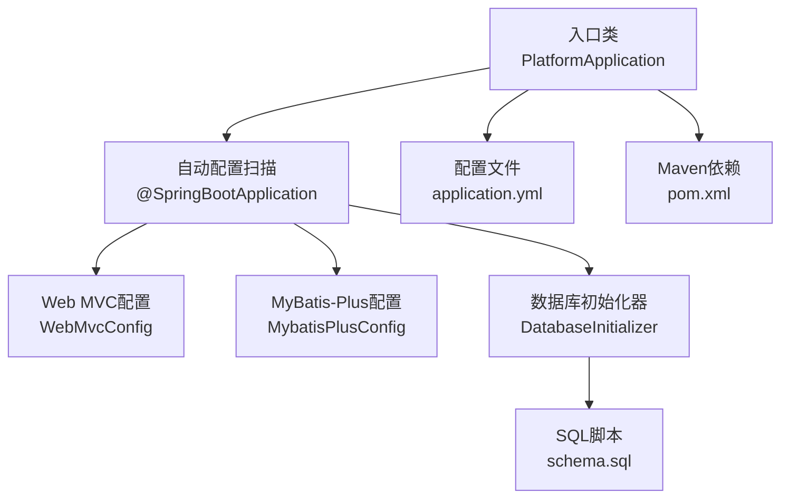
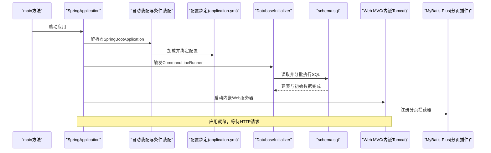
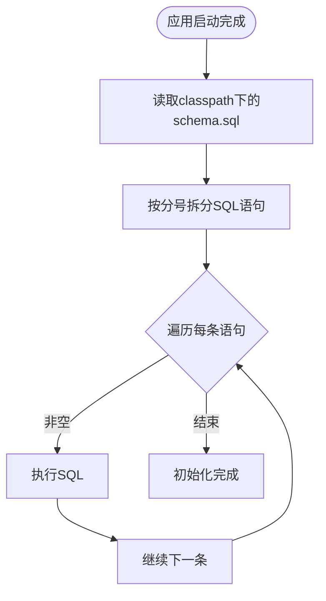
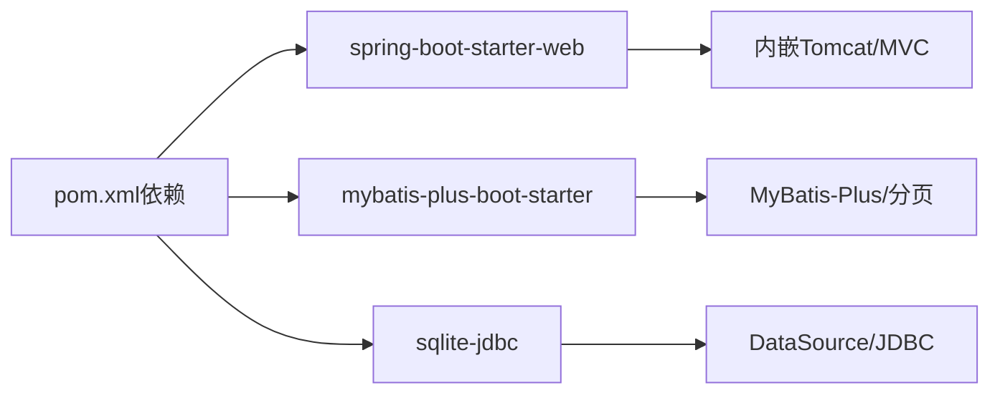

# Spring Boot应用架构

<cite>
**本文引用的文件**   
- [PlatformApplication.java](file://backend/src/main/java/com/xx/platform/PlatformApplication.java)
- [application.yml](file://backend/src/main/resources/application.yml)
- [pom.xml](file://backend/pom.xml)
- [WebMvcConfig.java](file://backend/src/main/java/com/xx/platform/config/WebMvcConfig.java)
- [MybatisPlusConfig.java](file://backend/src/main/java/com/xx/platform/config/MybatisPlusConfig.java)
- [DatabaseInitializer.java](file://backend/src/main/java/com/xx/platform/config/DatabaseInitializer.java)
- [schema.sql](file://backend/src/main/resources/schema.sql)
</cite>

## 目录
1. [简介](#简介)
2. [项目结构](#项目结构)
3. [核心组件](#核心组件)
4. [架构总览](#架构总览)
5. [详细组件分析](#详细组件分析)
6. [依赖关系分析](#依赖关系分析)
7. [性能与可观测性](#性能与可观测性)
8. [故障排查指南](#故障排查指南)
9. [结论](#结论)
10. [附录：最佳实践清单](#附录最佳实践清单)

## 简介
本文件面向JZPlatform门户系统的后端Spring Boot应用，聚焦以下目标：
- 深入解释启动类 PlatformApplication 的设计原理、@SpringBootApplication 注解的作用机制以及Spring Boot自动配置的工作原理。
- 详细说明 application.yml 的配置结构与参数含义（服务器端口、数据库连接、上传限制、日志等）。
- 阐述Spring Boot应用生命周期管理、Bean容器初始化过程与依赖注入机制的实现细节。
- 提供具体代码示例路径与最佳实践指导，帮助读者快速理解并扩展系统。

## 项目结构
后端采用典型的分层结构：入口类位于根包下，配置集中在 config 包，控制器在 controller，服务在 service 及其实现 impl，数据访问层使用 MyBatis-Plus 的 Mapper，资源文件包含 application.yml 与 schema.sql。

图表来源
- [PlatformApplication.java:1-16](file://backend/src/main/java/com/xx/platform/PlatformApplication.java#L1-L16)
- [WebMvcConfig.java:1-36](file://backend/src/main/java/com/xx/platform/config/WebMvcConfig.java#L1-L36)
- [MybatisPlusConfig.java:1-27](file://backend/src/main/java/com/xx/platform/config/MybatisPlusConfig.java#L1-L27)
- [DatabaseInitializer.java:1-45](file://backend/src/main/java/com/xx/platform/config/DatabaseInitializer.java#L1-L45)
- [schema.sql:1-80](file://backend/src/main/resources/schema.sql#L1-L80)
- [application.yml:1-29](file://backend/src/main/resources/application.yml#L1-L29)
- [pom.xml:1-79](file://backend/pom.xml#L1-L79)

章节来源
- [PlatformApplication.java:1-16](file://backend/src/main/java/com/xx/platform/PlatformApplication.java#L1-L16)
- [application.yml:1-29](file://backend/src/main/resources/application.yml#L1-L29)
- [pom.xml:1-79](file://backend/pom.xml#L1-L79)

## 核心组件
- 启动类与自动装配
  - 入口类通过 @SpringBootApplication 启用自动配置、组件扫描与配置类支持，并在 main 方法中调用 SpringApplication.run 完成应用启动。
- Web MVC配置
  - 跨域策略与静态资源映射，便于前后端分离开发与文件上传后的静态访问。
- MyBatis-Plus配置
  - 注册分页拦截器，适配SQLite方言，简化分页查询。
- 数据库初始化器
  - 应用启动后执行 schema.sql，创建表与初始数据，确保零运维部署。
- 配置中心
  - application.yml 集中管理服务器端口、数据源、上传大小、MyBatis-Plus行为与自定义上传路径。

章节来源
- [PlatformApplication.java:1-16](file://backend/src/main/java/com/xx/platform/PlatformApplication.java#L1-L16)
- [WebMvcConfig.java:1-36](file://backend/src/main/java/com/xx/platform/config/WebMvcConfig.java#L1-L36)
- [MybatisPlusConfig.java:1-27](file://backend/src/main/java/com/xx/platform/config/MybatisPlusConfig.java#L1-L27)
- [DatabaseInitializer.java:1-45](file://backend/src/main/java/com/xx/platform/config/DatabaseInitializer.java#L1-L45)
- [application.yml:1-29](file://backend/src/main/resources/application.yml#L1-L29)

## 架构总览
下图展示了从应用启动到请求处理的端到端流程，包括自动装配、配置加载、数据库初始化与Web请求处理的关键节点。

图表来源
- [PlatformApplication.java:1-16](file://backend/src/main/java/com/xx/platform/PlatformApplication.java#L1-L16)
- [application.yml:1-29](file://backend/src/main/resources/application.yml#L1-L29)
- [DatabaseInitializer.java:1-45](file://backend/src/main/java/com/xx/platform/config/DatabaseInitializer.java#L1-L45)
- [schema.sql:1-80](file://backend/src/main/resources/schema.sql#L1-L80)
- [MybatisPlusConfig.java:1-27](file://backend/src/main/java/com/xx/platform/config/MybatisPlusConfig.java#L1-L27)

## 详细组件分析

### 启动类与自动装配
- 设计要点
  - @SpringBootApplication 是组合注解，等价于开启 @EnableAutoConfiguration、@ComponentScan 与 @Configuration。
  - 默认扫描当前包及子包，发现 @Configuration、@Service、@Controller、@Mapper 等标注的组件并纳入IoC容器。
  - 自动配置基于 spring.factories 或新的导入机制，根据 classpath 与条件注解按需装配（如 DataSource、WebMvc、MyBatis-Plus 等）。
- 关键流程
  - main 方法调用 SpringApplication.run 创建 ApplicationContext，依次完成：
    - 环境准备与环境变量/配置文件加载
    - 自动配置类选择与条件匹配
    - Bean定义注册与实例化
    - 后置处理器执行（AOP、事件监听器等）
    - 启动回调（CommandLineRunner、ApplicationRunner）
    - 启动内嵌Web服务器并对外提供服务

章节来源
- [PlatformApplication.java:1-16](file://backend/src/main/java/com/xx/platform/PlatformApplication.java#L1-L16)

### @SpringBootApplication 注解机制
- 作用范围
  - 组件扫描：定位并注册业务组件与配置类。
  - 自动配置：引入大量 Starter 提供的自动配置类，按条件装配。
  - 配置类支持：允许将 @Configuration 类放在同一包下被扫描。
- 与依赖的关系
  - 通过 pom.xml 引入 spring-boot-starter-web 等 Starter，驱动自动配置生效。
  - mybatis-plus-boot-starter 会依据 datasource 的存在自动装配 MyBatis-Plus 相关组件。

章节来源
- [pom.xml:26-60](file://backend/pom.xml#L26-L60)
- [PlatformApplication.java:1-16](file://backend/src/main/java/com/xx/platform/PlatformApplication.java#L1-L16)

### Spring Boot自动配置工作原理
- 条件装配
  - 自动配置类通常带有 @ConditionalOnClass、@ConditionalOnMissingBean、@ConditionalOnProperty 等条件注解，仅在满足条件时生效。
- 配置绑定
  - 通过 @ConfigurationProperties 将 application.yml 中的键值绑定到Java对象，形成强类型配置。
- 典型装配链
  - web starter -> 内嵌Tomcat + DispatcherServlet + 视图解析器
  - datasource -> HikariCP 连接池 + JDBC Driver
  - mybatis-plus-boot-starter -> SqlSessionFactory + 分页插件 + Mapper扫描

章节来源
- [pom.xml:26-60](file://backend/pom.xml#L26-L60)
- [application.yml:1-29](file://backend/src/main/resources/application.yml#L1-L29)

### application.yml 配置详解
- 服务器
  - server.port：指定内嵌Web服务器监听端口。
- 数据源
  - spring.datasource.url：SQLite数据库文件路径。
  - spring.datasource.driver-class-name：JDBC驱动类名。
- 上传限制
  - spring.servlet.multipart.max-file-size / max-request-size：控制单文件与单次请求最大大小。
- MyBatis-Plus
  - mapper-locations：XML映射文件位置。
  - configuration.map-underscore-to-camel-case：驼峰命名映射。
  - configuration.log-impl：控制台输出SQL日志。
  - global-config.db-config.id-type：主键生成策略（SQLite使用自增）。
- 自定义配置
  - upload.path：上传文件存储路径，配合静态资源映射对外暴露。

章节来源
- [application.yml:1-29](file://backend/src/main/resources/application.yml#L1-L29)

### Web MVC配置（跨域与静态资源）
- CORS跨域
  - 对 /api/** 开放跨域，允许常用方法与携带凭证，设置预检缓存时间。
- 静态资源映射
  - 将 /uploads/** 映射到本地 ./uploads/ 目录，用于访问上传的文件。

章节来源
- [WebMvcConfig.java:1-36](file://backend/src/main/java/com/xx/platform/config/WebMvcConfig.java#L1-L36)
- [application.yml:26-29](file://backend/src/main/resources/application.yml#L26-L29)

### MyBatis-Plus配置（分页插件）
- 注册 MybatisPlusInterceptor 并添加 PaginationInnerInterceptor，指定 SQLite 方言以正确生成分页SQL。
- 与 application.yml 的 map-underscore-to-camel-case 配合，提升开发体验。

章节来源
- [MybatisPlusConfig.java:1-27](file://backend/src/main/java/com/xx/platform/config/MybatisPlusConfig.java#L1-L27)
- [application.yml:15-24](file://backend/src/main/resources/application.yml#L15-L24)

### 数据库初始化器（CommandLineRunner）
- 启动后读取 classpath 下的 schema.sql，按分号拆分语句并逐条执行，完成建表与初始数据插入。
- 使用 try-with-resources 保证连接与语句关闭，避免资源泄漏。

图表来源
- [DatabaseInitializer.java:1-45](file://backend/src/main/java/com/xx/platform/config/DatabaseInitializer.java#L1-L45)
- [schema.sql:1-80](file://backend/src/main/resources/schema.sql#L1-L80)

章节来源
- [DatabaseInitializer.java:1-45](file://backend/src/main/java/com/xx/platform/config/DatabaseInitializer.java#L1-L45)
- [schema.sql:1-80](file://backend/src/main/resources/schema.sql#L1-L80)

### 依赖注入与Bean容器初始化
- 组件发现
  - 通过 @SpringBootApplication 的组件扫描，发现 @Configuration、@Service、@RestController、@Mapper 等组件。
- 依赖注入
  - 使用 @Autowired 进行字段注入；构造器注入为更推荐的替代方案，有助于不可变性与测试友好。
- 生命周期钩子
  - CommandLineRunner 在容器启动完成后执行，适合做一次性初始化任务（如本项目的数据库初始化）。

章节来源
- [PlatformApplication.java:1-16](file://backend/src/main/java/com/xx/platform/PlatformApplication.java#L1-L16)
- [DatabaseInitializer.java:1-45](file://backend/src/main/java/com/xx/platform/config/DatabaseInitializer.java#L1-L45)

## 依赖关系分析
- 构建与依赖
  - 基于 spring-boot-starter-parent 统一管理版本。
  - 引入 spring-boot-starter-web 提供Web能力；mybatis-plus-boot-starter 提供ORM与分页；sqlite-jdbc 提供SQLite驱动；lombok 辅助代码生成；spring-boot-starter-test 提供测试能力。
- 自动装配触发点
  - web starter 触发内嵌Tomcat与MVC自动配置。
  - datasource 存在且驱动在 classpath 时，自动装配DataSource与连接池。
  - mybatis-plus-boot-starter 检测SqlSessionFactory与Mapper接口，自动装配分页插件与XML映射扫描。

图表来源
- [pom.xml:26-60](file://backend/pom.xml#L26-L60)

章节来源
- [pom.xml:1-79](file://backend/pom.xml#L1-L79)

## 性能与可观测性
- 连接池
  - 默认使用HikariCP，具备高性能与低延迟特性；生产环境建议显式配置连接池参数（如最大连接数、空闲超时等）。
- 日志
  - 当前使用MyBatis-Plus控制台打印SQL，便于开发调试；生产建议切换至结构化日志框架（如Logback），并按模块分级输出。
- 静态资源
  - 上传目录通过静态资源映射暴露，生产环境建议结合CDN或独立对象存储，减少后端压力。
- 分页
  - 已启用分页插件，注意大表分页应结合索引优化与合理页大小。

[本节为通用建议，不直接分析具体文件]

## 故障排查指南
- 启动失败：找不到数据库驱动
  - 检查 sqlite-jdbc 依赖是否引入，driver-class-name 是否正确。
- 启动失败：端口占用
  - 修改 server.port 或释放占用端口。
- 上传失败：文件大小超限
  - 调整 spring.servlet.multipart 的 max-file-size 与 max-request-size。
- 静态资源无法访问
  - 确认 WebMvcConfig 的资源映射路径与 upload.path 一致，并确保目录存在且有读写权限。
- SQL执行异常
  - 检查 schema.sql 语法与SQLite兼容性；确认 DatabaseInitializer 的执行顺序与异常处理。

章节来源
- [application.yml:1-29](file://backend/src/main/resources/application.yml#L1-L29)
- [WebMvcConfig.java:1-36](file://backend/src/main/java/com/xx/platform/config/WebMvcConfig.java#L1-L36)
- [DatabaseInitializer.java:1-45](file://backend/src/main/java/com/xx/platform/config/DatabaseInitializer.java#L1-L45)
- [schema.sql:1-80](file://backend/src/main/resources/schema.sql#L1-L80)

## 结论
本项目以最小化配置快速搭建了一个功能完备的Spring Boot应用：通过 @SpringBootApplication 完成自动装配与组件扫描，借助 application.yml 集中管理运行期配置，使用 MyBatis-Plus 简化数据访问，并通过 CommandLineRunner 实现“开箱即用”的数据库初始化。整体架构清晰、职责分明，具备良好的可扩展性与可维护性。

[本节为总结性内容，不直接分析具体文件]

## 附录：最佳实践清单
- 启动类
  - 保持简洁，仅负责启动；将配置与扩展点放入独立的配置类。
- 自动配置
  - 优先使用Starter；必要时通过 @ConditionalOnXxx 精确控制装配条件。
- 配置管理
  - 使用 @ConfigurationProperties 绑定配置；区分 dev/test/prod 多环境配置。
- 依赖注入
  - 优先构造器注入，提高可测试性与不可变性。
- 安全与健壮性
  - 对上传目录进行权限控制与病毒扫描；对SQL执行增加事务与错误回滚。
- 可观测性
  - 接入健康检查与指标采集；统一日志格式与告警策略。

[本节为通用建议，不直接分析具体文件]