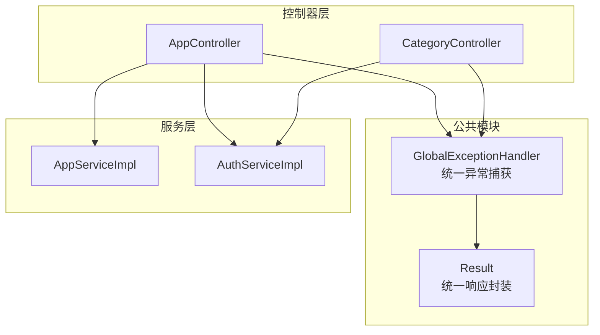
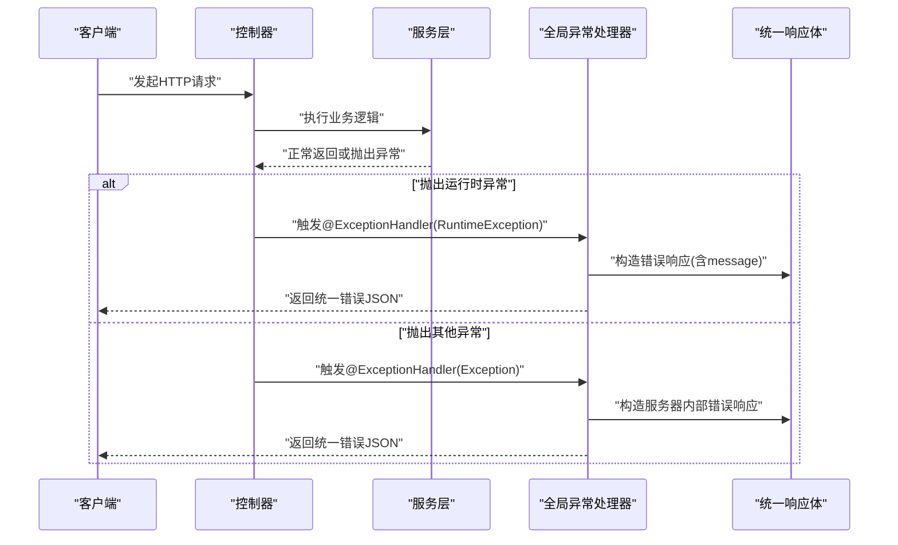
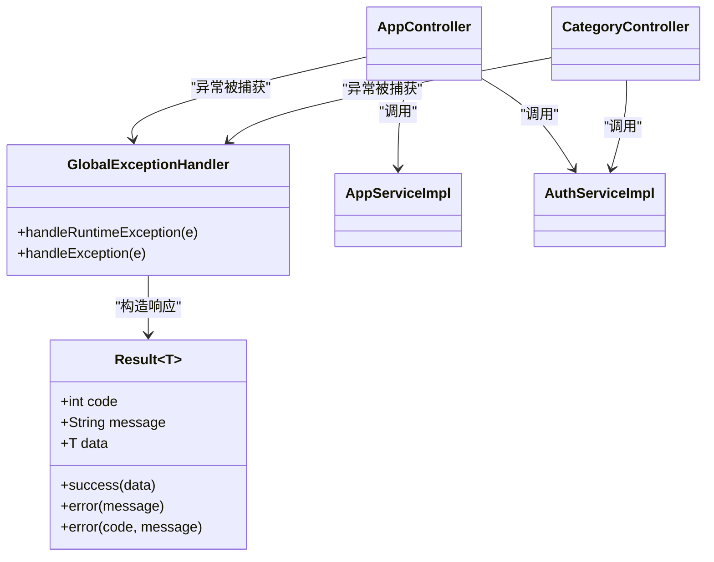

# 全局异常处理机制

<cite>
**本文引用的文件**   
- [GlobalExceptionHandler.java](file://backend/src/main/java/com/xx/platform/common/GlobalExceptionHandler.java)
- [Result.java](file://backend/src/main/java/com/xx/platform/common/Result.java)
- [AppController.java](file://backend/src/main/java/com/xx/platform/controller/AppController.java)
- [CategoryController.java](file://backend/src/main/java/com/xx/platform/controller/CategoryController.java)
- [AuthServiceImpl.java](file://backend/src/main/java/com/xx/platform/service/impl/AuthServiceImpl.java)
- [AppServiceImpl.java](file://backend/src/main/java/com/xx/platform/service/impl/AppServiceImpl.java)
- [API.md](file://API.md)
</cite>

## 目录
1. [简介](#简介)
2. [项目结构](#项目结构)
3. [核心组件](#核心组件)
4. [架构总览](#架构总览)
5. [详细组件分析](#详细组件分析)
6. [依赖关系分析](#依赖关系分析)
7. [性能与可观测性](#性能与可观测性)
8. [故障排查指南](#故障排查指南)
9. [结论](#结论)
10. [附录：错误码规范与最佳实践](#附录错误码规范与最佳实践)

## 简介
本文件面向JZPlatform门户系统的全局异常处理机制，围绕统一异常捕获、分类处理策略、统一响应格式、错误码规范、日志记录与监控告警、调试信息收集以及最佳实践进行系统化说明。文档以现有实现为基础，给出可扩展的演进建议，帮助读者在保持向后兼容的前提下完善异常治理体系。

## 项目结构
后端采用Spring Boot分层架构，异常处理集中在common包中，控制器与服务层通过抛出运行时异常表达业务语义，由全局异常处理器统一拦截并转换为标准响应体。

图表来源
- [GlobalExceptionHandler.java:1-29](file://backend/src/main/java/com/xx/platform/common/GlobalExceptionHandler.java#L1-L29)
- [Result.java:1-52](file://backend/src/main/java/com/xx/platform/common/Result.java#L1-L52)
- [AppController.java:1-111](file://backend/src/main/java/com/xx/platform/controller/AppController.java#L1-L111)
- [CategoryController.java:1-78](file://backend/src/main/java/com/xx/platform/controller/CategoryController.java#L1-L78)
- [AppServiceImpl.java:1-105](file://backend/src/main/java/com/xx/platform/service/impl/AppServiceImpl.java#L1-L50)
- [AuthServiceImpl.java:1-62](file://backend/src/main/java/com/xx/platform/service/impl/AuthServiceImpl.java#L1-L62)

章节来源
- [GlobalExceptionHandler.java:1-29](file://backend/src/main/java/com/xx/platform/common/GlobalExceptionHandler.java#L1-L29)
- [Result.java:1-52](file://backend/src/main/java/com/xx/platform/common/Result.java#L1-L52)
- [AppController.java:1-111](file://backend/src/main/java/com/xx/platform/controller/AppController.java#L1-L111)
- [CategoryController.java:1-78](file://backend/src/main/java/com/xx/platform/controller/CategoryController.java#L1-L78)
- [AppServiceImpl.java:1-105](file://backend/src/main/java/com/xx/platform/service/impl/AppServiceImpl.java#L1-L105)
- [AuthServiceImpl.java:1-62](file://backend/src/main/java/com/xx/platform/service/impl/AuthServiceImpl.java#L1-L62)

## 核心组件
- 全局异常处理器：基于注解驱动的统一异常拦截器，负责将不同异常映射为统一的响应对象。
- 统一响应体：定义code/message/data三字段的标准返回结构，贯穿所有接口。

章节来源
- [GlobalExceptionHandler.java:1-29](file://backend/src/main/java/com/xx/platform/common/GlobalExceptionHandler.java#L1-L29)
- [Result.java:1-52](file://backend/src/main/java/com/xx/platform/common/Result.java#L1-L52)

## 架构总览
下图展示了请求从进入控制器到异常被全局处理器捕获并返回统一响应的完整流程。

图表来源
- [GlobalExceptionHandler.java:10-28](file://backend/src/main/java/com/xx/platform/common/GlobalExceptionHandler.java#L10-L28)
- [Result.java:23-51](file://backend/src/main/java/com/xx/platform/common/Result.java#L23-L51)

## 详细组件分析

### 全局异常处理器（GlobalExceptionHandler）
- 设计要点
  - 使用注解声明类级别的全局拦截能力，使所有控制器抛出的异常均可被集中处理。
  - 针对运行时异常提供专用处理方法，优先匹配具体异常类型，便于后续扩展更细粒度的业务异常分支。
  - 兜底方法捕获所有未处理异常，确保系统稳定性与一致的错误展示。
- 当前行为
  - 运行时异常：直接提取消息作为错误提示返回。
  - 其他异常：打印堆栈并返回“服务器内部错误”提示。
- 改进建议
  - 引入自定义业务异常基类，区分业务异常与系统异常，避免用通用运行时异常承载业务语义。
  - 增加参数校验异常处理器，统一返回友好的校验错误集合。
  - 在异常处理器中集成结构化日志与追踪ID，便于问题定位。
  - 对敏感信息进行脱敏，避免将内部细节暴露给前端。

章节来源
- [GlobalExceptionHandler.java:10-28](file://backend/src/main/java/com/xx/platform/common/GlobalExceptionHandler.java#L10-L28)

### 统一响应体（Result）
- 设计要点
  - 固定三字段结构：状态码、提示信息、数据载荷，保证前后端契约稳定。
  - 提供便捷工厂方法用于成功与失败场景的快速构建。
- 当前行为
  - 成功：默认状态码200，提示“操作成功”，data可为空。
  - 失败：默认状态码500，message来自异常或调用方传入。
- 改进建议
  - 将状态码抽取为枚举或常量，形成企业级错误码字典，支持按领域划分。
  - 增加可选字段如traceId、timestamp等，增强可观测性与排障效率。
  - 对分页、列表等常见数据结构提供专用包装方法，减少样板代码。

章节来源
- [Result.java:10-51](file://backend/src/main/java/com/xx/platform/common/Result.java#L10-L51)

### 控制器中的异常抛出模式
- 认证与权限控制
  - 控制器在缺少令牌或角色不匹配时抛出运行时异常，交由全局处理器统一返回错误。
- 典型路径
  - 应用管理控制器：管理员操作前校验令牌与角色，不满足则抛出运行时异常。
  - 分类管理控制器：同样在管理员入口进行鉴权校验。
- 影响
  - 由于当前全局处理器仅捕获运行时异常，上述路径会落入业务异常分支；若未来引入更具体的业务异常类型，可在处理器中新增对应分支以提升可读性与可维护性。

章节来源
- [AppController.java:98-109](file://backend/src/main/java/com/xx/platform/controller/AppController.java#L98-L109)
- [CategoryController.java:72-76](file://backend/src/main/java/com/xx/platform/controller/CategoryController.java#L72-L76)

### 服务层的异常抛出模式
- 认证服务
  - 登录失败时抛出运行时异常，携带明确的用户可见提示。
- 应用服务
  - 查询不存在的应用时抛出运行时异常，便于上层快速感知资源缺失。
- 影响
  - 这些异常最终由全局处理器捕获并转为统一错误响应，保证对外一致性。

章节来源
- [AuthServiceImpl.java:36-38](file://backend/src/main/java/com/xx/platform/service/impl/AuthServiceImpl.java#L36-L38)
- [AppServiceImpl.java:67-69](file://backend/src/main/java/com/xx/platform/service/impl/AppServiceImpl.java#L67-L69)

### 统一错误响应格式与错误码规范
- 统一格式
  - 字段：code、message、data
  - 成功：code=200，message="操作成功"
  - 失败：默认code=500，message为错误描述
- 错误码规范（建议）
  - 200：成功
  - 400：参数校验失败
  - 401：未认证/令牌无效
  - 403：无权限
  - 404：资源不存在
  - 500：服务器内部错误
  - 业务域错误码：1xxxx（例如用户域10xxx、应用域11xxx），便于前端差异化处理
- 参考约定
  - API文档定义了统一响应格式与基础URL、认证方式等，异常响应应遵循同一结构。

章节来源
- [Result.java:23-51](file://backend/src/main/java/com/xx/platform/common/Result.java#L23-L51)
- [API.md:1-6](file://API.md#L1-L6)

### 异常日志记录、监控告警与调试信息收集
- 现状
  - 全局处理器对兜底异常执行了堆栈打印，便于本地调试，但不利于生产环境日志聚合与监控。
- 建议方案
  - 使用结构化日志框架输出关键上下文：请求ID、URI、方法、参数摘要、用户标识、耗时、异常类型与消息。
  - 接入AOP或过滤器生成traceId，并在异常处理器中注入到响应头或日志中。
  - 对高频错误与严重错误设置阈值告警，结合指标采集上报监控系统。
  - 对敏感字段（密码、密钥、个人信息）进行脱敏后再落盘。

[本节为通用建议，不直接分析具体文件]

### 异常处理示例与最佳实践
- 示例一：认证失败
  - 控制器在鉴权失败时抛出运行时异常，全局处理器将其转换为统一错误响应，前端根据code与message提示用户重新登录。
- 示例二：资源不存在
  - 服务层在查询不到数据时抛出运行时异常，全局处理器返回错误响应，前端可据此引导用户刷新或返回首页。
- 最佳实践
  - 使用自定义业务异常替代通用运行时异常，提升可读性与可维护性。
  - 在异常处理器中按异常类型分流，分别记录不同级别的日志与指标。
  - 对参数校验异常单独处理，返回详细的字段级错误信息。
  - 避免在错误消息中泄露内部实现细节，必要时提供错误码供前端国际化与跳转。

章节来源
- [AppController.java:101-108](file://backend/src/main/java/com/xx/platform/controller/AppController.java#L101-L108)
- [AuthServiceImpl.java:36-38](file://backend/src/main/java/com/xx/platform/service/impl/AuthServiceImpl.java#L36-L38)
- [AppServiceImpl.java:67-69](file://backend/src/main/java/com/xx/platform/service/impl/AppServiceImpl.java#L67-L69)

## 依赖关系分析
- 耦合与内聚
  - 全局异常处理器与统一响应体强相关，职责单一且内聚良好。
  - 控制器与服务层通过异常传递业务语义，降低了对异常处理的侵入性。
- 外部依赖
  - Spring MVC提供的注解式异常处理能力是核心支撑。
- 潜在风险
  - 当前仅捕获运行时异常，若未来出现非运行时异常（如受检异常或框架抛出的特定异常），需补充相应处理器以避免意外500。

图表来源
- [GlobalExceptionHandler.java:10-28](file://backend/src/main/java/com/xx/platform/common/GlobalExceptionHandler.java#L10-L28)
- [Result.java:10-51](file://backend/src/main/java/com/xx/platform/common/Result.java#L10-L51)
- [AppController.java:1-111](file://backend/src/main/java/com/xx/platform/controller/AppController.java#L1-L111)
- [CategoryController.java:1-78](file://backend/src/main/java/com/xx/platform/controller/CategoryController.java#L1-L78)
- [AppServiceImpl.java:1-105](file://backend/src/main/java/com/xx/platform/service/impl/AppServiceImpl.java#L1-L105)
- [AuthServiceImpl.java:1-62](file://backend/src/main/java/com/xx/platform/service/impl/AuthServiceImpl.java#L1-L62)

## 性能与可观测性
- 性能
  - 异常路径属于非主流程，通常开销较小；但应避免在异常处理器中进行重型I/O或复杂计算。
- 可观测性
  - 建议在异常处理器中输出结构化日志，包含请求上下文与异常详情（脱敏后）。
  - 对接监控系统，统计各类异常的频次与趋势，设置告警阈值。
  - 为关键接口添加耗时埋点，结合异常率评估健康度。

[本节为通用建议，不直接分析具体文件]

## 故障排查指南
- 常见问题
  - 前端收到500但message为空：检查异常消息是否被覆盖或脱敏过度。
  - 鉴权失败仍返回成功：确认控制器是否正确抛出异常，以及全局处理器是否生效。
  - 参数校验错误未返回字段级错误：需补充参数校验异常处理器。
- 定位步骤
  - 查看服务端日志中的异常堆栈与上下文信息。
  - 核对请求参数与鉴权头是否符合预期。
  - 复现最小用例，逐步缩小范围至具体控制器或服务方法。
- 改进措施
  - 引入traceId贯穿请求链路，便于跨服务关联日志。
  - 在异常处理器中增加更丰富的上下文信息输出。
  - 建立错误码与错误消息的对照表，统一对外文案。

章节来源
- [GlobalExceptionHandler.java:24-28](file://backend/src/main/java/com/xx/platform/common/GlobalExceptionHandler.java#L24-L28)

## 结论
当前全局异常处理机制已具备统一拦截与标准化返回的基础能力，能够保障基本的一致性与可用性。为进一步增强可维护性与可观测性，建议引入自定义业务异常、参数校验异常处理器、结构化日志与监控告警，并完善错误码规范与调试信息收集。通过这些改进，系统将在稳定性、可诊断性与用户体验方面获得显著提升。

## 附录：错误码规范与最佳实践
- 错误码分层
  - 通用错误码：200/400/401/403/404/500
  - 业务错误码：1xxxx（按领域细分）
- 错误消息原则
  - 对用户友好、不含内部细节、可指导下一步操作
- 日志与监控
  - 结构化日志、traceId、分级告警、错误率与耗时指标
- 开发规范
  - 控制器与服务层只关注业务语义，异常类型表达意图
  - 全局处理器专注统一转换与可观测性增强
  - 前端按错误码与message进行差异化处理与国际化

[本节为通用建议，不直接分析具体文件]