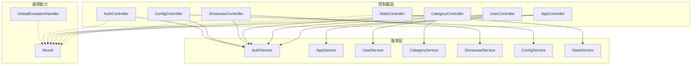
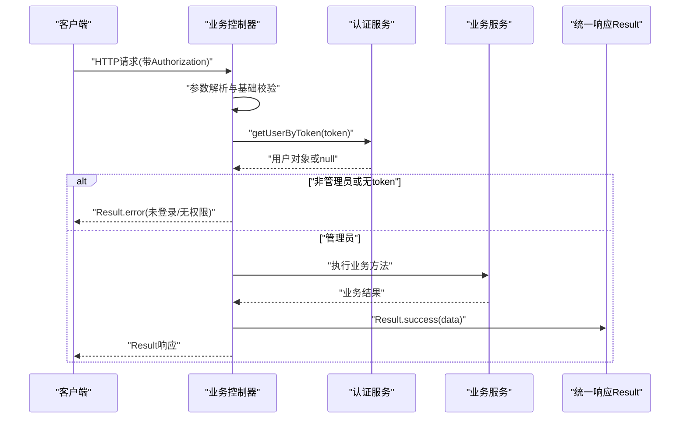
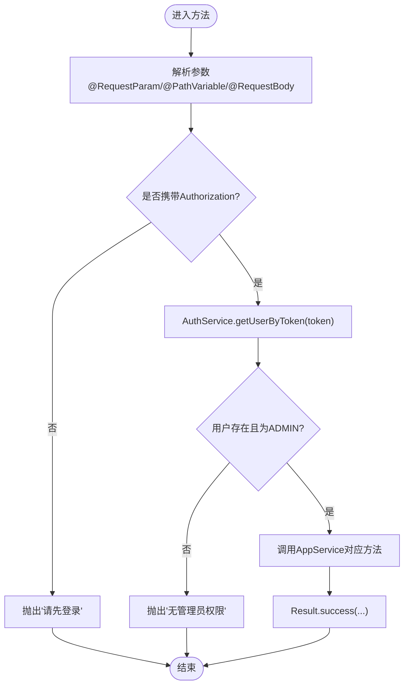
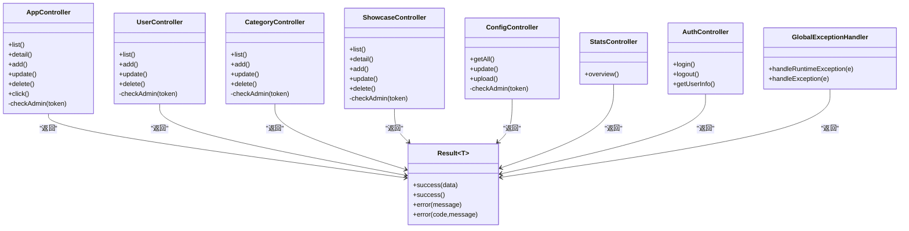

# Controller层设计

<cite>
**本文引用的文件**   
- [AppController.java](file://backend/src/main/java/com/xx/platform/controller/AppController.java)
- [AuthController.java](file://backend/src/main/java/com/xx/platform/controller/AuthController.java)
- [UserController.java](file://backend/src/main/java/com/xx/platform/controller/UserController.java)
- [CategoryController.java](file://backend/src/main/java/com/xx/platform/controller/CategoryController.java)
- [ConfigController.java](file://backend/src/main/java/com/xx/platform/controller/ConfigController.java)
- [ShowcaseController.java](file://backend/src/main/java/com/xx/platform/controller/ShowcaseController.java)
- [StatsController.java](file://backend/src/main/java/com/xx/platform/controller/StatsController.java)
- [Result.java](file://backend/src/main/java/com/xx/platform/common/Result.java)
- [GlobalExceptionHandler.java](file://backend/src/main/java/com/xx/platform/common/GlobalExceptionHandler.java)
- [API.md](file://API.md)
</cite>

## 目录
1. [引言](#引言)
2. [项目结构](#项目结构)
3. [核心组件](#核心组件)
4. [架构总览](#架构总览)
5. [详细组件分析](#详细组件分析)
6. [依赖关系分析](#依赖关系分析)
7. [性能与可扩展性](#性能与可扩展性)
8. [故障排查指南](#故障排查指南)
9. [结论](#结论)
10. [附录：接口规范与最佳实践](#附录接口规范与最佳实践)

## 引言
本设计文档聚焦JZPlatform门户系统的Controller层，阐述其在MVC架构中的职责边界与实现策略：处理HTTP请求、参数校验、调用Service层、返回统一响应格式。同时总结RESTful API设计规范（URL路径、HTTP方法、状态码），并结合具体控制器示例说明分页查询、权限校验、CRUD操作以及常用注解的使用方式。最后给出管理员权限验证机制、异常处理策略，以及接口文档生成与API测试的最佳实践建议。

## 项目结构
后端采用Spring Boot + MyBatis-Plus分层架构，Controller位于com.xx.platform.controller包下，负责接收请求并委托Service完成业务逻辑；统一响应封装在common.Result中；全局异常处理在common.GlobalExceptionHandler中。

图表来源
- [AppController.java:1-111](file://backend/src/main/java/com/xx/platform/controller/AppController.java#L1-L111)
- [UserController.java:1-88](file://backend/src/main/java/com/xx/platform/controller/UserController.java#L1-L88)
- [CategoryController.java:1-78](file://backend/src/main/java/com/xx/platform/controller/CategoryController.java#L1-L78)
- [ShowcaseController.java:1-87](file://backend/src/main/java/com/xx/platform/controller/ShowcaseController.java#L1-L87)
- [ConfigController.java:1-76](file://backend/src/main/java/com/xx/platform/controller/ConfigController.java#L1-L76)
- [StatsController.java:1-32](file://backend/src/main/java/com/xx/platform/controller/StatsController.java#L1-L32)
- [AuthController.java:1-68](file://backend/src/main/java/com/xx/platform/controller/AuthController.java#L1-L68)
- [Result.java:1-53](file://backend/src/main/java/com/xx/platform/common/Result.java#L1-L53)
- [GlobalExceptionHandler.java:1-30](file://backend/src/main/java/com/xx/platform/common/GlobalExceptionHandler.java#L1-L30)

章节来源
- [AppController.java:1-111](file://backend/src/main/java/com/xx/platform/controller/AppController.java#L1-L111)
- [Result.java:1-53](file://backend/src/main/java/com/xx/platform/common/Result.java#L1-L53)
- [GlobalExceptionHandler.java:1-30](file://backend/src/main/java/com/xx/platform/common/GlobalExceptionHandler.java#L1-L30)

## 核心组件
- 统一响应体 Result<T>：提供成功/失败构造器，包含code、message、data字段，用于前后端一致的响应格式。
- 全局异常处理器 GlobalExceptionHandler：捕获运行时异常和未处理异常，统一转换为Result错误响应，避免将堆栈信息直接暴露给客户端。
- 认证控制器 AuthController：提供登录、登出、获取当前用户信息接口，作为后续权限校验的基础。
- 各业务控制器：AppController、UserController、CategoryController、ShowcaseController、ConfigController、StatsController，分别对应应用管理、用户管理、分类管理、宣贯数据、平台配置、统计等模块。

章节来源
- [Result.java:1-53](file://backend/src/main/java/com/xx/platform/common/Result.java#L1-L53)
- [GlobalExceptionHandler.java:1-30](file://backend/src/main/java/com/xx/platform/common/GlobalExceptionHandler.java#L1-L30)
- [AuthController.java:1-68](file://backend/src/main/java/com/xx/platform/controller/AuthController.java#L1-L68)

## 架构总览
Controller层在MVC中的职责：
- 解析请求：使用@PathVariable、@RequestParam、@RequestBody、@RequestHeader等注解绑定参数与请求头。
- 参数校验：对必填参数进行基础校验，缺失时返回友好提示。
- 权限校验：通过Authorization请求头携带token，调用AuthService.getUserByToken(token)解析用户角色，仅ADMIN可执行写操作。
- 调用Service：将业务逻辑下沉至Service层，Controller保持薄控制。
- 统一响应：所有接口返回Result<T>，保证前端一致处理。

图表来源
- [AppController.java:55-86](file://backend/src/main/java/com/xx/platform/controller/AppController.java#L55-L86)
- [UserController.java:42-73](file://backend/src/main/java/com/xx/platform/controller/UserController.java#L42-L73)
- [CategoryController.java:39-70](file://backend/src/main/java/com/xx/platform/controller/CategoryController.java#L39-L70)
- [ShowcaseController.java:48-79](file://backend/src/main/java/com/xx/platform/controller/ShowcaseController.java#L48-L79)
- [ConfigController.java:43-68](file://backend/src/main/java/com/xx/platform/controller/ConfigController.java#L43-L68)
- [AuthController.java:28-66](file://backend/src/main/java/com/xx/platform/controller/AuthController.java#L28-L66)
- [Result.java:24-51](file://backend/src/main/java/com/xx/platform/common/Result.java#L24-L51)

## 详细组件分析

### AppController（Web应用管理）
职责与要点：
- 公开接口：应用列表（支持分页、筛选、排序）、详情、点击记录。
- 管理员接口：新增、编辑、删除。
- 分页查询：使用MyBatis-Plus的Page对象，结合@RequestParam传入page、size、categoryId、keyword、sortField、sortOrder。
- 权限校验：内部checkAdmin方法基于Authorization头解析用户角色，非ADMIN抛出运行时异常，由全局异常处理器统一返回错误。
- 注解使用：
  - @GetMapping/@PostMapping/@PutMapping/@DeleteMapping定义RESTful路径与方法。
  - @RequestParam用于查询参数，支持默认值与可选。
  - @PathVariable用于路径变量。
  - @RequestBody用于JSON请求体。
  - @RequestHeader用于读取Authorization头。

图表来源
- [AppController.java:27-96](file://backend/src/main/java/com/xx/platform/controller/AppController.java#L27-L96)
- [AppController.java:99-109](file://backend/src/main/java/com/xx/platform/controller/AppController.java#L99-L109)

章节来源
- [AppController.java:1-111](file://backend/src/main/java/com/xx/platform/controller/AppController.java#L1-L111)

### UserController（用户管理）
职责与要点：
- 管理员专用：用户列表（分页）、新增、编辑、删除。
- 权限校验：复用checkAdmin模式，确保只有ADMIN可访问。
- 注解使用：@RequestParam分页参数、@RequestBody用户对象、@PathVariable更新/删除ID。

章节来源
- [UserController.java:1-88](file://backend/src/main/java/com/xx/platform/controller/UserController.java#L1-L88)

### CategoryController（应用分类）
职责与要点：
- 公开接口：分类列表。
- 管理员接口：新增、编辑、删除。
- 注解使用：@RequestParam可选过滤、@RequestBody分类对象、@PathVariable资源ID。

章节来源
- [CategoryController.java:1-78](file://backend/src/main/java/com/xx/platform/controller/CategoryController.java#L1-L78)

### ShowcaseController（宣贯数据）
职责与要点：
- 公开接口：按类别获取列表、详情。
- 管理员接口：新增、编辑、删除。
- 注解使用：@RequestParam可选category、@RequestBody实体对象、@PathVariable ID。

章节来源
- [ShowcaseController.java:1-87](file://backend/src/main/java/com/xx/platform/controller/ShowcaseController.java#L1-L87)

### ConfigController（平台配置）
职责与要点：
- 公开接口：获取所有配置。
- 管理员接口：批量更新配置、上传文件（logo_path/bg_image）。
- 注解使用：@RequestBody Map<String,String>键值对、@RequestParam("file") MultipartFile、@RequestHeader token校验。

章节来源
- [ConfigController.java:1-76](file://backend/src/main/java/com/xx/platform/controller/ConfigController.java#L1-L76)

### StatsController（统计）
职责与要点：
- 公开接口：平台总览统计。
- 注解使用：简单GET映射到overview方法，返回聚合统计Map。

章节来源
- [StatsController.java:1-32](file://backend/src/main/java/com/xx/platform/controller/StatsController.java#L1-L32)

### AuthController（认证）
职责与要点：
- 登录：POST /api/auth/login，校验用户名密码，返回token与用户信息。
- 登出：POST /api/auth/logout，服务端无需持久化失效（简单实现）。
- 获取当前用户：GET /api/auth/info，从Authorization头解析token并返回用户信息（不含密码）。

章节来源
- [AuthController.java:1-68](file://backend/src/main/java/com/xx/platform/controller/AuthController.java#L1-L68)

## 依赖关系分析
- 控制器与服务层解耦：每个控制器仅持有对应Service与AuthService引用，职责单一。
- 统一响应与异常处理：所有控制器返回Result<T>，异常由GlobalExceptionHandler统一捕获并转为Result错误响应。
- 权限校验集中化：各控制器通过私有checkAdmin方法复用相同逻辑，便于后续迁移到AOP拦截器或自定义注解。

图表来源
- [AppController.java:1-111](file://backend/src/main/java/com/xx/platform/controller/AppController.java#L1-L111)
- [UserController.java:1-88](file://backend/src/main/java/com/xx/platform/controller/UserController.java#L1-L88)
- [CategoryController.java:1-78](file://backend/src/main/java/com/xx/platform/controller/CategoryController.java#L1-L78)
- [ShowcaseController.java:1-87](file://backend/src/main/java/com/xx/platform/controller/ShowcaseController.java#L1-L87)
- [ConfigController.java:1-76](file://backend/src/main/java/com/xx/platform/controller/ConfigController.java#L1-L76)
- [StatsController.java:1-32](file://backend/src/main/java/com/xx/platform/controller/StatsController.java#L1-L32)
- [AuthController.java:1-68](file://backend/src/main/java/com/xx/platform/controller/AuthController.java#L1-L68)
- [Result.java:1-53](file://backend/src/main/java/com/xx/platform/common/Result.java#L1-L53)
- [GlobalExceptionHandler.java:1-30](file://backend/src/main/java/com/xx/platform/common/GlobalExceptionHandler.java#L1-L30)

章节来源
- [AppController.java:1-111](file://backend/src/main/java/com/xx/platform/controller/AppController.java#L1-L111)
- [Result.java:1-53](file://backend/src/main/java/com/xx/platform/common/Result.java#L1-L53)
- [GlobalExceptionHandler.java:1-30](file://backend/src/main/java/com/xx/platform/common/GlobalExceptionHandler.java#L1-L30)

## 性能与可扩展性
- 分页查询：AppController.list使用MyBatis-Plus Page对象，合理设置默认size，避免一次性加载过多数据。
- 缓存建议：对热点数据（如分类列表、平台配置、统计概览）引入缓存层，降低数据库压力。
- 异步处理：点击计数等非关键路径可考虑异步写入，提升响应速度。
- 扩展点：将checkAdmin迁移为AOP切面或自定义注解（如@RequireAdmin），减少重复代码，提高一致性。

[本节为通用指导，不直接分析具体文件]

## 故障排查指南
- 未登录或无权限：当Authorization缺失或角色非ADMIN时，控制器会抛出运行时异常，全局异常处理器将其转换为Result错误响应。检查请求头是否正确传递token。
- 参数缺失：对于必填参数（如登录的用户名和密码），若为空则直接返回错误提示。确认前端传参完整。
- 服务器内部错误：未捕获异常会被GlobalExceptionHandler统一处理，打印堆栈并返回友好消息。查看后端日志定位问题。

章节来源
- [GlobalExceptionHandler.java:16-28](file://backend/src/main/java/com/xx/platform/common/GlobalExceptionHandler.java#L16-L28)
- [AppController.java:99-109](file://backend/src/main/java/com/xx/platform/controller/AppController.java#L99-L109)
- [AuthController.java:28-66](file://backend/src/main/java/com/xx/platform/controller/AuthController.java#L28-L66)

## 结论
Controller层在本项目中遵循清晰的职责划分：薄控制、强校验、统一响应、权限前置。通过统一的Result与GlobalExceptionHandler，保证了前后端交互的一致性与健壮性。RESTful路径与方法使用规范明确，便于文档化与自动化测试。后续可通过AOP与注解进一步抽象权限校验，提升可维护性与扩展性。

[本节为总结，不直接分析具体文件]

## 附录：接口规范与最佳实践

### RESTful API设计规范
- URL路径：
  - 资源名词复数形式，如/api/apps、/api/users、/api/categories、/api/showcase、/api/config、/api/stats。
  - 子资源嵌套表达层级关系，如/api/apps/{id}/click。
- HTTP方法：
  - GET：查询（列表、详情、统计）。
  - POST：新增、提交动作（如点击记录）。
  - PUT：全量更新。
  - DELETE：删除。
- 状态码与响应体：
  - 业务状态码集中在Result.code中（如200成功、401未登录、500服务器错误）。
  - message描述人类可读信息，data承载业务数据。
- 认证方式：
  - Authorization请求头携带token，服务端解析后判断角色。

章节来源
- [API.md:1-197](file://API.md#L1-L197)
- [AppController.java:17-96](file://backend/src/main/java/com/xx/platform/controller/AppController.java#L17-L96)
- [AuthController.java:15-66](file://backend/src/main/java/com/xx/platform/controller/AuthController.java#L15-L66)

### 注解使用速查
- @PathVariable：路径变量，如/{id}。
- @RequestParam：查询参数，支持默认值与可选。
- @RequestBody：JSON请求体绑定到Java对象或Map。
- @RequestHeader：读取请求头，如Authorization。
- @GetMapping/@PostMapping/@PutMapping/@DeleteMapping：声明HTTP方法与路径。

章节来源
- [AppController.java:31-96](file://backend/src/main/java/com/xx/platform/controller/AppController.java#L31-L96)
- [UserController.java:29-73](file://backend/src/main/java/com/xx/platform/controller/UserController.java#L29-L73)
- [CategoryController.java:30-70](file://backend/src/main/java/com/xx/platform/controller/CategoryController.java#L30-L70)
- [ShowcaseController.java:30-79](file://backend/src/main/java/com/xx/platform/controller/ShowcaseController.java#L30-L79)
- [ConfigController.java:43-68](file://backend/src/main/java/com/xx/platform/controller/ConfigController.java#L43-L68)
- [AuthController.java:28-66](file://backend/src/main/java/com/xx/platform/controller/AuthController.java#L28-L66)

### 管理员权限验证机制
- 入口：Authorization请求头携带token。
- 流程：控制器调用AuthService.getUserByToken(token)，校验用户存在且角色为ADMIN。
- 失败处理：抛出运行时异常，由GlobalExceptionHandler统一返回错误响应。

章节来源
- [AppController.java:99-109](file://backend/src/main/java/com/xx/platform/controller/AppController.java#L99-L109)
- [UserController.java:75-86](file://backend/src/main/java/com/xx/platform/controller/UserController.java#L75-L86)
- [CategoryController.java:72-76](file://backend/src/main/java/com/xx/platform/controller/CategoryController.java#L72-L76)
- [ShowcaseController.java:81-85](file://backend/src/main/java/com/xx/platform/controller/ShowcaseController.java#L81-L85)
- [ConfigController.java:70-74](file://backend/src/main/java/com/xx/platform/controller/ConfigController.java#L70-L74)
- [GlobalExceptionHandler.java:16-28](file://backend/src/main/java/com/xx/platform/common/GlobalExceptionHandler.java#L16-L28)

### 异常处理策略
- 业务异常：在控制器或服务层抛出RuntimeException，携带错误信息。
- 全局处理：GlobalExceptionHandler捕获并转换为Result错误响应，避免敏感信息泄露。
- 未捕获异常：兜底处理，打印堆栈并返回“服务器内部错误”。

章节来源
- [GlobalExceptionHandler.java:16-28](file://backend/src/main/java/com/xx/platform/common/GlobalExceptionHandler.java#L16-L28)
- [AppController.java:99-109](file://backend/src/main/java/com/xx/platform/controller/AppController.java#L99-L109)

### 接口文档生成与API测试最佳实践
- 文档生成：
  - 建议在pom.xml中添加springdoc-openapi或swagger相关依赖，启用自动文档生成，并在Controller方法上补充注释以丰富文档内容。
  - 参考API.md作为人工维护的接口说明，与自动生成文档互补。
- API测试：
  - 使用Postman或curl进行手工测试，覆盖正常路径与异常分支（缺参、无权限、服务器错误）。
  - 建立自动化测试用例，针对分页、筛选、排序、权限校验、文件上传等场景编写断言。
  - 对统计接口进行压测，评估性能瓶颈与优化空间。

章节来源
- [API.md:1-197](file://API.md#L1-L197)
- [ConfigController.java:57-68](file://backend/src/main/java/com/xx/platform/controller/ConfigController.java#L57-L68)