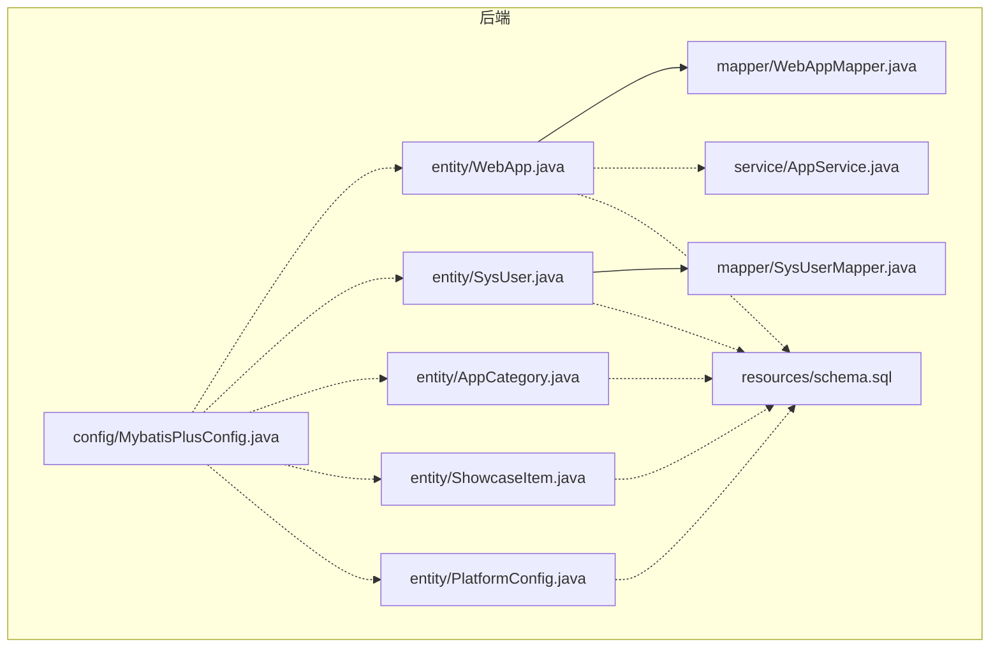
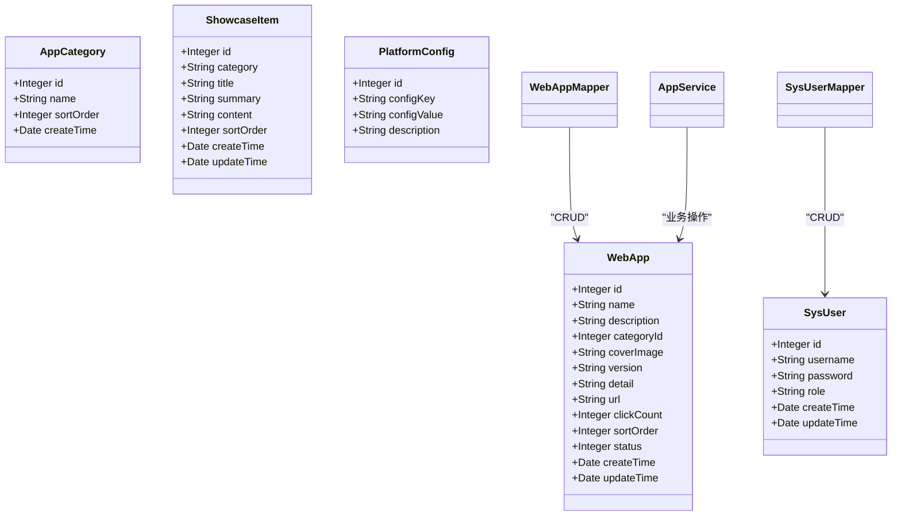
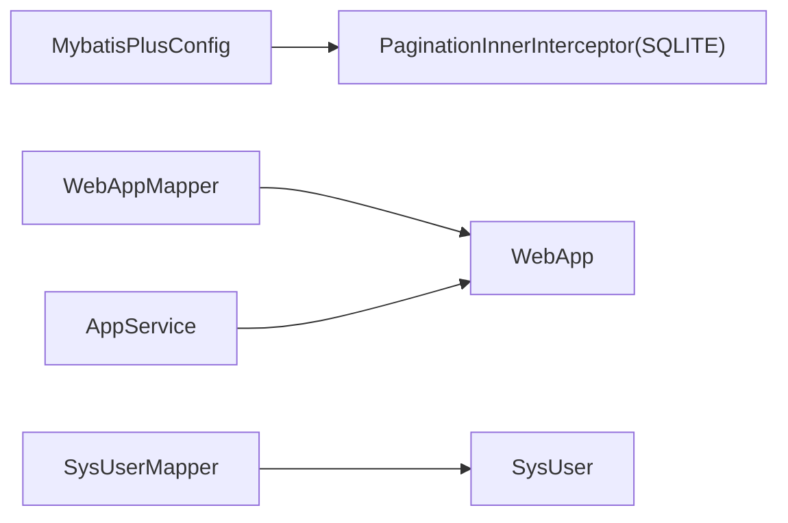

# Entity层设计

<cite>
**本文引用的文件**   
- [WebApp.java](file://backend/src/main/java/com/xx/platform/entity/WebApp.java)
- [SysUser.java](file://backend/src/main/java/com/xx/platform/entity/SysUser.java)
- [AppCategory.java](file://backend/src/main/java/com/xx/platform/entity/AppCategory.java)
- [ShowcaseItem.java](file://backend/src/main/java/com/xx/platform/entity/ShowcaseItem.java)
- [PlatformConfig.java](file://backend/src/main/java/com/xx/platform/entity/PlatformConfig.java)
- [schema.sql](file://backend/src/main/resources/schema.sql)
- [MybatisPlusConfig.java](file://backend/src/main/java/com/xx/platform/config/MybatisPlusConfig.java)
- [WebAppMapper.java](file://backend/src/main/java/com/xx/platform/mapper/WebAppMapper.java)
- [SysUserMapper.java](file://backend/src/main/java/com/xx/platform/mapper/SysUserMapper.java)
- [AppService.java](file://backend/src/main/java/com/xx/platform/service/AppService.java)
</cite>

## 目录
1. [引言](#引言)
2. [项目结构](#项目结构)
3. [核心组件](#核心组件)
4. [架构总览](#架构总览)
5. [详细组件分析](#详细组件分析)
6. [依赖关系分析](#依赖关系分析)
7. [性能与扩展性考虑](#性能与扩展性考虑)
8. [故障排查指南](#故障排查指南)
9. [结论](#结论)
10. [附录](#附录)

## 引言
本文件面向JZPlatform门户系统的Entity层，系统性梳理数据模型的设计原则、字段命名约定、数据类型选择与约束定义；详解MyBatis-Plus实体注解的使用方式（@TableName、@TableId、@TableField、@TableLogic等）；展示核心实体的完整定义与关联关系；说明数据验证注解的引入建议与实践；并提供实体类扩展与版本管理的最佳实践。文档旨在帮助开发者快速理解并高质量地维护数据模型。

## 项目结构
Entity层位于后端模块的entity包中，每个业务对象对应一个Java实体类，并通过MyBatis-Plus注解映射到数据库表。数据库初始化脚本位于resources下，定义了SQLite的表结构与初始数据。

图表来源
- [WebApp.java:1-54](file://backend/src/main/java/com/xx/platform/entity/WebApp.java#L1-L54)
- [SysUser.java:1-33](file://backend/src/main/java/com/xx/platform/entity/SysUser.java#L1-L33)
- [AppCategory.java:1-28](file://backend/src/main/java/com/xx/platform/entity/AppCategory.java#L1-L28)
- [ShowcaseItem.java:1-40](file://backend/src/main/java/com/xx/platform/entity/ShowcaseItem.java#L1-L40)
- [PlatformConfig.java:1-28](file://backend/src/main/java/com/xx/platform/entity/PlatformConfig.java#L1-L28)
- [MybatisPlusConfig.java:1-27](file://backend/src/main/java/com/xx/platform/config/MybatisPlusConfig.java#L1-L27)
- [WebAppMapper.java:1-13](file://backend/src/main/java/com/xx/platform/mapper/WebAppMapper.java#L1-L13)
- [SysUserMapper.java:1-13](file://backend/src/main/java/com/xx/platform/mapper/SysUserMapper.java#L1-L13)
- [AppService.java:1-47](file://backend/src/main/java/com/xx/platform/service/AppService.java#L1-L47)
- [schema.sql:1-80](file://backend/src/main/resources/schema.sql#L1-L80)

章节来源
- [WebApp.java:1-54](file://backend/src/main/java/com/xx/platform/entity/WebApp.java#L1-L54)
- [SysUser.java:1-33](file://backend/src/main/java/com/xx/platform/entity/SysUser.java#L1-L33)
- [AppCategory.java:1-28](file://backend/src/main/java/com/xx/platform/entity/AppCategory.java#L1-L28)
- [ShowcaseItem.java:1-40](file://backend/src/main/java/com/xx/platform/entity/ShowcaseItem.java#L1-L40)
- [PlatformConfig.java:1-28](file://backend/src/main/java/com/xx/platform/entity/PlatformConfig.java#L1-L28)
- [schema.sql:1-80](file://backend/src/main/resources/schema.sql#L1-L80)
- [MybatisPlusConfig.java:1-27](file://backend/src/main/java/com/xx/platform/config/MybatisPlusConfig.java#L1-L27)

## 核心组件
本节概述各实体的职责与关键字段：
- WebApp：门户应用元数据，包含名称、简介、分类ID、封面、版本、详情、链接、点击数、排序、状态及时间戳。
- SysUser：系统用户，包含用户名、密码、角色及时间戳。
- AppCategory：应用分类，包含名称与排序。
- ShowcaseItem：宣贯内容项，包含类别、标题、摘要、内容与排序。
- PlatformConfig：平台配置键值对，包含配置键、值与描述。

章节来源
- [WebApp.java:1-54](file://backend/src/main/java/com/xx/platform/entity/WebApp.java#L1-L54)
- [SysUser.java:1-33](file://backend/src/main/java/com/xx/platform/entity/SysUser.java#L1-L33)
- [AppCategory.java:1-28](file://backend/src/main/java/com/xx/platform/entity/AppCategory.java#L1-L28)
- [ShowcaseItem.java:1-40](file://backend/src/main/java/com/xx/platform/entity/ShowcaseItem.java#L1-L40)
- [PlatformConfig.java:1-28](file://backend/src/main/java/com/xx/platform/entity/PlatformConfig.java#L1-L28)

## 架构总览
下图展示了实体与数据库表的映射关系以及主要使用方（Mapper、Service）的依赖方向。

图表来源
- [WebApp.java:1-54](file://backend/src/main/java/com/xx/platform/entity/WebApp.java#L1-L54)
- [SysUser.java:1-33](file://backend/src/main/java/com/xx/platform/entity/SysUser.java#L1-L33)
- [AppCategory.java:1-28](file://backend/src/main/java/com/xx/platform/entity/AppCategory.java#L1-L28)
- [ShowcaseItem.java:1-40](file://backend/src/main/java/com/xx/platform/entity/ShowcaseItem.java#L1-L40)
- [PlatformConfig.java:1-28](file://backend/src/main/java/com/xx/platform/entity/PlatformConfig.java#L1-L28)
- [WebAppMapper.java:1-13](file://backend/src/main/java/com/xx/platform/mapper/WebAppMapper.java#L1-L13)
- [SysUserMapper.java:1-13](file://backend/src/main/java/com/xx/platform/mapper/SysUserMapper.java#L1-L13)
- [AppService.java:1-47](file://backend/src/main/java/com/xx/platform/service/AppService.java#L1-L47)

## 详细组件分析

### 设计原则与规范
- 命名约定
  - 实体类名采用大驼峰，与表名通过@TableName显式映射为小写下划线风格。
  - 字段采用小驼峰，若与列名不一致则使用@TableField指定列名。
  - 主键统一命名为id，类型使用Integer，策略为自增。
- 数据类型选择
  - 文本类使用String，长度以数据库VARCHAR限制为准。
  - 数值型使用Integer，计数与排序字段默认非负。
  - 时间字段使用java.util.Date，由数据库DEFAULT CURRENT_TIMESTAMP提供默认值。
- 约束定义
  - 数据库层通过NOT NULL、UNIQUE、DEFAULT等约束保证完整性。
  - 建议在Service或DTO层补充业务校验（如@NotBlank、@Size、@Email），在实体层保持POJO纯净。
- MyBatis-Plus注解
  - @TableName：声明表名映射。
  - @TableId(type = IdType.AUTO)：声明自增主键。
  - @TableField：当字段名与列名不一致时使用。
  - @TableLogic：逻辑删除时启用，当前实体未使用，可按需添加。
  - @TableField(fill = FieldFill...)：自动填充创建/更新时间，可结合全局策略实现。

章节来源
- [WebApp.java:1-54](file://backend/src/main/java/com/xx/platform/entity/WebApp.java#L1-L54)
- [SysUser.java:1-33](file://backend/src/main/java/com/xx/platform/entity/SysUser.java#L1-L33)
- [AppCategory.java:1-28](file://backend/src/main/java/com/xx/platform/entity/AppCategory.java#L1-L28)
- [ShowcaseItem.java:1-40](file://backend/src/main/java/com/xx/platform/entity/ShowcaseItem.java#L1-L40)
- [PlatformConfig.java:1-28](file://backend/src/main/java/com/xx/platform/entity/PlatformConfig.java#L1-L28)
- [schema.sql:1-80](file://backend/src/main/resources/schema.sql#L1-L80)

### 实体定义与字段说明

#### WebApp（门户应用）
- 表映射：web_app
- 主键：id（自增）
- 关键业务字段：name、description、categoryId、coverImage、version、detail、url、clickCount、sortOrder、status
- 审计字段：createTime、updateTime
- 关联关系：通过categoryId引用app_category.id（外键语义在数据库层未显式声明，但业务上存在一对多关系）
- 典型用法：分页查询、按分类筛选、关键词搜索、排序、点击计数递增

章节来源
- [WebApp.java:1-54](file://backend/src/main/java/com/xx/platform/entity/WebApp.java#L1-L54)
- [schema.sql:23-37](file://backend/src/main/resources/schema.sql#L23-L37)
- [AppService.java:1-47](file://backend/src/main/java/com/xx/platform/service/AppService.java#L1-47)

#### SysUser（系统用户）
- 表映射：sys_user
- 主键：id（自增）
- 关键业务字段：username（唯一）、password、role（ADMIN/USER）
- 审计字段：createTime、updateTime
- 安全建议：密码应在服务层进行哈希存储与校验，避免明文落库

章节来源
- [SysUser.java:1-33](file://backend/src/main/java/com/xx/platform/entity/SysUser.java#L1-L33)
- [schema.sql:5-12](file://backend/src/main/resources/schema.sql#L5-L12)

#### AppCategory（应用分类）
- 表映射：app_category
- 主键：id（自增）
- 关键业务字段：name、sortOrder
- 审计字段：createTime
- 关联关系：被WebApp.categoryId引用

章节来源
- [AppCategory.java:1-28](file://backend/src/main/java/com/xx/platform/entity/AppCategory.java#L1-L28)
- [schema.sql:15-20](file://backend/src/main/resources/schema.sql#L15-L20)

#### ShowcaseItem（宣贯内容项）
- 表映射：showcase_item
- 主键：id（自增）
- 关键业务字段：category（枚举值：USER_ECOLOGY/PRODUCT_SYSTEM/MODEL_SYSTEM/DATA_SYSTEM/IP）、title、summary、content、sortOrder
- 审计字段：createTime、updateTime

章节来源
- [ShowcaseItem.java:1-40](file://backend/src/main/java/com/xx/platform/entity/ShowcaseItem.java#L1-L40)
- [schema.sql:40-49](file://backend/src/main/resources/schema.sql#L40-L49)

#### PlatformConfig（平台配置）
- 表映射：platform_config
- 主键：id（自增）
- 关键业务字段：configKey（唯一）、configValue、description
- 用途：平台名称、Logo路径、公司名称、底图等可配置项

章节来源
- [PlatformConfig.java:1-28](file://backend/src/main/java/com/xx/platform/entity/PlatformConfig.java#L1-L28)
- [schema.sql:52-57](file://backend/src/main/resources/schema.sql#L52-L57)

### 实体间关联关系与外键约束
- 一对多关系：AppCategory -> WebApp（通过WebApp.categoryId指向AppCategory.id）
- 数据库约束现状：
  - 主键均为INTEGER PRIMARY KEY AUTOINCREMENT
  - 唯一约束：sys_user.username、platform_config.configKey
  - 外键约束：未在schema中显式声明，建议在后续版本引入外键以保证一致性
- 建议：
  - 在数据库层增加外键约束，或在应用层做一致性校验
  - 删除分类前检查是否有关联应用，避免脏数据

章节来源
- [schema.sql:5-12](file://backend/src/main/resources/schema.sql#L5-L12)
- [schema.sql:15-20](file://backend/src/main/resources/schema.sql#L15-L20)
- [schema.sql:23-37](file://backend/src/main/resources/schema.sql#L23-L37)
- [schema.sql:52-57](file://backend/src/main/resources/schema.sql#L52-L57)

### MyBatis-Plus注解使用指南
- @TableName：用于将实体映射到具体表名，所有实体均已正确配置
- @TableId(type = IdType.AUTO)：所有实体主键均使用自增策略
- @TableField：当字段名与列名不一致时使用，当前实体遵循小驼峰与下划线自动映射规则，暂未使用
- @TableLogic：逻辑删除时启用，当前实体未使用；如需软删除，可在需要删除的实体添加该注解并在Service层调用removeByIds等逻辑删除方法
- 自动填充：可通过全局策略或实体字段注解实现createTime/updateTime自动填充，当前由数据库DEFAULT CURRENT_TIMESTAMP提供默认值

章节来源
- [WebApp.java:1-54](file://backend/src/main/java/com/xx/platform/entity/WebApp.java#L1-L54)
- [SysUser.java:1-33](file://backend/src/main/java/com/xx/platform/entity/SysUser.java#L1-L33)
- [AppCategory.java:1-28](file://backend/src/main/java/com/xx/platform/entity/AppCategory.java#L1-L28)
- [ShowcaseItem.java:1-40](file://backend/src/main/java/com/xx/platform/entity/ShowcaseItem.java#L1-L40)
- [PlatformConfig.java:1-28](file://backend/src/main/java/com/xx/platform/entity/PlatformConfig.java#L1-L28)
- [MybatisPlusConfig.java:1-27](file://backend/src/main/java/com/xx/platform/config/MybatisPlusConfig.java#L1-L27)

### 数据验证注解使用建议
- 建议在DTO或服务层引入JSR-303/Hibernate Validator注解，例如：
  - @NotBlank：用于必填字符串字段（如用户名、应用名称）
  - @Size：控制字符串长度范围（如用户名、标题）
  - @Email：邮箱格式校验（如管理员联系邮箱）
  - @NotNull/@Min/@Max：数值范围校验（如排序号、状态）
- 实体层保持POJO纯净，不混入校验注解，以提升复用性与清晰度

[本节为通用建议，不涉及具体文件分析]

### 实体类扩展与版本管理最佳实践
- 新增字段
  - 先在schema.sql中添加列与默认值，再在实体类中补充字段
  - 若字段需要自动填充，优先使用数据库DEFAULT或全局自动填充策略
- 字段变更
  - 避免直接修改已有字段类型，必要时通过迁移脚本重命名列或新建列并迁移数据
- 逻辑删除
  - 在需要软删除的实体添加@TableLogic，并在Service层使用逻辑删除API
- 审计字段
  - 统一使用createTime/updateTime，配合自动填充或数据库默认值
- 枚举与字典
  - 对于固定取值（如角色、状态、分类），建议使用枚举或字典表，并在Service层进行校验
- 向后兼容
  - 对外暴露的接口尽量保持兼容，新增字段设置合理默认值

[本节为通用建议，不涉及具体文件分析]

## 依赖关系分析
- Mapper依赖实体：BaseMapper泛型绑定实体，提供标准CRUD能力
- Service依赖实体：业务方法以实体为输入输出，封装复杂流程
- 配置依赖：MybatisPlusConfig注册分页插件，影响查询性能与体验

图表来源
- [MybatisPlusConfig.java:1-27](file://backend/src/main/java/com/xx/platform/config/MybatisPlusConfig.java#L1-L27)
- [WebAppMapper.java:1-13](file://backend/src/main/java/com/xx/platform/mapper/WebAppMapper.java#L1-L13)
- [SysUserMapper.java:1-13](file://backend/src/main/java/com/xx/platform/mapper/SysUserMapper.java#L1-L13)
- [AppService.java:1-47](file://backend/src/main/java/com/xx/platform/service/AppService.java#L1-L47)

章节来源
- [MybatisPlusConfig.java:1-27](file://backend/src/main/java/com/xx/platform/config/MybatisPlusConfig.java#L1-L27)
- [WebAppMapper.java:1-13](file://backend/src/main/java/com/xx/platform/mapper/WebAppMapper.java#L1-L13)
- [SysUserMapper.java:1-13](file://backend/src/main/java/com/xx/platform/mapper/SysUserMapper.java#L1-L13)
- [AppService.java:1-47](file://backend/src/main/java/com/xx/platform/service/AppService.java#L1-L47)

## 性能与扩展性考虑
- 索引优化
  - 高频查询字段建议加索引，如web_app.name、web_app.category_id、web_app.status、showcase_item.category
- 分页查询
  - 已配置SQLite分页插件，确保列表接口使用分页参数，避免全表扫描
- 连接与事务
  - 批量操作开启事务，减少提交开销
- 缓存
  - 平台配置与分类等低频变动数据可引入缓存层，降低DB压力
- 软删除
  - 引入@TableLogic后，查询需排除已删除记录，注意索引与统计口径变化

[本节为通用建议，不涉及具体文件分析]

## 故障排查指南
- 主键冲突
  - 现象：插入失败提示主键重复
  - 排查：确认AUTOINCREMENT是否正确，清理测试数据
- 唯一约束冲突
  - 现象：插入用户名或配置键重复时报错
  - 排查：检查sys_user.username与platform_config.configKey的唯一性
- 外键缺失导致的数据不一致
  - 现象：删除分类后仍有应用引用
  - 排查：在应用层增加前置校验，或引入数据库外键约束
- 分页异常
  - 现象：分页结果不正确或报错
  - 排查：确认MybatisPlusConfig中分页插件已注册且DbType设置为SQLITE

章节来源
- [schema.sql:5-12](file://backend/src/main/resources/schema.sql#L5-L12)
- [schema.sql:52-57](file://backend/src/main/resources/schema.sql#L52-L57)
- [MybatisPlusConfig.java:1-27](file://backend/src/main/java/com/xx/platform/config/MybatisPlusConfig.java#L1-L27)

## 结论
Entity层整体设计简洁清晰，遵循MyBatis-Plus约定优于配置的原则，主键自增、表名映射明确。建议在后续迭代中完善外键约束、引入逻辑删除与自动填充机制，并在服务层加强数据校验与索引优化，以提升数据一致性与查询性能。

[本节为总结性内容，不涉及具体文件分析]

## 附录

### 实体-表映射一览
- WebApp -> web_app
- SysUser -> sys_user
- AppCategory -> app_category
- ShowcaseItem -> showcase_item
- PlatformConfig -> platform_config

章节来源
- [WebApp.java:1-54](file://backend/src/main/java/com/xx/platform/entity/WebApp.java#L1-L54)
- [SysUser.java:1-33](file://backend/src/main/java/com/xx/platform/entity/SysUser.java#L1-L33)
- [AppCategory.java:1-28](file://backend/src/main/java/com/xx/platform/entity/AppCategory.java#L1-L28)
- [ShowcaseItem.java:1-40](file://backend/src/main/java/com/xx/platform/entity/ShowcaseItem.java#L1-L40)
- [PlatformConfig.java:1-28](file://backend/src/main/java/com/xx/platform/entity/PlatformConfig.java#L1-L28)
- [schema.sql:1-80](file://backend/src/main/resources/schema.sql#L1-L80)