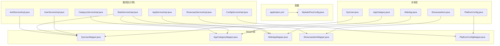
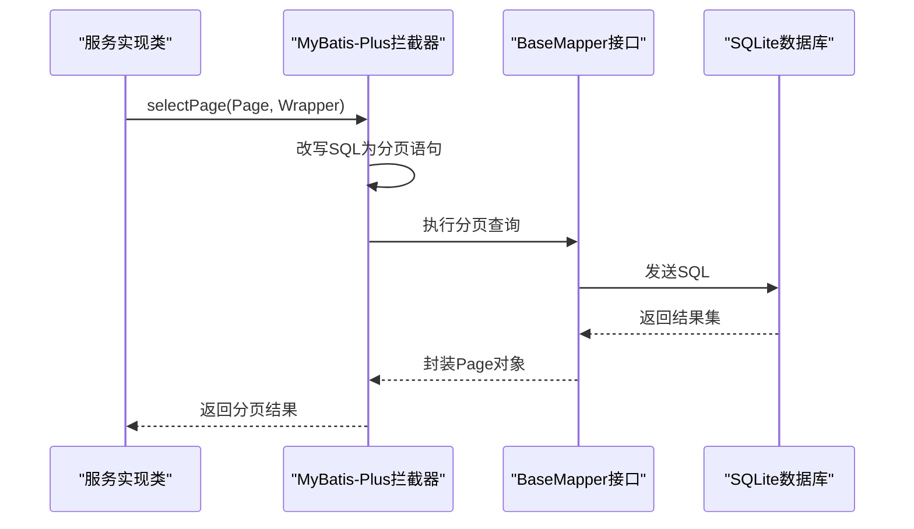
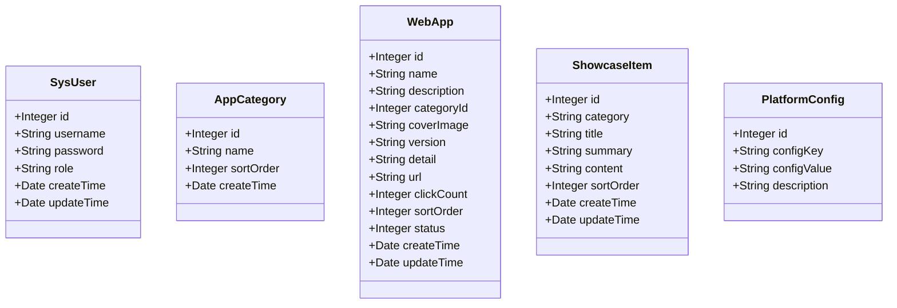
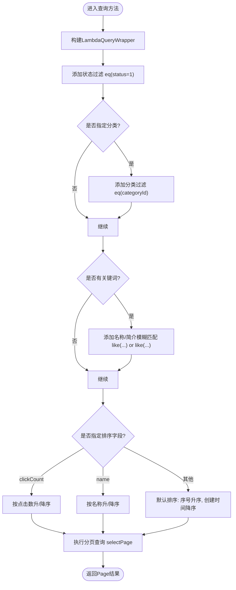
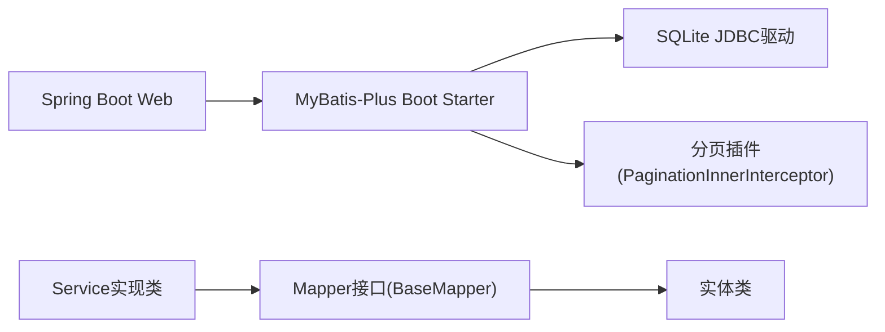

# Mapper层设计

<cite>
**本文引用的文件**
- [AppCategoryMapper.java](file://backend/src/main/java/com/xx/platform/mapper/AppCategoryMapper.java)
- [PlatformConfigMapper.java](file://backend/src/main/java/com/xx/platform/mapper/PlatformConfigMapper.java)
- [ShowcaseItemMapper.java](file://backend/src/main/java/com/xx/platform/mapper/ShowcaseItemMapper.java)
- [SysUserMapper.java](file://backend/src/main/java/com/xx/platform/mapper/SysUserMapper.java)
- [WebAppMapper.java](file://backend/src/main/java/com/xx/platform/mapper/WebAppMapper.java)
- [AppCategory.java](file://backend/src/main/java/com/xx/platform/entity/AppCategory.java)
- [PlatformConfig.java](file://backend/src/main/java/com/xx/platform/entity/PlatformConfig.java)
- [ShowcaseItem.java](file://backend/src/main/java/com/xx/platform/entity/ShowcaseItem.java)
- [SysUser.java](file://backend/src/main/java/com/xx/platform/entity/SysUser.java)
- [WebApp.java](file://backend/src/main/java/com/xx/platform/entity/WebApp.java)
- [MybatisPlusConfig.java](file://backend/src/main/java/com/xx/platform/config/MybatisPlusConfig.java)
- [application.yml](file://backend/src/main/resources/application.yml)
- [schema.sql](file://backend/src/main/resources/schema.sql)
- [AppServiceImpl.java](file://backend/src/main/java/com/xx/platform/service/impl/AppServiceImpl.java)
- [UserServiceImpl.java](file://backend/src/main/java/com/xx/platform/service/impl/UserServiceImpl.java)
- [StatsServiceImpl.java](file://backend/src/main/java/com/xx/platform/service/impl/StatsServiceImpl.java)
- [AuthServiceImpl.java](file://backend/src/main/java/com/xx/platform/service/impl/AuthServiceImpl.java)
- [CategoryServiceImpl.java](file://backend/src/main/java/com/xx/platform/service/impl/CategoryServiceImpl.java)
- [ShowcaseServiceImpl.java](file://backend/src/main/java/com/xx/platform/service/impl/ShowcaseServiceImpl.java)
- [ConfigServiceImpl.java](file://backend/src/main/java/com/xx/platform/service/impl/ConfigServiceImpl.java)
</cite>

## 目录
1. [引言](#引言)
2. [项目结构](#项目结构)
3. [核心组件](#核心组件)
4. [架构总览](#架构总览)
5. [详细组件分析](#详细组件分析)
6. [依赖关系分析](#依赖关系分析)
7. [性能与优化](#性能与优化)
8. [故障排查指南](#故障排查指南)
9. [结论](#结论)
10. [附录](#附录)

## 引言
本技术文档聚焦于JZPlatform门户系统的Mapper层，系统性阐述MyBatis-Plus在数据访问层的落地实践。内容涵盖：
- BaseMapper的继承使用与CRUD能力
- 实体类与数据库表的映射约定及注解配置（@TableName、@TableId、@TableField）
- 动态SQL生成与条件构造器QueryWrapper/LambdaQueryWrapper的高级用法
- 复杂查询示例：分页查询、统计查询、多表关联查询的实现思路
- XML映射文件的编写规范与最佳实践
- 数据库连接池配置、SQL性能优化与调试技巧

## 项目结构
本项目采用分层架构，Mapper层位于后端模块的mapper包下，每个实体对应一个Mapper接口，统一继承BaseMapper以复用通用CRUD方法；Service层通过注入Mapper完成业务编排；配置集中在application.yml与MybatisPlusConfig中。

图表来源
- [application.yml:1-29](file://backend/src/main/resources/application.yml#L1-L29)
- [MybatisPlusConfig.java:1-27](file://backend/src/main/java/com/xx/platform/config/MybatisPlusConfig.java#L1-L27)
- [SysUser.java:1-33](file://backend/src/main/java/com/xx/platform/entity/SysUser.java#L1-L33)
- [AppCategory.java:1-28](file://backend/src/main/java/com/xx/platform/entity/AppCategory.java#L1-L28)
- [WebApp.java:1-54](file://backend/src/main/java/com/xx/platform/entity/WebApp.java#L1-L54)
- [ShowcaseItem.java:1-40](file://backend/src/main/java/com/xx/platform/entity/ShowcaseItem.java#L1-L40)
- [PlatformConfig.java:1-28](file://backend/src/main/java/com/xx/platform/entity/PlatformConfig.java#L1-L28)
- [SysUserMapper.java:1-13](file://backend/src/main/java/com/xx/platform/mapper/SysUserMapper.java#L1-L13)
- [AppCategoryMapper.java:1-13](file://backend/src/main/java/com/xx/platform/mapper/AppCategoryMapper.java#L1-L13)
- [WebAppMapper.java:1-13](file://backend/src/main/java/com/xx/platform/mapper/WebAppMapper.java#L1-L13)
- [ShowcaseItemMapper.java:1-13](file://backend/src/main/java/com/xx/platform/mapper/ShowcaseItemMapper.java#L1-L13)
- [PlatformConfigMapper.java:1-13](file://backend/src/main/java/com/xx/platform/mapper/PlatformConfigMapper.java#L1-L13)
- [UserServiceImpl.java:1-52](file://backend/src/main/java/com/xx/platform/service/impl/UserServiceImpl.java#L1-L52)
- [AppServiceImpl.java:1-105](file://backend/src/main/java/com/xx/platform/service/impl/AppServiceImpl.java#L1-L105)
- [StatsServiceImpl.java:1-45](file://backend/src/main/java/com/xx/platform/service/impl/StatsServiceImpl.java#L1-L45)
- [AuthServiceImpl.java:1-40](file://backend/src/main/java/com/xx/platform/service/impl/AuthServiceImpl.java#L1-L40)
- [CategoryServiceImpl.java:1-44](file://backend/src/main/java/com/xx/platform/service/impl/CategoryServiceImpl.java#L1-L44)
- [ShowcaseServiceImpl.java:1-43](file://backend/src/main/java/com/xx/platform/service/impl/ShowcaseServiceImpl.java#L1-L43)
- [ConfigServiceImpl.java:1-43](file://backend/src/main/java/com/xx/platform/service/impl/ConfigServiceImpl.java#L1-L43)

章节来源
- [application.yml:1-29](file://backend/src/main/resources/application.yml#L1-L29)
- [MybatisPlusConfig.java:1-27](file://backend/src/main/java/com/xx/platform/config/MybatisPlusConfig.java#L1-L27)

## 核心组件
- Mapper接口族：所有Mapper均继承BaseMapper并标注@Mapper，获得完整的CRUD能力，无需手写XML即可满足大部分场景。
- 实体类族：通过@TableName指定表名，@TableId指定主键策略，字段命名遵循驼峰与下划线自动映射约定。
- 配置中心：application.yml提供数据源与MyBatis-Plus全局配置；MybatisPlusConfig注册分页插件。

章节来源
- [SysUserMapper.java:1-13](file://backend/src/main/java/com/xx/platform/mapper/SysUserMapper.java#L1-L13)
- [AppCategoryMapper.java:1-13](file://backend/src/main/java/com/xx/platform/mapper/AppCategoryMapper.java#L1-L13)
- [WebAppMapper.java:1-13](file://backend/src/main/java/com/xx/platform/mapper/WebAppMapper.java#L1-L13)
- [ShowcaseItemMapper.java:1-13](file://backend/src/main/java/com/xx/platform/mapper/ShowcaseItemMapper.java#L1-L13)
- [PlatformConfigMapper.java:1-13](file://backend/src/main/java/com/xx/platform/mapper/PlatformConfigMapper.java#L1-L13)
- [SysUser.java:1-33](file://backend/src/main/java/com/xx/platform/entity/SysUser.java#L1-L33)
- [AppCategory.java:1-28](file://backend/src/main/java/com/xx/platform/entity/AppCategory.java#L1-L28)
- [WebApp.java:1-54](file://backend/src/main/java/com/xx/platform/entity/WebApp.java#L1-L54)
- [ShowcaseItem.java:1-40](file://backend/src/main/java/com/xx/platform/entity/ShowcaseItem.java#L1-L40)
- [PlatformConfig.java:1-28](file://backend/src/main/java/com/xx/platform/entity/PlatformConfig.java#L1-L28)
- [application.yml:15-25](file://backend/src/main/resources/application.yml#L15-L25)
- [MybatisPlusConfig.java:13-26](file://backend/src/main/java/com/xx/platform/config/MybatisPlusConfig.java#L13-L26)

## 架构总览
下图展示从Service到Mapper再到数据库的整体调用链路，以及分页插件的作用点。

图表来源
- [MybatisPlusConfig.java:20-25](file://backend/src/main/java/com/xx/platform/config/MybatisPlusConfig.java#L20-L25)
- [UserServiceImpl.java:23-27](file://backend/src/main/java/com/xx/platform/service/impl/UserServiceImpl.java#L23-L27)
- [AppServiceImpl.java:23-62](file://backend/src/main/java/com/xx/platform/service/impl/AppServiceImpl.java#L23-L62)

## 详细组件分析

### 实体与表映射规范
- 表名映射：实体类使用@TableName指定目标表名。
- 主键策略：使用@TableId(type = IdType.AUTO)配合SQLite的AUTOINCREMENT自增主键。
- 字段映射：默认开启下划线转驼峰，实体字段与表列一一对应；若不一致可使用@TableField(name="...")显式声明。
- 时间字段：实体中的Date类型字段与数据库DATETIME字段自动映射。

图表来源
- [SysUser.java:1-33](file://backend/src/main/java/com/xx/platform/entity/SysUser.java#L1-L33)
- [AppCategory.java:1-28](file://backend/src/main/java/com/xx/platform/entity/AppCategory.java#L1-L28)
- [WebApp.java:1-54](file://backend/src/main/java/com/xx/platform/entity/WebApp.java#L1-L54)
- [ShowcaseItem.java:1-40](file://backend/src/main/java/com/xx/platform/entity/ShowcaseItem.java#L1-L40)
- [PlatformConfig.java:1-28](file://backend/src/main/java/com/xx/platform/entity/PlatformConfig.java#L1-L28)

章节来源
- [SysUser.java:13-32](file://backend/src/main/java/com/xx/platform/entity/SysUser.java#L13-L32)
- [AppCategory.java:13-27](file://backend/src/main/java/com/xx/platform/entity/AppCategory.java#L13-L27)
- [WebApp.java:13-53](file://backend/src/main/java/com/xx/platform/entity/WebApp.java#L13-L53)
- [ShowcaseItem.java:14-39](file://backend/src/main/java/com/xx/platform/entity/ShowcaseItem.java#L14-L39)
- [PlatformConfig.java:12-27](file://backend/src/main/java/com/xx/platform/entity/PlatformConfig.java#L12-L27)
- [schema.sql:5-57](file://backend/src/main/resources/schema.sql#L5-L57)

### Mapper接口设计与BaseMapper使用
- 所有Mapper接口仅继承BaseMapper<T>并标注@Mapper，即可获得标准CRUD方法（selectList、selectById、insert、updateById、deleteById等）。
- 当需要自定义SQL时，可在同名XML文件中定义SQL并通过@Select/@Update等注解或XML方式绑定。

章节来源
- [SysUserMapper.java:1-13](file://backend/src/main/java/com/xx/platform/mapper/SysUserMapper.java#L1-L13)
- [AppCategoryMapper.java:1-13](file://backend/src/main/java/com/xx/platform/mapper/AppCategoryMapper.java#L1-L13)
- [WebAppMapper.java:1-13](file://backend/src/main/java/com/xx/platform/mapper/WebAppMapper.java#L1-L13)
- [ShowcaseItemMapper.java:1-13](file://backend/src/main/java/com/xx/platform/mapper/ShowcaseItemMapper.java#L1-L13)
- [PlatformConfigMapper.java:1-13](file://backend/src/main/java/com/xx/platform/mapper/PlatformConfigMapper.java#L1-L13)

### 条件构造器与动态SQL
- LambdaQueryWrapper：类型安全的条件构建，支持eq、like、and/or、orderByAsc/Desc等链式API。
- 典型用法：
  - 分页+排序：UserServiceImpl.getUserList使用LambdaQueryWrapper按创建时间降序分页。
  - 多条件筛选+模糊搜索：AppServiceImpl.getAppList根据分类、关键词、排序字段组合条件。
  - 简单查询：ShowcaseServiceImpl、ConfigServiceImpl、AuthServiceImpl等使用eq、selectOne/selectList。

图表来源
- [AppServiceImpl.java:23-62](file://backend/src/main/java/com/xx/platform/service/impl/AppServiceImpl.java#L23-L62)
- [UserServiceImpl.java:23-27](file://backend/src/main/java/com/xx/platform/service/impl/UserServiceImpl.java#L23-L27)
- [ShowcaseServiceImpl.java:24-31](file://backend/src/main/java/com/xx/platform/service/impl/ShowcaseServiceImpl.java#L24-L31)
- [ConfigServiceImpl.java:31-40](file://backend/src/main/java/com/xx/platform/service/impl/ConfigServiceImpl.java#L31-L40)
- [AuthServiceImpl.java:29-35](file://backend/src/main/java/com/xx/platform/service/impl/AuthServiceImpl.java#L29-L35)

章节来源
- [UserServiceImpl.java:23-27](file://backend/src/main/java/com/xx/platform/service/impl/UserServiceImpl.java#L23-L27)
- [AppServiceImpl.java:23-62](file://backend/src/main/java/com/xx/platform/service/impl/AppServiceImpl.java#L23-L62)
- [ShowcaseServiceImpl.java:24-31](file://backend/src/main/java/com/xx/platform/service/impl/ShowcaseServiceImpl.java#L24-L31)
- [ConfigServiceImpl.java:31-40](file://backend/src/main/java/com/xx/platform/service/impl/ConfigServiceImpl.java#L31-L40)
- [AuthServiceImpl.java:29-35](file://backend/src/main/java/com/xx/platform/service/impl/AuthServiceImpl.java#L29-L35)

### 复杂查询示例

#### 分页查询
- 使用Page作为分页参数，结合LambdaQueryWrapper进行条件与排序控制，最终由分页插件改写SQL并返回Page对象。
- 参考路径：
  - [UserServiceImpl.java:23-27](file://backend/src/main/java/com/xx/platform/service/impl/UserServiceImpl.java#L23-L27)
  - [AppServiceImpl.java:23-62](file://backend/src/main/java/com/xx/platform/service/impl/AppServiceImpl.java#L23-L62)

#### 统计查询
- 使用selectCount(null)获取总数；遍历列表聚合计算累计值（如点击次数总和）。
- 参考路径：
  - [StatsServiceImpl.java:32-45](file://backend/src/main/java/com/xx/platform/service/impl/StatsServiceImpl.java#L32-L45)

#### 多表关联查询
- 当前代码未出现跨表JOIN的XML映射，但可通过以下方式扩展：
  - 在Mapper接口中新增自定义方法，并在同名XML中编写JOIN SQL，返回DTO或Map集合。
  - 或使用MyBatis-Plus的Join插件（需引入相应扩展），或在Service层组装多次查询结果。
- 建议：将复杂关联逻辑下沉至XML，保持Mapper接口简洁。

[本节为概念性说明，不直接分析具体文件]

### XML映射文件编写规范与最佳实践
- 位置与扫描：application.yml中已配置mapper-locations指向classpath:mapper/*.xml，确保自定义SQL能被扫描到。
- 命名约定：XML文件名与Mapper接口名一致，namespace指向接口全限定名。
- SQL组织：
  - 基础CRUD优先使用BaseMapper，仅在复杂查询、批量操作、统计聚合时使用XML。
  - 使用<if>/<choose>/<foreach>等标签实现动态SQL。
  - 对大文本字段（TEXT）谨慎选择返回字段，避免不必要的网络传输。
- 日志与调试：启用StdOutImpl输出SQL便于定位问题。

章节来源
- [application.yml:16-21](file://backend/src/main/resources/application.yml#L16-L21)

## 依赖关系分析
- 组件耦合：Service层依赖Mapper接口，Mapper接口依赖BaseMapper与实体类；整体低耦合、高内聚。
- 外部依赖：Spring Boot Starter Web、MyBatis-Plus Boot Starter、SQLite JDBC驱动。
- 插件依赖：分页插件PaginationInnerInterceptor针对SQLite方言生效。

图表来源
- [pom.xml:26-38](file://backend/pom.xml#L26-L38)
- [MybatisPlusConfig.java:20-25](file://backend/src/main/java/com/xx/platform/config/MybatisPlusConfig.java#L20-L25)

章节来源
- [pom.xml:26-38](file://backend/pom.xml#L26-L38)
- [MybatisPlusConfig.java:13-26](file://backend/src/main/java/com/xx/platform/config/MybatisPlusConfig.java#L13-L26)

## 性能与优化
- 索引建议：
  - web_app.status、web_app.category_id、web_app.sort_order、web_app.create_time建立合适索引以提升筛选与排序性能。
  - sys_user.username唯一索引已存在，可加速登录校验。
- 查询优化：
  - 避免selectList(null)拉取全表后再内存聚合，尽量使用SQL侧聚合（COUNT/SUM/GROUP BY）。
  - 分页查询务必带上合理WHERE条件，减少回表与排序开销。
- 连接池与并发：
  - 当前使用SQLite单文件数据库，适合轻量场景；高并发场景建议迁移至MySQL/PostgreSQL并配置HikariCP连接池。
- 日志与监控：
  - 开发环境开启SQL日志，生产环境关闭或降低级别，避免IO瓶颈。
  - 对热点接口增加慢查询监控与告警。

[本节为通用指导，不直接分析具体文件]

## 故障排查指南
- 常见问题
  - 主键自增异常：确认实体@TableId(strategy=auto)与数据库AUTOINCREMENT一致。
  - 字段映射失败：检查map-underscore-to-camel-case配置与@TableField显式映射。
  - 分页无效：确认已注册PaginationInnerInterceptor且DbType正确。
- 定位手段
  - 查看控制台SQL输出，核对生成的SQL是否符合预期。
  - 使用explain分析关键SQL的执行计划（在SQLite中可用EXPLAIN QUERY PLAN）。
  - 逐步缩小条件范围，定位慢查询根因。

章节来源
- [application.yml:16-21](file://backend/src/main/resources/application.yml#L16-L21)
- [MybatisPlusConfig.java:20-25](file://backend/src/main/java/com/xx/platform/config/MybatisPlusConfig.java#L20-L25)

## 结论
本项目Mapper层基于MyBatis-Plus的BaseMapper实现了高效的数据访问抽象，配合LambdaQueryWrapper完成灵活的动态条件构建，并通过分页插件简化分页逻辑。对于复杂查询，建议在XML中集中管理SQL，保持接口清晰与可维护性。后续可按需引入索引优化、连接池升级与SQL审计，进一步提升系统性能与稳定性。

## 附录

### 数据库表结构与实体映射对照
- sys_user ↔ SysUser
- app_category ↔ AppCategory
- web_app ↔ WebApp
- showcase_item ↔ ShowcaseItem
- platform_config ↔ PlatformConfig

章节来源
- [schema.sql:5-57](file://backend/src/main/resources/schema.sql#L5-L57)
- [SysUser.java:13-32](file://backend/src/main/java/com/xx/platform/entity/SysUser.java#L13-L32)
- [AppCategory.java:13-27](file://backend/src/main/java/com/xx/platform/entity/AppCategory.java#L13-L27)
- [WebApp.java:13-53](file://backend/src/main/java/com/xx/platform/entity/WebApp.java#L13-L53)
- [ShowcaseItem.java:14-39](file://backend/src/main/java/com/xx/platform/entity/ShowcaseItem.java#L14-L39)
- [PlatformConfig.java:12-27](file://backend/src/main/java/com/xx/platform/entity/PlatformConfig.java#L12-L27)