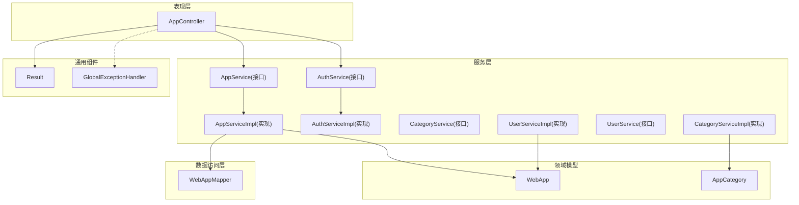
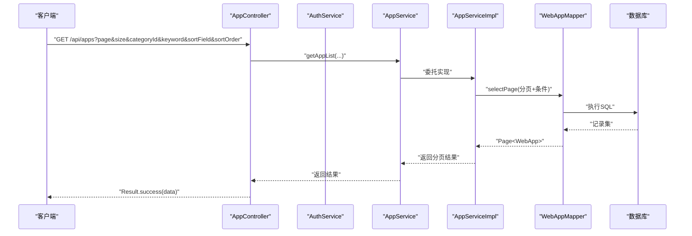
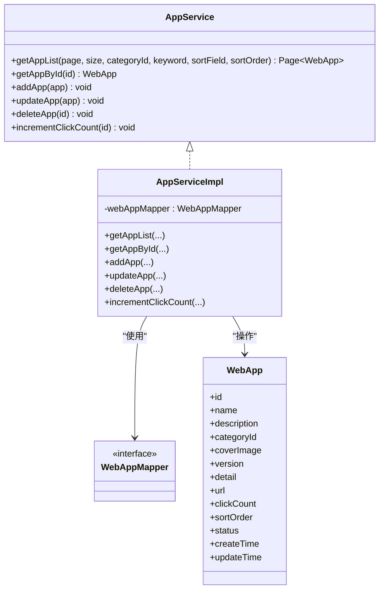
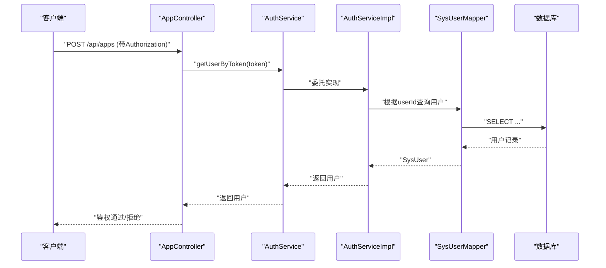
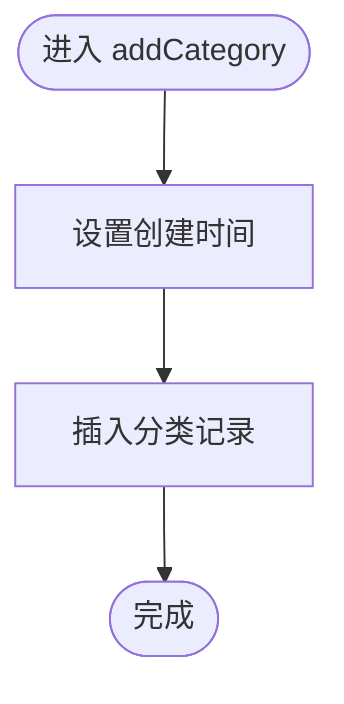
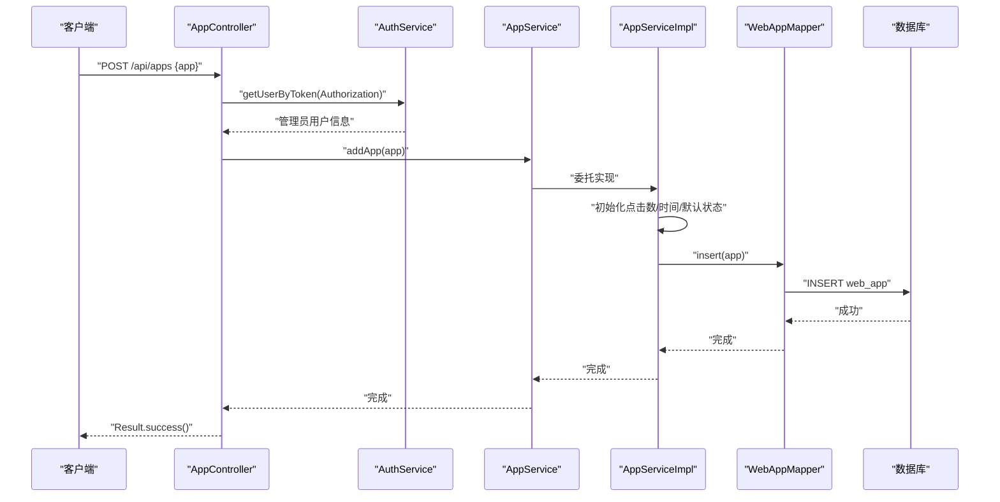
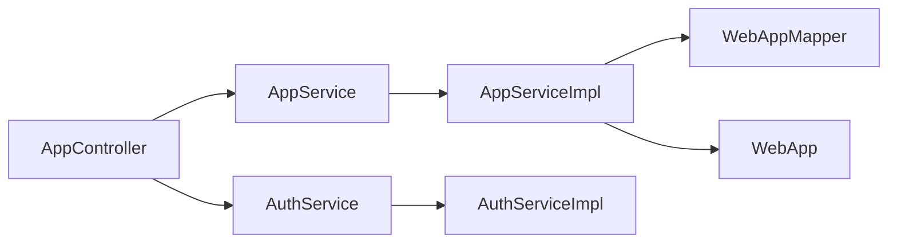
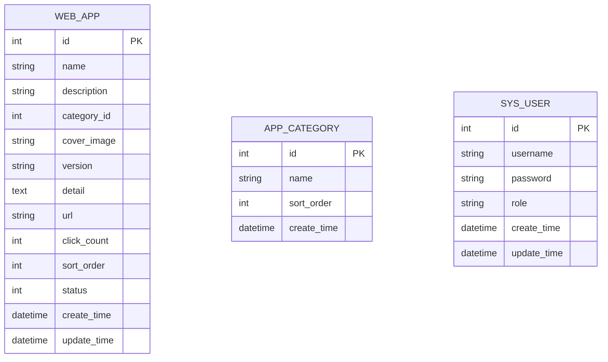

# Service层设计

<cite>
**本文引用的文件**   
- [AppService.java](file://backend/src/main/java/com/xx/platform/service/AppService.java)
- [AppServiceImpl.java](file://backend/src/main/java/com/xx/platform/service/impl/AppServiceImpl.java)
- [AuthServiceImpl.java](file://backend/src/main/java/com/xx/platform/service/impl/AuthServiceImpl.java)
- [CategoryServiceImpl.java](file://backend/src/main/java/com/xx/platform/service/impl/CategoryServiceImpl.java)
- [UserServiceImpl.java](file://backend/src/main/java/com/xx/platform/service/impl/UserServiceImpl.java)
- [AppController.java](file://backend/src/main/java/com/xx/platform/controller/AppController.java)
- [WebApp.java](file://backend/src/main/java/com/xx/platform/entity/WebApp.java)
- [AppCategory.java](file://backend/src/main/java/com/xx/platform/entity/AppCategory.java)
- [WebAppMapper.java](file://backend/src/main/java/com/xx/platform/mapper/WebAppMapper.java)
- [Result.java](file://backend/src/main/java/com/xx/platform/common/Result.java)
- [GlobalExceptionHandler.java](file://backend/src/main/java/com/xx/platform/common/GlobalExceptionHandler.java)
- [application.yml](file://backend/src/main/resources/application.yml)
</cite>

## 目录
1. [引言](#引言)
2. [项目结构](#项目结构)
3. [核心组件](#核心组件)
4. [架构总览](#架构总览)
5. [详细组件分析](#详细组件分析)
6. [依赖分析](#依赖分析)
7. [性能考虑](#性能考虑)
8. [故障排查指南](#故障排查指南)
9. [结论](#结论)
10. [附录](#附录)

## 引言
本文件面向JZPlatform门户系统的Service层，系统化阐述其职责边界与设计模式：业务逻辑封装、事务管理、数据验证与跨模块协调。文档以应用管理为核心场景，展示接口与实现分离（AppService与AppServiceImpl）的设计，并给出复杂业务流程的调用序列图与关键逻辑说明。同时提供事务注解@Transactional的使用建议与传播行为说明，以及批量操作、缓存策略等性能优化最佳实践。

## 项目结构
后端采用分层架构：Controller负责HTTP入参解析与统一响应封装；Service承载业务规则、校验与编排；Mapper通过MyBatis-Plus访问数据库；Entity为持久化模型；Common提供统一结果与全局异常处理。

图表来源
- [AppController.java:1-111](file://backend/src/main/java/com/xx/platform/controller/AppController.java#L1-L111)
- [AppService.java:1-47](file://backend/src/main/java/com/xx/platform/service/AppService.java#L1-L47)
- [AppServiceImpl.java:1-105](file://backend/src/main/java/com/xx/platform/service/impl/AppServiceImpl.java#L1-L105)
- [AuthServiceImpl.java:1-62](file://backend/src/main/java/com/xx/platform/service/impl/AuthServiceImpl.java#L1-L62)
- [CategoryServiceImpl.java:1-44](file://backend/src/main/java/com/xx/platform/service/impl/CategoryServiceImpl.java#L1-L44)
- [UserServiceImpl.java:1-53](file://backend/src/main/java/com/xx/platform/service/impl/UserServiceImpl.java#L1-L53)
- [WebApp.java:1-54](file://backend/src/main/java/com/xx/platform/entity/WebApp.java#L1-L54)
- [AppCategory.java:1-28](file://backend/src/main/java/com/xx/platform/entity/AppCategory.java#L1-L28)
- [WebAppMapper.java:1-13](file://backend/src/main/java/com/xx/platform/mapper/WebAppMapper.java#L1-L13)
- [Result.java:1-53](file://backend/src/main/java/com/xx/platform/common/Result.java#L1-L53)
- [GlobalExceptionHandler.java:1-30](file://backend/src/main/java/com/xx/platform/common/GlobalExceptionHandler.java#L1-L30)

章节来源
- [AppController.java:1-111](file://backend/src/main/java/com/xx/platform/controller/AppController.java#L1-L111)
- [application.yml:1-29](file://backend/src/main/resources/application.yml#L1-L29)

## 核心组件
- AppService接口：定义应用分页查询、详情获取、新增、更新、删除与点击计数等业务能力。
- AppServiceImpl实现：封装查询条件构建、排序与默认值填充、基础校验与数据落库。
- AuthServiceImpl：基于内存Token的认证服务，用于管理员权限校验。
- CategoryServiceImpl / UserServiceImpl：分类与用户管理的典型CRUD实现，体现Service层的通用模式。
- Result与GlobalExceptionHandler：统一响应体与全局异常捕获，保障对外一致性。

章节来源
- [AppService.java:1-47](file://backend/src/main/java/com/xx/platform/service/AppService.java#L1-L47)
- [AppServiceImpl.java:1-105](file://backend/src/main/java/com/xx/platform/service/impl/AppServiceImpl.java#L1-L105)
- [AuthServiceImpl.java:1-62](file://backend/src/main/java/com/xx/platform/service/impl/AuthServiceImpl.java#L1-L62)
- [CategoryServiceImpl.java:1-44](file://backend/src/main/java/com/xx/platform/service/impl/CategoryServiceImpl.java#L1-L44)
- [UserServiceImpl.java:1-53](file://backend/src/main/java/com/xx/platform/service/impl/UserServiceImpl.java#L1-L53)
- [Result.java:1-53](file://backend/src/main/java/com/xx/platform/common/Result.java#L1-L53)
- [GlobalExceptionHandler.java:1-30](file://backend/src/main/java/com/xx/platform/common/GlobalExceptionHandler.java#L1-L30)

## 架构总览
下图展示了从HTTP请求到Service层再到数据访问的完整链路，突出Service在业务编排中的中枢作用。

图表来源
- [AppController.java:31-40](file://backend/src/main/java/com/xx/platform/controller/AppController.java#L31-L40)
- [AppService.java:20-20](file://backend/src/main/java/com/xx/platform/service/AppService.java#L20-L20)
- [AppServiceImpl.java:23-62](file://backend/src/main/java/com/xx/platform/service/impl/AppServiceImpl.java#L23-L62)
- [WebAppMapper.java:1-13](file://backend/src/main/java/com/xx/platform/mapper/WebAppMapper.java#L1-L13)

## 详细组件分析

### 应用管理（AppService与AppServiceImpl）
- 职责边界
  - 接口定义清晰的能力边界，便于替换实现与测试。
  - 实现类聚焦于查询条件组装、默认排序、状态过滤、时间戳与默认值填充、计数累加等。
- 关键逻辑
  - 列表查询：仅启用状态、按分类筛选、关键词模糊匹配、多字段排序与默认排序。
  - 详情获取：不存在时抛出运行时异常，由全局异常处理器统一返回错误。
  - 新增：初始化点击数、创建/更新时间、默认状态。
  - 更新：维护更新时间。
  - 删除：直接删除。
  - 点击计数：先查后改，避免并发覆盖（当前实现非原子）。
- 数据模型
  - WebApp实体包含名称、简介、分类ID、封面、版本、详情、链接、点击数、排序、状态与时间戳。

图表来源
- [AppService.java:1-47](file://backend/src/main/java/com/xx/platform/service/AppService.java#L1-L47)
- [AppServiceImpl.java:1-105](file://backend/src/main/java/com/xx/platform/service/impl/AppServiceImpl.java#L1-L105)
- [WebAppMapper.java:1-13](file://backend/src/main/java/com/xx/platform/mapper/WebAppMapper.java#L1-L13)
- [WebApp.java:1-54](file://backend/src/main/java/com/xx/platform/entity/WebApp.java#L1-L54)

章节来源
- [AppService.java:1-47](file://backend/src/main/java/com/xx/platform/service/AppService.java#L1-L47)
- [AppServiceImpl.java:1-105](file://backend/src/main/java/com/xx/platform/service/impl/AppServiceImpl.java#L1-L105)
- [WebApp.java:1-54](file://backend/src/main/java/com/xx/platform/entity/WebApp.java#L1-L54)

### 认证与授权（AuthService与AuthServiceImpl）
- 职责边界
  - 登录生成Token并返回用户基本信息。
  - 根据Token反查用户信息，供控制器进行管理员权限校验。
- 关键点
  - 使用内存Map存储Token映射，适合内部系统或演示环境；生产建议迁移至Redis。
  - 密码明文比对仅为示例，生产需加密存储与校验。

图表来源
- [AppController.java:98-109](file://backend/src/main/java/com/xx/platform/controller/AppController.java#L98-L109)
- [AuthServiceImpl.java:53-60](file://backend/src/main/java/com/xx/platform/service/impl/AuthServiceImpl.java#L53-L60)

章节来源
- [AuthServiceImpl.java:1-62](file://backend/src/main/java/com/xx/platform/service/impl/AuthServiceImpl.java#L1-L62)
- [AppController.java:98-109](file://backend/src/main/java/com/xx/platform/controller/AppController.java#L98-L109)

### 分类与用户管理（CategoryServiceImpl与UserServiceImpl）
- 分类服务
  - 按排序序号升序返回所有分类。
  - 支持增删改，维护创建时间。
- 用户服务
  - 分页查询用户，按创建时间倒序。
  - 新增前检查用户名唯一性，防止重复。
  - 更新维护更新时间。

图表来源
- [CategoryServiceImpl.java:28-32](file://backend/src/main/java/com/xx/platform/service/impl/CategoryServiceImpl.java#L28-L32)

章节来源
- [CategoryServiceImpl.java:1-44](file://backend/src/main/java/com/xx/platform/service/impl/CategoryServiceImpl.java#L1-L44)
- [UserServiceImpl.java:1-53](file://backend/src/main/java/com/xx/platform/service/impl/UserServiceImpl.java#L1-L53)

### 复杂业务场景：应用管理完整流程
以下序列图串联“管理员新增应用”的端到端流程，涵盖鉴权、参数校验、默认值填充与持久化。

图表来源
- [AppController.java:55-61](file://backend/src/main/java/com/xx/platform/controller/AppController.java#L55-L61)
- [AppServiceImpl.java:73-82](file://backend/src/main/java/com/xx/platform/service/impl/AppServiceImpl.java#L73-L82)
- [WebAppMapper.java:1-13](file://backend/src/main/java/com/xx/platform/mapper/WebAppMapper.java#L1-L13)

章节来源
- [AppController.java:55-61](file://backend/src/main/java/com/xx/platform/controller/AppController.java#L55-L61)
- [AppServiceImpl.java:73-82](file://backend/src/main/java/com/xx/platform/service/impl/AppServiceImpl.java#L73-L82)

## 依赖分析
- 耦合关系
  - AppServiceImpl依赖WebAppMapper进行数据访问，依赖WebApp实体作为数据载体。
  - AppController依赖AppService与AuthService，形成“控制层→服务层→数据访问层”的单向依赖。
- 外部依赖
  - MyBatis-Plus提供分页与Lambda条件构造。
  - Spring Boot配置SQLite驱动与上传限制。

图表来源
- [AppController.java:1-111](file://backend/src/main/java/com/xx/platform/controller/AppController.java#L1-L111)
- [AppService.java:1-47](file://backend/src/main/java/com/xx/platform/service/AppService.java#L1-L47)
- [AppServiceImpl.java:1-105](file://backend/src/main/java/com/xx/platform/service/impl/AppServiceImpl.java#L1-L105)
- [AuthServiceImpl.java:1-62](file://backend/src/main/java/com/xx/platform/service/impl/AuthServiceImpl.java#L1-L62)
- [WebAppMapper.java:1-13](file://backend/src/main/java/com/xx/platform/mapper/WebAppMapper.java#L1-L13)
- [WebApp.java:1-54](file://backend/src/main/java/com/xx/platform/entity/WebApp.java#L1-L54)

章节来源
- [application.yml:1-29](file://backend/src/main/resources/application.yml#L1-L29)

## 性能考虑
- 批量操作
  - 对大量新增/更新建议使用批量插入/更新接口，减少往返次数。
  - 分批提交，避免单次事务过大导致锁竞争与回滚成本过高。
- 缓存策略
  - 分类列表、热门应用等读多写少数据可引入缓存（如Redis），降低数据库压力。
  - 点击计数热点键可采用异步队列聚合写入，避免频繁单行更新。
- 查询优化
  - 合理索引：分类ID、状态、排序字段、创建时间等常用过滤与排序字段建立索引。
  - 分页查询尽量只选择必要字段，减少网络传输与对象映射开销。
- 事务粒度
  - 将事务控制在最小必要范围，避免长事务影响吞吐。
  - 跨表操作拆分多个短事务，必要时通过补偿机制保证最终一致性。

[本节为通用指导，不直接分析具体文件]

## 故障排查指南
- 统一异常处理
  - 全局异常处理器捕获运行时异常与未处理异常，统一返回错误码与消息。
  - 建议在Service层抛出明确的业务异常，便于定位问题。
- 常见错误
  - 应用不存在：详情查询时若记录为空，会抛出运行时异常，由全局处理器返回友好提示。
  - 用户名已存在：新增用户前进行唯一性检查，冲突时抛出异常。
  - 鉴权失败：缺少Token或角色非管理员时，控制器抛出异常。
- 日志与追踪
  - 开启SQL日志输出，结合异常堆栈快速定位问题。
  - 对关键路径增加业务日志，记录输入参数与关键中间结果。

章节来源
- [GlobalExceptionHandler.java:1-30](file://backend/src/main/java/com/xx/platform/common/GlobalExceptionHandler.java#L1-L30)
- [AppServiceImpl.java:64-71](file://backend/src/main/java/com/xx/platform/service/impl/AppServiceImpl.java#L64-L71)
- [UserServiceImpl.java:29-40](file://backend/src/main/java/com/xx/platform/service/impl/UserServiceImpl.java#L29-L40)
- [AppController.java:98-109](file://backend/src/main/java/com/xx/platform/controller/AppController.java#L98-L109)

## 结论
Service层在本项目中承担业务编排、规则校验与数据转换的核心职责，并通过接口与实现分离提升可测试性与可扩展性。应用管理流程体现了典型的CRUD与简单业务规则组合。未来可在事务管理、并发安全与缓存方面进一步增强，以提升稳定性与性能。

[本节为总结性内容，不直接分析具体文件]

## 附录

### 事务注解@Transactional使用与传播行为
- 何时使用
  - 当单个方法涉及多条写操作且需要原子性时，应在Service方法上添加事务注解。
- 传播行为建议
  - REQUIRED（默认）：大多数业务方法适用，加入现有事务或新建事务。
  - REQUIRES_NEW：独立事务，常用于审计日志、统计计数等不受主事务回滚影响的场景。
  - NESTED：嵌套事务，适用于部分回滚需求。
- 注意事项
  - 自调用不会触发代理事务，应通过注入自身或AOP方式调用。
  - 谨慎使用大事务，避免长时间持有数据库连接。
  - 结合重试与幂等设计，提高分布式与高并发下的健壮性。

[本节为通用指导，不直接分析具体文件]

### 数据模型概览

图表来源
- [WebApp.java:1-54](file://backend/src/main/java/com/xx/platform/entity/WebApp.java#L1-L54)
- [AppCategory.java:1-28](file://backend/src/main/java/com/xx/platform/entity/AppCategory.java#L1-L28)