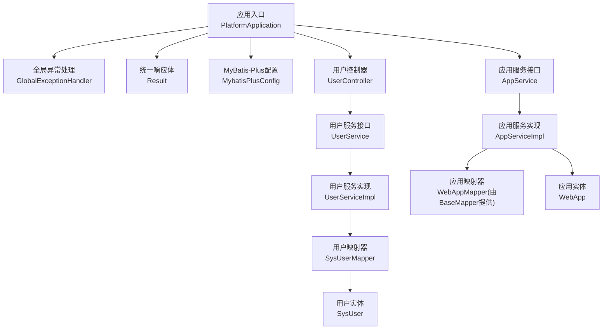
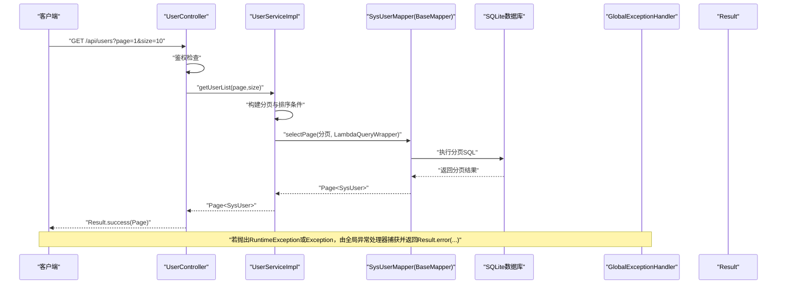
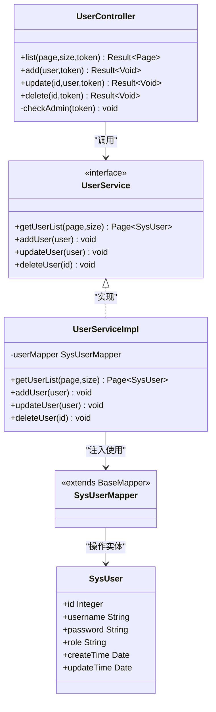
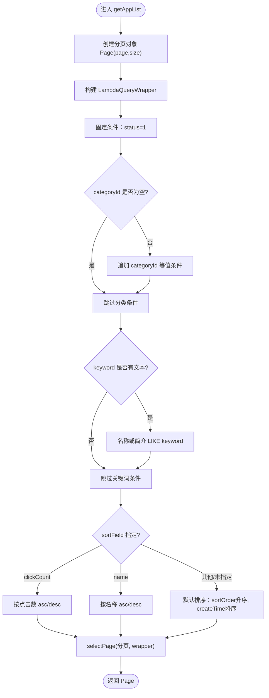
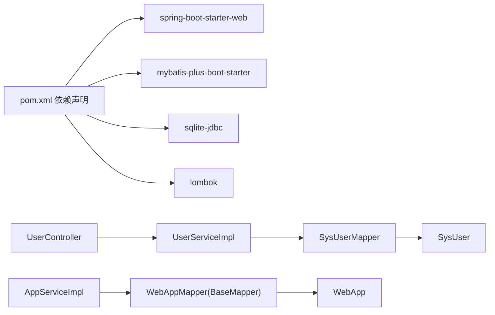

# 分层架构设计

<cite>
**本文引用的文件**   
- [PlatformApplication.java](file://backend/src/main/java/com/xx/platform/PlatformApplication.java)
- [application.yml](file://backend/src/main/resources/application.yml)
- [pom.xml](file://backend/pom.xml)
- [MybatisPlusConfig.java](file://backend/src/main/java/com/xx/platform/config/MybatisPlusConfig.java)
- [GlobalExceptionHandler.java](file://backend/src/main/java/com/xx/platform/common/GlobalExceptionHandler.java)
- [Result.java](file://backend/src/main/java/com/xx/platform/common/Result.java)
- [UserController.java](file://backend/src/main/java/com/xx/platform/controller/UserController.java)
- [UserService.java](file://backend/src/main/java/com/xx/platform/service/UserService.java)
- [UserServiceImpl.java](file://backend/src/main/java/com/xx/platform/service/impl/UserServiceImpl.java)
- [SysUserMapper.java](file://backend/src/main/java/com/xx/platform/mapper/SysUserMapper.java)
- [SysUser.java](file://backend/src/main/java/com/xx/platform/entity/SysUser.java)
- [AppService.java](file://backend/src/main/java/com/xx/platform/service/AppService.java)
- [AppServiceImpl.java](file://backend/src/main/java/com/xx/platform/service/impl/AppServiceImpl.java)
- [WebApp.java](file://backend/src/main/java/com/xx/platform/entity/WebApp.java)
- [ShowcaseItemMapper.java](file://backend/src/main/java/com/xx/platform/mapper/ShowcaseItemMapper.java)
- [schema.sql](file://backend/src/main/resources/schema.sql)
</cite>

## 目录
1. [简介](#简介)
2. [项目结构](#项目结构)
3. [核心组件](#核心组件)
4. [架构总览](#架构总览)
5. [详细组件分析](#详细组件分析)
6. [依赖关系分析](#依赖关系分析)
7. [性能考虑](#性能考虑)
8. [故障排查指南](#故障排查指南)
9. [结论](#结论)
10. [附录](#附录)

## 简介
本文件面向JZPlatform门户系统的后端实现，围绕MVC分层架构进行系统化说明：Controller层负责HTTP请求与响应、Service层封装业务逻辑、Mapper层承担数据访问、Entity层定义数据模型。文档重点阐述各层职责、调用关系与数据流转，结合具体CRUD流程展示分层协作方式，并深入讲解MyBatis-Plus在数据访问层的动态SQL生成、分页查询、条件构造器等特性。同时给出异常处理、事务管理与性能优化的最佳实践建议。

## 项目结构
后端采用Spring Boot + MyBatis-Plus的MVC分层组织方式，入口类扫描包路径，配置类集中管理数据库与插件，控制器暴露REST接口，服务层承载业务规则，映射器对接持久化，实体类描述表结构。

图示来源
- [PlatformApplication.java:1-16](file://backend/src/main/java/com/xx/platform/PlatformApplication.java#L1-L16)
- [MybatisPlusConfig.java:1-27](file://backend/src/main/java/com/xx/platform/config/MybatisPlusConfig.java#L1-L27)
- [GlobalExceptionHandler.java:1-30](file://backend/src/main/java/com/xx/platform/common/GlobalExceptionHandler.java#L1-L30)
- [Result.java:1-53](file://backend/src/main/java/com/xx/platform/common/Result.java#L1-L53)
- [UserController.java:1-88](file://backend/src/main/java/com/xx/platform/controller/UserController.java#L1-L88)
- [UserService.java:1-31](file://backend/src/main/java/com/xx/platform/service/UserService.java#L1-L31)
- [UserServiceImpl.java:1-53](file://backend/src/main/java/com/xx/platform/service/impl/UserServiceImpl.java#L1-L53)
- [SysUserMapper.java:1-12](file://backend/src/main/java/com/xx/platform/mapper/SysUserMapper.java#L1-L12)
- [SysUser.java:1-33](file://backend/src/main/java/com/xx/platform/entity/SysUser.java#L1-L33)
- [AppService.java:1-47](file://backend/src/main/java/com/xx/platform/service/AppService.java#L1-L47)
- [AppServiceImpl.java:1-105](file://backend/src/main/java/com/xx/platform/service/impl/AppServiceImpl.java#L1-L105)
- [WebApp.java:1-54](file://backend/src/main/java/com/xx/platform/entity/WebApp.java#L1-L54)

章节来源
- [PlatformApplication.java:1-16](file://backend/src/main/java/com/xx/platform/PlatformApplication.java#L1-L16)
- [application.yml:1-29](file://backend/src/main/resources/application.yml#L1-L29)
- [pom.xml:1-79](file://backend/pom.xml#L1-L79)

## 核心组件
- 应用入口与启动装配
  - 通过注解启用自动配置与组件扫描，启动Spring容器。
- 配置与基础设施
  - 数据源与MyBatis-Plus配置（分页插件、驼峰映射、日志输出等）。
  - 全局异常处理器与统一响应体，保证对外返回一致的结构。
- 控制器层
  - 以用户管理为例，接收参数、鉴权校验、调用服务层、包装结果。
- 服务层
  - 封装业务规则（如唯一性校验、状态默认值、时间戳填充）、组合条件查询、分页查询。
- 数据访问层
  - 基于MyBatis-Plus的BaseMapper，无需手写SQL即可实现CRUD；复杂查询使用LambdaQueryWrapper构建条件。
- 实体层
  - 使用注解映射表名、主键策略与字段命名约定。

章节来源
- [MybatisPlusConfig.java:1-27](file://backend/src/main/java/com/xx/platform/config/MybatisPlusConfig.java#L1-L27)
- [application.yml:15-25](file://backend/src/main/resources/application.yml#L15-L25)
- [GlobalExceptionHandler.java:1-30](file://backend/src/main/java/com/xx/platform/common/GlobalExceptionHandler.java#L1-L30)
- [Result.java:1-53](file://backend/src/main/java/com/xx/platform/common/Result.java#L1-L53)
- [UserController.java:1-88](file://backend/src/main/java/com/xx/platform/controller/UserController.java#L1-L88)
- [UserServiceImpl.java:1-53](file://backend/src/main/java/com/xx/platform/service/impl/UserServiceImpl.java#L1-L53)
- [SysUserMapper.java:1-12](file://backend/src/main/java/com/xx/platform/mapper/SysUserMapper.java#L1-L12)
- [SysUser.java:1-33](file://backend/src/main/java/com/xx/platform/entity/SysUser.java#L1-L33)
- [AppServiceImpl.java:1-105](file://backend/src/main/java/com/xx/platform/service/impl/AppServiceImpl.java#L1-L105)
- [WebApp.java:1-54](file://backend/src/main/java/com/xx/platform/entity/WebApp.java#L1-L54)

## 架构总览
下图展示了从HTTP请求到数据库访问的完整链路，以及异常与响应的统一处理机制。

图示来源
- [UserController.java:29-36](file://backend/src/main/java/com/xx/platform/controller/UserController.java#L29-L36)
- [UserServiceImpl.java:23-27](file://backend/src/main/java/com/xx/platform/service/impl/UserServiceImpl.java#L23-L27)
- [SysUserMapper.java:1-12](file://backend/src/main/java/com/xx/platform/mapper/SysUserMapper.java#L1-L12)
- [GlobalExceptionHandler.java:16-28](file://backend/src/main/java/com/xx/platform/common/GlobalExceptionHandler.java#L16-L28)
- [Result.java:24-43](file://backend/src/main/java/com/xx/platform/common/Result.java#L24-L43)

## 详细组件分析

### 用户管理CRUD的分层调用
- 控制器职责
  - 解析分页参数、校验管理员权限、调用服务层方法、返回统一响应。
- 服务层职责
  - 构建分页对象与排序条件；新增时做用户名唯一性校验并填充时间戳；更新时维护更新时间；删除按ID移除。
- 数据访问层职责
  - 继承BaseMapper，直接复用分页、条件查询、增删改查能力。
- 实体职责
  - 声明表名、主键自增策略、字段含义与时间类型。

图示来源
- [UserController.java:1-88](file://backend/src/main/java/com/xx/platform/controller/UserController.java#L1-L88)
- [UserService.java:1-31](file://backend/src/main/java/com/xx/platform/service/UserService.java#L1-L31)
- [UserServiceImpl.java:1-53](file://backend/src/main/java/com/xx/platform/service/impl/UserServiceImpl.java#L1-L53)
- [SysUserMapper.java:1-12](file://backend/src/main/java/com/xx/platform/mapper/SysUserMapper.java#L1-L12)
- [SysUser.java:1-33](file://backend/src/main/java/com/xx/platform/entity/SysUser.java#L1-L33)

章节来源
- [UserController.java:29-86](file://backend/src/main/java/com/xx/platform/controller/UserController.java#L29-L86)
- [UserServiceImpl.java:23-51](file://backend/src/main/java/com/xx/platform/service/impl/UserServiceImpl.java#L23-L51)
- [SysUser.java:13-32](file://backend/src/main/java/com/xx/platform/entity/SysUser.java#L13-L32)

### 应用列表查询（筛选、排序、分页）
- 服务层根据可选参数动态拼接查询条件：仅启用项、分类过滤、关键词模糊匹配、多字段排序与默认排序。
- 使用LambdaQueryWrapper构建条件，避免字符串拼接带来的可读性与安全问题。
- 分页通过MyBatis-Plus分页插件自动改写SQL。

图示来源
- [AppServiceImpl.java:24-62](file://backend/src/main/java/com/xx/platform/service/impl/AppServiceImpl.java#L24-L62)
- [WebApp.java:14-53](file://backend/src/main/java/com/xx/platform/entity/WebApp.java#L14-L53)

章节来源
- [AppService.java:12-25](file://backend/src/main/java/com/xx/platform/service/AppService.java#L12-L25)
- [AppServiceImpl.java:24-62](file://backend/src/main/java/com/xx/platform/service/impl/AppServiceImpl.java#L24-L62)
- [WebApp.java:14-53](file://backend/src/main/java/com/xx/platform/entity/WebApp.java#L14-L53)

### 宣贯项CRUD（示例）
- 控制器对新增、编辑、删除进行管理员鉴权后委托服务层处理。
- 映射器继承BaseMapper，具备基础CRUD能力。

章节来源
- [ShowcaseItemMapper.java:1-12](file://backend/src/main/java/com/xx/platform/mapper/ShowcaseItemMapper.java#L1-L12)
- [ShowcaseController.java:46-86](file://backend/src/main/java/com/xx/platform/controller/ShowcaseController.java#L46-L86)

## 依赖关系分析
- 外部依赖
  - Spring Boot Web、MyBatis-Plus、SQLite JDBC驱动、Lombok。
- 内部依赖
  - Controller依赖Service接口；Service实现依赖Mapper；Mapper基于BaseMapper提供通用能力；Entity作为数据载体贯穿各层。

图示来源
- [pom.xml:26-60](file://backend/pom.xml#L26-L60)
- [UserController.java:1-88](file://backend/src/main/java/com/xx/platform/controller/UserController.java#L1-L88)
- [UserServiceImpl.java:1-53](file://backend/src/main/java/com/xx/platform/service/impl/UserServiceImpl.java#L1-L53)
- [SysUserMapper.java:1-12](file://backend/src/main/java/com/xx/platform/mapper/SysUserMapper.java#L1-L12)
- [SysUser.java:1-33](file://backend/src/main/java/com/xx/platform/entity/SysUser.java#L1-L33)
- [AppServiceImpl.java:1-105](file://backend/src/main/java/com/xx/platform/service/impl/AppServiceImpl.java#L1-L105)
- [WebApp.java:1-54](file://backend/src/main/java/com/xx/platform/entity/WebApp.java#L1-L54)

章节来源
- [pom.xml:1-79](file://backend/pom.xml#L1-L79)

## 性能考虑
- 分页查询
  - 使用MyBatis-Plus分页插件，确保只拉取必要页的数据，降低内存与网络开销。
- 条件构造
  - 优先使用LambdaQueryWrapper进行条件拼装，避免全表扫描；为常用查询字段建立索引（生产环境建议迁移至支持索引的关系型数据库）。
- 批量操作
  - 大批量写入建议使用批量插入接口以减少往返次数。
- 连接与日志
  - 合理设置连接池大小与超时；开发阶段开启SQL日志便于定位慢查询，生产环境按需关闭或降级。
- 缓存
  - 热点读场景可引入本地或分布式缓存，减少数据库压力。

[本节为通用指导，不直接分析具体文件]

## 故障排查指南
- 统一异常处理
  - 全局异常处理器捕获运行时异常与未知异常，返回统一的错误码与消息，便于前端提示与日志追踪。
- 常见错误定位
  - 登录态缺失或无管理员权限：检查Authorization头与令牌有效性。
  - 用户名重复：新增前进行唯一性校验，明确错误信息。
  - 分页参数异常：确认page与size为正整数且符合预期范围。
- 日志与调试
  - 开启MyBatis SQL日志输出，核对生成的SQL是否符合预期；必要时调整条件构造或增加索引。

章节来源
- [GlobalExceptionHandler.java:16-28](file://backend/src/main/java/com/xx/platform/common/GlobalExceptionHandler.java#L16-L28)
- [UserController.java:78-86](file://backend/src/main/java/com/xx/platform/controller/UserController.java#L78-L86)
- [UserServiceImpl.java:31-40](file://backend/src/main/java/com/xx/platform/service/impl/UserServiceImpl.java#L31-L40)
- [application.yml:18-20](file://backend/src/main/resources/application.yml#L18-L20)

## 结论
本项目采用清晰的MVC分层架构，配合MyBatis-Plus提供的强大能力，实现了高内聚、低耦合的代码组织。Controller专注请求路由与鉴权，Service承载业务规则与条件组装，Mapper复用BaseMapper简化数据访问，Entity规范数据模型。通过统一异常处理与响应体，系统具备良好的可维护性与可扩展性。后续可在事务管理、缓存与索引优化等方面进一步增强稳定性与性能。

## 附录
- 数据库初始化与初始数据
  - 建表脚本包含用户、分类、平台配置等初始数据，便于快速启动验证。

章节来源
- [schema.sql:44-73](file://backend/src/main/resources/schema.sql#L44-L73)