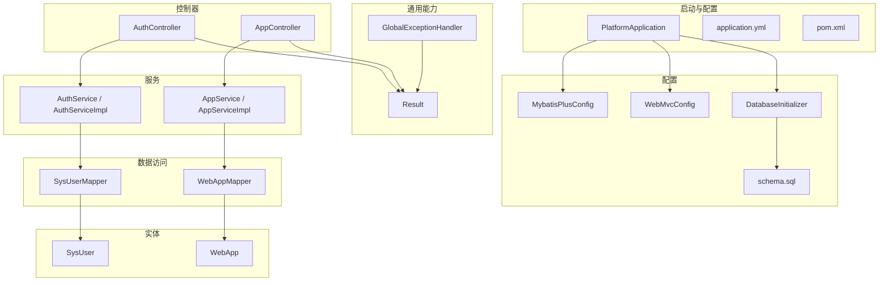
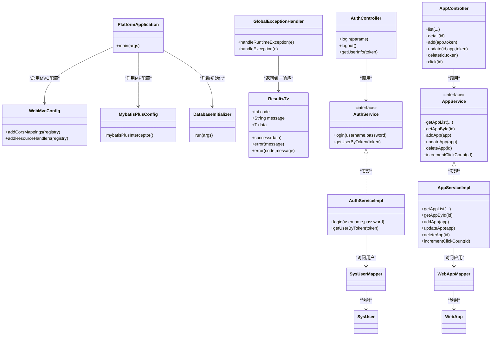
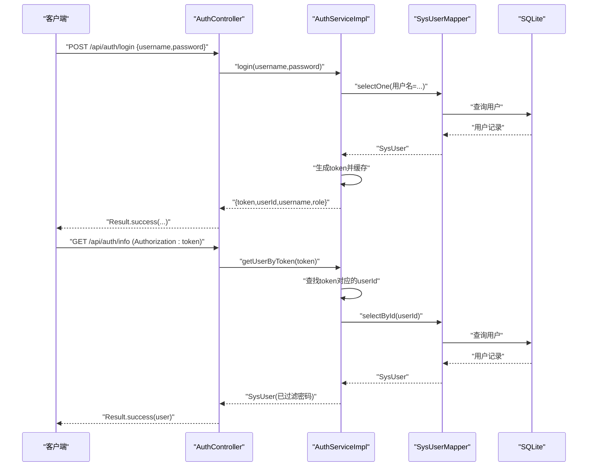
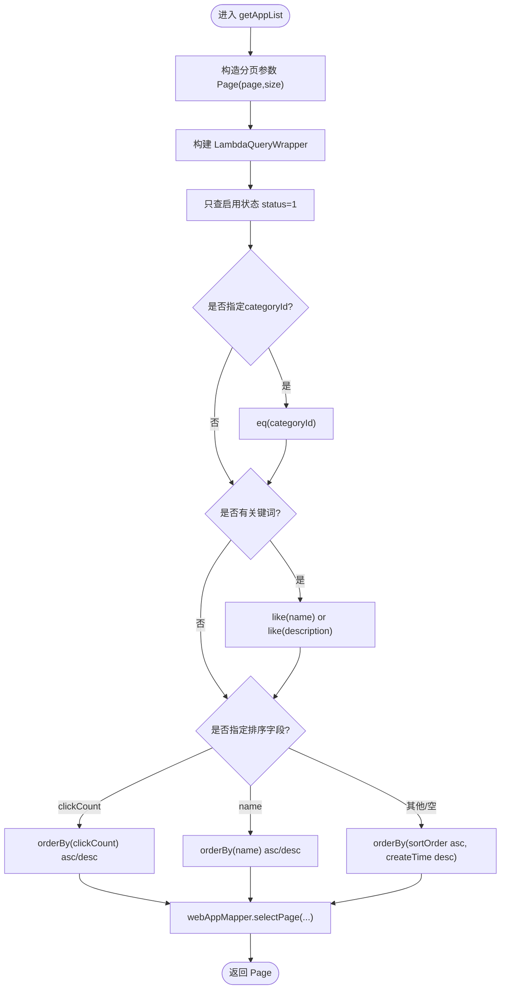
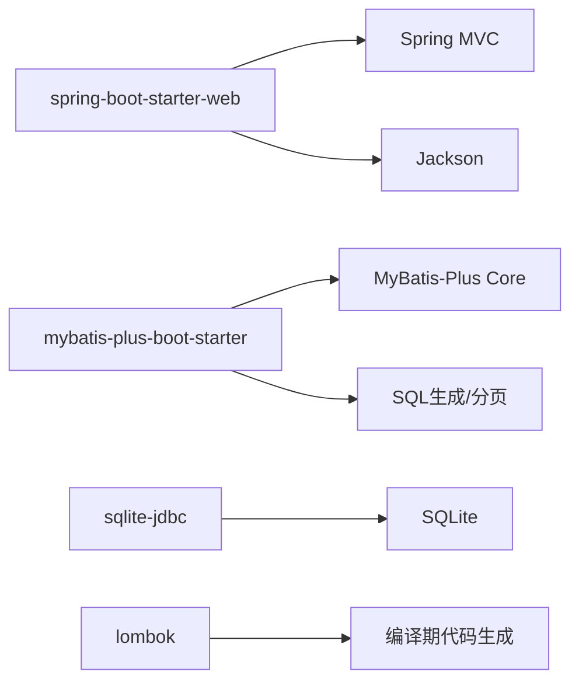

# 后端架构

<cite>
**本文引用的文件**   
- [PlatformApplication.java](file://backend/src/main/java/com/xx/platform/PlatformApplication.java)
- [pom.xml](file://backend/pom.xml)
- [application.yml](file://backend/src/main/resources/application.yml)
- [Result.java](file://backend/src/main/java/com/xx/platform/common/Result.java)
- [GlobalExceptionHandler.java](file://backend/src/main/java/com/xx/platform/common/GlobalExceptionHandler.java)
- [MybatisPlusConfig.java](file://backend/src/main/java/com/xx/platform/config/MybatisPlusConfig.java)
- [WebMvcConfig.java](file://backend/src/main/java/com/xx/platform/config/WebMvcConfig.java)
- [DatabaseInitializer.java](file://backend/src/main/java/com/xx/platform/config/DatabaseInitializer.java)
- [schema.sql](file://backend/src/main/resources/schema.sql)
- [AuthController.java](file://backend/src/main/java/com/xx/platform/controller/AuthController.java)
- [AuthService.java](file://backend/src/main/java/com/xx/platform/service/AuthService.java)
- [AuthServiceImpl.java](file://backend/src/main/java/com/xx/platform/service/impl/AuthServiceImpl.java)
- [SysUser.java](file://backend/src/main/java/com/xx/platform/entity/SysUser.java)
- [SysUserMapper.java](file://backend/src/main/java/com/xx/platform/mapper/SysUserMapper.java)
- [AppController.java](file://backend/src/main/java/com/xx/platform/controller/AppController.java)
- [AppService.java](file://backend/src/main/java/com/xx/platform/service/AppService.java)
- [AppServiceImpl.java](file://backend/src/main/java/com/xx/platform/service/impl/AppServiceImpl.java)
- [WebApp.java](file://backend/src/main/java/com/xx/platform/entity/WebApp.java)
- [WebAppMapper.java](file://backend/src/main/java/com/xx/platform/mapper/WebAppMapper.java)
</cite>

## 目录
1. [简介](#简介)
2. [项目结构](#项目结构)
3. [核心组件](#核心组件)
4. [架构总览](#架构总览)
5. [详细组件分析](#详细组件分析)
6. [依赖关系分析](#依赖关系分析)
7. [性能与扩展性](#性能与扩展性)
8. [故障排查指南](#故障排查指南)
9. [结论](#结论)

## 简介
本文件面向JZPlatform门户系统的后端部分，基于Spring Boot + MyBatis-Plus构建，采用典型的分层架构（Controller → Service → Mapper → Entity），提供RESTful API、统一响应格式与全局异常处理。文档同时覆盖自动配置原理、依赖注入机制、AOP切面应用建议、安全配置要点、性能优化策略与扩展性考虑，帮助读者快速理解并高效扩展系统。

## 项目结构
后端采用按功能域划分的包结构：
- common：通用能力（统一响应体、全局异常）
- config：配置类（MVC、MyBatis-Plus、数据库初始化）
- controller：HTTP接口层
- service / impl：业务逻辑层
- mapper：数据访问接口（继承BaseMapper）
- entity：领域实体（映射表结构）
- resources：配置文件与SQL脚本

图示来源
- [PlatformApplication.java:10-14](file://backend/src/main/java/com/xx/platform/PlatformApplication.java#L10-L14)
- [application.yml:1-29](file://backend/src/main/resources/application.yml#L1-L29)
- [pom.xml:26-60](file://backend/pom.xml#L26-L60)
- [Result.java:1-53](file://backend/src/main/java/com/xx/platform/common/Result.java#L1-L53)
- [GlobalExceptionHandler.java:10-29](file://backend/src/main/java/com/xx/platform/common/GlobalExceptionHandler.java#L10-L29)
- [MybatisPlusConfig.java:13-26](file://backend/src/main/java/com/xx/platform/config/MybatisPlusConfig.java#L13-L26)
- [WebMvcConfig.java:12-36](file://backend/src/main/java/com/xx/platform/config/WebMvcConfig.java#L12-L36)
- [DatabaseInitializer.java:20-44](file://backend/src/main/java/com/xx/platform/config/DatabaseInitializer.java#L20-L44)
- [schema.sql:1-80](file://backend/src/main/resources/schema.sql#L1-L80)
- [AuthController.java:15-67](file://backend/src/main/java/com/xx/platform/controller/AuthController.java#L15-L67)
- [AppController.java:17-110](file://backend/src/main/java/com/xx/platform/controller/AppController.java#L17-L110)
- [AuthService.java:10-26](file://backend/src/main/java/com/xx/platform/service/AuthService.java#L10-L26)
- [AuthServiceImpl.java:19-61](file://backend/src/main/java/com/xx/platform/service/impl/AuthServiceImpl.java#L19-L61)
- [AppService.java:9-46](file://backend/src/main/java/com/xx/platform/service/AppService.java#L9-L46)
- [AppServiceImpl.java:17-104](file://backend/src/main/java/com/xx/platform/service/impl/AppServiceImpl.java#L17-L104)
- [SysUserMapper.java:10-12](file://backend/src/main/java/com/xx/platform/mapper/SysUserMapper.java#L10-L12)
- [WebAppMapper.java:10-12](file://backend/src/main/java/com/xx/platform/mapper/WebAppMapper.java#L10-L12)
- [SysUser.java:13-32](file://backend/src/main/java/com/xx/platform/entity/SysUser.java#L13-L32)
- [WebApp.java:13-53](file://backend/src/main/java/com/xx/platform/entity/WebApp.java#L13-L53)

章节来源
- [PlatformApplication.java:10-14](file://backend/src/main/java/com/xx/platform/PlatformApplication.java#L10-L14)
- [pom.xml:26-60](file://backend/pom.xml#L26-L60)
- [application.yml:1-29](file://backend/src/main/resources/application.yml#L1-L29)

## 核心组件
- 统一响应体 Result<T>：封装code、message、data，提供success/error静态工厂方法，便于前后端一致交互。
- 全局异常处理器 GlobalExceptionHandler：使用@RestControllerAdvice捕获运行时异常与未处理异常，返回友好提示。
- 配置类
  - MybatisPlusConfig：注册分页插件，适配SQLite方言。
  - WebMvcConfig：开启跨域、映射上传静态资源路径。
  - DatabaseInitializer：启动时执行schema.sql完成建表与初始数据。
- 认证流程：AuthController → AuthServiceImpl → SysUserMapper；内存Token存储用于演示，生产建议替换为Redis或JWT持久化。
- 应用管理：AppController → AppServiceImpl → WebAppMapper，支持分页、筛选、排序与点击计数。

章节来源
- [Result.java:1-53](file://backend/src/main/java/com/xx/platform/common/Result.java#L1-L53)
- [GlobalExceptionHandler.java:10-29](file://backend/src/main/java/com/xx/platform/common/GlobalExceptionHandler.java#L10-L29)
- [MybatisPlusConfig.java:13-26](file://backend/src/main/java/com/xx/platform/config/MybatisPlusConfig.java#L13-L26)
- [WebMvcConfig.java:12-36](file://backend/src/main/java/com/xx/platform/config/WebMvcConfig.java#L12-L36)
- [DatabaseInitializer.java:20-44](file://backend/src/main/java/com/xx/platform/config/DatabaseInitializer.java#L20-L44)
- [AuthController.java:15-67](file://backend/src/main/java/com/xx/platform/controller/AuthController.java#L15-L67)
- [AuthServiceImpl.java:19-61](file://backend/src/main/java/com/xx/platform/service/impl/AuthServiceImpl.java#L19-L61)
- [AppController.java:17-110](file://backend/src/main/java/com/xx/platform/controller/AppController.java#L17-L110)
- [AppServiceImpl.java:17-104](file://backend/src/main/java/com/xx/platform/service/impl/AppServiceImpl.java#L17-L104)

## 架构总览
系统遵循“控制层→服务层→数据访问层→实体”的分层设计，结合Spring Boot自动装配与MyBatis-Plus的CRUD增强能力，实现快速开发与稳定运行。

图示来源
- [PlatformApplication.java:10-14](file://backend/src/main/java/com/xx/platform/PlatformApplication.java#L10-L14)
- [WebMvcConfig.java:12-36](file://backend/src/main/java/com/xx/platform/config/WebMvcConfig.java#L12-L36)
- [MybatisPlusConfig.java:13-26](file://backend/src/main/java/com/xx/platform/config/MybatisPlusConfig.java#L13-L26)
- [DatabaseInitializer.java:20-44](file://backend/src/main/java/com/xx/platform/config/DatabaseInitializer.java#L20-L44)
- [GlobalExceptionHandler.java:10-29](file://backend/src/main/java/com/xx/platform/common/GlobalExceptionHandler.java#L10-L29)
- [Result.java:1-53](file://backend/src/main/java/com/xx/platform/common/Result.java#L1-L53)
- [AuthController.java:15-67](file://backend/src/main/java/com/xx/platform/controller/AuthController.java#L15-L67)
- [AuthService.java:10-26](file://backend/src/main/java/com/xx/platform/service/AuthService.java#L10-L26)
- [AuthServiceImpl.java:19-61](file://backend/src/main/java/com/xx/platform/service/impl/AuthServiceImpl.java#L19-L61)
- [AppController.java:17-110](file://backend/src/main/java/com/xx/platform/controller/AppController.java#L17-L110)
- [AppService.java:9-46](file://backend/src/main/java/com/xx/platform/service/AppService.java#L9-L46)
- [AppServiceImpl.java:17-104](file://backend/src/main/java/com/xx/platform/service/impl/AppServiceImpl.java#L17-L104)
- [SysUserMapper.java:10-12](file://backend/src/main/java/com/xx/platform/mapper/SysUserMapper.java#L10-L12)
- [WebAppMapper.java:10-12](file://backend/src/main/java/com/xx/platform/mapper/WebAppMapper.java#L10-L12)
- [SysUser.java:13-32](file://backend/src/main/java/com/xx/platform/entity/SysUser.java#L13-L32)
- [WebApp.java:13-53](file://backend/src/main/java/com/xx/platform/entity/WebApp.java#L13-L53)

## 详细组件分析

### 认证模块（登录、鉴权）
- 接口设计
  - POST /api/auth/login：接收用户名与密码，返回token与基础信息。
  - POST /api/auth/logout：客户端清除token即可。
  - GET /api/auth/info：从请求头读取Authorization，校验token有效性并返回用户信息（不含密码）。
- 业务流程
  - 控制器参数校验后委托服务层。
  - 服务层查询用户，生成内存Token并缓存，返回结果。
  - 获取用户信息时根据token反查用户。
- 安全说明
  - 当前为内存Token，适合内部演示；生产环境建议使用Redis或无状态JWT，并增加过期时间、刷新机制与防重放策略。
  - 密码明文比对仅用于示例，生产需加盐哈希（如BCrypt）。

图示来源
- [AuthController.java:28-66](file://backend/src/main/java/com/xx/platform/controller/AuthController.java#L28-L66)
- [AuthServiceImpl.java:29-60](file://backend/src/main/java/com/xx/platform/service/impl/AuthServiceImpl.java#L29-L60)
- [SysUserMapper.java:10-12](file://backend/src/main/java/com/xx/platform/mapper/SysUserMapper.java#L10-L12)
- [SysUser.java:13-32](file://backend/src/main/java/com/xx/platform/entity/SysUser.java#L13-L32)

章节来源
- [AuthController.java:15-67](file://backend/src/main/java/com/xx/platform/controller/AuthController.java#L15-L67)
- [AuthService.java:10-26](file://backend/src/main/java/com/xx/platform/service/AuthService.java#L10-L26)
- [AuthServiceImpl.java:19-61](file://backend/src/main/java/com/xx/platform/service/impl/AuthServiceImpl.java#L19-L61)
- [SysUser.java:13-32](file://backend/src/main/java/com/xx/platform/entity/SysUser.java#L13-L32)
- [SysUserMapper.java:10-12](file://backend/src/main/java/com/xx/platform/mapper/SysUserMapper.java#L10-L12)

### 应用管理模块（CRUD、分页、排序、点击统计）
- 接口设计
  - GET /api/apps：分页、分类筛选、关键词搜索、排序。
  - GET /api/apps/{id}：详情。
  - POST /api/apps：新增（管理员）。
  - PUT /api/apps/{id}：编辑（管理员）。
  - DELETE /api/apps/{id}：删除（管理员）。
  - POST /api/apps/{id}/click：记录点击（公开）。
- 业务逻辑
  - 列表查询通过LambdaQueryWrapper动态拼接条件，默认仅查询启用状态。
  - 排序支持clickCount与name，缺省按sortOrder升序、createTime降序。
  - 点击计数在存在记录时自增并更新时间戳。
  - 管理员操作通过检查Authorization中的token并验证角色为ADMIN。

图示来源
- [AppServiceImpl.java:24-62](file://backend/src/main/java/com/xx/platform/service/impl/AppServiceImpl.java#L24-L62)
- [WebAppMapper.java:10-12](file://backend/src/main/java/com/xx/platform/mapper/WebAppMapper.java#L10-L12)
- [WebApp.java:13-53](file://backend/src/main/java/com/xx/platform/entity/WebApp.java#L13-L53)

章节来源
- [AppController.java:31-96](file://backend/src/main/java/com/xx/platform/controller/AppController.java#L31-L96)
- [AppService.java:12-46](file://backend/src/main/java/com/xx/platform/service/AppService.java#L12-L46)
- [AppServiceImpl.java:17-104](file://backend/src/main/java/com/xx/platform/service/impl/AppServiceImpl.java#L17-L104)
- [WebApp.java:13-53](file://backend/src/main/java/com/xx/platform/entity/WebApp.java#L13-L53)
- [WebAppMapper.java:10-12](file://backend/src/main/java/com/xx/platform/mapper/WebAppMapper.java#L10-L12)

### 统一响应与全局异常
- 统一响应
  - Result<T>提供成功与失败两种构造方式，包含code、message、data三要素，便于前端统一处理。
- 全局异常
  - 使用@RestControllerAdvice拦截RuntimeException与Exception，返回友好的错误消息；未捕获异常会打印堆栈并返回服务器内部错误提示。

章节来源
- [Result.java:1-53](file://backend/src/main/java/com/xx/platform/common/Result.java#L1-L53)
- [GlobalExceptionHandler.java:10-29](file://backend/src/main/java/com/xx/platform/common/GlobalExceptionHandler.java#L10-L29)

### 配置与初始化
- application.yml
  - 端口、SQLite数据源、文件上传大小限制、MyBatis-Plus驼峰映射与日志输出、主键策略等。
- MybatisPlusConfig
  - 注册分页插件并指定SQLite方言，确保分页SQL正确生成。
- WebMvcConfig
  - 开放/api/**跨域，允许常用方法与携带凭证；将/uploads/**映射到本地uploads目录以访问上传文件。
- DatabaseInitializer
  - 启动时读取classpath下的schema.sql，按分号拆分语句执行，完成建表与初始数据插入。

章节来源
- [application.yml:1-29](file://backend/src/main/resources/application.yml#L1-L29)
- [MybatisPlusConfig.java:13-26](file://backend/src/main/java/com/xx/platform/config/MybatisPlusConfig.java#L13-L26)
- [WebMvcConfig.java:12-36](file://backend/src/main/java/com/xx/platform/config/WebMvcConfig.java#L12-L36)
- [DatabaseInitializer.java:20-44](file://backend/src/main/java/com/xx/platform/config/DatabaseInitializer.java#L20-L44)
- [schema.sql:1-80](file://backend/src/main/resources/schema.sql#L1-L80)

## 依赖关系分析
- Spring Boot Starter Web：提供嵌入式Tomcat、MVC、JSON序列化等能力。
- MyBatis-Plus Boot Starter：简化CRUD、分页、条件构造器、自动填充等。
- SQLite JDBC：轻量级嵌入式数据库驱动。
- Lombok：减少样板代码。
- Spring Boot Test：单元测试支撑。

图示来源
- [pom.xml:26-60](file://backend/pom.xml#L26-L60)

章节来源
- [pom.xml:26-60](file://backend/pom.xml#L26-L60)

## 性能与扩展性
- 自动配置原理
  - @SpringBootApplication组合了@EnableAutoConfiguration，依据classpath与属性自动装配Web容器、MVC、MyBatis-Plus等组件。
- 依赖注入机制
  - 通过@Autowired在Controller/Service/Mapper中注入实例，由Spring容器负责生命周期管理与循环依赖检测。
- AOP切面编程的应用建议
  - 可引入@Aspect对Controller进行横切关注点处理，如统一日志、权限校验、限流、审计等，避免在每个方法中重复编写。
- 安全配置建议
  - 引入Spring Security或自定义过滤器链，集中处理认证与授权；结合JWT或Session方案，完善令牌签发、校验与续期。
- 性能优化
  - 分页查询：利用MyBatis-Plus分页插件，避免全表扫描。
  - 索引优化：对高频查询字段（如category_id、status、name）建立索引。
  - 连接池：生产环境建议切换至HikariCP并合理配置最大连接数与超时。
  - 缓存：热点数据（如平台配置、分类）可使用本地缓存或Redis。
  - 异步：点击计数等非关键路径可异步落库，降低请求延迟。
- 扩展性考虑
  - 多租户：通过租户标识隔离数据，或在查询条件中强制附加租户ID。
  - 多数据源：若后续引入MySQL/PostgreSQL，可通过动态数据源路由。
  - 事件驱动：将点击计数、审计日志等解耦为事件，提升吞吐与可维护性。

[本节为通用指导，不直接分析具体文件]

## 故障排查指南
- 常见异常
  - 运行时业务异常：由全局异常处理器捕获并返回统一错误码与消息。
  - 未捕获异常：打印堆栈并返回服务器内部错误提示，便于定位问题。
- 常见问题定位
  - 数据库初始化失败：检查schema.sql语法与SQLite兼容性，确认DatabaseInitializer正常执行。
  - 跨域报错：确认WebMvcConfig中/api/**的allowedOriginPatterns与allowCredentials设置。
  - 静态资源无法访问：确认/upload映射路径与实际文件目录一致。
  - 分页异常：确认MybatisPlusConfig中分页插件与SQLite方言配置正确。
- 日志与调试
  - 开启MyBatis-Plus SQL日志输出，观察实际执行的SQL语句。
  - 针对关键接口添加链路追踪或结构化日志，便于问题复现与分析。

章节来源
- [GlobalExceptionHandler.java:10-29](file://backend/src/main/java/com/xx/platform/common/GlobalExceptionHandler.java#L10-L29)
- [DatabaseInitializer.java:20-44](file://backend/src/main/java/com/xx/platform/config/DatabaseInitializer.java#L20-L44)
- [WebMvcConfig.java:12-36](file://backend/src/main/java/com/xx/platform/config/WebMvcConfig.java#L12-L36)
- [MybatisPlusConfig.java:13-26](file://backend/src/main/java/com/xx/platform/config/MybatisPlusConfig.java#L13-L26)
- [application.yml:15-25](file://backend/src/main/resources/application.yml#L15-L25)

## 结论
本项目基于Spring Boot与MyBatis-Plus构建了清晰的分层架构，提供了统一的响应体与异常处理、完善的MVC与数据库初始化配置，以及可扩展的认证与应用管理能力。在生产环境中，建议引入更健壮的安全框架、分布式缓存与连接池优化，并通过AOP与事件机制进一步提升可观测性与扩展性。