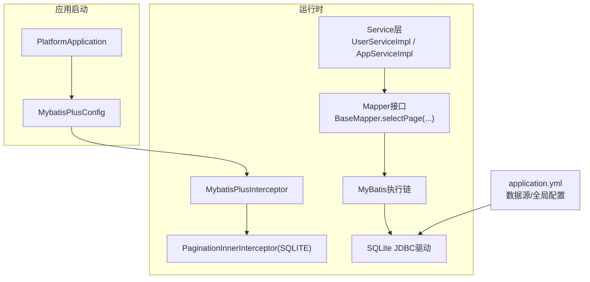
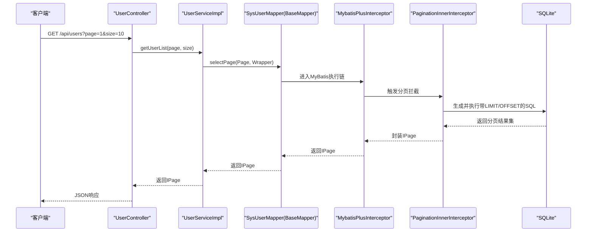
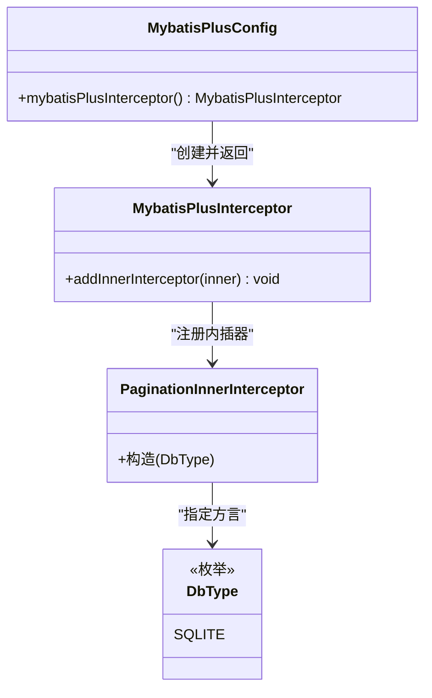
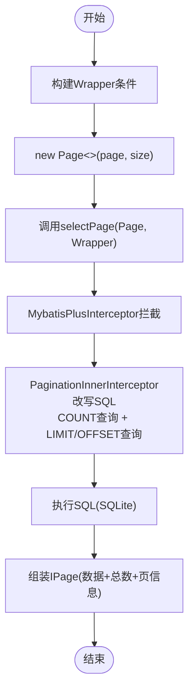
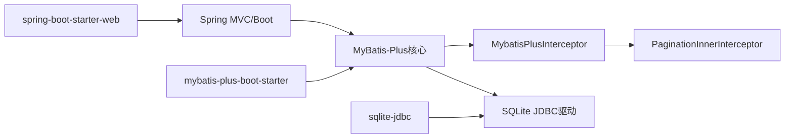

# MyBatis-Plus配置

<cite>
**本文引用的文件列表**
- [MybatisPlusConfig.java](file://backend/src/main/java/com/xx/platform/config/MybatisPlusConfig.java)
- [application.yml](file://backend/src/main/resources/application.yml)
- [pom.xml](file://backend/pom.xml)
- [UserServiceImpl.java](file://backend/src/main/java/com/xx/platform/service/impl/UserServiceImpl.java)
- [AppServiceImpl.java](file://backend/src/main/java/com/xx/platform/service/impl/AppServiceImpl.java)
- [UserController.java](file://backend/src/main/java/com/xx/platform/controller/UserController.java)
- [schema.sql](file://backend/src/main/resources/schema.sql)
</cite>

## 目录
1. [简介](#简介)
2. [项目结构](#项目结构)
3. [核心组件](#核心组件)
4. [架构总览](#架构总览)
5. [详细组件分析](#详细组件分析)
6. [依赖分析](#依赖分析)
7. [性能考虑](#性能考虑)
8. [故障排查指南](#故障排查指南)
9. [结论](#结论)
10. [附录](#附录)

## 简介
本技术文档围绕JZPlatform门户系统的MyBatis-Plus配置展开，重点说明：
- MybatisPlusInterceptor的配置原理与扩展机制
- PaginationInnerInterceptor分页插件在SQLite环境下的使用方法、SQL生成机制与优化策略
- SQLite数据库类型相关配置项与注意事项
- 复杂查询与多表关联的分页最佳实践
- 如何扩展其他MyBatis-Plus插件（如乐观锁、逻辑删除等）
- 关键配置参数说明与调优建议

## 项目结构
后端采用Spring Boot + MyBatis-Plus + SQLite的轻量架构。MyBatis-Plus的核心配置集中在配置类与全局配置文件中；分页能力通过拦截器注入到SqlSession执行链路中，对selectPage等方法进行拦截并改写SQL。

图表来源
- [MybatisPlusConfig.java:1-26](file://backend/src/main/java/com/xx/platform/config/MybatisPlusConfig.java#L1-L26)
- [application.yml:1-29](file://backend/src/main/resources/application.yml#L1-L29)
- [UserServiceImpl.java:1-53](file://backend/src/main/java/com/xx/platform/service/impl/UserServiceImpl.java#L1-L53)
- [AppServiceImpl.java:1-105](file://backend/src/main/java/com/xx/platform/service/impl/AppServiceImpl.java#L1-L105)

章节来源
- [MybatisPlusConfig.java:1-26](file://backend/src/main/java/com/xx/platform/config/MybatisPlusConfig.java#L1-L26)
- [application.yml:1-29](file://backend/src/main/resources/application.yml#L1-L29)
- [pom.xml:1-79](file://backend/pom.xml#L1-L79)

## 核心组件
- MybatisPlusInterceptor：MyBatis-Plus的统一拦截器容器，负责注册多个InnerInterceptor，按顺序参与SQL执行生命周期。
- PaginationInnerInterceptor：分页拦截器，针对selectPage/selectCount等方法进行拦截，根据DbType生成对应方言的分页SQL。
- application.yml中的mybatis-plus.global-config.db-config.id-type：为SQLite设置自增主键策略。
- pom.xml引入的mybatis-plus-boot-starter与sqlite-jdbc驱动：提供分页与SQLite支持。

章节来源
- [MybatisPlusConfig.java:1-26](file://backend/src/main/java/com/xx/platform/config/MybatisPlusConfig.java#L1-L26)
- [application.yml:15-25](file://backend/src/main/resources/application.yml#L15-L25)
- [pom.xml:21-45](file://backend/pom.xml#L21-L45)

## 架构总览
下图展示了从控制器到数据库的分页调用链路，以及MyBatis-Plus拦截器的介入点。

图表来源
- [UserController.java:25-36](file://backend/src/main/java/com/xx/platform/controller/UserController.java#L25-L36)
- [UserServiceImpl.java:22-27](file://backend/src/main/java/com/xx/platform/service/impl/UserServiceImpl.java#L22-L27)
- [MybatisPlusConfig.java:20-25](file://backend/src/main/java/com/xx/platform/config/MybatisPlusConfig.java#L20-L25)

## 详细组件分析

### MybatisPlusInterceptor与PaginationInnerInterceptor配置
- 配置位置：MybatisPlusConfig中定义Bean，创建MybatisPlusInterceptor实例，并通过addInnerInterceptor添加PaginationInnerInterceptor。
- DbType选择：当前使用DbType.SQLITE，确保分页SQL使用SQLite语法（LIMIT/OFFSET）。
- 扩展性：可在同一拦截器容器中继续添加其他InnerInterceptor（如乐观锁、租户、动态表名等），注意顺序影响。

章节来源
- [MybatisPlusConfig.java:1-26](file://backend/src/main/java/com/xx/platform/config/MybatisPlusConfig.java#L1-L26)

#### 类关系图

图表来源
- [MybatisPlusConfig.java:1-26](file://backend/src/main/java/com/xx/platform/config/MybatisPlusConfig.java#L1-L26)

### SQLite数据库类型配置与分页SQL生成
- 数据源与驱动：application.yml中配置SQLite URL与driver-class-name；pom.xml引入sqlite-jdbc驱动。
- 主键策略：global-config.db-config.id-type设置为auto，配合实体@TableId(type = IdType.AUTO)或默认策略，使SQLite使用AUTOINCREMENT。
- 分页SQL生成：PaginationInnerInterceptor根据DbType.SQLITE将selectPage改写为包含LIMIT和OFFSET的SQL；count查询用于统计总数。

章节来源
- [application.yml:4-8](file://backend/src/main/resources/application.yml#L4-L8)
- [application.yml:15-25](file://backend/src/main/resources/application.yml#L15-L25)
- [pom.xml:40-45](file://backend/pom.xml#L40-L45)
- [schema.sql:5-12](file://backend/src/main/resources/schema.sql#L5-L12)

#### 分页流程时序（SQLite）

图表来源
- [UserServiceImpl.java:22-27](file://backend/src/main/java/com/xx/platform/service/impl/UserServiceImpl.java#L22-L27)
- [MybatisPlusConfig.java:20-25](file://backend/src/main/java/com/xx/platform/config/MybatisPlusConfig.java#L20-L25)

### 分页查询最佳实践示例

#### 基础分页（单表）
- 场景：用户列表分页，按创建时间倒序。
- 要点：
  - 使用Page构造分页参数
  - 使用LambdaQueryWrapper构建排序与过滤条件
  - 直接调用BaseMapper.selectPage完成分页

章节来源
- [UserServiceImpl.java:22-27](file://backend/src/main/java/com/xx/platform/service/impl/UserServiceImpl.java#L22-L27)
- [UserController.java:25-36](file://backend/src/main/java/com/xx/platform/controller/UserController.java#L25-L36)

#### 复杂条件分页（单表）
- 场景：Web应用列表分页，支持分类筛选、关键词模糊匹配、多字段排序。
- 要点：
  - 组合eq/like/or/orderBy等条件
  - 默认排序兜底，保证分页稳定性
  - 仅查询启用状态，减少无效数据

章节来源
- [AppServiceImpl.java:24-61](file://backend/src/main/java/com/xx/platform/service/impl/AppServiceImpl.java#L24-L61)

#### 多表关联分页（推荐实现思路）
- 方案一（推荐）：在XML中使用JOIN编写分页SQL，并在service层传入Page对象，由PaginationInnerInterceptor改写最终SQL。
- 方案二：先分页主表，再批量加载关联数据（适合一对多且子表数据量大的场景）。
- 注意：
  - 避免在分页前做全表扫描或大结果集聚合
  - 合理设计索引，尤其是WHERE与ORDER BY涉及的列
  - 对于SQLite，尽量使用显式LIMIT/OFFSET，避免超大偏移量

[本节为通用实践指导，不直接分析具体代码文件]

### 扩展其他MyBatis-Plus插件
- 乐观锁：添加OptimisticLockerInnerInterceptor，适用于并发更新场景，需配合@Version注解字段。
- 逻辑删除：添加LogicalDeleteInnerInterceptor，结合@TableLogic注解实现软删除。
- 多租户：添加TenantLineInnerInterceptor，基于租户上下文自动拼接tenant_id条件。
- 动态表名：添加DynamicTableNameInnerInterceptor，按规则动态切换表名。
- 安装方式：在同一MybatisPlusInterceptor实例中依次addInnerInterceptor，顺序会影响执行效果。

[本节为通用扩展指导，不直接分析具体代码文件]

## 依赖分析
- Spring Boot Starter Web：提供Web运行环境
- mybatis-plus-boot-starter：集成MyBatis-Plus，自动装配分页拦截器等
- sqlite-jdbc：SQLite JDBC驱动，支撑SQLite数据库访问

图表来源
- [pom.xml:26-45](file://backend/pom.xml#L26-L45)

章节来源
- [pom.xml:21-45](file://backend/pom.xml#L21-L45)

## 性能考虑
- 分页偏移量过大时，SQLite的LIMIT/OFFSET性能会下降，建议：
  - 使用“游标分页”（基于上一页最大ID）替代深翻页
  - 为排序与过滤字段建立合适索引
- 避免在分页前进行不必要的聚合或跨库查询
- 控制每页大小，防止一次性返回过多数据
- 合理使用count查询，必要时可关闭count以提升性能（需权衡前端展示）

[本节为通用性能建议，不直接分析具体代码文件]

## 故障排查指南
- 分页不生效
  - 检查是否注册了PaginationInnerInterceptor
  - 确认调用的是selectPage而非普通selectList
  - 确认DbType与实际数据库一致
- SQLite主键自增异常
  - 检查id-type是否为auto，实体是否使用IdType.AUTO
  - 确认建表语句使用INTEGER PRIMARY KEY AUTOINCREMENT
- 分页结果总数不正确
  - 检查Wrapper条件是否正确传递至count查询
  - 确认没有重复条件或冲突条件导致count偏差
- 日志定位
  - 开启mybatis-plus.configuration.log-impl输出SQL，便于观察改写后的分页SQL

章节来源
- [MybatisPlusConfig.java:20-25](file://backend/src/main/java/com/xx/platform/config/MybatisPlusConfig.java#L20-L25)
- [application.yml:18-20](file://backend/src/main/resources/application.yml#L18-L20)
- [schema.sql:5-12](file://backend/src/main/resources/schema.sql#L5-L12)

## 结论
本项目通过MybatisPlusInterceptor统一注册PaginationInnerInterceptor，并结合application.yml的全局配置，实现了SQLite环境下稳定、易用的分页能力。在此基础上，可按需扩展乐观锁、逻辑删除等插件，满足更复杂的业务需求。实际使用中应关注分页性能与索引设计，避免深翻页带来的性能问题。

## 附录

### 关键配置参数说明
- spring.datasource.url：SQLite数据库路径
- spring.datasource.driver-class-name：org.sqlite.JDBC
- mybatis-plus.mapper-locations：XML映射文件位置
- mybatis-plus.configuration.map-underscore-to-camel-case：下划线转驼峰
- mybatis-plus.configuration.log-impl：SQL日志输出实现
- mybatis-plus.global-config.db-config.id-type：主键策略（SQLite使用auto）

章节来源
- [application.yml:4-8](file://backend/src/main/resources/application.yml#L4-L8)
- [application.yml:15-25](file://backend/src/main/resources/application.yml#L15-L25)