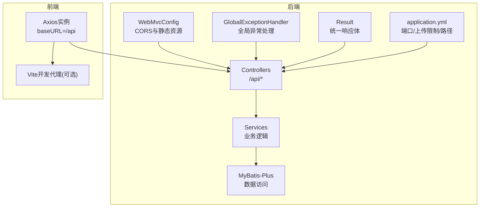
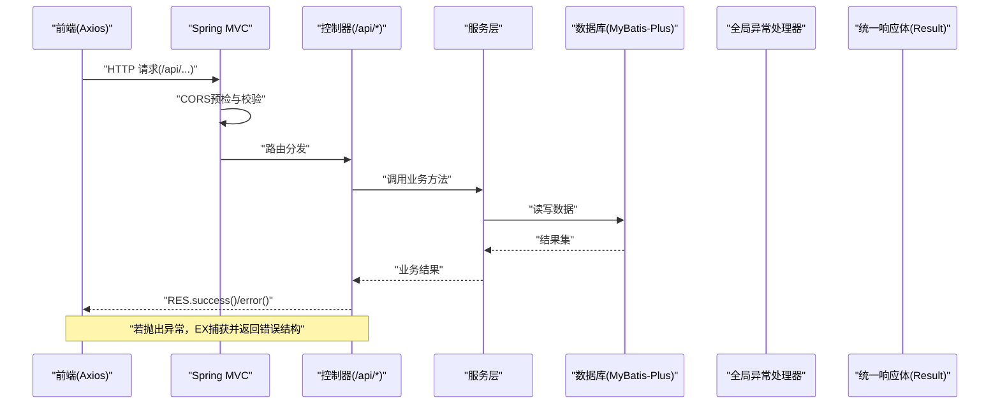
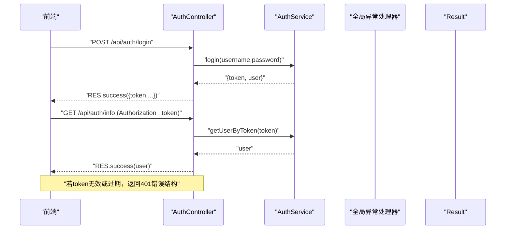
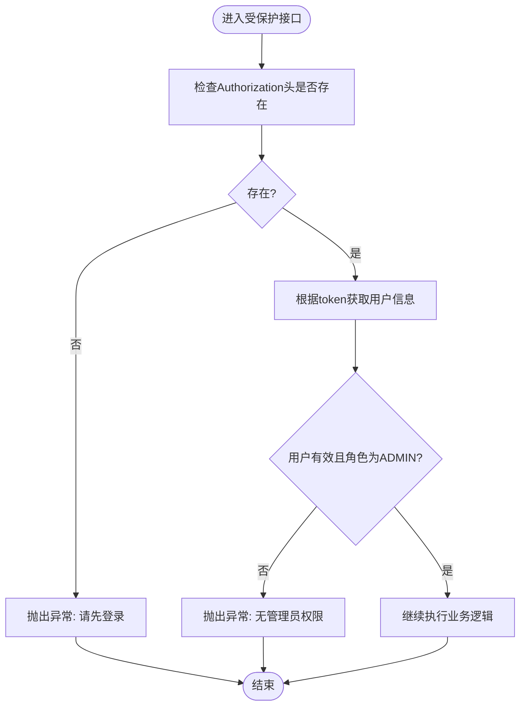
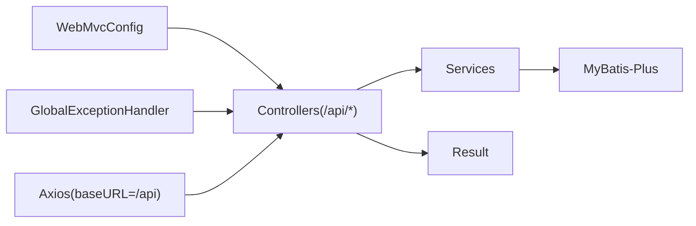

# Web MVC配置

<cite>
**本文引用的文件**
- [WebMvcConfig.java](file://backend/src/main/java/com/xx/platform/config/WebMvcConfig.java)
- [application.yml](file://backend/src/main/resources/application.yml)
- [GlobalExceptionHandler.java](file://backend/src/main/java/com/xx/platform/common/GlobalExceptionHandler.java)
- [Result.java](file://backend/src/main/java/com/xx/platform/common/Result.java)
- [AuthController.java](file://backend/src/main/java/com/xx/platform/controller/AuthController.java)
- [AppController.java](file://backend/src/main/java/com/xx/platform/controller/AppController.java)
- [UserController.java](file://backend/src/main/java/com/xx/platform/controller/UserController.java)
- [ConfigController.java](file://backend/src/main/java/com/xx/platform/controller/ConfigController.java)
- [request.js](file://frontend/src/api/request.js)
- [API.md](file://API.md)
</cite>

## 目录
1. [简介](#简介)
2. [项目结构](#项目结构)
3. [核心组件](#核心组件)
4. [架构总览](#架构总览)
5. [详细组件分析](#详细组件分析)
6. [依赖分析](#依赖分析)
7. [性能考虑](#性能考虑)
8. [故障排查指南](#故障排查指南)
9. [结论](#结论)
10. [附录](#附录)

## 简介
本技术文档聚焦JZPlatform门户系统的后端Web MVC配置，围绕跨域访问（CORS）、静态资源映射、拦截器扩展点、RESTful API路径前缀与统一响应格式、以及Web服务器性能与安全加固建议进行系统化说明。文档面向具备不同技术背景的读者，既提供高层概览，也给出代码级实现定位与图示，便于快速理解与落地实践。

## 项目结构
后端采用Spring Boot + Spring MVC架构，MVC相关配置集中在配置类中；控制器按业务模块划分，统一以“/api”作为REST接口前缀；全局异常处理器与统一响应体贯穿所有接口；前端通过Axios实例将请求代理到后端“/api”。

图表来源
- [WebMvcConfig.java:1-36](file://backend/src/main/java/com/xx/platform/config/WebMvcConfig.java#L1-L36)
- [AuthController.java:15-17](file://backend/src/main/java/com/xx/platform/controller/AuthController.java#L15-L17)
- [AppController.java:17-18](file://backend/src/main/java/com/xx/platform/controller/AppController.java#L17-L18)
- [UserController.java:15-16](file://backend/src/main/java/com/xx/platform/controller/UserController.java#L15-L16)
- [ConfigController.java:19-20](file://backend/src/main/java/com/xx/platform/controller/ConfigController.java#L19-L20)
- [GlobalExceptionHandler.java:10-11](file://backend/src/main/java/com/xx/platform/common/GlobalExceptionHandler.java#L10-L11)
- [Result.java:9-10](file://backend/src/main/java/com/xx/platform/common/Result.java#L9-L10)
- [application.yml:1-13](file://backend/src/main/resources/application.yml#L1-L13)
- [request.js:7-10](file://frontend/src/api/request.js#L7-L10)

章节来源
- [WebMvcConfig.java:1-36](file://backend/src/main/java/com/xx/platform/config/WebMvcConfig.java#L1-L36)
- [application.yml:1-13](file://backend/src/main/resources/application.yml#L1-L13)
- [AuthController.java:15-17](file://backend/src/main/java/com/xx/platform/controller/AuthController.java#L15-L17)
- [AppController.java:17-18](file://backend/src/main/java/com/xx/platform/controller/AppController.java#L17-L18)
- [UserController.java:15-16](file://backend/src/main/java/com/xx/platform/controller/UserController.java#L15-L16)
- [ConfigController.java:19-20](file://backend/src/main/java/com/xx/platform/controller/ConfigController.java#L19-L20)
- [GlobalExceptionHandler.java:10-11](file://backend/src/main/java/com/xx/platform/common/GlobalExceptionHandler.java#L10-L11)
- [Result.java:9-10](file://backend/src/main/java/com/xx/platform/common/Result.java#L9-L10)
- [request.js:7-10](file://frontend/src/api/request.js#L7-L10)

## 核心组件
- CORS与静态资源配置：在WebMvcConfigurer中集中定义跨域策略与静态资源映射，覆盖“/api/**”与“/uploads/**”。
- RESTful API前缀：所有控制器使用“@RequestMapping("/api/...")”，形成统一的“/api”前缀。
- 统一响应格式：通过Result<T>封装code/message/data，配合全局异常处理器返回一致结构。
- 全局异常处理：捕获运行时异常与未捕获异常，统一降级为友好提示并返回标准结构。
- 文件上传与静态访问：application.yml限制上传大小；WebMvcConfig将本地“./uploads/”映射为“/uploads/**”可访问路径。

章节来源
- [WebMvcConfig.java:18-35](file://backend/src/main/java/com/xx/platform/config/WebMvcConfig.java#L18-L35)
- [AuthController.java:15-17](file://backend/src/main/java/com/xx/platform/controller/AuthController.java#L15-L17)
- [AppController.java:17-18](file://backend/src/main/java/com/xx/platform/controller/AppController.java#L17-L18)
- [UserController.java:15-16](file://backend/src/main/java/com/xx/platform/controller/UserController.java#L15-L16)
- [ConfigController.java:19-20](file://backend/src/main/java/com/xx/platform/controller/ConfigController.java#L19-L20)
- [GlobalExceptionHandler.java:16-28](file://backend/src/main/java/com/xx/platform/common/GlobalExceptionHandler.java#L16-L28)
- [Result.java:23-51](file://backend/src/main/java/com/xx/platform/common/Result.java#L23-L51)
- [application.yml:9-13](file://backend/src/main/resources/application.yml#L9-L13)

## 架构总览
下图展示从浏览器发起请求到后端处理的端到端流程，包括CORS预检、认证头传递、统一响应与异常处理。

图表来源
- [WebMvcConfig.java:18-26](file://backend/src/main/java/com/xx/platform/config/WebMvcConfig.java#L18-L26)
- [AuthController.java:28-36](file://backend/src/main/java/com/xx/platform/controller/AuthController.java#L28-L36)
- [AppController.java:31-40](file://backend/src/main/java/com/xx/platform/controller/AppController.java#L31-L40)
- [GlobalExceptionHandler.java:16-28](file://backend/src/main/java/com/xx/platform/common/GlobalExceptionHandler.java#L16-L28)
- [Result.java:23-51](file://backend/src/main/java/com/xx/platform/common/Result.java#L23-L51)

## 详细组件分析

### CORS跨域配置与安全
- 作用范围：对“/api/**”启用跨域支持。
- 允许源：使用通配模式，适配多环境或本地开发。生产环境建议收敛为具体域名白名单。
- 允许方法与头：支持GET/POST/PUT/DELETE/OPTIONS及任意请求头。
- 凭据：允许携带Cookie等凭据。
- 预检缓存：maxAge=3600秒，减少预检请求开销。

安全建议
- 生产环境避免使用全量通配，改为精确的allowedOriginPatterns列表。
- 仅暴露必要的HTTP方法与请求头。
- 结合HTTPS与严格的鉴权策略，避免凭据滥用。

章节来源
- [WebMvcConfig.java:18-26](file://backend/src/main/java/com/xx/platform/config/WebMvcConfig.java#L18-L26)

### 静态资源映射与文件上传
- 静态映射：将“/uploads/**”映射至本地“file:./uploads/”，用于直接访问上传文件。
- 上传限制：单文件与单次请求最大均为10MB，防止大文件攻击。
- 路径一致性：业务侧生成“/uploads/文件名”形式的访问URL，需确保文件实际落盘路径与映射一致。

注意
- 部署时建议将“./uploads/”指向独立磁盘或对象存储，并通过反向代理或CDN加速访问。
- 如需缓存控制，可在反向代理层设置Cache-Control，或在ResourceHandler中进一步配置。

章节来源
- [WebMvcConfig.java:31-35](file://backend/src/main/java/com/xx/platform/config/WebMvcConfig.java#L31-L35)
- [application.yml:9-13](file://backend/src/main/resources/application.yml#L9-L13)
- [application.yml:26-29](file://backend/src/main/resources/application.yml#L26-L29)

### 拦截器注册与使用场景
当前仓库未包含自定义拦截器实现。基于现有架构，推荐以下扩展点：
- 请求日志记录：在请求进入控制器前记录URI、参数、耗时、用户标识等，便于审计与排障。
- 权限验证拦截器：统一校验Authorization头、解析Token、校验角色，并在无权限时返回401/403。
- 防重放/限流：结合令牌桶或滑动窗口算法，对敏感接口做速率限制。

实施要点
- 通过实现WebMvcConfigurer并重写addInterceptors注册拦截器链。
- 明确拦截路径（如“/api/**”），排除静态资源与公开接口。
- 与全局异常处理器协同，保证错误响应格式一致。

章节来源
- [WebMvcConfig.java:12-13](file://backend/src/main/java/com/xx/platform/config/WebMvcConfig.java#L12-L13)
- [GlobalExceptionHandler.java:10-11](file://backend/src/main/java/com/xx/platform/common/GlobalExceptionHandler.java#L10-L11)

### RESTful API路径前缀与统一响应格式
- 路径前缀：所有控制器使用“/api”前缀，例如“/api/auth”、“/api/apps”、“/api/users”、“/api/config”。
- 统一响应：所有接口返回Result<T>，包含code、message、data字段；成功默认code=200，失败默认code=500，也可自定义状态码。
- 前端约定：Axios实例baseURL设为“/api”，并对非200状态码进行统一处理（如跳转登录）。

章节来源
- [AuthController.java:15-17](file://backend/src/main/java/com/xx/platform/controller/AuthController.java#L15-L17)
- [AppController.java:17-18](file://backend/src/main/java/com/xx/platform/controller/AppController.java#L17-L18)
- [UserController.java:15-16](file://backend/src/main/java/com/xx/platform/controller/UserController.java#L15-L16)
- [ConfigController.java:19-20](file://backend/src/main/java/com/xx/platform/controller/ConfigController.java#L19-L20)
- [Result.java:23-51](file://backend/src/main/java/com/xx/platform/common/Result.java#L23-L51)
- [request.js:7-10](file://frontend/src/api/request.js#L7-L10)
- [API.md:1-5](file://API.md#L1-L5)

### 认证与授权流程（示例）
以下为登录与信息获取的典型交互序列，体现请求头传递与统一响应。

图表来源
- [AuthController.java:28-36](file://backend/src/main/java/com/xx/platform/controller/AuthController.java#L28-L36)
- [AuthController.java:55-66](file://backend/src/main/java/com/xx/platform/controller/AuthController.java#L55-L66)
- [Result.java:23-51](file://backend/src/main/java/com/xx/platform/common/Result.java#L23-L51)

### 复杂逻辑流程图（管理员权限校验）
控制器中对管理接口的权限校验逻辑如下：

图表来源
- [AppController.java:101-109](file://backend/src/main/java/com/xx/platform/controller/AppController.java#L101-L109)
- [UserController.java:78-86](file://backend/src/main/java/com/xx/platform/controller/UserController.java#L78-L86)
- [ConfigController.java:70-74](file://backend/src/main/java/com/xx/platform/controller/ConfigController.java#L70-L74)

## 依赖分析
- 组件耦合
  - Controllers强依赖Services与统一响应体Result。
  - GlobalExceptionHandler与Controllers松耦合，通过注解扫描生效。
  - WebMvcConfig与Controllers解耦，仅影响请求生命周期与资源访问。
- 外部依赖
  - Spring Boot Web提供MVC能力。
  - MyBatis-Plus负责数据访问。
  - 前端Axios通过“/api”前缀与后端通信。

图表来源
- [WebMvcConfig.java:12-13](file://backend/src/main/java/com/xx/platform/config/WebMvcConfig.java#L12-L13)
- [AuthController.java:15-17](file://backend/src/main/java/com/xx/platform/controller/AuthController.java#L15-L17)
- [AppController.java:17-18](file://backend/src/main/java/com/xx/platform/controller/AppController.java#L17-L18)
- [UserController.java:15-16](file://backend/src/main/java/com/xx/platform/controller/UserController.java#L15-L16)
- [ConfigController.java:19-20](file://backend/src/main/java/com/xx/platform/controller/ConfigController.java#L19-L20)
- [GlobalExceptionHandler.java:10-11](file://backend/src/main/java/com/xx/platform/common/GlobalExceptionHandler.java#L10-L11)
- [Result.java:9-10](file://backend/src/main/java/com/xx/platform/common/Result.java#L9-L10)
- [request.js:7-10](file://frontend/src/api/request.js#L7-L10)

章节来源
- [WebMvcConfig.java:12-13](file://backend/src/main/java/com/xx/platform/config/WebMvcConfig.java#L12-L13)
- [AuthController.java:15-17](file://backend/src/main/java/com/xx/platform/controller/AuthController.java#L15-L17)
- [AppController.java:17-18](file://backend/src/main/java/com/xx/platform/controller/AppController.java#L17-L18)
- [UserController.java:15-16](file://backend/src/main/java/com/xx/platform/controller/UserController.java#L15-L16)
- [ConfigController.java:19-20](file://backend/src/main/java/com/xx/platform/controller/ConfigController.java#L19-L20)
- [GlobalExceptionHandler.java:10-11](file://backend/src/main/java/com/xx/platform/common/GlobalExceptionHandler.java#L10-L11)
- [Result.java:9-10](file://backend/src/main/java/com/xx/platform/common/Result.java#L9-L10)
- [request.js:7-10](file://frontend/src/api/request.js#L7-L10)

## 性能考虑
- 连接与线程池
  - 合理调整Tomcat最大连接数、工作线程数与KeepAlive超时，提升并发吞吐。
- 静态资源与缓存
  - 对“/uploads/**”在反向代理层设置合适的Cache-Control与ETag，降低重复下载。
- 数据库
  - 针对高频查询增加必要索引；分页查询避免过大page size。
- 序列化与响应体积
  - 按需返回字段，避免冗余数据；必要时启用Gzip压缩。
- 监控与告警
  - 接入APM与慢查询日志，定位瓶颈。

[本节为通用指导，不直接分析具体文件]

## 故障排查指南
- 跨域问题
  - 确认请求是否命中“/api/**”；检查allowedOriginPatterns与实际域名是否匹配；确认是否携带凭据。
- 静态资源无法访问
  - 核对“/uploads/**”映射与本地“./uploads/”目录权限；确认文件已正确落盘。
- 上传失败
  - 检查文件大小是否超过10MB限制；查看服务端异常堆栈。
- 统一响应异常
  - 观察GlobalExceptionHandler是否捕获异常；确认Result结构是否符合前端预期。
- 认证失败
  - 检查Authorization头是否正确传递；确认token有效性及角色是否为ADMIN。

章节来源
- [WebMvcConfig.java:18-26](file://backend/src/main/java/com/xx/platform/config/WebMvcConfig.java#L18-L26)
- [WebMvcConfig.java:31-35](file://backend/src/main/java/com/xx/platform/config/WebMvcConfig.java#L31-L35)
- [application.yml:9-13](file://backend/src/main/resources/application.yml#L9-L13)
- [GlobalExceptionHandler.java:16-28](file://backend/src/main/java/com/xx/platform/common/GlobalExceptionHandler.java#L16-L28)
- [Result.java:23-51](file://backend/src/main/java/com/xx/platform/common/Result.java#L23-L51)
- [AuthController.java:55-66](file://backend/src/main/java/com/xx/platform/controller/AuthController.java#L55-L66)

## 结论
本项目通过WebMvcConfig集中管理CORS与静态资源映射，结合“/api”前缀与Result统一响应体，形成了清晰、一致的Web MVC规范。当前未实现自定义拦截器，建议在后续迭代中补充日志与鉴权拦截器，以提升可观测性与安全性。同时，在生产环境应收紧CORS策略、强化上传与静态资源的安全与缓存策略，并结合反向代理与监控体系完成性能调优与安全加固。

[本节为总结性内容，不直接分析具体文件]

## 附录
- 参考API文档：基础URL与统一响应格式约定见API.md。
- 前端请求基地址：Axios实例baseURL设置为“/api”，与后端控制器前缀保持一致。

章节来源
- [API.md:1-5](file://API.md#L1-L5)
- [request.js:7-10](file://frontend/src/api/request.js#L7-L10)