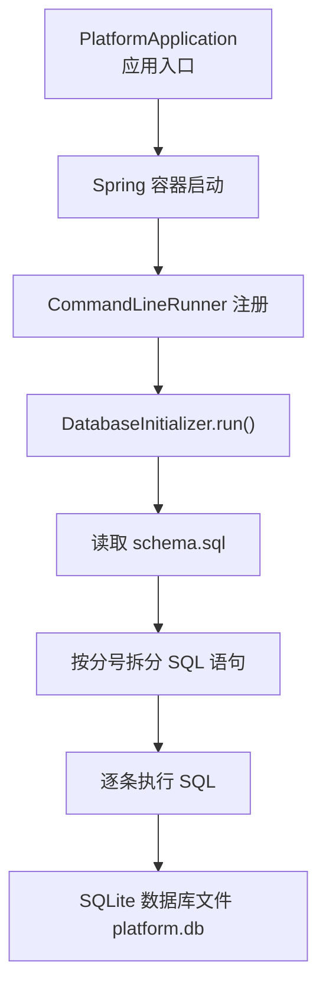
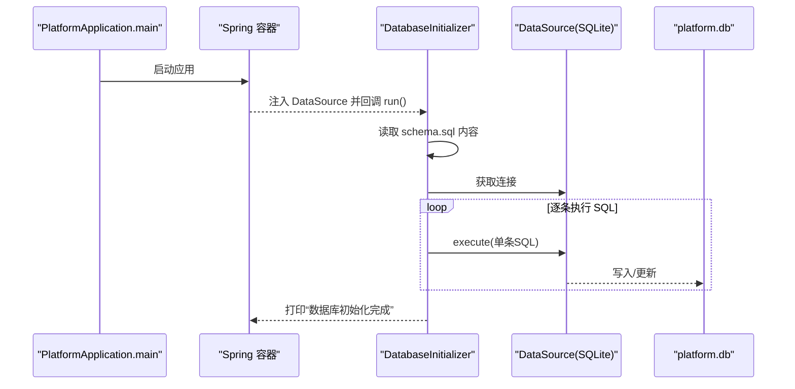
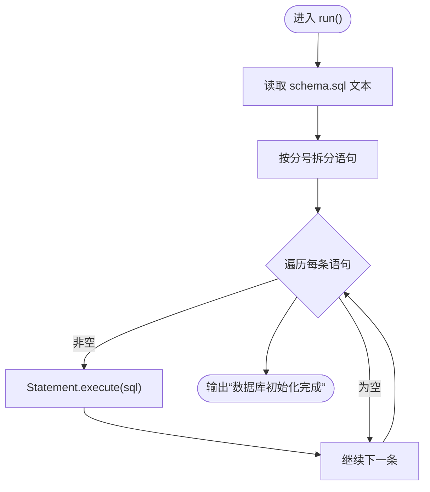
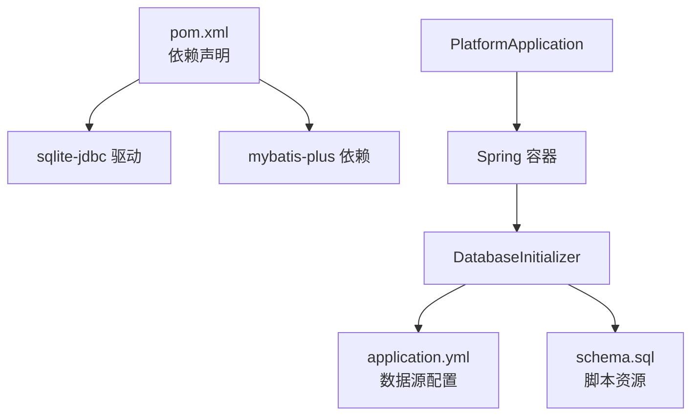

# 数据库初始化器

<cite>
**本文引用的文件**   
- [DatabaseInitializer.java](file://backend/src/main/java/com/xx/platform/config/DatabaseInitializer.java)
- [PlatformApplication.java](file://backend/src/main/java/com/xx/platform/PlatformApplication.java)
- [application.yml](file://backend/src/main/resources/application.yml)
- [schema.sql](file://backend/src/main/resources/schema.sql)
- [pom.xml](file://backend/pom.xml)
</cite>

## 目录
1. [简介](#简介)
2. [项目结构](#项目结构)
3. [核心组件](#核心组件)
4. [架构总览](#架构总览)
5. [详细组件分析](#详细组件分析)
6. [依赖关系分析](#依赖关系分析)
7. [性能与事务特性](#性能与事务特性)
8. [故障排查指南](#故障排查指南)
9. [结论](#结论)
10. [附录：环境差异与最佳实践](#附录：环境差异与最佳实践)

## 简介
本技术文档聚焦于 JZPlatform 门户系统的“数据库初始化器”，系统启动时自动完成数据库表结构检查与初始数据插入，确保应用可即开即用。当前实现基于 Spring Boot + SQLite，通过 CommandLineRunner 在应用启动后执行 schema.sql 中的 SQL 语句，创建必要的数据表并插入默认管理员、平台配置与示例分类等基础数据。

## 项目结构
与数据库初始化相关的代码与资源分布如下：
- 后端入口类负责启动 Spring 容器，触发 CommandLineRunner 的执行
- 数据库初始化器读取 classpath 下的 schema.sql 并按分号拆分逐条执行
- application.yml 中配置 SQLite 连接信息（驱动、URL）
- schema.sql 定义所有表结构与初始数据
- pom.xml 引入 SQLite JDBC 驱动与 MyBatis-Plus 依赖

图表来源
- [PlatformApplication.java:10-15](file://backend/src/main/java/com/xx/platform/PlatformApplication.java#L10-L15)
- [DatabaseInitializer.java:20-45](file://backend/src/main/java/com/xx/platform/config/DatabaseInitializer.java#L20-L45)
- [application.yml:4-8](file://backend/src/main/resources/application.yml#L4-L8)
- [schema.sql:1-80](file://backend/src/main/resources/schema.sql#L1-L80)

章节来源
- [PlatformApplication.java:10-15](file://backend/src/main/java/com/xx/platform/PlatformApplication.java#L10-L15)
- [DatabaseInitializer.java:20-45](file://backend/src/main/java/com/xx/platform/config/DatabaseInitializer.java#L20-L45)
- [application.yml:4-8](file://backend/src/main/resources/application.yml#L4-L8)
- [schema.sql:1-80](file://backend/src/main/resources/schema.sql#L1-L80)

## 核心组件
- 应用入口 PlatformApplication：使用 @SpringBootApplication 注解，启动 Spring Boot 应用，加载所有组件（包括 DatabaseInitializer）。
- 数据库初始化器 DatabaseInitializer：实现 CommandLineRunner，在应用启动完成后执行数据库初始化逻辑。
- 数据库脚本 schema.sql：包含建表语句与 INSERT OR IGNORE 的初始数据。
- 数据源配置 application.yml：指定 SQLite 驱动与数据库文件路径。
- 依赖管理 pom.xml：声明 sqlite-jdbc 驱动版本及 MyBatis-Plus 依赖。

章节来源
- [PlatformApplication.java:10-15](file://backend/src/main/java/com/xx/platform/PlatformApplication.java#L10-L15)
- [DatabaseInitializer.java:20-45](file://backend/src/main/java/com/xx/platform/config/DatabaseInitializer.java#L20-L45)
- [application.yml:4-8](file://backend/src/main/resources/application.yml#L4-L8)
- [schema.sql:1-80](file://backend/src/main/resources/schema.sql#L1-L80)
- [pom.xml:40-45](file://backend/pom.xml#L40-L45)

## 架构总览
下图展示了从应用启动到数据库初始化完成的调用链路与关键交互点。

图表来源
- [PlatformApplication.java:10-15](file://backend/src/main/java/com/xx/platform/PlatformApplication.java#L10-L15)
- [DatabaseInitializer.java:26-44](file://backend/src/main/java/com/xx/platform/config/DatabaseInitializer.java#L26-L44)
- [application.yml:4-8](file://backend/src/main/resources/application.yml#L4-L8)
- [schema.sql:1-80](file://backend/src/main/resources/schema.sql#L1-L80)

## 详细组件分析

### 数据库初始化流程与表结构检查机制
- 启动时机：应用启动完成后，Spring 容器会回调实现了 CommandLineRunner 的 Bean 的 run 方法。
- 脚本加载：通过 ClassPathResource 读取 resources/schema.sql 的内容，统一拼接为字符串。
- 语句拆分：以分号作为分隔符将脚本拆分为多条独立 SQL 语句，去除空白行后逐条执行。
- 表结构检查：schema.sql 中使用 CREATE TABLE IF NOT EXISTS，保证重复启动不会因表已存在而失败。
- 幂等性保障：初始数据插入使用 INSERT OR IGNORE，结合唯一约束避免重复插入导致异常。

图表来源
- [DatabaseInitializer.java:26-44](file://backend/src/main/java/com/xx/platform/config/DatabaseInitializer.java#L26-L44)
- [schema.sql:1-80](file://backend/src/main/resources/schema.sql#L1-L80)

章节来源
- [DatabaseInitializer.java:26-44](file://backend/src/main/java/com/xx/platform/config/DatabaseInitializer.java#L26-L44)
- [schema.sql:1-80](file://backend/src/main/resources/schema.sql#L1-L80)

### 默认数据插入逻辑
- 管理员账户：sys_user 表中插入默认管理员用户（用户名、角色），用于首次登录与管理操作。
- 平台配置：platform_config 表插入平台名称、公司名称、Logo 路径、底图路径等键值对。
- 示例分类：app_category 表插入若干业务分类，便于前端展示与应用归类。
- 宣贯数据：showcase_item 表插入若干宣传条目，覆盖生态、产品、模型、数据、知识产权等主题。

说明：以上插入均使用 INSERT OR IGNORE，配合唯一键或业务主键，确保多次启动不产生重复记录。

章节来源
- [schema.sql:59-80](file://backend/src/main/resources/schema.sql#L59-L80)

### 数据库版本管理与向后兼容性策略
- 当前策略：采用“IF NOT EXISTS + INSERT OR IGNORE”的方式，保证脚本可重复执行且具备幂等性。
- 向后兼容：新增字段或表时，建议在后续脚本中继续使用 IF NOT EXISTS 与条件判断，避免破坏已有数据。
- 建议演进：随着功能扩展，可引入版本控制表（如 db_version）或使用迁移工具（如 Flyway/Liquibase）进行更严格的版本管理与回滚支持。

章节来源
- [schema.sql:1-80](file://backend/src/main/resources/schema.sql#L1-L80)

### 自定义初始化脚本编写规范与最佳实践
- 文件组织：将初始化脚本放置在 resources 目录下，命名清晰（如 schema_v1.sql、init_data.sql），并在初始化器中按需加载。
- 幂等性：所有建表使用 IF NOT EXISTS；所有插入使用 INSERT OR IGNORE 或先查询再插入。
- 语句边界：以分号结尾，避免多语句合并导致的解析问题；必要时在初始化器中增强解析能力（例如处理注释与引号内的分号）。
- 字符集：确保脚本编码为 UTF-8，避免中文乱码。
- 错误处理：对关键步骤增加日志输出与异常捕获，便于定位问题。
- 环境隔离：不同环境的初始化脚本应分离，通过配置文件选择加载不同的脚本集合。

章节来源
- [DatabaseInitializer.java:26-44](file://backend/src/main/java/com/xx/platform/config/DatabaseInitializer.java#L26-L44)
- [schema.sql:1-80](file://backend/src/main/resources/schema.sql#L1-L80)

### 数据库连接池配置、事务管理与异常处理机制
- 连接池：当前未显式配置连接池，SQLite 使用内置连接方式；如需高并发场景，可考虑切换至其他数据库并引入连接池（如 HikariCP）。
- 事务管理：当前初始化过程未使用事务包装，若需强一致性，可在初始化器中手动开启/提交/回滚事务，或在 Service 层使用 @Transactional。
- 异常处理：当前 run 方法抛出异常由 Spring 容器接管；建议增加 try-catch 与日志记录，提升可观测性与容错能力。

章节来源
- [application.yml:4-8](file://backend/src/main/resources/application.yml#L4-L8)
- [DatabaseInitializer.java:26-44](file://backend/src/main/java/com/xx/platform/config/DatabaseInitializer.java#L26-L44)

### 不同环境（开发、测试、生产）的初始化策略
- 开发环境：保留自动初始化，快速验证功能；可启用详细日志以便调试。
- 测试环境：建议使用独立的数据库文件或内存库，每次测试前重置数据，确保用例稳定。
- 生产环境：谨慎对待自动初始化；建议通过 CI/CD 流水线执行受控的迁移脚本，并进行备份与回滚预案。
- 配置化：通过 application.yml 的环境变量或 profile 切换数据库 URL、驱动与脚本路径，实现环境差异化。

章节来源
- [application.yml:4-8](file://backend/src/main/resources/application.yml#L4-L8)

## 依赖关系分析
- 运行时依赖：sqlite-jdbc 提供 SQLite 的 JDBC 驱动，使 Spring 能建立数据库连接。
- ORM 依赖：MyBatis-Plus 用于后续业务层的持久化操作，与初始化器无直接耦合。
- 启动流程：PlatformApplication 启动 Spring 容器，自动发现并执行 DatabaseInitializer。

图表来源
- [pom.xml:40-45](file://backend/pom.xml#L40-L45)
- [application.yml:4-8](file://backend/src/main/resources/application.yml#L4-L8)
- [PlatformApplication.java:10-15](file://backend/src/main/java/com/xx/platform/PlatformApplication.java#L10-L15)
- [DatabaseInitializer.java:20-45](file://backend/src/main/java/com/xx/platform/config/DatabaseInitializer.java#L20-L45)

章节来源
- [pom.xml:40-45](file://backend/pom.xml#L40-L45)
- [application.yml:4-8](file://backend/src/main/resources/application.yml#L4-L8)
- [PlatformApplication.java:10-15](file://backend/src/main/java/com/xx/platform/PlatformApplication.java#L10-L15)
- [DatabaseInitializer.java:20-45](file://backend/src/main/java/com/xx/platform/config/DatabaseInitializer.java#L20-L45)

## 性能与事务特性
- 性能特征：SQLite 适合单机与轻量级场景；初始化阶段一次性执行多条 SQL，整体开销较小。
- 事务特性：当前未使用事务，若未来需要批量操作的原子性，应在初始化器中显式开启事务，并在异常时回滚。
- 优化建议：
  - 将大脚本拆分为多个小脚本，按需加载，减少不必要的执行。
  - 在初始化前后记录耗时与关键节点日志，便于监控。
  - 对于频繁读写的业务数据，考虑在生产环境切换到更适合的数据库与连接池。

[本节为通用指导，不涉及具体文件分析]

## 故障排查指南
- 常见问题
  - 数据库文件权限不足：确认运行用户对 platform.db 所在目录有读写权限。
  - 脚本编码问题：确保 schema.sql 为 UTF-8，避免中文乱码导致 SQL 解析失败。
  - 重复初始化冲突：检查是否误用 INSERT 而非 INSERT OR IGNORE，或唯一键冲突。
  - 分号分割异常：若 SQL 中包含分号（如字符串常量），需在初始化器中增强解析逻辑。
- 定位手段
  - 查看控制台输出“数据库初始化完成”是否出现，若未出现则可能在执行过程中抛异常。
  - 检查 application.yml 的 datasource.url 与 driver-class-name 是否正确。
  - 临时关闭自动初始化，手动执行 schema.sql 验证脚本正确性。

章节来源
- [DatabaseInitializer.java:26-44](file://backend/src/main/java/com/xx/platform/config/DatabaseInitializer.java#L26-L44)
- [application.yml:4-8](file://backend/src/main/resources/application.yml#L4-L8)
- [schema.sql:1-80](file://backend/src/main/resources/schema.sql#L1-L80)

## 结论
当前数据库初始化器通过 CommandLineRunner 在应用启动后自动执行 schema.sql，利用 IF NOT EXISTS 与 INSERT OR IGNORE 实现幂等与向后兼容，满足开发与演示场景的快速启动需求。面向生产环境，建议引入版本化管理与事务控制，完善异常处理与日志记录，并通过环境配置实现差异化初始化策略。

[本节为总结性内容，不涉及具体文件分析]

## 附录：环境差异与最佳实践
- 环境差异
  - 开发：保留自动初始化，便于快速迭代。
  - 测试：使用独立数据库实例，每次测试前重置数据。
  - 生产：采用受控迁移流程，禁止随意变更 schema.sql，确保可回滚与审计。
- 最佳实践
  - 脚本幂等：始终使用 IF NOT EXISTS 与 INSERT OR IGNORE。
  - 版本管理：引入 db_version 表或迁移工具，记录已执行的脚本版本。
  - 事务与回滚：对关键初始化步骤使用事务，失败时回滚。
  - 日志与监控：记录初始化开始、结束与异常信息，便于排障。
  - 安全：避免在脚本中硬编码敏感信息，使用环境变量或配置中心管理。

[本节为通用指导，不涉及具体文件分析]