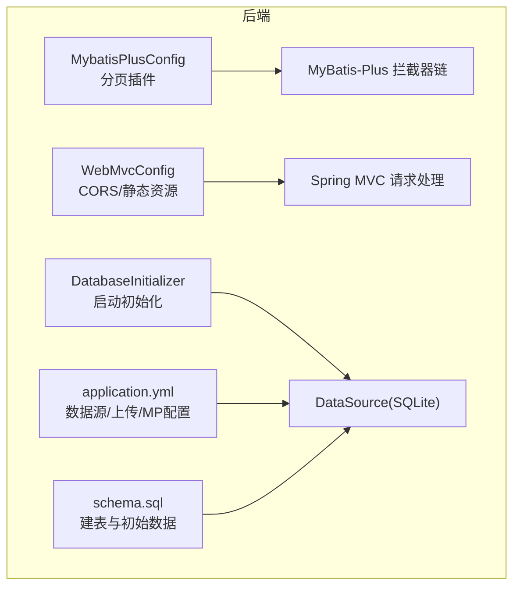
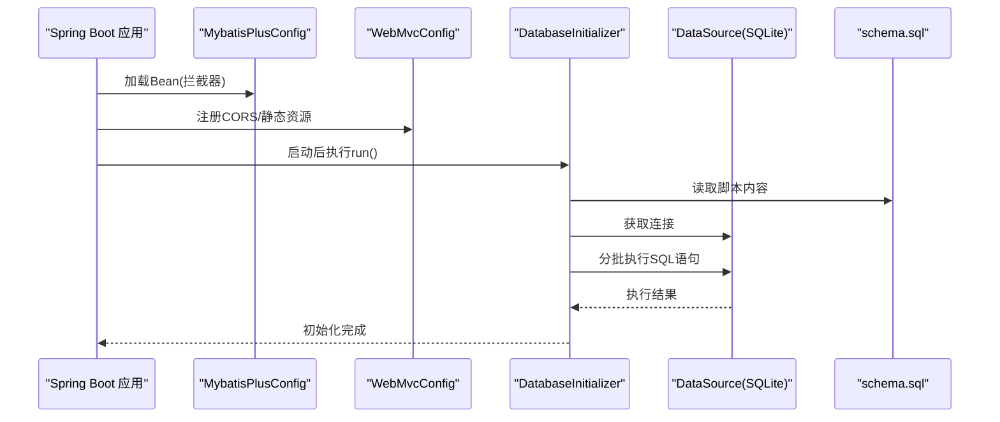
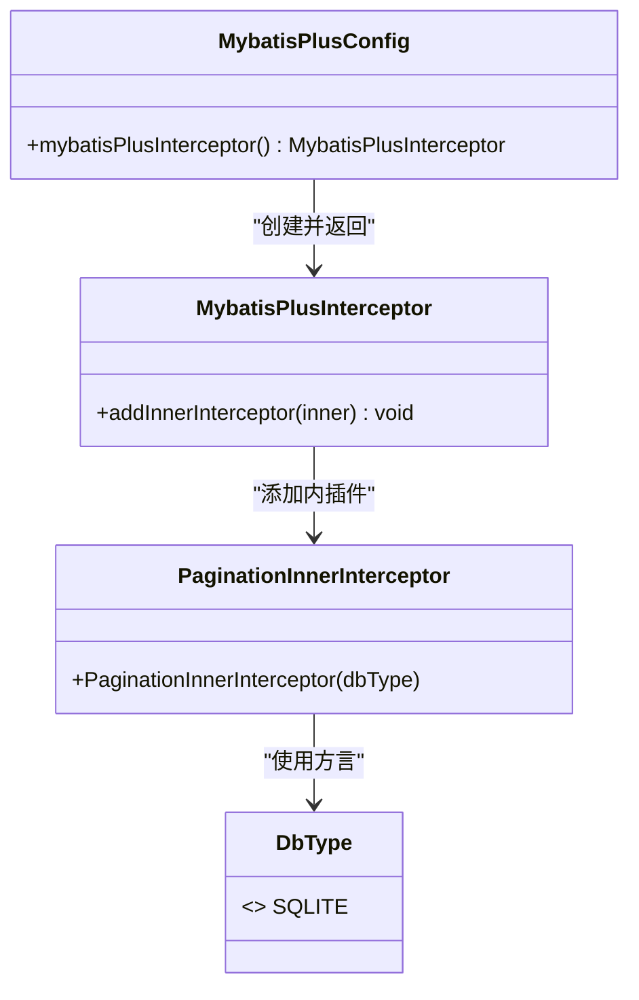
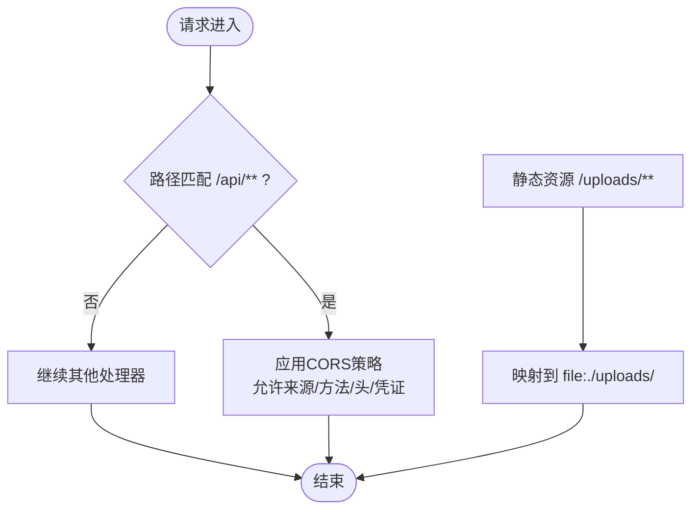
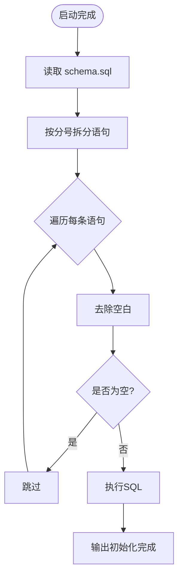
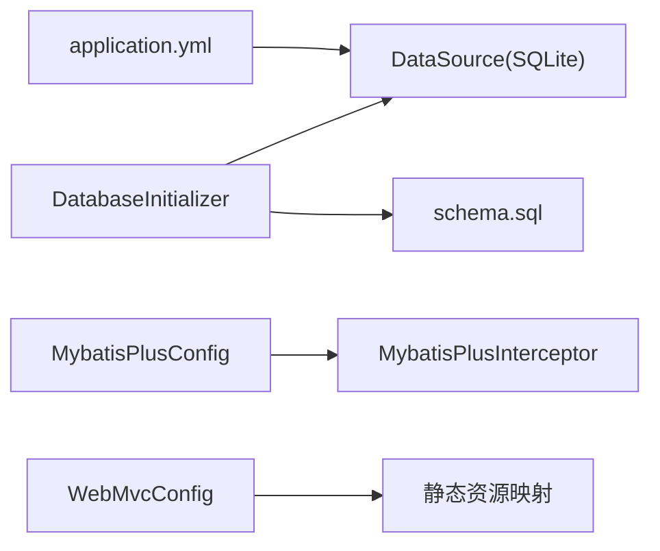

# 配置管理系统

<cite>
**本文引用的文件**   
- [MybatisPlusConfig.java](file://backend/src/main/java/com/xx/platform/config/MybatisPlusConfig.java)
- [WebMvcConfig.java](file://backend/src/main/java/com/xx/platform/config/WebMvcConfig.java)
- [DatabaseInitializer.java](file://backend/src/main/java/com/xx/platform/config/DatabaseInitializer.java)
- [application.yml](file://backend/src/main/resources/application.yml)
- [schema.sql](file://backend/src/main/resources/schema.sql)
</cite>

## 目录
1. [简介](#简介)
2. [项目结构](#项目结构)
3. [核心组件](#核心组件)
4. [架构总览](#架构总览)
5. [详细组件分析](#详细组件分析)
6. [依赖关系分析](#依赖关系分析)
7. [性能考虑](#性能考虑)
8. [故障排查指南](#故障排查指南)
9. [结论](#结论)
10. [附录](#附录)

## 简介
本技术文档聚焦于JZPlatform门户系统的“配置管理”相关能力，围绕以下目标展开：
- MybatisPlusConfig的分页插件启用与扩展点说明（含乐观锁、逻辑删除的接入方式）
- WebMvcConfig的跨域、静态资源映射与拦截器注册策略
- DatabaseInitializer的数据库初始化流程、表结构检查与数据迁移机制
- 配置文件管理与环境隔离方案
- 配置热更新与配置中心集成的扩展指导

## 项目结构
后端采用Spring Boot分层组织，配置类集中于config包，资源文件位于resources下。关键路径如下：
- 配置类：backend/src/main/java/com/xx/platform/config
- 应用配置：backend/src/main/resources/application.yml
- 数据库脚本：backend/src/main/resources/schema.sql

图表来源
- [MybatisPlusConfig.java:1-27](file://backend/src/main/java/com/xx/platform/config/MybatisPlusConfig.java#L1-L27)
- [WebMvcConfig.java:1-37](file://backend/src/main/java/com/xx/platform/config/WebMvcConfig.java#L1-L37)
- [DatabaseInitializer.java:1-46](file://backend/src/main/java/com/xx/platform/config/DatabaseInitializer.java#L1-L46)
- [application.yml:1-29](file://backend/src/main/resources/application.yml#L1-L29)
- [schema.sql:1-80](file://backend/src/main/resources/schema.sql#L1-L80)

章节来源
- [MybatisPlusConfig.java:1-27](file://backend/src/main/java/com/xx/platform/config/MybatisPlusConfig.java#L1-L27)
- [WebMvcConfig.java:1-37](file://backend/src/main/java/com/xx/platform/config/WebMvcConfig.java#L1-L37)
- [DatabaseInitializer.java:1-46](file://backend/src/main/java/com/xx/platform/config/DatabaseInitializer.java#L1-L46)
- [application.yml:1-29](file://backend/src/main/resources/application.yml#L1-L29)
- [schema.sql:1-80](file://backend/src/main/resources/schema.sql#L1-L80)

## 核心组件
本节对三大配置组件进行概览性说明，后续章节将深入细节。
- MybatisPlusConfig：负责装配MyBatis-Plus拦截器，当前已启用分页插件；提供扩展点以接入乐观锁、逻辑删除等插件。
- WebMvcConfig：实现跨域访问控制、静态资源映射，并预留拦截器注册位置。
- DatabaseInitializer：在应用启动时读取并执行schema.sql，完成建表与基础数据注入。

章节来源
- [MybatisPlusConfig.java:1-27](file://backend/src/main/java/com/xx/platform/config/MybatisPlusConfig.java#L1-L27)
- [WebMvcConfig.java:1-37](file://backend/src/main/java/com/xx/platform/config/WebMvcConfig.java#L1-L37)
- [DatabaseInitializer.java:1-46](file://backend/src/main/java/com/xx/platform/config/DatabaseInitializer.java#L1-L46)

## 架构总览
下图展示了配置系统在启动期与运行期的交互关系：应用启动后，Spring容器加载配置类，随后执行CommandLineRunner完成数据库初始化；运行时由MVC层处理跨域与静态资源，持久层通过MyBatis-Plus拦截器增强查询行为。

图表来源
- [MybatisPlusConfig.java:1-27](file://backend/src/main/java/com/xx/platform/config/MybatisPlusConfig.java#L1-L27)
- [WebMvcConfig.java:1-37](file://backend/src/main/java/com/xx/platform/config/WebMvcConfig.java#L1-L37)
- [DatabaseInitializer.java:1-46](file://backend/src/main/java/com/xx/platform/config/DatabaseInitializer.java#L1-L46)
- [schema.sql:1-80](file://backend/src/main/resources/schema.sql#L1-L80)

## 详细组件分析

### MybatisPlusConfig 配置详解
- 当前能力
  - 已启用分页插件，适配SQLite方言，确保分页SQL正确生成。
- 扩展能力（建议与实践）
  - 乐观锁插件：可通过添加对应InnerInterceptor并在实体字段使用注解的方式启用，适用于并发更新场景。
  - 逻辑删除插件：可通过添加对应InnerInterceptor并结合实体注解实现软删除，避免物理删除导致的数据丢失风险。
  - 多数据源或分库分表：可在同一拦截器链中追加相应插件，注意各插件的执行顺序与兼容性。
- 注意事项
  - SQLite环境下分页需确保方言为SQLITE，避免分页异常。
  - 新增插件应遵循最小侵入原则，优先通过配置类集中管理。

图表来源
- [MybatisPlusConfig.java:1-27](file://backend/src/main/java/com/xx/platform/config/MybatisPlusConfig.java#L1-L27)

章节来源
- [MybatisPlusConfig.java:1-27](file://backend/src/main/java/com/xx/platform/config/MybatisPlusConfig.java#L1-L27)

### WebMvcConfig 配置详解
- 跨域配置
  - 针对/api/**开放跨域，允许常用HTTP方法与全部请求头，支持携带凭证，缓存预检响应以提升性能。
- 静态资源映射
  - 将/uploads/**映射到本地uploads目录，便于前端直接访问上传文件。
- 拦截器注册
  - 当前未注册自定义拦截器，但已实现WebMvcConfigurer接口，可直接重写addInterceptors方法注册鉴权、审计等拦截器。
- 安全建议
  - 生产环境建议收紧allowedOriginPatterns，仅放行可信域名；必要时限制允许的Header与方法集合。

图表来源
- [WebMvcConfig.java:1-37](file://backend/src/main/java/com/xx/platform/config/WebMvcConfig.java#L1-L37)

章节来源
- [WebMvcConfig.java:1-37](file://backend/src/main/java/com/xx/platform/config/WebMvcConfig.java#L1-L37)

### DatabaseInitializer 数据库初始化详解
- 初始化时机
  - 实现CommandLineRunner，在应用上下文刷新完成后执行。
- 执行流程
  - 从classpath读取schema.sql，按分号拆分SQL语句，逐条执行。
  - 使用IF NOT EXISTS与INSERT OR IGNORE保证幂等，避免重复初始化报错。
- 表结构与初始数据
  - 包含用户、分类、应用、宣贯项、平台配置等表，并提供默认管理员与基础配置数据。
- 迁移与演进建议
  - 引入版本化脚本与变更日志，记录每次DDL/DML变更，便于回滚与追踪。
  - 对于复杂迁移，建议使用专用工具（如Flyway/Liquibase），或在现有基础上增加版本号判断与条件分支。

图表来源
- [DatabaseInitializer.java:1-46](file://backend/src/main/java/com/xx/platform/config/DatabaseInitializer.java#L1-L46)
- [schema.sql:1-80](file://backend/src/main/resources/schema.sql#L1-L80)

章节来源
- [DatabaseInitializer.java:1-46](file://backend/src/main/java/com/xx/platform/config/DatabaseInitializer.java#L1-L46)
- [schema.sql:1-80](file://backend/src/main/resources/schema.sql#L1-L80)

## 依赖关系分析
- 组件耦合
  - MybatisPlusConfig与MyBatis-Plus生态强耦合，但通过Bean暴露，易于替换与扩展。
  - WebMvcConfig与Spring MVC解耦良好，仅依赖标准接口，便于测试与替换。
  - DatabaseInitializer依赖DataSource与classpath资源，职责单一，易于替换为外部迁移工具。
- 外部依赖
  - 数据源由application.yml配置，当前为SQLite；如需切换至MySQL/PostgreSQL，仅需调整数据源URL与驱动。
  - 静态资源路径与上传大小限制均在application.yml中定义，便于环境差异化管理。

图表来源
- [application.yml:1-29](file://backend/src/main/resources/application.yml#L1-L29)
- [DatabaseInitializer.java:1-46](file://backend/src/main/java/com/xx/platform/config/DatabaseInitializer.java#L1-L46)
- [schema.sql:1-80](file://backend/src/main/resources/schema.sql#L1-L80)
- [MybatisPlusConfig.java:1-27](file://backend/src/main/java/com/xx/platform/config/MybatisPlusConfig.java#L1-L27)
- [WebMvcConfig.java:1-37](file://backend/src/main/java/com/xx/platform/config/WebMvcConfig.java#L1-L37)

章节来源
- [application.yml:1-29](file://backend/src/main/resources/application.yml#L1-L29)
- [DatabaseInitializer.java:1-46](file://backend/src/main/java/com/xx/platform/config/DatabaseInitializer.java#L1-L46)
- [schema.sql:1-80](file://backend/src/main/resources/schema.sql#L1-L80)
- [MybatisPlusConfig.java:1-27](file://backend/src/main/java/com/xx/platform/config/MybatisPlusConfig.java#L1-L27)
- [WebMvcConfig.java:1-37](file://backend/src/main/java/com/xx/platform/config/WebMvcConfig.java#L1-L37)

## 性能考虑
- 分页性能
  - 合理设置分页参数，避免超大页码与过多数据量；结合索引优化排序与过滤字段。
- 跨域预检
  - 适当增大maxAge以减少OPTIONS请求频率，提升用户体验。
- 静态资源
  - 生产环境建议配合CDN或反向代理缓存静态资源，减少后端压力。
- 数据库初始化
  - 大脚本执行可能阻塞启动，可考虑异步化或引入增量迁移工具，避免全量重放。

[本节为通用建议，不直接分析具体文件]

## 故障排查指南
- 跨域失败
  - 检查请求路径是否匹配/api/**；确认浏览器携带了凭证且服务端允许；核对allowedOriginPatterns在生产环境的准确性。
- 静态资源无法访问
  - 确认/uploads/**映射与磁盘路径一致；检查文件权限与相对路径是否正确。
- 初始化失败
  - 查看控制台输出与异常堆栈；确认schema.sql编码为UTF-8；验证SQLite驱动与连接URL；若出现约束冲突，检查IF NOT EXISTS与INSERT OR IGNORE的使用。
- 分页异常
  - 确认DbType为SQLITE；检查Mapper查询是否使用了正确的分页API；避免手写分页SQL与插件冲突。

章节来源
- [WebMvcConfig.java:1-37](file://backend/src/main/java/com/xx/platform/config/WebMvcConfig.java#L1-L37)
- [DatabaseInitializer.java:1-46](file://backend/src/main/java/com/xx/platform/config/DatabaseInitializer.java#L1-L46)
- [MybatisPlusConfig.java:1-27](file://backend/src/main/java/com/xx/platform/config/MybatisPlusConfig.java#L1-L27)

## 结论
当前配置体系已具备基础的跨域、静态资源与数据库初始化能力，并通过MybatisPlusConfig提供了可扩展的拦截器入口。建议在后续迭代中完善乐观锁与逻辑删除插件接入、引入版本化迁移工具，并基于环境变量与配置中心实现更灵活的环境隔离与动态更新。

[本节为总结性内容，不直接分析具体文件]

## 附录

### 配置文件管理与环境隔离方案
- 多环境配置
  - 使用Spring Profile区分开发、测试、生产环境，分别维护application-dev.yml、application-test.yml、application-prod.yml，并通过spring.profiles.active激活。
- 敏感信息保护
  - 将数据库密码、第三方密钥等放入环境变量或配置中心，避免硬编码。
- 上传路径与环境差异
  - 通过upload.path等键值在不同环境中指向不同目录或对象存储前缀。

章节来源
- [application.yml:1-29](file://backend/src/main/resources/application.yml#L1-L29)

### 配置热更新与配置中心集成扩展指导
- 热更新思路
  - 使用@RefreshScope或监听配置变更事件，在内存中缓存关键配置（如平台名称、Logo路径等），并提供刷新接口触发局部重建。
- 配置中心集成
  - 对接Nacos/Apollo/Spring Cloud Config等，统一拉取配置；结合Profile与命名空间实现环境隔离。
- 数据库配置变更
  - 数据源变更通常需重启服务；业务配置（如平台展示文案）可通过配置中心热更新并实时生效。

[本节为扩展指导，不直接分析具体文件]