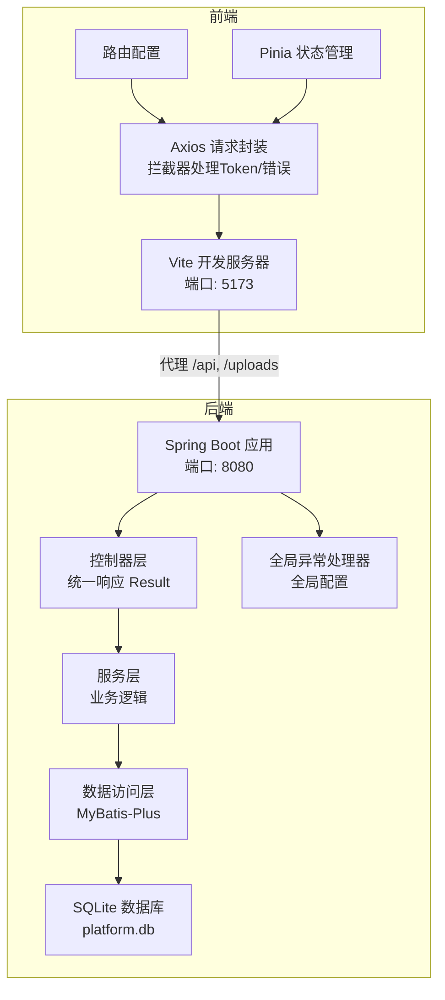
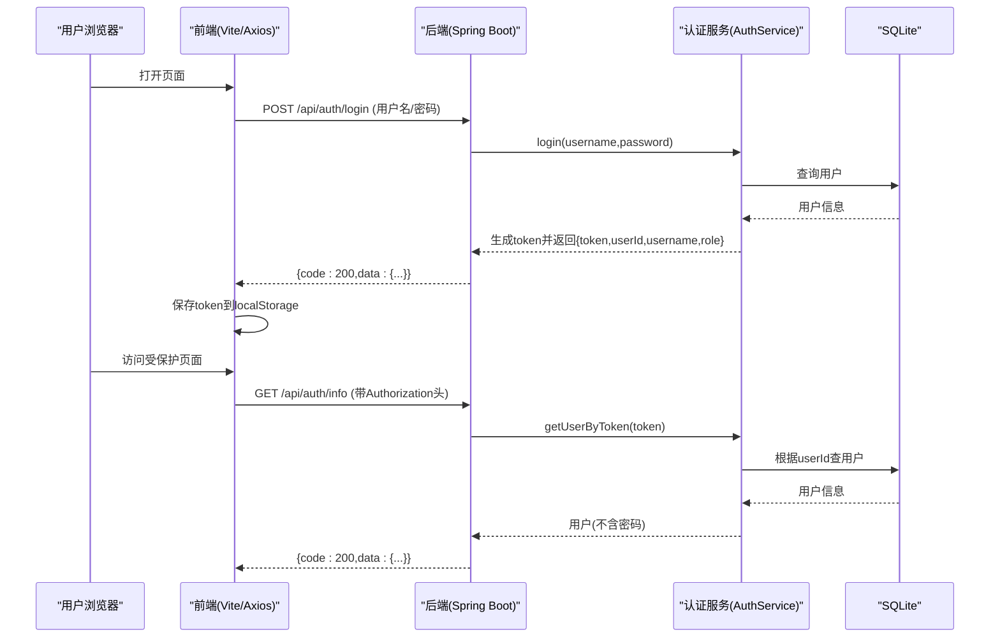
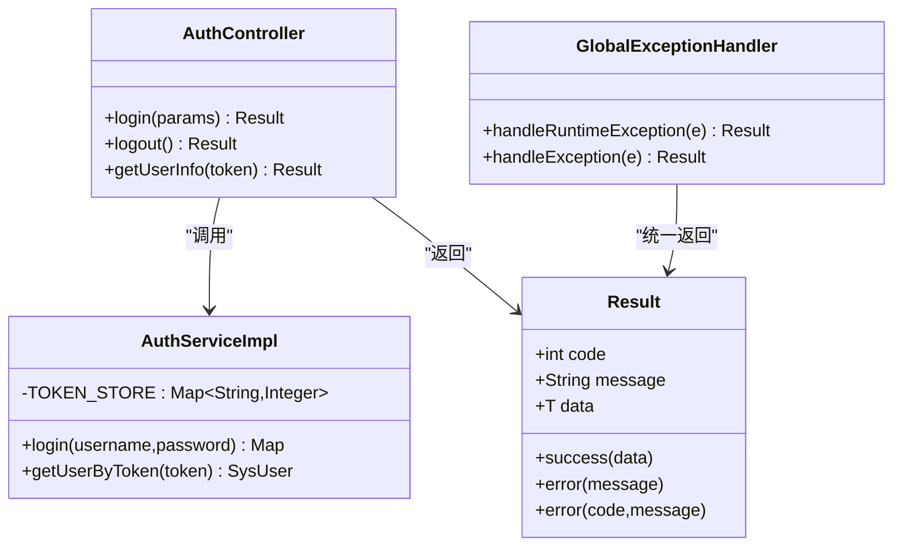
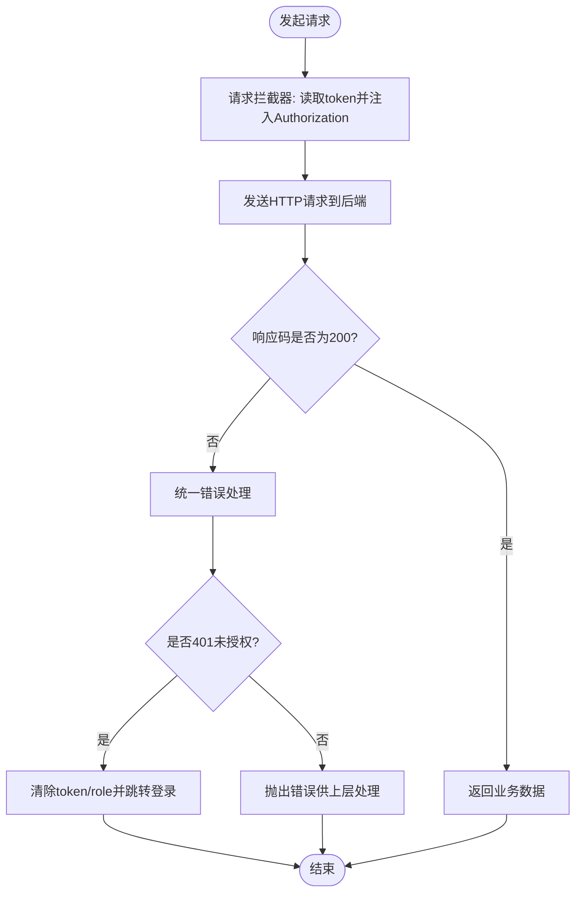
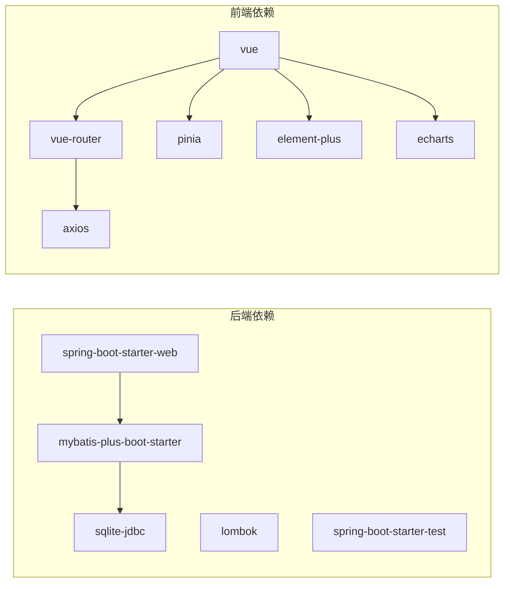

# 开发指南

<cite>
**本文引用的文件**   
- [backend/pom.xml](file://backend/pom.xml)
- [backend/src/main/java/com/xx/platform/common/GlobalExceptionHandler.java](file://backend/src/main/java/com/xx/platform/common/GlobalExceptionHandler.java)
- [backend/src/main/java/com/xx/platform/common/Result.java](file://backend/src/main/java/com/xx/platform/common/Result.java)
- [backend/src/main/java/com/xx/platform/controller/AuthController.java](file://backend/src/main/java/com/xx/platform/controller/AuthController.java)
- [backend/src/main/java/com/xx/platform/service/impl/AuthServiceImpl.java](file://backend/src/main/java/com/xx/platform/service/impl/AuthServiceImpl.java)
- [backend/src/main/resources/application.yml](file://backend/src/main/resources/application.yml)
- [frontend/package.json](file://frontend/package.json)
- [frontend/vite.config.js](file://frontend/vite.config.js)
- [frontend/src/api/request.js](file://frontend/src/api/request.js)
- [API.md](file://API.md)
</cite>

## 目录
1. [简介](#简介)
2. [项目结构](#项目结构)
3. [核心组件](#核心组件)
4. [架构总览](#架构总览)
5. [详细组件分析](#详细组件分析)
6. [依赖分析](#依赖分析)
7. [性能考虑](#性能考虑)
8. [故障排查指南](#故障排查指南)
9. [结论](#结论)
10. [附录](#附录)

## 简介
本指南面向JZPlatform门户系统的开发者，覆盖代码规范与最佳实践、新功能开发流程、测试策略、版本管理与发布流程、前后端组织结构与命名约定、注释规范、Git工作流、单元测试与集成测试方法、性能测试与调试技巧、常见问题与优化建议，以及贡献代码的流程。文档基于仓库现有实现进行提炼，确保可操作且与代码一致。

## 项目结构
后端采用Spring Boot + MyBatis-Plus + SQLite的轻量架构；前端使用Vue 3 + Vite + Element Plus + Pinia + Axios。前后端通过REST API交互，开发期由Vite代理转发至后端。

图示来源
- [frontend/vite.config.js:1-20](file://frontend/vite.config.js#L1-L20)
- [frontend/src/api/request.js:1-45](file://frontend/src/api/request.js#L1-L45)
- [backend/src/main/java/com/xx/platform/controller/AuthController.java:1-68](file://backend/src/main/java/com/xx/platform/controller/AuthController.java#L1-L68)
- [backend/src/main/java/com/xx/platform/service/impl/AuthServiceImpl.java:1-62](file://backend/src/main/java/com/xx/platform/service/impl/AuthServiceImpl.java#L1-L62)
- [backend/src/main/resources/application.yml:1-29](file://backend/src/main/resources/application.yml#L1-L29)

章节来源
- [backend/pom.xml:1-79](file://backend/pom.xml#L1-L79)
- [frontend/package.json:1-25](file://frontend/package.json#L1-L25)
- [frontend/vite.config.js:1-20](file://frontend/vite.config.js#L1-L20)
- [backend/src/main/resources/application.yml:1-29](file://backend/src/main/resources/application.yml#L1-L29)

## 核心组件
- 统一响应体：后端所有接口返回统一的Result对象，包含code、message、data字段，便于前端统一处理。
- 全局异常处理：捕获运行时异常和未处理异常，统一返回友好提示。
- 认证流程：登录生成内存Token（生产环境建议替换为Redis），后续请求携带Authorization头校验。
- 前端请求封装：Axios实例设置基础路径、超时、请求拦截自动附加token、响应拦截统一错误与401跳转。
- 构建与代理：Vite提供开发服务器并代理/api与/uploads到后端8080端口。

章节来源
- [backend/src/main/java/com/xx/platform/common/Result.java:1-52](file://backend/src/main/java/com/xx/platform/common/Result.java#L1-L52)
- [backend/src/main/java/com/xx/platform/common/GlobalExceptionHandler.java:1-30](file://backend/src/main/java/com/xx/platform/common/GlobalExceptionHandler.java#L1-L30)
- [backend/src/main/java/com/xx/platform/controller/AuthController.java:1-68](file://backend/src/main/java/com/xx/platform/controller/AuthController.java#L1-L68)
- [backend/src/main/java/com/xx/platform/service/impl/AuthServiceImpl.java:1-62](file://backend/src/main/java/com/xx/platform/service/impl/AuthServiceImpl.java#L1-L62)
- [frontend/src/api/request.js:1-45](file://frontend/src/api/request.js#L1-L45)
- [frontend/vite.config.js:1-20](file://frontend/vite.config.js#L1-L20)

## 架构总览
系统采用典型的前后端分离架构。前端通过Vite启动开发服务，将/api与/uploads代理到后端；后端以Spring Boot暴露REST接口，使用MyBatis-Plus访问SQLite数据库。认证采用简单内存Token机制，适合内部系统快速迭代。

图示来源
- [backend/src/main/java/com/xx/platform/controller/AuthController.java:1-68](file://backend/src/main/java/com/xx/platform/controller/AuthController.java#L1-L68)
- [backend/src/main/java/com/xx/platform/service/impl/AuthServiceImpl.java:1-62](file://backend/src/main/java/com/xx/platform/service/impl/AuthServiceImpl.java#L1-L62)
- [frontend/src/api/request.js:1-45](file://frontend/src/api/request.js#L1-L45)
- [API.md:1-197](file://API.md#L1-L197)

## 详细组件分析

### 认证模块（登录/登出/获取当前用户）
- 控制器AuthController提供登录、登出、获取当前用户信息接口，遵循统一响应格式。
- 服务AuthServiceImpl使用内存Map存储token与userId映射，登录时生成随机token，查询用户后返回必要信息；获取用户信息时按token反查用户并过滤敏感字段。
- 前端在请求拦截器中自动注入Authorization头，并在响应拦截器中对401进行清理本地状态并跳转登录页。

图示来源
- [backend/src/main/java/com/xx/platform/controller/AuthController.java:1-68](file://backend/src/main/java/com/xx/platform/controller/AuthController.java#L1-L68)
- [backend/src/main/java/com/xx/platform/service/impl/AuthServiceImpl.java:1-62](file://backend/src/main/java/com/xx/platform/service/impl/AuthServiceImpl.java#L1-L62)
- [backend/src/main/java/com/xx/platform/common/GlobalExceptionHandler.java:1-30](file://backend/src/main/java/com/xx/platform/common/GlobalExceptionHandler.java#L1-L30)
- [backend/src/main/java/com/xx/platform/common/Result.java:1-52](file://backend/src/main/java/com/xx/platform/common/Result.java#L1-L52)

章节来源
- [backend/src/main/java/com/xx/platform/controller/AuthController.java:1-68](file://backend/src/main/java/com/xx/platform/controller/AuthController.java#L1-L68)
- [backend/src/main/java/com/xx/platform/service/impl/AuthServiceImpl.java:1-62](file://backend/src/main/java/com/xx/platform/service/impl/AuthServiceImpl.java#L1-L62)
- [backend/src/main/java/com/xx/platform/common/GlobalExceptionHandler.java:1-30](file://backend/src/main/java/com/xx/platform/common/GlobalExceptionHandler.java#L1-L30)
- [backend/src/main/java/com/xx/platform/common/Result.java:1-52](file://backend/src/main/java/com/xx/platform/common/Result.java#L1-L52)
- [frontend/src/api/request.js:1-45](file://frontend/src/api/request.js#L1-L45)

### 前端请求封装与代理
- Axios实例设置baseURL为/api，超时10秒；请求拦截器从localStorage读取token并注入Authorization头；响应拦截器对非200码进行统一处理，401时清除本地状态并跳转登录。
- Vite配置将/api与/uploads代理到http://localhost:8080，解决开发期跨域问题。

图示来源
- [frontend/src/api/request.js:1-45](file://frontend/src/api/request.js#L1-L45)
- [frontend/vite.config.js:1-20](file://frontend/vite.config.js#L1-L20)

章节来源
- [frontend/src/api/request.js:1-45](file://frontend/src/api/request.js#L1-L45)
- [frontend/vite.config.js:1-20](file://frontend/vite.config.js#L1-L20)

### 配置与初始化
- application.yml定义后端端口、SQLite数据库路径、上传大小限制、MyBatis-Plus映射与日志输出、自增主键策略及上传路径。
- 数据库初始化脚本位于resources/schema.sql（用于首次建库建表）。

章节来源
- [backend/src/main/resources/application.yml:1-29](file://backend/src/main/resources/application.yml#L1-L29)

## 依赖分析
后端依赖Spring Boot Web、MyBatis-Plus、SQLite JDBC驱动、Lombok与Spring Boot Test；前端依赖Vue 3、Vue Router、Pinia、Axios、Element Plus、ECharts等。

图示来源
- [backend/pom.xml:1-79](file://backend/pom.xml#L1-L79)
- [frontend/package.json:1-25](file://frontend/package.json#L1-L25)

章节来源
- [backend/pom.xml:1-79](file://backend/pom.xml#L1-L79)
- [frontend/package.json:1-25](file://frontend/package.json#L1-L25)

## 性能考虑
- 数据库
  - SQLite适合单机小中型场景，注意并发写入瓶颈；可通过合理索引与分页查询提升性能。
  - 开启MyBatis-Plus SQL日志仅用于开发阶段，生产应关闭或降低级别。
- 认证
  - 当前使用内存Map存储token，重启即失效；生产建议迁移至Redis以实现分布式共享与过期控制。
- 前端
  - 合理使用懒加载与路由级分包，减少首屏体积。
  - 图片等资源启用CDN与缓存策略，避免重复下载。
- 网络
  - 合理设置请求超时与重试策略，避免雪崩。
  - 大列表使用虚拟滚动与分页加载。

[本节为通用指导，不直接分析具体文件]

## 故障排查指南
- 无法连接数据库
  - 检查application.yml中的数据库路径与权限，确认platform.db文件存在且可写。
- 登录失败或401
  - 确认前端是否正确保存与传递Authorization头；检查后端全局异常处理器是否返回了明确错误信息。
- 文件上传失败
  - 检查application.yml中multipart大小限制与upload.path路径是否存在且有写入权限。
- 跨域或代理问题
  - 确认Vite代理配置正确，/api与/uploads均指向后端8080端口。
- 接口报错定位
  - 查看后端控制台SQL日志（开发环境已开启），结合API文档核对请求参数与响应结构。

章节来源
- [backend/src/main/resources/application.yml:1-29](file://backend/src/main/resources/application.yml#L1-L29)
- [backend/src/main/java/com/xx/platform/common/GlobalExceptionHandler.java:1-30](file://backend/src/main/java/com/xx/platform/common/GlobalExceptionHandler.java#L1-L30)
- [frontend/vite.config.js:1-20](file://frontend/vite.config.js#L1-L20)
- [API.md:1-197](file://API.md#L1-L197)

## 结论
本项目采用轻量技术栈，结构清晰、易于上手。建议在保持现有分层与统一响应风格的基础上，逐步完善测试体系、引入更健壮的认证方案与监控指标，以提升稳定性与可维护性。

[本节为总结性内容，不直接分析具体文件]

## 附录

### 代码规范与最佳实践
- 包与类命名
  - 包名使用小写点分隔；类名采用大驼峰；常量全大写加下划线。
- 分层职责
  - Controller仅做参数校验与结果封装；Service承载业务逻辑；Mapper负责数据访问。
- 统一响应
  - 所有接口返回Result对象，错误码与消息集中管理。
- 异常处理
  - 业务异常抛出RuntimeException并由全局异常处理器统一捕获返回。
- 配置管理
  - 配置文件按环境拆分（开发/测试/生产），敏感信息通过环境变量注入。
- 日志与可观测性
  - 关键路径打印结构化日志；生产环境关闭SQL日志输出。

[本节为通用规范说明，不直接分析具体文件]

### 注释规范
- 类与方法需添加简要说明，复杂逻辑增加行内注释。
- 对外接口需在控制器方法上标注用途与参数说明，便于生成文档。

[本节为通用规范说明，不直接分析具体文件]

### Git工作流与分支策略
- 分支模型
  - main：稳定发布分支；develop：日常开发分支；feature/*：功能分支；hotfix/*：紧急修复分支。
- 提交规范
  - 使用语义化提交信息（如feat、fix、docs、refactor、test、chore）。
- 合并流程
  - 功能分支合并至develop，经CI通过后打标签并发布main。

[本节为通用流程说明，不直接分析具体文件]

### 新功能开发流程
- 需求评审与任务拆解
- 创建feature分支并实现前后端接口与页面
- 编写单测与联调用例
- 代码审查与合并
- 更新API文档与变更日志
- 打包发布与回归验证

[本节为通用流程说明，不直接分析具体文件]

### 测试策略
- 单元测试
  - 后端：针对Service与工具方法进行断言，Mock外部依赖。
  - 前端：对工具函数与组合式逻辑进行断言，模拟Axios响应。
- 集成测试
  - 后端：使用@SpringBootTest启动上下文，构造测试数据库与初始数据，验证端到端接口。
  - 前端：使用Vitest或Playwright进行组件与页面级集成测试。
- 性能测试
  - 使用JMeter或k6对热点接口进行压测，关注QPS、P95/P99延迟与错误率。
- 安全测试
  - 对认证与鉴权路径进行越权与注入测试。

[本节为通用测试指导，不直接分析具体文件]

### 版本管理与发布流程
- 版本号遵循语义化版本（主.次.修订）
- 发布前完成：代码审查、自动化测试、构建产物校验、回滚预案
- 发布步骤：打tag -> 构建镜像/包 -> 部署灰度 -> 全量发布 -> 监控告警

[本节为通用发布指导，不直接分析具体文件]

### 贡献代码流程
- Fork仓库并创建功能分支
- 遵循代码规范与提交规范
- 提交PR并填写变更说明
- 通过CI与人工审查后合并
- 更新文档与示例

[本节为通用贡献指导，不直接分析具体文件]