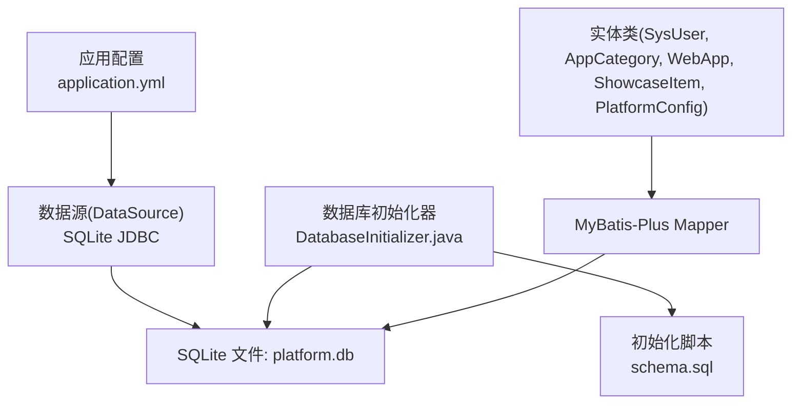
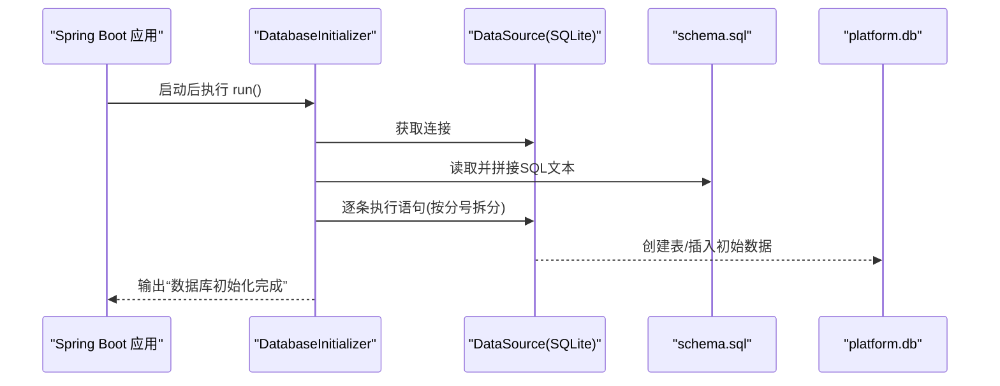
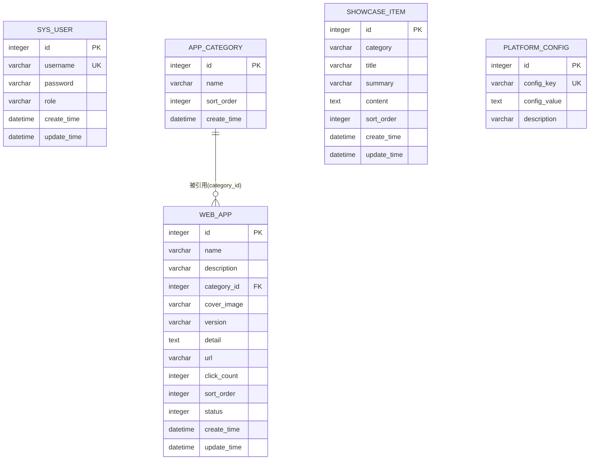
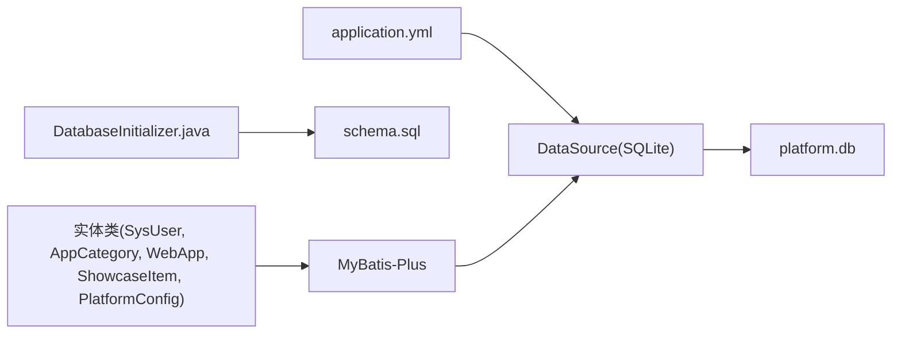
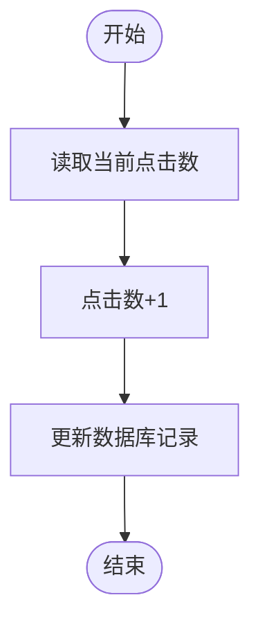

# 数据库设计

<cite>
**本文引用的文件**   
- [schema.sql](file://backend/src/main/resources/schema.sql)
- [DatabaseInitializer.java](file://backend/src/main/java/com/xx/platform/config/DatabaseInitializer.java)
- [application.yml](file://backend/src/main/resources/application.yml)
- [SysUser.java](file://backend/src/main/java/com/xx/platform/entity/SysUser.java)
- [AppCategory.java](file://backend/src/main/java/com/xx/platform/entity/AppCategory.java)
- [WebApp.java](file://backend/src/main/java/com/xx/platform/entity/WebApp.java)
- [ShowcaseItem.java](file://backend/src/main/java/com/xx/platform/entity/ShowcaseItem.java)
- [PlatformConfig.java](file://backend/src/main/java/com/xx/platform/entity/PlatformConfig.java)
</cite>

## 目录
1. [引言](#引言)
2. [项目结构](#项目结构)
3. [核心组件](#核心组件)
4. [架构总览](#架构总览)
5. [详细组件分析](#详细组件分析)
6. [依赖关系分析](#依赖关系分析)
7. [性能考虑](#性能考虑)
8. [故障排查指南](#故障排查指南)
9. [结论](#结论)
10. [附录](#附录)

## 引言
本文件为JZPlatform门户系统的数据库设计文档，聚焦于SQLite嵌入式数据库的架构与表结构设计。内容涵盖实体关系模型、字段定义与数据类型、主外键约束与索引策略、数据验证与业务规则、数据访问模式与缓存策略、初始化脚本与迁移路径、版本管理、数据生命周期与归档、以及数据安全与访问控制等主题。读者可据此理解系统的数据模型、运行期行为与运维要点。

## 项目结构
后端采用Spring Boot + MyBatis-Plus + SQLite的组合：
- 数据库连接与驱动在应用配置中声明；
- 启动时通过命令行执行器加载并执行SQL初始化脚本；
- 实体类使用注解映射到对应表；
- 所有DDL与初始数据集中在一个SQL文件中。

图表来源
- [application.yml:1-29](file://backend/src/main/resources/application.yml#L1-L29)
- [DatabaseInitializer.java:1-46](file://backend/src/main/java/com/xx/platform/config/DatabaseInitializer.java#L1-L46)
- [schema.sql:1-80](file://backend/src/main/resources/schema.sql#L1-L80)

章节来源
- [application.yml:1-29](file://backend/src/main/resources/application.yml#L1-L29)
- [DatabaseInitializer.java:1-46](file://backend/src/main/java/com/xx/platform/config/DatabaseInitializer.java#L1-L46)
- [schema.sql:1-80](file://backend/src/main/resources/schema.sql#L1-L80)

## 核心组件
本节从“表-实体”视角梳理核心数据对象及其职责：
- 用户(sys_user)：系统登录与权限主体，包含用户名、密码、角色及时间戳。
- 应用分类(app_category)：用于对Web应用进行分组与排序。
- Web应用(web_app)：门户展示的应用条目，含名称、描述、封面、版本、详情、链接、点击量、排序、状态等。
- 宣贯项(showcase_item)：平台宣传内容，按类别组织，支持标题、摘要、正文与排序。
- 平台配置(platform_config)：键值型配置存储，如平台名、Logo路径、底图等。

章节来源
- [SysUser.java:1-33](file://backend/src/main/java/com/xx/platform/entity/SysUser.java#L1-L33)
- [AppCategory.java:1-28](file://backend/src/main/java/com/xx/platform/entity/AppCategory.java#L1-L28)
- [WebApp.java:1-54](file://backend/src/main/java/com/xx/platform/entity/WebApp.java#L1-L54)
- [ShowcaseItem.java:1-40](file://backend/src/main/java/com/xx/platform/entity/ShowcaseItem.java#L1-L40)
- [PlatformConfig.java:1-28](file://backend/src/main/java/com/xx/platform/entity/PlatformConfig.java#L1-L28)

## 架构总览
下图展示了从应用启动到数据库落盘的完整流程，包括配置、驱动、初始化脚本与持久化结果。

图表来源
- [DatabaseInitializer.java:1-46](file://backend/src/main/java/com/xx/platform/config/DatabaseInitializer.java#L1-L46)
- [schema.sql:1-80](file://backend/src/main/resources/schema.sql#L1-L80)
- [application.yml:1-29](file://backend/src/main/resources/application.yml#L1-L29)

## 详细组件分析

### 实体关系模型（ER）
- sys_user：独立实体，无外键关联。
- app_category：被web_app通过category_id引用。
- web_app：通过category_id关联app_category；自身维护click_count、status等统计与状态字段。
- showcase_item：独立实体，以category字段区分不同展示维度。
- platform_config：独立键值配置表。

图表来源
- [schema.sql:1-80](file://backend/src/main/resources/schema.sql#L1-L80)

章节来源
- [schema.sql:1-80](file://backend/src/main/resources/schema.sql#L1-L80)

### 表结构与字段说明

- 用户表 sys_user
  - 主键：id（自增整数）
  - 唯一约束：username（唯一用户名）
  - 必填：username、password
  - 默认值：role='USER'；create_time/update_time为当前时间
  - 用途：系统登录与角色控制

- 应用分类表 app_category
  - 主键：id（自增整数）
  - 必填：name
  - 可选：sort_order（默认0）
  - 用途：应用分组与排序

- Web应用表 web_app
  - 主键：id（自增整数）
  - 必填：name、url
  - 可选：description、category_id、cover_image、version、detail、click_count（默认0）、sort_order（默认0）、status（默认1）
  - 用途：门户应用卡片信息、点击统计与启用状态

- 宣贯项表 showcase_item
  - 主键：id（自增整数）
  - 必填：category、title
  - 可选：summary、content、sort_order（默认0）
  - 用途：平台生态、产品、模型、数据、知识产权等展示内容

- 平台配置表 platform_config
  - 主键：id（自增整数）
  - 唯一约束：config_key（唯一键）
  - 可选：config_value、description
  - 用途：平台级可配置项（名称、Logo、底图等）

章节来源
- [schema.sql:1-80](file://backend/src/main/resources/schema.sql#L1-L80)

### 主外键约束与索引设计
- 主键
  - 所有表均使用自增整数主键id，保证记录唯一性与顺序性。
- 唯一约束
  - sys_user.username：防止重复用户名。
  - platform_config.config_key：确保配置键全局唯一。
- 外键
  - web_app.category_id 引用 app_category.id（逻辑外键）。
  - 当前DDL未显式声明外键约束，建议在后续版本引入外键约束以保证引用完整性。
- 索引建议
  - web_app.category_id：提升按分类筛选的性能。
  - web_app.status、web_app.sort_order：提升列表查询与排序性能。
  - showcase_item.category、showcase_item.sort_order：提升展示页按类别与排序查询性能。
  - sys_user.username：已有唯一约束，自动具备索引能力。

章节来源
- [schema.sql:1-80](file://backend/src/main/resources/schema.sql#L1-L80)

### 数据验证规则与业务规则约束
- 通用规则
  - 非空字段必须提供有效值。
  - 字符串长度遵循VARCHAR上限，避免超长写入。
- 特定规则
  - 用户名唯一且不可为空。
  - 应用必须有名称与URL。
  - 应用状态默认为启用（1），可通过更新置为禁用（0）。
  - 点击次数默认0，仅递增不递减。
  - 配置键唯一，便于通过键直接定位配置项。
- 枚举与取值
  - sys_user.role：示例值为ADMIN/USER，可在服务层校验。
  - web_app.status：1启用/0禁用。
  - showcase_item.category：示例值包括USER_ECOLOGY、PRODUCT_SYSTEM、MODEL_SYSTEM、DATA_SYSTEM、IP，应在服务层或前端限制合法集合。

章节来源
- [schema.sql:1-80](file://backend/src/main/resources/schema.sql#L1-L80)

### 数据访问模式与缓存策略
- 访问模式
  - 基于MyBatis-Plus的CRUD操作，实体类通过注解映射至表。
  - 初始化阶段一次性执行DDL与种子数据，运行时不再动态建表。
- 缓存策略建议
  - 平台配置：读多写少，建议应用内缓存（如ConcurrentHashMap或本地缓存库），并提供失效与刷新接口。
  - 应用分类与Web应用列表：热点数据可加入缓存，结合版本号或更新时间戳实现失效。
  - 点击计数：高频写入场景建议先入内存队列，定时批量回写，降低SQLite写入压力。
  - 宣贯项：低频变更，适合长TTL缓存。

[本节为通用指导，无需源码引用]

### 数据库初始化脚本说明
- 入口
  - 应用启动时由CommandLineRunner触发，读取classpath下的schema.sql并逐条执行。
- 执行方式
  - 将SQL文本按分号拆分为多条语句，依次提交执行。
- 幂等性
  - 使用CREATE TABLE IF NOT EXISTS与INSERT OR IGNORE，确保重复启动不会报错。
- 初始数据
  - 管理员账户、平台基础配置、示例分类与示例宣贯内容。

章节来源
- [DatabaseInitializer.java:1-46](file://backend/src/main/java/com/xx/platform/config/DatabaseInitializer.java#L1-L46)
- [schema.sql:1-80](file://backend/src/main/resources/schema.sql#L1-L80)

### 数据迁移路径与版本管理策略
- 现状
  - 当前仅包含单文件schema.sql，未引入专用迁移工具。
- 建议方案
  - 引入轻量迁移工具（如Flyway/Liquibase），将schema.sql作为v1基线脚本。
  - 每次变更新增增量脚本（V2_*.sql、V3_*.sql），并在脚本中记录版本与变更说明。
  - 在应用启动前执行迁移检查，若版本不一致则自动升级。
  - 保留历史脚本与回滚脚本，确保可追溯与可恢复。

[本节为通用指导，无需源码引用]

### 数据生命周期管理、保留策略与归档规则
- 生命周期
  - 创建：通过API写入或初始化脚本注入。
  - 更新：业务逻辑更新元数据、状态与统计字段。
  - 删除：软删除优先（例如增加is_deleted字段），硬删除需谨慎审计。
- 保留策略
  - 日志与审计数据：按时间窗口滚动清理（如90天）。
  - 点击计数：定期聚合归档至历史统计表，原表保留近期数据。
- 归档规则
  - 对大文本字段（如detail、content）与附件路径，建议分离存储（对象存储），数据库仅保留路径。
  - 历史报表与快照按月/季度导出归档，原始表保持精简。

[本节为通用指导，无需源码引用]

### 数据安全、隐私要求与访问控制
- 传输安全
  - 生产环境应启用HTTPS，避免明文传输敏感信息。
- 存储安全
  - 密码不应明文存储，建议使用加盐哈希算法（如BCrypt）在服务端加密后再落库。
  - 配置文件中的敏感信息（如密钥）应从环境变量注入，避免硬编码。
- 访问控制
  - 基于角色的访问控制（RBAC）：ADMIN/USER角色在控制器层进行鉴权。
  - 最小权限原则：数据库账号仅授予必要权限（SQLite为文件级，注意文件系统权限）。
- 备份与恢复
  - 定期备份platform.db文件，确保RPO/RTO满足业务需求。
  - 备份文件加密存储，限制访问权限。

[本节为通用指导，无需源码引用]

## 依赖关系分析
- 外部依赖
  - SQLite JDBC驱动：用于建立与SQLite文件的连接。
  - MyBatis-Plus：简化CRUD与分页查询。
- 内部依赖
  - application.yml声明数据源与ID生成策略。
  - DatabaseInitializer负责初始化DDL与种子数据。
  - 实体类与Mapper构成数据访问层。

图表来源
- [application.yml:1-29](file://backend/src/main/resources/application.yml#L1-L29)
- [DatabaseInitializer.java:1-46](file://backend/src/main/java/com/xx/platform/config/DatabaseInitializer.java#L1-L46)
- [schema.sql:1-80](file://backend/src/main/resources/schema.sql#L1-L80)
- [SysUser.java:1-33](file://backend/src/main/java/com/xx/platform/entity/SysUser.java#L1-L33)
- [AppCategory.java:1-28](file://backend/src/main/java/com/xx/platform/entity/AppCategory.java#L1-L28)
- [WebApp.java:1-54](file://backend/src/main/java/com/xx/platform/entity/WebApp.java#L1-L54)
- [ShowcaseItem.java:1-40](file://backend/src/main/java/com/xx/platform/entity/ShowcaseItem.java#L1-L40)
- [PlatformConfig.java:1-28](file://backend/src/main/java/com/xx/platform/entity/PlatformConfig.java#L1-L28)

章节来源
- [application.yml:1-29](file://backend/src/main/resources/application.yml#L1-L29)
- [DatabaseInitializer.java:1-46](file://backend/src/main/java/com/xx/platform/config/DatabaseInitializer.java#L1-L46)
- [schema.sql:1-80](file://backend/src/main/resources/schema.sql#L1-L80)

## 性能考虑
- 索引优化
  - 为常用查询条件与排序字段添加索引（见“主外键约束与索引设计”）。
- 写入优化
  - 批量写入与事务包裹减少磁盘IO。
  - 点击计数等高并发写入场景采用异步批处理。
- 读取优化
  - 合理分页与只取必要字段。
  - 热点数据缓存，降低数据库压力。
- 文件I/O
  - SQLite为文件数据库，应避免频繁碎片化整理；必要时定期VACUUM。
  - 将大文件与图片路径分离存储，数据库仅保存路径。

[本节为通用指导，无需源码引用]

## 故障排查指南
- 常见问题
  - 启动时报错无法连接数据库：检查application.yml中数据库路径与文件权限。
  - 初始化失败：确认schema.sql语法与分隔符处理；检查是否重复执行导致冲突。
  - 唯一约束冲突：用户名或配置键重复，需清理或修改输入。
- 诊断步骤
  - 查看应用日志，定位异常堆栈。
  - 手动执行schema.sql片段，验证SQL正确性。
  - 检查SQLite文件是否存在且可读写。
- 恢复措施
  - 备份损坏的platform.db，从最近备份恢复。
  - 重新执行初始化脚本（注意幂等性）。

章节来源
- [DatabaseInitializer.java:1-46](file://backend/src/main/java/com/xx/platform/config/DatabaseInitializer.java#L1-L46)
- [schema.sql:1-80](file://backend/src/main/resources/schema.sql#L1-L80)
- [application.yml:1-29](file://backend/src/main/resources/application.yml#L1-L29)

## 结论
本设计以SQLite为核心，构建了简洁而可扩展的门户数据模型。通过统一的初始化脚本与实体映射，实现了快速部署与易维护性。后续建议引入迁移工具、完善索引与外键约束、强化密码存储与访问控制，并结合缓存与归档策略提升整体性能与可运维性。

[本节为总结性内容，无需源码引用]

## 附录

### 关键流程图：点击计数更新

[此图为概念流程，不对应具体源码文件]