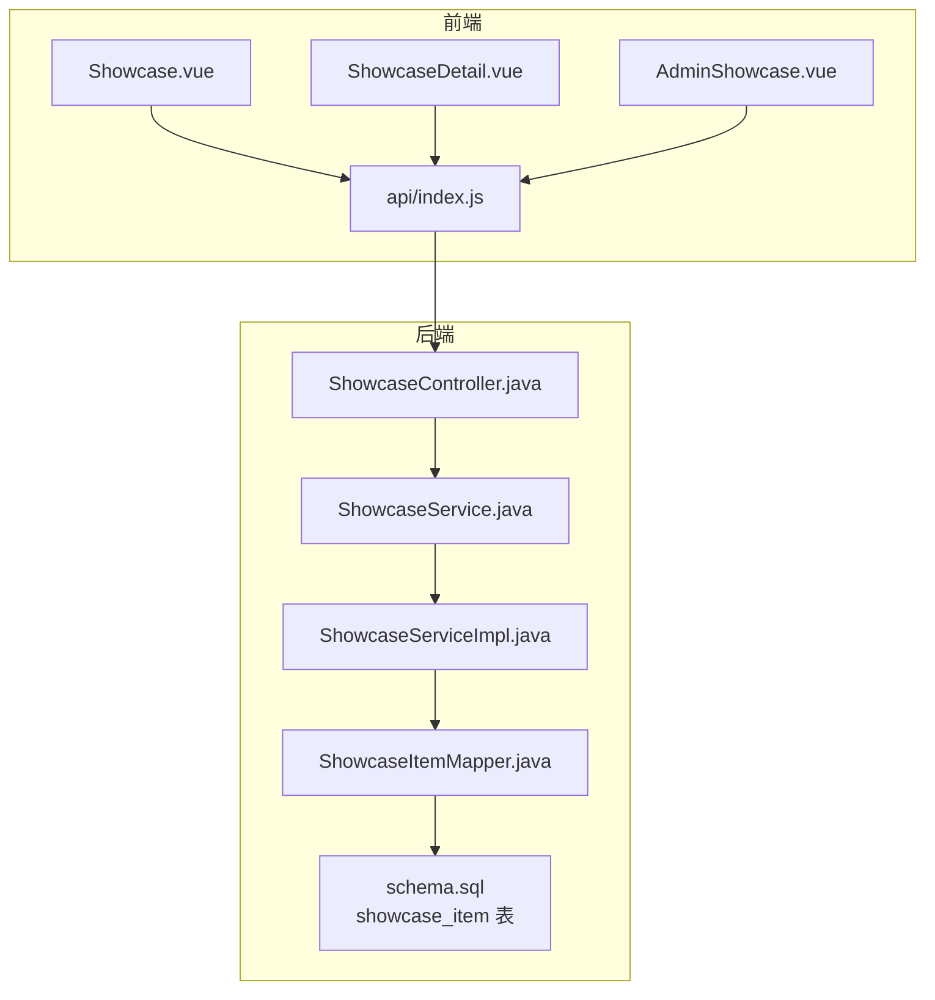
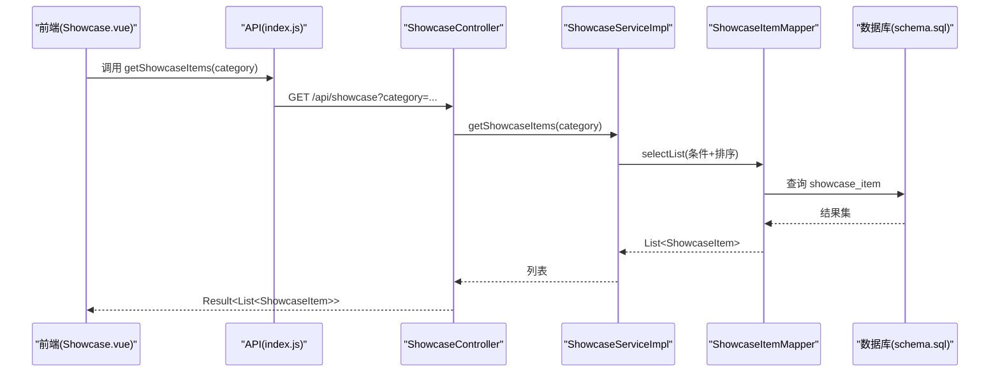
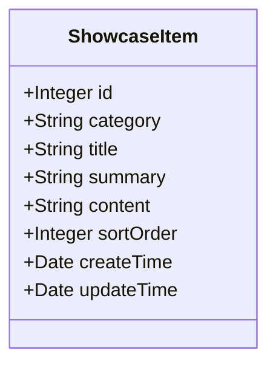
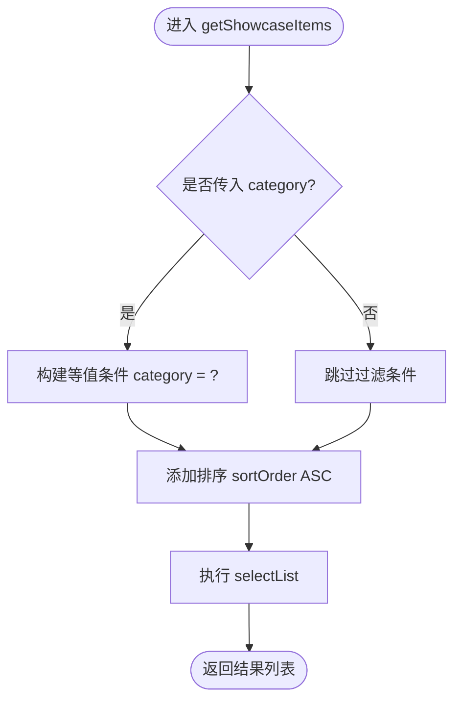
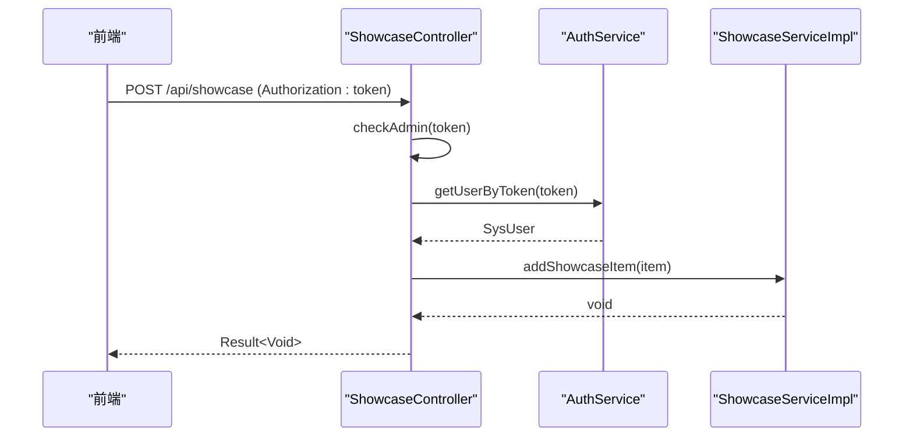
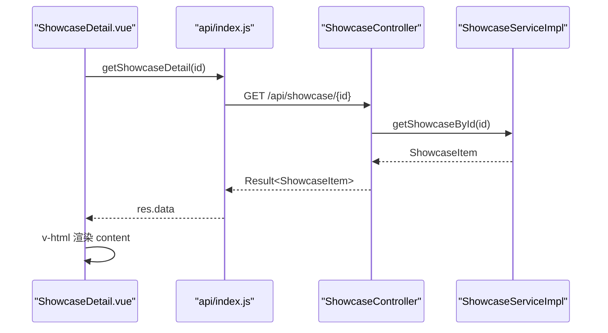
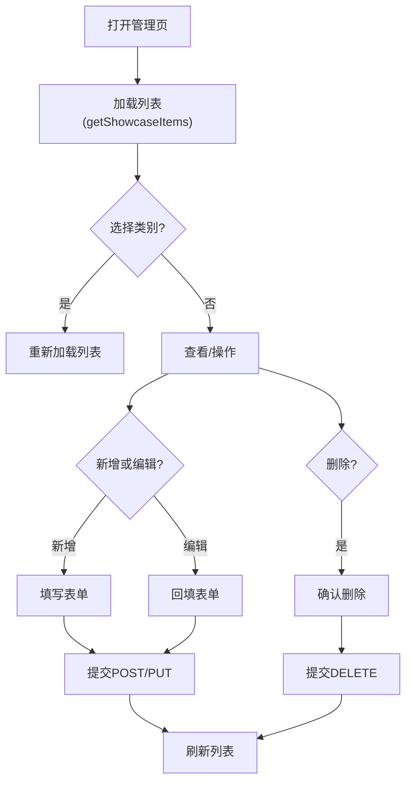
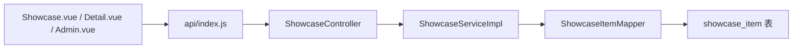

# 产品宣贯展示模块

<cite>
**本文引用的文件列表**
- [ShowcaseItem.java](file://backend/src/main/java/com/xx/platform/entity/ShowcaseItem.java)
- [ShowcaseService.java](file://backend/src/main/java/com/xx/platform/service/ShowcaseService.java)
- [ShowcaseServiceImpl.java](file://backend/src/main/java/com/xx/platform/service/impl/ShowcaseServiceImpl.java)
- [ShowcaseController.java](file://backend/src/main/java/com/xx/platform/controller/ShowcaseController.java)
- [ShowcaseItemMapper.java](file://backend/src/main/java/com/xx/platform/mapper/ShowcaseItemMapper.java)
- [schema.sql](file://backend/src/main/resources/schema.sql)
- [index.js](file://frontend/src/api/index.js)
- [Showcase.vue](file://frontend/src/views/Showcase.vue)
- [ShowcaseDetail.vue](file://frontend/src/views/ShowcaseDetail.vue)
- [AdminShowcase.vue](file://frontend/src/views/admin/AdminShowcase.vue)
</cite>

## 目录
1. [简介](#简介)
2. [项目结构](#项目结构)
3. [核心组件](#核心组件)
4. [架构总览](#架构总览)
5. [详细组件分析](#详细组件分析)
6. [依赖关系分析](#依赖关系分析)
7. [性能与扩展性](#性能与扩展性)
8. [故障排查指南](#故障排查指南)
9. [结论](#结论)
10. [附录](#附录)

## 简介
本模块面向“产品宣贯展示”，提供多维度内容展示、富文本内容管理、分类浏览与详情渲染能力。后端基于 Spring Boot + MyBatis-Plus，前端采用 Vue 3 + Element Plus + ECharts。数据模型以 ShowcaseItem 为核心，支持按维度（类别）筛选、排序展示；前端通过 API 获取数据并渲染卡片与详情页面，同时提供后台管理界面进行增删改查。

## 项目结构
围绕“宣贯展示”的关键代码分布如下：
- 后端实体与持久化
  - 实体：ShowcaseItem
  - Mapper：ShowcaseItemMapper（继承 BaseMapper）
  - 服务接口与实现：ShowcaseService / ShowcaseServiceImpl
  - 控制器：ShowcaseController（REST 接口）
  - 数据库脚本：schema.sql（含 showcase_item 表结构与示例数据）
- 前端视图与接口
  - 列表页：Showcase.vue（维度切换、图表概览、卡片网格）
  - 详情页：ShowcaseDetail.vue（标题、摘要、富文本内容渲染）
  - 管理页：AdminShowcase.vue（新增/编辑/删除/过滤）
  - 接口封装：api/index.js（getShowcaseItems、getShowcaseDetail、CRUD）

图示来源
- [Showcase.vue:1-190](file://frontend/src/views/Showcase.vue#L1-L190)
- [ShowcaseDetail.vue:1-95](file://frontend/src/views/ShowcaseDetail.vue#L1-L95)
- [AdminShowcase.vue:1-123](file://frontend/src/views/admin/AdminShowcase.vue#L1-L123)
- [index.js:88-111](file://frontend/src/api/index.js#L88-L111)
- [ShowcaseController.java:1-87](file://backend/src/main/java/com/xx/platform/controller/ShowcaseController.java#L1-L87)
- [ShowcaseService.java:1-38](file://backend/src/main/java/com/xx/platform/service/ShowcaseService.java#L1-L38)
- [ShowcaseServiceImpl.java:1-60](file://backend/src/main/java/com/xx/platform/service/impl/ShowcaseServiceImpl.java#L1-L60)
- [ShowcaseItemMapper.java:1-13](file://backend/src/main/java/com/xx/platform/mapper/ShowcaseItemMapper.java#L1-L13)
- [schema.sql:39-49](file://backend/src/main/resources/schema.sql#L39-L49)

章节来源
- [ShowcaseItem.java:1-40](file://backend/src/main/java/com/xx/platform/entity/ShowcaseItem.java#L1-L40)
- [ShowcaseService.java:1-38](file://backend/src/main/java/com/xx/platform/service/ShowcaseService.java#L1-L38)
- [ShowcaseServiceImpl.java:1-60](file://backend/src/main/java/com/xx/platform/service/impl/ShowcaseServiceImpl.java#L1-L60)
- [ShowcaseController.java:1-87](file://backend/src/main/java/com/xx/platform/controller/ShowcaseController.java#L1-L87)
- [ShowcaseItemMapper.java:1-13](file://backend/src/main/java/com/xx/platform/mapper/ShowcaseItemMapper.java#L1-L13)
- [schema.sql:39-49](file://backend/src/main/resources/schema.sql#L39-L49)
- [index.js:88-111](file://frontend/src/api/index.js#L88-L111)
- [Showcase.vue:1-190](file://frontend/src/views/Showcase.vue#L1-L190)
- [ShowcaseDetail.vue:1-95](file://frontend/src/views/ShowcaseDetail.vue#L1-L95)
- [AdminShowcase.vue:1-123](file://frontend/src/views/admin/AdminShowcase.vue#L1-L123)

## 核心组件
- 实体 ShowcaseItem
  - 字段：id、category、title、summary、content、sortOrder、createTime、updateTime
  - category 枚举值：USER_ECOLOGY、PRODUCT_SYSTEM、MODEL_SYSTEM、DATA_SYSTEM、IP
  - content 用于存储富文本内容（HTML），summary 为短摘要
- 服务层 ShowcaseService / ShowcaseServiceImpl
  - 按 category 过滤查询，默认按 sortOrder 升序
  - 根据 id 获取详情，不存在时抛出运行时异常
  - 新增/更新/删除操作，自动维护时间戳
- 控制器 ShowcaseController
  - GET /api/showcase?category=... 返回列表
  - GET /api/showcase/{id} 返回详情
  - POST/PUT/DELETE 受管理员权限校验保护
- 前端 Showcase.vue
  - 顶部维度概览饼图（ECharts）
  - 维度标签切换，加载对应列表
  - 卡片网格布局，点击跳转详情
- 前端 ShowcaseDetail.vue
  - 使用 v-html 渲染 content 富文本
  - 显示维度标签、标题、摘要
- 管理端 AdminShowcase.vue
  - 列表展示、按类别筛选
  - 弹窗表单新增/编辑，包含 title、summary、content、sortOrder
  - 删除确认

章节来源
- [ShowcaseItem.java:10-39](file://backend/src/main/java/com/xx/platform/entity/ShowcaseItem.java#L10-L39)
- [ShowcaseServiceImpl.java:23-58](file://backend/src/main/java/com/xx/platform/service/impl/ShowcaseServiceImpl.java#L23-L58)
- [ShowcaseController.java:26-85](file://backend/src/main/java/com/xx/platform/controller/ShowcaseController.java#L26-L85)
- [Showcase.vue:45-117](file://frontend/src/views/Showcase.vue#L45-L117)
- [ShowcaseDetail.vue:22-47](file://frontend/src/views/ShowcaseDetail.vue#L22-L47)
- [AdminShowcase.vue:60-117](file://frontend/src/views/admin/AdminShowcase.vue#L60-L117)

## 架构总览
从请求到响应的端到端流程如下：

图示来源
- [Showcase.vue:68-75](file://frontend/src/views/Showcase.vue#L68-L75)
- [index.js:88-91](file://frontend/src/api/index.js#L88-L91)
- [ShowcaseController.java:29-33](file://backend/src/main/java/com/xx/platform/controller/ShowcaseController.java#L29-L33)
- [ShowcaseServiceImpl.java:24-31](file://backend/src/main/java/com/xx/platform/service/impl/ShowcaseServiceImpl.java#L24-L31)
- [ShowcaseItemMapper.java:10-12](file://backend/src/main/java/com/xx/platform/mapper/ShowcaseItemMapper.java#L10-L12)
- [schema.sql:39-49](file://backend/src/main/resources/schema.sql#L39-L49)

## 详细组件分析

### 实体与数据模型
- 表结构 showcase_item
  - 主键：id（自增）
  - 字段：category、title、summary、content、sortOrder、create_time、update_time
  - content 为 TEXT，适合存放 HTML 富文本
- 实体映射 ShowcaseItem
  - 使用 MyBatis-Plus 注解映射表名与主键策略
  - 字段类型与数据库一致，便于序列化传输

图示来源
- [ShowcaseItem.java:14-39](file://backend/src/main/java/com/xx/platform/entity/ShowcaseItem.java#L14-L39)
- [schema.sql:39-49](file://backend/src/main/resources/schema.sql#L39-L49)

章节来源
- [ShowcaseItem.java:10-39](file://backend/src/main/java/com/xx/platform/entity/ShowcaseItem.java#L10-L39)
- [schema.sql:39-49](file://backend/src/main/resources/schema.sql#L39-L49)

### 服务层业务逻辑（ShowcaseService）
- 列表查询
  - 可选按 category 过滤
  - 固定按 sortOrder 升序排列
- 详情查询
  - 按 id 查询，不存在抛异常
- 增删改
  - 新增/更新自动设置时间戳
  - 删除直接按 id 移除

图示来源
- [ShowcaseServiceImpl.java:24-31](file://backend/src/main/java/com/xx/platform/service/impl/ShowcaseServiceImpl.java#L24-L31)

章节来源
- [ShowcaseService.java:10-36](file://backend/src/main/java/com/xx/platform/service/ShowcaseService.java#L10-L36)
- [ShowcaseServiceImpl.java:23-58](file://backend/src/main/java/com/xx/platform/service/impl/ShowcaseServiceImpl.java#L23-L58)

### 控制器与权限控制
- 公开接口
  - GET /api/showcase?category=...
  - GET /api/showcase/{id}
- 管理员接口
  - POST /api/showcase
  - PUT /api/showcase/{id}
  - DELETE /api/showcase/{id}
- 权限校验
  - 通过 Authorization 头携带 token
  - 解析用户角色，仅 ADMIN 可写

图示来源
- [ShowcaseController.java:48-54](file://backend/src/main/java/com/xx/platform/controller/ShowcaseController.java#L48-L54)
- [ShowcaseController.java:81-85](file://backend/src/main/java/com/xx/platform/controller/ShowcaseController.java#L81-L85)
- [ShowcaseServiceImpl.java:43-47](file://backend/src/main/java/com/xx/platform/service/impl/ShowcaseServiceImpl.java#L43-L47)

章节来源
- [ShowcaseController.java:26-85](file://backend/src/main/java/com/xx/platform/controller/ShowcaseController.java#L26-L85)

### 前端列表与详情渲染
- 列表页 Showcase.vue
  - 维度概览：并行请求各维度数量，绘制饼图
  - 维度切换：radio-group 绑定 activeCategory，触发 loadItems
  - 列表渲染：grid 自适应卡片，点击跳转详情
- 详情页 ShowcaseDetail.vue
  - 路由参数 id 获取详情
  - 使用 v-html 渲染 content 富文本
  - 计算属性将 category 映射为中文标签

图示来源
- [ShowcaseDetail.vue:40-47](file://frontend/src/views/ShowcaseDetail.vue#L40-L47)
- [index.js:93-96](file://frontend/src/api/index.js#L93-L96)
- [ShowcaseController.java:39-42](file://backend/src/main/java/com/xx/platform/controller/ShowcaseController.java#L39-L42)
- [ShowcaseServiceImpl.java:34-40](file://backend/src/main/java/com/xx/platform/service/impl/ShowcaseServiceImpl.java#L34-L40)

章节来源
- [Showcase.vue:62-75](file://frontend/src/views/Showcase.vue#L62-L75)
- [ShowcaseDetail.vue:22-47](file://frontend/src/views/ShowcaseDetail.vue#L22-L47)

### 管理端工作流
- 列表与筛选
  - 支持按类别筛选，刷新列表
- 新增/编辑
  - 表单包含 category、title、summary、content、sortOrder
  - 保存后刷新列表
- 删除
  - 二次确认后删除

图示来源
- [AdminShowcase.vue:84-117](file://frontend/src/views/admin/AdminShowcase.vue#L84-L117)
- [index.js:98-111](file://frontend/src/api/index.js#L98-L111)

章节来源
- [AdminShowcase.vue:60-117](file://frontend/src/views/admin/AdminShowcase.vue#L60-L117)

## 依赖关系分析
- 组件耦合
  - 控制器依赖服务接口，服务实现依赖 Mapper，Mapper 依赖数据库表
  - 前端通过 api/index.js 统一调用后端 REST 接口
- 外部依赖
  - 前端：Element Plus、ECharts
  - 后端：Spring Boot、MyBatis-Plus、SQLite（由 schema.sql 指定）

图示来源
- [ShowcaseController.java:1-87](file://backend/src/main/java/com/xx/platform/controller/ShowcaseController.java#L1-L87)
- [ShowcaseServiceImpl.java:1-60](file://backend/src/main/java/com/xx/platform/service/impl/ShowcaseServiceImpl.java#L1-L60)
- [ShowcaseItemMapper.java:1-13](file://backend/src/main/java/com/xx/platform/mapper/ShowcaseItemMapper.java#L1-L13)
- [schema.sql:39-49](file://backend/src/main/resources/schema.sql#L39-L49)
- [index.js:88-111](file://frontend/src/api/index.js#L88-L111)
- [Showcase.vue:1-190](file://frontend/src/views/Showcase.vue#L1-L190)
- [ShowcaseDetail.vue:1-95](file://frontend/src/views/ShowcaseDetail.vue#L1-L95)
- [AdminShowcase.vue:1-123](file://frontend/src/views/admin/AdminShowcase.vue#L1-L123)

章节来源
- [ShowcaseController.java:1-87](file://backend/src/main/java/com/xx/platform/controller/ShowcaseController.java#L1-L87)
- [ShowcaseServiceImpl.java:1-60](file://backend/src/main/java/com/xx/platform/service/impl/ShowcaseServiceImpl.java#L1-L60)
- [ShowcaseItemMapper.java:1-13](file://backend/src/main/java/com/xx/platform/mapper/ShowcaseItemMapper.java#L1-L13)
- [schema.sql:39-49](file://backend/src/main/resources/schema.sql#L39-L49)
- [index.js:88-111](file://frontend/src/api/index.js#L88-L111)
- [Showcase.vue:1-190](file://frontend/src/views/Showcase.vue#L1-L190)
- [ShowcaseDetail.vue:1-95](file://frontend/src/views/ShowcaseDetail.vue#L1-L95)
- [AdminShowcase.vue:1-123](file://frontend/src/views/admin/AdminShowcase.vue#L1-L123)

## 性能与扩展性
- 当前特性
  - 列表查询支持按 category 过滤与 sortOrder 排序
  - 未实现分页与全文搜索
- 优化建议
  - 分页：在 Service 层引入 Page 对象，Controller 接收 page/size 参数，提升大数据量下的首屏性能
  - 搜索：在 Service 层增加关键词模糊匹配（如 title、summary 的 LIKE），必要时引入搜索引擎
  - 缓存：对热点维度列表增加本地缓存（如 Caffeine）或 Redis，降低重复查询压力
  - 图片资源：将图片上传至对象存储（OSS/S3），content 中引用 CDN 地址，减少静态资源体积
  - 富文本安全：在服务端对 content 做白名单过滤，避免 XSS 风险
  - 索引：为 category、sortOrder 建立索引，加速过滤与排序

[本节为通用指导，不直接分析具体文件]

## 故障排查指南
- 详情不存在
  - 现象：访问详情时报错
  - 原因：getShowcaseById 找不到记录会抛异常
  - 处理：检查 id 是否正确，或数据是否被删除
- 权限不足
  - 现象：新增/编辑/删除失败
  - 原因：Authorization 缺失或角色非 ADMIN
  - 处理：确保登录成功并携带有效 token，且用户角色为 ADMIN
- 富文本渲染异常
  - 现象：详情页样式错乱或脚本执行
  - 原因：content 包含不受控 HTML
  - 处理：服务端进行 HTML 白名单清洗，前端谨慎使用 v-html

章节来源
- [ShowcaseServiceImpl.java:34-40](file://backend/src/main/java/com/xx/platform/service/impl/ShowcaseServiceImpl.java#L34-L40)
- [ShowcaseController.java:81-85](file://backend/src/main/java/com/xx/platform/controller/ShowcaseController.java#L81-L85)
- [ShowcaseDetail.vue:16](file://frontend/src/views/ShowcaseDetail.vue#L16)

## 结论
该模块以 ShowcaseItem 为核心，实现了按维度分类的内容管理与展示，前后端职责清晰、接口简洁。当前已具备基础的 CRUD 与分类浏览能力，后续可在分页、搜索、缓存、富文本安全与多媒体资源管理方面进一步增强，以提升性能与安全性。

[本节为总结性内容，不直接分析具体文件]

## 附录

### 接口定义（节选）
- 列表
  - GET /api/showcase?category=...
- 详情
  - GET /api/showcase/{id}
- 管理（需管理员）
  - POST /api/showcase
  - PUT /api/showcase/{id}
  - DELETE /api/showcase/{id}

章节来源
- [ShowcaseController.java:29-79](file://backend/src/main/java/com/xx/platform/controller/ShowcaseController.java#L29-L79)
- [index.js:88-111](file://frontend/src/api/index.js#L88-L111)

### 富文本与图片资源方案
- 富文本格式
  - 使用 HTML 字符串存储在 content 字段
  - 建议在编辑器侧输出结构化 HTML，并在服务端进行白名单过滤
- 图片资源
  - 建议上传至对象存储，content 中引用 CDN 链接
  - 若仍使用本地路径，注意静态资源目录与跨域配置

章节来源
- [schema.sql:44-45](file://backend/src/main/resources/schema.sql#L44-L45)
- [AdminShowcase.vue:45-47](file://frontend/src/views/admin/AdminShowcase.vue#L45-L47)
- [ShowcaseDetail.vue:16](file://frontend/src/views/ShowcaseDetail.vue#L16)