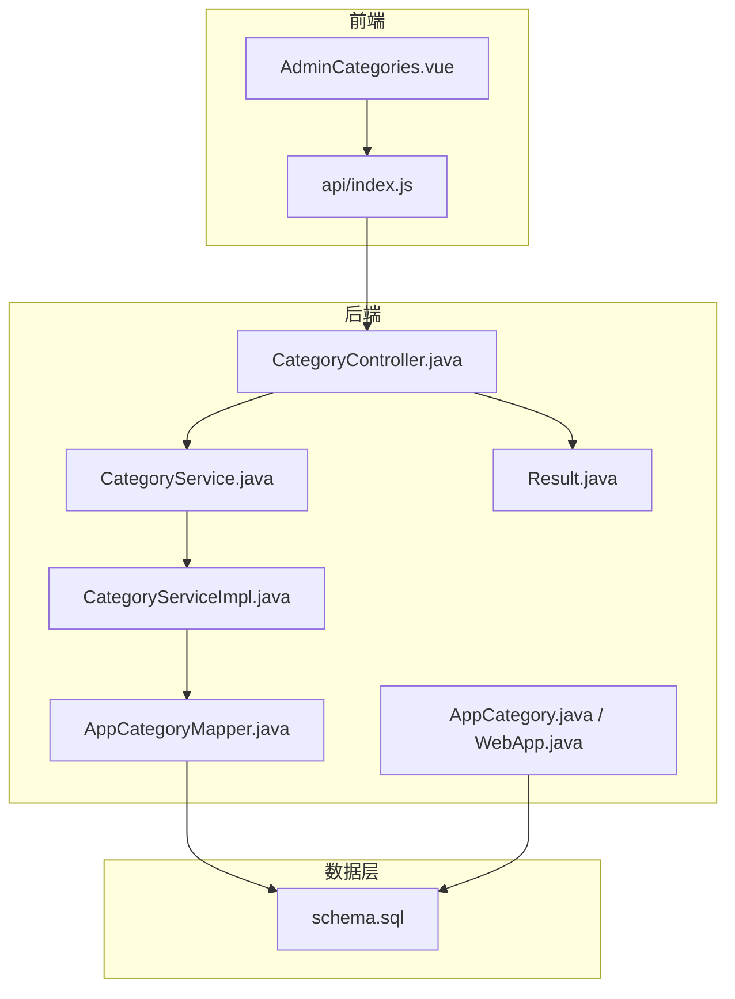
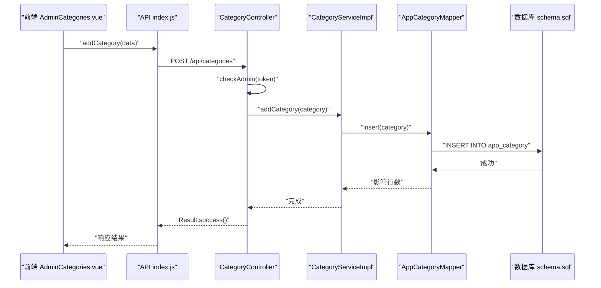
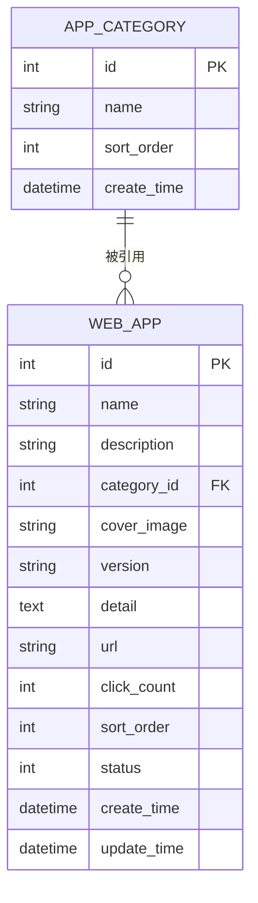
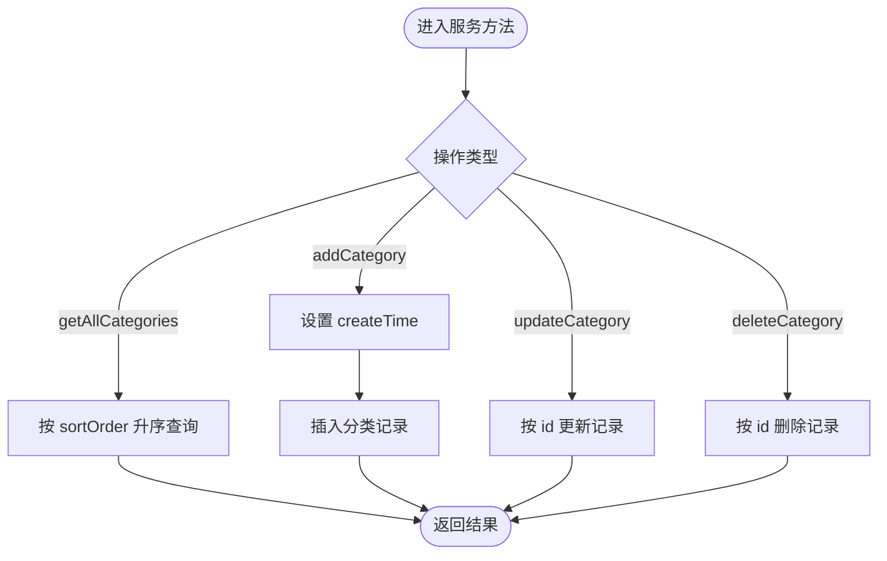
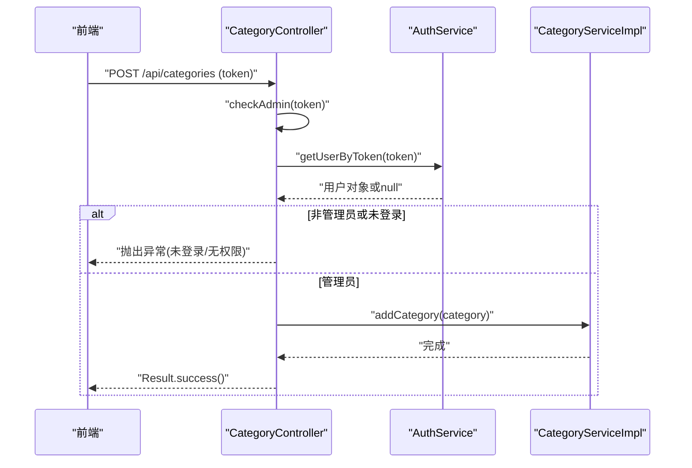
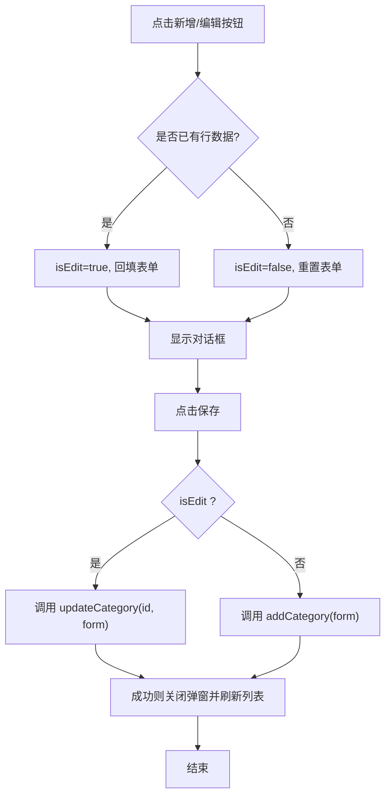
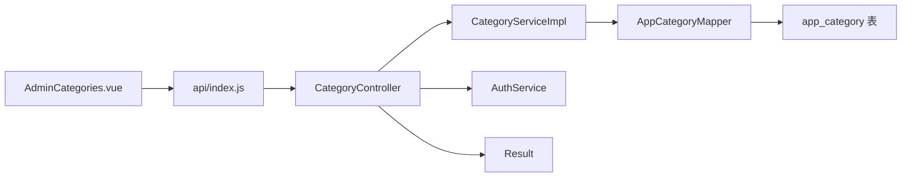

# 分类管理模块

<cite>
**本文引用的文件列表**
- [AppCategory.java](file://backend/src/main/java/com/xx/platform/entity/AppCategory.java)
- [WebApp.java](file://backend/src/main/java/com/xx/platform/entity/WebApp.java)
- [CategoryService.java](file://backend/src/main/java/com/xx/platform/service/CategoryService.java)
- [CategoryServiceImpl.java](file://backend/src/main/java/com/xx/platform/service/impl/CategoryServiceImpl.java)
- [AppCategoryMapper.java](file://backend/src/main/java/com/xx/platform/mapper/AppCategoryMapper.java)
- [CategoryController.java](file://backend/src/main/java/com/xx/platform/controller/CategoryController.java)
- [Result.java](file://backend/src/main/java/com/xx/platform/common/Result.java)
- [schema.sql](file://backend/src/main/resources/schema.sql)
- [index.js](file://frontend/src/api/index.js)
- [AdminCategories.vue](file://frontend/src/views/admin/AdminCategories.vue)
</cite>

## 目录
1. [简介](#简介)
2. [项目结构](#项目结构)
3. [核心组件](#核心组件)
4. [架构总览](#架构总览)
5. [详细组件分析](#详细组件分析)
6. [依赖关系分析](#依赖关系分析)
7. [性能考虑](#性能考虑)
8. [故障排查指南](#故障排查指南)
9. [结论](#结论)
10. [附录](#附录)

## 简介
本模块聚焦“应用分类”的后台管理能力，涵盖分类的增删改查、排序维护以及与应用的关联展示。当前实现为扁平化分类（无父子层级），通过 sort_order 字段控制显示顺序；前端提供管理员界面进行编辑与删除操作。后续可扩展为树形分类并支持拖拽排序与级联策略。

## 项目结构
后端采用 Spring Boot + MyBatis-Plus 分层架构：Controller 暴露 REST API，Service 封装业务逻辑，Mapper 负责数据访问；实体类映射数据库表。前端基于 Vue 3 + Element Plus，提供分类管理页面并通过统一 API 调用后端接口。

图表来源
- [CategoryController.java:1-78](file://backend/src/main/java/com/xx/platform/controller/CategoryController.java#L1-L78)
- [CategoryService.java:1-32](file://backend/src/main/java/com/xx/platform/service/CategoryService.java#L1-L32)
- [CategoryServiceImpl.java:1-44](file://backend/src/main/java/com/xx/platform/service/impl/CategoryServiceImpl.java#L1-L44)
- [AppCategoryMapper.java:1-13](file://backend/src/main/java/com/xx/platform/mapper/AppCategoryMapper.java#L1-L13)
- [AppCategory.java:1-28](file://backend/src/main/java/com/xx/platform/entity/AppCategory.java#L1-L28)
- [WebApp.java:1-54](file://backend/src/main/java/com/xx/platform/entity/WebApp.java#L1-L54)
- [Result.java:1-53](file://backend/src/main/java/com/xx/platform/common/Result.java#L1-L53)
- [schema.sql:1-80](file://backend/src/main/resources/schema.sql#L1-L80)
- [AdminCategories.vue:1-95](file://frontend/src/views/admin/AdminCategories.vue#L1-L95)
- [index.js:68-86](file://frontend/src/api/index.js#L68-L86)

章节来源
- [CategoryController.java:1-78](file://backend/src/main/java/com/xx/platform/controller/CategoryController.java#L1-L78)
- [CategoryService.java:1-32](file://backend/src/main/java/com/xx/platform/service/CategoryService.java#L1-L32)
- [CategoryServiceImpl.java:1-44](file://backend/src/main/java/com/xx/platform/service/impl/CategoryServiceImpl.java#L1-L44)
- [AppCategoryMapper.java:1-13](file://backend/src/main/java/com/xx/platform/mapper/AppCategoryMapper.java#L1-L13)
- [AppCategory.java:1-28](file://backend/src/main/java/com/xx/platform/entity/AppCategory.java#L1-L28)
- [WebApp.java:1-54](file://backend/src/main/java/com/xx/platform/entity/WebApp.java#L1-L54)
- [Result.java:1-53](file://backend/src/main/java/com/xx/platform/common/Result.java#L1-L53)
- [schema.sql:1-80](file://backend/src/main/resources/schema.sql#L1-L80)
- [AdminCategories.vue:1-95](file://frontend/src/views/admin/AdminCategories.vue#L1-L95)
- [index.js:68-86](file://frontend/src/api/index.js#L68-L86)

## 核心组件
- 实体模型
  - AppCategory：表示分类，包含 id、name、sortOrder、createTime。
  - WebApp：表示应用，包含 categoryId 外键引用分类，用于按分类展示应用。
- 服务层
  - CategoryService 接口定义分类 CRUD 方法。
  - CategoryServiceImpl 实现查询（按 sortOrder 升序）、新增（设置 createTime）、更新、删除。
- 控制器
  - CategoryController 暴露 GET/POST/PUT/DELETE 接口，并对写操作进行管理员鉴权。
- 数据访问
  - AppCategoryMapper 继承 BaseMapper，使用 MyBatis-Plus 提供的通用方法。
- 前端
  - AdminCategories.vue 提供分类列表、新增/编辑弹窗、删除确认等交互。
  - api/index.js 封装分类相关请求函数。

章节来源
- [AppCategory.java:1-28](file://backend/src/main/java/com/xx/platform/entity/AppCategory.java#L1-L28)
- [WebApp.java:1-54](file://backend/src/main/java/com/xx/platform/entity/WebApp.java#L1-L54)
- [CategoryService.java:1-32](file://backend/src/main/java/com/xx/platform/service/CategoryService.java#L1-L32)
- [CategoryServiceImpl.java:1-44](file://backend/src/main/java/com/xx/platform/service/impl/CategoryServiceImpl.java#L1-L44)
- [AppCategoryMapper.java:1-13](file://backend/src/main/java/com/xx/platform/mapper/AppCategoryMapper.java#L1-L13)
- [CategoryController.java:1-78](file://backend/src/main/java/com/xx/platform/controller/CategoryController.java#L1-L78)
- [AdminCategories.vue:1-95](file://frontend/src/views/admin/AdminCategories.vue#L1-L95)
- [index.js:68-86](file://frontend/src/api/index.js#L68-L86)

## 架构总览
以下序列图展示了分类管理的典型请求流程（以新增为例）：

图表来源
- [AdminCategories.vue:75-84](file://frontend/src/views/admin/AdminCategories.vue#L75-L84)
- [index.js:73-76](file://frontend/src/api/index.js#L73-L76)
- [CategoryController.java:39-45](file://backend/src/main/java/com/xx/platform/controller/CategoryController.java#L39-L45)
- [CategoryServiceImpl.java:29-32](file://backend/src/main/java/com/xx/platform/service/impl/CategoryServiceImpl.java#L29-L32)
- [AppCategoryMapper.java:1-13](file://backend/src/main/java/com/xx/platform/mapper/AppCategoryMapper.java#L1-L13)
- [schema.sql:14-20](file://backend/src/main/resources/schema.sql#L14-L20)

## 详细组件分析

### 实体设计与数据模型
- AppCategory
  - 字段：id（自增主键）、name（非空）、sortOrder（默认0）、createTime（创建时间）。
  - 用途：作为分类维度，供应用列表按分类筛选与排序。
- WebApp
  - 字段：categoryId（整数外键，逻辑关联分类）、其他应用元信息。
  - 关联：通过 categoryId 指向 AppCategory.id，形成一对多关系（一个分类对应多个应用）。

图表来源
- [AppCategory.java:1-28](file://backend/src/main/java/com/xx/platform/entity/AppCategory.java#L1-L28)
- [WebApp.java:1-54](file://backend/src/main/java/com/xx/platform/entity/WebApp.java#L1-L54)
- [schema.sql:14-37](file://backend/src/main/resources/schema.sql#L14-L37)

章节来源
- [AppCategory.java:1-28](file://backend/src/main/java/com/xx/platform/entity/AppCategory.java#L1-L28)
- [WebApp.java:1-54](file://backend/src/main/java/com/xx/platform/entity/WebApp.java#L1-L54)
- [schema.sql:14-37](file://backend/src/main/resources/schema.sql#L14-L37)

### 服务层与业务逻辑
- 获取分类列表
  - 按 sortOrder 升序返回，便于前端直接渲染有序列表。
- 新增分类
  - 自动填充 createTime，插入记录。
- 更新分类
  - 根据 id 更新所有传入字段（包括名称与排序）。
- 删除分类
  - 按 id 删除记录。

图表来源
- [CategoryServiceImpl.java:22-42](file://backend/src/main/java/com/xx/platform/service/impl/CategoryServiceImpl.java#L22-L42)

章节来源
- [CategoryService.java:10-31](file://backend/src/main/java/com/xx/platform/service/CategoryService.java#L10-L31)
- [CategoryServiceImpl.java:22-42](file://backend/src/main/java/com/xx/platform/service/impl/CategoryServiceImpl.java#L22-L42)

### 控制器与权限校验
- 路由
  - GET /api/categories：获取分类列表。
  - POST /api/categories：新增分类（需管理员）。
  - PUT /api/categories/{id}：更新分类（需管理员）。
  - DELETE /api/categories/{id}：删除分类（需管理员）。
- 权限
  - 通过 Authorization 头携带 token，解析用户角色，仅允许 ADMIN 执行写操作。

图表来源
- [CategoryController.java:39-76](file://backend/src/main/java/com/xx/platform/controller/CategoryController.java#L39-L76)

章节来源
- [CategoryController.java:16-76](file://backend/src/main/java/com/xx/platform/controller/CategoryController.java#L16-L76)
- [Result.java:23-51](file://backend/src/main/java/com/xx/platform/common/Result.java#L23-L51)

### 前端管理界面
- 功能点
  - 列表展示：ID、名称、排序。
  - 新增/编辑：弹窗表单，包含名称与排序输入。
  - 删除：二次确认后调用删除接口。
  - 加载状态：表格 v-loading 提示。
- 交互流程
  - 打开弹窗时区分新增/编辑模式，复用同一表单对象。
  - 保存成功后刷新列表并关闭弹窗。

图表来源
- [AdminCategories.vue:64-84](file://frontend/src/views/admin/AdminCategories.vue#L64-L84)
- [index.js:73-81](file://frontend/src/api/index.js#L73-L81)

章节来源
- [AdminCategories.vue:1-95](file://frontend/src/views/admin/AdminCategories.vue#L1-L95)
- [index.js:68-86](file://frontend/src/api/index.js#L68-L86)

### 分类树构建与层级结构（现状与扩展建议）
- 现状
  - 当前 AppCategory 无 parent_id 字段，不支持父子层级；分类为扁平结构。
- 扩展建议
  - 在 AppCategory 增加 parent_id 字段，并在 Mapper 中提供递归查询或一次性加载后在内存构建树的方法。
  - 前端可改用树形控件展示，支持展开/折叠与层级拖拽。

[本节为概念性说明，不直接分析具体代码文件]

### 排序管理与数据完整性校验
- 排序
  - 后端查询按 sortOrder 升序返回；前端提供数值输入框限制最小值。
- 完整性校验
  - 前端对名称必填做基础校验。
  - 建议在服务层增加重复名称校验、sortOrder 范围校验，以及删除前检查是否存在应用引用。

章节来源
- [CategoryServiceImpl.java:23-26](file://backend/src/main/java/com/xx/platform/service/impl/CategoryServiceImpl.java#L23-L26)
- [AdminCategories.vue:27-32](file://frontend/src/views/admin/AdminCategories.vue#L27-L32)

### 级联删除策略（现状与扩展建议）
- 现状
  - 删除分类仅删除分类记录，未处理 web_app.category_id 引用，存在脏数据风险。
- 建议策略
  - 软删除：将分类标记为禁用而非物理删除。
  - 硬删除前置校验：删除前检查是否有应用引用，若有则拒绝删除或提示迁移。
  - 级联更新：删除时将引用该分类的应用重新分配至默认分类或置空（视业务需求）。

章节来源
- [CategoryServiceImpl.java:40-42](file://backend/src/main/java/com/xx/platform/service/impl/CategoryServiceImpl.java#L40-L42)
- [WebApp.java:26-27](file://backend/src/main/java/com/xx/platform/entity/WebApp.java#L26-L27)

### 最佳实践
- 命名规范
  - 分类名称唯一且简洁，避免过长导致 UI 溢出。
- 排序策略
  - 批量调整排序建议使用事务，保证一致性。
- 权限控制
  - 所有写操作必须校验管理员身份，并记录审计日志。
- 错误处理
  - 统一 Result 包装，前端集中处理错误消息。
- 前端体验
  - 列表分页、搜索过滤、批量选择与批量排序提升效率。

[本节为通用指导，不直接分析具体代码文件]

### 数据迁移方案
- 添加父级字段
  - 为 app_category 增加 parent_id 列，默认 NULL 表示根节点。
  - 编写迁移脚本将现有数据迁移为根节点（parent_id = NULL）。
- 约束与索引
  - 为 parent_id 建立索引以提升树查询性能。
  - 可选：为 name 增加唯一约束防止重复。
- 兼容旧数据
  - 保持向后兼容，读取时忽略 parent_id 字段，仍可按 sortOrder 排序。

章节来源
- [schema.sql:14-20](file://backend/src/main/resources/schema.sql#L14-L20)

### 性能优化建议
- 查询优化
  - 列表接口增加分页参数，减少单次返回数据量。
  - 若未来引入树结构，优先一次全量加载并按内存构建树，避免多次 N+1 查询。
- 缓存
  - 分类列表变化频率低，可在服务层加入短时缓存（如分钟级）。
- 事务
  - 批量更新排序时使用事务，确保中间状态不被外部读到。

[本节为通用指导，不直接分析具体代码文件]

## 依赖关系分析
- 组件耦合
  - Controller 依赖 Service 与 Auth 服务；Service 依赖 Mapper；Mapper 依赖数据库。
  - 前端通过 API 模块调用 Controller 暴露的 REST 接口。
- 外部依赖
  - MyBatis-Plus 提供通用 CRUD 能力。
  - Element Plus 提供 UI 组件。

图表来源
- [CategoryController.java:1-78](file://backend/src/main/java/com/xx/platform/controller/CategoryController.java#L1-L78)
- [CategoryServiceImpl.java:1-44](file://backend/src/main/java/com/xx/platform/service/impl/CategoryServiceImpl.java#L1-L44)
- [AppCategoryMapper.java:1-13](file://backend/src/main/java/com/xx/platform/mapper/AppCategoryMapper.java#L1-L13)
- [AdminCategories.vue:1-95](file://frontend/src/views/admin/AdminCategories.vue#L1-L95)
- [index.js:68-86](file://frontend/src/api/index.js#L68-L86)

章节来源
- [CategoryController.java:1-78](file://backend/src/main/java/com/xx/platform/controller/CategoryController.java#L1-L78)
- [CategoryServiceImpl.java:1-44](file://backend/src/main/java/com/xx/platform/service/impl/CategoryServiceImpl.java#L1-L44)
- [AppCategoryMapper.java:1-13](file://backend/src/main/java/com/xx/platform/mapper/AppCategoryMapper.java#L1-L13)
- [AdminCategories.vue:1-95](file://frontend/src/views/admin/AdminCategories.vue#L1-L95)
- [index.js:68-86](file://frontend/src/api/index.js#L68-L86)

## 性能考虑
- 列表接口应支持分页与过滤，避免一次性返回大量数据。
- 分类数据变更较少，适合在服务层加缓存，降低数据库压力。
- 排序更新尽量批量提交并使用事务，减少锁竞争与不一致窗口。

[本节为通用指导，不直接分析具体代码文件]

## 故障排查指南
- 常见错误
  - 未登录或无管理员权限：检查 Authorization 头是否正确传递，用户角色是否为 ADMIN。
  - 名称为空：前端已做必填校验，若仍报错请检查服务端校验逻辑。
  - 删除失败：可能存在应用引用该分类，需在删除前进行引用检查或提供迁移方案。
- 定位步骤
  - 查看浏览器网络面板的请求与响应，确认接口路径与参数。
  - 检查后端日志中的异常堆栈，关注权限校验与数据库操作。
  - 核对数据库表结构与初始数据是否与 schema.sql 一致。

章节来源
- [CategoryController.java:72-76](file://backend/src/main/java/com/xx/platform/controller/CategoryController.java#L72-L76)
- [AdminCategories.vue:75-89](file://frontend/src/views/admin/AdminCategories.vue#L75-L89)
- [schema.sql:14-20](file://backend/src/main/resources/schema.sql#L14-L20)

## 结论
当前分类管理模块实现了基础的扁平分类 CRUD 与排序展示，具备管理员权限控制与前后端基本交互。为满足更复杂的业务场景，建议逐步引入父子层级、拖拽排序、引用完整性校验与级联策略，并结合分页与缓存提升性能与用户体验。

## 附录
- 接口清单（分类）
  - GET /api/categories：获取分类列表（按 sortOrder 升序）。
  - POST /api/categories：新增分类（需管理员）。
  - PUT /api/categories/{id}：更新分类（需管理员）。
  - DELETE /api/categories/{id}：删除分类（需管理员）。

章节来源
- [CategoryController.java:27-70](file://backend/src/main/java/com/xx/platform/controller/CategoryController.java#L27-L70)
- [index.js:68-86](file://frontend/src/api/index.js#L68-L86)