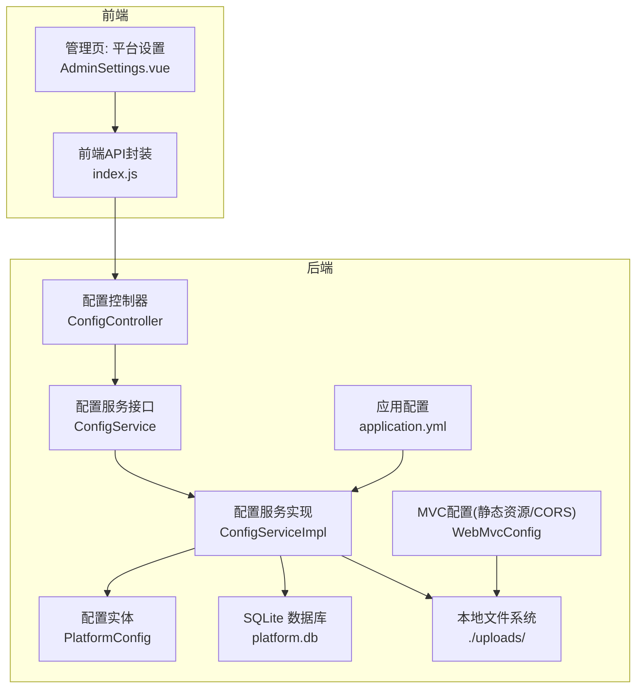
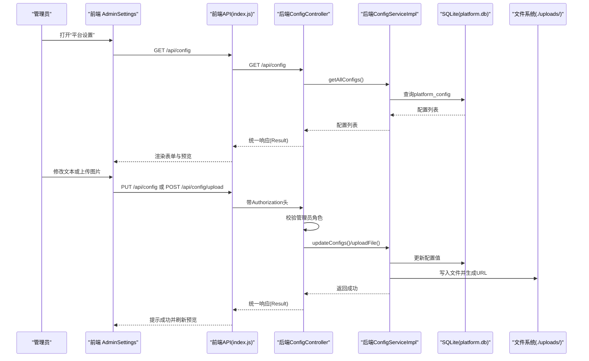
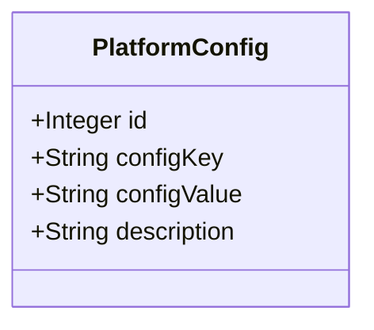
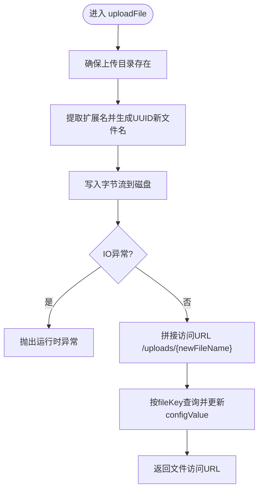
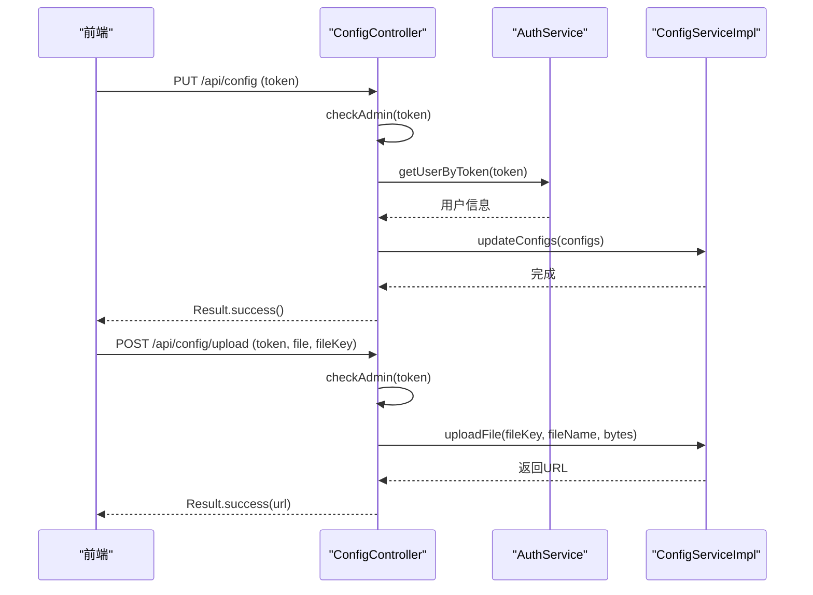
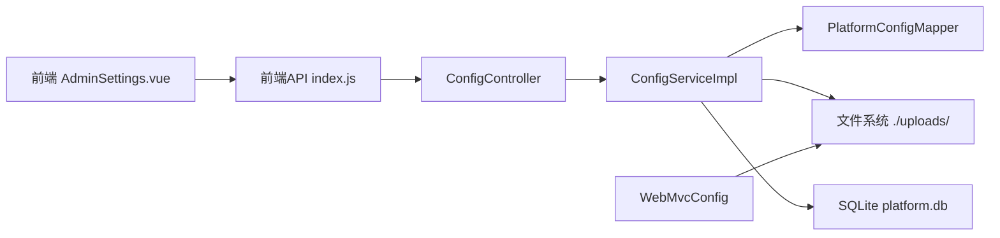

# 平台配置管理模块

<cite>
**本文引用的文件**   
- [PlatformConfig.java](file://backend/src/main/java/com/xx/platform/entity/PlatformConfig.java)
- [ConfigService.java](file://backend/src/main/java/com/xx/platform/service/ConfigService.java)
- [ConfigServiceImpl.java](file://backend/src/main/java/com/xx/platform/service/impl/ConfigServiceImpl.java)
- [ConfigController.java](file://backend/src/main/java/com/xx/platform/controller/ConfigController.java)
- [WebMvcConfig.java](file://backend/src/main/java/com/xx/platform/config/WebMvcConfig.java)
- [application.yml](file://backend/src/main/resources/application.yml)
- [schema.sql](file://backend/src/main/resources/schema.sql)
- [Result.java](file://backend/src/main/java/com/xx/platform/common/Result.java)
- [index.js](file://frontend/src/api/index.js)
- [AdminSettings.vue](file://frontend/src/views/admin/AdminSettings.vue)
- [API.md](file://API.md)
</cite>

## 目录
1. [简介](#简介)
2. [项目结构](#项目结构)
3. [核心组件](#核心组件)
4. [架构总览](#架构总览)
5. [详细组件分析](#详细组件分析)
6. [依赖关系分析](#依赖关系分析)
7. [性能与扩展性](#性能与扩展性)
8. [故障排查指南](#故障排查指南)
9. [结论](#结论)
10. [附录](#附录)

## 简介
本模块为平台提供动态配置、文件上传管理与系统参数设置能力，覆盖后端服务接口、数据持久化、静态资源映射以及前端管理界面。重点包括：
- 配置项的增删改查与批量更新
- Logo、底图等文件的上传与安全策略
- 配置热更新（运行时读取数据库配置）
- 前端 AdminSettings 配置界面的表单交互与预览

## 项目结构
该模块涉及前后端关键文件如下：
- 后端实体与接口：PlatformConfig、ConfigService、ConfigServiceImpl、ConfigController
- 静态资源与跨域：WebMvcConfig
- 应用配置与初始化：application.yml、schema.sql
- 统一响应体：Result
- 前端 API 封装与页面：index.js、AdminSettings.vue
- 接口文档：API.md

图表来源
- [ConfigController.java](file://backend/src/main/java/com/xx/platform/controller/ConfigController.java)
- [ConfigService.java](file://backend/src/main/java/com/xx/platform/service/ConfigService.java)
- [ConfigServiceImpl.java](file://backend/src/main/java/com/xx/platform/service/impl/ConfigServiceImpl.java)
- [PlatformConfig.java](file://backend/src/main/java/com/xx/platform/entity/PlatformConfig.java)
- [WebMvcConfig.java](file://backend/src/main/java/com/xx/platform/config/WebMvcConfig.java)
- [application.yml](file://backend/src/main/resources/application.yml)
- [index.js](file://frontend/src/api/index.js)
- [AdminSettings.vue](file://frontend/src/views/admin/AdminSettings.vue)

章节来源
- [ConfigController.java](file://backend/src/main/java/com/xx/platform/controller/ConfigController.java)
- [ConfigService.java](file://backend/src/main/java/com/xx/platform/service/ConfigService.java)
- [ConfigServiceImpl.java](file://backend/src/main/java/com/xx/platform/service/impl/ConfigServiceImpl.java)
- [PlatformConfig.java](file://backend/src/main/java/com/xx/platform/entity/PlatformConfig.java)
- [WebMvcConfig.java](file://backend/src/main/java/com/xx/platform/config/WebMvcConfig.java)
- [application.yml](file://backend/src/main/resources/application.yml)
- [index.js](file://frontend/src/api/index.js)
- [AdminSettings.vue](file://frontend/src/views/admin/AdminSettings.vue)

## 核心组件
- 配置实体 PlatformConfig：以键值对形式存储平台名称、Logo路径、公司名称、底图路径等可配置项。
- 配置服务 ConfigService/ConfigServiceImpl：提供获取全部配置、按key取值、批量更新配置、文件上传并回写配置值等能力。
- 配置控制器 ConfigController：暴露 REST 接口，负责权限校验、请求解析、调用服务层并返回统一结果。
- 静态资源与跨域 WebMvcConfig：将本地 uploads 目录映射为 /uploads/** 访问路径，并配置 CORS。
- 应用配置 application.yml：定义端口、数据库连接、上传大小限制、MyBatis-Plus 行为及上传目录路径。
- 数据库 schema.sql：初始化 platform_config 表与默认配置项。
- 前端 index.js：封装配置查询、更新与文件上传的 HTTP 调用。
- 前端 AdminSettings.vue：提供文本配置编辑、图片上传与实时预览的管理界面。

章节来源
- [PlatformConfig.java](file://backend/src/main/java/com/xx/platform/entity/PlatformConfig.java)
- [ConfigService.java](file://backend/src/main/java/com/xx/platform/service/ConfigService.java)
- [ConfigServiceImpl.java](file://backend/src/main/java/com/xx/platform/service/impl/ConfigServiceImpl.java)
- [ConfigController.java](file://backend/src/main/java/com/xx/platform/controller/ConfigController.java)
- [WebMvcConfig.java](file://backend/src/main/java/com/xx/platform/config/WebMvcConfig.java)
- [application.yml](file://backend/src/main/resources/application.yml)
- [schema.sql](file://backend/src/main/resources/schema.sql)
- [index.js](file://frontend/src/api/index.js)
- [AdminSettings.vue](file://frontend/src/views/admin/AdminSettings.vue)

## 架构总览
从前端到后端的完整链路如下：
- 前端通过 Axios 封装发起 GET/PUT/POST 请求至 /api/config*
- 后端 Controller 进行管理员鉴权，调用 Service 完成业务逻辑
- Service 读写 SQLite 数据库中的 platform_config 表，并将文件落盘到 ./uploads/
- WebMvcConfig 将 ./uploads/ 映射为 /uploads/** 供浏览器直接访问
- 前端在 AdminSettings 中展示当前配置并提供保存与上传操作

图表来源
- [ConfigController.java](file://backend/src/main/java/com/xx/platform/controller/ConfigController.java)
- [ConfigServiceImpl.java](file://backend/src/main/java/com/xx/platform/service/impl/ConfigServiceImpl.java)
- [application.yml](file://backend/src/main/resources/application.yml)
- [WebMvcConfig.java](file://backend/src/main/java/com/xx/platform/config/WebMvcConfig.java)
- [index.js](file://frontend/src/api/index.js)
- [AdminSettings.vue](file://frontend/src/views/admin/AdminSettings.vue)

## 详细组件分析

### 配置实体与数据模型
- 字段说明
  - id：自增主键
  - configKey：配置键（如 platform_name、company_name、logo_path、bg_image）
  - configValue：配置值（文本或文件访问路径）
  - description：配置描述
- 初始数据
  - 脚本包含默认平台名称、公司名称、空 Logo 与底图路径
- 复杂度
  - 单条记录查询 O(logN) 或 O(1)（取决于索引），批量更新为 N 次单条更新

图表来源
- [PlatformConfig.java](file://backend/src/main/java/com/xx/platform/entity/PlatformConfig.java)
- [schema.sql](file://backend/src/main/resources/schema.sql)

章节来源
- [PlatformConfig.java](file://backend/src/main/java/com/xx/platform/entity/PlatformConfig.java)
- [schema.sql](file://backend/src/main/resources/schema.sql)

### 配置服务层（ConfigService/ConfigServiceImpl）
- 功能职责
  - 获取所有配置项
  - 根据 key 获取配置值
  - 批量更新配置（仅更新已存在的 key）
  - 文件上传：生成唯一文件名、落盘、回写配置值为访问 URL
- 关键点
  - 上传目录自动创建
  - 使用 UUID 避免文件名冲突
  - 仅当对应 key 存在时更新其值
- 异常处理
  - 文件写入失败抛出运行时异常，由上层统一捕获并返回错误信息

图表来源
- [ConfigServiceImpl.java](file://backend/src/main/java/com/xx/platform/service/impl/ConfigServiceImpl.java)

章节来源
- [ConfigService.java](file://backend/src/main/java/com/xx/platform/service/ConfigService.java)
- [ConfigServiceImpl.java](file://backend/src/main/java/com/xx/platform/service/impl/ConfigServiceImpl.java)

### 配置控制器（ConfigController）
- 接口清单
  - GET /api/config：获取全部配置
  - PUT /api/config：批量更新配置（需管理员）
  - POST /api/config/upload：上传文件（需管理员）
- 安全控制
  - 通过 Authorization 头携带 token，校验用户角色为 ADMIN
- 统一响应
  - 使用 Result 包装成功/失败消息与数据

图表来源
- [ConfigController.java](file://backend/src/main/java/com/xx/platform/controller/ConfigController.java)
- [Result.java](file://backend/src/main/java/com/xx/platform/common/Result.java)

章节来源
- [ConfigController.java](file://backend/src/main/java/com/xx/platform/controller/ConfigController.java)
- [Result.java](file://backend/src/main/java/com/xx/platform/common/Result.java)

### 静态资源与跨域（WebMvcConfig）
- 静态资源映射
  - /uploads/** 映射到本地 ./uploads/ 目录，使上传的图片可直接访问
- CORS 配置
  - 允许开发环境跨域访问 /api/**，支持常用方法与凭证

章节来源
- [WebMvcConfig.java](file://backend/src/main/java/com/xx/platform/config/WebMvcConfig.java)

### 应用配置（application.yml）
- 服务器端口：8080
- 数据库：SQLite，文件名为 platform.db
- 上传大小限制：单文件与请求最大均为 10MB
- MyBatis-Plus：开启驼峰映射与 SQL 日志输出
- 自定义上传路径：upload.path= ./uploads/

章节来源
- [application.yml](file://backend/src/main/resources/application.yml)

### 数据库初始化（schema.sql）
- 表 platform_config
  - 字段：id、config_key（唯一）、config_value、description
- 初始数据
  - 平台名称、公司名称、空 Logo 与底图路径
- 其他
  - 包含用户、分类、应用、宣贯等表的初始化（与本模块相关的是 platform_config）

章节来源
- [schema.sql](file://backend/src/main/resources/schema.sql)

### 前端 API 封装（index.js）
- getConfigs：GET /api/config
- updateConfigs：PUT /api/config
- uploadFile：POST /api/config/upload，Content-Type 设置为 multipart/form-data，附带 file 与 fileKey

章节来源
- [index.js](file://frontend/src/api/index.js)

### 前端管理界面（AdminSettings.vue）
- 功能点
  - 加载并填充表单：platform_name、company_name、logo_path、bg_image
  - 保存文本配置：提交 platform_name、company_name
  - 上传 Logo/底图：选择图片后调用 uploadFile，成功后更新预览
- 交互细节
  - 使用 Element Plus 的 Upload 组件，隐藏默认文件列表
  - 上传成功后显示图片预览
  - 保存按钮带 loading 状态，成功/失败给出消息提示

章节来源
- [AdminSettings.vue](file://frontend/src/views/admin/AdminSettings.vue)
- [index.js](file://frontend/src/api/index.js)

## 依赖关系分析
- 组件耦合
  - Controller 依赖 Service 与统一响应体 Result
  - Service 实现依赖 Mapper、配置文件与文件系统
  - 前端页面依赖 API 封装
- 外部依赖
  - Spring Boot、MyBatis-Plus、SQLite、Element Plus
- 潜在循环依赖
  - 当前未见循环引用；Controller 不反向依赖前端

图表来源
- [ConfigController.java](file://backend/src/main/java/com/xx/platform/controller/ConfigController.java)
- [ConfigServiceImpl.java](file://backend/src/main/java/com/xx/platform/service/impl/ConfigServiceImpl.java)
- [WebMvcConfig.java](file://backend/src/main/java/com/xx/platform/config/WebMvcConfig.java)
- [index.js](file://frontend/src/api/index.js)
- [AdminSettings.vue](file://frontend/src/views/admin/AdminSettings.vue)

章节来源
- [ConfigController.java](file://backend/src/main/java/com/xx/platform/controller/ConfigController.java)
- [ConfigServiceImpl.java](file://backend/src/main/java/com/xx/platform/service/impl/ConfigServiceImpl.java)
- [WebMvcConfig.java](file://backend/src/main/java/com/xx/platform/config/WebMvcConfig.java)
- [index.js](file://frontend/src/api/index.js)
- [AdminSettings.vue](file://frontend/src/views/admin/AdminSettings.vue)

## 性能与扩展性
- 性能特性
  - 配置读取为轻量级数据库查询，适合缓存以提升热点配置访问速度
  - 文件上传受限于 application.yml 的 10MB 上限，避免大文件阻塞
- 优化建议
  - 引入内存缓存（如 Caffeine）缓存 platform_config，减少频繁读库
  - 文件存储迁移至对象存储（如 MinIO/OSS），提升可扩展性与可用性
  - 批量更新改为事务包裹，保证一致性
  - 增加文件类型白名单与内容校验，防止恶意文件上传
  - 为 config_key 建立唯一索引（已在 schema 中声明），提高查找效率

[本节为通用指导，无需源码引用]

## 故障排查指南
- 无法访问上传的图片
  - 检查 WebMvcConfig 是否正确映射 /uploads/** 到本地目录
  - 确认 application.yml 中 upload.path 指向的目录存在且可写
- 上传失败
  - 检查文件大小是否超过 10MB 限制
  - 查看服务端异常日志，确认文件写入权限与磁盘空间
- 无权限更新配置
  - 确认请求头 Authorization 携带有效 token，且用户角色为 ADMIN
- 配置未生效
  - 确认前端保存成功后重新拉取配置或刷新页面
  - 若引入缓存，需清理缓存或等待过期

章节来源
- [WebMvcConfig.java](file://backend/src/main/java/com/xx/platform/config/WebMvcConfig.java)
- [application.yml](file://backend/src/main/resources/application.yml)
- [ConfigController.java](file://backend/src/main/java/com/xx/platform/controller/ConfigController.java)
- [ConfigServiceImpl.java](file://backend/src/main/java/com/xx/platform/service/impl/ConfigServiceImpl.java)

## 结论
平台配置管理模块以简洁的键值对模型承载动态配置，结合文件上传与静态资源映射，实现了灵活的门户外观与基础参数管理。通过统一的权限校验与响应封装，保证了接口的安全性与一致性。后续可在缓存、对象存储、安全校验与版本控制方面进一步增强，以满足更高可用与合规要求。

[本节为总结，无需源码引用]

## 附录

### 接口速览（配置相关）
- 获取配置
  - 方法：GET
  - 路径：/api/config
  - 说明：返回所有配置项
- 批量更新配置（管理员）
  - 方法：PUT
  - 路径：/api/config
  - 请求体：{ "platform_name": "...", "company_name": "..." }
  - 说明：仅更新已存在的 key
- 上传文件（管理员）
  - 方法：POST
  - 路径：/api/config/upload
  - Content-Type：multipart/form-data
  - 参数：file（文件）、fileKey（配置键：logo_path 或 bg_image）
  - 响应：文件访问路径

章节来源
- [API.md](file://API.md)
- [ConfigController.java](file://backend/src/main/java/com/xx/platform/controller/ConfigController.java)

### 配置项清单与用途
- platform_name：平台名称
- company_name：公司名称
- logo_path：Logo 文件访问路径
- bg_image：背景图文件访问路径

章节来源
- [schema.sql](file://backend/src/main/resources/schema.sql)
- [AdminSettings.vue](file://frontend/src/views/admin/AdminSettings.vue)

### 最佳实践、备份恢复与版本控制
- 最佳实践
  - 配置键命名规范：采用小写下划线分隔，语义清晰
  - 敏感配置（如密钥）应加密存储，不在前端明文展示
  - 文件上传前进行类型与大小校验，服务端二次校验
  - 对关键配置变更增加审计日志
- 备份恢复
  - 定期备份 SQLite 数据库文件 platform.db
  - 同步备份 ./uploads/ 目录下的媒体文件
  - 恢复流程：停止服务 -> 替换数据库与文件 -> 重启服务
- 版本控制策略
  - 将 schema.sql 纳入版本管理，新增配置项时同步更新脚本与默认值
  - 发布前执行增量迁移脚本，避免全量重建
  - 对重要配置变更保留变更记录，便于回滚与追踪

[本节为通用指导，无需源码引用]