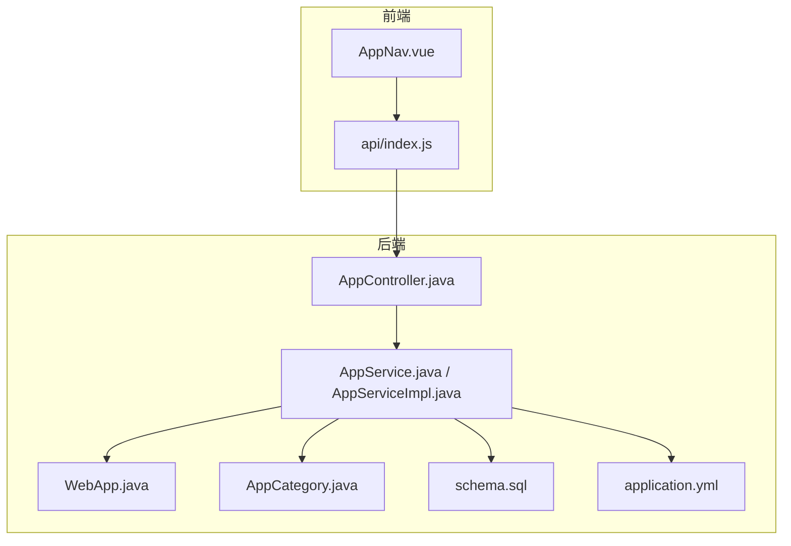
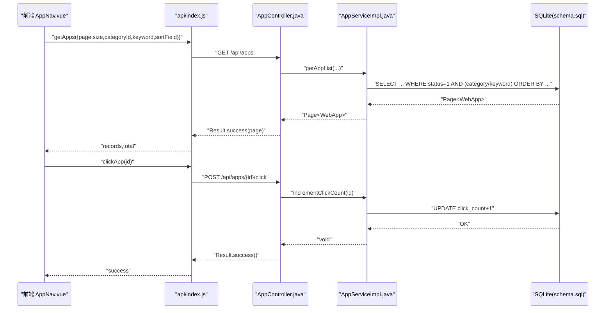
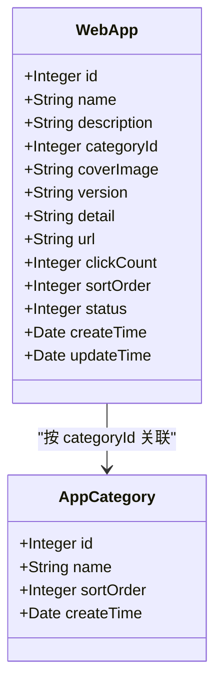
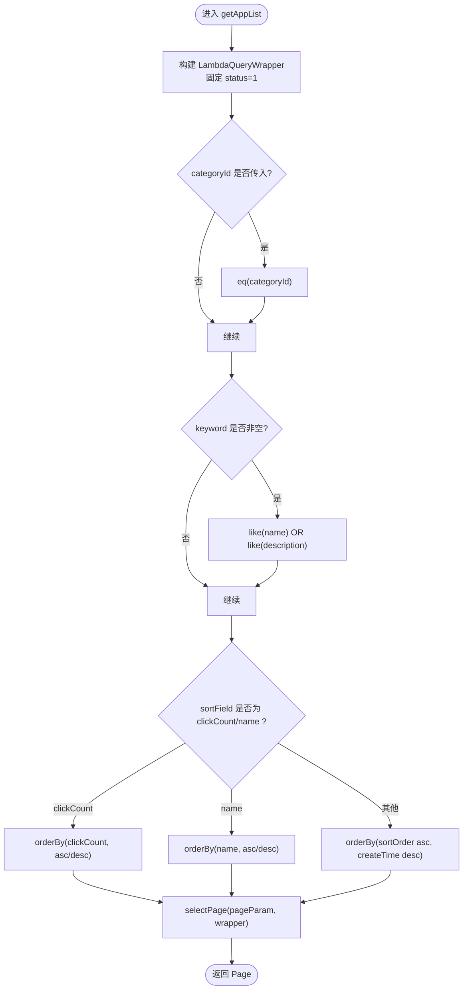
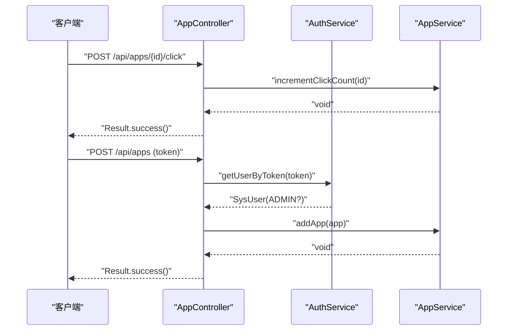
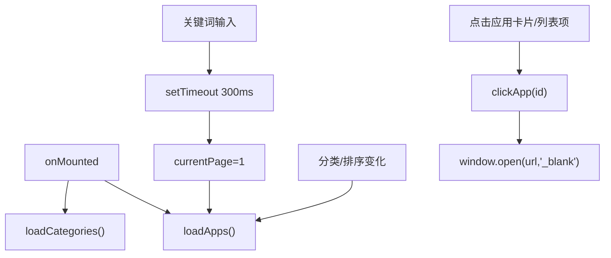
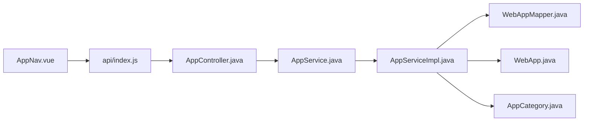

# 应用导航管理模块

<cite>
**本文引用的文件**   
- [AppController.java](file://backend/src/main/java/com/xx/platform/controller/AppController.java)
- [AppService.java](file://backend/src/main/java/com/xx/platform/service/AppService.java)
- [AppServiceImpl.java](file://backend/src/main/java/com/xx/platform/service/impl/AppServiceImpl.java)
- [WebApp.java](file://backend/src/main/java/com/xx/platform/entity/WebApp.java)
- [AppCategory.java](file://backend/src/main/java/com/xx/platform/entity/AppCategory.java)
- [schema.sql](file://backend/src/main/resources/schema.sql)
- [application.yml](file://backend/src/main/resources/application.yml)
- [API.md](file://API.md)
- [index.js](file://frontend/src/api/index.js)
- [AppNav.vue](file://frontend/src/views/AppNav.vue)
</cite>

## 目录
1. [简介](#简介)
2. [项目结构](#项目结构)
3. [核心组件](#核心组件)
4. [架构总览](#架构总览)
5. [详细组件分析](#详细组件分析)
6. [依赖关系分析](#依赖关系分析)
7. [性能与优化](#性能与优化)
8. [故障排查指南](#故障排查指南)
9. [结论](#结论)
10. [附录：API使用示例](#附录api使用示例)

## 简介
本模块为平台“应用导航”功能提供完整的后端服务与前端展示能力，覆盖应用的增删改查、分类关联、关键词搜索与筛选、分页排序、点击统计等。后端基于 Spring Boot + MyBatis-Plus，前端采用 Vue 3 + Element Plus，通过 REST API 完成数据交互。

## 项目结构
围绕应用导航的核心代码分布如下：
- 后端
  - 控制器层：处理 HTTP 请求与鉴权校验
  - 服务层：实现业务逻辑（分页查询、条件过滤、排序、点击计数）
  - 实体与映射：定义数据库表结构与 ORM 映射
  - 配置与初始化：数据库连接、MyBatis-Plus 配置、初始脚本
- 前端
  - 页面组件：应用导航页渲染与应用列表展示
  - API 封装：统一调用后端接口
  - 路由与布局：页面跳转与管理后台布局

图表来源
- [AppNav.vue:1-180](file://frontend/src/views/AppNav.vue#L1-L180)
- [index.js:38-71](file://frontend/src/api/index.js#L38-L71)
- [AppController.java:17-96](file://backend/src/main/java/com/xx/platform/controller/AppController.java#L17-L96)
- [AppService.java:9-46](file://backend/src/main/java/com/xx/platform/service/AppService.java#L9-L46)
- [AppServiceImpl.java:17-103](file://backend/src/main/java/com/xx/platform/service/impl/AppServiceImpl.java#L17-L103)
- [WebApp.java:13-53](file://backend/src/main/java/com/xx/platform/entity/WebApp.java#L13-L53)
- [AppCategory.java:13-27](file://backend/src/main/java/com/xx/platform/entity/AppCategory.java#L13-L27)
- [schema.sql:22-37](file://backend/src/main/resources/schema.sql#L22-L37)
- [application.yml:4-24](file://backend/src/main/resources/application.yml#L4-L24)

章节来源
- [AppController.java:17-111](file://backend/src/main/java/com/xx/platform/controller/AppController.java#L17-L111)
- [AppService.java:9-46](file://backend/src/main/java/com/xx/platform/service/AppService.java#L9-L46)
- [AppServiceImpl.java:17-103](file://backend/src/main/java/com/xx/platform/service/impl/AppServiceImpl.java#L17-L103)
- [WebApp.java:13-53](file://backend/src/main/java/com/xx/platform/entity/WebApp.java#L13-L53)
- [AppCategory.java:13-27](file://backend/src/main/java/com/xx/platform/entity/AppCategory.java#L13-L27)
- [schema.sql:22-37](file://backend/src/main/resources/schema.sql#L22-L37)
- [application.yml:4-24](file://backend/src/main/resources/application.yml#L4-L24)
- [index.js:38-71](file://frontend/src/api/index.js#L38-L71)
- [AppNav.vue:111-180](file://frontend/src/views/AppNav.vue#L111-L180)

## 核心组件
- WebApp 实体：承载应用基本信息、分类关联、封面、版本、详情、链接、点击次数、排序、状态及时间戳。
- AppService 接口与实现：提供分页查询（支持分类、关键词、排序）、详情获取、新增、更新、删除、点击计数等业务方法。
- AppController 控制器：暴露 REST 接口，包含公开接口（列表、详情、点击记录）与管理员接口（新增、编辑、删除），并做管理员权限校验。
- AppNav 前端组件：负责加载分类与应用列表、关键词搜索与防抖、分类筛选、排序切换、卡片/列表视图切换、点击统计上报与外链跳转。
- 数据库 schema：定义 web_app、app_category 等表结构，含默认值与时间字段。
- 配置文件：指定 SQLite 数据源、MyBatis-Plus 行为与上传限制。

章节来源
- [WebApp.java:13-53](file://backend/src/main/java/com/xx/platform/entity/WebApp.java#L13-L53)
- [AppService.java:9-46](file://backend/src/main/java/com/xx/platform/service/AppService.java#L9-L46)
- [AppServiceImpl.java:17-103](file://backend/src/main/java/com/xx/platform/service/impl/AppServiceImpl.java#L17-L103)
- [AppController.java:17-111](file://backend/src/main/java/com/xx/platform/controller/AppController.java#L17-L111)
- [AppNav.vue:111-180](file://frontend/src/views/AppNav.vue#L111-L180)
- [schema.sql:22-37](file://backend/src/main/resources/schema.sql#L22-L37)
- [application.yml:4-24](file://backend/src/main/resources/application.yml#L4-L24)

## 架构总览
从前端到后端的调用链路如下：
- 前端 AppNav 组件通过 api/index.js 封装的 getApps、clickApp 等方法发起请求
- 后端 AppController 接收请求，进行管理员鉴权（针对写操作），委托 AppService 执行业务逻辑
- AppServiceImpl 使用 MyBatis-Plus 构建查询条件、分页与排序，持久化到 SQLite
- 前端根据返回的分页数据进行渲染，并在用户点击时上报点击统计

图表来源
- [AppNav.vue:142-179](file://frontend/src/views/AppNav.vue#L142-L179)
- [index.js:38-66](file://frontend/src/api/index.js#L38-L66)
- [AppController.java:31-96](file://backend/src/main/java/com/xx/platform/controller/AppController.java#L31-L96)
- [AppServiceImpl.java:23-103](file://backend/src/main/java/com/xx/platform/service/impl/AppServiceImpl.java#L23-L103)
- [schema.sql:22-37](file://backend/src/main/resources/schema.sql#L22-L37)

## 详细组件分析

### 实体设计与数据模型
- WebApp 实体字段涵盖名称、简介、分类ID、封面、版本、详情、URL、点击次数、排序、状态、创建/更新时间。
- AppCategory 实体用于分类维度，前端在 AppNav 中加载分类列表以支持筛选。
- 数据库表 web_app 与 app_category 在 schema.sql 中定义，web_app 包含 category_id 外键语义字段，click_count 默认 0，status 默认启用。

图表来源
- [WebApp.java:13-53](file://backend/src/main/java/com/xx/platform/entity/WebApp.java#L13-L53)
- [AppCategory.java:13-27](file://backend/src/main/java/com/xx/platform/entity/AppCategory.java#L13-L27)
- [schema.sql:14-37](file://backend/src/main/resources/schema.sql#L14-L37)

章节来源
- [WebApp.java:13-53](file://backend/src/main/java/com/xx/platform/entity/WebApp.java#L13-L53)
- [AppCategory.java:13-27](file://backend/src/main/java/com/xx/platform/entity/AppCategory.java#L13-L27)
- [schema.sql:14-37](file://backend/src/main/resources/schema.sql#L14-L37)

### 后端服务层：AppService 与 AppServiceImpl
- 分页查询 getAppList：固定过滤启用状态；可选按 categoryId 精确匹配；可选 keyword 模糊匹配名称或简介；支持按 clickCount 或 name 排序，否则按 sortOrder 升序、createTime 降序。
- 详情 getAppById：不存在则抛出异常。
- 新增 addApp：设置初始点击数、时间戳与默认状态。
- 更新 updateApp：仅更新时间戳并全量更新。
- 删除 deleteApp：按 ID 删除。
- 点击统计 incrementClickCount：先读再写，原子性不足，存在并发丢失风险。

图表来源
- [AppServiceImpl.java:23-62](file://backend/src/main/java/com/xx/platform/service/impl/AppServiceImpl.java#L23-L62)

章节来源
- [AppService.java:9-46](file://backend/src/main/java/com/xx/platform/service/AppService.java#L9-L46)
- [AppServiceImpl.java:17-103](file://backend/src/main/java/com/xx/platform/service/impl/AppServiceImpl.java#L17-L103)

### 控制器层：AppController
- GET /api/apps：公开接口，支持分页、筛选、排序。
- GET /api/apps/{id}：公开接口，返回详情。
- POST /api/apps、PUT /api/apps/{id}、DELETE /api/apps/{id}：管理员接口，需携带 Authorization 头并通过 AuthService 校验角色为 ADMIN。
- POST /api/apps/{id}/click：公开接口，记录点击。

图表来源
- [AppController.java:31-96](file://backend/src/main/java/com/xx/platform/controller/AppController.java#L31-L96)
- [AppController.java:98-109](file://backend/src/main/java/com/xx/platform/controller/AppController.java#L98-L109)
- [AppServiceImpl.java:95-103](file://backend/src/main/java/com/xx/platform/service/impl/AppServiceImpl.java#L95-L103)

章节来源
- [AppController.java:17-111](file://backend/src/main/java/com/xx/platform/controller/AppController.java#L17-L111)

### 前端组件：AppNav
- 数据加载：onMounted 时加载分类与应用列表；分页由 el-pagination 驱动。
- 搜索与筛选：关键词输入触发 handleSearch（带 300ms 防抖），分类选择与排序变化直接触发 loadApps。
- 视图模式：支持卡片与列表两种布局。
- 点击统计：openApp 中先调用 clickApp 上报点击，再 window.open 打开外链。
- 分类显示：通过 getCategoryName 在前端本地查找分类名。

图表来源
- [AppNav.vue:128-179](file://frontend/src/views/AppNav.vue#L128-L179)
- [index.js:38-66](file://frontend/src/api/index.js#L38-L66)

章节来源
- [AppNav.vue:111-180](file://frontend/src/views/AppNav.vue#L111-L180)
- [index.js:38-71](file://frontend/src/api/index.js#L38-L71)

## 依赖关系分析
- 控制器依赖服务与认证服务；服务依赖 Mapper 与实体；前端依赖 API 封装与 UI 组件库。
- 关键耦合点：
  - AppController 对 AuthService 的鉴权调用
  - AppServiceImpl 对 WebAppMapper 的 CRUD 调用
  - AppNav 对 getApps/clickApp/getCategories 的调用

图表来源
- [AppNav.vue:111-180](file://frontend/src/views/AppNav.vue#L111-L180)
- [index.js:38-71](file://frontend/src/api/index.js#L38-L71)
- [AppController.java:17-96](file://backend/src/main/java/com/xx/platform/controller/AppController.java#L17-L96)
- [AppServiceImpl.java:17-103](file://backend/src/main/java/com/xx/platform/service/impl/AppServiceImpl.java#L17-L103)
- [WebApp.java:13-53](file://backend/src/main/java/com/xx/platform/entity/WebApp.java#L13-L53)
- [AppCategory.java:13-27](file://backend/src/main/java/com/xx/platform/entity/AppCategory.java#L13-L27)

章节来源
- [AppController.java:17-111](file://backend/src/main/java/com/xx/platform/controller/AppController.java#L17-L111)
- [AppServiceImpl.java:17-103](file://backend/src/main/java/com/xx/platform/service/impl/AppServiceImpl.java#L17-L103)
- [AppNav.vue:111-180](file://frontend/src/views/AppNav.vue#L111-L180)
- [index.js:38-71](file://frontend/src/api/index.js#L38-L71)

## 性能与优化
- 查询优化
  - 建议在 web_app 表上建立索引：category_id、status、sort_order、create_time、click_count、name，以提升筛选、排序与分页性能。
  - 关键词搜索如频繁使用，可考虑全文检索或引入搜索引擎。
- 写入优化
  - 点击计数当前为“读-改-写”，在高并发下可能丢失增量。建议改为原子自增 SQL（如 UPDATE web_app SET click_count = click_count + 1 WHERE id = ?）。
  - 若点击量极大，可采用异步队列或缓存聚合（Redis INCR）定时落库。
- 分页与排序
  - 默认排序已兼顾 sortOrder 与 createTime，避免大偏移量时的性能问题。
  - 前端分页大小合理（默认 12），可根据场景调整。
- 缓存策略
  - 分类列表与应用列表（无敏感参数）可加入短期缓存（如 Redis），减少热点查询压力。
  - 详情页可按 ID 缓存短时效数据，结合失效策略。
- 前端体验
  - 搜索已实现 300ms 防抖，避免频繁请求。
  - 图片懒加载与占位图已实现，可减少首屏资源压力。

[本节为通用优化建议，不直接分析具体文件]

## 故障排查指南
- 登录与鉴权
  - 管理员接口需携带 Authorization 头，且角色必须为 ADMIN。若返回“请先登录”或“无管理员权限”，请检查 token 是否正确传递以及用户角色。
- 数据为空
  - 列表只返回 status=1 的记录，确认数据状态是否启用。
  - 关键词搜索仅在名称或简介中包含关键字才会命中。
- 点击未生效
  - 确认 clickApp 调用成功，且后端 /apps/{id}/click 未被拦截。
  - 高并发下可能出现计数延迟或丢失，参考“写入优化”。
- 数据库与配置
  - 确认 application.yml 中数据源路径正确，SQLite 文件可读写。
  - 确认 schema.sql 已执行，web_app 与 app_category 表存在。

章节来源
- [AppController.java:98-109](file://backend/src/main/java/com/xx/platform/controller/AppController.java#L98-L109)
- [AppServiceImpl.java:23-62](file://backend/src/main/java/com/xx/platform/service/impl/AppServiceImpl.java#L23-L62)
- [application.yml:4-24](file://backend/src/main/resources/application.yml#L4-L24)
- [schema.sql:22-37](file://backend/src/main/resources/schema.sql#L22-L37)

## 结论
本模块实现了应用导航的完整闭环：前端展示与交互、后端业务与持久化、分类关联与搜索筛选、点击统计与权限控制。通过合理的分页与排序策略、基础的前端防抖与占位图，保证了良好的用户体验。后续可在点击计数的并发安全、查询索引与缓存方面进一步演进，以满足更高规模与更复杂的业务需求。

[本节为总结性内容，不直接分析具体文件]

## 附录：API使用示例
以下为常用接口的使用方法与参数说明（详见 API.md）：
- 应用列表（公开）
  - GET /api/apps?page=1&size=12&categoryId=1&keyword=xxx&sortField=clickCount&sortOrder=desc
- 应用详情（公开）
  - GET /api/apps/{id}
- 新增应用（管理员）
  - POST /api/apps，请求体包含 name、description、categoryId、coverImage、version、detail、url、sortOrder、status
- 编辑应用（管理员）
  - PUT /api/apps/{id}
- 删除应用（管理员）
  - DELETE /api/apps/{id}
- 记录点击（公开）
  - POST /api/apps/{id}/click

章节来源
- [API.md:46-86](file://API.md#L46-L86)