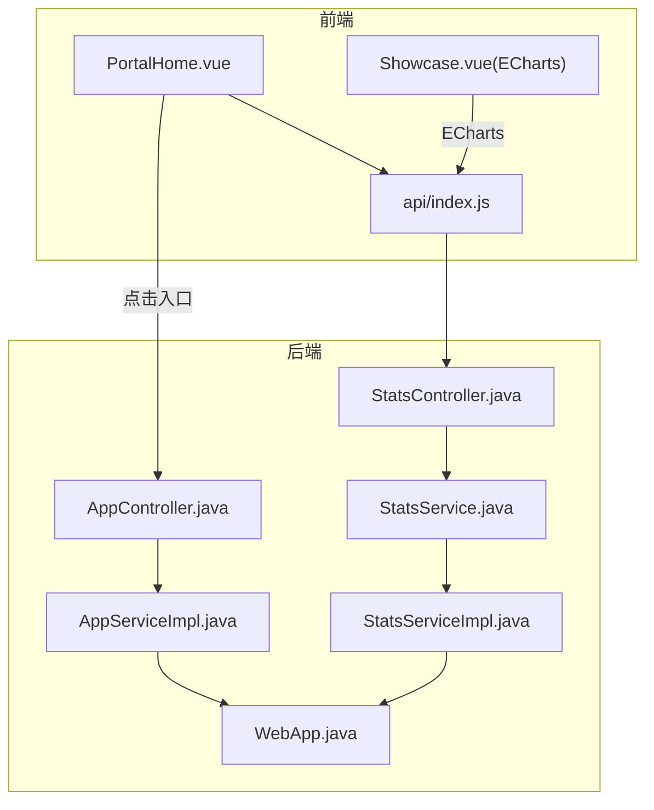
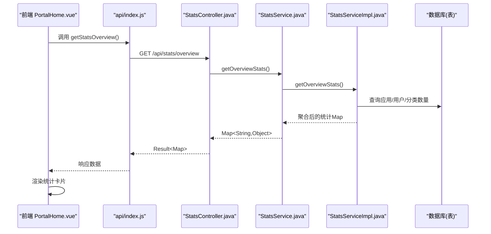
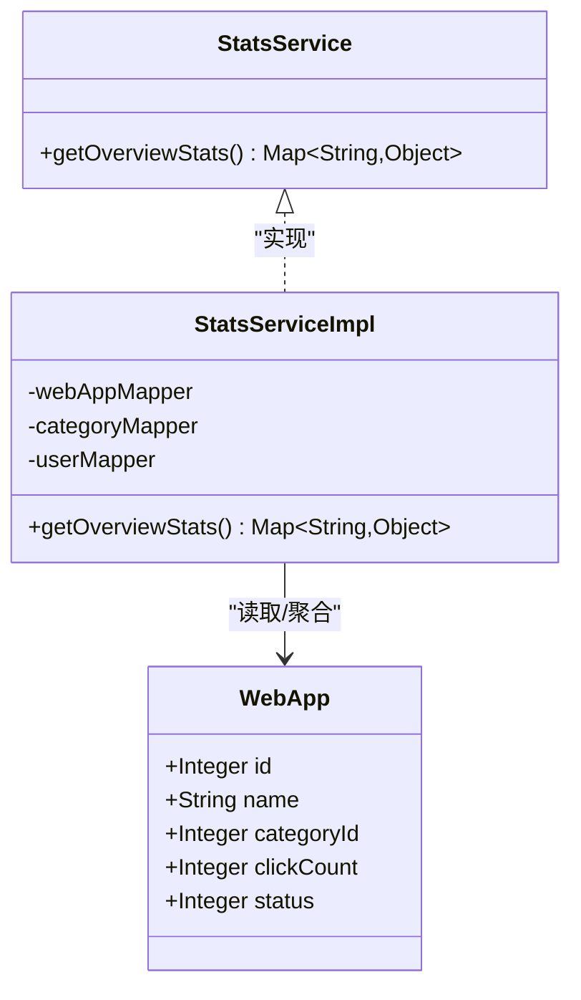
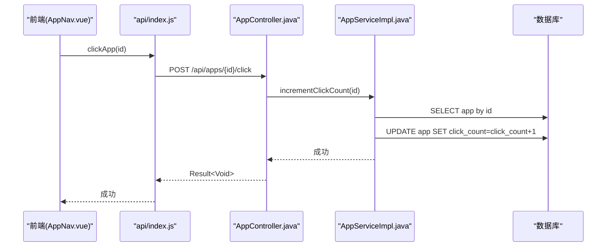
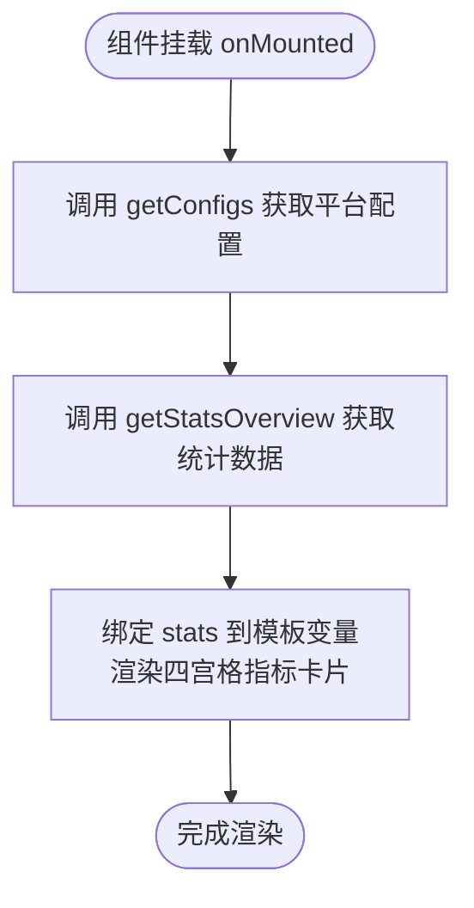
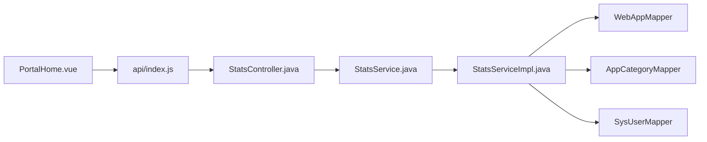

# 数据统计分析模块

<cite>
**本文引用的文件**   
- [StatsService.java](file://backend/src/main/java/com/xx/platform/service/StatsService.java)
- [StatsServiceImpl.java](file://backend/src/main/java/com/xx/platform/service/impl/StatsServiceImpl.java)
- [StatsController.java](file://backend/src/main/java/com/xx/platform/controller/StatsController.java)
- [AppController.java](file://backend/src/main/java/com/xx/platform/controller/AppController.java)
- [AppServiceImpl.java](file://backend/src/main/java/com/xx/platform/service/impl/AppServiceImpl.java)
- [WebApp.java](file://backend/src/main/java/com/xx/platform/entity/WebApp.java)
- [PortalHome.vue](file://frontend/src/views/PortalHome.vue)
- [index.js](file://frontend/src/api/index.js)
- [Showcase.vue](file://frontend/src/views/Showcase.vue)
</cite>

## 目录
1. [简介](#简介)
2. [项目结构](#项目结构)
3. [核心组件](#核心组件)
4. [架构总览](#架构总览)
5. [详细组件分析](#详细组件分析)
6. [依赖关系分析](#依赖关系分析)
7. [性能与优化](#性能与优化)
8. [故障排查指南](#故障排查指南)
9. [结论](#结论)
10. [附录](#附录)

## 简介
本模块聚焦“数据统计分析”，围绕应用访问量统计、用户行为分析与可视化报表生成展开。后端通过 StatsService 聚合平台级统计数据（收录应用数、总点击量、用户数、分类数、热门应用等），前端 PortalHome 组件负责在首页展示关键指标，并在其他页面结合 ECharts 进行数据可视化。文档将深入解析数据聚合逻辑、访问计数策略、多维度统计能力、缓存与性能优化建议，以及前端图表集成与交互效果。

## 项目结构
该模块涉及前后端协同：
- 后端提供 /api/stats/overview 接口，返回平台概览统计数据；同时提供 /api/apps/{id}/click 用于记录点击行为。
- 前端在 PortalHome 中调用统计接口并渲染关键指标卡片；在其他页面使用 ECharts 展示维度分布等可视化内容。

图示来源
- [StatsController.java:1-32](file://backend/src/main/java/com/xx/platform/controller/StatsController.java#L1-L32)
- [StatsService.java:1-16](file://backend/src/main/java/com/xx/platform/service/StatsService.java#L1-L16)
- [StatsServiceImpl.java:1-73](file://backend/src/main/java/com/xx/platform/service/impl/StatsServiceImpl.java#L1-L73)
- [AppController.java:1-111](file://backend/src/main/java/com/xx/platform/controller/AppController.java#L1-L111)
- [AppServiceImpl.java:75-104](file://backend/src/main/java/com/xx/platform/service/impl/AppServiceImpl.java#L75-L104)
- [WebApp.java:1-54](file://backend/src/main/java/com/xx/platform/entity/WebApp.java#L1-L54)
- [PortalHome.vue:1-287](file://frontend/src/views/PortalHome.vue#L1-L287)
- [index.js:133-137](file://frontend/src/api/index.js#L133-L137)
- [Showcase.vue:45-92](file://frontend/src/views/Showcase.vue#L45-L92)

章节来源
- [StatsController.java:1-32](file://backend/src/main/java/com/xx/platform/controller/StatsController.java#L1-L32)
- [StatsService.java:1-16](file://backend/src/main/java/com/xx/platform/service/StatsService.java#L1-L16)
- [StatsServiceImpl.java:1-73](file://backend/src/main/java/com/xx/platform/service/impl/StatsServiceImpl.java#L1-L73)
- [AppController.java:1-111](file://backend/src/main/java/com/xx/platform/controller/AppController.java#L1-L111)
- [AppServiceImpl.java:75-104](file://backend/src/main/java/com/xx/platform/service/impl/AppServiceImpl.java#L75-L104)
- [WebApp.java:1-54](file://backend/src/main/java/com/xx/platform/entity/WebApp.java#L1-L54)
- [PortalHome.vue:1-287](file://frontend/src/views/PortalHome.vue#L1-L287)
- [index.js:133-137](file://frontend/src/api/index.js#L133-L137)
- [Showcase.vue:45-92](file://frontend/src/views/Showcase.vue#L45-L92)

## 核心组件
- 统计服务接口与实现：定义并实现平台概览统计的聚合逻辑，包括应用总数、总点击量、用户数、分类数、分类维度统计、热门应用 TOP5。
- 统计控制器：暴露 REST 接口 /api/stats/overview，统一返回 Result 包装结果。
- 应用点击记录：提供 /api/apps/{id}/click 接口，由 AppService 实现点击计数自增。
- 前端门户首页：PortalHome 在挂载时拉取配置与统计数据，并以卡片形式展示关键指标。
- 可视化示例：Showcase 页面使用 ECharts 展示各维度数据量分布。

章节来源
- [StatsService.java:1-16](file://backend/src/main/java/com/xx/platform/service/StatsService.java#L1-L16)
- [StatsServiceImpl.java:32-71](file://backend/src/main/java/com/xx/platform/service/impl/StatsServiceImpl.java#L32-L71)
- [StatsController.java:23-31](file://backend/src/main/java/com/xx/platform/controller/StatsController.java#L23-L31)
- [AppController.java:88-96](file://backend/src/main/java/com/xx/platform/controller/AppController.java#L88-L96)
- [AppServiceImpl.java:95-103](file://backend/src/main/java/com/xx/platform/service/impl/AppServiceImpl.java#L95-L103)
- [PortalHome.vue:102-122](file://frontend/src/views/PortalHome.vue#L102-L122)
- [Showcase.vue:77-92](file://frontend/src/views/Showcase.vue#L77-L92)

## 架构总览
下图展示了从前端到后端的完整请求链路，涵盖统计概览与应用点击两个关键流程。

图示来源
- [PortalHome.vue:102-122](file://frontend/src/views/PortalHome.vue#L102-L122)
- [index.js:133-137](file://frontend/src/api/index.js#L133-L137)
- [StatsController.java:23-31](file://backend/src/main/java/com/xx/platform/controller/StatsController.java#L23-L31)
- [StatsService.java:10-15](file://backend/src/main/java/com/xx/platform/service/StatsService.java#L10-L15)
- [StatsServiceImpl.java:32-71](file://backend/src/main/java/com/xx/platform/service/impl/StatsServiceImpl.java#L32-L71)

## 详细组件分析

### 统计服务 StatsService 与实现 StatsServiceImpl
- 职责边界
  - 接口层仅暴露概览统计方法，屏蔽内部聚合细节。
  - 实现层负责多表聚合：应用总数、总点击量、用户数、分类数、分类维度统计、热门应用 TOP5。
- 数据聚合逻辑
  - 应用总数：直接 count 查询。
  - 总点击量：加载所有应用实体，对 clickCount 字段求和。
  - 用户数：用户表 count 查询。
  - 分类数：分类表 count 查询。
  - 分类维度统计：遍历应用列表，按 categoryId 分组计数，缺失分类归入“未分类”。
  - 热门应用 TOP5：筛选启用状态并按点击量降序取前5条。
- 复杂度与性能
  - 当前实现存在全表扫描与内存聚合（如 totalClicks 与 categoryStats），在数据规模增长时可能成为瓶颈。
  - 建议后续引入 SQL 聚合或缓存机制以降低开销。

图示来源
- [StatsService.java:1-16](file://backend/src/main/java/com/xx/platform/service/StatsService.java#L1-L16)
- [StatsServiceImpl.java:1-73](file://backend/src/main/java/com/xx/platform/service/impl/StatsServiceImpl.java#L1-L73)
- [WebApp.java:1-54](file://backend/src/main/java/com/xx/platform/entity/WebApp.java#L1-L54)

章节来源
- [StatsService.java:1-16](file://backend/src/main/java/com/xx/platform/service/StatsService.java#L1-L16)
- [StatsServiceImpl.java:32-71](file://backend/src/main/java/com/xx/platform/service/impl/StatsServiceImpl.java#L32-L71)
- [WebApp.java:1-54](file://backend/src/main/java/com/xx/platform/entity/WebApp.java#L1-L54)

### 访问计数与用户行为采集
- 触发点
  - 用户在应用导航页点击应用卡片时，前端调用 clickApp(id) 发起 POST /api/apps/{id}/click。
- 后端处理
  - AppController 接收点击请求，委托 AppService.incrementClickCount(id)。
  - AppServiceImpl 读取应用实体，将 clickCount 自增并持久化更新。
- 数据一致性
  - 采用读-改-写模式，存在并发下丢失更新的潜在风险；在高并发场景可考虑原子递增或队列异步落库。

图示来源
- [index.js:63-66](file://frontend/src/api/index.js#L63-L66)
- [AppController.java:88-96](file://backend/src/main/java/com/xx/platform/controller/AppController.java#L88-L96)
- [AppServiceImpl.java:95-103](file://backend/src/main/java/com/xx/platform/service/impl/AppServiceImpl.java#L95-L103)

章节来源
- [AppController.java:88-96](file://backend/src/main/java/com/xx/platform/controller/AppController.java#L88-L96)
- [AppServiceImpl.java:95-103](file://backend/src/main/java/com/xx/platform/service/impl/AppServiceImpl.java#L95-L103)
- [index.js:63-66](file://frontend/src/api/index.js#L63-L66)

### 前端 PortalHome 图表与指标展示
- 数据绑定
  - 页面挂载时调用 getConfigs 与 getStatsOverview，分别获取平台配置与统计数据。
  - 将 stats.appCount、stats.totalClicks、stats.categoryCount、stats.userCount 渲染为四宫格指标卡片。
- 交互与体验
  - 若接口失败，控制台输出错误日志，不影响页面基础结构。
  - 指标数值具备默认值兜底，避免空值导致显示异常。
- 可视化扩展
  - 当前首页以数字卡片为主；如需更丰富的图表，可在该组件内引入 ECharts 并基于 categoryStats/topApps 绘制饼图/柱状图。

图示来源
- [PortalHome.vue:102-122](file://frontend/src/views/PortalHome.vue#L102-L122)
- [index.js:133-137](file://frontend/src/api/index.js#L133-L137)

章节来源
- [PortalHome.vue:102-122](file://frontend/src/views/PortalHome.vue#L102-L122)
- [index.js:133-137](file://frontend/src/api/index.js#L133-L137)

### 可视化报表与 ECharts 集成（示例）
- Showcase 页面演示了 ECharts 的使用方式：初始化图表实例，并行请求各维度数据，计算数量后 setOption 渲染。
- 该模式可直接复用到统计分析模块，例如用 categoryStats 绘制分类占比饼图，或用 topApps 绘制热门应用柱状图。

章节来源
- [Showcase.vue:77-92](file://frontend/src/views/Showcase.vue#L77-L92)

## 依赖关系分析
- 控制器与服务解耦：StatsController 仅做路由与参数校验，业务聚合集中在 StatsServiceImpl。
- 数据源依赖：StatsServiceImpl 依赖多个 Mapper（应用、分类、用户），形成多表聚合。
- 前端依赖：PortalHome 依赖 api/index.js 中的封装函数，间接依赖后端控制器。

图示来源
- [PortalHome.vue:102-122](file://frontend/src/views/PortalHome.vue#L102-L122)
- [index.js:133-137](file://frontend/src/api/index.js#L133-L137)
- [StatsController.java:1-32](file://backend/src/main/java/com/xx/platform/controller/StatsController.java#L1-L32)
- [StatsService.java:1-16](file://backend/src/main/java/com/xx/platform/service/StatsService.java#L1-L16)
- [StatsServiceImpl.java:1-73](file://backend/src/main/java/com/xx/platform/service/impl/StatsServiceImpl.java#L1-L73)

章节来源
- [StatsServiceImpl.java:1-73](file://backend/src/main/java/com/xx/platform/service/impl/StatsServiceImpl.java#L1-L73)
- [StatsController.java:1-32](file://backend/src/main/java/com/xx/platform/controller/StatsController.java#L1-L32)
- [PortalHome.vue:102-122](file://frontend/src/views/PortalHome.vue#L102-L122)
- [index.js:133-137](file://frontend/src/api/index.js#L133-L137)

## 性能与优化
- 当前瓶颈
  - 总点击量与分类维度统计采用全表扫描与内存聚合，数据量大时将产生较高 CPU 与 IO 压力。
  - 热门应用 TOP5 虽有限制，但排序与过滤仍依赖全表扫描。
- 优化建议
  - SQL 聚合：使用 SUM(click_count)、GROUP BY category_id 等聚合查询替代内存计算。
  - 索引优化：为 click_count、status、category_id 建立合适索引，提升排序与过滤效率。
  - 缓存策略：对概览统计结果引入短期缓存（如本地缓存或 Redis），设置合理过期时间，降低重复查询压力。
  - 增量更新：点击计数可采用异步队列或原子操作（如 INCR）减少锁竞争与丢失更新风险。
  - 分页与裁剪：仅在必要时返回 topApps 的摘要字段，减少网络传输。
- 前端侧优化
  - 对统计接口增加请求去抖与重试机制，避免频繁刷新造成抖动。
  - 按需懒加载图表，首屏优先渲染数字指标，图表在用户交互后再初始化。

[本节为通用指导，不直接分析具体文件]

## 故障排查指南
- 统计接口无数据或数据异常
  - 检查后端是否成功执行 count 与 selectList 查询，确认 Mapper 映射正确。
  - 核对 WebApp.clickCount 是否为 null 的处理逻辑，确保求和时不会抛异常。
- 点击计数不生效
  - 确认前端是否正确调用 clickApp(id)，且后端 /api/apps/{id}/click 未被拦截。
  - 检查 AppServiceImpl 的自增逻辑是否被事务回滚或异常中断。
- 前端渲染空白
  - 查看浏览器控制台是否有接口报错；确认 getStatsOverview 返回值结构与模板字段一致。
  - 为指标数值提供默认值，避免空指针导致的渲染问题。

章节来源
- [StatsServiceImpl.java:32-71](file://backend/src/main/java/com/xx/platform/service/impl/StatsServiceImpl.java#L32-L71)
- [AppServiceImpl.java:95-103](file://backend/src/main/java/com/xx/platform/service/impl/AppServiceImpl.java#L95-L103)
- [PortalHome.vue:102-122](file://frontend/src/views/PortalHome.vue#L102-L122)

## 结论
本模块实现了平台级统计概览与基础的用户行为采集（点击计数）。后端 StatsService 提供了清晰的数据聚合入口，前端 PortalHome 完成了关键指标的可视化呈现。为进一步提升准确性与性能，建议在 SQL 聚合、索引设计、缓存策略与并发安全方面持续优化，并将 ECharts 图表能力扩展到更多统计维度，以满足更丰富的报表定制需求。

[本节为总结性内容，不直接分析具体文件]

## 附录
- 业务价值
  - 帮助管理者快速掌握平台规模（应用数、用户数、分类数）与热度（总点击量、热门应用）。
  - 为产品运营提供决策依据，识别高价值应用与低活跃分类，指导资源倾斜与推广策略。
- 数据准确性保证
  - 统一入口记录点击，避免分散埋点导致遗漏。
  - 对 clickCount 的自增逻辑进行健壮性处理，防止空值与并发冲突。
- 报表定制方案
  - 在现有 categoryStats 与 topApps 基础上，扩展时间维度（日/周/月）与来源维度（渠道/设备）。
  - 前端复用 Showcase 的 ECharts 模式，新增分类占比、趋势折线、热力图等图表类型。

[本节为概念性内容，不直接分析具体文件]