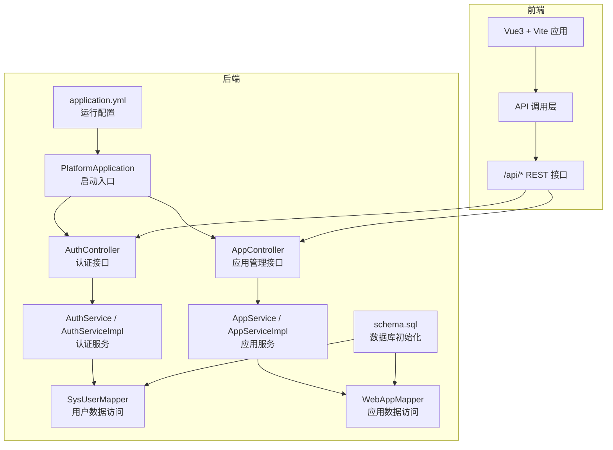
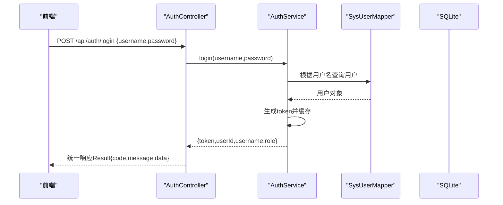
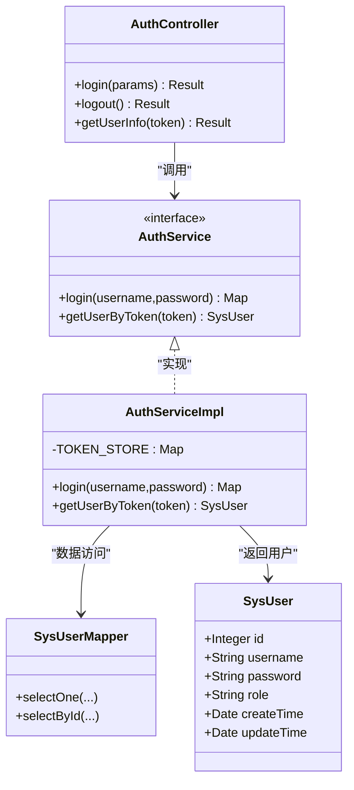
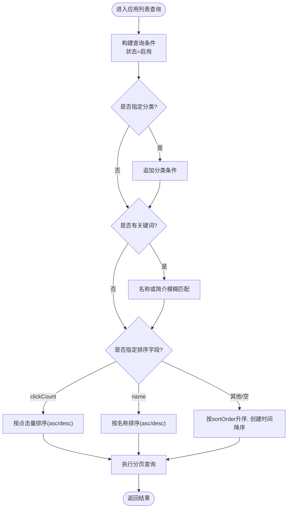
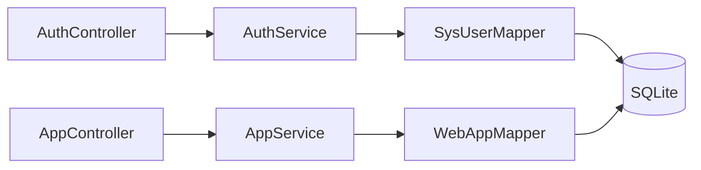

# 核心功能模块

<cite>
**本文引用的文件**
- [PlatformApplication.java](file://backend/src/main/java/com/xx/platform/PlatformApplication.java)
- [application.yml](file://backend/src/main/resources/application.yml)
- [schema.sql](file://backend/src/main/resources/schema.sql)
- [API.md](file://API.md)
- [AuthController.java](file://backend/src/main/java/com/xx/platform/controller/AuthController.java)
- [AuthService.java](file://backend/src/main/java/com/xx/platform/service/AuthService.java)
- [AuthServiceImpl.java](file://backend/src/main/java/com/xx/platform/service/impl/AuthServiceImpl.java)
- [SysUser.java](file://backend/src/main/java/com/xx/platform/entity/SysUser.java)
- [SysUserMapper.java](file://backend/src/main/java/com/xx/platform/mapper/SysUserMapper.java)
- [AppController.java](file://backend/src/main/java/com/xx/platform/controller/AppController.java)
- [AppService.java](file://backend/src/main/java/com/xx/platform/service/AppService.java)
- [AppServiceImpl.java](file://backend/src/main/java/com/xx/platform/service/impl/AppServiceImpl.java)
- [WebApp.java](file://backend/src/main/java/com/xx/platform/entity/WebApp.java)
- [WebAppMapper.java](file://backend/src/main/java/com/xx/platform/mapper/WebAppMapper.java)
</cite>

## 目录
1. [简介](#简介)
2. [项目结构](#项目结构)
3. [核心组件](#核心组件)
4. [架构总览](#架构总览)
5. [详细组件分析](#详细组件分析)
6. [依赖关系分析](#依赖关系分析)
7. [性能考虑](#性能考虑)
8. [故障排查指南](#故障排查指南)
9. [结论](#结论)
10. [附录](#附录)

## 简介
本文件面向JZPlatform门户系统的核心功能模块，聚焦以下能力：用户认证与授权、应用导航管理、产品宣贯展示、管理后台系统、数据统计分析。文档从业务逻辑、实现细节、接口设计、数据流转、模块依赖与协作模式、扩展点、使用示例与配置选项、错误处理策略与性能优化建议等维度进行系统化说明，帮助读者快速理解并高效扩展平台能力。

## 项目结构
后端采用Spring Boot分层架构（Controller-Service-Mapper-Entity），前端基于Vue3+Vite构建，前后端通过REST API交互。数据库为SQLite，提供初始化脚本与默认数据。

图表来源
- [PlatformApplication.java:1-16](file://backend/src/main/java/com/xx/platform/PlatformApplication.java#L1-L16)
- [application.yml:1-29](file://backend/src/main/resources/application.yml#L1-L29)
- [schema.sql:1-80](file://backend/src/main/resources/schema.sql#L1-L80)
- [AuthController.java:1-68](file://backend/src/main/java/com/xx/platform/controller/AuthController.java#L1-L68)
- [AppController.java:1-111](file://backend/src/main/java/com/xx/platform/controller/AppController.java#L1-L111)

章节来源
- [PlatformApplication.java:1-16](file://backend/src/main/java/com/xx/platform/PlatformApplication.java#L1-L16)
- [application.yml:1-29](file://backend/src/main/resources/application.yml#L1-L29)
- [schema.sql:1-80](file://backend/src/main/resources/schema.sql#L1-L80)

## 核心组件
- 认证与授权
  - 控制器：登录、登出、获取当前用户信息
  - 服务：基于内存Token的简单鉴权（适合内部系统）
  - 实体与映射：用户表与MyBatis-Plus Mapper
- 应用导航管理
  - 控制器：应用列表（分页/筛选/排序）、详情、点击记录；管理员新增/编辑/删除
  - 服务：查询条件组装、状态过滤、排序策略、点击计数更新
  - 实体与映射：应用表与Mapper
- 产品宣贯展示
  - 控制器与服务：宣贯项CRUD与分类查询（详见API文档）
  - 实体与映射：宣贯项表与Mapper
- 管理后台系统
  - 控制器与服务：用户管理、分类管理、配置管理、上传等（详见API文档）
- 数据统计分析
  - 控制器与服务：总览统计（应用数、点击总量、用户数、分类分布、热门应用等）

章节来源
- [AuthController.java:1-68](file://backend/src/main/java/com/xx/platform/controller/AuthController.java#L1-L68)
- [AuthService.java:1-27](file://backend/src/main/java/com/xx/platform/service/AuthService.java#L1-L27)
- [AuthServiceImpl.java:1-62](file://backend/src/main/java/com/xx/platform/service/impl/AuthServiceImpl.java#L1-L62)
- [SysUser.java:1-33](file://backend/src/main/java/com/xx/platform/entity/SysUser.java#L1-L33)
- [SysUserMapper.java:1-13](file://backend/src/main/java/com/xx/platform/mapper/SysUserMapper.java#L1-L13)
- [AppController.java:1-111](file://backend/src/main/java/com/xx/platform/controller/AppController.java#L1-L111)
- [AppService.java:1-47](file://backend/src/main/java/com/xx/platform/service/AppService.java#L1-L47)
- [AppServiceImpl.java:1-105](file://backend/src/main/java/com/xx/platform/service/impl/AppServiceImpl.java#L1-L105)
- [WebApp.java:1-54](file://backend/src/main/java/com/xx/platform/entity/WebApp.java#L1-L54)
- [WebAppMapper.java:1-13](file://backend/src/main/java/com/xx/platform/mapper/WebAppMapper.java#L1-L13)
- [API.md:1-197](file://API.md#L1-L197)

## 架构总览
整体采用前后端分离架构：前端通过HTTP请求访问后端REST API，后端按“控制器-服务-数据访问”分层组织，使用MyBatis-Plus操作SQLite数据库。认证采用无状态Token机制，权限校验在控制器层完成。

图表来源
- [AuthController.java:28-37](file://backend/src/main/java/com/xx/platform/controller/AuthController.java#L28-L37)
- [AuthServiceImpl.java:29-51](file://backend/src/main/java/com/xx/platform/service/impl/AuthServiceImpl.java#L29-L51)
- [SysUserMapper.java:1-13](file://backend/src/main/java/com/xx/platform/mapper/SysUserMapper.java#L1-L13)
- [schema.sql:5-12](file://backend/src/main/resources/schema.sql#L5-L12)

## 详细组件分析

### 认证与授权模块
- 业务逻辑
  - 登录：校验用户名密码，成功后生成唯一Token并建立Token到用户ID的映射，返回Token与基础用户信息
  - 获取当前用户：依据请求头中的Authorization解析Token，反查用户信息并过滤敏感字段
  - 登出：客户端清除本地Token即可，服务端无需额外清理
- 关键实现要点
  - Token存储：内存Map（ConcurrentHashMap），适合单机或内部系统；生产环境建议替换为Redis
  - 权限控制：在需要管理员操作的接口中，校验Token对应角色是否为ADMIN
- 接口设计
  - 登录：POST /api/auth/login
  - 登出：POST /api/auth/logout
  - 当前用户：GET /api/auth/info
- 数据模型
  - 用户实体包含id、username、password、role、createTime、updateTime
- 错误处理
  - 参数缺失、用户名或密码错误、未登录、登录过期均返回统一错误码与消息

图表来源
- [AuthController.java:1-68](file://backend/src/main/java/com/xx/platform/controller/AuthController.java#L1-L68)
- [AuthService.java:1-27](file://backend/src/main/java/com/xx/platform/service/AuthService.java#L1-L27)
- [AuthServiceImpl.java:1-62](file://backend/src/main/java/com/xx/platform/service/impl/AuthServiceImpl.java#L1-L62)
- [SysUser.java:1-33](file://backend/src/main/java/com/xx/platform/entity/SysUser.java#L1-L33)
- [SysUserMapper.java:1-13](file://backend/src/main/java/com/xx/platform/mapper/SysUserMapper.java#L1-L13)

章节来源
- [AuthController.java:1-68](file://backend/src/main/java/com/xx/platform/controller/AuthController.java#L1-L68)
- [AuthServiceImpl.java:1-62](file://backend/src/main/java/com/xx/platform/service/impl/AuthServiceImpl.java#L1-L62)
- [SysUser.java:1-33](file://backend/src/main/java/com/xx/platform/entity/SysUser.java#L1-L33)
- [SysUserMapper.java:1-13](file://backend/src/main/java/com/xx/platform/mapper/SysUserMapper.java#L1-L13)
- [API.md:9-24](file://API.md#L9-L24)

### 应用导航管理模块
- 业务逻辑
  - 公开接口：应用列表（支持分页、分类筛选、关键词搜索、排序）、应用详情、点击记录
  - 管理员接口：新增、编辑、删除应用
- 查询与排序
  - 仅返回启用状态的应用
  - 支持按clickCount或name排序，默认排序为sortOrder升序、创建时间降序
- 点击计数
  - 每次点击将应用clickCount加一并更新时间戳
- 权限控制
  - 增删改需携带有效Token且角色为ADMIN
- 接口设计
  - 列表：GET /api/apps?page=1&size=12&categoryId=&keyword=&sortField=&sortOrder=
  - 详情：GET /api/apps/{id}
  - 新增：POST /api/apps
  - 编辑：PUT /api/apps/{id}
  - 删除：DELETE /api/apps/{id}
  - 点击：POST /api/apps/{id}/click

图表来源
- [AppServiceImpl.java:24-62](file://backend/src/main/java/com/xx/platform/service/impl/AppServiceImpl.java#L24-L62)

章节来源
- [AppController.java:1-111](file://backend/src/main/java/com/xx/platform/controller/AppController.java#L1-L111)
- [AppService.java:1-47](file://backend/src/main/java/com/xx/platform/service/AppService.java#L1-L47)
- [AppServiceImpl.java:1-105](file://backend/src/main/java/com/xx/platform/service/impl/AppServiceImpl.java#L1-L105)
- [WebApp.java:1-54](file://backend/src/main/java/com/xx/platform/entity/WebApp.java#L1-L54)
- [WebAppMapper.java:1-13](file://backend/src/main/java/com/xx/platform/mapper/WebAppMapper.java#L1-L13)
- [API.md:46-86](file://API.md#L46-L86)

### 产品宣贯展示模块
- 业务逻辑
  - 提供宣贯项的分类列表与详情查询
  - 管理员可新增、编辑、删除宣贯项
- 分类枚举
  - USER_ECOLOGY、PRODUCT_SYSTEM、MODEL_SYSTEM、DATA_SYSTEM、IP
- 接口设计
  - 列表：GET /api/showcase?category=...
  - 详情：GET /api/showcase/{id}
  - 新增：POST /api/showcase
  - 编辑：PUT /api/showcase/{id}
  - 删除：DELETE /api/showcase/{id}

章节来源
- [API.md:106-133](file://API.md#L106-L133)
- [schema.sql:39-49](file://backend/src/main/resources/schema.sql#L39-L49)

### 管理后台系统
- 用户管理
  - 列表、新增、编辑、删除（仅管理员）
- 应用分类管理
  - 列表、新增、编辑、删除（仅管理员）
- 平台配置
  - 获取所有配置、批量更新配置、上传文件（Logo/背景图）
- 接口设计
  - 用户：/api/users
  - 分类：/api/categories
  - 配置：/api/config、/api/config/upload

章节来源
- [API.md:27-151](file://API.md#L27-L151)
- [schema.sql:52-66](file://backend/src/main/resources/schema.sql#L52-L66)

### 数据统计分析模块
- 总览统计
  - 应用总数、总点击量、用户数、分类数、各分类应用数量、热门应用TopN
- 接口设计
  - GET /api/stats/overview

章节来源
- [API.md:154-169](file://API.md#L154-L169)

## 依赖关系分析
- 控制器依赖服务，服务依赖Mapper，Mapper依赖数据库
- 认证模块依赖用户表与应用模块共享AuthService用于权限校验
- 应用模块依赖应用表与分类表（分类由独立接口维护）
- 配置与上传由配置模块负责，供前端展示与后台设置

图表来源
- [AuthController.java:1-68](file://backend/src/main/java/com/xx/platform/controller/AuthController.java#L1-L68)
- [AppController.java:1-111](file://backend/src/main/java/com/xx/platform/controller/AppController.java#L1-L111)
- [SysUserMapper.java:1-13](file://backend/src/main/java/com/xx/platform/mapper/SysUserMapper.java#L1-L13)
- [WebAppMapper.java:1-13](file://backend/src/main/java/com/xx/platform/mapper/WebAppMapper.java#L1-L13)

章节来源
- [AuthController.java:1-68](file://backend/src/main/java/com/xx/platform/controller/AuthController.java#L1-L68)
- [AppController.java:1-111](file://backend/src/main/java/com/xx/platform/controller/AppController.java#L1-L111)
- [SysUserMapper.java:1-13](file://backend/src/main/java/com/xx/platform/mapper/SysUserMapper.java#L1-L13)
- [WebAppMapper.java:1-13](file://backend/src/main/java/com/xx/platform/mapper/WebAppMapper.java#L1-L13)

## 性能考虑
- 认证Token存储
  - 当前使用内存Map，适合单机；高并发或多实例部署应迁移至Redis，避免重启丢失与跨节点不一致
- 查询优化
  - 列表查询已内置分页与动态条件，建议在高频字段上建立索引（如web_app.status、web_app.category_id、web_app.click_count）
- 点击计数
  - 当前逐条读取后更新，存在竞争与重复读问题；可改为原子增量更新（例如自增SQL）以减少往返与锁竞争
- 文件上传
  - 限制最大文件大小，建议结合对象存储（如S3/OSS）与CDN加速静态资源访问
- 日志与监控
  - 开启慢查询日志与接口耗时埋点，便于定位瓶颈

## 故障排查指南
- 常见错误
  - 未登录或登录过期：检查请求头Authorization是否正确携带
  - 用户名或密码错误：确认账号是否存在且密码正确
  - 无管理员权限：确认当前用户角色为ADMIN
- 定位步骤
  - 查看统一响应格式与错误码，确认具体message
  - 核对数据库初始化脚本是否执行成功（默认管理员账户与初始配置）
  - 检查端口与跨域配置（前端代理与后端端口）
- 参考路径
  - 统一响应封装与全局异常处理位置
  - 认证流程与权限校验位置
  - 应用列表查询条件与排序逻辑

章节来源
- [AuthController.java:28-66](file://backend/src/main/java/com/xx/platform/controller/AuthController.java#L28-L66)
- [AppController.java:98-109](file://backend/src/main/java/com/xx/platform/controller/AppController.java#L98-L109)
- [schema.sql:59-66](file://backend/src/main/resources/schema.sql#L59-L66)

## 结论
JZPlatform门户系统以清晰的分层架构实现了认证授权、应用导航、宣贯展示、后台管理与统计分析等核心能力。当前实现简洁易用，适合内部系统快速落地；在生产环境中建议对认证存储、点击计数、索引与静态资源等进行针对性优化，以提升稳定性与性能。

## 附录
- 启动与运行
  - 后端：mvn spring-boot:run，默认监听8080端口
  - 前端：npm install && npm run dev，默认5173端口，/api自动转发至后端
- 默认账户
  - 用户名：admin，密码：admin123，角色：ADMIN
- 配置项
  - 数据库：SQLite路径、驱动类名
  - 上传：最大文件大小、上传根路径
  - MyBatis-Plus：驼峰映射、日志输出、主键策略

章节来源
- [application.yml:1-29](file://backend/src/main/resources/application.yml#L1-L29)
- [API.md:180-197](file://API.md#L180-L197)
- [schema.sql:59-66](file://backend/src/main/resources/schema.sql#L59-L66)