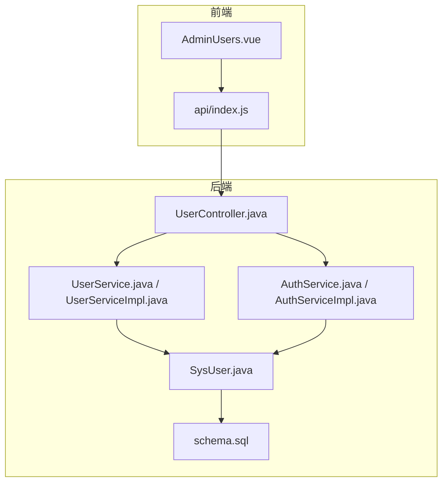
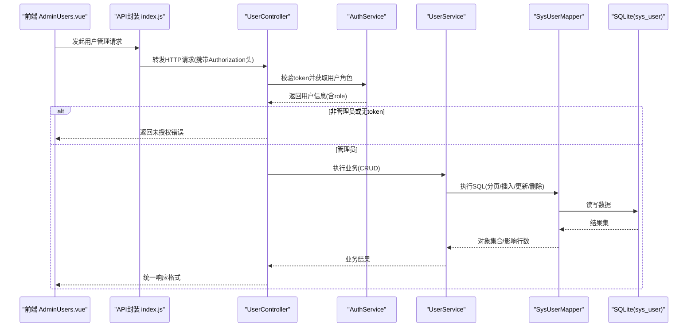
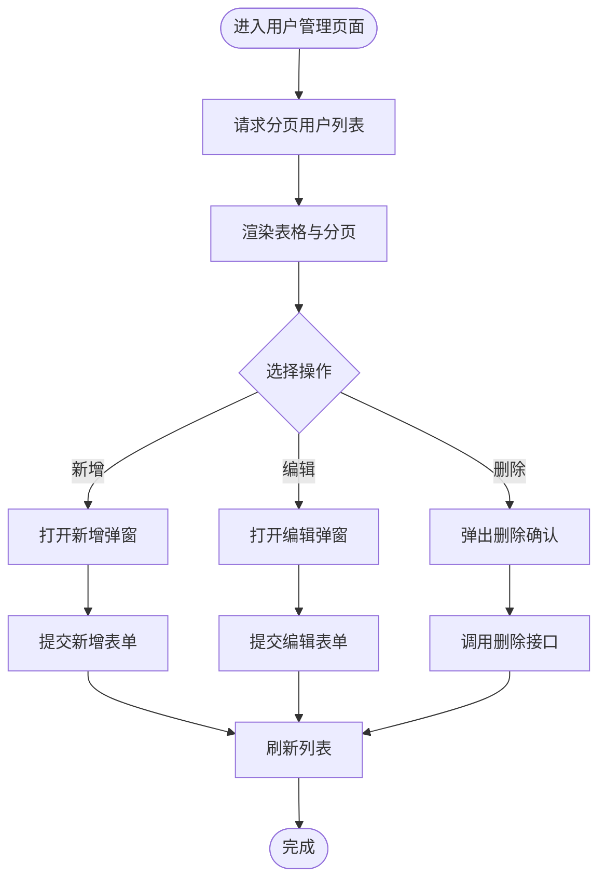
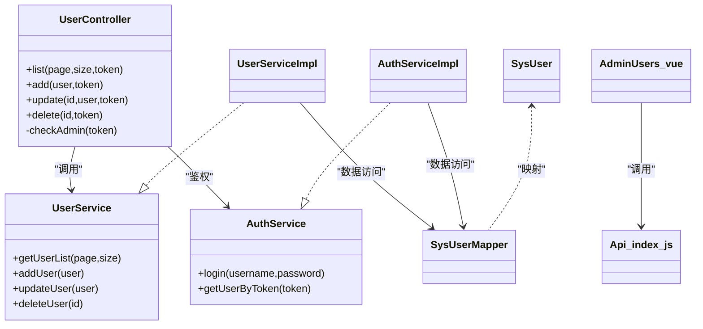

# 用户管理模块

<cite>
**本文引用的文件**   
- [SysUser.java](file://backend/src/main/java/com/xx/platform/entity/SysUser.java)
- [UserService.java](file://backend/src/main/java/com/xx/platform/service/UserService.java)
- [UserServiceImpl.java](file://backend/src/main/java/com/xx/platform/service/impl/UserServiceImpl.java)
- [UserController.java](file://backend/src/main/java/com/xx/platform/controller/UserController.java)
- [AuthService.java](file://backend/src/main/java/com/xx/platform/service/AuthService.java)
- [AuthServiceImpl.java](file://backend/src/main/java/com/xx/platform/service/impl/AuthServiceImpl.java)
- [schema.sql](file://backend/src/main/resources/schema.sql)
- [AdminUsers.vue](file://frontend/src/views/admin/AdminUsers.vue)
- [index.js](file://frontend/src/api/index.js)
</cite>

## 目录
1. [简介](#简介)
2. [项目结构](#项目结构)
3. [核心组件](#核心组件)
4. [架构总览](#架构总览)
5. [详细组件分析](#详细组件分析)
6. [依赖关系分析](#依赖关系分析)
7. [性能考虑](#性能考虑)
8. [故障排查指南](#故障排查指南)
9. [结论](#结论)
10. [附录](#附录)

## 简介
本模块聚焦于“用户管理”能力，面向管理员提供对系统用户的增删改查、角色分配与基础权限控制。当前实现采用简单角色模型（ADMIN/USER），通过令牌校验进行接口级鉴权；前端提供用户列表、新增/编辑、删除等管理能力。后续可扩展密码加密、状态字段、批量操作、审计日志与更细粒度权限体系。

## 项目结构
后端采用分层架构：控制器层暴露REST接口，服务层封装业务逻辑，数据访问层基于MyBatis-Plus；实体映射数据库表；认证服务负责登录与令牌解析。前端使用Vue + Element Plus构建管理界面，并通过统一API封装调用后端接口。

图表来源
- [UserController.java:1-88](file://backend/src/main/java/com/xx/platform/controller/UserController.java#L1-L88)
- [UserService.java:1-31](file://backend/src/main/java/com/xx/platform/service/UserService.java#L1-L31)
- [UserServiceImpl.java:1-53](file://backend/src/main/java/com/xx/platform/service/impl/UserServiceImpl.java#L1-L53)
- [AuthService.java:1-27](file://backend/src/main/java/com/xx/platform/service/AuthService.java#L1-L27)
- [AuthServiceImpl.java:1-62](file://backend/src/main/java/com/xx/platform/service/impl/AuthServiceImpl.java#L1-L62)
- [SysUser.java:1-33](file://backend/src/main/java/com/xx/platform/entity/SysUser.java#L1-L33)
- [schema.sql:1-80](file://backend/src/main/resources/schema.sql#L1-L80)
- [AdminUsers.vue:1-128](file://frontend/src/views/admin/AdminUsers.vue#L1-L128)
- [index.js:1-137](file://frontend/src/api/index.js#L1-L137)

章节来源
- [UserController.java:1-88](file://backend/src/main/java/com/xx/platform/controller/UserController.java#L1-L88)
- [UserService.java:1-31](file://backend/src/main/java/com/xx/platform/service/UserService.java#L1-L31)
- [UserServiceImpl.java:1-53](file://backend/src/main/java/com/xx/platform/service/impl/UserServiceImpl.java#L1-L53)
- [AuthService.java:1-27](file://backend/src/main/java/com/xx/platform/service/AuthService.java#L1-L27)
- [AuthServiceImpl.java:1-62](file://backend/src/main/java/com/xx/platform/service/impl/AuthServiceImpl.java#L1-L62)
- [SysUser.java:1-33](file://backend/src/main/java/com/xx/platform/entity/SysUser.java#L1-L33)
- [schema.sql:1-80](file://backend/src/main/resources/schema.sql#L1-L80)
- [AdminUsers.vue:1-128](file://frontend/src/views/admin/AdminUsers.vue#L1-L128)
- [index.js:1-137](file://frontend/src/api/index.js#L1-L137)

## 核心组件
- 实体模型 SysUser：定义用户主键、用户名、密码、角色及时间戳字段，对应数据库表 sys_user。
- 用户服务 UserService/UserServiceImpl：提供分页查询、新增、更新、删除等CRUD能力，包含用户名唯一性校验与时间戳维护。
- 认证服务 AuthService/AuthServiceImpl：提供登录、根据token获取用户信息的能力，内部使用内存Map存储token到用户ID的映射。
- 用户控制器 UserController：对外暴露用户管理的REST接口，并在每个方法中执行管理员权限校验。
- 前端 AdminUsers.vue：提供用户列表展示、新增/编辑弹窗、删除确认、分页交互等管理功能。
- API 封装 index.js：将前端方法映射到后端REST路径，便于统一管理与复用。

章节来源
- [SysUser.java:1-33](file://backend/src/main/java/com/xx/platform/entity/SysUser.java#L1-L33)
- [UserService.java:1-31](file://backend/src/main/java/com/xx/platform/service/UserService.java#L1-L31)
- [UserServiceImpl.java:1-53](file://backend/src/main/java/com/xx/platform/service/impl/UserServiceImpl.java#L1-L53)
- [AuthService.java:1-27](file://backend/src/main/java/com/xx/platform/service/AuthService.java#L1-L27)
- [AuthServiceImpl.java:1-62](file://backend/src/main/java/com/xx/platform/service/impl/AuthServiceImpl.java#L1-L62)
- [UserController.java:1-88](file://backend/src/main/java/com/xx/platform/controller/UserController.java#L1-L88)
- [AdminUsers.vue:1-128](file://frontend/src/views/admin/AdminUsers.vue#L1-L128)
- [index.js:1-137](file://frontend/src/api/index.js#L1-L137)

## 架构总览
下图展示了从前端到后端的完整调用链路，包括鉴权与数据持久化过程。

图表来源
- [UserController.java:25-86](file://backend/src/main/java/com/xx/platform/controller/UserController.java#L25-L86)
- [AuthServiceImpl.java:28-60](file://backend/src/main/java/com/xx/platform/service/impl/AuthServiceImpl.java#L28-L60)
- [UserServiceImpl.java:22-51](file://backend/src/main/java/com/xx/platform/service/impl/UserServiceImpl.java#L22-L51)
- [SysUser.java:14-32](file://backend/src/main/java/com/xx/platform/entity/SysUser.java#L14-L32)
- [schema.sql:5-12](file://backend/src/main/resources/schema.sql#L5-L12)

## 详细组件分析

### 实体与数据模型
- SysUser 实体字段说明：
  - id：自增主键
  - username：用户名，唯一
  - password：密码（当前为明文存储）
  - role：角色，取值为 ADMIN 或 USER
  - createTime/updateTime：创建与更新时间
- 数据库表 schema：
  - sys_user 表结构与实体一致，username 具备唯一约束，role 默认 USER，时间字段由数据库默认值填充。

建议与现状差异：
- 当前缺少“账户状态”字段（如启用/禁用），可在后续扩展 status 字段以支持软停用。
- 密码应改为密文存储，避免明文落库。

章节来源
- [SysUser.java:14-32](file://backend/src/main/java/com/xx/platform/entity/SysUser.java#L14-L32)
- [schema.sql:5-12](file://backend/src/main/resources/schema.sql#L5-L12)

### 用户服务（UserService）
- 能力清单：
  - 分页查询用户列表：按创建时间倒序
  - 新增用户：检查用户名唯一性，设置时间戳后入库
  - 更新用户：仅更新传入字段，维护更新时间
  - 删除用户：按ID删除
- 复杂度与性能：
  - 分页查询使用 MyBatis-Plus Page 插件，底层为单表分页，时间复杂度 O(n/k)，k为页大小
  - 新增时存在一次唯一性查询，整体为两次I/O（查重+插入）
- 可优化点：
  - 增加参数校验（用户名长度、角色枚举）
  - 引入事务边界确保一致性
  - 记录审计日志（新增/更新/删除）

章节来源
- [UserService.java:9-30](file://backend/src/main/java/com/xx/platform/service/UserService.java#L9-L30)
- [UserServiceImpl.java:22-51](file://backend/src/main/java/com/xx/platform/service/impl/UserServiceImpl.java#L22-L51)

### 认证与权限（AuthService）
- 登录流程：
  - 校验用户名与密码
  - 生成随机token并缓存至内存Map
  - 返回token与用户基本信息
- 鉴权流程：
  - 从请求头读取token
  - 根据token查找用户，判断角色是否为ADMIN
- 安全注意：
  - 当前token存储在内存中，重启即失效；生产环境建议使用Redis
  - 密码为明文比对，需改为哈希比对

章节来源
- [AuthService.java:10-26](file://backend/src/main/java/com/xx/platform/service/AuthService.java#L10-L26)
- [AuthServiceImpl.java:28-60](file://backend/src/main/java/com/xx/platform/service/impl/AuthServiceImpl.java#L28-L60)
- [UserController.java:78-86](file://backend/src/main/java/com/xx/platform/controller/UserController.java#L78-L86)

### 用户控制器（UserController）
- 接口清单：
  - GET /api/users：分页获取用户列表（需ADMIN）
  - POST /api/users：新增用户（需ADMIN）
  - PUT /api/users/{id}：更新用户（需ADMIN）
  - DELETE /api/users/{id}：删除用户（需ADMIN）
- 鉴权策略：
  - 在每个写/读接口前调用 checkAdmin(token) 校验
  - 若token为空或角色非ADMIN，抛出异常

章节来源
- [UserController.java:25-86](file://backend/src/main/java/com/xx/platform/controller/UserController.java#L25-L86)

### 前端管理界面（AdminUsers.vue）
- 功能特性：
  - 用户列表展示（ID、用户名、角色标签、创建时间）
  - 新增/编辑弹窗（用户名必填，新增时密码必填，编辑时可选）
  - 删除确认提示
  - 分页控件联动加载
- 交互流程：
  - 页面挂载时加载第一页数据
  - 打开弹窗时区分新增/编辑模式
  - 保存时根据模式调用不同API
  - 删除前弹出确认框

章节来源
- [AdminUsers.vue:1-128](file://frontend/src/views/admin/AdminUsers.vue#L1-L128)
- [index.js:18-36](file://frontend/src/api/index.js#L18-L36)

### 业务流程图（用户管理）

[此图为概念流程图，不直接映射具体源码文件]

## 依赖关系分析
- 组件耦合：
  - UserController 依赖 UserService 与 AuthService
  - UserServiceImpl 依赖 SysUserMapper
  - AuthServiceImpl 依赖 SysUserMapper
  - 前端 AdminUsers.vue 依赖 api/index.js 中的用户相关函数
- 外部依赖：
  - MyBatis-Plus（分页、LambdaQueryWrapper）
  - SQLite（轻量数据库）
  - Element Plus（前端UI）

图表来源
- [UserController.java:15-86](file://backend/src/main/java/com/xx/platform/controller/UserController.java#L15-L86)
- [UserService.java:9-30](file://backend/src/main/java/com/xx/platform/service/UserService.java#L9-L30)
- [UserServiceImpl.java:16-51](file://backend/src/main/java/com/xx/platform/service/impl/UserServiceImpl.java#L16-L51)
- [AuthService.java:10-26](file://backend/src/main/java/com/xx/platform/service/AuthService.java#L10-L26)
- [AuthServiceImpl.java:19-60](file://backend/src/main/java/com/xx/platform/service/impl/AuthServiceImpl.java#L19-L60)
- [SysUser.java:14-32](file://backend/src/main/java/com/xx/platform/entity/SysUser.java#L14-L32)
- [AdminUsers.vue:64-122](file://frontend/src/views/admin/AdminUsers.vue#L64-L122)
- [index.js:18-36](file://frontend/src/api/index.js#L18-L36)

章节来源
- [UserController.java:15-86](file://backend/src/main/java/com/xx/platform/controller/UserController.java#L15-L86)
- [UserService.java:9-30](file://backend/src/main/java/com/xx/platform/service/UserService.java#L9-L30)
- [UserServiceImpl.java:16-51](file://backend/src/main/java/com/xx/platform/service/impl/UserServiceImpl.java#L16-L51)
- [AuthService.java:10-26](file://backend/src/main/java/com/xx/platform/service/AuthService.java#L10-L26)
- [AuthServiceImpl.java:19-60](file://backend/src/main/java/com/xx/platform/service/impl/AuthServiceImpl.java#L19-L60)
- [SysUser.java:14-32](file://backend/src/main/java/com/xx/platform/entity/SysUser.java#L14-L32)
- [AdminUsers.vue:64-122](file://frontend/src/views/admin/AdminUsers.vue#L64-L122)
- [index.js:18-36](file://frontend/src/api/index.js#L18-L36)

## 性能考虑
- 分页查询：使用Page插件减少全表扫描，合理设置size提升用户体验
- 唯一性校验：新增前查重，避免重复写入；在高并发场景下建议加分布式锁或数据库唯一约束兜底
- 鉴权开销：当前内存Map查询O(1)，但存在进程重启丢失问题；生产建议迁移至Redis并设置过期时间
- 前端体验：列表加载时显示loading，分页切换即时反馈

[本节为通用指导，无需特定文件引用]

## 故障排查指南
- 常见错误与定位：
  - 未登录或无管理员权限：检查请求头是否携带Authorization，以及token是否有效且角色为ADMIN
  - 用户名已存在：新增时触发唯一性校验失败，需更换用户名
  - 密码为空：新增模式下前端会阻止提交，确保输入密码
- 排查步骤：
  - 查看浏览器网络面板，确认接口路径与请求头
  - 检查后端日志，关注RuntimeException抛出的消息
  - 核对数据库sys_user表是否存在重复用户名

章节来源
- [UserController.java:78-86](file://backend/src/main/java/com/xx/platform/controller/UserController.java#L78-L86)
- [UserServiceImpl.java:30-40](file://backend/src/main/java/com/xx/platform/service/impl/UserServiceImpl.java#L30-L40)
- [AdminUsers.vue:102-117](file://frontend/src/views/admin/AdminUsers.vue#L102-L117)

## 结论
当前用户管理模块实现了基础的CRUD与基于角色的简单鉴权，满足管理员对用户账户的日常管理需求。为进一步提升安全性与可维护性，建议尽快实施以下改进：
- 密码加密存储与校验
- 引入账户状态字段（启用/禁用）
- 完善参数校验与异常处理
- 引入审计日志记录关键操作
- 将token存储迁移至Redis并设置过期策略
- 扩展批量操作与导出能力

[本节为总结性内容，无需特定文件引用]

## 附录

### 接口一览（用户管理）
- GET /api/users?page=1&size=10：分页获取用户列表（需ADMIN）
- POST /api/users：新增用户（需ADMIN）
- PUT /api/users/{id}：更新用户（需ADMIN）
- DELETE /api/users/{id}：删除用户（需ADMIN）

章节来源
- [UserController.java:25-86](file://backend/src/main/java/com/xx/platform/controller/UserController.java#L25-L86)
- [index.js:18-36](file://frontend/src/api/index.js#L18-L36)