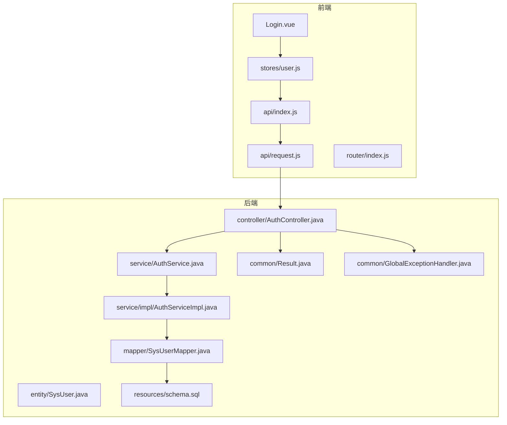
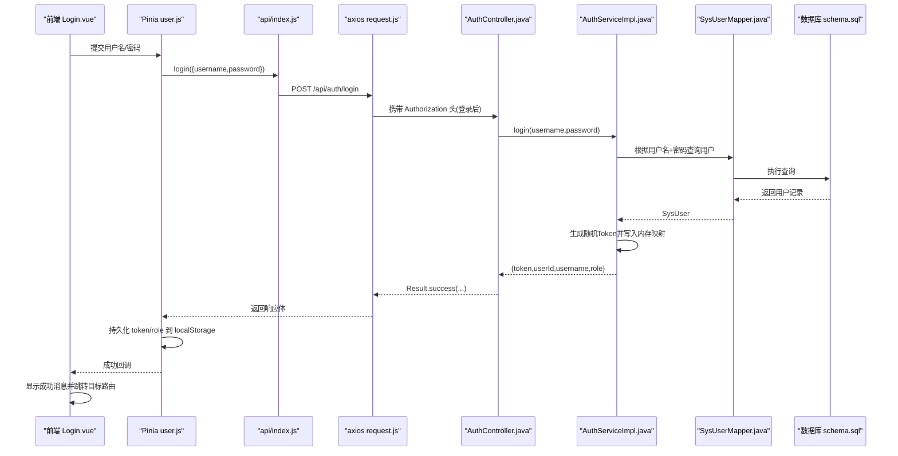
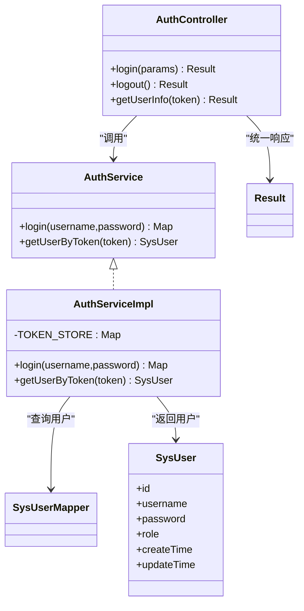
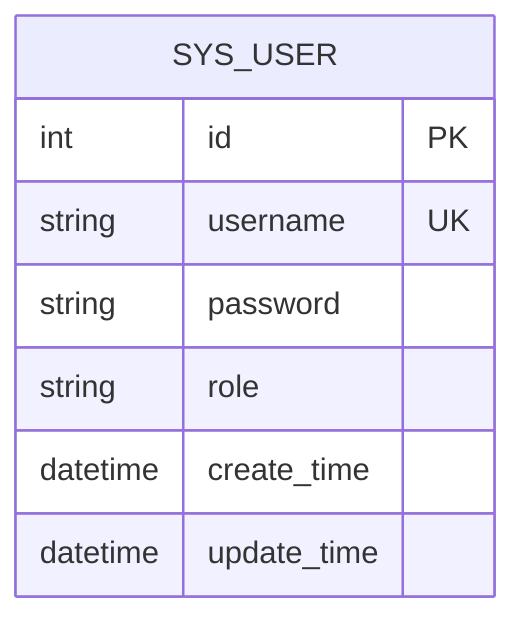
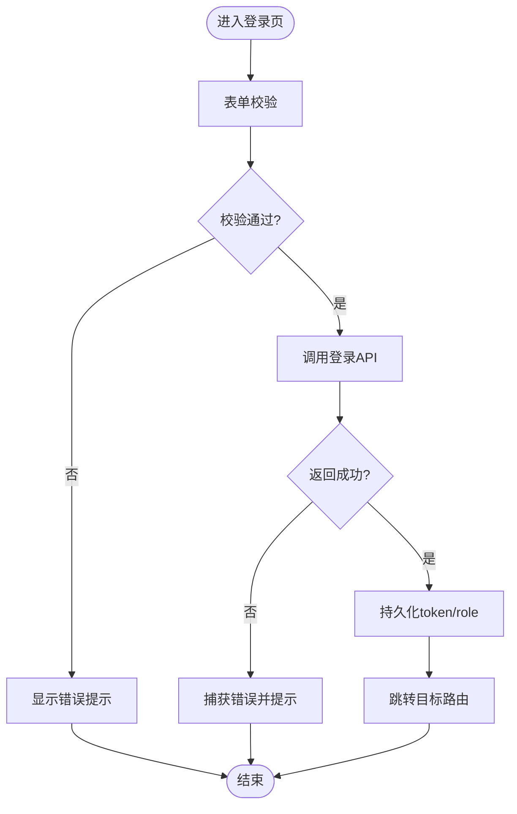

# 用户认证与授权模块

<cite>
**本文引用的文件列表**
- [AuthService.java](file://backend/src/main/java/com/xx/platform/service/AuthService.java)
- [AuthServiceImpl.java](file://backend/src/main/java/com/xx/platform/service/impl/AuthServiceImpl.java)
- [SysUser.java](file://backend/src/main/java/com/xx/platform/entity/SysUser.java)
- [AuthController.java](file://backend/src/main/java/com/xx/platform/controller/AuthController.java)
- [SysUserMapper.java](file://backend/src/main/java/com/xx/platform/mapper/SysUserMapper.java)
- [Result.java](file://backend/src/main/java/com/xx/platform/common/Result.java)
- [GlobalExceptionHandler.java](file://backend/src/main/java/com/xx/platform/common/GlobalExceptionHandler.java)
- [schema.sql](file://backend/src/main/resources/schema.sql)
- [Login.vue](file://frontend/src/views/Login.vue)
- [user.js](file://frontend/src/stores/user.js)
- [index.js（API）](file://frontend/src/api/index.js)
- [request.js](file://frontend/src/api/request.js)
- [index.js（路由）](file://frontend/src/router/index.js)
</cite>

## 目录
1. [简介](#简介)
2. [项目结构](#项目结构)
3. [核心组件](#核心组件)
4. [架构总览](#架构总览)
5. [详细组件分析](#详细组件分析)
6. [依赖关系分析](#依赖关系分析)
7. [性能与安全考量](#性能与安全考量)
8. [故障排查指南](#故障排查指南)
9. [结论](#结论)
10. [附录：API参考与最佳实践](#附录api参考与最佳实践)

## 简介
本模块聚焦于“用户认证与授权”，涵盖后端登录、登出、基于Token的鉴权流程，以及前端登录表单、状态管理与路由守卫。系统采用简单的内存Token机制进行会话管理，适合内部系统或演示环境；生产环境建议替换为Redis等分布式存储并引入更完善的密码加密与权限控制策略。

## 项目结构
认证相关代码分布在前后端多个层次：
- 后端：控制器层暴露REST接口，服务层实现业务逻辑，实体与Mapper负责数据访问，统一响应与异常处理贯穿全局。
- 前端：登录页面负责表单校验与交互，Pinia store集中管理用户状态，Axios拦截器自动附加Token并统一错误处理，路由守卫保护受保护页面。

图表来源
- [AuthController.java:1-68](file://backend/src/main/java/com/xx/platform/controller/AuthController.java#L1-L68)
- [AuthService.java:1-27](file://backend/src/main/java/com/xx/platform/service/AuthService.java#L1-L27)
- [AuthServiceImpl.java:1-62](file://backend/src/main/java/com/xx/platform/service/impl/AuthServiceImpl.java#L1-L62)
- [SysUser.java:1-33](file://backend/src/main/java/com/xx/platform/entity/SysUser.java#L1-L33)
- [SysUserMapper.java:1-13](file://backend/src/main/java/com/xx/platform/mapper/SysUserMapper.java#L1-L13)
- [Result.java:1-53](file://backend/src/main/java/com/xx/platform/common/Result.java#L1-L53)
- [GlobalExceptionHandler.java:1-30](file://backend/src/main/java/com/xx/platform/common/GlobalExceptionHandler.java#L1-L30)
- [schema.sql:1-80](file://backend/src/main/resources/schema.sql#L1-L80)
- [Login.vue:1-103](file://frontend/src/views/Login.vue#L1-L103)
- [user.js:1-57](file://frontend/src/stores/user.js#L1-L57)
- [index.js（API）:1-137](file://frontend/src/api/index.js#L1-L137)
- [request.js:1-45](file://frontend/src/api/request.js#L1-L45)
- [index.js（路由）:1-99](file://frontend/src/router/index.js#L1-L99)

章节来源
- [AuthController.java:1-68](file://backend/src/main/java/com/xx/platform/controller/AuthController.java#L1-L68)
- [AuthService.java:1-27](file://backend/src/main/java/com/xx/platform/service/AuthService.java#L1-L27)
- [AuthServiceImpl.java:1-62](file://backend/src/main/java/com/xx/platform/service/impl/AuthServiceImpl.java#L1-L62)
- [SysUser.java:1-33](file://backend/src/main/java/com/xx/platform/entity/SysUser.java#L1-L33)
- [SysUserMapper.java:1-13](file://backend/src/main/java/com/xx/platform/mapper/SysUserMapper.java#L1-L13)
- [Result.java:1-53](file://backend/src/main/java/com/xx/platform/common/Result.java#L1-L53)
- [GlobalExceptionHandler.java:1-30](file://backend/src/main/java/com/xx/platform/common/GlobalExceptionHandler.java#L1-L30)
- [schema.sql:1-80](file://backend/src/main/resources/schema.sql#L1-L80)
- [Login.vue:1-103](file://frontend/src/views/Login.vue#L1-L103)
- [user.js:1-57](file://frontend/src/stores/user.js#L1-L57)
- [index.js（API）:1-137](file://frontend/src/api/index.js#L1-L137)
- [request.js:1-45](file://frontend/src/api/request.js#L1-L45)
- [index.js（路由）:1-99](file://frontend/src/router/index.js#L1-L99)

## 核心组件
- 认证服务接口与实现：定义登录与按Token获取用户信息的能力，并在实现中完成用户查询、Token生成与会话映射。
- 用户实体与数据表：定义用户字段与角色，提供数据库初始化脚本。
- 认证控制器：对外暴露登录、登出、获取当前用户信息的REST接口，并进行基础参数校验与结果封装。
- 前端登录组件与状态管理：表单校验、调用登录API、持久化Token与角色、路由跳转与错误提示。
- Axios请求拦截器：自动注入Authorization头，统一处理401未授权并跳转登录页。
- 路由守卫：对需要管理员权限的路由进行前置检查。

章节来源
- [AuthService.java:1-27](file://backend/src/main/java/com/xx/platform/service/AuthService.java#L1-L27)
- [AuthServiceImpl.java:1-62](file://backend/src/main/java/com/xx/platform/service/impl/AuthServiceImpl.java#L1-L62)
- [SysUser.java:1-33](file://backend/src/main/java/com/xx/platform/entity/SysUser.java#L1-L33)
- [AuthController.java:1-68](file://backend/src/main/java/com/xx/platform/controller/AuthController.java#L1-L68)
- [Login.vue:1-103](file://frontend/src/views/Login.vue#L1-L103)
- [user.js:1-57](file://frontend/src/stores/user.js#L1-L57)
- [index.js（API）:1-137](file://frontend/src/api/index.js#L1-L137)
- [request.js:1-45](file://frontend/src/api/request.js#L1-L45)
- [index.js（路由）:1-99](file://frontend/src/router/index.js#L1-L99)

## 架构总览
下图展示了从前端登录到后端鉴权的完整调用链，包括Token在请求中的传递与401的统一处理。

图表来源
- [Login.vue:1-103](file://frontend/src/views/Login.vue#L1-L103)
- [user.js:1-57](file://frontend/src/stores/user.js#L1-L57)
- [index.js（API）:1-137](file://frontend/src/api/index.js#L1-L137)
- [request.js:1-45](file://frontend/src/api/request.js#L1-L45)
- [AuthController.java:1-68](file://backend/src/main/java/com/xx/platform/controller/AuthController.java#L1-L68)
- [AuthServiceImpl.java:1-62](file://backend/src/main/java/com/xx/platform/service/impl/AuthServiceImpl.java#L1-L62)
- [SysUserMapper.java:1-13](file://backend/src/main/java/com/xx/platform/mapper/SysUserMapper.java#L1-L13)
- [schema.sql:1-80](file://backend/src/main/resources/schema.sql#L1-L80)

## 详细组件分析

### 后端：认证服务与控制器
- 认证服务接口定义了登录与按Token获取用户信息两个能力。
- 认证服务实现：
  - 使用用户名与明文密码查询用户（注意：当前实现未做密码加密比对）。
  - 使用UUID生成无分隔符的Token，并将Token与用户ID映射存入ConcurrentHashMap。
  - 通过Token反查用户ID后，再查询用户详情返回给调用方。
- 认证控制器：
  - 登录接口接收JSON参数，进行非空校验后委托服务层处理，并以统一Result包装返回。
  - 登出接口当前为占位实现，服务端不维护登出状态。
  - 获取当前用户接口从请求头读取Authorization作为Token，若缺失或无效则返回401。

图表来源
- [AuthService.java:1-27](file://backend/src/main/java/com/xx/platform/service/AuthService.java#L1-L27)
- [AuthServiceImpl.java:1-62](file://backend/src/main/java/com/xx/platform/service/impl/AuthServiceImpl.java#L1-L62)
- [AuthController.java:1-68](file://backend/src/main/java/com/xx/platform/controller/AuthController.java#L1-L68)
- [SysUser.java:1-33](file://backend/src/main/java/com/xx/platform/entity/SysUser.java#L1-L33)
- [SysUserMapper.java:1-13](file://backend/src/main/java/com/xx/platform/mapper/SysUserMapper.java#L1-L13)
- [Result.java:1-53](file://backend/src/main/java/com/xx/platform/common/Result.java#L1-L53)

章节来源
- [AuthService.java:1-27](file://backend/src/main/java/com/xx/platform/service/AuthService.java#L1-L27)
- [AuthServiceImpl.java:1-62](file://backend/src/main/java/com/xx/platform/service/impl/AuthServiceImpl.java#L1-L62)
- [AuthController.java:1-68](file://backend/src/main/java/com/xx/platform/controller/AuthController.java#L1-L68)
- [SysUser.java:1-33](file://backend/src/main/java/com/xx/platform/entity/SysUser.java#L1-L33)
- [SysUserMapper.java:1-13](file://backend/src/main/java/com/xx/platform/mapper/SysUserMapper.java#L1-L13)
- [Result.java:1-53](file://backend/src/main/java/com/xx/platform/common/Result.java#L1-L53)

### 数据模型与初始数据
- 用户表包含用户名、密码、角色及时间戳字段，用户名唯一约束。
- 初始化脚本中包含一个默认管理员账户（用于快速体验），在生产环境中应删除该硬编码并采用安全方式创建首账号。

图表来源
- [schema.sql:1-80](file://backend/src/main/resources/schema.sql#L1-L80)

章节来源
- [SysUser.java:1-33](file://backend/src/main/java/com/xx/platform/entity/SysUser.java#L1-L33)
- [schema.sql:1-80](file://backend/src/main/resources/schema.sql#L1-L80)

### 前端：登录组件与状态管理
- 登录组件：
  - 使用Element Plus表单进行必填校验。
  - 点击登录时触发store的login方法，成功后提示并跳转到redirect或默认管理页。
- Pinia用户状态：
  - 登录成功后将token、userId、username、role写入本地存储。
  - 登出时清空本地存储与状态。
  - 提供获取用户信息的方法，失败时自动清理状态。
- Axios拦截器：
  - 请求前自动从localStorage读取token并放入Authorization头。
  - 响应拦截器统一处理code不为200的情况，当401时清除本地状态并重定向至登录页。
- 路由守卫：
  - 对requiresAuth的路由，检查本地token与角色是否为ADMIN，否则重定向到登录页并附带redirect参数。

图表来源
- [Login.vue:1-103](file://frontend/src/views/Login.vue#L1-L103)
- [user.js:1-57](file://frontend/src/stores/user.js#L1-L57)
- [index.js（API）:1-137](file://frontend/src/api/index.js#L1-L137)
- [request.js:1-45](file://frontend/src/api/request.js#L1-L45)
- [index.js（路由）:1-99](file://frontend/src/router/index.js#L1-L99)

章节来源
- [Login.vue:1-103](file://frontend/src/views/Login.vue#L1-L103)
- [user.js:1-57](file://frontend/src/stores/user.js#L1-L57)
- [index.js（API）:1-137](file://frontend/src/api/index.js#L1-L137)
- [request.js:1-45](file://frontend/src/api/request.js#L1-L45)
- [index.js（路由）:1-99](file://frontend/src/router/index.js#L1-L99)

## 依赖关系分析
- 控制器依赖服务接口，服务实现依赖Mapper与内存Token存储。
- 前端组件依赖Pinia状态，状态依赖API封装，API封装依赖Axios实例，Axios拦截器依赖浏览器本地存储。
- 路由守卫依赖本地存储的token与role，形成前端侧的轻量级权限控制。

```mermaid
graph LR
LoginVue["Login.vue"] --> UserStore["stores/user.js"]
UserStore --> ApiIndex["api/index.js"]
ApiIndex --> RequestJS["api/request.js"]
RequestJS --> AuthCtrl["AuthController.java"]
AuthCtrl --> AuthServiceI["AuthService.java"]
AuthServiceI --> AuthServiceImpl["AuthServiceImpl.java"]
AuthServiceImpl --> SysUserMapper["SysUserMapper.java"]
SysUserMapper --> Schema["schema.sql"]
```

图表来源
- [Login.vue:1-103](file://frontend/src/views/Login.vue#L1-L103)
- [user.js:1-57](file://frontend/src/stores/user.js#L1-L57)
- [index.js（API）:1-137](file://frontend/src/api/index.js#L1-L137)
- [request.js:1-45](file://frontend/src/api/request.js#L1-L45)
- [AuthController.java:1-68](file://backend/src/main/java/com/xx/platform/controller/AuthController.java#L1-L68)
- [AuthService.java:1-27](file://backend/src/main/java/com/xx/platform/service/AuthService.java#L1-L27)
- [AuthServiceImpl.java:1-62](file://backend/src/main/java/com/xx/platform/service/impl/AuthServiceImpl.java#L1-L62)
- [SysUserMapper.java:1-13](file://backend/src/main/java/com/xx/platform/mapper/SysUserMapper.java#L1-L13)
- [schema.sql:1-80](file://backend/src/main/resources/schema.sql#L1-L80)

章节来源
- [AuthController.java:1-68](file://backend/src/main/java/com/xx/platform/controller/AuthController.java#L1-L68)
- [AuthServiceImpl.java:1-62](file://backend/src/main/java/com/xx/platform/service/impl/AuthServiceImpl.java#L1-L62)
- [request.js:1-45](file://frontend/src/api/request.js#L1-L45)
- [index.js（路由）:1-99](file://frontend/src/router/index.js#L1-L99)

## 性能与安全考量
- Token存储与过期
  - 当前使用进程内ConcurrentHashMap存储Token，重启即失效，不适合多实例部署。建议迁移至Redis，支持过期时间与分布式共享。
- 密码安全
  - 当前登录比对使用明文密码，存在严重安全隐患。建议：
    - 数据库仅存储加盐哈希值（如BCrypt）。
    - 登录时仅比对哈希值，禁止明文传输与存储。
    - 强制HTTPS，避免中间人攻击。
- 权限控制
  - 当前仅区分ADMIN/USER角色，且前端路由守卫仅检查ADMIN。建议在后端增加注解式权限校验（如基于角色的方法级鉴权），并对敏感接口进行二次校验。
- 防重放与限流
  - 建议引入请求签名或短期有效Token，结合网关层限流与IP白名单。
- 日志与审计
  - 记录登录成功/失败事件，便于审计与风控。

[本节为通用指导，不直接分析具体文件]

## 故障排查指南
- 登录失败
  - 现象：返回错误消息或提示“用户名或密码错误”。
  - 排查：确认数据库中是否存在对应用户，且密码匹配策略是否与实现一致。
  - 定位：服务层登录逻辑抛出运行时异常，被全局异常处理器统一返回。
- 401未授权
  - 现象：访问受保护接口返回401，前端自动跳转登录页。
  - 排查：确认请求是否携带Authorization头，Token是否有效且未过期。
  - 定位：控制器获取当前用户信息时校验Token为空或无效返回401；Axios响应拦截器统一处理。
- 路由无法进入管理页
  - 现象：访问/admin/*被重定向到登录页。
  - 排查：确认本地存储中是否存在token与role=ADMIN。
  - 定位：路由守卫在requiresAuth路由下检查本地状态。

章节来源
- [AuthServiceImpl.java:1-62](file://backend/src/main/java/com/xx/platform/service/impl/AuthServiceImpl.java#L1-L62)
- [GlobalExceptionHandler.java:1-30](file://backend/src/main/java/com/xx/platform/common/GlobalExceptionHandler.java#L1-L30)
- [AuthController.java:1-68](file://backend/src/main/java/com/xx/platform/controller/AuthController.java#L1-L68)
- [request.js:1-45](file://frontend/src/api/request.js#L1-L45)
- [index.js（路由）:1-99](file://frontend/src/router/index.js#L1-L99)

## 结论
当前认证与授权模块实现了基础的登录、登出与基于Token的鉴权流程，前端具备表单校验、状态持久化与路由守卫。为满足生产安全要求，需尽快完善密码加密、Token持久化与过期策略、后端细粒度权限控制，并引入HTTPS与审计日志等安全措施。

[本节为总结性内容，不直接分析具体文件]

## 附录：API参考与最佳实践

### REST接口一览
- 登录
  - 方法：POST
  - 路径：/api/auth/login
  - 请求体：包含username与password
  - 响应：统一Result封装，data包含token、userId、username、role
- 登出
  - 方法：POST
  - 路径：/api/auth/logout
  - 说明：当前为占位实现，客户端自行清理本地状态即可
- 获取当前用户信息
  - 方法：GET
  - 路径：/api/auth/info
  - 请求头：Authorization=token
  - 响应：统一Result封装，data为用户信息（不含密码）

章节来源
- [AuthController.java:1-68](file://backend/src/main/java/com/xx/platform/controller/AuthController.java#L1-L68)
- [Result.java:1-53](file://backend/src/main/java/com/xx/platform/common/Result.java#L1-L53)

### 前端调用示例（概念性描述）
- 登录
  - 调用登录API，传入用户名与密码。
  - 成功后将token与role写入本地存储，并跳转至目标路由。
- 获取用户信息
  - 调用获取用户信息接口，请求头自动携带Authorization。
  - 若返回401，前端拦截器会清理本地状态并跳转登录页。

章节来源
- [index.js（API）:1-137](file://frontend/src/api/index.js#L1-L137)
- [request.js:1-45](file://frontend/src/api/request.js#L1-L45)
- [user.js:1-57](file://frontend/src/stores/user.js#L1-L57)

### 安全最佳实践清单
- 使用HTTPS传输所有认证相关请求。
- 密码采用强哈希算法存储，禁止明文保存与传输。
- Token设置合理有效期，支持刷新与黑名单机制。
- 服务端对所有敏感接口进行角色/权限校验。
- 记录登录与鉴权审计日志，接入风控与告警。

[本节为通用指导，不直接分析具体文件]