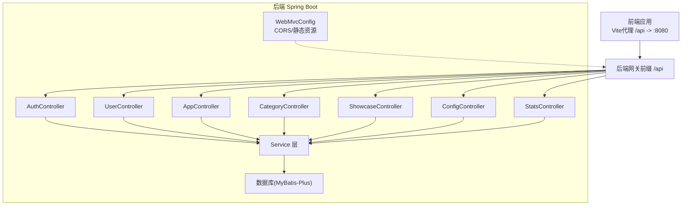
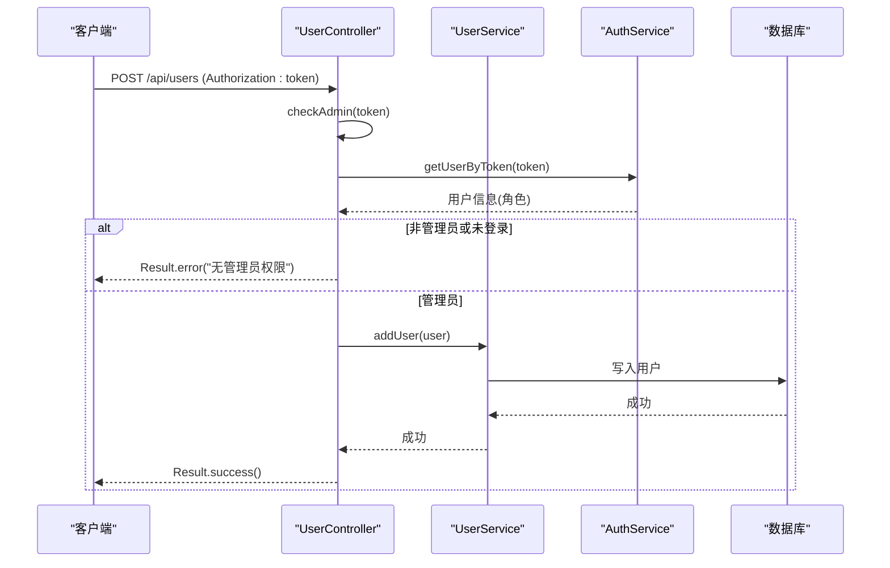
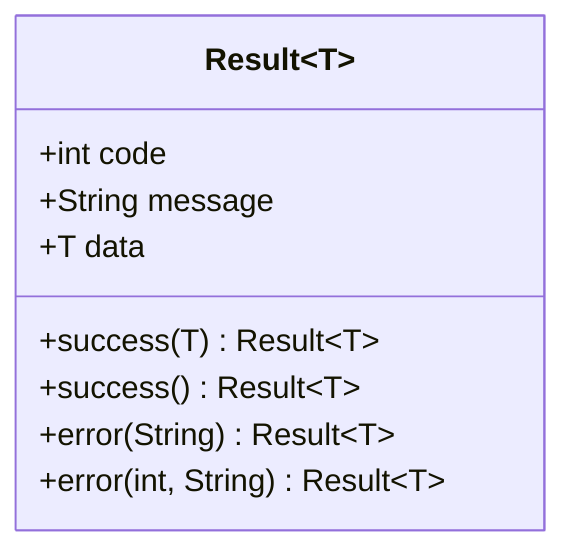
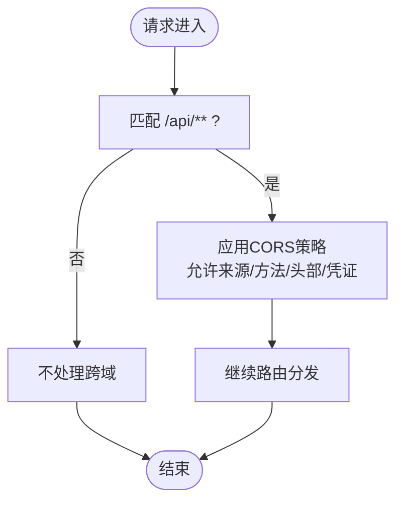
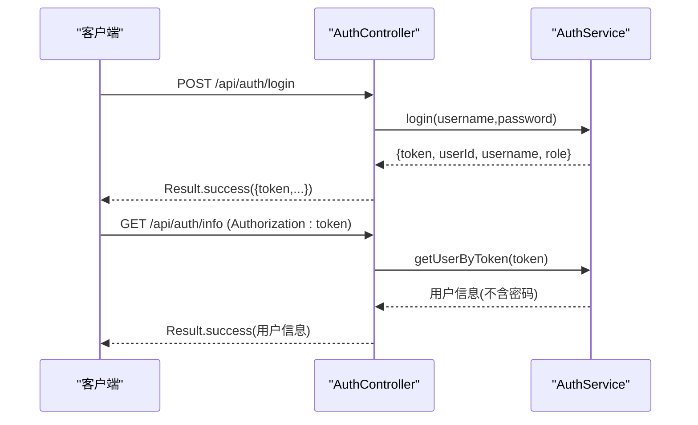
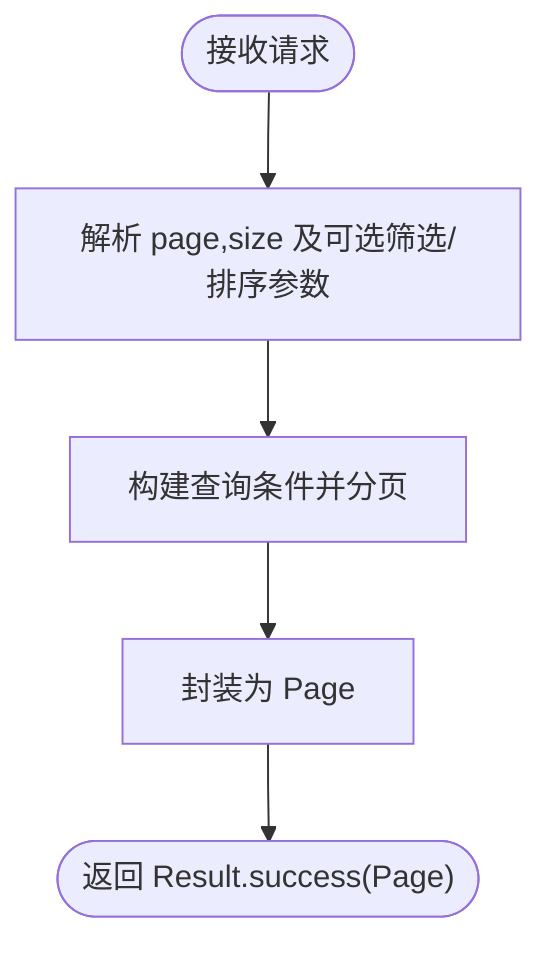
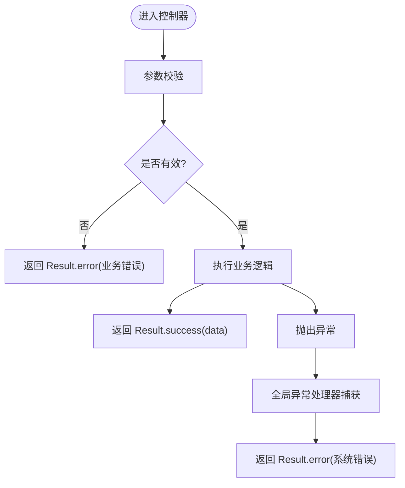
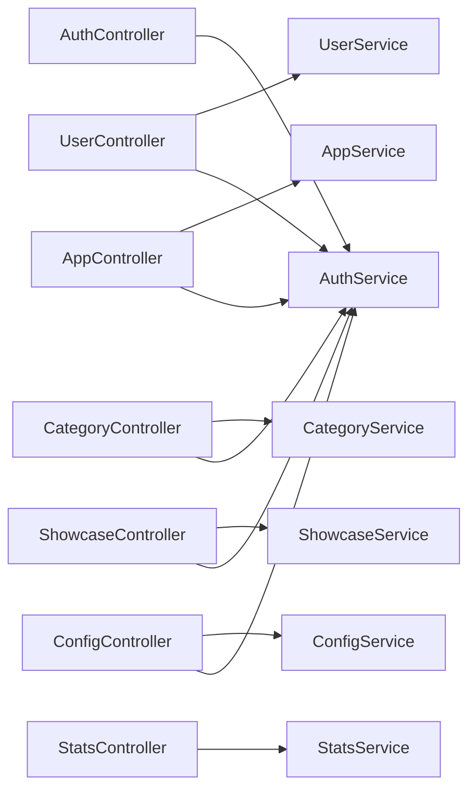

# API设计规范

<cite>
**本文引用的文件列表**
- [API.md](file://API.md)
- [Result.java](file://backend/src/main/java/com/xx/platform/common/Result.java)
- [GlobalExceptionHandler.java](file://backend/src/main/java/com/xx/platform/common/GlobalExceptionHandler.java)
- [WebMvcConfig.java](file://backend/src/main/java/com/xx/platform/config/WebMvcConfig.java)
- [AuthController.java](file://backend/src/main/java/com/xx/platform/controller/AuthController.java)
- [UserController.java](file://backend/src/main/java/com/xx/platform/controller/UserController.java)
- [AppController.java](file://backend/src/main/java/com/xx/platform/controller/AppController.java)
- [CategoryController.java](file://backend/src/main/java/com/xx/platform/controller/CategoryController.java)
- [ShowcaseController.java](file://backend/src/main/java/com/xx/platform/controller/ShowcaseController.java)
- [ConfigController.java](file://backend/src/main/java/com/xx/platform/controller/ConfigController.java)
- [StatsController.java](file://backend/src/main/java/com/xx/platform/controller/StatsController.java)
</cite>

## 目录
1. [引言](#引言)
2. [项目结构](#项目结构)
3. [核心组件](#核心组件)
4. [架构总览](#架构总览)
5. [详细组件分析](#详细组件分析)
6. [依赖关系分析](#依赖关系分析)
7. [性能考虑](#性能考虑)
8. [故障排查指南](#故障排查指南)
9. [结论](#结论)
10. [附录](#附录)

## 引言
本规范面向JZPlatform门户系统的RESTful API设计，统一约定HTTP方法、URL路径、状态码与响应格式，明确CORS与安全策略、版本管理策略、参数校验与错误处理模式，以及分页查询的标准实现方式。目标是确保前后端协作一致、接口可演进且具备向后兼容性。

## 项目结构
后端采用Spring Boot分层架构：控制器层负责路由与入参出参封装；服务层承载业务逻辑；数据访问层使用MyBatis-Plus；通用模块提供统一响应体与全局异常处理；配置类提供CORS与静态资源映射。前端通过Vite代理将/api请求转发至后端8080端口。

图示来源
- [WebMvcConfig.java:1-37](file://backend/src/main/java/com/xx/platform/config/WebMvcConfig.java#L1-L37)
- [AuthController.java:1-68](file://backend/src/main/java/com/xx/platform/controller/AuthController.java#L1-L68)
- [UserController.java:1-88](file://backend/src/main/java/com/xx/platform/controller/UserController.java#L1-L88)
- [AppController.java:1-111](file://backend/src/main/java/com/xx/platform/controller/AppController.java#L1-L111)
- [CategoryController.java:1-78](file://backend/src/main/java/com/xx/platform/controller/CategoryController.java#L1-L78)
- [ShowcaseController.java:1-87](file://backend/src/main/java/com/xx/platform/controller/ShowcaseController.java#L1-L87)
- [ConfigController.java:1-76](file://backend/src/main/java/com/xx/platform/controller/ConfigController.java#L1-L76)
- [StatsController.java:1-32](file://backend/src/main/java/com/xx/platform/controller/StatsController.java#L1-L32)

章节来源
- [API.md:1-197](file://API.md#L1-L197)

## 核心组件
- 统一响应体 Result：所有接口返回统一结构，包含状态码、消息与数据字段，便于前端一致化处理。
- 全局异常处理器 GlobalExceptionHandler：捕获运行时异常与未处理异常，统一包装为 Result 返回，避免暴露内部堆栈。
- CORS 与静态资源 WebMvcConfig：开放跨域访问并映射上传文件目录，使前端可直接访问上传资源。

章节来源
- [Result.java:1-53](file://backend/src/main/java/com/xx/platform/common/Result.java#L1-L53)
- [GlobalExceptionHandler.java:1-30](file://backend/src/main/java/com/xx/platform/common/GlobalExceptionHandler.java#L1-L30)
- [WebMvcConfig.java:1-37](file://backend/src/main/java/com/xx/platform/config/WebMvcConfig.java#L1-L37)

## 架构总览
下图展示一次典型的管理员操作（例如新增用户）的调用链路与安全校验流程。

图示来源
- [UserController.java:1-88](file://backend/src/main/java/com/xx/platform/controller/UserController.java#L1-L88)
- [GlobalExceptionHandler.java:1-30](file://backend/src/main/java/com/xx/platform/common/GlobalExceptionHandler.java#L1-L30)

## 详细组件分析

### RESTful 设计原则与命名约定
- HTTP方法语义
  - GET：幂等读取，用于列表、详情、统计等只读场景。
  - POST：创建资源或触发非幂等操作（如记录点击）。
  - PUT：全量更新指定资源。
  - DELETE：删除指定资源。
- URL路径规则
  - 资源名词复数形式，小写英文，短横线分隔，层级不超过三层。
  - 示例：/api/users、/api/apps/{id}、/api/categories、/api/showcase、/api/config、/api/stats/overview。
- 查询参数
  - 分页：page、size。
  - 筛选：按业务维度传递，如 categoryId、keyword、category。
  - 排序：sortField、sortOrder。
- 认证与鉴权
  - 认证头：Authorization: {token}。
  - 鉴权：在需要管理员操作的接口中检查角色是否为 ADMIN。
- 状态码定义
  - 业务状态码由 Result.code 表示，常见值：200 成功、401 未登录/过期、500 服务器错误。
  - HTTP状态码建议保持200，具体业务含义由 Result.code 表达。

章节来源
- [API.md:1-197](file://API.md#L1-L197)
- [AuthController.java:1-68](file://backend/src/main/java/com/xx/platform/controller/AuthController.java#L1-L68)
- [UserController.java:1-88](file://backend/src/main/java/com/xx/platform/controller/UserController.java#L1-L88)
- [AppController.java:1-111](file://backend/src/main/java/com/xx/platform/controller/AppController.java#L1-L111)
- [CategoryController.java:1-78](file://backend/src/main/java/com/xx/platform/controller/CategoryController.java#L1-L78)
- [ShowcaseController.java:1-87](file://backend/src/main/java/com/xx/platform/controller/ShowcaseController.java#L1-L87)
- [ConfigController.java:1-76](file://backend/src/main/java/com/xx/platform/controller/ConfigController.java#L1-L76)
- [StatsController.java:1-32](file://backend/src/main/java/com/xx/platform/controller/StatsController.java#L1-L32)

### 统一响应格式 Result
- 结构字段
  - code：业务状态码。
  - message：提示信息。
  - data：响应数据，可为对象、集合或空。
- 使用方式
  - 成功：Result.success(data)。
  - 失败：Result.error(message) 或 Result.error(code, message)。
- 适用性
  - 所有控制器均返回 Result，前端据此进行统一处理。

图示来源
- [Result.java:1-53](file://backend/src/main/java/com/xx/platform/common/Result.java#L1-L53)

章节来源
- [Result.java:1-53](file://backend/src/main/java/com/xx/platform/common/Result.java#L1-L53)

### CORS 跨域与安全策略
- CORS 配置
  - 允许路径：/api/**。
  - 允许来源：开发环境允许任意来源，生产环境应限制为可信域名。
  - 允许方法与头部：GET、POST、PUT、DELETE、OPTIONS；允许全部头部。
  - 允许携带凭证：true。
  - 预检缓存：maxAge=3600。
- 静态资源
  - /uploads/** 映射到本地 ./uploads/ 目录，供浏览器直接访问上传文件。
- 安全建议
  - 生产环境收紧 allowedOriginPatterns。
  - 对敏感接口增加签名或二次校验。
  - 结合HTTPS与最小权限原则。

图示来源
- [WebMvcConfig.java:1-37](file://backend/src/main/java/com/xx/platform/config/WebMvcConfig.java#L1-L37)

章节来源
- [WebMvcConfig.java:1-37](file://backend/src/main/java/com/xx/platform/config/WebMvcConfig.java#L1-L37)

### 认证与鉴权流程
- 认证
  - 登录：POST /api/auth/login，返回 token 与用户基本信息。
  - 登出：POST /api/auth/logout，客户端清除本地 token。
  - 当前用户：GET /api/auth/info，从 Authorization 头解析 token 获取用户信息。
- 鉴权
  - 管理员接口在控制器内通过 checkAdmin(token) 校验角色，非管理员抛出运行时异常，由全局异常处理器统一返回错误。

图示来源
- [AuthController.java:1-68](file://backend/src/main/java/com/xx/platform/controller/AuthController.java#L1-L68)

章节来源
- [AuthController.java:1-68](file://backend/src/main/java/com/xx/platform/controller/AuthController.java#L1-L68)

### 分页查询标准模式
- 通用参数
  - page：页码，默认1。
  - size：每页数量，默认12（应用列表）或10（用户列表）。
- 返回结构
  - 使用 MyBatis-Plus Page 对象作为 data，包含总数、列表等元数据。
- 示例接口
  - 应用列表：GET /api/apps?page=&size=&categoryId=&keyword=&sortField=&sortOrder=。
  - 用户列表：GET /api/users?page=&size=。

图示来源
- [AppController.java:1-111](file://backend/src/main/java/com/xx/platform/controller/AppController.java#L1-L111)
- [UserController.java:1-88](file://backend/src/main/java/com/xx/platform/controller/UserController.java#L1-L88)

章节来源
- [AppController.java:1-111](file://backend/src/main/java/com/xx/platform/controller/AppController.java#L1-L111)
- [UserController.java:1-88](file://backend/src/main/java/com/xx/platform/controller/UserController.java#L1-L88)

### 错误处理与参数验证
- 全局异常处理
  - 捕获 RuntimeException 与 Exception，统一返回 Result.error(...)。
  - 未捕获异常打印堆栈并返回友好提示。
- 参数校验
  - 基础必填校验在控制器或服务层完成，缺失时返回业务错误码与消息。
  - 建议在后续引入 Bean Validation 注解以增强声明式校验。
- 典型错误
  - 未登录：401。
  - 无管理员权限：403 或自定义业务码。
  - 服务器内部错误：500。

图示来源
- [GlobalExceptionHandler.java:1-30](file://backend/src/main/java/com/xx/platform/common/GlobalExceptionHandler.java#L1-L30)
- [AuthController.java:1-68](file://backend/src/main/java/com/xx/platform/controller/AuthController.java#L1-L68)
- [UserController.java:1-88](file://backend/src/main/java/com/xx/platform/controller/UserController.java#L1-L88)

章节来源
- [GlobalExceptionHandler.java:1-30](file://backend/src/main/java/com/xx/platform/common/GlobalExceptionHandler.java#L1-L30)

### 版本管理与向后兼容
- 版本策略
  - 当前未显式使用URL版本前缀，建议未来采用 /v1/... 形式进行版本控制。
  - 重大变更通过版本号升级，旧版本保留至少一个迭代周期。
- 兼容性建议
  - 新增字段保持可选，避免破坏现有客户端。
  - 废弃字段标记 deprecated 并在文档中说明迁移路径。
  - 行为变更遵循最小影响原则，必要时提供开关或灰度发布。

[本节为概念性内容，无需代码来源]

### 各模块接口要点
- 认证模块
  - 登录、登出、获取当前用户信息，需携带 Authorization 头的接口受鉴权保护。
- 用户管理
  - 仅管理员可用，支持分页列表、新增、编辑、删除。
- 应用管理
  - 公开接口：列表（支持分页、筛选、排序）、详情、点击计数。
  - 管理员接口：新增、编辑、删除。
- 分类管理
  - 公开列表，管理员增删改。
- 宣贯数据
  - 公开列表（可按类别过滤）、详情；管理员增删改。
- 平台配置
  - 公开获取配置；管理员批量更新与文件上传（multipart/form-data）。
- 统计
  - 公开总览统计。

章节来源
- [API.md:1-197](file://API.md#L1-L197)
- [AuthController.java:1-68](file://backend/src/main/java/com/xx/platform/controller/AuthController.java#L1-L68)
- [UserController.java:1-88](file://backend/src/main/java/com/xx/platform/controller/UserController.java#L1-L88)
- [AppController.java:1-111](file://backend/src/main/java/com/xx/platform/controller/AppController.java#L1-L111)
- [CategoryController.java:1-78](file://backend/src/main/java/com/xx/platform/controller/CategoryController.java#L1-L78)
- [ShowcaseController.java:1-87](file://backend/src/main/java/com/xx/platform/controller/ShowcaseController.java#L1-L87)
- [ConfigController.java:1-76](file://backend/src/main/java/com/xx/platform/controller/ConfigController.java#L1-L76)
- [StatsController.java:1-32](file://backend/src/main/java/com/xx/platform/controller/StatsController.java#L1-L32)

## 依赖关系分析
- 控制器与服务层解耦清晰，每个控制器仅依赖对应 Service 与 AuthService。
- 全局异常处理器集中处理异常，降低控制器中的重复 try-catch。
- CORS 与静态资源映射独立于业务控制器，职责单一。

图示来源
- [AuthController.java:1-68](file://backend/src/main/java/com/xx/platform/controller/AuthController.java#L1-L68)
- [UserController.java:1-88](file://backend/src/main/java/com/xx/platform/controller/UserController.java#L1-L88)
- [AppController.java:1-111](file://backend/src/main/java/com/xx/platform/controller/AppController.java#L1-L111)
- [CategoryController.java:1-78](file://backend/src/main/java/com/xx/platform/controller/CategoryController.java#L1-L78)
- [ShowcaseController.java:1-87](file://backend/src/main/java/com/xx/platform/controller/ShowcaseController.java#L1-L87)
- [ConfigController.java:1-76](file://backend/src/main/java/com/xx/platform/controller/ConfigController.java#L1-L76)
- [StatsController.java:1-32](file://backend/src/main/java/com/xx/platform/controller/StatsController.java#L1-L32)

## 性能考虑
- 分页与索引
  - 列表接口务必分页，避免一次性加载大量数据。
  - 针对高频查询字段建立索引（如 categoryId、status、clickCount）。
- 缓存
  - 对热点只读数据（如分类列表、平台配置）引入缓存层，减少数据库压力。
- 限流与防抖
  - 对点击计数等高频接口实施限流与去重策略，防止滥用。
- 静态资源
  - 上传文件通过CDN或对象存储加速访问，缩短首屏时间。

[本节为通用指导，无需代码来源]

## 故障排查指南
- 常见问题定位
  - 401 未登录：检查 Authorization 头是否正确携带。
  - 403 无管理员权限：确认当前用户角色是否为 ADMIN。
  - 500 服务器错误：查看服务端日志与全局异常处理器返回的消息。
- 调试建议
  - 开启后端调试日志，关注异常堆栈。
  - 使用浏览器开发者工具检查请求头与响应体结构是否符合 Result 约定。
  - 核对CORS配置，确保开发环境与生产环境的 allowedOriginPatterns 正确。

章节来源
- [GlobalExceptionHandler.java:1-30](file://backend/src/main/java/com/xx/platform/common/GlobalExceptionHandler.java#L1-L30)
- [AuthController.java:1-68](file://backend/src/main/java/com/xx/platform/controller/AuthController.java#L1-L68)
- [UserController.java:1-88](file://backend/src/main/java/com/xx/platform/controller/UserController.java#L1-L88)

## 结论
本规范基于现有代码实现了统一的RESTful风格、一致的响应格式、完善的异常处理与CORS配置，并明确了分页与鉴权模式。建议在生产环境中进一步收紧CORS、引入更严格的参数校验与版本化路径，以提升安全性与可维护性。

## 附录
- 基础URL与认证
  - 基础URL：/api
  - 认证头：Authorization: {token}
- 常用接口清单
  - 认证：/api/auth/login、/api/auth/logout、/api/auth/info
  - 用户：/api/users
  - 应用：/api/apps、/api/apps/{id}/click
  - 分类：/api/categories
  - 宣贯：/api/showcase
  - 配置：/api/config、/api/config/upload
  - 统计：/api/stats/overview

章节来源
- [API.md:1-197](file://API.md#L1-L197)