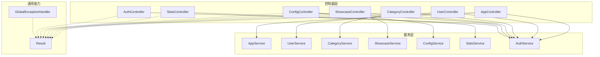
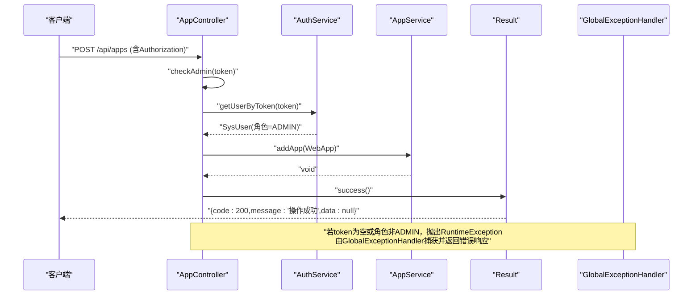
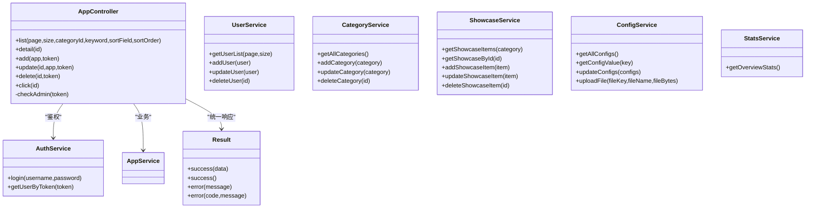

# Controller层设计

<cite>
**本文引用的文件**   
- [AppController.java](file://backend/src/main/java/com/xx/platform/controller/AppController.java)
- [AuthController.java](file://backend/src/main/java/com/xx/platform/controller/AuthController.java)
- [UserController.java](file://backend/src/main/java/com/xx/platform/controller/UserController.java)
- [CategoryController.java](file://backend/src/main/java/com/xx/platform/controller/CategoryController.java)
- [ConfigController.java](file://backend/src/main/java/com/xx/platform/controller/ConfigController.java)
- [ShowcaseController.java](file://backend/src/main/java/com/xx/platform/controller/ShowcaseController.java)
- [StatsController.java](file://backend/src/main/java/com/xx/platform/controller/StatsController.java)
- [Result.java](file://backend/src/main/java/com/xx/platform/common/Result.java)
- [GlobalExceptionHandler.java](file://backend/src/main/java/com/xx/platform/common/GlobalExceptionHandler.java)
- [AppService.java](file://backend/src/main/java/com/xx/platform/service/AppService.java)
- [AuthService.java](file://backend/src/main/java/com/xx/platform/service/AuthService.java)
- [UserService.java](file://backend/src/main/java/com/xx/platform/service/UserService.java)
- [CategoryService.java](file://backend/src/main/java/com/xx/platform/service/CategoryService.java)
- [ConfigService.java](file://backend/src/main/java/com/xx/platform/service/ConfigService.java)
- [ShowcaseService.java](file://backend/src/main/java/com/xx/platform/service/ShowcaseService.java)
- [StatsService.java](file://backend/src/main/java/com/xx/platform/service/StatsService.java)
</cite>

## 目录
1. [引言](#引言)
2. [项目结构](#项目结构)
3. [核心组件](#核心组件)
4. [架构总览](#架构总览)
5. [详细组件分析](#详细组件分析)
6. [依赖关系分析](#依赖关系分析)
7. [性能考虑](#性能考虑)
8. [故障排查指南](#故障排查指南)
9. [结论](#结论)
10. [附录](#附录)

## 引言
本设计文档聚焦于JZPlatform门户系统的Controller层，系统阐述其职责边界与实现规范：HTTP请求处理、参数校验、权限控制、响应封装、RESTful API设计规范（URL路径、HTTP方法、状态码）、与Service层的交互方式及数据传递格式。并以AppController为例，展示CRUD操作、权限校验逻辑与异常处理机制；同时说明统一响应格式Result的设计与使用模式。

## 项目结构
后端采用分层架构：Controller负责HTTP接口定义与入参出参转换、基础校验与权限拦截；Service承载业务编排；Mapper对接持久化；common提供通用能力（统一响应、全局异常）。

图示来源
- [AppController.java:1-111](file://backend/src/main/java/com/xx/platform/controller/AppController.java#L1-L111)
- [UserController.java:1-88](file://backend/src/main/java/com/xx/platform/controller/UserController.java#L1-L88)
- [CategoryController.java:1-78](file://backend/src/main/java/com/xx/platform/controller/CategoryController.java#L1-L78)
- [ShowcaseController.java:1-87](file://backend/src/main/java/com/xx/platform/controller/ShowcaseController.java#L1-L87)
- [ConfigController.java:1-76](file://backend/src/main/java/com/xx/platform/controller/ConfigController.java#L1-L76)
- [StatsController.java:1-32](file://backend/src/main/java/com/xx/platform/controller/StatsController.java#L1-L32)
- [AuthController.java:1-68](file://backend/src/main/java/com/xx/platform/controller/AuthController.java#L1-L68)
- [Result.java:1-53](file://backend/src/main/java/com/xx/platform/common/Result.java#L1-L53)
- [GlobalExceptionHandler.java:1-30](file://backend/src/main/java/com/xx/platform/common/GlobalExceptionHandler.java#L1-L30)

章节来源
- [AppController.java:1-111](file://backend/src/main/java/com/xx/platform/controller/AppController.java#L1-L111)
- [AuthController.java:1-68](file://backend/src/main/java/com/xx/platform/controller/AuthController.java#L1-L68)
- [Result.java:1-53](file://backend/src/main/java/com/xx/platform/common/Result.java#L1-L53)
- [GlobalExceptionHandler.java:1-30](file://backend/src/main/java/com/xx/platform/common/GlobalExceptionHandler.java#L1-L30)

## 核心组件
- 统一响应 Result
  - 字段：code、message、data
  - 工厂方法：success(data)、success()、error(message)、error(code, message)
  - 用途：所有Controller返回类型统一为Result<T>，便于前端一致化处理
- 全局异常处理器 GlobalExceptionHandler
  - 捕获RuntimeException并返回错误消息
  - 兜底捕获Exception并返回“服务器内部错误”提示
  - 与Result配合，保证异常场景下的响应一致性
- 认证服务 AuthService
  - 登录：根据用户名密码返回token与用户信息
  - 鉴权：根据Authorization头中的token解析当前用户

章节来源
- [Result.java:1-53](file://backend/src/main/java/com/xx/platform/common/Result.java#L1-L53)
- [GlobalExceptionHandler.java:1-30](file://backend/src/main/java/com/xx/platform/common/GlobalExceptionHandler.java#L1-L30)
- [AuthService.java:1-27](file://backend/src/main/java/com/xx/platform/service/AuthService.java#L1-L27)

## 架构总览
Controller层作为对外暴露的HTTP入口，遵循以下原则：
- RESTful风格：资源名词复数形式、动词由HTTP方法表达
- 权限控制：管理员接口通过Authorization头携带token，并在Controller内调用AuthService进行角色校验
- 参数校验：对必填参数进行空值检查，必要时抛出运行时异常交由全局异常处理器统一返回
- 响应封装：所有接口返回Result<T>，成功时code=200，失败时code非200且message描述原因

图示来源
- [AppController.java:55-61](file://backend/src/main/java/com/xx/platform/controller/AppController.java#L55-L61)
- [AppController.java:99-109](file://backend/src/main/java/com/xx/platform/controller/AppController.java#L99-L109)
- [AuthService.java:10-26](file://backend/src/main/java/com/xx/platform/service/AuthService.java#L10-L26)
- [AppService.java:27-30](file://backend/src/main/java/com/xx/platform/service/AppService.java#L27-L30)
- [Result.java:23-35](file://backend/src/main/java/com/xx/platform/common/Result.java#L23-L35)
- [GlobalExceptionHandler.java:16-19](file://backend/src/main/java/com/xx/platform/common/GlobalExceptionHandler.java#L16-L19)

## 详细组件分析

### AppController（Web应用管理）
- 职责
  - 公开接口：应用列表查询（分页/筛选/排序）、详情、点击记录
  - 管理员接口：新增、编辑、删除
- RESTful设计
  - GET /api/apps：分页列表，支持page、size、categoryId、keyword、sortField、sortOrder
  - GET /api/apps/{id}：详情
  - POST /api/apps：新增（需管理员）
  - PUT /api/apps/{id}：更新（需管理员）
  - DELETE /api/apps/{id}：删除（需管理员）
  - POST /api/apps/{id}/click：点击计数（公开）
- 权限控制
  - 管理员接口通过Authorization头传入token，内部调用AuthService.getUserByToken校验角色是否为ADMIN
  - 未登录或无管理员权限时抛出RuntimeException，由全局异常处理器统一返回错误
- 与Service层交互
  - 调用AppService完成分页查询、详情获取、增删改、点击计数等业务逻辑
- 示例参考路径
  - 列表查询：[AppController.java:31-40](file://backend/src/main/java/com/xx/platform/controller/AppController.java#L31-L40)
  - 详情查询：[AppController.java:46-49](file://backend/src/main/java/com/xx/platform/controller/AppController.java#L46-L49)
  - 新增应用：[AppController.java:55-61](file://backend/src/main/java/com/xx/platform/controller/AppController.java#L55-L61)
  - 更新应用：[AppController.java:67-74](file://backend/src/main/java/com/xx/platform/controller/AppController.java#L67-L74)
  - 删除应用：[AppController.java:80-86](file://backend/src/main/java/com/xx/platform/controller/AppController.java#L80-L86)
  - 点击记录：[AppController.java:92-96](file://backend/src/main/java/com/xx/platform/controller/AppController.java#L92-L96)
  - 管理员校验：[AppController.java:99-109](file://backend/src/main/java/com/xx/platform/controller/AppController.java#L99-L109)

章节来源
- [AppController.java:1-111](file://backend/src/main/java/com/xx/platform/controller/AppController.java#L1-L111)
- [AppService.java:1-47](file://backend/src/main/java/com/xx/platform/service/AppService.java#L1-L47)
- [AuthService.java:1-27](file://backend/src/main/java/com/xx/platform/service/AuthService.java#L1-L27)
- [Result.java:1-53](file://backend/src/main/java/com/xx/platform/common/Result.java#L1-L53)
- [GlobalExceptionHandler.java:1-30](file://backend/src/main/java/com/xx/platform/common/GlobalExceptionHandler.java#L1-L30)

### AuthController（认证）
- 职责
  - 登录：接收username/password，返回token与用户信息
  - 登出：客户端清除token即可
  - 获取当前用户信息：从Authorization头解析token并返回用户信息（不含密码）
- 参数校验
  - 登录接口对username和password进行空值检查，不合法直接返回错误响应
- 与Service层交互
  - 调用AuthService.login与getUserByToken完成认证流程
- 示例参考路径
  - 登录：[AuthController.java:28-37](file://backend/src/main/java/com/xx/platform/controller/AuthController.java#L28-L37)
  - 登出：[AuthController.java:43-47](file://backend/src/main/java/com/xx/platform/controller/AuthController.java#L43-L47)
  - 获取用户信息：[AuthController.java:55-66](file://backend/src/main/java/com/xx/platform/controller/AuthController.java#L55-L66)

章节来源
- [AuthController.java:1-68](file://backend/src/main/java/com/xx/platform/controller/AuthController.java#L1-L68)
- [AuthService.java:1-27](file://backend/src/main/java/com/xx/platform/service/AuthService.java#L1-L27)
- [Result.java:1-53](file://backend/src/main/java/com/xx/platform/common/Result.java#L1-L53)

### UserController（用户管理）
- 职责
  - 管理员专用：用户列表（分页）、新增、编辑、删除
- 权限控制
  - 复用checkAdmin(token)逻辑，确保仅ADMIN可访问
- 与Service层交互
  - 调用UserService完成用户CRUD
- 示例参考路径
  - 列表：[UserController.java:29-36](file://backend/src/main/java/com/xx/platform/controller/UserController.java#L29-L36)
  - 新增：[UserController.java:42-48](file://backend/src/main/java/com/xx/platform/controller/UserController.java#L42-L48)
  - 更新：[UserController.java:54-61](file://backend/src/main/java/com/xx/platform/controller/UserController.java#L54-L61)
  - 删除：[UserController.java:67-73](file://backend/src/main/java/com/xx/platform/controller/UserController.java#L67-L73)
  - 管理员校验：[UserController.java:78-86](file://backend/src/main/java/com/xx/platform/controller/UserController.java#L78-L86)

章节来源
- [UserController.java:1-88](file://backend/src/main/java/com/xx/platform/controller/UserController.java#L1-L88)
- [UserService.java:1-31](file://backend/src/main/java/com/xx/platform/service/UserService.java#L1-L31)
- [AuthService.java:1-27](file://backend/src/main/java/com/xx/platform/service/AuthService.java#L1-L27)
- [Result.java:1-53](file://backend/src/main/java/com/xx/platform/common/Result.java#L1-L53)

### CategoryController（应用分类）
- 职责
  - 公开：获取所有分类
  - 管理员：新增、编辑、删除
- 权限控制
  - 写操作通过checkAdmin(token)校验
- 与Service层交互
  - 调用CategoryService完成分类CRUD
- 示例参考路径
  - 列表：[CategoryController.java:30-33](file://backend/src/main/java/com/xx/platform/controller/CategoryController.java#L30-L33)
  - 新增：[CategoryController.java:39-45](file://backend/src/main/java/com/xx/platform/controller/CategoryController.java#L39-L45)
  - 更新：[CategoryController.java:51-58](file://backend/src/main/java/com/xx/platform/controller/CategoryController.java#L51-L58)
  - 删除：[CategoryController.java:64-70](file://backend/src/main/java/com/xx/platform/controller/CategoryController.java#L64-L70)
  - 管理员校验：[CategoryController.java:72-76](file://backend/src/main/java/com/xx/platform/controller/CategoryController.java#L72-L76)

章节来源
- [CategoryController.java:1-78](file://backend/src/main/java/com/xx/platform/controller/CategoryController.java#L1-L78)
- [CategoryService.java:1-32](file://backend/src/main/java/com/xx/platform/service/CategoryService.java#L1-L32)
- [AuthService.java:1-27](file://backend/src/main/java/com/xx/platform/service/AuthService.java#L1-L27)
- [Result.java:1-53](file://backend/src/main/java/com/xx/platform/common/Result.java#L1-L53)

### ConfigController（平台配置）
- 职责
  - 公开：获取所有配置
  - 管理员：批量更新配置、上传文件（Logo/底图）
- 权限控制
  - 写操作通过checkAdmin(token)校验
- 与Service层交互
  - 调用ConfigService.updateConfigs与uploadFile完成配置更新与文件上传
- 示例参考路径
  - 获取配置：[ConfigController.java:33-36](file://backend/src/main/java/com/xx/platform/controller/ConfigController.java#L33-L36)
  - 批量更新：[ConfigController.java:43-49](file://backend/src/main/java/com/xx/platform/controller/ConfigController.java#L43-L49)
  - 文件上传：[ConfigController.java:57-68](file://backend/src/main/java/com/xx/platform/controller/ConfigController.java#L57-L68)
  - 管理员校验：[ConfigController.java:70-74](file://backend/src/main/java/com/xx/platform/controller/ConfigController.java#L70-L74)

章节来源
- [ConfigController.java:1-76](file://backend/src/main/java/com/xx/platform/controller/ConfigController.java#L1-L76)
- [ConfigService.java:1-38](file://backend/src/main/java/com/xx/platform/service/ConfigService.java#L1-L38)
- [AuthService.java:1-27](file://backend/src/main/java/com/xx/platform/service/AuthService.java#L1-L27)
- [Result.java:1-53](file://backend/src/main/java/com/xx/platform/common/Result.java#L1-L53)

### ShowcaseController（宣贯数据）
- 职责
  - 公开：按类别获取列表、详情
  - 管理员：新增、编辑、删除
- 权限控制
  - 写操作通过checkAdmin(token)校验
- 与Service层交互
  - 调用ShowcaseService完成宣贯项CRUD
- 示例参考路径
  - 列表：[ShowcaseController.java:30-33](file://backend/src/main/java/com/xx/platform/controller/ShowcaseController.java#L30-L33)
  - 详情：[ShowcaseController.java:39-42](file://backend/src/main/java/com/xx/platform/controller/ShowcaseController.java#L39-L42)
  - 新增：[ShowcaseController.java:48-54](file://backend/src/main/java/com/xx/platform/controller/ShowcaseController.java#L48-L54)
  - 更新：[ShowcaseController.java:60-67](file://backend/src/main/java/com/xx/platform/controller/ShowcaseController.java#L60-L67)
  - 删除：[ShowcaseController.java:73-79](file://backend/src/main/java/com/xx/platform/controller/ShowcaseController.java#L73-L79)
  - 管理员校验：[ShowcaseController.java:81-85](file://backend/src/main/java/com/xx/platform/controller/ShowcaseController.java#L81-L85)

章节来源
- [ShowcaseController.java:1-87](file://backend/src/main/java/com/xx/platform/controller/ShowcaseController.java#L1-L87)
- [ShowcaseService.java:1-38](file://backend/src/main/java/com/xx/platform/service/ShowcaseService.java#L1-L38)
- [AuthService.java:1-27](file://backend/src/main/java/com/xx/platform/service/AuthService.java#L1-L27)
- [Result.java:1-53](file://backend/src/main/java/com/xx/platform/common/Result.java#L1-L53)

### StatsController（统计）
- 职责
  - 公开：获取平台总览统计数据
- 与Service层交互
  - 调用StatsService.getOverviewStats
- 示例参考路径
  - 概览统计：[StatsController.java:27-30](file://backend/src/main/java/com/xx/platform/controller/StatsController.java#L27-L30)

章节来源
- [StatsController.java:1-32](file://backend/src/main/java/com/xx/platform/controller/StatsController.java#L1-L32)
- [StatsService.java:1-16](file://backend/src/main/java/com/xx/platform/service/StatsService.java#L1-L16)
- [Result.java:1-53](file://backend/src/main/java/com/xx/platform/common/Result.java#L1-L53)

## 依赖关系分析
- 控制器与服务层解耦清晰：每个Controller仅依赖对应Service与AuthService
- 权限校验集中在各Controller的私有方法中，复用AuthService进行token解析与角色判断
- 统一响应与全局异常处理贯穿所有Controller，保证前后端契约稳定

图示来源
- [AppController.java:1-111](file://backend/src/main/java/com/xx/platform/controller/AppController.java#L1-L111)
- [AppService.java:1-47](file://backend/src/main/java/com/xx/platform/service/AppService.java#L1-L47)
- [AuthService.java:1-27](file://backend/src/main/java/com/xx/platform/service/AuthService.java#L1-L27)
- [Result.java:1-53](file://backend/src/main/java/com/xx/platform/common/Result.java#L1-L53)

章节来源
- [AppController.java:1-111](file://backend/src/main/java/com/xx/platform/controller/AppController.java#L1-L111)
- [AppService.java:1-47](file://backend/src/main/java/com/xx/platform/service/AppService.java#L1-L47)
- [AuthService.java:1-27](file://backend/src/main/java/com/xx/platform/service/AuthService.java#L1-L27)
- [Result.java:1-53](file://backend/src/main/java/com/xx/platform/common/Result.java#L1-L53)

## 性能考虑
- 列表查询应充分利用分页与可选过滤条件，避免全表扫描
- 点击计数等高频写入接口建议异步化或引入缓存队列，降低数据库压力
- 文件上传接口需限制文件大小与类型，避免大对象传输影响吞吐
- 统一响应Result在序列化时应保持轻量，避免冗余字段

## 故障排查指南
- 常见错误
  - 未登录：当Authorization缺失时，管理员接口会抛出“请先登录”，由全局异常处理器返回错误响应
  - 无管理员权限：角色非ADMIN时抛出“无管理员权限”
  - 服务器内部错误：未被捕获的异常将返回“服务器内部错误：...”
- 定位步骤
  - 确认请求是否携带正确的Authorization头
  - 检查Controller抛出的异常类型与消息
  - 查看全局异常处理器返回的Result内容，结合前端日志定位问题

章节来源
- [AppController.java:99-109](file://backend/src/main/java/com/xx/platform/controller/AppController.java#L99-L109)
- [GlobalExceptionHandler.java:16-28](file://backend/src/main/java/com/xx/platform/common/GlobalExceptionHandler.java#L16-L28)

## 结论
Controller层在本系统中承担HTTP入口、参数校验、权限控制与响应封装的职责。通过统一的Result与全局异常处理器，保证了API行为的一致性与可维护性。RESTful路径与方法的使用清晰表达了资源与操作语义，配合Service层完成业务编排，形成高内聚、低耦合的分层架构。

## 附录
- RESTful API设计规范要点
  - URL使用资源名词复数形式，如/api/apps、/api/users、/api/categories、/api/showcase、/api/config、/api/stats
  - HTTP方法：GET读取、POST创建、PUT更新、DELETE删除
  - 状态码：统一由Result.code表达，成功200，失败非200并附带message
  - 鉴权：敏感接口通过Authorization头传递token，服务端校验角色
- 统一响应Result使用模式
  - 成功：Result.success(data)或Result.success()
  - 失败：Result.error(message)或Result.error(code, message)
  - 异常：由GlobalExceptionHandler捕获后统一返回Result.error(...)