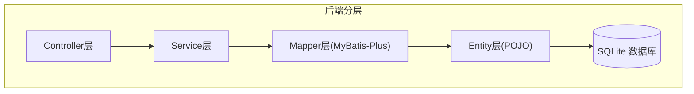
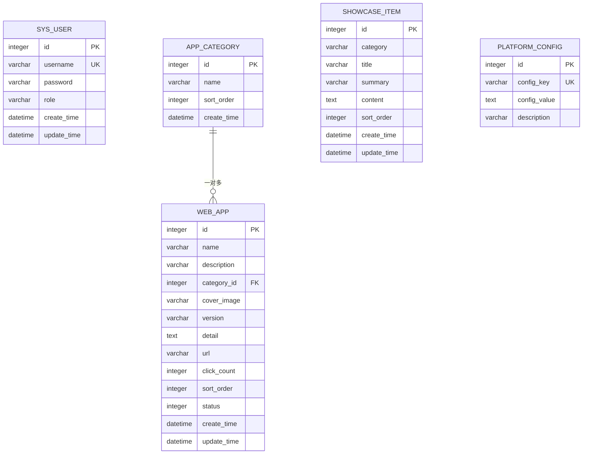
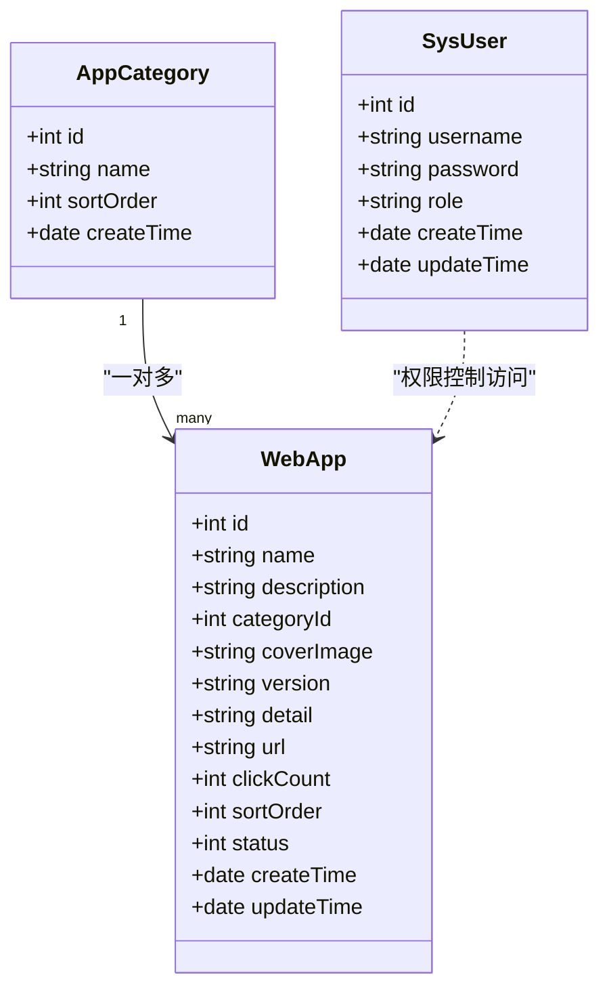
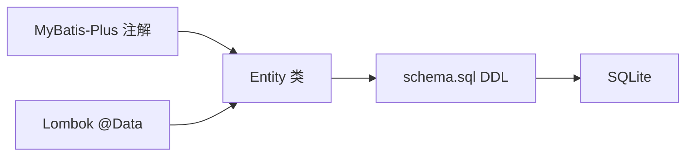

# Entity层设计

<cite>
**本文引用的文件**
- [WebApp.java](file://backend/src/main/java/com/xx/platform/entity/WebApp.java)
- [AppCategory.java](file://backend/src/main/java/com/xx/platform/entity/AppCategory.java)
- [SysUser.java](file://backend/src/main/java/com/xx/platform/entity/SysUser.java)
- [ShowcaseItem.java](file://backend/src/main/java/com/xx/platform/entity/ShowcaseItem.java)
- [PlatformConfig.java](file://backend/src/main/java/com/xx/platform/entity/PlatformConfig.java)
- [schema.sql](file://backend/src/main/resources/schema.sql)
</cite>

## 目录
1. [引言](#引言)
2. [项目结构](#项目结构)
3. [核心组件](#核心组件)
4. [架构总览](#架构总览)
5. [详细组件分析](#详细组件分析)
6. [依赖关系分析](#依赖关系分析)
7. [性能与一致性考虑](#性能与一致性考虑)
8. [故障排查指南](#故障排查指南)
9. [结论](#结论)
10. [附录](#附录)

## 引言
本文件面向JZPlatform门户系统的Entity层，系统化阐述实体类的设计原则、字段命名约定、数据类型选择、注解使用规范（@TableName、@TableId、@TableField等），并说明各实体之间的关联关系（如WebApp与AppCategory的一对多、SysUser与应用访问的权限控制）。文档同时给出实体与数据库表的映射关系、主键策略、字段约束与默认值、数据迁移策略以及验证规则与业务约束建议。

## 项目结构
后端采用分层架构：Controller → Service → Mapper → Entity → Database。Entity层位于com.xx.platform.entity包下，负责与数据库表一一对应，承载持久化模型与基础校验语义。

本节为概念性说明，不直接分析具体文件，故无“章节来源”。

## 核心组件
- WebApp：门户应用信息，包含名称、简介、分类、封面、版本、详情、链接、点击量、排序、状态及时间戳。
- AppCategory：应用分类，包含名称、排序和时间戳。
- SysUser：系统用户，包含用户名、密码、角色及时间戳。
- ShowcaseItem：宣贯展示项，包含类别、标题、摘要、内容、排序及时间戳。
- PlatformConfig：平台配置键值对，包含配置键、配置值与描述。

上述实体均使用MyBatis-Plus注解进行表映射与主键策略声明，统一遵循驼峰命名到蛇形命名的自动映射约定。

**章节来源**
- [WebApp.java:1-54](file://backend/src/main/java/com/xx/platform/entity/WebApp.java#L1-L54)
- [AppCategory.java:1-28](file://backend/src/main/java/com/xx/platform/entity/AppCategory.java#L1-L28)
- [SysUser.java:1-33](file://backend/src/main/java/com/xx/platform/entity/SysUser.java#L1-L33)
- [ShowcaseItem.java:1-40](file://backend/src/main/java/com/xx/platform/entity/ShowcaseItem.java#L1-L40)
- [PlatformConfig.java:1-28](file://backend/src/main/java/com/xx/platform/entity/PlatformConfig.java#L1-L28)

## 架构总览
下图展示了实体与数据库表的对应关系，以及关键业务关联。

**图表来源**
- [schema.sql:5-57](file://backend/src/main/resources/schema.sql#L5-L57)

**章节来源**
- [schema.sql:1-80](file://backend/src/main/resources/schema.sql#L1-L80)

## 详细组件分析

### 设计原则与规范
- 命名约定
  - Java字段使用小驼峰；数据库列使用蛇形命名，由框架自动映射。
  - 实体类名与表名通过@TableName显式绑定，避免歧义。
- 主键策略
  - 所有实体主键均为自增整数，使用@TableId(type = IdType.AUTO)。
- 字段类型
  - 文本类使用String；数值型使用Integer；时间戳使用Date。
- 注解使用
  - @TableName：指定表名。
  - @TableId：指定主键及生成策略。
  - @TableField：当需要显式指定列名或额外属性时使用（当前实现主要依赖自动映射）。
- 时间字段
  - 创建时间与更新时间在数据库中设置默认值CURRENT_TIMESTAMP；实体侧未启用自动填充，建议在Service层或拦截器中统一维护。
- 枚举与字典
  - 状态与分类以字符串或整数字段表示，建议在Service层或DTO层引入枚举/字典映射以提升可读性与可维护性。

本节为通用规范说明，不直接分析具体文件，故无“章节来源”。

### 实体类结构与约束

#### WebApp（门户应用）
- 表映射：web_app
- 主键：id（自增）
- 关键字段
  - name：应用名称，非空
  - description：功能简介，可选
  - categoryId：分类ID，外键引用app_category.id
  - coverImage：封面图片路径，可选
  - version：版本号，可选
  - detail：详细介绍，TEXT
  - url：应用链接，非空
  - clickCount：点击次数，默认0
  - sortOrder：排序序号，默认0
  - status：状态（1启用/0禁用），默认1
  - createTime/updateTime：时间戳，默认CURRENT_TIMESTAMP
- 关联关系
  - 与AppCategory为一对多：一个分类包含多个应用。
- 业务约束建议
  - name、url必填且唯一性校验（业务层面）。
  - status仅允许0或1。
  - clickCount自增时注意并发安全（见“性能与一致性考虑”）。

**章节来源**
- [WebApp.java:1-54](file://backend/src/main/java/com/xx/platform/entity/WebApp.java#L1-L54)
- [schema.sql:23-37](file://backend/src/main/resources/schema.sql#L23-L37)

#### AppCategory（应用分类）
- 表映射：app_category
- 主键：id（自增）
- 关键字段
  - name：分类名称，非空
  - sortOrder：排序序号，默认0
  - createTime：创建时间，默认CURRENT_TIMESTAMP
- 关联关系
  - 被WebApp引用，形成一对多关系。
- 业务约束建议
  - name唯一性校验（业务层面）。

**章节来源**
- [AppCategory.java:1-28](file://backend/src/main/java/com/xx/platform/entity/AppCategory.java#L1-L28)
- [schema.sql:15-20](file://backend/src/main/resources/schema.sql#L15-L20)

#### SysUser（系统用户）
- 表映射：sys_user
- 主键：id（自增）
- 关键字段
  - username：用户名，非空且唯一
  - password：密码，非空
  - role：角色（ADMIN/USER），默认USER
  - createTime/updateTime：时间戳，默认CURRENT_TIMESTAMP
- 关联关系
  - 与应用的访问关系通过权限控制体现（例如管理员可管理应用、分类、配置等）。
- 业务约束建议
  - 密码需加密存储（建议BCrypt）。
  - 登录失败次数限制与账户锁定策略可在Service层实现。

**章节来源**
- [SysUser.java:1-33](file://backend/src/main/java/com/xx/platform/entity/SysUser.java#L1-L33)
- [schema.sql:5-12](file://backend/src/main/resources/schema.sql#L5-L12)

#### ShowcaseItem（宣贯展示项）
- 表映射：showcase_item
- 主键：id（自增）
- 关键字段
  - category：类别（如USER_ECOLOGY/PRODUCT_SYSTEM/MODEL_SYSTEM/DATA_SYSTEM/IP）
  - title：标题，非空
  - summary：概览摘要，可选
  - content：详细内容，TEXT
  - sortOrder：排序序号，默认0
  - createTime/updateTime：时间戳，默认CURRENT_TIMESTAMP
- 业务约束建议
  - category限定于固定集合，建议在Service层做白名单校验。

**章节来源**
- [ShowcaseItem.java:1-40](file://backend/src/main/java/com/xx/platform/entity/ShowcaseItem.java#L1-L40)
- [schema.sql:40-49](file://backend/src/main/resources/schema.sql#L40-L49)

#### PlatformConfig（平台配置）
- 表映射：platform_config
- 主键：id（自增）
- 关键字段
  - configKey：配置键，非空且唯一
  - configValue：配置值，TEXT
  - description：配置描述，可选
- 业务约束建议
  - configKey唯一性由数据库保证；更新时应确保幂等。

**章节来源**
- [PlatformConfig.java:1-28](file://backend/src/main/java/com/xx/platform/entity/PlatformConfig.java#L1-L28)
- [schema.sql:52-57](file://backend/src/main/resources/schema.sql#L52-L57)

### 实体间关系与访问控制
- 一对多关系
  - AppCategory 与 WebApp：通过categoryId建立外键关联，一个分类可包含多个应用。
- 访问控制关系
  - SysUser 与 WebApp：通过角色（ADMIN/USER）控制应用的管理与访问权限。管理员具备应用、分类、配置等管理能力；普通用户仅具备浏览能力。

**图表来源**
- [AppCategory.java:1-28](file://backend/src/main/java/com/xx/platform/entity/AppCategory.java#L1-L28)
- [WebApp.java:1-54](file://backend/src/main/java/com/xx/platform/entity/WebApp.java#L1-L54)
- [SysUser.java:1-33](file://backend/src/main/java/com/xx/platform/entity/SysUser.java#L1-L33)

## 依赖关系分析
- 框架依赖
  - MyBatis-Plus：提供@TableName、@TableId等注解与CRUD能力。
  - Lombok：@Data自动生成getter/setter/toString等。
- 外部依赖
  - SQLite：作为嵌入式数据库，DDL定义在schema.sql中。
- 耦合与内聚
  - Entity层低耦合，仅承担数据模型职责；业务逻辑与校验下沉至Service层。
  - 通过外键与业务层共同保障数据完整性。

**图表来源**
- [WebApp.java:1-54](file://backend/src/main/java/com/xx/platform/entity/WebApp.java#L1-L54)
- [AppCategory.java:1-28](file://backend/src/main/java/com/xx/platform/entity/AppCategory.java#L1-L28)
- [SysUser.java:1-33](file://backend/src/main/java/com/xx/platform/entity/SysUser.java#L1-L33)
- [ShowcaseItem.java:1-40](file://backend/src/main/java/com/xx/platform/entity/ShowcaseItem.java#L1-L40)
- [PlatformConfig.java:1-28](file://backend/src/main/java/com/xx/platform/entity/PlatformConfig.java#L1-L28)
- [schema.sql:1-80](file://backend/src/main/resources/schema.sql#L1-L80)

**章节来源**
- [WebApp.java:1-54](file://backend/src/main/java/com/xx/platform/entity/WebApp.java#L1-L54)
- [AppCategory.java:1-28](file://backend/src/main/java/com/xx/platform/entity/AppCategory.java#L1-L28)
- [SysUser.java:1-33](file://backend/src/main/java/com/xx/platform/entity/SysUser.java#L1-L33)
- [ShowcaseItem.java:1-40](file://backend/src/main/java/com/xx/platform/entity/ShowcaseItem.java#L1-L40)
- [PlatformConfig.java:1-28](file://backend/src/main/java/com/xx/platform/entity/PlatformConfig.java#L1-L28)
- [schema.sql:1-80](file://backend/src/main/resources/schema.sql#L1-L80)

## 性能与一致性考虑
- 自增主键
  - 使用AUTO策略，适合高并发写入场景下的简单主键生成。
- 计数字段并发
  - WebApp.clickCount自增在高并发下可能出现丢失更新，建议使用数据库原子操作（如UPDATE ... SET click_count=click_count+1 WHERE id=?）或在Service层加锁/队列处理。
- 索引优化
  - 建议为常用查询字段添加索引，如web_app.category_id、web_app.status、web_app.sort_order、showcase_item.category等。
- 事务边界
  - 涉及多表写操作（如应用发布、分类变更）应在Service层开启事务，保证一致性。
- 时间字段
  - 当前DDL已设置默认CURRENT_TIMESTAMP；建议在Service层或全局拦截器统一维护update_time，避免遗漏。

本节为通用指导，不直接分析具体文件，故无“章节来源”。

## 故障排查指南
- 主键冲突
  - 现象：插入时报主键重复。
  - 排查：确认是否误用手动赋值导致重复；检查AUTOINCREMENT行为。
- 外键约束
  - 现象：删除分类时报外键约束失败。
  - 排查：先解除关联的应用记录或级联删除（若业务允许）。
- 唯一性冲突
  - 现象：用户名或配置键重复。
  - 排查：检查业务层唯一性校验与数据库UNIQUE约束。
- 时间字段未更新
  - 现象：update_time未变化。
  - 排查：确认是否在Service层或拦截器中统一更新。

本节为通用指导，不直接分析具体文件，故无“章节来源”。

## 结论
Entity层以简洁清晰的POJO形式承载数据模型，结合MyBatis-Plus注解完成表映射与主键策略。通过外键与业务层校验共同保障数据一致性与完整性。后续可在Service层完善枚举映射、参数校验、审计字段填充与并发安全策略，进一步提升系统的健壮性与可维护性。

## 附录

### 实体与表映射一览
- WebApp ↔ web_app
- AppCategory ↔ app_category
- SysUser ↔ sys_user
- ShowcaseItem ↔ showcase_item
- PlatformConfig ↔ platform_config

**章节来源**
- [WebApp.java:1-54](file://backend/src/main/java/com/xx/platform/entity/WebApp.java#L1-L54)
- [AppCategory.java:1-28](file://backend/src/main/java/com/xx/platform/entity/AppCategory.java#L1-L28)
- [SysUser.java:1-33](file://backend/src/main/java/com/xx/platform/entity/SysUser.java#L1-L33)
- [ShowcaseItem.java:1-40](file://backend/src/main/java/com/xx/platform/entity/ShowcaseItem.java#L1-L40)
- [PlatformConfig.java:1-28](file://backend/src/main/java/com/xx/platform/entity/PlatformConfig.java#L1-L28)
- [schema.sql:1-80](file://backend/src/main/resources/schema.sql#L1-L80)

### 数据迁移策略
- 初始化脚本
  - 使用schema.sql进行建表与初始数据导入。
- 增量升级
  - 新增字段或表时，编写增量SQL并在部署流程中顺序执行。
- 回滚方案
  - 保留反向SQL（DROP/ALTER）以便快速回滚。
- 环境隔离
  - 不同环境（开发/测试/生产）使用独立数据库实例，避免相互影响。

**章节来源**
- [schema.sql:1-80](file://backend/src/main/resources/schema.sql#L1-L80)