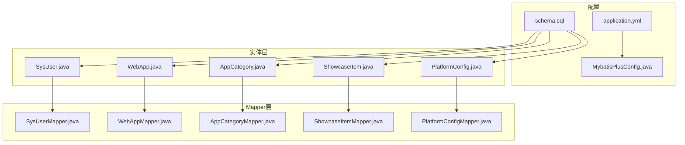
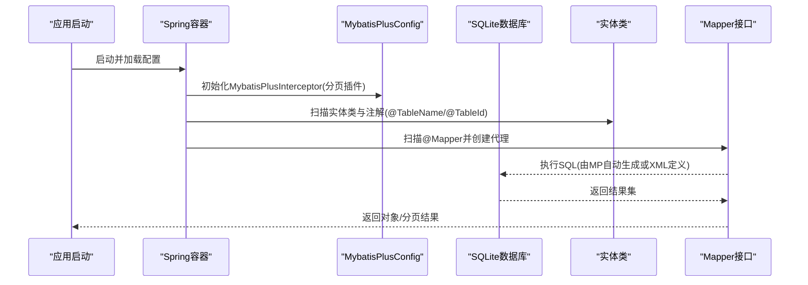
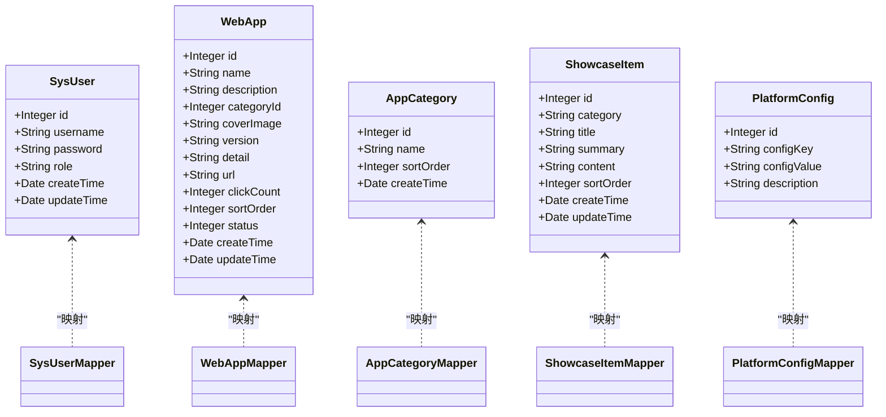
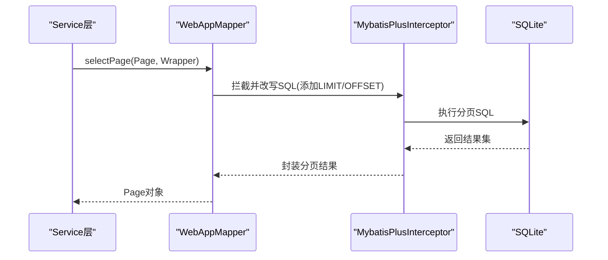

# Mapper层设计

<cite>
**本文引用的文件**   
- [WebAppMapper.java](file://backend/src/main/java/com/xx/platform/mapper/WebAppMapper.java)
- [SysUserMapper.java](file://backend/src/main/java/com/xx/platform/mapper/SysUserMapper.java)
- [AppCategoryMapper.java](file://backend/src/main/java/com/xx/platform/mapper/AppCategoryMapper.java)
- [ShowcaseItemMapper.java](file://backend/src/main/java/com/xx/platform/mapper/ShowcaseItemMapper.java)
- [PlatformConfigMapper.java](file://backend/src/main/java/com/xx/platform/mapper/PlatformConfigMapper.java)
- [WebApp.java](file://backend/src/main/java/com/xx/platform/entity/WebApp.java)
- [SysUser.java](file://backend/src/main/java/com/xx/platform/entity/SysUser.java)
- [AppCategory.java](file://backend/src/main/java/com/xx/platform/entity/AppCategory.java)
- [ShowcaseItem.java](file://backend/src/main/java/com/xx/platform/entity/ShowcaseItem.java)
- [PlatformConfig.java](file://backend/src/main/java/com/xx/platform/entity/PlatformConfig.java)
- [MybatisPlusConfig.java](file://backend/src/main/java/com/xx/platform/config/MybatisPlusConfig.java)
- [application.yml](file://backend/src/main/resources/application.yml)
- [schema.sql](file://backend/src/main/resources/schema.sql)
</cite>

## 目录
1. [引言](#引言)
2. [项目结构](#项目结构)
3. [核心组件](#核心组件)
4. [架构总览](#架构总览)
5. [详细组件分析](#详细组件分析)
6. [依赖关系分析](#依赖关系分析)
7. [性能考虑](#性能考虑)
8. [故障排查指南](#故障排查指南)
9. [结论](#结论)
10. [附录](#附录)

## 引言
本设计文档聚焦于JZPlatform门户系统的Mapper层，基于MyBatis-Plus实现ORM映射。内容涵盖：
- 实体类与数据库表的映射关系
- 基础CRUD操作的简化实现
- 自定义查询方法的编写方式
- BaseMapper接口的使用与扩展
- WebAppMapper、SysUserMapper等具体实现
- 分页查询、条件构造器、关联查询等高级用法
- 数据库连接配置与MyBatis-Plus配置项
- SQL映射示例与性能优化建议

## 项目结构
后端采用分层架构，Mapper层位于com.xx.platform.mapper包下，对应实体在com.xx.platform.entity，配置在config与resources中。

图表来源
- [application.yml:1-29](file://backend/src/main/resources/application.yml#L1-L29)
- [MybatisPlusConfig.java:1-27](file://backend/src/main/java/com/xx/platform/config/MybatisPlusConfig.java#L1-L27)
- [schema.sql:1-80](file://backend/src/main/resources/schema.sql#L1-L80)
- [SysUser.java:1-33](file://backend/src/main/java/com/xx/platform/entity/SysUser.java#L1-L33)
- [WebApp.java:1-54](file://backend/src/main/java/com/xx/platform/entity/WebApp.java#L1-L54)
- [AppCategory.java:1-28](file://backend/src/main/java/com/xx/platform/entity/AppCategory.java#L1-L28)
- [ShowcaseItem.java:1-40](file://backend/src/main/java/com/xx/platform/entity/ShowcaseItem.java#L1-L40)
- [PlatformConfig.java:1-28](file://backend/src/main/java/com/xx/platform/entity/PlatformConfig.java#L1-L28)
- [SysUserMapper.java:1-13](file://backend/src/main/java/com/xx/platform/mapper/SysUserMapper.java#L1-L13)
- [WebAppMapper.java:1-13](file://backend/src/main/java/com/xx/platform/mapper/WebAppMapper.java#L1-L13)
- [AppCategoryMapper.java:1-13](file://backend/src/main/java/com/xx/platform/mapper/AppCategoryMapper.java#L1-L13)
- [ShowcaseItemMapper.java:1-13](file://backend/src/main/java/com/xx/platform/mapper/ShowcaseItemMapper.java#L1-L13)
- [PlatformConfigMapper.java:1-13](file://backend/src/main/java/com/xx/platform/mapper/PlatformConfigMapper.java#L1-L13)

章节来源
- [application.yml:1-29](file://backend/src/main/resources/application.yml#L1-L29)
- [MybatisPlusConfig.java:1-27](file://backend/src/main/java/com/xx/platform/config/MybatisPlusConfig.java#L1-L27)
- [schema.sql:1-80](file://backend/src/main/resources/schema.sql#L1-L80)

## 核心组件
- 实体类与表映射
  - SysUser -> sys_user
  - WebApp -> web_app
  - AppCategory -> app_category
  - ShowcaseItem -> showcase_item
  - PlatformConfig -> platform_config
- 主键策略
  - 所有实体均使用自增主键（IdType.AUTO）
- 命名约定
  - 开启驼峰映射（map-underscore-to-camel-case=true），字段名与列名自动匹配
- Mapper接口
  - 各业务Mapper继承BaseMapper<T>并标注@Mapper，即可获得标准CRUD能力

章节来源
- [SysUser.java:1-33](file://backend/src/main/java/com/xx/platform/entity/SysUser.java#L1-L33)
- [WebApp.java:1-54](file://backend/src/main/java/com/xx/platform/entity/WebApp.java#L1-L54)
- [AppCategory.java:1-28](file://backend/src/main/java/com/xx/platform/entity/AppCategory.java#L1-L28)
- [ShowcaseItem.java:1-40](file://backend/src/main/java/com/xx/platform/entity/ShowcaseItem.java#L1-L40)
- [PlatformConfig.java:1-28](file://backend/src/main/java/com/xx/platform/entity/PlatformConfig.java#L1-L28)
- [SysUserMapper.java:1-13](file://backend/src/main/java/com/xx/platform/mapper/SysUserMapper.java#L1-L13)
- [WebAppMapper.java:1-13](file://backend/src/main/java/com/xx/platform/mapper/WebAppMapper.java#L1-L13)
- [AppCategoryMapper.java:1-13](file://backend/src/main/java/com/xx/platform/mapper/AppCategoryMapper.java#L1-L13)
- [ShowcaseItemMapper.java:1-13](file://backend/src/main/java/com/xx/platform/mapper/ShowcaseItemMapper.java#L1-L13)
- [PlatformConfigMapper.java:1-13](file://backend/src/main/java/com/xx/platform/mapper/PlatformConfigMapper.java#L1-L13)
- [application.yml:15-25](file://backend/src/main/resources/application.yml#L15-L25)

## 架构总览
下图展示从配置到数据访问的链路：应用通过Spring容器加载配置，注册MyBatis-Plus拦截器；实体与表通过注解建立映射；Mapper接口由Spring扫描并生成代理，提供CRUD与分页能力。

图表来源
- [MybatisPlusConfig.java:1-27](file://backend/src/main/java/com/xx/platform/config/MybatisPlusConfig.java#L1-L27)
- [application.yml:15-25](file://backend/src/main/resources/application.yml#L15-L25)
- [SysUser.java:1-33](file://backend/src/main/java/com/xx/platform/entity/SysUser.java#L1-L33)
- [WebApp.java:1-54](file://backend/src/main/java/com/xx/platform/entity/WebApp.java#L1-L54)
- [SysUserMapper.java:1-13](file://backend/src/main/java/com/xx/platform/mapper/SysUserMapper.java#L1-L13)
- [WebAppMapper.java:1-13](file://backend/src/main/java/com/xx/platform/mapper/WebAppMapper.java#L1-L13)

## 详细组件分析

### 实体与表映射关系
- 用户表sys_user
  - 字段：id, username, password, role, create_time, update_time
  - 实体：SysUser
- 应用分类表app_category
  - 字段：id, name, sort_order, create_time
  - 实体：AppCategory
- Web应用表web_app
  - 字段：id, name, description, category_id, cover_image, version, detail, url, click_count, sort_order, status, create_time, update_time
  - 实体：WebApp
- 宣贯数据表showcase_item
  - 字段：id, category, title, summary, content, sort_order, create_time, update_time
  - 实体：ShowcaseItem
- 平台配置表platform_config
  - 字段：id, config_key, config_value, description
  - 实体：PlatformConfig

章节来源
- [schema.sql:1-80](file://backend/src/main/resources/schema.sql#L1-L80)
- [SysUser.java:1-33](file://backend/src/main/java/com/xx/platform/entity/SysUser.java#L1-L33)
- [AppCategory.java:1-28](file://backend/src/main/java/com/xx/platform/entity/AppCategory.java#L1-L28)
- [WebApp.java:1-54](file://backend/src/main/java/com/xx/platform/entity/WebApp.java#L1-L54)
- [ShowcaseItem.java:1-40](file://backend/src/main/java/com/xx/platform/entity/ShowcaseItem.java#L1-L40)
- [PlatformConfig.java:1-28](file://backend/src/main/java/com/xx/platform/entity/PlatformConfig.java#L1-L28)

### BaseMapper的使用与扩展
- 基础CRUD
  - 通过继承BaseMapper<T>，可直接使用insert、updateById、deleteById、selectById、selectList、selectPage等方法
- 扩展方式
  - 在Mapper接口中声明自定义方法，并在mapper XML中提供SQL映射
  - 或使用LambdaQueryWrapper/LambdaUpdateWrapper构建动态条件

章节来源
- [SysUserMapper.java:1-13](file://backend/src/main/java/com/xx/platform/mapper/SysUserMapper.java#L1-L13)
- [WebAppMapper.java:1-13](file://backend/src/main/java/com/xx/platform/mapper/WebAppMapper.java#L1-L13)
- [AppCategoryMapper.java:1-13](file://backend/src/main/java/com/xx/platform/mapper/AppCategoryMapper.java#L1-L13)
- [ShowcaseItemMapper.java:1-13](file://backend/src/main/java/com/xx/platform/mapper/ShowcaseItemMapper.java#L1-L13)
- [PlatformConfigMapper.java:1-13](file://backend/src/main/java/com/xx/platform/mapper/PlatformConfigMapper.java#L1-L13)

### WebAppMapper与SysUserMapper实现要点
- WebAppMapper
  - 负责web_app表的CRUD
  - 可结合category_id进行关联查询（需自定义SQL或Service层组装）
- SysUserMapper
  - 负责sys_user表的CRUD
  - 常用于认证与权限校验场景

章节来源
- [WebAppMapper.java:1-13](file://backend/src/main/java/com/xx/platform/mapper/WebAppMapper.java#L1-L13)
- [SysUserMapper.java:1-13](file://backend/src/main/java/com/xx/platform/mapper/SysUserMapper.java#L1-L13)
- [WebApp.java:1-54](file://backend/src/main/java/com/xx/platform/entity/WebApp.java#L1-L54)
- [SysUser.java:1-33](file://backend/src/main/java/com/xx/platform/entity/SysUser.java#L1-L33)

### 分页查询
- 配置
  - MybatisPlusConfig中注册PaginationInnerInterceptor，指定DbType为SQLite
- 使用
  - Service层调用selectPage传入Page对象，底层自动改写SQL为SQLite的分页语法
- 注意
  - SQLite的分页行为与MySQL不同，需注意offset与limit参数顺序

章节来源
- [MybatisPlusConfig.java:1-27](file://backend/src/main/java/com/xx/platform/config/MybatisPlusConfig.java#L1-L27)
- [application.yml:15-25](file://backend/src/main/resources/application.yml#L15-L25)

### 条件构造器
- LambdaQueryWrapper
  - 支持链式构建where条件、排序、字段选择
- LambdaUpdateWrapper
  - 支持按条件更新字段
- 适用场景
  - 多条件组合查询、动态过滤、批量更新

章节来源
- [SysUserMapper.java:1-13](file://backend/src/main/java/com/xx/platform/mapper/SysUserMapper.java#L1-L13)
- [WebAppMapper.java:1-13](file://backend/src/main/java/com/xx/platform/mapper/WebAppMapper.java#L1-L13)

### 关联查询
- 当前状态
  - 未定义XML映射，无原生多表JOIN
- 推荐做法
  - 在Service层分别查询主表与字典表后组装
  - 或在Mapper接口中新增自定义方法，并在XML中编写JOIN语句

章节来源
- [WebApp.java:1-54](file://backend/src/main/java/com/xx/platform/entity/WebApp.java#L1-L54)
- [AppCategory.java:1-28](file://backend/src/main/java/com/xx/platform/entity/AppCategory.java#L1-L28)
- [WebAppMapper.java:1-13](file://backend/src/main/java/com/xx/platform/mapper/WebAppMapper.java#L1-L13)
- [AppCategoryMapper.java:1-13](file://backend/src/main/java/com/xx/platform/mapper/AppCategoryMapper.java#L1-L13)

### 数据库连接与MyBatis-Plus配置
- 数据源
  - 使用SQLite，驱动org.sqlite.JDBC，路径platform.db
- MyBatis-Plus
  - mapper-locations指向classpath:mapper/*.xml
  - map-underscore-to-camel-case开启驼峰映射
  - log-impl输出SQL日志便于调试
  - global-config.db-config.id-type=auto适配SQLite自增主键

章节来源
- [application.yml:1-29](file://backend/src/main/resources/application.yml#L1-L29)

### SQL映射示例与最佳实践
- 示例一：根据用户名查询用户
  - 在SysUserMapper中声明方法，在mapper XML中编写SELECT * FROM sys_user WHERE username = #{username}
- 示例二：启用状态下的应用列表分页
  - 在WebAppMapper中声明分页方法，XML中使用LIMIT/OFFSET
- 示例三：统计点击次数
  - 使用UPDATE web_app SET click_count = click_count + 1 WHERE id = #{id}

章节来源
- [SysUserMapper.java:1-13](file://backend/src/main/java/com/xx/platform/mapper/SysUserMapper.java#L1-L13)
- [WebAppMapper.java:1-13](file://backend/src/main/java/com/xx/platform/mapper/WebAppMapper.java#L1-L13)
- [application.yml:15-25](file://backend/src/main/resources/application.yml#L15-L25)

## 依赖关系分析

图表来源
- [SysUser.java:1-33](file://backend/src/main/java/com/xx/platform/entity/SysUser.java#L1-L33)
- [WebApp.java:1-54](file://backend/src/main/java/com/xx/platform/entity/WebApp.java#L1-L54)
- [AppCategory.java:1-28](file://backend/src/main/java/com/xx/platform/entity/AppCategory.java#L1-L28)
- [ShowcaseItem.java:1-40](file://backend/src/main/java/com/xx/platform/entity/ShowcaseItem.java#L1-L40)
- [PlatformConfig.java:1-28](file://backend/src/main/java/com/xx/platform/entity/PlatformConfig.java#L1-L28)
- [SysUserMapper.java:1-13](file://backend/src/main/java/com/xx/platform/mapper/SysUserMapper.java#L1-L13)
- [WebAppMapper.java:1-13](file://backend/src/main/java/com/xx/platform/mapper/WebAppMapper.java#L1-L13)
- [AppCategoryMapper.java:1-13](file://backend/src/main/java/com/xx/platform/mapper/AppCategoryMapper.java#L1-L13)
- [ShowcaseItemMapper.java:1-13](file://backend/src/main/java/com/xx/platform/mapper/ShowcaseItemMapper.java#L1-L13)
- [PlatformConfigMapper.java:1-13](file://backend/src/main/java/com/xx/platform/mapper/PlatformConfigMapper.java#L1-L13)

## 性能考虑
- 索引建议
  - sys_user.username添加唯一索引（已在DDL中体现）
  - web_app.status、web_app.sort_order、web_app.category_id建议加索引以加速筛选与排序
  - showcase_item.category、showcase_item.sort_order建议加索引
- 分页优化
  - 避免深层偏移（large offset），必要时使用游标分页或基于上次最大ID的下一页查询
- 查询优化
  - 仅选择必要字段，减少网络传输与反序列化开销
  - 复杂查询尽量在数据库侧完成（索引+合适SQL）
- 日志与监控
  - 开发环境开启SQL日志，生产环境关闭或降低级别
- 事务与批处理
  - 批量插入/更新使用批处理接口，减少往返次数

[本节为通用指导，不直接分析具体文件]

## 故障排查指南
- 常见问题
  - 字段未映射：检查实体字段名与表列名是否遵循驼峰规则，确认map-underscore-to-camel-case已开启
  - 主键冲突：确认id-type=auto且表结构为AUTOINCREMENT
  - 分页异常：确认已注册PaginationInnerInterceptor且DbType正确
  - 找不到XML：检查mapper-locations路径是否正确
- 定位手段
  - 开启log-impl输出SQL日志
  - 查看异常堆栈，关注SQL语法错误与参数绑定问题

章节来源
- [application.yml:15-25](file://backend/src/main/resources/application.yml#L15-L25)
- [MybatisPlusConfig.java:1-27](file://backend/src/main/java/com/xx/platform/config/MybatisPlusConfig.java#L1-L27)

## 结论
本项目Mapper层基于MyBatis-Plus实现了简洁高效的ORM映射。通过BaseMapper快速获得CRUD能力，借助分页插件与条件构造器满足常见查询需求。对于复杂关联与定制化SQL，可通过Mapper接口扩展与XML映射灵活实现。配合合理的索引与分页策略，可在SQLite环境下获得良好的性能表现。

[本节为总结性内容，不直接分析具体文件]

## 附录

### 关键流程时序图（分页查询）

图表来源
- [WebAppMapper.java:1-13](file://backend/src/main/java/com/xx/platform/mapper/WebAppMapper.java#L1-L13)
- [MybatisPlusConfig.java:1-27](file://backend/src/main/java/com/xx/platform/config/MybatisPlusConfig.java#L1-L27)
- [application.yml:15-25](file://backend/src/main/resources/application.yml#L15-L25)